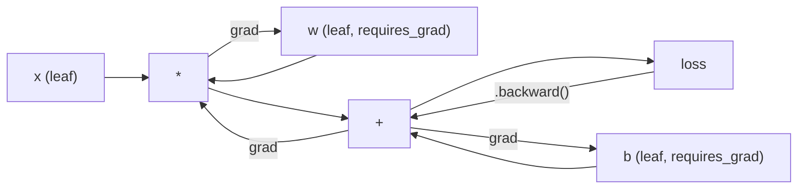
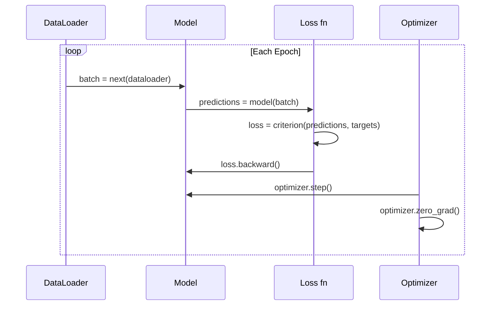

# Введение в PyTorch

> Вы собрали двигатель из поршней и коленчатых валов. Теперь изучите тот, на котором все действительно ездят.

**Тип:** Сборка
**Языки:** Python
**Предварительные требования:** Урок 03.10 (соберите собственный мини-фреймворк)
**Время:** ~75 минут

## Цели обучения

- Строить и обучать нейронные сети с помощью PyTorch `nn.Module`, `nn.Sequential` и autograd
- Использовать тензоры PyTorch, ускорение на GPU и стандартный цикл обучения (zero_grad, forward, loss, backward, step)
- Переводить компоненты вашего мини-фреймворка с нуля в их эквиваленты PyTorch
- Профилировать и сравнивать скорость обучения вашего pure-Python фреймворка и PyTorch на одной и той же задаче

## Проблема

У вас есть рабочий мини-фреймворк. Линейные слои, ReLU, dropout, batch norm, Adam, DataLoader, цикл обучения. Он обучает 4-слойную сеть на задаче классификации окружностей на чистом Python.

И при этом он в 500 раз медленнее PyTorch на той же задаче.

Ваш мини-фреймворк обрабатывает по одному примеру за раз с вложенными Python-циклами. PyTorch отправляет те же операции в оптимизированные C++/CUDA-ядра, которые выполняются на GPU. На одном NVIDIA A100 PyTorch обучает ResNet-50 (25.6M параметров) на ImageNet (1.28M изображений) примерно за 6 часов. Вашему фреймворку на той же задаче понадобилось бы примерно 3,000 часов -- если бы у него сначала не закончилась память.

Скорость -- не единственный разрыв. В вашем фреймворке нет поддержки GPU. Нет автоматического дифференцирования -- вы вручную писали backward() для каждого модуля. Нет сериализации. Нет распределенного обучения. Нет смешанной точности (mixed precision). Нет способа отлаживать поток градиентов без print-выражений.

PyTorch закрывает каждый из этих пробелов. И делает это, сохраняя ровно ту же ментальную модель, которую вы уже построили: Module, forward(), parameters(), backward(), optimizer.step(). Концепции переносятся один к одному. Синтаксис почти идентичен. Разница в том, что PyTorch оборачивает десятилетие системной инженерии за тем же интерфейсом, который вы спроектировали с нуля.

## Концепция

### Почему PyTorch победил

В 2015 году TensorFlow требовал определить статический вычислительный граф до запуска чего-либо. Вы строили граф, компилировали его, затем пропускали через него данные. Отладка означала разглядывание визуализаций графа. Изменение архитектуры означало пересборку графа с нуля.

PyTorch вышел в 2017 году с другой философией: eager execution (энергичное/немедленное выполнение). Вы пишете Python. Он выполняется сразу. `y = model(x)` действительно вычисляет y прямо сейчас, а не "добавляет узел в граф, который вычислит y позже". Это означало, что стандартные инструменты отладки Python работали. print() работал. pdb работал. if/else в вашем forward pass работали.

К 2020 году рынок высказался. Доля PyTorch в исследовательских ML-статьях выросла с 7% (2017) до более 75% (2022). Meta, Google DeepMind, OpenAI, Anthropic и Hugging Face используют PyTorch как основной фреймворк. TensorFlow 2.x в ответ принял eager execution -- молчаливое признание, что дизайн PyTorch был правильным.

Урок: developer experience (опыт разработчика) накапливает преимущество. Фреймворк, который на 10% медленнее, но на 50% быстрее отлаживается, побеждает каждый раз.

### Тензоры

Тензор -- это многомерный массив с тремя критически важными свойствами: shape, dtype и device.

```python
import torch

x = torch.zeros(3, 4)           # shape: (3, 4), dtype: float32, device: cpu
x = torch.randn(2, 3, 224, 224) # batch of 2 RGB images, 224x224
x = torch.tensor([1, 2, 3])     # from a Python list
```

**Shape** -- это размерность. Скаляр имеет shape (), вектор -- (n,), матрица -- (m, n), батч изображений -- (batch, channels, height, width).

**Dtype** управляет точностью и памятью.

| dtype | Биты | Диапазон | Сценарий использования |
|-------|------|-------|----------|
| float32 | 32 | ~7 десятичных цифр | Обучение по умолчанию |
| float16 | 16 | ~3.3 десятичных цифр | Смешанная точность |
| bfloat16 | 16 | Тот же диапазон, что у float32, меньше точность | Обучение LLM |
| int8 | 8 | -128 to 127 | Квантованный инференс |

**Device** определяет, где происходит вычисление.

```python
device = torch.device("cuda" if torch.cuda.is_available() else "cpu")
x = torch.randn(3, 4, device=device)
x = x.to("cuda")
x = x.cpu()
```

Каждая операция требует, чтобы все тензоры были на одном устройстве. Это ошибка PyTorch номер 1, на которую натыкаются начинающие: `RuntimeError: Expected all tensors to be on the same device`. Исправляется переносом всего на одно устройство до вычисления.

**Reshaping** выполняется за константное время -- меняет метаданные, а не данные.

```python
x = torch.randn(2, 3, 4)
x.view(2, 12)      # reshape to (2, 12) -- must be contiguous
x.reshape(6, 4)    # reshape to (6, 4) -- works always
x.permute(2, 0, 1) # reorder dimensions
x.unsqueeze(0)     # add dimension: (1, 2, 3, 4)
x.squeeze()        # remove size-1 dimensions
```

### Autograd

Ваш мини-фреймворк требовал реализовать backward() для каждого модуля. PyTorch этого не требует. Он записывает каждую операцию над тензорами в направленный ациклический граф (вычислительный граф), а затем проходит по этому графу в обратном направлении, чтобы автоматически вычислить градиенты.



Ключевое отличие от вашего фреймворка: PyTorch использует tape-based autodiff (автодифференцирование на основе ленты). Каждая операция добавляется на "ленту" во время прямого прохода. Вызов `.backward()` проигрывает ленту в обратном направлении.

```python
x = torch.randn(3, requires_grad=True)
y = x ** 2 + 3 * x
z = y.sum()
z.backward()
print(x.grad)  # dz/dx = 2x + 3
```

Три правила autograd:

1. Только leaf tensors с `requires_grad=True` накапливают градиенты
2. Градиенты накапливаются по умолчанию -- вызывайте `optimizer.zero_grad()` перед каждым обратным проходом
3. `torch.no_grad()` отключает отслеживание градиентов (используйте во время оценки)

### nn.Module

`nn.Module` -- базовый класс для каждого компонента нейронной сети в PyTorch. Вы уже построили эту абстракцию в Уроке 10. Версия PyTorch добавляет автоматическую регистрацию параметров, рекурсивное обнаружение модулей, управление устройствами и сериализацию state dict.

```python
import torch.nn as nn

class MLP(nn.Module):
    def __init__(self, input_dim, hidden_dim, output_dim):
        super().__init__()
        self.layer1 = nn.Linear(input_dim, hidden_dim)
        self.relu = nn.ReLU()
        self.layer2 = nn.Linear(hidden_dim, output_dim)

    def forward(self, x):
        x = self.layer1(x)
        x = self.relu(x)
        x = self.layer2(x)
        return x
```

Когда вы назначаете `nn.Module` или `nn.Parameter` атрибутом в `__init__`, PyTorch автоматически регистрирует его. `model.parameters()` рекурсивно собирает каждый зарегистрированный параметр. Поэтому вам больше не нужно вручную собирать веса, как в мини-фреймворке.

Ключевые строительные блоки:

| Модуль | Что делает | Параметры |
|--------|-------------|------------|
| nn.Linear(in, out) | Wx + b | in*out + out |
| nn.Conv2d(in_ch, out_ch, k) | 2D-свертка | in_ch*out_ch*k*k + out_ch |
| nn.BatchNorm1d(features) | Нормализует активации | 2 * features |
| nn.Dropout(p) | Случайное зануление | 0 |
| nn.ReLU() | max(0, x) | 0 |
| nn.GELU() | Gaussian Error Linear Unit | 0 |
| nn.Embedding(vocab, dim) | Таблица поиска | vocab * dim |
| nn.LayerNorm(dim) | Нормализация по каждому примеру | 2 * dim |

### Функции потерь и оптимизаторы

PyTorch поставляется с готовыми для продакшена версиями всего, что вы построили.

**Функции потерь** (из `torch.nn`):

| Функция потерь | Задача | Вход |
|------|------|-------|
| nn.MSELoss() | Регрессия | Любая форма |
| nn.CrossEntropyLoss() | Многоклассовая классификация | Логиты (не softmax) |
| nn.BCEWithLogitsLoss() | Бинарная классификация | Логиты (не sigmoid) |
| nn.L1Loss() | Регрессия (робастная) | Любая форма |
| nn.CTCLoss() | Выравнивание последовательностей | Логарифмы вероятностей |

Примечание: `CrossEntropyLoss` внутри объединяет `LogSoftmax` + `NLLLoss`. Передавайте сырые логиты, а не выходы softmax. Это распространенная ошибка, которая тихо дает неправильные градиенты.

**Оптимизаторы** (из `torch.optim`):

| Оптимизатор | Когда использовать | Типичный LR |
|-----------|-------------|-----------|
| SGD(params, lr, momentum) | CNN, хорошо настроенные пайплайны | 0.01--0.1 |
| Adam(params, lr) | Начальная точка по умолчанию | 1e-3 |
| AdamW(params, lr, weight_decay) | Трансформеры, дообучение | 1e-4--1e-3 |
| LBFGS(params) | Малый масштаб, второй порядок | 1.0 |

### Цикл обучения

Каждый цикл обучения PyTorch следует одному и тому же 5-шаговому шаблону. Вы уже знаете его из Урока 10.



Канонический шаблон:

```python
for epoch in range(num_epochs):
    model.train()
    for inputs, targets in train_loader:
        inputs, targets = inputs.to(device), targets.to(device)
        optimizer.zero_grad()
        outputs = model(inputs)
        loss = criterion(outputs, targets)
        loss.backward()
        optimizer.step()
```

Пять строк внутри цикла по батчам. Пять строк, которые обучали GPT-4, Stable Diffusion и LLaMA. Архитектура меняется. Данные меняются. Эти пять строк -- нет.

### Dataset и DataLoader

PyTorch `Dataset` -- это абстрактный класс с двумя методами: `__len__` и `__getitem__`. `DataLoader` оборачивает его батчингом, перемешиванием и многопроцессной загрузкой данных.

```python
from torch.utils.data import Dataset, DataLoader

class MNISTDataset(Dataset):
    def __init__(self, images, labels):
        self.images = images
        self.labels = labels

    def __len__(self):
        return len(self.labels)

    def __getitem__(self, idx):
        return self.images[idx], self.labels[idx]

loader = DataLoader(dataset, batch_size=64, shuffle=True, num_workers=4)
```

`num_workers=4` запускает 4 процесса для параллельной загрузки данных, пока GPU обучается на текущем батче. Для нагрузок, ограниченных диском (большие изображения, аудио), одно это может удвоить скорость обучения.

### Обучение на GPU

Перенос модели на GPU:

```python
device = torch.device("cuda" if torch.cuda.is_available() else "cpu")
model = model.to(device)
```

Это рекурсивно переносит каждый параметр и буфер на GPU. Затем переносите каждый батч во время обучения:

```python
inputs, targets = inputs.to(device), targets.to(device)
```

**Mixed precision** вдвое снижает использование памяти и удваивает пропускную способность на современных GPU (A100, H100, RTX 4090), выполняя forward/backward в float16 и сохраняя master weights в float32:

```python
from torch.amp import autocast, GradScaler

scaler = GradScaler()
for inputs, targets in loader:
    with autocast(device_type="cuda"):
        outputs = model(inputs)
        loss = criterion(outputs, targets)
    scaler.scale(loss).backward()
    scaler.step(optimizer)
    scaler.update()
    optimizer.zero_grad()
```

### Сравнение: мини-фреймворк vs PyTorch vs JAX

| Возможность | Мини-фреймворк (L10) | PyTorch | JAX |
|---------|---------------------|---------|-----|
| Autodiff | Ручной backward() | Tape-based autograd | Функциональные преобразования |
| Выполнение | Eager (Python-циклы) | Eager (C++-ядра) | Traced + JIT compiled |
| Поддержка GPU | Нет | Да (CUDA, ROCm, MPS) | Да (CUDA, TPU) |
| Скорость (MNIST MLP) | ~300s/epoch | ~0.5s/epoch | ~0.3s/epoch |
| Система модулей | Пользовательский класс Module | nn.Module | Stateless-функции (Flax/Equinox) |
| Отладка | print() | print(), pdb, breakpoint() | Сложнее (JIT tracing ломает print) |
| Экосистема | Нет | Hugging Face, Lightning, timm | Flax, Optax, Orbax |
| Кривая обучения | Вы его построили | Умеренная | Крутая (функциональная парадигма) |
| Production-использование | Игрушечные задачи | Meta, OpenAI, Anthropic, HF | Google DeepMind, Midjourney |

## Соберите это

3-слойный MLP, обученный на MNIST с использованием только примитивов PyTorch. Без высокоуровневых оберток. Без `torchvision.datasets`. Мы сами скачиваем и разбираем сырые данные.

### Шаг 1: загрузите MNIST из сырых файлов

MNIST поставляется в виде 4 gzip-файлов: обучающие изображения (60,000 x 28 x 28), обучающие метки, тестовые изображения (10,000 x 28 x 28), тестовые метки. Мы скачиваем их и разбираем бинарный формат.

```python
import torch
import torch.nn as nn
import struct
import gzip
import urllib.request
import os

def download_mnist(path="./mnist_data"):
    base_url = "https://storage.googleapis.com/cvdf-datasets/mnist/"
    files = [
        "train-images-idx3-ubyte.gz",
        "train-labels-idx1-ubyte.gz",
        "t10k-images-idx3-ubyte.gz",
        "t10k-labels-idx1-ubyte.gz",
    ]
    os.makedirs(path, exist_ok=True)
    for f in files:
        filepath = os.path.join(path, f)
        if not os.path.exists(filepath):
            urllib.request.urlretrieve(base_url + f, filepath)

def load_images(filepath):
    with gzip.open(filepath, "rb") as f:
        magic, num, rows, cols = struct.unpack(">IIII", f.read(16))
        data = f.read()
        images = torch.frombuffer(bytearray(data), dtype=torch.uint8)
        images = images.reshape(num, rows * cols).float() / 255.0
    return images

def load_labels(filepath):
    with gzip.open(filepath, "rb") as f:
        magic, num = struct.unpack(">II", f.read(8))
        data = f.read()
        labels = torch.frombuffer(bytearray(data), dtype=torch.uint8).long()
    return labels
```

### Шаг 2: определите модель

3-слойный MLP: 784 -> 256 -> 128 -> 10. Активации ReLU. Dropout для регуляризации. Без batch norm, чтобы оставить все простым.

```python
class MNISTModel(nn.Module):
    def __init__(self):
        super().__init__()
        self.net = nn.Sequential(
            nn.Linear(784, 256),
            nn.ReLU(),
            nn.Dropout(0.2),
            nn.Linear(256, 128),
            nn.ReLU(),
            nn.Dropout(0.2),
            nn.Linear(128, 10),
        )

    def forward(self, x):
        return self.net(x)
```

Выходной слой производит 10 сырых логитов (по одному на цифру). Без softmax -- `CrossEntropyLoss` обрабатывает это внутри.

Число параметров: 784*256 + 256 + 256*128 + 128 + 128*10 + 10 = 235,146. Крошечная модель по современным меркам. У GPT-2 small -- 124M. Это обучается за секунды.

### Шаг 3: цикл обучения

Канонический шаблон forward-loss-backward-step.

```python
def train_one_epoch(model, loader, criterion, optimizer, device):
    model.train()
    total_loss = 0
    correct = 0
    total = 0
    for images, labels in loader:
        images, labels = images.to(device), labels.to(device)
        optimizer.zero_grad()
        outputs = model(images)
        loss = criterion(outputs, labels)
        loss.backward()
        optimizer.step()
        total_loss += loss.item() * images.size(0)
        _, predicted = outputs.max(1)
        correct += predicted.eq(labels).sum().item()
        total += labels.size(0)
    return total_loss / total, correct / total


def evaluate(model, loader, criterion, device):
    model.eval()
    total_loss = 0
    correct = 0
    total = 0
    with torch.no_grad():
        for images, labels in loader:
            images, labels = images.to(device), labels.to(device)
            outputs = model(images)
            loss = criterion(outputs, labels)
            total_loss += loss.item() * images.size(0)
            _, predicted = outputs.max(1)
            correct += predicted.eq(labels).sum().item()
            total += labels.size(0)
    return total_loss / total, correct / total
```

Обратите внимание на `torch.no_grad()` во время оценки. Это отключает autograd, снижая использование памяти и ускоряя инференс. Без него PyTorch строит вычислительный граф, который вы никогда не используете.

### Шаг 4: соедините все вместе

```python
def main():
    device = torch.device("cuda" if torch.cuda.is_available() else "cpu")

    download_mnist()
    train_images = load_images("./mnist_data/train-images-idx3-ubyte.gz")
    train_labels = load_labels("./mnist_data/train-labels-idx1-ubyte.gz")
    test_images = load_images("./mnist_data/t10k-images-idx3-ubyte.gz")
    test_labels = load_labels("./mnist_data/t10k-labels-idx1-ubyte.gz")

    train_dataset = torch.utils.data.TensorDataset(train_images, train_labels)
    test_dataset = torch.utils.data.TensorDataset(test_images, test_labels)
    train_loader = torch.utils.data.DataLoader(
        train_dataset, batch_size=64, shuffle=True
    )
    test_loader = torch.utils.data.DataLoader(
        test_dataset, batch_size=256, shuffle=False
    )

    model = MNISTModel().to(device)
    criterion = nn.CrossEntropyLoss()
    optimizer = torch.optim.Adam(model.parameters(), lr=1e-3)

    num_params = sum(p.numel() for p in model.parameters())
    print(f"Device: {device}")
    print(f"Parameters: {num_params:,}")
    print(f"Train samples: {len(train_dataset):,}")
    print(f"Test samples: {len(test_dataset):,}")
    print()

    for epoch in range(10):
        train_loss, train_acc = train_one_epoch(
            model, train_loader, criterion, optimizer, device
        )
        test_loss, test_acc = evaluate(
            model, test_loader, criterion, device
        )
        print(
            f"Epoch {epoch+1:2d} | "
            f"Train Loss: {train_loss:.4f} | Train Acc: {train_acc:.4f} | "
            f"Test Loss: {test_loss:.4f} | Test Acc: {test_acc:.4f}"
        )

    torch.save(model.state_dict(), "mnist_mlp.pt")
    print(f"\nModel saved to mnist_mlp.pt")
    print(f"Final test accuracy: {test_acc:.4f}")
```

Ожидаемый результат после 10 эпох: ~97.8% тестовой точности. Время обучения на CPU: ~30 секунд. На GPU: ~5 секунд. На вашем мини-фреймворке с той же архитектурой: ~45 минут.

## Используйте это

### Краткое сравнение: мини-фреймворк vs PyTorch

| Мини-фреймворк (урок 10) | PyTorch |
|---------------------------|---------|
| `model = Sequential(Linear(784, 256), ReLU(), ...)` | `model = nn.Sequential(nn.Linear(784, 256), nn.ReLU(), ...)` |
| `pred = model.forward(x)` | `pred = model(x)` |
| `optimizer.zero_grad()` | `optimizer.zero_grad()` |
| `grad = criterion.backward()`, затем `model.backward(grad)` | `loss.backward()` |
| `optimizer.step()` | `optimizer.step()` |
| Нет GPU | `model.to("cuda")` |
| Ручной backward для каждого модуля | Autograd обрабатывает все |

Интерфейс почти идентичен. Разница -- во всем, что под капотом.

### Сохранение и загрузка моделей

```python
torch.save(model.state_dict(), "model.pt")

model = MNISTModel()
model.load_state_dict(torch.load("model.pt", weights_only=True))
model.eval()
```

Всегда сохраняйте `state_dict()` (словарь параметров), а не объект модели. Сохранение объекта модели использует pickle, который ломается при рефакторинге кода. State dict переносимы.

### Планирование learning rate

```python
scheduler = torch.optim.lr_scheduler.CosineAnnealingLR(
    optimizer, T_max=10
)
for epoch in range(10):
    train_one_epoch(model, train_loader, criterion, optimizer, device)
    scheduler.step()
```

PyTorch поставляется с 15+ scheduler: StepLR, ExponentialLR, CosineAnnealingLR, OneCycleLR, ReduceLROnPlateau. Все подключаются к одному и тому же интерфейсу оптимизатора.

## Доведите до результата

Этот урок производит два артефакта:

- `outputs/prompt-pytorch-debugger.md` -- промпт для диагностики распространенных сбоев обучения в PyTorch
- `outputs/skill-pytorch-patterns.md` -- справочник навыка по паттернам обучения в PyTorch

## Упражнения

1. **Добавьте batch normalization.** Вставьте `nn.BatchNorm1d` после каждого линейного слоя (до активации). Сравните тестовую точность и скорость обучения с версией только на dropout. Batch norm должен достигать 98%+ за меньшее число эпох.

2. **Реализуйте learning rate finder.** Обучайте одну эпоху с экспоненциально растущим learning rate (от 1e-7 до 1.0). Постройте график loss vs LR. Оптимальный LR находится прямо перед тем, как loss начинает расти. Используйте это, чтобы выбрать лучший LR для модели MNIST.

3. **Перенесите на GPU со смешанной точностью.** Добавьте `torch.amp.autocast` и `GradScaler` в цикл обучения. Измерьте пропускную способность (samples/second) со смешанной точностью и без нее на GPU. На A100 ожидайте ускорение ~2x.

4. **Постройте пользовательский Dataset.** Скачайте Fashion-MNIST (тот же формат, что MNIST, но с предметами одежды). Реализуйте класс `FashionMNISTDataset(Dataset)` с `__getitem__` и `__len__`. Обучите тот же MLP и сравните точность. Fashion-MNIST сложнее -- ожидайте ~88% против ~98%.

5. **Замените Adam на SGD + momentum.** Обучайте с `SGD(params, lr=0.01, momentum=0.9)`. Сравните кривые сходимости. Затем добавьте scheduler `CosineAnnealingLR` и проверьте, догонит ли SGD Adam к эпохе 10.

## Ключевые термины

| Термин | Как говорят | Что это на самом деле значит |
|------|----------------|----------------------|
| Tensor | "Многомерный массив" | Типизированный массив, осведомленный об устройстве, с поддержкой автоматического дифференцирования, встроенной в каждую операцию |
| Autograd | "Автоматический backprop" | Система на основе ленты, которая записывает операции во время прямого прохода, а затем проигрывает их в обратном порядке для вычисления точных градиентов |
| nn.Module | "Слой" | Базовый класс для любого дифференцируемого вычислительного блока -- регистрирует параметры, поддерживает вложенность, обрабатывает режимы train/eval |
| state_dict | "Веса модели" | OrderedDict, сопоставляющий имена параметров тензорам -- переносимое, сериализуемое представление обученной модели |
| .backward() | "Вычислить градиенты" | Пройти по вычислительному графу в обратном направлении, вычисляя и накапливая градиенты для каждого leaf tensor с requires_grad=True |
| .to(device) | "Перенести на GPU" | Рекурсивно перенести все параметры и буферы на указанное устройство (CPU, CUDA, MPS) |
| DataLoader | "Пайплайн данных" | Итератор, который батчит, перемешивает и опционально параллелит загрузку данных из Dataset |
| Mixed precision | "Использовать float16" | Обучать с float16 forward/backward для скорости, сохраняя float32 master weights для численной стабильности |
| Eager execution | "Выполнить сейчас" | Операции выполняются сразу при вызове, а не откладываются до последующего этапа компиляции -- ключевое дизайнерское решение, отличающее PyTorch от TF 1.x |
| zero_grad | "Сбросить градиенты" | Обнулить градиенты всех параметров перед следующим обратным проходом, поскольку PyTorch по умолчанию накапливает градиенты |

## Дополнительное чтение

- [Paszke et al., "PyTorch: An Imperative Style, High-Performance Deep Learning Library" (2019)](https://arxiv.org/abs/1912.01703) -- оригинальная статья, объясняющая дизайнерские компромиссы PyTorch
- PyTorch Tutorials: "Learning PyTorch with Examples" (https://pytorch.org/tutorials/beginner/pytorch_with_examples.html) -- официальный путь от тензоров к nn.Module
- PyTorch Performance Tuning Guide (https://pytorch.org/tutorials/recipes/recipes/tuning_guide.html) -- mixed precision, DataLoader workers, pinned memory и другие production-оптимизации
- Horace He, "Making Deep Learning Go Brrrr" (https://horace.io/brrr_intro.html) -- почему обучение на GPU быстрое, со стратегиями оптимизации специально для PyTorch
