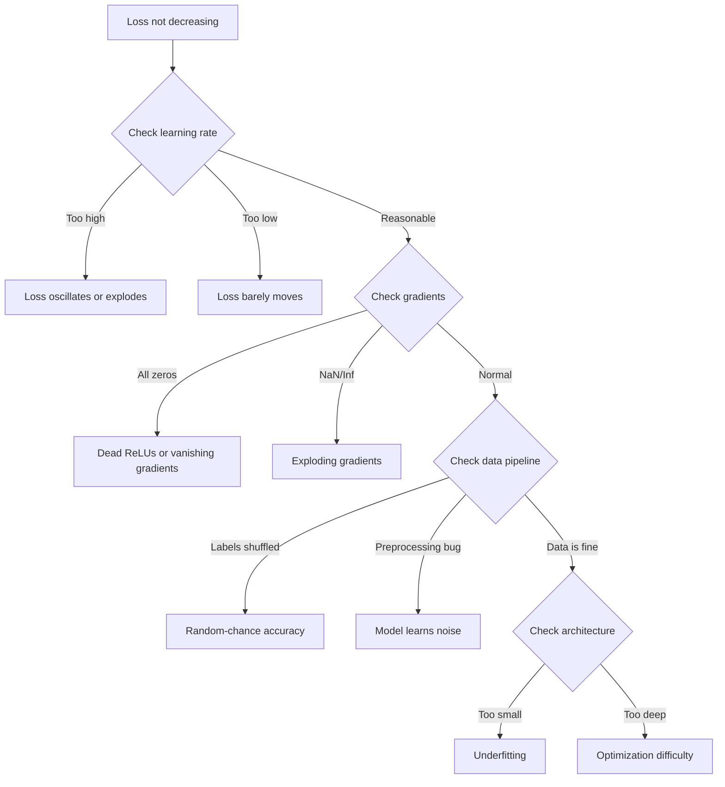
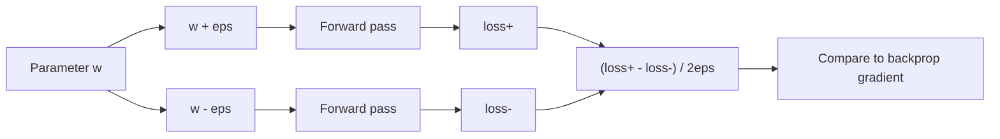
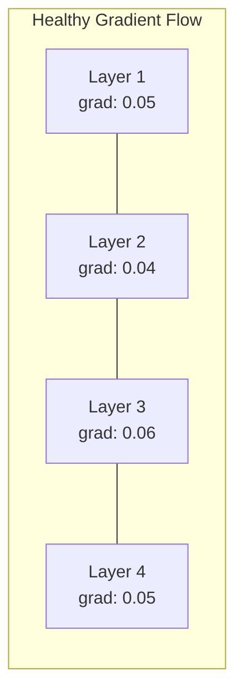
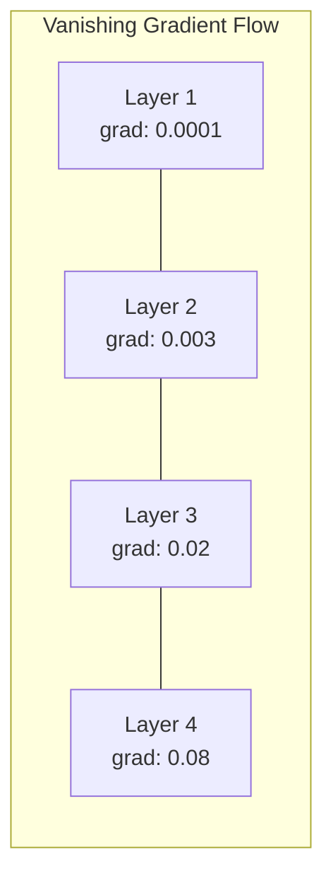
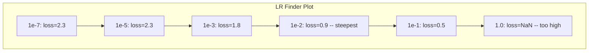

# Отладка нейронных сетей

> Ваша сеть скомпилировалась. Она запустилась. Она выдала число. Число неверное, и ничего не упало. Добро пожаловать в самый сложный вид отладки -- тот, где нет сообщения об ошибке.

**Тип:** Практика
**Языки:** Python, PyTorch
**Предварительные требования:** Фаза 03 Уроки 01-10 (особенно обратное распространение, функции потерь, оптимизаторы)
**Время:** ~90 минут

## Цели обучения

- Диагностировать распространенные сбои нейронных сетей (потеря NaN, плоская кривая потерь, переобучение, осцилляция) с помощью систематических стратегий отладки
- Применять технику "переобучить один батч" (overfit one batch), чтобы проверить корректность архитектуры модели и цикла обучения
- Изучать величины градиентов, распределения активаций и нормы весов, чтобы выявлять проблемы исчезающих/взрывающихся градиентов
- Построить чеклист отладки, который охватывает конвейер данных, архитектуру модели, функцию потерь, оптимизатор и проблемы со скоростью обучения

## Проблема

Обычное программное обеспечение падает, когда оно сломано. Нулевой указатель выбрасывает исключение. Несовпадение типов ломает сборку на этапе компиляции. Ошибка на единицу дает явно неверный вывод.

Нейронные сети такой роскоши не дают.

Сломанная нейронная сеть доходит до конца, печатает значение потерь и выдает предсказания. Потери могут уменьшаться. Предсказания могут выглядеть правдоподобно. Но модель молча ошибается -- учит обходные признаки, запоминает шум или сходится к бесполезному локальному минимуму. Исследователи Google оценивали, что 60-70% времени отладки ML уходит на "тихие" ошибки, которые не дают исключений, но ухудшают качество модели.

Разница между рабочей моделью и сломанной часто сводится к одной строке не на месте: пропущенному `zero_grad()`, транспонированной размерности, скорости обучения, ошибочной в 10 раз. Канонический текст "Recipe for Training Neural Networks" (2019) начинается с мысли: "Самые распространенные ошибки в нейросетях - это баги, которые не приводят к падению."

Этот урок учит находить такие ошибки.

## Концепция

### Мышление при отладке

Забудьте отладку в стиле "напечатать и надеяться". Отладка нейронных сетей требует системного подхода, потому что цикл обратной связи медленный (минуты или часы на один запуск обучения), а симптомы неоднозначны (плохая потеря может означать 20 разных вещей).

Золотое правило: **начинайте с простого, добавляйте сложность по одному элементу и проверяйте каждый элемент независимо.**



### Симптом 1: Потери не уменьшаются

Это самая частая жалоба. Цикл обучения работает, эпохи идут, а потери остаются плоскими или резко осциллируют.

**Неверная скорость обучения.** Слишком высокая: потери осциллируют или прыгают в NaN. Слишком низкая: потери уменьшаются так медленно, что выглядят плоскими. Для Adam начинайте с 1e-3. Для SGD начинайте с 1e-1 или 1e-2. Всегда пробуйте 3 скорости обучения с шагом 10x (например, 1e-2, 1e-3, 1e-4), прежде чем заключать, что сломано что-то еще.

**Мертвые ReLU (Dead ReLUs).** Если нейрон ReLU получает большой отрицательный вход, он выдает 0, и его градиент равен 0. Он больше никогда не активируется. Если умирает достаточно нейронов, сеть не может учиться. Проверка: печатайте долю активаций, которые ровно равны 0 после каждого слоя ReLU. Если >50% мертвы, переключитесь на LeakyReLU или уменьшите скорость обучения.

**Исчезающие градиенты (Vanishing gradients).** В глубоких сетях с активациями sigmoid или tanh градиенты экспоненциально уменьшаются при распространении назад. К моменту, когда они доходят до первого слоя, они равны ~0. Первые слои перестают учиться. Исправление: используйте ReLU/GELU, добавьте остаточные соединения или примените пакетную нормализацию.

**Взрывающиеся градиенты (Exploding gradients).** Противоположная проблема -- градиенты экспоненциально растут. Часто встречается в RNN и очень глубоких сетях. Потери прыгают в NaN. Исправление: обрезка градиентов (`torch.nn.utils.clip_grad_norm_`), более низкая скорость обучения или нормализация.

### Симптом 2: Потери уменьшаются, но модель плохая

Потери падают. Точность на обучении достигает 99%. Но точность на тесте равна 55%. Или модель выдает бессмысленные ответы на реальных данных.

**Переобучение (Overfitting).** Модель запоминает обучающие данные вместо того, чтобы учить закономерности. Разрыв между потерями на обучении и валидации со временем растет. Исправление: больше данных, dropout, weight decay, ранняя остановка, аугментация данных.

**Утечка данных (Data leakage).** Тестовые данные попали в обучение. Точность подозрительно высокая. Частые причины: перемешивание до разделения, предобработка со статистиками полного датасета, дубликаты примеров между разбиениями. Исправление: сначала разделяйте, затем предобрабатывайте, проверяйте дубликаты.

**Ошибки меток (Label errors).** 5-10% меток в большинстве реальных датасетов неверны (Northcutt et al., 2021 -- "Pervasive Label Errors in Test Sets"). Модель учит шум. Исправление: используйте confident learning, чтобы находить и исправлять неверно размеченные примеры, или используйте усечение потерь, чтобы игнорировать примеры с высокими потерями.

### Симптом 3: NaN или Inf в потерях

Значение потерь становится `nan` или `inf`. Обучение остановлено по сути.

**Слишком высокая скорость обучения.** Обновления градиентов настолько перескакивают минимум, что веса взрываются. Исправление: уменьшите в 10 раз.

**log(0) или log(negative).** Кросс-энтропийная потеря вычисляет `log(p)`. Если модель выдает ровно 0 или отрицательную вероятность, логарифм взрывается. Исправление: ограничьте предсказания диапазоном `[eps, 1-eps]`, где `eps=1e-7`.

**Деление на ноль.** Пакетная нормализация делит на стандартное отклонение. Батч с постоянными значениями имеет std=0. Исправление: добавьте epsilon в знаменатель (PyTorch делает это по умолчанию, но пользовательские реализации могут не делать).

**Численное переполнение.** Большие активации, поданные в `exp()`, дают Inf. Softmax особенно подвержен этому. Исправление: вычитайте максимум перед возведением в экспоненту (трюк log-sum-exp).

### Техника 1: Проверка градиентов

Сравните аналитические градиенты (из обратного распространения) с численными градиентами (из конечных разностей). Если они расходятся, в вашем обратном проходе есть ошибка.

Численный градиент для параметра `w`:

```
grad_numerical = (loss(w + eps) - loss(w - eps)) / (2 * eps)
```

Метрика согласия (относительная разница):

```
rel_diff = |grad_analytical - grad_numerical| / max(|grad_analytical|, |grad_numerical|, 1e-8)
```

Если `rel_diff < 1e-5`: корректно. Если `rel_diff > 1e-3`: почти наверняка ошибка.



### Техника 2: Статистика активаций

Отслеживайте среднее и стандартное отклонение активаций после каждого слоя во время обучения. Здоровые сети поддерживают активации со средним около 0 и std около 1 (после нормализации) или как минимум в ограниченном диапазоне.

| Индикатор состояния | Среднее | Std | Диагноз |
|-----------------|------|-----|-----------|
| Здорово | ~0 | ~1 | Сеть учится нормально |
| Насыщено | >>0 or <<0 | ~0 | Активации застряли на крайних значениях |
| Мертво | 0 | 0 | Нейроны мертвы (все нули) |
| Взрывается | >>10 | >>10 | Активации растут без ограничений |

### Техника 3: Визуализация потока градиентов

Постройте среднюю величину градиента для каждого слоя. В здоровой сети величины градиентов должны быть примерно похожи между слоями. Если ранние слои имеют градиенты в 1000x меньше, чем поздние слои, у вас исчезающие градиенты.





### Техника 4: Тест переобучения на одном батче

Самая важная техника отладки в глубоком обучении.

Возьмите один небольшой батч (8-32 примера). Обучайте на нем 100+ итераций. Потери должны приблизиться почти к нулю, а точность на обучении должна достичь 100%. Если этого не происходит, в модели или цикле обучения есть фундаментальная ошибка -- не переходите к полному обучению.

Этот тест ловит:
- Сломанные функции потерь
- Сломанные обратные проходы
- Архитектуру, слишком маленькую для представления данных
- Оптимизатор, не подключенный к параметрам модели
- Несогласованные данные и метки

Он выполняется за 30 секунд и экономит часы отладки полных запусков обучения.

### Техника 5: Поиск скорости обучения

Leslie Smith (2017) предложил прогонять скорость обучения от очень маленькой (1e-7) до очень большой (10) за одну эпоху, записывая потери. Постройте график потерь против скорости обучения. Оптимальная скорость обучения примерно в 10x меньше скорости, при которой потери начинают убывать быстрее всего.



Лучшая LR в этом примере: ~1e-3 (на один порядок до самой крутой точки).

### Распространенные ошибки PyTorch

Это ошибки, которые суммарно отнимают больше всего часов у сообщества PyTorch:

| Ошибка | Симптом | Исправление |
|-----|---------|-----|
| Забыли `optimizer.zero_grad()` | Градиенты накапливаются между батчами, потери осциллируют | Добавьте `optimizer.zero_grad()` перед `loss.backward()` |
| Забыли `model.eval()` во время теста | Dropout и batch norm ведут себя иначе, тестовая точность меняется между запусками | Добавьте `model.eval()` и `torch.no_grad()` |
| Неверные формы тензоров | Тихий broadcasting дает неверные результаты без ошибки | Печатайте формы после каждой операции во время отладки |
| Несовпадение CPU/GPU | `RuntimeError: expected CUDA tensor` | Используйте `.to(device)` для модели И данных |
| Тензоры не отсоединены | Граф вычислений растет бесконечно, OOM | Используйте `.detach()` или `with torch.no_grad()` |
| In-place операции ломают autograd | `RuntimeError: modified by in-place operation` | Замените `x += 1` на `x = x + 1` |
| Данные не нормализованы | Потери застряли на уровне случайного угадывания | Нормализуйте входы до mean=0, std=1 |
| Метки неверного dtype | Cross-entropy ожидает `Long`, получила `Float` | Приведите метки: `labels.long()` |

### Главная таблица отладки

| Симптом | Вероятная причина | Что попробовать первым |
|---------|-------------|-------------------|
| Потеря застряла на -log(1/num_classes) | Модель предсказывает равномерное распределение | Проверьте конвейер данных, убедитесь, что метки соответствуют входам |
| Потеря становится NaN после нескольких шагов | Слишком высокая скорость обучения | Уменьшите LR в 10 раз |
| Потеря сразу становится NaN | log(0) или деление на ноль | Добавьте epsilon в операции log/деления |
| Потеря сильно осциллирует | LR слишком высока или размер батча слишком мал | Уменьшите LR, увеличьте размер батча |
| Потеря уменьшается, затем выходит на плато | LR слишком высока для фазы дообучения | Добавьте расписание LR (cosine или step decay) |
| Training acc высокая, test acc низкая | Переобучение | Добавьте dropout, weight decay, больше данных |
| Training acc = test acc = chance | Модель вообще не учится | Запустите тест overfit-one-batch |
| Training acc = test acc, но обе низкие | Недообучение | Более крупная модель, больше слоев, больше признаков |
| Все градиенты равны нулю | Мертвые ReLU или отсоединенный граф вычислений | Переключитесь на LeakyReLU, проверьте `.requires_grad` |
| Out of memory во время обучения | Батч слишком большой или граф не освобождается | Уменьшите размер батча, используйте `torch.no_grad()` для eval |

## Постройте это

Диагностический набор инструментов, который отслеживает активации, градиенты и кривые потерь. Вы намеренно сломаете сеть и используете набор инструментов, чтобы диагностировать каждую проблему.

### Шаг 1: Класс NetworkDebugger

Подключается хуками к модели PyTorch, чтобы записывать статистику активаций и градиентов по слоям.

```python
import torch
import torch.nn as nn
import math


class NetworkDebugger:
    def __init__(self, model):
        self.model = model
        self.activation_stats = {}
        self.gradient_stats = {}
        self.loss_history = []
        self.lr_losses = []
        self.hooks = []
        self._register_hooks()

    def _register_hooks(self):
        for name, module in self.model.named_modules():
            if isinstance(module, (nn.Linear, nn.Conv2d, nn.ReLU, nn.LeakyReLU)):
                hook = module.register_forward_hook(self._make_activation_hook(name))
                self.hooks.append(hook)
                hook = module.register_full_backward_hook(self._make_gradient_hook(name))
                self.hooks.append(hook)

    def _make_activation_hook(self, name):
        def hook(module, input, output):
            with torch.no_grad():
                out = output.detach().float()
                self.activation_stats[name] = {
                    "mean": out.mean().item(),
                    "std": out.std().item(),
                    "fraction_zero": (out == 0).float().mean().item(),
                    "min": out.min().item(),
                    "max": out.max().item(),
                }
        return hook

    def _make_gradient_hook(self, name):
        def hook(module, grad_input, grad_output):
            if grad_output[0] is not None:
                with torch.no_grad():
                    grad = grad_output[0].detach().float()
                    self.gradient_stats[name] = {
                        "mean": grad.mean().item(),
                        "std": grad.std().item(),
                        "abs_mean": grad.abs().mean().item(),
                        "max": grad.abs().max().item(),
                    }
        return hook

    def record_loss(self, loss_value):
        self.loss_history.append(loss_value)

    def check_loss_health(self):
        if len(self.loss_history) < 2:
            return "NOT_ENOUGH_DATA"
        recent = self.loss_history[-10:]
        if any(math.isnan(v) or math.isinf(v) for v in recent):
            return "NAN_OR_INF"
        if len(self.loss_history) >= 20:
            first_half = sum(self.loss_history[:10]) / 10
            second_half = sum(self.loss_history[-10:]) / 10
            if second_half >= first_half * 0.99:
                return "NOT_DECREASING"
        if len(recent) >= 5:
            diffs = [recent[i+1] - recent[i] for i in range(len(recent)-1)]
            if max(diffs) - min(diffs) > 2 * abs(sum(diffs) / len(diffs)):
                return "OSCILLATING"
        return "HEALTHY"

    def check_activations(self):
        issues = []
        for name, stats in self.activation_stats.items():
            if stats["fraction_zero"] > 0.5:
                issues.append(f"DEAD_NEURONS: {name} has {stats['fraction_zero']:.0%} zero activations")
            if abs(stats["mean"]) > 10:
                issues.append(f"EXPLODING_ACTIVATIONS: {name} mean={stats['mean']:.2f}")
            if stats["std"] < 1e-6:
                issues.append(f"COLLAPSED_ACTIVATIONS: {name} std={stats['std']:.2e}")
        return issues if issues else ["HEALTHY"]

    def check_gradients(self):
        issues = []
        grad_magnitudes = []
        for name, stats in self.gradient_stats.items():
            grad_magnitudes.append((name, stats["abs_mean"]))
            if stats["abs_mean"] < 1e-7:
                issues.append(f"VANISHING_GRADIENT: {name} abs_mean={stats['abs_mean']:.2e}")
            if stats["abs_mean"] > 100:
                issues.append(f"EXPLODING_GRADIENT: {name} abs_mean={stats['abs_mean']:.2e}")
        if len(grad_magnitudes) >= 2:
            first_mag = grad_magnitudes[0][1]
            last_mag = grad_magnitudes[-1][1]
            if last_mag > 0 and first_mag / last_mag > 100:
                issues.append(f"GRADIENT_RATIO: first/last = {first_mag/last_mag:.0f}x (vanishing)")
        return issues if issues else ["HEALTHY"]

    def print_report(self):
        print("\n=== NETWORK DEBUGGER REPORT ===")
        print(f"\nLoss health: {self.check_loss_health()}")
        if self.loss_history:
            print(f"  Last 5 losses: {[f'{v:.4f}' for v in self.loss_history[-5:]]}")
        print("\nActivation diagnostics:")
        for item in self.check_activations():
            print(f"  {item}")
        print("\nGradient diagnostics:")
        for item in self.check_gradients():
            print(f"  {item}")
        print("\nPer-layer activation stats:")
        for name, stats in self.activation_stats.items():
            print(f"  {name}: mean={stats['mean']:.4f} std={stats['std']:.4f} zero={stats['fraction_zero']:.1%}")
        print("\nPer-layer gradient stats:")
        for name, stats in self.gradient_stats.items():
            print(f"  {name}: abs_mean={stats['abs_mean']:.2e} max={stats['max']:.2e}")

    def remove_hooks(self):
        for hook in self.hooks:
            hook.remove()
        self.hooks.clear()
```

### Шаг 2: Тест переобучения на одном батче

```python
def overfit_one_batch(model, x_batch, y_batch, criterion, lr=0.01, steps=200):
    optimizer = torch.optim.Adam(model.parameters(), lr=lr)
    model.train()
    print("\n=== OVERFIT ONE BATCH TEST ===")
    print(f"Batch size: {x_batch.shape[0]}, Steps: {steps}")

    for step in range(steps):
        optimizer.zero_grad()
        output = model(x_batch)
        loss = criterion(output, y_batch)
        loss.backward()
        optimizer.step()

        if step % 50 == 0 or step == steps - 1:
            with torch.no_grad():
                preds = (output > 0).float() if output.shape[-1] == 1 else output.argmax(dim=1)
                targets = y_batch if y_batch.dim() == 1 else y_batch.squeeze()
                acc = (preds.squeeze() == targets).float().mean().item()
            print(f"  Step {step:3d} | Loss: {loss.item():.6f} | Accuracy: {acc:.1%}")

    final_loss = loss.item()
    if final_loss > 0.1:
        print(f"\n  FAIL: Loss did not converge ({final_loss:.4f}). Model or training loop is broken.")
        return False
    print(f"\n  PASS: Loss converged to {final_loss:.6f}")
    return True
```

### Шаг 3: Поиск скорости обучения

```python
def find_learning_rate(model, x_data, y_data, criterion, start_lr=1e-7, end_lr=10, steps=100):
    import copy
    original_state = copy.deepcopy(model.state_dict())
    optimizer = torch.optim.SGD(model.parameters(), lr=start_lr)
    lr_mult = (end_lr / start_lr) ** (1 / steps)

    model.train()
    results = []
    best_loss = float("inf")
    current_lr = start_lr

    print("\n=== LEARNING RATE FINDER ===")

    for step in range(steps):
        optimizer.zero_grad()
        output = model(x_data)
        loss = criterion(output, y_data)

        if math.isnan(loss.item()) or loss.item() > best_loss * 10:
            break

        best_loss = min(best_loss, loss.item())
        results.append((current_lr, loss.item()))

        loss.backward()
        optimizer.step()

        current_lr *= lr_mult
        for param_group in optimizer.param_groups:
            param_group["lr"] = current_lr

    model.load_state_dict(original_state)

    if len(results) < 10:
        print("  Could not complete LR sweep -- loss diverged too quickly")
        return results

    min_loss_idx = min(range(len(results)), key=lambda i: results[i][1])
    suggested_lr = results[max(0, min_loss_idx - 10)][0]

    print(f"  Swept {len(results)} steps from {start_lr:.0e} to {results[-1][0]:.0e}")
    print(f"  Minimum loss {results[min_loss_idx][1]:.4f} at lr={results[min_loss_idx][0]:.2e}")
    print(f"  Suggested learning rate: {suggested_lr:.2e}")

    return results
```

### Шаг 4: Проверка градиентов

```python
def _flat_to_multi_index(flat_idx, shape):
    multi_idx = []
    remaining = flat_idx
    for dim in reversed(shape):
        multi_idx.insert(0, remaining % dim)
        remaining //= dim
    return tuple(multi_idx)


def gradient_check(model, x, y, criterion, eps=1e-4):
    model.train()
    x_double = x.double()
    y_double = y.double()
    model_double = model.double()

    print("\n=== GRADIENT CHECK ===")
    overall_max_diff = 0
    checked = 0

    for name, param in model_double.named_parameters():
        if not param.requires_grad:
            continue

        layer_max_diff = 0

        model_double.zero_grad()
        output = model_double(x_double)
        loss = criterion(output, y_double)
        loss.backward()
        analytical_grad = param.grad.clone()

        num_checks = min(5, param.numel())
        for i in range(num_checks):
            idx = _flat_to_multi_index(i, param.shape)
            original = param.data[idx].item()

            param.data[idx] = original + eps
            with torch.no_grad():
                loss_plus = criterion(model_double(x_double), y_double).item()

            param.data[idx] = original - eps
            with torch.no_grad():
                loss_minus = criterion(model_double(x_double), y_double).item()

            param.data[idx] = original

            numerical = (loss_plus - loss_minus) / (2 * eps)
            analytical = analytical_grad[idx].item()

            denom = max(abs(numerical), abs(analytical), 1e-8)
            rel_diff = abs(numerical - analytical) / denom

            layer_max_diff = max(layer_max_diff, rel_diff)
            checked += 1

        overall_max_diff = max(overall_max_diff, layer_max_diff)
        status = "OK" if layer_max_diff < 1e-5 else "MISMATCH"
        print(f"  {name}: max_rel_diff={layer_max_diff:.2e} [{status}]")

    model.float()

    print(f"\n  Checked {checked} parameters")
    if overall_max_diff < 1e-5:
        print("  PASS: Gradients match (rel_diff < 1e-5)")
    elif overall_max_diff < 1e-3:
        print("  WARN: Small differences (1e-5 < rel_diff < 1e-3)")
    else:
        print("  FAIL: Gradient mismatch detected (rel_diff > 1e-3)")
    return overall_max_diff
```

### Шаг 5: Намеренно сломанные сети

Теперь примените набор инструментов к сломанным сетям и диагностируйте каждую из них.

```python
def demo_broken_networks():
    torch.manual_seed(42)
    x = torch.randn(64, 10)
    y = (x[:, 0] > 0).long()

    print("\n" + "=" * 60)
    print("BUG 1: Learning rate too high (lr=10)")
    print("=" * 60)
    model1 = nn.Sequential(nn.Linear(10, 32), nn.ReLU(), nn.Linear(32, 2))
    debugger1 = NetworkDebugger(model1)
    optimizer1 = torch.optim.SGD(model1.parameters(), lr=10.0)
    criterion = nn.CrossEntropyLoss()
    for step in range(20):
        optimizer1.zero_grad()
        out = model1(x)
        loss = criterion(out, y)
        debugger1.record_loss(loss.item())
        loss.backward()
        optimizer1.step()
    debugger1.print_report()
    debugger1.remove_hooks()

    print("\n" + "=" * 60)
    print("BUG 2: Dead ReLUs from bad initialization")
    print("=" * 60)
    model2 = nn.Sequential(nn.Linear(10, 32), nn.ReLU(), nn.Linear(32, 32), nn.ReLU(), nn.Linear(32, 2))
    with torch.no_grad():
        for m in model2.modules():
            if isinstance(m, nn.Linear):
                m.weight.fill_(-1.0)
                m.bias.fill_(-5.0)
    debugger2 = NetworkDebugger(model2)
    optimizer2 = torch.optim.Adam(model2.parameters(), lr=1e-3)
    for step in range(50):
        optimizer2.zero_grad()
        out = model2(x)
        loss = criterion(out, y)
        debugger2.record_loss(loss.item())
        loss.backward()
        optimizer2.step()
    debugger2.print_report()
    debugger2.remove_hooks()

    print("\n" + "=" * 60)
    print("BUG 3: Missing zero_grad (gradients accumulate)")
    print("=" * 60)
    model3 = nn.Sequential(nn.Linear(10, 32), nn.ReLU(), nn.Linear(32, 2))
    debugger3 = NetworkDebugger(model3)
    optimizer3 = torch.optim.SGD(model3.parameters(), lr=0.01)
    for step in range(50):
        out = model3(x)
        loss = criterion(out, y)
        debugger3.record_loss(loss.item())
        loss.backward()
        optimizer3.step()
    debugger3.print_report()
    debugger3.remove_hooks()

    print("\n" + "=" * 60)
    print("HEALTHY NETWORK: Correct setup for comparison")
    print("=" * 60)
    model_good = nn.Sequential(nn.Linear(10, 32), nn.ReLU(), nn.Linear(32, 2))
    debugger_good = NetworkDebugger(model_good)
    optimizer_good = torch.optim.Adam(model_good.parameters(), lr=1e-3)
    for step in range(50):
        optimizer_good.zero_grad()
        out = model_good(x)
        loss = criterion(out, y)
        debugger_good.record_loss(loss.item())
        loss.backward()
        optimizer_good.step()
    debugger_good.print_report()
    debugger_good.remove_hooks()

    print("\n" + "=" * 60)
    print("OVERFIT-ONE-BATCH TEST (healthy model)")
    print("=" * 60)
    model_test = nn.Sequential(nn.Linear(10, 32), nn.ReLU(), nn.Linear(32, 2))
    overfit_one_batch(model_test, x[:8], y[:8], criterion)

    print("\n" + "=" * 60)
    print("LEARNING RATE FINDER")
    print("=" * 60)
    model_lr = nn.Sequential(nn.Linear(10, 32), nn.ReLU(), nn.Linear(32, 2))
    find_learning_rate(model_lr, x, y, criterion)

    print("\n" + "=" * 60)
    print("GRADIENT CHECK")
    print("=" * 60)
    model_grad = nn.Sequential(nn.Linear(10, 8), nn.ReLU(), nn.Linear(8, 2))
    gradient_check(model_grad, x[:4], y[:4], criterion)
```

### Ожидаемый вывод

Запустите `code/debug_neural_nets.py` — последние строки должны быть такими:

```
=== GRADIENT CHECK ===
  0.weight: max_rel_diff=1.03e-08 [OK]
  0.bias: max_rel_diff=5.05e-09 [OK]
  2.weight: max_rel_diff=3.93e-12 [OK]
  2.bias: max_rel_diff=1.94e-13 [OK]

  Checked 14 parameters
  PASS: Gradients match (rel_diff < 1e-5)
```

## Используйте это

### Встроенные инструменты PyTorch

```python
import torch
import torch.nn as nn

model = nn.Sequential(
    nn.Linear(768, 256),
    nn.ReLU(),
    nn.Linear(256, 10),
)

with torch.autograd.detect_anomaly():
    output = model(input_tensor)
    loss = criterion(output, target)
    loss.backward()

for name, param in model.named_parameters():
    if param.grad is not None:
        print(f"{name}: grad_mean={param.grad.abs().mean():.2e}")
```

### Интеграция с Weights & Biases

```python
import wandb

wandb.init(project="debug-training")

for epoch in range(100):
    loss = train_one_epoch()
    wandb.log({
        "loss": loss,
        "lr": optimizer.param_groups[0]["lr"],
        "grad_norm": torch.nn.utils.clip_grad_norm_(model.parameters(), float("inf")),
    })

    for name, param in model.named_parameters():
        if param.grad is not None:
            wandb.log({f"grad/{name}": wandb.Histogram(param.grad.cpu().numpy())})
```

### TensorBoard

```python
from torch.utils.tensorboard import SummaryWriter

writer = SummaryWriter("runs/debug_experiment")

for epoch in range(100):
    loss = train_one_epoch()
    writer.add_scalar("Loss/train", loss, epoch)

    for name, param in model.named_parameters():
        writer.add_histogram(f"weights/{name}", param, epoch)
        if param.grad is not None:
            writer.add_histogram(f"gradients/{name}", param.grad, epoch)
```

### Чеклист отладки (перед полным обучением)

1. Запустите тест overfit-one-batch. Если он проваливается, остановитесь.
2. Напечатайте сводку модели -- проверьте, что число параметров разумно.
3. Запустите один прямой проход со случайными данными -- проверьте форму выхода.
4. Обучайте 5 эпох -- убедитесь, что потери уменьшаются.
5. Проверьте статистику активаций -- нет мертвых слоев, нет взрывов.
6. Проверьте поток градиентов -- нет исчезновения, нет взрыва.
7. Проверьте конвейер данных -- напечатайте 5 случайных примеров с метками.

## Доведите до результата

Этот урок создает:
- `outputs/prompt-nn-debugger.md` -- промпт для диагностики сбоев обучения нейронных сетей
- `outputs/skill-debug-checklist.md` -- чеклист в виде дерева решений для отладки проблем обучения

Ключевые паттерны внедрения для отладки:
- Добавляйте хуки мониторинга в production-скрипты обучения
- Логируйте статистику активаций и градиентов в W&B или TensorBoard каждые N шагов
- Реализуйте автоматические оповещения для потерь NaN, мертвых нейронов (>80% нулей) или взрыва градиентов
- Всегда запускайте тест overfit-one-batch при изменении архитектур или конвейеров данных

## Упражнения

1. **Добавьте детектор взрывающихся градиентов.** Измените `NetworkDebugger`, чтобы он обнаруживал, когда градиенты превышают порог, и автоматически предлагал значение для gradient clipping. Проверьте его на 20-слойной сети без нормализации.

2. **Постройте восстановитель мертвых нейронов.** Напишите функцию, которая находит мертвые нейроны ReLU (всегда выдающие 0) и переинициализирует их входящие веса инициализацией Kaiming. Покажите, что это восстанавливает сеть, где >70% нейронов мертвы.

3. **Реализуйте поиск скорости обучения с построением графика.** Расширьте `find_learning_rate`, чтобы сохранять результаты как CSV, и напишите отдельный скрипт, который читает CSV и отображает кривую LR vs loss с помощью matplotlib. Определите оптимальную LR для ResNet-18 на CIFAR-10.

4. **Создайте валидатор конвейера данных.** Напишите функцию, которая проверяет: дубликаты примеров между train/test разбиениями, дисбаланс распределения меток (соотношение >10:1), нормализацию входов (среднее около 0, std около 1) и значения NaN/Inf в данных. Запустите ее на намеренно испорченном датасете.

5. **Отладьте реальный сбой.** Возьмите мини-фреймворк из Урока 10, внесите тонкую ошибку (например, транспонируйте матрицу весов в backward) и используйте проверку градиентов, чтобы точно найти параметр с неверными градиентами. Задокументируйте процесс отладки.

<details>
<summary>Решение — упражнение 4</summary>

```python
import numpy as np
def validate(X, y, X_test):
    dup = len(set(map(tuple, X)) & set(map(tuple, X_test)))
    if dup: print(f"  {dup} samples leak across train/test")
    counts = np.bincount(y)
    if counts.max() / max(counts.min(), 1) > 10: print("  label imbalance > 10:1")
    if abs(X.mean()) > 0.1 or abs(X.std() - 1) > 0.3:
        print(f"  not normalized: mean={X.mean():.2f} std={X.std():.2f}")
    if not np.isfinite(X).all(): print("  NaN/Inf in inputs")
```

Запускайте до обучения. Утечка train/test завышает accuracy, дисбаланс >10:1 смещает модель к мажоритарному классу, ненормализованные входы замедляют или ломают оптимизацию, а один NaN/Inf тихо отравляет все градиенты ниже по графу. Дешево прогнать — экономит часы погони за «багом модели», который на деле баг данных.

</details>

## Ключевые термины

| Термин | Как говорят люди | Что это на самом деле значит |
|------|----------------|----------------------|
| Silent bug | "Запускается, но дает плохие результаты" | Ошибка, которая не выдает исключений, но ухудшает качество модели -- доминирующий режим сбоев в ML |
| Dead ReLU | "Нейроны умерли" | Нейрон ReLU, вход которого всегда отрицателен, поэтому он выдает 0 и постоянно получает 0 градиента |
| Vanishing gradients | "Ранние слои перестают учиться" | Градиенты экспоненциально уменьшаются через слои, фактически замораживая веса в ранних слоях |
| Exploding gradients | "Потери ушли в NaN" | Градиенты экспоненциально растут через слои, вызывая настолько большие обновления весов, что возникает переполнение |
| Gradient checking | "Проверить, что backprop корректен" | Сравнение аналитических градиентов из backprop с численными градиентами из конечных разностей |
| Overfit-one-batch | "Самый важный тест отладки" | Обучение на одном маленьком батче, чтобы проверить, что модель МОЖЕТ учиться -- если не может, что-то фундаментально сломано |
| LR finder | "Прогон, чтобы найти правильную скорость обучения" | Экспоненциальное увеличение скорости обучения за одну эпоху и выбор значения прямо перед расходимостью потерь |
| Data leakage | "Тестовые данные просочились в обучение" | Ситуация, когда информация из тестового набора загрязняет обучение, давая искусственно высокую точность |
| Activation statistics | "Мониторить здоровье слоев" | Отслеживание среднего, std и доли нулей в выходе каждого слоя для обнаружения мертвых, насыщенных или взрывающихся нейронов |
| Gradient clipping | "Ограничить величину градиента" | Масштабирование градиентов вниз, когда их норма превышает порог, чтобы предотвратить взрывающиеся обновления градиентов |

## Дополнительное чтение

- [Smith, "Cyclical Learning Rates for Training Neural Networks" (2017)](https://arxiv.org/abs/1506.01186) -- статья, вводящая тест диапазона скорости обучения (LR finder)
- [Northcutt et al., "Pervasive Label Errors in Test Sets Destabilize Machine Learning Benchmarks" (2021)](https://arxiv.org/abs/2103.14749) -- показывает, что 3-6% меток в ImageNet, CIFAR-10 и других крупных бенчмарках неверны
- [Zhang et al., "Understanding Deep Learning Requires Rethinking Generalization" (2017)](https://arxiv.org/abs/1611.03530) -- статья, показывающая, что нейронные сети могут запоминать случайные метки, поэтому тест overfit-one-batch работает
- Документация PyTorch по `torch.autograd.detect_anomaly` и `torch.autograd.set_detect_anomaly` для встроенного обнаружения NaN/Inf
