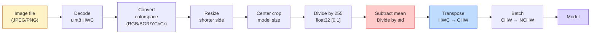
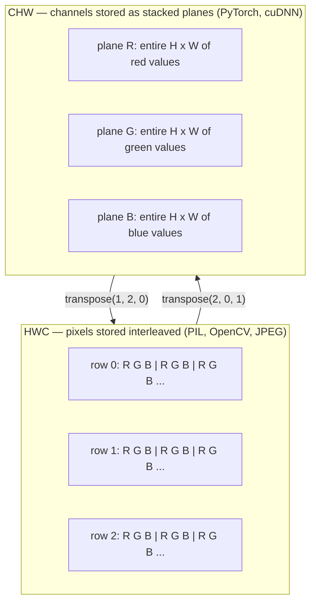

# Основы изображений — пиксели, каналы, цветовые пространства

> Изображение — это тензор отсчетов света. Каждая модель компьютерного зрения, с которой вы когда-либо будете работать, начинается с этого факта.

**Тип:** Build
**Языки:** Python
**Предварительные требования:** Phase 1 Lesson 12 (Tensor Operations), Phase 3 Lesson 11 (Intro to PyTorch)
**Время:** ~45 минут

## Цели обучения

- Объяснять, как непрерывная сцена дискретизируется в пиксели и почему решения о семплировании и квантовании задают верхнюю границу качества для любой последующей модели
- Читать, срезать и исследовать изображения как массивы NumPy и свободно переключаться между раскладками HWC и CHW
- Преобразовывать между RGB, grayscale, HSV и YCbCr и обосновывать, зачем существует каждое цветовое пространство
- Применять попиксельную предобработку (нормализацию, стандартизацию, изменение размера, channel-first) ровно так, как этого ожидает torchvision

## Проблема

Каждая статья, которую вы будете читать, каждый набор предобученных весов, который вы загрузите, и каждый API компьютерного зрения, который вы вызовете, предполагает конкретное кодирование входа. Передайте изображение `uint8` туда, где модель ожидает `float32`, и она все равно запустится — и молча выдаст мусор. Подайте BGR в сеть, обученную на RGB, и точность упадет на десять пунктов. Дайте модели вход channels-last, когда она ожидает channels-first, и первый сверточный слой воспримет высоту как канал признаков. Ничто из этого не выбросит ошибку. Это просто испортит ваши метрики, а вы потратите неделю на поиск бага, который на самом деле живет в том, как вы загрузили файл.

Свертка несложна, когда вы понимаете, по чему она скользит. Сложность в том, что "изображение" означает разные вещи для камеры, JPEG-декодера, PIL, OpenCV, torchvision и CUDA-ядра. У каждого стека свой порядок осей, диапазон байтов и соглашение о каналах. Инженер компьютерного зрения, который не удерживает эти различия в голове, отправляет в продакшен сломанные пайплайны.

Этот урок чинит фундамент, чтобы на нем можно было строить остальную фазу. К концу вы будете знать, что такое пиксель, почему на пиксель приходится три числа вместо одного, что на самом деле делает "normalize with ImageNet stats", и как переходить между двумя-тремя раскладками, которые будут предполагаться во всех остальных уроках этой фазы.

## Концепция

### Полный пайплайн предобработки с первого взгляда

Каждая продакшен-система компьютерного зрения — это одна и та же последовательность обратимых преобразований. Ошибитесь на одном шаге, и модель увидит другой вход, не тот, на котором ее обучали.



Два красных и синих блока — это место, где живет 80% тихих отказов: отсутствующая стандартизация и неверная раскладка.

### Пиксель — это отсчет, а не квадрат

Сенсор камеры считает фотоны, попавшие на сетку крошечных детекторов. Каждый детектор интегрирует свет в течение доли секунды и выдает напряжение, пропорциональное числу попавших в него фотонов. Затем сенсор дискретизирует это напряжение в целое число. Один детектор становится одним пикселем.

```
Continuous scene                 Sensor grid                     Digital image
(infinite detail)                (H x W detectors)               (H x W integers)

    ~~~~~                        +--+--+--+--+--+                 210 198 180 155 120
   ~   ~   ~                     |  |  |  |  |  |                 205 195 178 152 118
  ~ light ~      ---->           +--+--+--+--+--+     ---->       200 190 175 150 115
   ~~~~~                         |  |  |  |  |  |                 195 185 170 148 112
                                 +--+--+--+--+--+                 188 180 165 145 108
```

На этом шаге принимаются два решения, и они задают потолок для всего последующего:

- **Пространственное семплирование** определяет, сколько детекторов приходится на градус сцены. Если их слишком мало, границы становятся зубчатыми (алиасинг). Если слишком много, резко растут хранение и вычисления.
- **Квантование интенсивности** определяет, насколько мелко напряжение раскладывается по корзинам. 8 бит дают 256 уровней и являются стандартом для отображения. 10, 12, 16 бит дают более плавные градиенты и важны для медицинских изображений, HDR и пайплайнов сырых данных сенсора.

Пиксель — это не цветной квадрат с площадью. Это одно измерение. Когда вы изменяете размер или поворачиваете изображение, вы пересемплируете эту сетку измерений.

### Почему три канала

Один детектор считает фотоны по всему видимому спектру — это grayscale. Чтобы получить цвет, сенсор покрывает сетку мозаикой красных, зеленых и синих фильтров. После демозаики каждая пространственная позиция имеет три целых числа: отклик детектора с красным фильтром, с зеленым фильтром и с синим фильтром поблизости. Эти три целых числа — RGB-тройка пикселя.

```
One pixel in memory:

    (R, G, B) = (210, 140, 30)   <- reddish-orange

An H x W RGB image:

    shape (H, W, 3)     stored as   H rows of W pixels of 3 values
                                    each in [0, 255] for uint8
```

Три — не магическое число. Камеры глубины добавляют канал Z. Спутники добавляют инфракрасные и ультрафиолетовые полосы. Медицинские сканы часто имеют один канал (рентген, CT) или много каналов (гиперспектральные данные). Число каналов — это последняя ось; сверточные слои учатся смешивать значения вдоль нее.

### Два соглашения о раскладке: HWC и CHW

Один и тот же тензор, два порядка. Каждая библиотека выбирает свой.

```
HWC (height, width, channels)           CHW (channels, height, width)

   W ->                                    H ->
  +-----+-----+-----+                     +-----+-----+
H |R G B|R G B|R G B|                   C |R R R R R R|
| +-----+-----+-----+                   | +-----+-----+
v |R G B|R G B|R G B|                   v |G G G G G G|
  +-----+-----+-----+                     +-----+-----+
                                          |B B B B B B|
                                          +-----+-----+

   PIL, OpenCV, matplotlib,              PyTorch, most deep learning
   almost every image file on disk       frameworks, cuDNN kernels
```

CHW существует потому, что сверточные ядра скользят по H и W. Если ось каналов стоит первой, каждое ядро видит непрерывную 2D-плоскость на канал, что хорошо векторизуется. Дисковые форматы хранят HWC, потому что это соответствует тому, как строки развертки выходят из сенсора.

Однострочное преобразование, которое вы наберете тысячу раз:

```
img_chw = img_hwc.transpose(2, 0, 1)      # NumPy
img_chw = img_hwc.permute(2, 0, 1)        # PyTorch tensor
```

Раскладка памяти, визуализированная:



### Диапазоны байтов и dtype

Доминируют три соглашения:

| Соглашение | dtype | Диапазон | Где вы это встречаете |
|------------|-------|----------|-----------------------|
| Raw | `uint8` | [0, 255] | Файлы на диске, PIL, вывод OpenCV |
| Normalized | `float32` | [0.0, 1.0] | После `img.astype('float32') / 255` |
| Standardized | `float32` | примерно [-2, +2] | После вычитания среднего и деления на стандартное отклонение |

Сверточные сети обучались на стандартизованных входах. Статистики ImageNet `mean=[0.485, 0.456, 0.406]`, `std=[0.229, 0.224, 0.225]` — это арифметическое среднее и стандартное отклонение трех каналов по всему обучающему набору ImageNet, вычисленные на нормализованных пикселях [0, 1]. Подача сырого `uint8` в модель, которая ожидает стандартизованный float, — самый распространенный тихий отказ в прикладном компьютерном зрении.

### Цветовые пространства и зачем они существуют

RGB — формат захвата, но это не всегда самое полезное представление для модели.

```
 RGB               HSV                       YCbCr / YUV

 R red             H hue (angle 0-360)       Y luminance (brightness)
 G green           S saturation (0-1)        Cb chroma blue-yellow
 B blue            V value/brightness (0-1)  Cr chroma red-green

 Linear to         Separates color from      Separates brightness from
 sensor output     brightness. Useful for    color. JPEG and most video
                   color thresholding, UI    codecs compress the chroma
                   sliders, simple filters   channels harder because the
                                             human eye is less sensitive
                                             to chroma detail than to Y.
```

Для большинства современных CNN вы подаете RGB. С другими пространствами вы встречаетесь, когда:

- **HSV** — классический CV-код, сегментация по цвету, баланс белого.
- **YCbCr** — чтение внутренностей JPEG, видеопайплайны, модели super-resolution, работающие только с Y.
- **Grayscale** — OCR, документные модели, любой случай, где цвет является мешающей переменной, а не сигналом.

Grayscale из RGB — это взвешенная сумма, а не среднее, потому что человеческий глаз более чувствителен к зеленому, чем к красному или синему:

```
Y = 0.299 R + 0.587 G + 0.114 B       (ITU-R BT.601, the classic weights)
```

### Соотношение сторон, изменение размера и интерполяция

У каждой модели есть фиксированный размер входа (224x224 для большинства классификаторов ImageNet, 384x384 или 512x512 для современных детекторов). Ваши изображения редко ему соответствуют. Три важных варианта изменения размера:

- **Изменить размер по короткой стороне, затем взять центральный кроп** — стандартный рецепт ImageNet. Сохраняет соотношение сторон, отбрасывает полосу пикселей у края.
- **Изменить размер и добавить паддинг** — сохраняет соотношение сторон и каждый пиксель, добавляет черные полосы. Стандарт для детекции и OCR.
- **Изменить размер напрямую до целевого** — растягивает изображение. Дешево, искажает геометрию, подходит для многих задач классификации.

Метод интерполяции определяет, как вычисляются промежуточные пиксели, когда новая сетка не совпадает со старой:

```
Nearest neighbour     fastest, blocky, only choice for masks/labels
Bilinear              fast, smooth, default for most image resizing
Bicubic               slower, sharper on upscaling
Lanczos               slowest, best quality, used for final display
```

Практическое правило: bilinear для обучения, bicubic или lanczos для ассетов, на которые вы будете смотреть, nearest для всего, что содержит целочисленные ID классов.

## Сборка

### Шаг 1: Загрузить изображение и проверить его форму

Используйте Pillow, чтобы загрузить любой JPEG или PNG, преобразовать его в NumPy и напечатать, что получилось. Для детерминированного примера, который работает офлайн, сгенерируйте изображение.

```python
import numpy as np
from PIL import Image

def synthetic_rgb(h=128, w=192, seed=0):
    rng = np.random.default_rng(seed)
    yy, xx = np.meshgrid(np.linspace(0, 1, h), np.linspace(0, 1, w), indexing="ij")
    r = (np.sin(xx * 6) * 0.5 + 0.5) * 255
    g = yy * 255
    b = (1 - yy) * xx * 255
    rgb = np.stack([r, g, b], axis=-1) + rng.normal(0, 6, (h, w, 3))
    return np.clip(rgb, 0, 255).astype(np.uint8)

arr = synthetic_rgb()
# Or load from disk:
# arr = np.asarray(Image.open("your_image.jpg").convert("RGB"))

print(f"type:   {type(arr).__name__}")
print(f"dtype:  {arr.dtype}")
print(f"shape:  {arr.shape}     # (H, W, C)")
print(f"min:    {arr.min()}")
print(f"max:    {arr.max()}")
print(f"pixel at (0, 0): {arr[0, 0]}")
```

Ожидаемый вывод: `shape: (H, W, 3)`, `dtype: uint8`, диапазон `[0, 255]`. Это каноническое представление на диске независимо от того, пришли ли байты из камеры, JPEG-декодера или синтетического генератора.

### Шаг 2: Разделить каналы и переупорядочить раскладку

Извлеките R, G, B по отдельности, затем преобразуйте HWC в CHW для PyTorch.

```python
R = arr[:, :, 0]
G = arr[:, :, 1]
B = arr[:, :, 2]
print(f"R shape: {R.shape}, mean: {R.mean():.1f}")
print(f"G shape: {G.shape}, mean: {G.mean():.1f}")
print(f"B shape: {B.shape}, mean: {B.mean():.1f}")

arr_chw = arr.transpose(2, 0, 1)
print(f"\nHWC shape: {arr.shape}")
print(f"CHW shape: {arr_chw.shape}")
```

Три grayscale-плоскости, по одной на канал. CHW просто переупорядочивает оси; копия данных строго не требуется, когда это допускает раскладка памяти.

### Шаг 3: Преобразования grayscale и HSV

Grayscale как взвешенная сумма, затем ручное преобразование RGB-to-HSV.

```python
def rgb_to_grayscale(rgb):
    weights = np.array([0.299, 0.587, 0.114], dtype=np.float32)
    return (rgb.astype(np.float32) @ weights).astype(np.uint8)

def rgb_to_hsv(rgb):
    rgb_f = rgb.astype(np.float32) / 255.0
    r, g, b = rgb_f[..., 0], rgb_f[..., 1], rgb_f[..., 2]
    cmax = np.max(rgb_f, axis=-1)
    cmin = np.min(rgb_f, axis=-1)
    delta = cmax - cmin

    h = np.zeros_like(cmax)
    mask = delta > 0
    rmax = mask & (cmax == r)
    gmax = mask & (cmax == g)
    bmax = mask & (cmax == b)
    h[rmax] = ((g[rmax] - b[rmax]) / delta[rmax]) % 6
    h[gmax] = ((b[gmax] - r[gmax]) / delta[gmax]) + 2
    h[bmax] = ((r[bmax] - g[bmax]) / delta[bmax]) + 4
    h = h * 60.0

    s = np.where(cmax > 0, delta / cmax, 0)
    v = cmax
    return np.stack([h, s, v], axis=-1)

gray = rgb_to_grayscale(arr)
hsv = rgb_to_hsv(arr)
print(f"gray shape: {gray.shape}, range: [{gray.min()}, {gray.max()}]")
print(f"hsv   shape: {hsv.shape}")
print(f"hue range: [{hsv[..., 0].min():.1f}, {hsv[..., 0].max():.1f}] degrees")
print(f"sat range: [{hsv[..., 1].min():.2f}, {hsv[..., 1].max():.2f}]")
print(f"val range: [{hsv[..., 2].min():.2f}, {hsv[..., 2].max():.2f}]")
```

Hue получается в градусах, saturation и value — в [0, 1]. Это соответствует соглашению OpenCV `hsv_full`.

### Шаг 4: Нормализовать, стандартизовать и обратить преобразование

Перейдите от сырых байтов к точному тензору, который ожидает предобученная модель ImageNet, затем вернитесь обратно.

```python
mean = np.array([0.485, 0.456, 0.406], dtype=np.float32)
std = np.array([0.229, 0.224, 0.225], dtype=np.float32)

def preprocess_imagenet(rgb_uint8):
    x = rgb_uint8.astype(np.float32) / 255.0
    x = (x - mean) / std
    x = x.transpose(2, 0, 1)
    return x

def deprocess_imagenet(chw_float32):
    x = chw_float32.transpose(1, 2, 0)
    x = x * std + mean
    x = np.clip(x * 255.0, 0, 255).astype(np.uint8)
    return x

x = preprocess_imagenet(arr)
print(f"preprocessed shape: {x.shape}     # (C, H, W)")
print(f"preprocessed dtype: {x.dtype}")
print(f"preprocessed mean per channel:  {x.mean(axis=(1, 2)).round(3)}")
print(f"preprocessed std  per channel:  {x.std(axis=(1, 2)).round(3)}")

roundtrip = deprocess_imagenet(x)
max_diff = np.abs(roundtrip.astype(int) - arr.astype(int)).max()
print(f"roundtrip max pixel diff: {max_diff}    # should be 0 or 1")
```

Поканальное среднее должно быть близко к нулю, std — близко к единице. Пара preprocess/deprocess делает ровно то, что каждый вызов torchvision `transforms.Normalize` выполняет под капотом.

### Шаг 5: Изменить размер тремя методами интерполяции

Сравните nearest, bilinear и bicubic при увеличении, чтобы разница была видна.

```python
target = (arr.shape[0] * 3, arr.shape[1] * 3)

nearest = np.asarray(Image.fromarray(arr).resize(target[::-1], Image.NEAREST))
bilinear = np.asarray(Image.fromarray(arr).resize(target[::-1], Image.BILINEAR))
bicubic = np.asarray(Image.fromarray(arr).resize(target[::-1], Image.BICUBIC))

def local_roughness(x):
    gy = np.diff(x.astype(float), axis=0)
    gx = np.diff(x.astype(float), axis=1)
    return float(np.abs(gy).mean() + np.abs(gx).mean())

for name, out in [("nearest", nearest), ("bilinear", bilinear), ("bicubic", bicubic)]:
    print(f"{name:>8}  shape={out.shape}  roughness={local_roughness(out):6.2f}")
```

Nearest получает самый высокий показатель roughness, потому что сохраняет резкие края. Bilinear самый гладкий. Bicubic находится между ними, сохраняя воспринимаемую резкость без ступенчатых артефактов.

## Применение

`torchvision.transforms` объединяет все вышеописанное в один компонуемый пайплайн. Код ниже точно воспроизводит то, что делает `preprocess_imagenet`, плюс resize и crop.

```python
import torch
from torchvision import transforms
from PIL import Image

img = Image.fromarray(synthetic_rgb(256, 256))

pipeline = transforms.Compose([
    transforms.Resize(256),
    transforms.CenterCrop(224),
    transforms.ToTensor(),
    transforms.Normalize(mean=[0.485, 0.456, 0.406], std=[0.229, 0.224, 0.225]),
])

x = pipeline(img)
print(f"tensor type:  {type(x).__name__}")
print(f"tensor dtype: {x.dtype}")
print(f"tensor shape: {tuple(x.shape)}      # (C, H, W)")
print(f"per-channel mean: {x.mean(dim=(1, 2)).tolist()}")
print(f"per-channel std:  {x.std(dim=(1, 2)).tolist()}")

batch = x.unsqueeze(0)
print(f"\nbatched shape: {tuple(batch.shape)}   # (N, C, H, W) — ready for a model")
```

Четыре шага, именно в этом порядке: `Resize(256)` масштабирует короткую сторону до 256; `CenterCrop(224)` берет фрагмент 224x224 из середины; `ToTensor()` делит на 255 и меняет HWC на CHW; `Normalize` вычитает среднее ImageNet и делит на std. Изменение этого порядка молча меняет то, что доходит до модели.

## Результат

Этот урок создает:

- `outputs/prompt-vision-preprocessing-audit.md` — промпт, который превращает любую model card или dataset card в чеклист точных инвариантов предобработки, которые команда должна соблюдать.
- `outputs/skill-image-tensor-inspector.md` — навык, который по любому тензору или массиву формы изображения сообщает dtype, раскладку, диапазон и то, выглядит ли он сырым, нормализованным или стандартизованным.

## Упражнения

1. **(Easy)** Загрузите JPEG с OpenCV (`cv2.imread`) и с Pillow. Напечатайте обе формы и пиксель в `(0, 0)`. Объясните разницу в порядке каналов, затем напишите однострочное преобразование, которое делает массив OpenCV идентичным массиву Pillow.
2. **(Medium)** Напишите `standardize(img, mean, std)` и обратную к ней функцию, которые вместе проходят тест `roundtrip_max_diff <= 1` на любом изображении uint8. Ваши функции должны работать с одним изображением в HWC и с батчем в NCHW через один и тот же вызов.
3. **(Hard)** Возьмите 3-канальный тензор, стандартизованный под ImageNet, и пропустите его через 1x1 conv, который учит взвешенную смесь RGB в один grayscale-канал. Инициализируйте веса как `[0.299, 0.587, 0.114]`, заморозьте их и проверьте, что выход совпадает с вашим ручным `rgb_to_grayscale` с точностью до ошибки floating-point. Какие еще классические преобразования цветовых пространств можно записать как 1x1 convolutions?

## Ключевые термины

| Термин | Как говорят | Что это на самом деле означает |
|--------|-------------|--------------------------------|
| Pixel | "Цветной квадрат" | Один отсчет интенсивности света в одной позиции сетки — три числа для цвета, одно для grayscale |
| Channel | "Цвет" | Одна из параллельных пространственных сеток, сложенных в тензор изображения; последняя ось в HWC, первая в CHW |
| HWC / CHW | "Форма" | Порядки осей для тензора изображения; диск и PIL используют HWC, PyTorch и cuDNN используют CHW |
| Normalize | "Масштабировать изображение" | Разделить на 255, чтобы пиксели жили в [0, 1] — необходимо, но недостаточно |
| Standardize | "Центрировать в ноль" | Вычесть среднее и разделить на std по каждому каналу, чтобы распределение входа совпало с тем, на котором обучалась модель |
| Grayscale conversion | "Усреднить каналы" | Взвешенная сумма с коэффициентами 0.299/0.587/0.114, соответствующая человеческому восприятию яркости |
| Interpolation | "Как resize выбирает пиксели" | Правило, которое определяет выходные значения, когда новая сетка не совпадает со старой — nearest для меток, bilinear для обучения, bicubic для отображения |
| Aspect ratio | "Ширина к высоте" | Отношение, которое отличает "resize and pad" от "resize and stretch" |

## Дополнительное чтение

- [Charles Poynton — A Guided Tour of Color Space](https://poynton.ca/PDFs/Guided_tour.pdf) — самое ясное техническое изложение того, почему существует так много цветовых пространств и когда каждое из них важно
- [PyTorch Vision Transforms Docs](https://pytorch.org/vision/stable/transforms.html) — полный пайплайн преобразований, которые вы действительно будете компоновать в продакшене
- [How JPEG Works (Colt McAnlis)](https://www.youtube.com/watch?v=F1kYBnY6mwg) — наглядный разбор chroma subsampling, DCT и того, почему JPEG кодирует YCbCr, а не RGB
- [ImageNet Preprocessing Conventions (torchvision models)](https://pytorch.org/vision/stable/models.html) — источник истины для `mean=[0.485, 0.456, 0.406]` и того, почему каждая модель в zoo ожидает именно это
