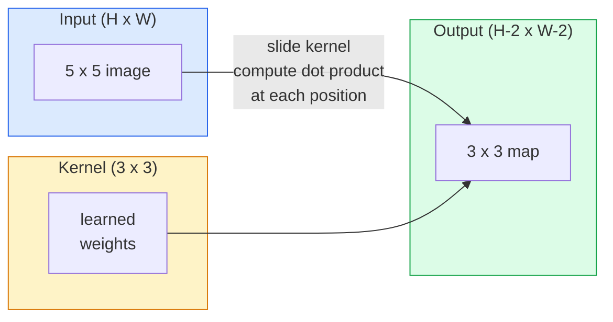
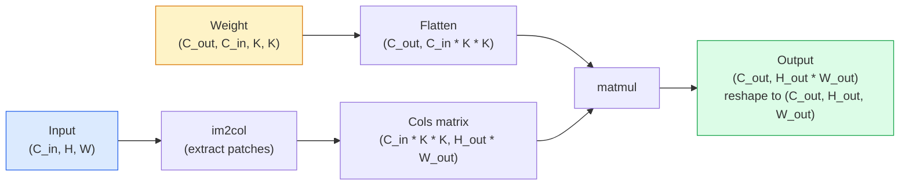

# Свертки с нуля

> Свертка — это крошечный полносвязный слой, который вы сдвигаете по изображению, разделяя одни и те же веса во всех позициях.

**Тип:** Сборка
**Языки:** Python
**Пререквизиты:** Фаза 3 (ядро глубокого обучения), Фаза 4 Урок 01 (основы изображений)
**Время:** ~75 минут

## Цели обучения

- Реализовать 2D-свертку с нуля, используя только NumPy, включая версию с вложенными циклами и векторизованную версию `im2col`
- Вычислять пространственный размер выхода для любой комбинации размера входа, размера ядра, padding и stride, а также обосновывать формулу `(H - K + 2P) / S + 1`
- Вручную проектировать ядра (граница, размытие, повышение резкости, Sobel) и объяснять, почему каждое из них порождает именно такой паттерн активаций
- Складывать свертки в экстрактор признаков и связывать глубину стека с размером рецептивного поля

## Проблема

Полносвязному слою для RGB-изображения 224x224 понадобилось бы 224 * 224 * 3 = 150,528 входных весов на один нейрон. Один скрытый слой с 1,000 юнитов — это уже 150 миллионов параметров, еще до того, как вы выучили что-либо полезное. Хуже того, такой слой не имеет представления о том, что собака в левом верхнем углу и собака в правом нижнем углу — один и тот же паттерн. Он считает каждую позицию пикселя независимой, что для изображений ровно неверно: сдвиг кота на три пикселя не должен заставлять сеть заново учить это понятие.

Два свойства, которые нужны модели изображений, — это **трансляционная эквивариантность (translation equivariance)** (выход сдвигается, когда сдвигается вход) и **разделение параметров (parameter sharing)** (один и тот же детектор признака запускается везде). Плотные слои не дают ни того, ни другого. Свертка дает оба свойства бесплатно.

Свертку изобрели не для глубокого обучения. Это та же операция, на которой работают сжатие JPEG, Gaussian blur в Photoshop, обнаружение границ в промышленном зрении и каждый когда-либо поставлявшийся аудиофильтр. Причина, по которой CNN доминировали в ImageNet с 2012 по 2020 год, в том, что свертка — правильное априорное предположение для данных, где соседние значения связаны, а один и тот же паттерн может появиться где угодно.

## Концепция

### Одно ядро, скольжение

2D-свертка берет небольшую матрицу весов, называемую ядром (или фильтром), сдвигает ее по входу и в каждой позиции вычисляет сумму поэлементных произведений. Эта сумма становится одним выходным пикселем.



Конкретный пример 3x3 на входе 5x5 (без padding, stride 1):

```
Input X (5 x 5):                Kernel W (3 x 3):

  1  2  0  1  2                   1  0 -1
  0  1  3  1  0                   2  0 -2
  2  1  0  2  1                   1  0 -1
  1  0  2  1  3
  2  1  1  0  1

The kernel slides across every valid 3 x 3 window. Output Y is 3 x 3:

 Y[0,0] = sum( W * X[0:3, 0:3] )
 Y[0,1] = sum( W * X[0:3, 1:4] )
 Y[0,2] = sum( W * X[0:3, 2:5] )
 Y[1,0] = sum( W * X[1:4, 0:3] )
 ... and so on
```

Эта одна формула — **разделяемые веса, локальность, скользящее окно** — и есть вся идея. Все остальное — учет размеров.

### Формула размера выхода

Для пространственного размера входа `H`, размера ядра `K`, padding `P`, stride `S`:

```
H_out = floor( (H - K + 2P) / S ) + 1
```

Запомните это. Вы будете вычислять ее десятки раз для каждой архитектуры.

| Сценарий | H | K | P | S | H_out |
|----------|---|---|---|---|-------|
| Valid conv, без padding | 32 | 3 | 0 | 1 | 30 |
| Same conv (сохраняет размер) | 32 | 3 | 1 | 1 | 32 |
| Downsample на 2 | 32 | 3 | 1 | 2 | 16 |
| Pool 2x2 | 32 | 2 | 0 | 2 | 16 |
| Большое рецептивное поле | 32 | 7 | 3 | 2 | 16 |

"Same padding" означает выбрать P так, чтобы H_out == H при S == 1. Для нечетного K это P = (K - 1) / 2. Именно поэтому ядра 3x3 доминируют — это наименьшее нечетное ядро, у которого все еще есть центр.

### Padding (дополнение)

Без padding каждая свертка уменьшает карту признаков. Сложите 20 таких сверток, и ваше изображение 224x224 станет 184x184, что тратит вычисления на границе и усложняет residual connections, которым нужны совпадающие формы.

```
Zero padding (P = 1) on a 5 x 5 input:

  0  0  0  0  0  0  0
  0  1  2  0  1  2  0
  0  0  1  3  1  0  0
  0  2  1  0  2  1  0       Now the kernel can centre on pixel
  0  1  0  2  1  3  0       (0, 0) and still have three rows and
  0  2  1  1  0  1  0       three columns of values to multiply.
  0  0  0  0  0  0  0
```

Режимы, которые встречаются на практике: `zero` (самый распространенный), `reflect` (зеркалит край, избегает жестких границ в генеративных моделях), `replicate` (копирует край), `circular` (замыкает по кругу, используется в тороидальных задачах).

### Stride (шаг)

Stride — это размер шага скольжения. `stride=1` — значение по умолчанию. `stride=2` вдвое уменьшает пространственные размеры и является классическим способом делать downsample внутри CNN без отдельного слоя pooling — каждая современная архитектура (ResNet, ConvNeXt, MobileNet) где-нибудь использует strided convs вместо max-pool.

```
Stride 1 on a 5 x 5 input, 3 x 3 kernel:

  starts: (0,0) (0,1) (0,2)        -> output row 0
          (1,0) (1,1) (1,2)        -> output row 1
          (2,0) (2,1) (2,2)        -> output row 2

  Output: 3 x 3

Stride 2 on the same input:

  starts: (0,0) (0,2)              -> output row 0
          (2,0) (2,2)              -> output row 1

  Output: 2 x 2
```

### Несколько входных каналов

У реальных изображений три канала. Свертка 3x3 на RGB-входе на самом деле является объемом 3x3x3: по одному срезу 3x3 на каждый входной канал. В каждой пространственной позиции вы перемножаете и суммируете по всем трем срезам, а затем добавляете смещение.

```
Input:   (C_in,  H,  W)        3 x 5 x 5
Kernel:  (C_in,  K,  K)        3 x 3 x 3 (one kernel)
Output:  (1,     H', W')       2D map

For a layer that produces C_out output channels, you stack C_out kernels:

Weight:  (C_out, C_in, K, K)   e.g. 64 x 3 x 3 x 3
Output:  (C_out, H', W')       64 x 3 x 3

Parameter count: C_out * C_in * K * K + C_out   (the + C_out is biases)
```

Последняя строка — та, которую вы будете считать при планировании модели. Свертка 3x3 с 64 каналами на входе с 3 каналами имеет `64 * 3 * 3 * 3 + 64 = 1,792` параметра. Дешево.

### Трюк im2col

Вложенные циклы легко читать, но они медленные. GPU хотят большие матричные умножения. Трюк такой: развернуть каждое окно рецептивного поля входа в один столбец большой матрицы, развернуть ядро в строку, и вся свертка становится одним matmul.



Каждая production-реализация conv — это какой-то вариант этого подхода плюс трюки с cache-tiling (direct conv, Winograd, FFT conv для больших ядер). Поймите im2col — и вы поймете ядро идеи.

### Рецептивное поле

Одна свертка 3x3 смотрит на 9 входных пикселей. Сложите две свертки 3x3, и нейрон во втором слое будет смотреть на входные пиксели 5x5. Три свертки 3x3 дают 7x7. В общем виде:

```
RF after L stacked K x K convs (stride 1) = 1 + L * (K - 1)

With strides:   RF grows multiplicatively with stride along each layer.
```

Главная причина, по которой работает подход "3x3 all the way down" (VGG, ResNet, ConvNeXt), в том, что две свертки 3x3 видят ту же область входа, что и одна свертка 5x5, но имеют меньше параметров и дополнительную нелинейность между ними.

## Соберите это

### Шаг 1: Добавьте padding к массиву

Начните с минимального примитива: функции, которая добавляет нули вокруг массива H x W.

```python
import numpy as np

def pad2d(x, p):
    if p == 0:
        return x
    h, w = x.shape[-2:]
    out = np.zeros(x.shape[:-2] + (h + 2 * p, w + 2 * p), dtype=x.dtype)
    out[..., p:p + h, p:p + w] = x
    return out

x = np.arange(9).reshape(3, 3)
print(x)
print()
print(pad2d(x, 1))
```

Трюк с последними осями `x.shape[:-2]` означает, что одна и та же функция без изменений работает на `(H, W)`, `(C, H, W)` или `(N, C, H, W)`.

### Шаг 2: 2D-свертка с вложенными циклами

Эталонная реализация — медленная, но однозначная. В принципе, именно это делает `torch.nn.functional.conv2d`.

```python
def conv2d_naive(x, w, b=None, stride=1, padding=0):
    c_in, h, w_in = x.shape
    c_out, c_in_w, kh, kw = w.shape
    assert c_in == c_in_w

    x_pad = pad2d(x, padding)
    h_out = (h + 2 * padding - kh) // stride + 1
    w_out = (w_in + 2 * padding - kw) // stride + 1

    out = np.zeros((c_out, h_out, w_out), dtype=np.float32)
    for oc in range(c_out):
        for i in range(h_out):
            for j in range(w_out):
                hs = i * stride
                ws = j * stride
                patch = x_pad[:, hs:hs + kh, ws:ws + kw]
                out[oc, i, j] = np.sum(patch * w[oc])
        if b is not None:
            out[oc] += b[oc]
    return out
```

Четыре вложенных цикла (выходной канал, строка, столбец плюс неявная сумма по C_in, kh, kw). Это ground truth, с которым вы будете сверять каждую более быструю реализацию.

### Шаг 3: Проверьте на вручную спроектированном ядре

Постройте вертикальное ядро Sobel, примените его к синтетическому изображению со ступенькой и посмотрите, как вертикальная граница загорается.

```python
def synthetic_step_image():
    img = np.zeros((1, 16, 16), dtype=np.float32)
    img[:, :, 8:] = 1.0
    return img

sobel_x = np.array([
    [[-1, 0, 1],
     [-2, 0, 2],
     [-1, 0, 1]]
], dtype=np.float32)[None]

x = synthetic_step_image()
y = conv2d_naive(x, sobel_x, padding=1)
print(y[0].round(1))
```

Ожидайте большие положительные значения в столбце 7 (рост яркости слева направо) и нули везде в остальных местах. Этот единственный print — ваша sanity check, что математика правильная.

### Шаг 4: im2col

Преобразуйте каждое окно размера ядра во входе в столбец матрицы. Для `C_in=3, K=3` каждый столбец содержит 27 чисел.

```python
def im2col(x, kh, kw, stride=1, padding=0):
    c_in, h, w = x.shape
    x_pad = pad2d(x, padding)
    h_out = (h + 2 * padding - kh) // stride + 1
    w_out = (w + 2 * padding - kw) // stride + 1

    cols = np.zeros((c_in * kh * kw, h_out * w_out), dtype=x.dtype)
    col = 0
    for i in range(h_out):
        for j in range(w_out):
            hs = i * stride
            ws = j * stride
            patch = x_pad[:, hs:hs + kh, ws:ws + kw]
            cols[:, col] = patch.reshape(-1)
            col += 1
    return cols, h_out, w_out
```

Это все еще Python-цикл, но теперь тяжелая работа будет одним векторизованным matmul.

### Шаг 5: Быстрая conv через im2col + matmul

Замените четверной цикл одним матричным умножением.

```python
def conv2d_im2col(x, w, b=None, stride=1, padding=0):
    c_out, c_in, kh, kw = w.shape
    cols, h_out, w_out = im2col(x, kh, kw, stride, padding)
    w_flat = w.reshape(c_out, -1)
    out = w_flat @ cols
    if b is not None:
        out += b[:, None]
    return out.reshape(c_out, h_out, w_out)
```

Проверка корректности: запустите обе реализации и сравните.

```python
rng = np.random.default_rng(0)
x = rng.normal(0, 1, (3, 16, 16)).astype(np.float32)
w = rng.normal(0, 1, (8, 3, 3, 3)).astype(np.float32)
b = rng.normal(0, 1, (8,)).astype(np.float32)

y_naive = conv2d_naive(x, w, b, padding=1)
y_im2col = conv2d_im2col(x, w, b, padding=1)

print(f"max abs diff: {np.max(np.abs(y_naive - y_im2col)):.2e}")
```

`max abs diff` должен быть около `1e-5` — разница возникает из-за порядка накопления чисел с плавающей точкой, а не из-за бага.

### Шаг 6: Банк вручную спроектированных ядер

Пять фильтров, которые показывают, что один сверточный слой может выразить еще до какого-либо обучения.

```python
KERNELS = {
    "identity": np.array([[0, 0, 0], [0, 1, 0], [0, 0, 0]], dtype=np.float32),
    "blur_3x3": np.ones((3, 3), dtype=np.float32) / 9.0,
    "sharpen": np.array([[0, -1, 0], [-1, 5, -1], [0, -1, 0]], dtype=np.float32),
    "sobel_x": np.array([[-1, 0, 1], [-2, 0, 2], [-1, 0, 1]], dtype=np.float32),
    "sobel_y": np.array([[-1, -2, -1], [0, 0, 0], [1, 2, 1]], dtype=np.float32),
}

def apply_kernel(img2d, kernel):
    x = img2d[None].astype(np.float32)
    w = kernel[None, None]
    return conv2d_im2col(x, w, padding=1)[0]
```

При применении к любому изображению в градациях серого blur смягчает, sharpen делает границы четче, Sobel-x подсвечивает вертикальные границы, Sobel-y подсвечивает горизонтальные границы. Это ровно те паттерны, которые *первый* обученный сверточный слой в AlexNet и VGG в итоге выучил — потому что хорошей модели изображений нужны детекторы границ и пятен независимо от того, какая задача идет дальше.

## Используйте это

PyTorch `nn.Conv2d` оборачивает ту же операцию с autograd, CUDA kernels и оптимизацией cuDNN. Семантика форм идентична.

```python
import torch
import torch.nn as nn

conv = nn.Conv2d(in_channels=3, out_channels=64, kernel_size=3, stride=1, padding=1)
print(conv)
print(f"weight shape: {tuple(conv.weight.shape)}   # (C_out, C_in, K, K)")
print(f"bias shape:   {tuple(conv.bias.shape)}")
print(f"param count:  {sum(p.numel() for p in conv.parameters())}")

x = torch.randn(8, 3, 224, 224)
y = conv(x)
print(f"\ninput  shape: {tuple(x.shape)}")
print(f"output shape: {tuple(y.shape)}")
```

Замените `padding=1` на `padding=0`, и выход уменьшится до 222x222. Замените `stride=1` на `stride=2`, и он уменьшится до 112x112. Та же формула, которую вы запомнили выше.

## Отгрузите это

Этот урок создает:

- `outputs/prompt-cnn-architect.md` — prompt, который по размеру входа, бюджету параметров и целевому рецептивному полю проектирует стек слоев `Conv2d` с правильными K/S/P на каждом шаге.
- `outputs/skill-conv-shape-calculator.md` — skill, который проходит спецификацию сети слой за слоем и возвращает форму выхода, рецептивное поле и число параметров для каждого блока.

## Упражнения

1. **(Easy)** Для grayscale-входа 128x128 и стека `[Conv3x3(s=1,p=1), Conv3x3(s=2,p=1), Conv3x3(s=1,p=1), Conv3x3(s=2,p=1)]` вычислите пространственный размер выхода и рецептивное поле на каждом слое вручную. Проверьте с помощью PyTorch `nn.Sequential` из dummy convs.
2. **(Medium)** Расширьте `conv2d_naive` и `conv2d_im2col`, чтобы они принимали аргумент `groups`. Покажите, что `groups=C_in=C_out` воспроизводит depthwise convolution и что число ее параметров равно `C * K * K` вместо `C * C * K * K`.
3. **(Hard)** Реализуйте backward pass для `conv2d_im2col` вручную: по градиенту выхода вычислите градиент `x` и `w`. Проверьте против `torch.autograd.grad` на тех же входах и весах. Трюк: градиент im2col — это `col2im`, и он должен накапливать перекрывающиеся окна.

## Ключевые термины

| Термин | Как говорят | Что это на самом деле означает |
|------|----------------|----------------------|
| Свертка (Convolution) | "Скользить фильтром" | Обучаемое скалярное произведение, применяемое в каждой пространственной позиции с разделяемыми весами; математически это cross-correlation, но все называют это convolution |
| Ядро / фильтр (Kernel / filter) | "Детектор признака" | Небольшой тензор весов формы (C_in, K, K), чье скалярное произведение с окном входа дает один выходной пиксель |
| Stride | "Насколько далеко вы прыгаете" | Размер шага между последовательными размещениями ядра; stride 2 вдвое уменьшает каждое пространственное измерение |
| Padding | "Нули по краям" | Дополнительные значения, добавленные вокруг входа, чтобы ядро могло центрироваться на граничных пикселях; `same` padding сохраняет размер выхода равным размеру входа |
| Рецептивное поле (Receptive field) | "Сколько нейрон видит" | Фрагмент исходного входа, от которого зависит данная выходная активация; растет с глубиной и stride |
| im2col | "Трюк GEMM" | Перестановка каждого рецептивного окна в столбцы, чтобы свертка стала одним большим матричным умножением — ядро каждого быстрого conv kernel |
| Depthwise conv | "Одно ядро на канал" | Conv с `groups == C_in`, вычисляющая каждый выходной канал только из соответствующего входного канала; основа MobileNet и ConvNeXt |
| Трансляционная эквивариантность (Translation equivariance) | "Сдвиг на входе, сдвиг на выходе" | Свойство, при котором сдвиг входа на k пикселей сдвигает выход на k пикселей; бесплатно получается из разделяемых весов |

## Дополнительное чтение

- [A guide to convolution arithmetic for deep learning (Dumoulin & Visin, 2016)](https://arxiv.org/abs/1603.07285) — исчерпывающие диаграммы padding/stride/dilation, которые незаметно копирует каждый курс
- [CS231n: Convolutional Neural Networks for Visual Recognition](https://cs231n.github.io/convolutional-networks/) — канонические конспекты лекций, включая исходное объяснение im2col
- [The Annotated ConvNet (fast.ai)](https://nbviewer.org/github/fastai/fastbook/blob/master/13_convolutions.ipynb) — notebook, который проходит путь от ручной свертки до обученного классификатора цифр
- [Receptive Field Arithmetic for CNNs (Dang Ha The Hien)](https://distill.pub/2019/computing-receptive-fields/) — интерактивное объяснение расчетов рецептивного поля на уровне хорошей статьи
