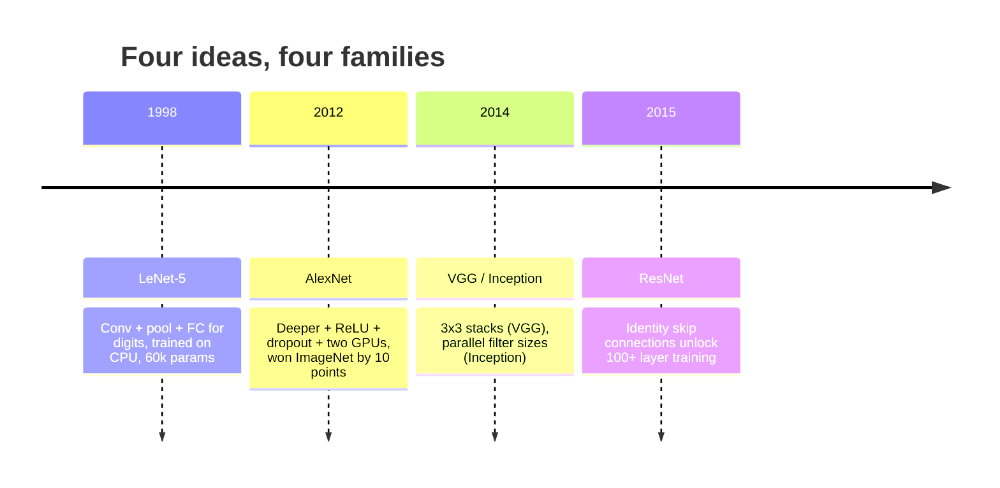
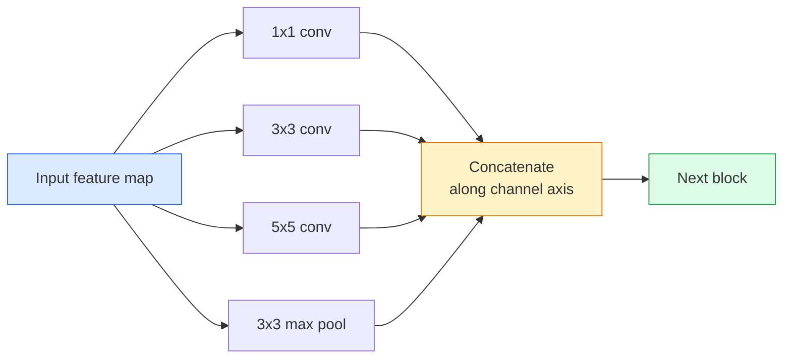
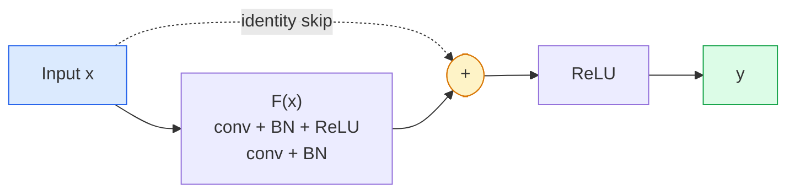

# CNNs — от LeNet до ResNet

> Каждая важная CNN за последние тридцать лет — это один и тот же рецепт conv–nonlinearity–downsample с одной добавленной новой идеей. Изучайте идеи по порядку.

**Type:** Изучение + сборка
**Языки:** Python
**Предварительные требования:** Phase 3 Lesson 11 (PyTorch), Phase 4 Lesson 01 (Image Fundamentals), Phase 4 Lesson 02 (Convolutions from Scratch)
**Time:** ~75 минут

## Цели обучения

- Проследить архитектурную линию LeNet-5 -> AlexNet -> VGG -> Inception -> ResNet и назвать одну новую идею, которую внесло каждое семейство
- Реализовать LeNet-5, блок в стиле VGG и ResNet BasicBlock в PyTorch, каждый менее чем в 40 строк
- Объяснить, почему остаточные соединения (residual connections) превращают 1,000-слойную сеть из необучаемой в state-of-the-art
- Читать современный backbone (ResNet-18, ResNet-50) и предсказывать его форму выхода, рецептивное поле и число параметров до просмотра исходного кода

## Проблема

В 2011 году лучший классификатор ImageNet показывал около 74% top-5 accuracy. В 2012 AlexNet показал 85%. В 2015 ResNet показал 96%. Без новых данных. Без нового поколения GPU. Приросты пришли из архитектурных идей. Практикующий инженер компьютерного зрения должен знать, какая идея пришла из какой статьи, потому что каждый production backbone, который вы будете поставлять в 2026 году, является рекомбинацией тех же самых частей — и потому что идеи продолжают переноситься: grouped convs перешли из CNNs в transformers, residual connections перешли из ResNet в каждый существующий LLM, batch normalisation живет в diffusion models.

Изучение этих сетей по порядку также защищает от распространенной ошибки: тянуться к самой большой доступной модели, когда сеть размера LeNet решила бы задачу. MNIST не требует ResNet. Понимание кривой масштабирования каждого семейства показывает, где на ней следует находиться.

## Концепция

### Четыре идеи, которые изменили компьютерное зрение



Ничто другое в классическом компьютерном зрении не имело такого значения, как эти четыре скачка.

### LeNet-5 (1998)

Распознаватель цифр Янна Лекуна. 60,000 параметров. Два блока conv-pool, два полносвязных слоя, активации tanh. Он задал шаблон, который наследует каждая CNN:

```
input (1, 32, 32)
  conv 5x5 -> (6, 28, 28)
  avg pool 2x2 -> (6, 14, 14)
  conv 5x5 -> (16, 10, 10)
  avg pool 2x2 -> (16, 5, 5)
  flatten -> 400
  dense -> 120
  dense -> 84
  dense -> 10
```

Все, что современный мир называет CNN — чередующиеся свертки и downsampling, подающие признаки в небольшую классификационную голову, — это LeNet с большим числом слоев, более широкими каналами и лучшими активациями.

### AlexNet (2012)

Три изменения, которые вместе взломали ImageNet:

1. **ReLU** вместо tanh. Градиенты перестают исчезать. Обучение ускоряется в шесть раз.
2. **Dropout** в полносвязной голове. Регуляризация становится слоем, а не трюком.
3. **Глубина и ширина**. Пять сверточных слоев, три плотных слоя, 60M параметров, обучение на двух GPU с разделением модели между ними.

Figure 2 в статье все еще показывает разделение по GPU как два параллельных потока. Этот параллелизм был аппаратным обходным решением, а не архитектурным озарением, но три идеи выше по-прежнему есть в каждой модели, которую вы используете.

### VGG (2014)

VGG задала вопрос: что произойдет, если использовать только свертки 3x3 и идти в глубину?

```
stack:   conv 3x3 -> conv 3x3 -> pool 2x2
repeat:  16 or 19 conv layers
```

Две conv 3x3 видят ту же область входа 5x5, что и одна conv 5x5, но с меньшим числом параметров (2*9*C^2 = 18C^2 vs 25*C^2) и дополнительной ReLU между ними. VGG превратила это наблюдение в целую архитектуру. Простота — один тип блока, повторенный много раз — сделала ее точкой отсчета для всего, что появилось после.

Цена: 138M параметров, медленное обучение, дорогой inference.

### Inception (2014, тот же год)

Ответ Google на вопрос "какой размер ядра использовать?" был: все сразу, параллельно.



Каждая ветвь специализируется: 1x1 для смешивания каналов, 3x3 для локальной текстуры, 5x5 для более крупных паттернов, pooling для признаков, инвариантных к сдвигу, а concat позволяет следующему слою выбрать ту ветвь, которая полезна. Inception v1 использовала свертки 1x1 внутри каждой ветви как bottleneck, чтобы удерживать число параметров в разумных пределах.

### Проблема деградации

К 2015 году VGG-19 работала, а VGG-32 — нет. Предполагалось, что глубина должна помогать, но после ~20 слоев и training loss, и test loss становились хуже. Это не переобучение. Это отказ оптимизатора находить полезные веса, потому что градиенты мультипликативно уменьшаются через каждый слой.

```
Plain deep network:
  y = f_L( f_{L-1}( ... f_1(x) ... ) )

Gradient wrt early layer:
  dL/dW_1 = dL/dy * df_L/df_{L-1} * ... * df_2/df_1 * df_1/dW_1

Each multiplicative term has magnitude roughly (weight magnitude) * (activation gain).
Stack 100 of them with gains < 1 and the gradient is effectively zero.
```

VGG работала на 19 слоях, потому что batch norm (опубликованная одновременно) поддерживала активации хорошо масштабированными. Но даже batch norm не могла спасти глубину за пределами примерно 30 слоев.

### ResNet (2015)

He, Zhang, Ren, Sun предложили одно изменение, которое исправило все:

```
standard block:   y = F(x)
residual block:   y = F(x) + x
```

`+ x` означает, что слой всегда может выбрать ничего не делать, сведя `F(x)` к нулю. 1,000-слойная ResNet теперь в худшем случае не хуже 1-слойной сети, потому что у каждого дополнительного блока есть тривиальный аварийный выход. С такой гарантией оптимизатор готов делать каждый блок *слегка* полезным — а слегка полезное, сложенное 100 раз, дает state-of-the-art.



Два варианта блока встречаются повсюду:

- **BasicBlock** (ResNet-18, ResNet-34): две conv 3x3, skip вокруг обеих.
- **Bottleneck** (ResNet-50, -101, -152): 1x1 down, 3x3 middle, 1x1 up, skip вокруг всей тройки. Дешевле при большом числе каналов.

Когда skip должен пересечь downsample (stride=2), identity path заменяется conv 1x1 stride=2, чтобы согласовать формы.

### Почему residuals важны за пределами компьютерного зрения

Идея на самом деле была не про классификацию изображений. Она была про превращение глубоких сетей из "скрестить пальцы и надеяться, что градиенты выживут" в надежный, масштабируемый инженерный инструмент. Каждый transformer, о котором вы будете читать в следующей фазе, имеет точно такое же skip connection в каждом блоке. Без ResNet нет GPT.

## Соберите это

### Шаг 1: LeNet-5

Минимальная, точная LeNet. Активации tanh, average pooling. Единственная уступка современности состоит в том, что ниже мы используем `nn.CrossEntropyLoss` вместо исходных Gaussian connections.

```python
import torch
import torch.nn as nn
import torch.nn.functional as F

class LeNet5(nn.Module):
    def __init__(self, num_classes=10):
        super().__init__()
        self.conv1 = nn.Conv2d(1, 6, kernel_size=5)
        self.conv2 = nn.Conv2d(6, 16, kernel_size=5)
        self.pool = nn.AvgPool2d(2)
        self.fc1 = nn.Linear(16 * 5 * 5, 120)
        self.fc2 = nn.Linear(120, 84)
        self.fc3 = nn.Linear(84, num_classes)

    def forward(self, x):
        x = self.pool(torch.tanh(self.conv1(x)))
        x = self.pool(torch.tanh(self.conv2(x)))
        x = torch.flatten(x, 1)
        x = torch.tanh(self.fc1(x))
        x = torch.tanh(self.fc2(x))
        return self.fc3(x)

net = LeNet5()
x = torch.randn(1, 1, 32, 32)
print(f"output: {net(x).shape}")
print(f"params: {sum(p.numel() for p in net.parameters()):,}")
```

Ожидаемый вывод: `output: torch.Size([1, 10])`, `params: 61,706`. Это весь классификатор цифр, с которого началось современное компьютерное зрение.

### Шаг 2: Блок VGG

Один переиспользуемый блок: две conv 3x3, ReLU, batch norm, max pool.

```python
class VGGBlock(nn.Module):
    def __init__(self, in_c, out_c):
        super().__init__()
        self.conv1 = nn.Conv2d(in_c, out_c, kernel_size=3, padding=1)
        self.bn1 = nn.BatchNorm2d(out_c)
        self.conv2 = nn.Conv2d(out_c, out_c, kernel_size=3, padding=1)
        self.bn2 = nn.BatchNorm2d(out_c)
        self.pool = nn.MaxPool2d(2)

    def forward(self, x):
        x = F.relu(self.bn1(self.conv1(x)))
        x = F.relu(self.bn2(self.conv2(x)))
        return self.pool(x)

class MiniVGG(nn.Module):
    def __init__(self, num_classes=10):
        super().__init__()
        self.stack = nn.Sequential(
            VGGBlock(3, 32),
            VGGBlock(32, 64),
            VGGBlock(64, 128),
        )
        self.head = nn.Sequential(
            nn.AdaptiveAvgPool2d(1),
            nn.Flatten(),
            nn.Linear(128, num_classes),
        )

    def forward(self, x):
        return self.head(self.stack(x))

net = MiniVGG()
x = torch.randn(1, 3, 32, 32)
print(f"output: {net(x).shape}")
print(f"params: {sum(p.numel() for p in net.parameters()):,}")
```

Три блока VGG на входе размера CIFAR, adaptive pool, один linear layer. ~290k параметров. Более чем достаточно для CIFAR-10.

### Шаг 3: ResNet BasicBlock

Основной строительный блок ResNet-18 и ResNet-34.

```python
class BasicBlock(nn.Module):
    def __init__(self, in_c, out_c, stride=1):
        super().__init__()
        self.conv1 = nn.Conv2d(in_c, out_c, kernel_size=3, stride=stride, padding=1, bias=False)
        self.bn1 = nn.BatchNorm2d(out_c)
        self.conv2 = nn.Conv2d(out_c, out_c, kernel_size=3, stride=1, padding=1, bias=False)
        self.bn2 = nn.BatchNorm2d(out_c)
        if stride != 1 or in_c != out_c:
            self.shortcut = nn.Sequential(
                nn.Conv2d(in_c, out_c, kernel_size=1, stride=stride, bias=False),
                nn.BatchNorm2d(out_c),
            )
        else:
            self.shortcut = nn.Identity()

    def forward(self, x):
        out = F.relu(self.bn1(self.conv1(x)))
        out = self.bn2(self.conv2(out))
        out = out + self.shortcut(x)
        return F.relu(out)
```

`bias=False` на conv layers — это соглашение при batch-norm: beta-параметр BN уже обрабатывает смещение, поэтому тащить еще и conv bias бессмысленно. `shortcut` нуждается в настоящей conv только когда меняется stride или число каналов; иначе это no-op identity.

### Шаг 4: Миниатюрная ResNet

Сложите четыре группы BasicBlocks, чтобы получить рабочую ResNet для входов размера CIFAR.

```python
class TinyResNet(nn.Module):
    def __init__(self, num_classes=10):
        super().__init__()
        self.stem = nn.Sequential(
            nn.Conv2d(3, 32, kernel_size=3, stride=1, padding=1, bias=False),
            nn.BatchNorm2d(32),
            nn.ReLU(inplace=True),
        )
        self.layer1 = self._make_group(32, 32, num_blocks=2, stride=1)
        self.layer2 = self._make_group(32, 64, num_blocks=2, stride=2)
        self.layer3 = self._make_group(64, 128, num_blocks=2, stride=2)
        self.layer4 = self._make_group(128, 256, num_blocks=2, stride=2)
        self.head = nn.Sequential(
            nn.AdaptiveAvgPool2d(1),
            nn.Flatten(),
            nn.Linear(256, num_classes),
        )

    def _make_group(self, in_c, out_c, num_blocks, stride):
        blocks = [BasicBlock(in_c, out_c, stride=stride)]
        for _ in range(num_blocks - 1):
            blocks.append(BasicBlock(out_c, out_c, stride=1))
        return nn.Sequential(*blocks)

    def forward(self, x):
        x = self.stem(x)
        x = self.layer1(x)
        x = self.layer2(x)
        x = self.layer3(x)
        x = self.layer4(x)
        return self.head(x)

net = TinyResNet()
x = torch.randn(1, 3, 32, 32)
print(f"output: {net(x).shape}")
print(f"params: {sum(p.numel() for p in net.parameters()):,}")
```

Четыре группы по два блока в каждой. Stride 2 в начале групп 2, 3, 4. Число каналов удваивается при каждом downsample. Примерно 2.8M параметров. Это стандартный рецепт, который чисто масштабируется до ResNet-152.

### Шаг 5: Сравните эффективность параметров относительно признаков

Пропустите один и тот же вход через все три сети и сравните число параметров.

```python
def summary(name, net, x):
    y = net(x)
    params = sum(p.numel() for p in net.parameters())
    print(f"{name:12s}  input {tuple(x.shape)} -> output {tuple(y.shape)}  params {params:>10,}")

x = torch.randn(1, 3, 32, 32)
summary("LeNet5",     LeNet5(),       torch.randn(1, 1, 32, 32))
summary("MiniVGG",    MiniVGG(),      x)
summary("TinyResNet", TinyResNet(),   x)
```

Три модели, три эпохи, три порядка величины в числе параметров. Для точности на CIFAR-10 вам примерно нужно: LeNet 60%, MiniVGG 89%, TinyResNet 93% после нескольких эпох обучения.

## Используйте это

`torchvision.models` дает pretrained-версии всех перечисленных выше моделей. Сигнатура вызова одинакова во всех семействах, и именно в этом смысл абстракции backbone.

```python
from torchvision.models import resnet18, ResNet18_Weights, vgg16, VGG16_Weights

r18 = resnet18(weights=ResNet18_Weights.IMAGENET1K_V1)
r18.eval()

print(f"ResNet-18 params: {sum(p.numel() for p in r18.parameters()):,}")
print(r18.layer1[0])
print()

v16 = vgg16(weights=VGG16_Weights.IMAGENET1K_V1)
v16.eval()
print(f"VGG-16   params: {sum(p.numel() for p in v16.parameters()):,}")
```

У ResNet-18 11.7M параметров. У VGG-16 138M. Похожая ImageNet top-1 accuracy (69.8% vs 71.6%). Residual connections покупают вам выигрыш в эффективности параметров в 12x. Поэтому варианты ResNet доминировали с 2016 года до появления ViT в 2021 году — и все еще доминируют в реальных развертываниях, где compute является ограничением.

Для transfer learning рецепт всегда один и тот же: загрузить pretrained, заморозить backbone, заменить classifier head.

```python
for p in r18.parameters():
    p.requires_grad = False
r18.fc = nn.Linear(r18.fc.in_features, 10)
```

Три строки. Теперь у вас есть 10-классовый CIFAR-классификатор, который наследует представления, оплаченные ImageNet.

## Что нужно получить

Этот урок создает:

- `outputs/prompt-backbone-selector.md` — prompt, который выбирает правильное семейство CNN (LeNet/VGG/ResNet/MobileNet/ConvNeXt) по задаче, размеру датасета и compute budget.
- `outputs/skill-residual-block-reviewer.md` — skill, который читает модуль PyTorch и отмечает ошибки skip-connection (отсутствующий shortcut при изменении stride, порядок shortcut activation, расположение BN относительно addition).

## Упражнения

1. **(Easy)** Посчитайте параметры вручную для `TinyResNet` послойно. Сравните с `sum(p.numel() for p in net.parameters())`. Куда уходит большая часть бюджета параметров — в convs, BN или classifier head?
2. **(Medium)** Реализуйте блок Bottleneck (1x1 -> 3x3 -> 1x1 with skip) и используйте его, чтобы построить сеть в стиле ResNet-50 для CIFAR. Сравните params с `TinyResNet`.
3. **(Hard)** Удалите skip connection из `BasicBlock`, обучите 34-блочную "plain" network и 34-блочную ResNet на CIFAR-10 по 10 эпох каждую. Постройте график training loss vs epoch для обеих. Воспроизведите результат He et al. Figure 1, где plain deep network сходится к более высокой loss, чем ее менее глубокий двойник.

## Ключевые термины

| Термин | Как говорят | Что это на самом деле означает |
|------|----------------|----------------------|
| Backbone | "The model" | Стек сверточных блоков, который производит feature map, подаваемую в task head |
| Residual connection | "Skip connection" | `y = F(x) + x`; позволяет оптимизатору выучить identity, задав F равной нулю, что делает произвольную глубину обучаемой |
| BasicBlock | "Two 3x3 convs with a skip" | Строительный блок ResNet-18/34: conv-BN-ReLU-conv-BN-add-ReLU |
| Bottleneck | "1x1 down, 3x3, 1x1 up" | Блок ResNet-50/101/152; дешев при большом числе каналов, потому что 3x3 выполняется на уменьшенной ширине |
| Degradation problem | "Deeper is worse" | После ~20 plain conv layers и training error, и test error растут; решается residual connections, а не дополнительными данными |
| Stem | "The first layer" | Начальная conv, которая преобразует 3-channel input в базовую ширину признаков; обычно 7x7 stride 2 для ImageNet, 3x3 stride 1 для CIFAR |
| Head | "The classifier" | Слои после последнего backbone block: adaptive pool, flatten, linear(s) |
| Transfer learning | "Pretrained weights" | Загрузка backbone, обученного на ImageNet, и fine-tuning только головы на вашей задаче |

## Дополнительное чтение

- [Deep Residual Learning for Image Recognition (He et al., 2015)](https://arxiv.org/abs/1512.03385) — статья ResNet; каждая figure заслуживает изучения
- [Very Deep Convolutional Networks (Simonyan & Zisserman, 2014)](https://arxiv.org/abs/1409.1556) — статья VGG; все еще лучшая ссылка для "почему 3x3"
- [ImageNet Classification with Deep CNNs (Krizhevsky et al., 2012)](https://papers.nips.cc/paper_files/paper/2012/hash/c399862d3b9d6b76c8436e924a68c45b-Abstract.html) — AlexNet; статья, завершившая эпоху hand-crafted-feature
- [Going Deeper with Convolutions (Szegedy et al., 2014)](https://arxiv.org/abs/1409.4842) — Inception v1; идея parallel-filter, которая все еще встречается в vision transformers
