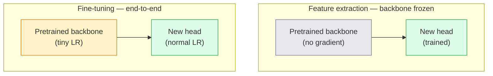

# Перенос обучения (Transfer Learning) и дообучение (Fine-Tuning)

> Кто-то уже потратил миллион GPU-часов, обучая сеть распознавать, как выглядят границы, текстуры и части объектов. Стоит позаимствовать эти признаки, прежде чем обучать собственную модель.

**Тип:** Сборка
**Языки:** Python
**Предварительные требования:** Фаза 4, урок 03 (CNN), фаза 4, урок 04 (классификация изображений)
**Время:** ~75 минут

## Цели обучения

- Отличать извлечение признаков (feature extraction) от дообучения (fine-tuning) и выбирать правильный режим с учетом размера набора данных, расстояния между доменами и вычислительного бюджета
- Загружать предобученную основу (backbone), заменять ее классификационную голову и обучать только голову до рабочего базового уровня менее чем за 20 строк
- Постепенно размораживать слои с дискриминативными скоростями обучения, чтобы ранние универсальные признаки получали меньшие обновления, чем поздние признаки, специфичные для задачи
- Диагностировать три распространенных сбоя: дрейф признаков из-за слишком высокой LR на размороженных блоках, коллапс статистик BN на крошечных наборах данных и катастрофическое забывание

## Проблема

Обучение ResNet-50 на ImageNet стоит примерно 2 000 GPU-часов. Очень немногие команды имеют такой бюджет для каждой задачи, которую они выпускают. На практике почти каждая команда выпускает предобученную основу с новой головой, обученной на нескольких сотнях или нескольких тысячах изображений, специфичных для задачи.

Это не короткий путь. Первый сверточный блок любой CNN, обученной на ImageNet, изучает границы и фильтры, похожие на фильтры Габора. Следующие несколько блоков изучают текстуры и простые мотивы. Средние блоки изучают части объектов. Финальные блоки изучают комбинации, которые начинают напоминать 1 000 категорий ImageNet. Первые 90% этой иерархии переносятся почти без изменений на медицинские изображения, промышленную инспекцию, спутниковые данные и любую другую задачу компьютерного зрения, потому что у природы ограниченный словарь границ и текстур. Последние 10% - это то, что вы действительно обучаете.

Правильный перенос обучения содержит три ожидающие вас ошибки: разрушение предобученных признаков слишком высокой скоростью обучения, лишение модели информации из-за чрезмерной заморозки и позволение скользящим статистикам BatchNorm дрейфовать к крошечному набору данных, на котором остальная сеть никогда не обучалась. Этот урок намеренно проходит через каждую из них.

## Концепция

### Извлечение признаков и дообучение

Два режима выбираются по тому, насколько вы доверяете предобученным признакам и сколько у вас данных.



Практические правила:

| Размер набора данных | Расстояние до домена | Рецепт |
|--------------|-----------------|--------|
| < 1k изображений | близко к ImageNet | Заморозить основу, обучать только голову |
| 1k-10k | близкое | Заморозить первые 2-3 стадии, дообучать остальное |
| 10k-100k | любое | Дообучать end-to-end с дискриминативной LR |
| 100k+ | далекое | Дообучать все; рассмотреть обучение с нуля, если домен достаточно далек |

"Близко к ImageNet" примерно означает естественные RGB-фотографии с объектоподобным содержимым. Медицинские CT-снимки, спутниковые изображения сверху и микроскопия - это далекие домены: признаки все еще помогают, но вам потребуется позволить большему числу слоев адаптироваться.

### Почему заморозка вообще работает

Признаки ImageNet, которые изучает CNN, не специализированы под 1 000 категорий. Они специализированы под статистику естественных изображений: границы в определенных ориентациях, текстуры, паттерны контраста, примитивы формы. Эти статистики стабильны почти во всех визуальных доменах, которые может назвать человек. Поэтому модель, обученная на ImageNet и оцененная zero-shot на CIFAR-10 только с новой линейной головой (без дообучения основы), достигает точности 80%+. Голова учится тому, какие из уже выученных признаков взвешивать для этой задачи.

### Дискриминативные скорости обучения

Когда вы все же размораживаете слои, ранние слои должны обучаться медленнее поздних. Ранние слои кодируют универсальные признаки, которые вы хотите сохранить; поздние слои кодируют специфичную для задачи структуру, которую нужно сильно сдвинуть.

```
Typical recipe:

  stage 0 (stem + first group): lr = base_lr / 100    (mostly fixed)
  stage 1:                       lr = base_lr / 10
  stage 2:                       lr = base_lr / 3
  stage 3 (last backbone group): lr = base_lr
  head:                          lr = base_lr  (or slightly higher)
```

В PyTorch это просто список групп параметров, переданный оптимизатору. Одна модель, пять скоростей обучения, ноль дополнительного кода.

### Проблема BatchNorm

Слои BN хранят буферы `running_mean` и `running_var`, вычисленные на ImageNet. Если у вашей задачи другое распределение пикселей - другое освещение, другой сенсор, другое цветовое пространство, - эти буферы неверны. Три варианта в порядке предпочтения:

1. **Дообучать с BN в режиме train.** Позволить BN обновлять свои скользящие статистики вместе со всем остальным. Выбор по умолчанию, когда набор данных задачи среднего размера (>= 5k примеров).
2. **Заморозить BN в режиме eval.** Сохранить статистики ImageNet и обучать только веса. Правильно, когда ваш набор данных достаточно мал, чтобы скользящее среднее BN было шумным.
3. **Заменить BN на GroupNorm.** Полностью устраняет проблему скользящего среднего. Используется в основах для детекции и сегментации, где размер батча на GPU крошечный.

Ошибка здесь незаметно снижает точность на 5-15%.

### Проектирование головы

Классификационная голова - это 1-3 линейных слоя плюс необязательный dropout. Каждая основа torchvision поставляется с головой по умолчанию, которую вы заменяете:

```
backbone.fc = nn.Linear(backbone.fc.in_features, num_classes)          # ResNet
backbone.classifier[1] = nn.Linear(..., num_classes)                    # EfficientNet, MobileNet
backbone.heads.head = nn.Linear(..., num_classes)                       # torchvision ViT
```

Для малых наборов данных одного линейного слоя обычно достаточно. Добавление скрытого слоя (Linear -> ReLU -> Dropout -> Linear) помогает, когда распределение задачи дальше от распределения, на котором обучалась основа.

### Послойное затухание LR

Более плавная версия дискриминативной LR, используемая в современном дообучении (BEiT, DINOv2, дообучения ViT-B). Вместо группировки слоев по стадиям каждому слою задают чуть меньшую LR, чем слою над ним:

```
lr_layer_k = base_lr * decay^(L - k)
```

При decay = 0.75 и L = 12 блоках трансформера первый блок обучается с `0.75^11 ≈ 0.04x` LR головы. Это важнее для дообучения трансформеров, чем для CNN, где LR, сгруппированных по стадиям, обычно достаточно.

### Что оценивать

Запуски переноса обучения (transfer learning) требуют двух чисел, которые вы не отслеживали бы при обучении с нуля:

- **Точность только с предобучением** - точность головы с замороженной основой. Это ваш нижний уровень.
- **Точность после дообучения** - та же модель после end-to-end обучения. Это ваш верхний уровень.

Если точность после дообучения ниже, чем точность только с предобучением, у вас ошибка в скорости обучения или BN. Всегда печатайте оба числа.

## Соберите это

### Шаг 1: Загрузить предобученную основу и изучить ее

```python
import torch
import torch.nn as nn
from torchvision.models import resnet18, ResNet18_Weights

backbone = resnet18(weights=ResNet18_Weights.IMAGENET1K_V1)
print(backbone)
print()
print("classifier head:", backbone.fc)
print("feature dim:", backbone.fc.in_features)
```

`ResNet18` имеет четыре стадии (`layer1..layer4`), а также stem и голову `fc`. Каждая классификационная основа torchvision имеет аналогичную структуру.

### Шаг 2: Извлечение признаков - заморозить все, заменить голову

```python
def make_feature_extractor(num_classes=10):
    model = resnet18(weights=ResNet18_Weights.IMAGENET1K_V1)
    for p in model.parameters():
        p.requires_grad = False
    model.fc = nn.Linear(model.fc.in_features, num_classes)
    return model

model = make_feature_extractor(num_classes=10)
trainable = sum(p.numel() for p in model.parameters() if p.requires_grad)
frozen = sum(p.numel() for p in model.parameters() if not p.requires_grad)
print(f"trainable: {trainable:>10,}")
print(f"frozen:    {frozen:>10,}")
```

Обучаемой является только `model.fc`. Основа - это замороженный извлекатель признаков.

### Шаг 3: Дискриминативное дообучение

Утилита, которая строит группы параметров со скоростями обучения, специфичными для стадий.

```python
def discriminative_param_groups(model, base_lr=1e-3, decay=0.3):
    stages = [
        ["conv1", "bn1"],
        ["layer1"],
        ["layer2"],
        ["layer3"],
        ["layer4"],
        ["fc"],
    ]
    groups = []
    for i, names in enumerate(stages):
        lr = base_lr * (decay ** (len(stages) - 1 - i))
        params = [p for n, p in model.named_parameters()
                  if any(n.startswith(k) for k in names)]
        if params:
            groups.append({"params": params, "lr": lr, "name": "_".join(names)})
    return groups

model = resnet18(weights=ResNet18_Weights.IMAGENET1K_V1)
model.fc = nn.Linear(model.fc.in_features, 10)
for p in model.parameters():
    p.requires_grad = True

groups = discriminative_param_groups(model)
for g in groups:
    print(f"{g['name']:>10s}  lr={g['lr']:.2e}  params={sum(p.numel() for p in g['params']):>8,}")
```

`decay=0.3` означает, что каждая стадия обучается со скоростью 30% от скорости следующей. `fc` получает `base_lr`, `layer4` получает `0.3 * base_lr`, `conv1` получает `0.3^5 * base_lr ≈ 0.00243 * base_lr`. Звучит экстремально; эмпирически это работает.

### Шаг 4: Обработка BatchNorm

Вспомогательная функция для заморозки скользящих статистик BN без заморозки ее весов.

```python
def freeze_bn_stats(model):
    for m in model.modules():
        if isinstance(m, (nn.BatchNorm1d, nn.BatchNorm2d, nn.BatchNorm3d)):
            m.eval()
            for p in m.parameters():
                p.requires_grad = False
    return model
```

Вызывайте ее после установки `model.train()` в начале каждой эпохи. `model.train()` переводит все в режим обучения; эта функция отменяет это только для слоев BN.

### Шаг 5: Минимальный end-to-end цикл дообучения

```python
from torch.optim import SGD
from torch.utils.data import DataLoader
from torch.optim.lr_scheduler import CosineAnnealingLR
import torch.nn.functional as F

def fine_tune(model, train_loader, val_loader, device, epochs=5, base_lr=1e-3, freeze_bn=False):
    model = model.to(device)
    groups = discriminative_param_groups(model, base_lr=base_lr)
    optimizer = SGD(groups, momentum=0.9, weight_decay=1e-4, nesterov=True)
    scheduler = CosineAnnealingLR(optimizer, T_max=epochs)

    for epoch in range(epochs):
        model.train()
        if freeze_bn:
            freeze_bn_stats(model)
        tr_loss, tr_correct, tr_total = 0.0, 0, 0
        for x, y in train_loader:
            x, y = x.to(device), y.to(device)
            logits = model(x)
            loss = F.cross_entropy(logits, y, label_smoothing=0.1)
            optimizer.zero_grad()
            loss.backward()
            optimizer.step()
            tr_loss += loss.item() * x.size(0)
            tr_total += x.size(0)
            tr_correct += (logits.argmax(-1) == y).sum().item()
        scheduler.step()

        model.eval()
        va_total, va_correct = 0, 0
        with torch.no_grad():
            for x, y in val_loader:
                x, y = x.to(device), y.to(device)
                pred = model(x).argmax(-1)
                va_total += x.size(0)
                va_correct += (pred == y).sum().item()
        print(f"epoch {epoch}  train {tr_loss/tr_total:.3f}/{tr_correct/tr_total:.3f}  "
              f"val {va_correct/va_total:.3f}")
    return model
```

Пять эпох с приведенным выше рецептом на CIFAR-10 переводят `ResNet18-IMAGENET1K_V1` примерно с 70% zero-shot точности линейного зондирования до примерно 93% точности после дообучения. Одна только голова вышла бы на плато около 86%, вообще не затрагивая основу.

### Шаг 6: Постепенное размораживание

Расписание, которое размораживает по одной стадии за эпоху от конца к началу. Смягчает дрейф признаков ценой нескольких дополнительных эпох.

```python
def progressive_unfreeze_schedule(model):
    stages = ["layer4", "layer3", "layer2", "layer1"]
    yielded = set()

    def start():
        for p in model.parameters():
            p.requires_grad = False
        for p in model.fc.parameters():
            p.requires_grad = True

    def unfreeze(epoch):
        if epoch < len(stages):
            name = stages[epoch]
            yielded.add(name)
            for n, p in model.named_parameters():
                if n.startswith(name):
                    p.requires_grad = True
            return name
        return None

    return start, unfreeze
```

Вызовите `start()` один раз перед первой эпохой. Вызывайте `unfreeze(epoch)` в начале каждой эпохи. Пересобирайте оптимизатор каждый раз, когда меняется набор обучаемых параметров, иначе замороженные параметры все еще будут хранить кэшированные моменты, которые его путают.

## Используйте это

Для большинства реальных задач достаточно `torchvision.models` и трех строк. Более тяжелая механика выше важна, когда вы сталкиваетесь с проблемами, которые библиотечные значения по умолчанию не могут исправить.

```python
from torchvision.models import resnet50, ResNet50_Weights

model = resnet50(weights=ResNet50_Weights.IMAGENET1K_V2)
model.fc = nn.Linear(model.fc.in_features, num_classes)
optimizer = torch.optim.AdamW(model.parameters(), lr=1e-4, weight_decay=1e-4)
```

Еще два значения по умолчанию продакшен-уровня:

- `timm` поставляет примерно 800 предобученных основ для компьютерного зрения с единым API (`timm.create_model("resnet50", pretrained=True, num_classes=10)`). Для любого дообучения за пределами зоопарка torchvision это стандарт.
- Для трансформеров `transformers.AutoModelForImageClassification.from_pretrained(name, num_labels=N)` дает вам ViT / BEiT / DeiT с той же семантикой загрузки, что и у текстовых моделей.

## Отгрузите это

Этот урок создает:

- `outputs/prompt-fine-tune-planner.md` - промпт, который выбирает извлечение признаков, прогрессивное или end-to-end дообучение на основе размера набора данных, расстояния между доменами и вычислительного бюджета.
- `outputs/skill-freeze-inspector.md` - навык, который по модели PyTorch сообщает, какие параметры обучаемые, какие слои BatchNorm находятся в режиме eval и действительно ли оптимизатор получает обучаемые параметры.

## Упражнения

1. **(Easy)** Обучите `ResNet18` как линейный зонд (основа заморожена) и как полное дообучение на одном и том же наборе synthetic-CIFAR. Сообщите обе точности рядом. Объясните, какой разрыв говорит, что признаки переносятся хорошо, а какой - что нет.
2. **(Medium)** Намеренно внесите ошибку: установите `base_lr = 1e-1` на стадии основы вместо головы. Покажите, как ошибка обучения взрывается, затем восстановитесь, применив вспомогательную функцию `discriminative_param_groups`. Запишите LR, при которой каждая стадия начинает расходиться.
3. **(Hard)** Возьмите набор медицинских изображений (например, CheXpert-small, PatchCamelyon или HAM10000) и сравните три режима: (a) предобученная на ImageNet замороженная основа + линейная голова; (b) предобученное на ImageNet end-to-end дообучение; (c) обучение с нуля. Сообщите точность и вычислительную стоимость для каждого. При каком размере набора данных обучение с нуля становится конкурентоспособным?

## Ключевые термины

| Термин | Что говорят | Что это на самом деле значит |
|------|----------------|----------------------|
| Извлечение признаков (Feature extraction) | "Заморозить и обучить голову" | Параметры основы заморожены, градиент получает только новая классификационная голова |
| Дообучение (Fine-tuning) | "Переобучить end-to-end" | Все параметры обучаемые, обычно с гораздо меньшей LR, чем при обучении с нуля |
| Дискриминативная LR | "Меньшая LR для ранних слоев" | Группы параметров оптимизатора, где LR ранних стадий является долей LR поздних стадий |
| Послойное затухание LR | "Плавный градиент LR" | LR на слой умножается на decay^(L - k); распространено при дообучении трансформеров |
| Катастрофическое забывание | "Модель потеряла ImageNet" | Слишком высокая LR перезаписывает предобученные признаки до того, как сигнал новой задачи усвоен |
| Дрейф статистик BN | "Running mean неверен" | BatchNorm running_mean/var вычислены на распределении, отличном от текущей задачи, что незаметно ухудшает точность |
| Линейный зонд (Linear probe) | "Замороженная основа + линейная голова" | Оценка предобученных признаков - точность лучшего линейного классификатора поверх замороженного представления |
| Катастрофический коллапс | "Все предсказывает один класс" | Происходит при дообучении с LR, достаточно высокой, чтобы разрушить признаки до того, как градиенты от головы смогут стабилизироваться |

## Дополнительное чтение

- [How transferable are features in deep neural networks? (Yosinski et al., 2014)](https://arxiv.org/abs/1411.1792) - статья, которая количественно измерила переносимость признаков между слоями
- [Universal Language Model Fine-tuning (ULMFiT, Howard & Ruder, 2018)](https://arxiv.org/abs/1801.06146) - исходный рецепт дискриминативной LR / постепенного размораживания; идеи напрямую переносятся в компьютерное зрение
- [timm documentation](https://huggingface.co/docs/timm) - справочник по современным vision-основам и точным настройкам дообучения по умолчанию, с которыми они обучались
- [A Simple Framework for Linear-Probe Evaluation (Kornblith et al., 2019)](https://arxiv.org/abs/1805.08974) - почему точность линейного зондирования (linear probe) важна и как корректно о ней сообщать
