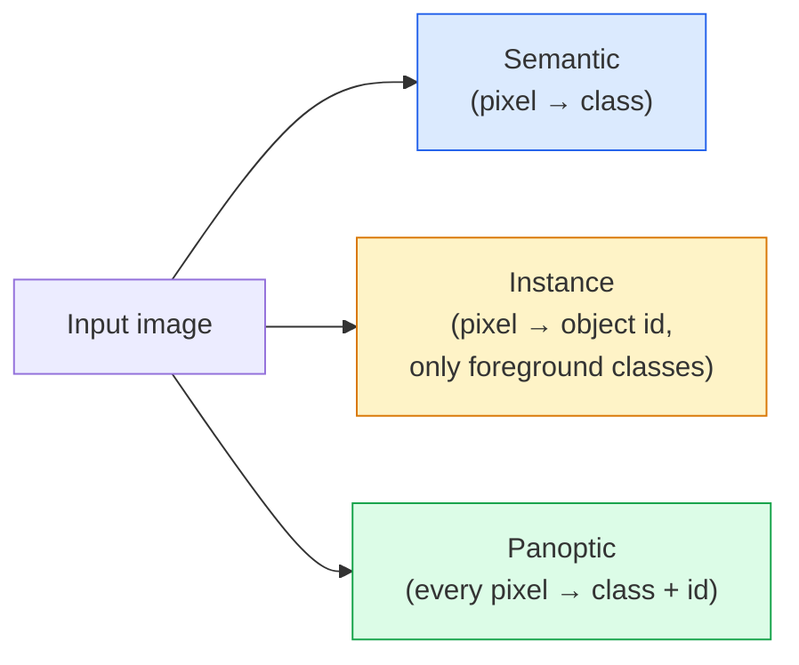
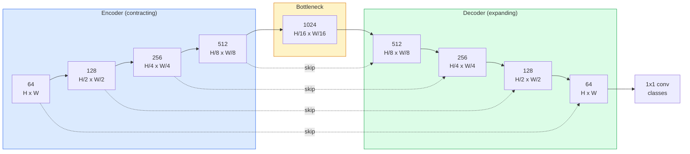

# Семантическая сегментация — U-Net

> Сегментация — это классификация каждого пикселя. U-Net делает это практичным, сочетая энкодер с понижением разрешения, декодер с повышением разрешения и skip connections между ними.

**Тип:** Сборка
**Языки:** Python
**Предварительные требования:** Phase 4 Lesson 03 (CNNs), Phase 4 Lesson 04 (Image Classification)
**Время:** ~75 минут

## Цели обучения

- Различать семантическую, instance- и panoptic-сегментацию и выбирать правильную постановку задачи для конкретной проблемы
- Построить U-Net с нуля в PyTorch: с блоками энкодера, bottleneck, декодером с transposed convolutions и skip connections
- Реализовать попиксельную cross-entropy, Dice loss и комбинированную функцию потерь, которая сейчас является стандартным выбором по умолчанию для медицинской и промышленной сегментации
- Читать метрики IoU и Dice по классам и диагностировать, связан ли плохой результат с recall малых объектов, точностью границ или дисбалансом классов

## Проблема

Классификация выдает одну метку на изображение. Детекция выдает несколько рамок на изображение. Сегментация выдает одну метку на пиксель. Для входа размера `H x W` выход — это тензор формы `H x W` (semantic) или `H x W x N_instances` (instance). Это миллионы предсказаний на изображение, а не одно.

Структура сегментации объясняет, почему она лежит в основе почти каждого продукта компьютерного зрения с плотными предсказаниями: медицинская визуализация (маски опухолей), автономное вождение (дорога, полоса, препятствие), спутниковые снимки (контуры зданий, границы посевов), разбор документов (зоны макета), робототехника (области, пригодные для захвата). Ни одну из этих задач нельзя решить, просто обведя объект рамкой; им нужен точный силуэт.

Архитектурную проблему легко сформулировать, но нелегко решить: сети нужно одновременно видеть глобальный контекст изображения (что это за сцена) и локальные детали пикселей (какой именно пиксель является дорогой, а какой — тротуаром). Стандартная CNN сжимает пространственные размеры, чтобы получить контекст, и из-за этого теряет детали. U-Net стала архитектурой, которая дала и то и другое.

## Концепция

### Semantic vs instance vs panoptic-сегментация



- **Semantic** говорит: "этот пиксель — дорога, тот пиксель — автомобиль." Два автомобиля рядом друг с другом сливаются в одну область.
- **Instance** говорит: "этот пиксель — автомобиль #3, тот пиксель — автомобиль #5." Игнорирует фоновые категории ("stuff" = небо, дорога, трава).
- **Panoptic** объединяет оба подхода: каждый пиксель получает метку класса, каждый экземпляр получает уникальный id, сегментируются и stuff, и things.

В этом уроке рассматривается semantic. Следующий урок (Mask R-CNN) рассматривает instance.

### Форма U-Net



Энкодер четыре раза уменьшает пространственное разрешение вдвое и удваивает число каналов. Декодер выполняет обратное: четыре раза удваивает пространственное разрешение и уменьшает число каналов вдвое. Skip connections конкатенируют соответствующие признаки энкодера с признаками декодера на каждом разрешении. Финальная 1x1 conv отображает `64 -> num_classes` в полном разрешении.

Почему skip connections необходимы: к моменту, когда декодер пытается выдавать предсказания на уровне пикселей, он видел только маленькие карты признаков. Без skips он не может точно локализовать края, потому что эта информация была сжата в энкодере. Skip connections передают ему высокоразрешающие карты признаков, которые энкодер вычислил на пути вниз.

### Transposed convolution vs bilinear upsample

Декодеру нужно расширять пространственные размеры. Есть два варианта:

- **Transposed convolution** (`nn.ConvTranspose2d`) — обучаемое повышение разрешения. Исторический вариант по умолчанию для U-Net. Может создавать checkerboard artifacts, если stride и kernel size делятся неравномерно.
- **Bilinear upsample + 3x3 conv** — гладкое повышение разрешения, за которым следует conv. Меньше артефактов, меньше параметров, сейчас это современный вариант по умолчанию.

Оба встречаются на практике. Для первой U-Net bilinear безопаснее.

### Cross-entropy на пиксельной сетке

Для semantic segmentation с C классами выход модели имеет форму `(N, C, H, W)`. Цель имеет форму `(N, H, W)` с целочисленными ID классов. Cross-entropy идентична случаю классификации, только применяется в каждой пространственной позиции:

```
Loss = mean over (n, h, w) of -log( softmax(logits[n, :, h, w])[target[n, h, w]] )
```

`F.cross_entropy` в PyTorch обрабатывает эту форму напрямую. Reshape не нужен.

### Dice loss и зачем она нужна

Cross-entropy одинаково учитывает каждый пиксель. Это неверно, когда один класс доминирует в кадре (медицинская визуализация: 99% фон, 1% опухоль). Сеть может получить 99% accuracy, предсказывая фон везде, и все равно быть бесполезной.

Dice loss решает это, напрямую оптимизируя перекрытие между предсказанной и истинной маской:

```
Dice(p, y) = 2 * sum(p * y) / (sum(p) + sum(y) + epsilon)
Dice_loss = 1 - Dice
```

где `p` — sigmoid/softmax probability map для класса, а `y` — бинарная ground-truth mask. Потеря равна нулю только при идеальном перекрытии. Поскольку она основана на отношении, дисбаланс классов не имеет значения.

На практике используйте **combined loss**:

```
L = L_cross_entropy + lambda * L_dice       (lambda ~ 1)
```

Cross-entropy дает стабильные градиенты в начале обучения; Dice фокусирует финальную часть обучения на реальном совпадении формы маски. Эта комбинация является стандартом для медицинской визуализации и ее трудно превзойти на любом датасете с дисбалансом классов.

### Метрики оценки

- **Pixel accuracy** — процент пикселей, предсказанных правильно. Дешево. Ломается на несбалансированных данных по той же причине, что и accuracy в классификации.
- **IoU per class** — intersection over union для маски каждого класса; среднее по классам = mIoU.
- **Dice (F1 on pixels)** — похожа на IoU; `Dice = 2 * IoU / (1 + IoU)`. В медицинской визуализации предпочитают Dice, в сообществе автономного вождения — IoU; они монотонно связаны.
- **Boundary F1** — измеряет, насколько близки предсказанные границы к ground-truth границам, штрафуя даже небольшие сдвиги. Важна для высокоточных задач вроде инспекции полупроводников.

Сообщайте IoU по классам, а не только mIoU. Mean IoU скрывает класс на 15%, когда девять остальных находятся на 85%.

### Компромисс входного разрешения

Энкодер U-Net четыре раза уменьшает разрешение вдвое, поэтому вход должен делиться на 16. Медицинские изображения часто имеют размер 512x512 или 1024x1024. Кропы для автономного вождения бывают 2048x1024. Затраты памяти U-Net масштабируются как `H * W * C_max`, и при 1024x1024 с 1024 каналами bottleneck прямой проход уже использует гигабайты VRAM.

Два стандартных обходных пути:
1. Разбить вход на тайлы — обрабатывать 256x256 tiles с перекрытием и сшивать.
2. Заменить bottleneck на dilated convolutions, которые сохраняют более высокое пространственное разрешение, но расширяют receptive field (семейство DeepLab).

Для первой модели вход 256x256 с 64-channel-base U-Net комфортно обучается на 8 GB VRAM.

## Соберите это

### Шаг 1: Блок энкодера

Две 3x3 conv с batch norm и ReLU. Первая conv меняет число каналов; вторая сохраняет его.

```python
import torch
import torch.nn as nn
import torch.nn.functional as F

class DoubleConv(nn.Module):
    def __init__(self, in_c, out_c):
        super().__init__()
        self.net = nn.Sequential(
            nn.Conv2d(in_c, out_c, kernel_size=3, padding=1, bias=False),
            nn.BatchNorm2d(out_c),
            nn.ReLU(inplace=True),
            nn.Conv2d(out_c, out_c, kernel_size=3, padding=1, bias=False),
            nn.BatchNorm2d(out_c),
            nn.ReLU(inplace=True),
        )

    def forward(self, x):
        return self.net(x)
```

Этот блок переиспользуется во всей сети. `bias=False`, потому что beta в BN обрабатывает смещение.

### Шаг 2: Блоки down и up

```python
class Down(nn.Module):
    def __init__(self, in_c, out_c):
        super().__init__()
        self.net = nn.Sequential(
            nn.MaxPool2d(2),
            DoubleConv(in_c, out_c),
        )

    def forward(self, x):
        return self.net(x)


class Up(nn.Module):
    def __init__(self, in_c, out_c):
        super().__init__()
        self.up = nn.Upsample(scale_factor=2, mode="bilinear", align_corners=False)
        self.conv = DoubleConv(in_c, out_c)

    def forward(self, x, skip):
        x = self.up(x)
        if x.shape[-2:] != skip.shape[-2:]:
            x = F.interpolate(x, size=skip.shape[-2:], mode="bilinear", align_corners=False)
        x = torch.cat([skip, x], dim=1)
        return self.conv(x)
```

Проверка только пространственной формы (`shape[-2:]`) обрабатывает входы, размеры которых не делятся на 16; безопасный `F.interpolate` выравнивает тензор перед concat. Сравнение полной формы также срабатывало бы на различиях числа каналов, а это должно быть явной ошибкой, а не тихой интерполяцией.

### Шаг 3: U-Net

```python
class UNet(nn.Module):
    def __init__(self, in_channels=3, num_classes=2, base=64):
        super().__init__()
        self.inc = DoubleConv(in_channels, base)
        self.d1 = Down(base, base * 2)
        self.d2 = Down(base * 2, base * 4)
        self.d3 = Down(base * 4, base * 8)
        self.d4 = Down(base * 8, base * 16)
        self.u1 = Up(base * 16 + base * 8, base * 8)
        self.u2 = Up(base * 8 + base * 4, base * 4)
        self.u3 = Up(base * 4 + base * 2, base * 2)
        self.u4 = Up(base * 2 + base, base)
        self.outc = nn.Conv2d(base, num_classes, kernel_size=1)

    def forward(self, x):
        x1 = self.inc(x)
        x2 = self.d1(x1)
        x3 = self.d2(x2)
        x4 = self.d3(x3)
        x5 = self.d4(x4)
        x = self.u1(x5, x4)
        x = self.u2(x, x3)
        x = self.u3(x, x2)
        x = self.u4(x, x1)
        return self.outc(x)

net = UNet(in_channels=3, num_classes=2, base=32)
x = torch.randn(1, 3, 256, 256)
print(f"output: {net(x).shape}")
print(f"params: {sum(p.numel() for p in net.parameters()):,}")
```

Форма выхода `(1, 2, 256, 256)` — тот же пространственный размер, что и у входа, и `num_classes` каналов. Около 7.7M параметров при `base=32`.

### Шаг 4: Функции потерь

```python
def dice_loss(logits, targets, num_classes, eps=1e-6):
    probs = F.softmax(logits, dim=1)
    targets_one_hot = F.one_hot(targets, num_classes).permute(0, 3, 1, 2).float()
    dims = (0, 2, 3)
    intersection = (probs * targets_one_hot).sum(dim=dims)
    denom = probs.sum(dim=dims) + targets_one_hot.sum(dim=dims)
    dice = (2 * intersection + eps) / (denom + eps)
    return 1 - dice.mean()


def combined_loss(logits, targets, num_classes, lam=1.0):
    ce = F.cross_entropy(logits, targets)
    dc = dice_loss(logits, targets, num_classes)
    return ce + lam * dc, {"ce": ce.item(), "dice": dc.item()}
```

Dice вычисляется по классам, затем усредняется (macro Dice). `eps` предотвращает деление на ноль для классов, отсутствующих в batch.

### Шаг 5: Метрика IoU

```python
@torch.no_grad()
def iou_per_class(logits, targets, num_classes):
    preds = logits.argmax(dim=1)
    ious = torch.zeros(num_classes)
    for c in range(num_classes):
        pred_c = (preds == c)
        true_c = (targets == c)
        inter = (pred_c & true_c).sum().float()
        union = (pred_c | true_c).sum().float()
        ious[c] = (inter / union) if union > 0 else torch.tensor(float("nan"))
    return ious
```

Возвращает вектор длины C. `nan` помечает классы, отсутствующие в batch — не усредняйте по ним при вычислении mIoU.

### Шаг 6: Синтетический датасет для end-to-end проверки

Сгенерируйте фигуры на цветных фонах, чтобы сеть должна была учить форму, а не цвет пикселей.

```python
import numpy as np
from torch.utils.data import Dataset, DataLoader

def synthetic_segmentation(num_samples=200, size=64, seed=0):
    rng = np.random.default_rng(seed)
    images = np.zeros((num_samples, size, size, 3), dtype=np.float32)
    masks = np.zeros((num_samples, size, size), dtype=np.int64)
    for i in range(num_samples):
        bg = rng.uniform(0, 1, (3,))
        images[i] = bg
        masks[i] = 0
        num_shapes = rng.integers(1, 4)
        for _ in range(num_shapes):
            cls = int(rng.integers(1, 3))
            color = rng.uniform(0, 1, (3,))
            cx, cy = rng.integers(10, size - 10, size=2)
            r = int(rng.integers(4, 12))
            yy, xx = np.meshgrid(np.arange(size), np.arange(size), indexing="ij")
            if cls == 1:
                mask = (xx - cx) ** 2 + (yy - cy) ** 2 < r ** 2
            else:
                mask = (np.abs(xx - cx) < r) & (np.abs(yy - cy) < r)
            images[i][mask] = color
            masks[i][mask] = cls
        images[i] += rng.normal(0, 0.02, images[i].shape)
        images[i] = np.clip(images[i], 0, 1)
    return images, masks


class SegDataset(Dataset):
    def __init__(self, images, masks):
        self.images = images
        self.masks = masks

    def __len__(self):
        return len(self.images)

    def __getitem__(self, i):
        img = torch.from_numpy(self.images[i]).permute(2, 0, 1).float()
        mask = torch.from_numpy(self.masks[i]).long()
        return img, mask
```

Три класса: фон (0), круги (1), квадраты (2). Сеть должна научиться различать форму.

### Шаг 7: Цикл обучения

```python
def train_one_epoch(model, loader, optimizer, device, num_classes):
    model.train()
    loss_sum, total = 0.0, 0
    iou_sum = torch.zeros(num_classes)
    for x, y in loader:
        x, y = x.to(device), y.to(device)
        logits = model(x)
        loss, _ = combined_loss(logits, y, num_classes)
        optimizer.zero_grad()
        loss.backward()
        optimizer.step()
        loss_sum += loss.item() * x.size(0)
        total += x.size(0)
        iou_sum += iou_per_class(logits, y, num_classes).nan_to_num(0)
    return loss_sum / total, iou_sum / len(loader)
```

Запустите это на 10-30 эпохах на синтетическом датасете и наблюдайте, как mIoU для классов фигур поднимается выше 0.9. Обратите внимание: `nan_to_num(0)` трактует классы, отсутствующие в batch, как ноль; для точного per-class IoU маскируйте по наличию и используйте `torch.nanmean` по batch-ам во время evaluation, а не усредняйте здесь.

## Используйте это

Для production `segmentation_models_pytorch` ("smp") оборачивает каждую стандартную архитектуру сегментации с любым backbone из torchvision или timm. Три строки:

```python
import segmentation_models_pytorch as smp

model = smp.Unet(
    encoder_name="resnet34",
    encoder_weights="imagenet",
    in_channels=3,
    classes=3,
)
```

Также полезно знать для реальной работы:
- **DeepLabV3+** заменяет downsampling на основе max-pool на dilated convs, чтобы bottleneck сохранял разрешение; дает более быстрые границы на спутниковых данных и данных автономного вождения.
- **SegFormer** заменяет conv encoder на иерархический transformer; текущий SOTA на многих benchmarks.
- **Mask2Former** / **OneFormer** объединяют semantic, instance и panoptic segmentation в одной архитектуре.

Все три являются drop-in replacements в `smp` или `transformers` с тем же data loader.

## Доведите до поставки

Этот урок создает:

- `outputs/prompt-segmentation-task-picker.md` — prompt, который выбирает между semantic, instance и panoptic segmentation и называет архитектуру для заданной задачи.
- `outputs/skill-segmentation-mask-inspector.md` — skill, который сообщает распределение классов, статистики предсказанной маски и классы, которые недопредсказываются или имеют размытые границы.

## Упражнения

1. **(Easy)** Реализуйте `bce_dice_loss` для задачи binary segmentation (foreground vs background). Проверьте на синтетическом двухклассовом датасете, что combined loss сходится быстрее, чем только BCE, когда foreground занимает 5% пикселей.
2. **(Medium)** Замените up-block `nn.Upsample + conv` на up-block `nn.ConvTranspose2d`. Обучите оба варианта на синтетическом датасете и сравните mIoU. Посмотрите, где в версии с transposed-conv появляются checkerboard artifacts.
3. **(Hard)** Возьмите реальный датасет сегментации (Oxford-IIIT Pets, Cityscapes mini split или медицинское подмножество) и обучите U-Net до результата в пределах 2 IoU points от эталона `smp.Unet`. Сообщите per-class IoU и определите, какие классы больше всего выигрывают от добавления Dice к loss.

## Ключевые термины

| Термин | Как говорят | Что это на самом деле значит |
|------|----------------|----------------------|
| Semantic segmentation | "Разметить каждый пиксель" | Попиксельная классификация в C классов; экземпляры одного класса сливаются |
| Instance segmentation | "Разметить каждый объект" | Разделяет разные экземпляры одного класса; только foreground |
| Panoptic segmentation | "Semantic + instance" | Каждый пиксель получает класс; каждый экземпляр thing также получает уникальный id |
| Skip connection | "Мост U-Net" | Конкатенация признаков энкодера с признаками декодера того же разрешения; сохраняет высокочастотные детали |
| Transposed conv | "Deconvolution" | Обучаемое upsampling; может создавать checkerboard artifacts |
| Dice loss | "Overlap loss" | 1 - 2|A ∩ B| / (|A| + |B|); напрямую оптимизирует перекрытие масок и устойчива к дисбалансу классов |
| mIoU | "Mean intersection over union" | Среднее IoU по классам; стандартная метрика сообщества для segmentation |
| Boundary F1 | "Boundary accuracy" | F1 score, вычисляемый только на граничных пикселях; важен для задач, критичных к точности |

## Дополнительное чтение

- [U-Net: Convolutional Networks for Biomedical Image Segmentation (Ronneberger et al., 2015)](https://arxiv.org/abs/1505.04597) — оригинальная статья; рисунок, который копируют все, находится на странице 2
- [Fully Convolutional Networks (Long et al., 2015)](https://arxiv.org/abs/1411.4038) — статья, которая впервые превратила сегментацию в end-to-end conv задачу
- [segmentation_models_pytorch](https://github.com/qubvel/segmentation_models.pytorch) — reference для production segmentation; каждая стандартная архитектура плюс каждая стандартная loss
- [Lessons learned from training SOTA segmentation (kaggle.com competitions)](https://www.kaggle.com/code/iafoss/carvana-unet-pytorch) — walkthrough о том, почему TTA, pseudo-labeling и class weights важны на реальных данных
