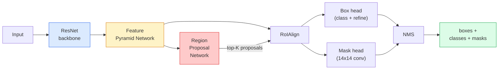

# Instance Segmentation — Mask R-CNN

> Добавьте к детектору Faster R-CNN крошечную ветвь масок, и вы получите сегментацию экземпляров (instance segmentation). Сложная часть — RoIAlign, и она сложнее, чем кажется.

**Type:** Build + Learn
**Languages:** Python
**Prerequisites:** Phase 4 Lesson 06 (YOLO), Phase 4 Lesson 07 (U-Net)
**Time:** ~75 minutes

## Learning Objectives

- Проследить архитектуру Mask R-CNN от начала до конца: backbone, FPN, RPN, RoIAlign, box head, mask head
- Реализовать RoIAlign с нуля и объяснить, почему RoIPool больше не используется
- Использовать предобученную модель torchvision `maskrcnn_resnet50_fpn_v2` для масок экземпляров производственного качества и правильно читать формат ее вывода
- Дообучить Mask R-CNN на небольшом пользовательском наборе данных, заменив box head и mask head и оставив backbone замороженным

## The Problem

Семантическая сегментация дает одну маску на класс. Сегментация экземпляров дает одну маску на объект, даже когда два объекта принадлежат одному классу. Подсчет отдельных объектов, отслеживание между кадрами и измерение сущностей (ограничивающая рамка каждого кирпича в стене, каждой клетки на микроскопическом изображении) требуют сегментации экземпляров.

Mask R-CNN (He et al., 2017) решила эту задачу, переформулировав сегментацию экземпляров как детекцию плюс маску. Конструкция оказалась настолько чистой, что в следующие пять лет почти каждая статья о сегментации экземпляров была вариантом Mask R-CNN, а реализация в torchvision до сих пор остается производственным стандартом для малых и средних наборов данных.

Сложная инженерная проблема — выборка: как вырезать область признаков фиксированного размера из предложенной рамки, углы которой не совпадают с границами пикселей? Ошибка здесь стоит десятых долей пункта mAP повсюду. RoIAlign — ответ.

## The Concept

### The architecture



Пять частей, которые нужно понять:

1. **Backbone** — ResNet-50 или ResNet-101, обученная на ImageNet. Производит иерархию карт признаков с шагами 4, 8, 16, 32.
2. **FPN (Feature Pyramid Network)** — нисходящие и латеральные соединения, которые дают каждому уровню C каналов семантически насыщенных признаков. Детекция обращается к уровню FPN, соответствующему размеру объекта.
3. **RPN (Region Proposal Network)** — небольшая сверточная голова, которая в каждой позиции якоря предсказывает: "есть ли здесь объект?" и "как уточнить рамку?". Производит ~1000 предложений на изображение.
4. **RoIAlign** — выбирает фрагмент признаков фиксированного размера (например, 7x7) из любой рамки на любом уровне FPN. Билинейная выборка, без квантования.
5. **Heads** — двухслойная box head, которая уточняет рамку и выбирает класс, плюс небольшая сверточная mask head, которая выдает бинарную маску `28x28` для каждого предложения.

### Why RoIAlign, not RoIPool

Исходная Fast R-CNN использовала RoIPool, который разбивает предложенную рамку на сетку, берет максимальный признак в каждой ячейке и округляет все координаты до целых чисел. Такое округление смещает карту признаков относительно координат пикселей входного изображения вплоть до целого пикселя карты признаков — мало на изображении 224x224, катастрофично, когда карта признаков имеет шаг 32.

```
RoIPool:
  box (34.7, 51.3, 98.2, 142.9)
  round -> (34, 51, 98, 142)
  split grid -> round each cell boundary
  misalignment accumulates at every step

RoIAlign:
  box (34.7, 51.3, 98.2, 142.9)
  sample at exact float coordinates using bilinear interpolation
  no rounding anywhere
```

RoIAlign бесплатно повышает mask AP на 3-4 пункта на COCO. Теперь его использует каждый детектор, которому важна локализация, включая YOLOv7 seg, RT-DETR и Mask2Former.

### The RPN in one paragraph

В каждой позиции карты признаков разместите K якорных рамок разных размеров и форм. Предскажите оценку объектности для каждого якоря и регрессионное смещение, которое превращает якорь в рамку с лучшим соответствием. Оставьте верхние ~1,000 рамок по score, примените NMS при IoU 0.7 и передайте выжившие предложения головам. RPN обучается со своей собственной мини-функцией потерь — той же структуры, что и функция потерь YOLO из Lesson 6, только с двумя классами (object / no object).

### The mask head

Для каждого предложения (после RoIAlign) mask head — это крошечная FCN: четыре свертки 3x3, deconv 2x, финальная свертка 1x1, которая производит `num_classes` выходных каналов с разрешением `28x28`. Сохраняется только канал, соответствующий предсказанному классу; остальные игнорируются. Это отделяет предсказание маски от классификации.

Увеличьте маску 28x28 до исходного пиксельного размера предложения, чтобы получить финальную бинарную маску.

### Losses

Mask R-CNN складывает четыре функции потерь:

```
L = L_rpn_cls + L_rpn_box + L_box_cls + L_box_reg + L_mask
```

- `L_rpn_cls`, `L_rpn_box` — объектность + регрессия рамки для предложений RPN.
- `L_box_cls` — кросс-энтропия по (C+1) классам (включая фон) в классификаторе головы.
- `L_box_reg` — smooth L1 для уточнения рамки головой.
- `L_mask` — попиксельная бинарная кросс-энтропия на выходе маски 28x28.

Каждая функция потерь имеет свой вес по умолчанию; реализация torchvision открывает их как аргументы конструктора.

### Output format

`torchvision.models.detection.maskrcnn_resnet50_fpn_v2` возвращает список dict, по одному на изображение:

```
{
    "boxes":  (N, 4) in (x1, y1, x2, y2) pixel coordinates,
    "labels": (N,) class IDs, 0 = background so indices are 1-based,
    "scores": (N,) confidence scores,
    "masks":  (N, 1, H, W) float masks in [0, 1] — threshold at 0.5 for binary,
}
```

Маска уже имеет полное разрешение изображения. Выход головы 28x28 был увеличен внутри модели.

## Build It

### Step 1: RoIAlign from scratch

Это один компонент Mask R-CNN, который проще понять как код, чем как прозу.

```python
import torch
import torch.nn.functional as F

def roi_align_single(feature, box, output_size=7, spatial_scale=1 / 16.0):
    """
    feature: (C, H, W) single-image feature map
    box: (x1, y1, x2, y2) in original image pixel coordinates
    output_size: side of the output grid (7 for box head, 14 for mask head)
    spatial_scale: reciprocal of the feature map stride
    """
    C, H, W = feature.shape
    x1, y1, x2, y2 = [c * spatial_scale - 0.5 for c in box]
    bin_w = (x2 - x1) / output_size
    bin_h = (y2 - y1) / output_size

    grid_y = torch.linspace(y1 + bin_h / 2, y2 - bin_h / 2, output_size)
    grid_x = torch.linspace(x1 + bin_w / 2, x2 - bin_w / 2, output_size)
    yy, xx = torch.meshgrid(grid_y, grid_x, indexing="ij")

    gx = 2 * (xx + 0.5) / W - 1
    gy = 2 * (yy + 0.5) / H - 1
    grid = torch.stack([gx, gy], dim=-1).unsqueeze(0)
    sampled = F.grid_sample(feature.unsqueeze(0), grid, mode="bilinear",
                            align_corners=False)
    return sampled.squeeze(0)
```

Каждое число находится в билинейно выбранной позиции. Никакого округления, никакого квантования, никаких отброшенных градиентов.

### Step 2: Compare to torchvision's RoIAlign

```python
from torchvision.ops import roi_align

feature = torch.randn(1, 16, 50, 50)
boxes = torch.tensor([[0, 10, 20, 100, 90]], dtype=torch.float32)  # (batch_idx, x1, y1, x2, y2)

ours = roi_align_single(feature[0], boxes[0, 1:].tolist(), output_size=7, spatial_scale=1/4)
theirs = roi_align(feature, boxes, output_size=(7, 7), spatial_scale=1/4, sampling_ratio=1, aligned=True)[0]

print(f"shape ours:   {tuple(ours.shape)}")
print(f"shape theirs: {tuple(theirs.shape)}")
print(f"max|diff|:    {(ours - theirs).abs().max().item():.3e}")
```

При `sampling_ratio=1` и `aligned=True` оба результата совпадают с точностью до `1e-5`.

### Step 3: Load a pretrained Mask R-CNN

```python
import torch
from torchvision.models.detection import maskrcnn_resnet50_fpn_v2, MaskRCNN_ResNet50_FPN_V2_Weights

model = maskrcnn_resnet50_fpn_v2(weights=MaskRCNN_ResNet50_FPN_V2_Weights.DEFAULT)
model.eval()
print(f"params: {sum(p.numel() for p in model.parameters()):,}")
print(f"classes (including background): {len(model.roi_heads.box_predictor.cls_score.out_features * [0])}")
```

46M параметров, 91 класс (COCO). Первый класс (id 0) — фон; все, что модель действительно детектирует, начинается с id 1.

### Step 4: Run inference

```python
with torch.no_grad():
    x = torch.randn(3, 400, 600)
    predictions = model([x])
p = predictions[0]
print(f"boxes:  {tuple(p['boxes'].shape)}")
print(f"labels: {tuple(p['labels'].shape)}")
print(f"scores: {tuple(p['scores'].shape)}")
print(f"masks:  {tuple(p['masks'].shape)}")
```

Тензор масок имеет форму `(N, 1, H, W)`. Примените порог 0.5, чтобы получить бинарную маску для каждого объекта:

```python
binary_masks = (p['masks'] > 0.5).squeeze(1)  # (N, H, W) boolean
```

### Step 5: Swap the heads for a custom class count

Обычный рецепт дообучения: повторно используйте backbone, FPN и RPN; замените две классификационные головы.

```python
from torchvision.models.detection.faster_rcnn import FastRCNNPredictor
from torchvision.models.detection.mask_rcnn import MaskRCNNPredictor

def build_custom_maskrcnn(num_classes):
    model = maskrcnn_resnet50_fpn_v2(weights=MaskRCNN_ResNet50_FPN_V2_Weights.DEFAULT)
    in_features = model.roi_heads.box_predictor.cls_score.in_features
    model.roi_heads.box_predictor = FastRCNNPredictor(in_features, num_classes)
    in_features_mask = model.roi_heads.mask_predictor.conv5_mask.in_channels
    hidden_layer = 256
    model.roi_heads.mask_predictor = MaskRCNNPredictor(in_features_mask, hidden_layer, num_classes)
    return model

custom = build_custom_maskrcnn(num_classes=5)
print(f"custom cls_score.out_features: {custom.roi_heads.box_predictor.cls_score.out_features}")
```

`num_classes` должен включать фоновый класс, поэтому набор данных с 4 классами объектов использует `num_classes=5`.

### Step 6: Freeze what does not need training

На небольших наборах данных заморозьте backbone и FPN. Обучаются только объектность + регрессия RPN и две головы.

```python
def freeze_backbone_and_fpn(model):
    # torchvision Mask R-CNN packs the FPN inside `model.backbone` (as
    # `model.backbone.fpn`), so iterating `model.backbone.parameters()` covers
    # both the ResNet feature layers and the FPN lateral/output convs.
    for p in model.backbone.parameters():
        p.requires_grad = False
    return model

custom = freeze_backbone_and_fpn(custom)
trainable = sum(p.numel() for p in custom.parameters() if p.requires_grad)
print(f"trainable after freeze: {trainable:,}")
```

На наборах данных из 500 изображений это разница между сходимостью и переобучением.

## Use It

Полный цикл обучения Mask R-CNN в torchvision занимает 40 строк и существенно не меняется между задачами — замените наборы данных и запускайте.

```python
def train_step(model, images, targets, optimizer):
    model.train()
    loss_dict = model(images, targets)
    losses = sum(loss for loss in loss_dict.values())
    optimizer.zero_grad()
    losses.backward()
    optimizer.step()
    return {k: v.item() for k, v in loss_dict.items()}
```

Список `targets` должен содержать dict для каждого изображения с `boxes`, `labels` и `masks` (как бинарные тензоры `(num_instances, H, W)`). Во время обучения модель возвращает dict из четырех потерь, а во время eval — список предсказаний; выбор определяется `model.training`.

Оцениватель `pycocotools` вычисляет mAP@IoU=0.5:0.95 и для рамок, и для масок; нужны оба числа, чтобы понять, является ли узким местом box head или mask head.

## Ship It

Этот урок создает:

- `outputs/prompt-instance-vs-semantic-router.md` — prompt, который задает три вопроса и выбирает instance vs semantic vs panoptic, а также точную модель, с которой стоит начать.
- `outputs/skill-mask-rcnn-head-swapper.md` — skill, который генерирует 10 строк кода для замены heads в любой модели детекции torchvision, если задан новый `num_classes`.

## Exercises

1. **(Easy)** Проверьте ваш RoIAlign относительно `torchvision.ops.roi_align` на 100 случайных рамках. Сообщите максимальную абсолютную разницу. Также запустите RoIPool (поведение до 2017 года) и покажите, что он расходится примерно на ~1-2 пикселя карты признаков на рамках около границы.
2. **(Medium)** Дообучите `maskrcnn_resnet50_fpn_v2` на пользовательском наборе данных из 50 изображений (любые два класса: balloons, fish, pothole, logos). Заморозьте backbone, обучайте 20 эпох, сообщите mask AP@0.5.
3. **(Hard)** Замените mask head в Mask R-CNN на такую, которая предсказывает с разрешением 56x56 вместо 28x28. Измерьте mAP@IoU=0.75 до и после. Объясните, почему прирост (или его отсутствие) соответствует ожидаемому компромиссу между точностью границ и памятью.

## Key Terms

| Term | What people say | What it actually means |
|------|----------------|----------------------|
| Mask R-CNN | "Детекция плюс маски" | Faster R-CNN + небольшая FCN head, которая предсказывает маску 28x28 на каждое предложение и каждый класс |
| FPN | "Пирамида признаков" | Нисходящие + латеральные соединения, которые дают каждому уровню шага C каналов семантически насыщенных признаков |
| RPN | "Генератор регионов" | Небольшая conv head, которая производит ~1000 предложений object/no-object на изображение |
| RoIAlign | "Вырезание без округления" | Билинейно выбирает сетку признаков фиксированного размера из любой рамки с float-координатами |
| RoIPool | "Вырезание до 2017 года" | Та же цель, что и у RoIAlign, но с округлением координат рамки; устарело |
| Mask AP | "Instance mAP" | Average precision, вычисленная с mask IoU вместо box IoU; метрика COCO для сегментации экземпляров |
| Binary mask head | "Маска на класс" | Предсказывает одну бинарную маску на класс для каждого предложения; сохраняется только канал предсказанного класса |
| Background class | "Класс 0" | Универсальный класс "нет объекта"; индексы реальных классов начинаются с 1 |

## Further Reading

- [Mask R-CNN (He et al., 2017)](https://arxiv.org/abs/1703.06870) — статья; раздел 3 о RoIAlign критически важен
- [FPN: Feature Pyramid Networks (Lin et al., 2017)](https://arxiv.org/abs/1612.03144) — статья о FPN; каждый современный детектор использует ее
- [torchvision Mask R-CNN tutorial](https://pytorch.org/tutorials/intermediate/torchvision_tutorial.html) — референс для цикла дообучения
- [Detectron2 model zoo](https://github.com/facebookresearch/detectron2/blob/main/MODEL_ZOO.md) — производственные реализации с обученными весами почти для каждого варианта детекции и сегментации
