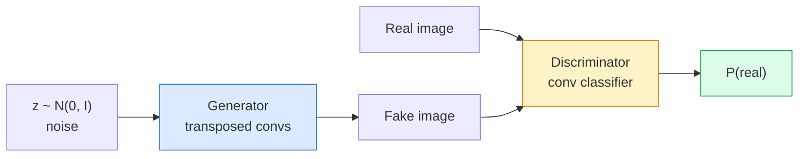
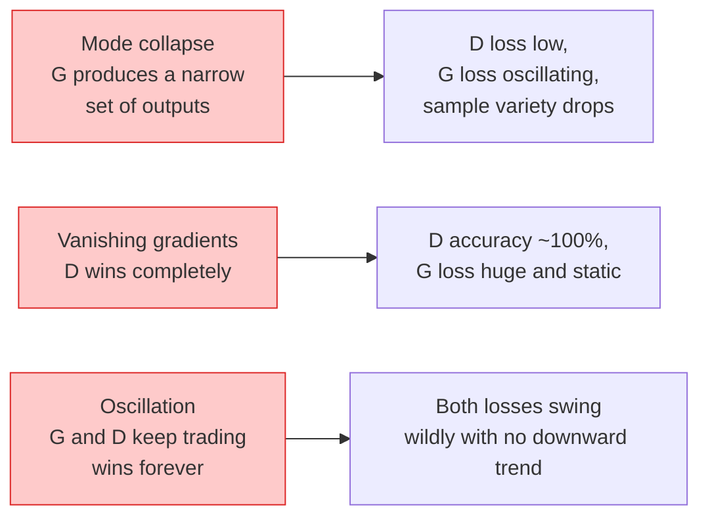

# Генерация изображений — GAN

> GAN — это две нейронные сети в фиксированной игре. Одна рисует, другая критикует. Они улучшаются вместе, пока рисунки не начинают обманывать критика.

**Тип:** Build
**Языки:** Python
**Предварительные требования:** Фаза 4 Урок 03 (CNN), Фаза 3 Урок 06 (оптимизаторы), Фаза 3 Урок 07 (регуляризация)
**Время:** ~75 минут

## Цели обучения

- Объяснить минимаксную игру между генератором и дискриминатором и почему равновесие соответствует p_model = p_data
- Реализовать DCGAN в PyTorch и добиться генерации согласованных синтетических изображений 32x32 менее чем в 60 строк
- Стабилизировать обучение GAN тремя стандартными приемами: ненасыщающаяся функция потерь (non-saturating loss), спектральная нормализация (spectral norm), TTUR (two-timescale update rule)
- Читать кривые обучения, которые отличают здоровую сходимость от коллапса мод, осцилляций и ситуации, где дискриминатор полностью выигрывает

## Проблема

Классификация учит сеть отображать изображения в метки. Генерация обращает задачу: сэмплировать новые изображения, которые выглядят так, будто пришли из того же распределения. Здесь нет "правильного" выхода, с которым можно сравнить diff; есть только распределение, которое нужно имитировать.

Стандартные функции потерь (MSE, cross-entropy) не могут измерить, "пришел ли этот сэмпл из реального распределения". Минимизация ошибки по пикселям дает размытые средние, а не реалистичные сэмплы. Прорыв состоял в том, чтобы выучить функцию потерь: обучить вторую сеть, задача которой — отличать настоящее от поддельного, и использовать ее суждение, чтобы направлять генератор.

GAN (Goodfellow et al., 2014) задали эту схему. К 2018 году StyleGAN уже генерировал лица 1024x1024, неотличимые от фотографий. С тех пор диффузионные модели заняли первое место по качеству и управляемости, но каждый прием, который делает диффузию практичной — выбор нормализации, латентные пространства, функции потерь по признакам, — сначала был понят на GAN.

## Концепция

### Две сети



**Генератор** G принимает вектор шума `z` и выдает изображение. **Дискриминатор** D принимает изображение и выдает один скаляр: вероятность того, что изображение настоящее.

### Игра

G хочет, чтобы D ошибался. D хочет быть правым. Формально:

```
min_G max_D  E_x[log D(x)] + E_z[log(1 - D(G(z)))]
```

Читайте справа налево: D максимизирует точность на настоящих (`log D(real)`) и поддельных (`log (1 - D(fake))`) изображениях. G минимизирует точность D на подделках — он хочет, чтобы `D(G(z))` было высоким.

Goodfellow доказал, что у этого минимакса есть глобальное равновесие, где `p_G = p_data`, D везде выдает 0.5, а расхождение Дженсена-Шеннона между сгенерированным и реальным распределениями равно нулю. Трудная часть — туда добраться.

### Ненасыщающаяся функция потерь

Форма выше численно нестабильна. В начале обучения `D(G(z))` близко к нулю для каждой подделки, поэтому у `log(1 - D(G(z)))` исчезающие градиенты по отношению к G. Исправление: перевернуть функцию потерь G.

```
L_D = -E_x[log D(x)] - E_z[log(1 - D(G(z)))]
L_G = -E_z[log D(G(z))]                          # non-saturating
```

Теперь, когда `D(G(z))` близко к нулю, потеря G велика, а ее градиент информативен. Каждая современная GAN обучается с этим вариантом.

### Правила архитектуры DCGAN

Radford, Metz, Chintala (2015) свели годы неудачных экспериментов к пяти правилам, которые делают обучение GAN стабильным:

1. Заменить pooling на strided convs (в обеих сетях).
2. Использовать batch norm и в генераторе, и в дискриминаторе, кроме выхода G и входа D.
3. Убрать полносвязные слои в более глубоких архитектурах.
4. G использует ReLU на всех слоях, кроме выхода (tanh для выхода в [-1, 1]).
5. D использует LeakyReLU (negative_slope=0.2) на всех слоях.

Каждая современная GAN на основе сверток (StyleGAN, BigGAN, GigaGAN) все еще начинает с этих правил и заменяет части по одной.

### Режимы отказа и их признаки



- **Коллапс мод (mode collapse)**: G находит одно изображение, которое обманывает D, и производит только его. Исправление: добавить minibatch discrimination, spectral norm или обусловливание метками (label-conditioning).
- **Дискриминатор выигрывает**: D слишком быстро становится слишком сильным, градиенты G исчезают. Исправление: уменьшить D, снизить learning rate для D или применить label smoothing к реальным меткам.
- **Осцилляция**: две сети обмениваются победами, так и не приближаясь к равновесию. Исправление: TTUR (D учится быстрее G в 2-4 раза) или переход на функцию потерь Wasserstein.

### Оценка

У GAN нет ground truth, так как понять, что они работают?

- **Просмотр сэмплов** — просто смотрите на 64 сэмпла в конце каждой эпохи. Это обязательно.
- **FID (Fréchet Inception Distance)** — расстояние между распределениями признаков Inception-v3 для реального и сгенерированного наборов. Чем ниже, тем лучше. Стандарт сообщества.
- **Inception Score** — более старая и хрупкая метрика; предпочитайте FID.
- **Precision/Recall for generative models** — измеряет качество (precision) и покрытие (recall) отдельно. Информативнее, чем один FID.

Для небольшого запуска на синтетических данных достаточно просмотра сэмплов.

## Build It

### Шаг 1: Генератор

Небольшой генератор DCGAN, который принимает 64-мерный шум и производит изображение 32x32.

```python
import torch
import torch.nn as nn

class Generator(nn.Module):
    def __init__(self, z_dim=64, img_channels=3, feat=64):
        super().__init__()
        self.net = nn.Sequential(
            nn.ConvTranspose2d(z_dim, feat * 4, kernel_size=4, stride=1, padding=0, bias=False),
            nn.BatchNorm2d(feat * 4),
            nn.ReLU(inplace=True),
            nn.ConvTranspose2d(feat * 4, feat * 2, kernel_size=4, stride=2, padding=1, bias=False),
            nn.BatchNorm2d(feat * 2),
            nn.ReLU(inplace=True),
            nn.ConvTranspose2d(feat * 2, feat, kernel_size=4, stride=2, padding=1, bias=False),
            nn.BatchNorm2d(feat),
            nn.ReLU(inplace=True),
            nn.ConvTranspose2d(feat, img_channels, kernel_size=4, stride=2, padding=1, bias=False),
            nn.Tanh(),
        )

    def forward(self, z):
        return self.net(z.view(z.size(0), -1, 1, 1))
```

Четыре транспонированные свертки, каждая с `kernel_size=4, stride=2, padding=1`, поэтому они аккуратно удваивают пространственный размер. Выходные активации в [-1, 1] через tanh.

### Шаг 2: Дискриминатор

Зеркало генератора. LeakyReLU, strided convs, в конце скалярный логит.

```python
class Discriminator(nn.Module):
    def __init__(self, img_channels=3, feat=64):
        super().__init__()
        self.net = nn.Sequential(
            nn.Conv2d(img_channels, feat, kernel_size=4, stride=2, padding=1),
            nn.LeakyReLU(0.2, inplace=True),
            nn.Conv2d(feat, feat * 2, kernel_size=4, stride=2, padding=1, bias=False),
            nn.BatchNorm2d(feat * 2),
            nn.LeakyReLU(0.2, inplace=True),
            nn.Conv2d(feat * 2, feat * 4, kernel_size=4, stride=2, padding=1, bias=False),
            nn.BatchNorm2d(feat * 4),
            nn.LeakyReLU(0.2, inplace=True),
            nn.Conv2d(feat * 4, 1, kernel_size=4, stride=1, padding=0),
        )

    def forward(self, x):
        return self.net(x).view(-1)
```

Последняя свертка уменьшает карту признаков `4x4` до `1x1`. Выход — один скаляр на изображение; применяйте sigmoid только во время вычисления функции потерь.

### Шаг 3: Шаг обучения

Чередование: один раз обновить D, затем один раз G, в каждом батче.

```python
import torch.nn.functional as F

def train_step(G, D, real, z, opt_g, opt_d, device):
    real = real.to(device)
    bs = real.size(0)

    # D step
    opt_d.zero_grad()
    d_real = D(real)
    d_fake = D(G(z).detach())
    loss_d = (F.binary_cross_entropy_with_logits(d_real, torch.ones_like(d_real))
              + F.binary_cross_entropy_with_logits(d_fake, torch.zeros_like(d_fake)))
    loss_d.backward()
    opt_d.step()

    # G step
    opt_g.zero_grad()
    d_fake = D(G(z))
    loss_g = F.binary_cross_entropy_with_logits(d_fake, torch.ones_like(d_fake))
    loss_g.backward()
    opt_g.step()

    return loss_d.item(), loss_g.item()
```

`G(z).detach()` на шаге D критически важен: мы не хотим, чтобы градиенты текли в G во время обновления D. Забыть это — классическая ошибка новичка.

### Шаг 4: Полный цикл обучения на синтетических фигурах

```python
from torch.utils.data import DataLoader, TensorDataset
import numpy as np

def synthetic_images(num=2000, size=32, seed=0):
    rng = np.random.default_rng(seed)
    imgs = np.zeros((num, 3, size, size), dtype=np.float32) - 1.0
    for i in range(num):
        r = rng.uniform(6, 12)
        cx, cy = rng.uniform(r, size - r, size=2)
        yy, xx = np.meshgrid(np.arange(size), np.arange(size), indexing="ij")
        mask = (xx - cx) ** 2 + (yy - cy) ** 2 < r ** 2
        color = rng.uniform(-0.5, 1.0, size=3)
        for c in range(3):
            imgs[i, c][mask] = color[c]
    return torch.from_numpy(imgs)

device = "cuda" if torch.cuda.is_available() else "cpu"
data = synthetic_images()
loader = DataLoader(TensorDataset(data), batch_size=64, shuffle=True)

G = Generator(z_dim=64, img_channels=3, feat=32).to(device)
D = Discriminator(img_channels=3, feat=32).to(device)
opt_g = torch.optim.Adam(G.parameters(), lr=2e-4, betas=(0.5, 0.999))
opt_d = torch.optim.Adam(D.parameters(), lr=2e-4, betas=(0.5, 0.999))

for epoch in range(10):
    for (batch,) in loader:
        z = torch.randn(batch.size(0), 64, device=device)
        ld, lg = train_step(G, D, batch, z, opt_g, opt_d, device)
    print(f"epoch {epoch}  D {ld:.3f}  G {lg:.3f}")
```

`Adam(lr=2e-4, betas=(0.5, 0.999))` — стандарт DCGAN: низкое beta1 не дает члену импульса (momentum) слишком сильно стабилизировать состязательную игру.

### Шаг 5: Сэмплирование

```python
@torch.no_grad()
def sample(G, n=16, z_dim=64, device="cpu"):
    G.eval()
    z = torch.randn(n, z_dim, device=device)
    imgs = G(z)
    imgs = (imgs + 1) / 2
    return imgs.clamp(0, 1)
```

Всегда переключайтесь в режим eval перед сэмплированием. Для DCGAN это важно, потому что используются накопленные статистики batch norm, а не статистики текущего батча.

### Шаг 6: Спектральная нормализация

Drop-in замена BN в дискриминаторе, которая гарантирует, что сеть является 1-Lipschitz. Исправляет большинство отказов вида "D выигрывает слишком сильно".

```python
from torch.nn.utils import spectral_norm

def build_sn_discriminator(img_channels=3, feat=64):
    return nn.Sequential(
        spectral_norm(nn.Conv2d(img_channels, feat, 4, 2, 1)),
        nn.LeakyReLU(0.2, inplace=True),
        spectral_norm(nn.Conv2d(feat, feat * 2, 4, 2, 1)),
        nn.LeakyReLU(0.2, inplace=True),
        spectral_norm(nn.Conv2d(feat * 2, feat * 4, 4, 2, 1)),
        nn.LeakyReLU(0.2, inplace=True),
        spectral_norm(nn.Conv2d(feat * 4, 1, 4, 1, 0)),
    )
```

Замените `Discriminator` на `build_sn_discriminator()`, и часто прием TTUR не понадобится. Спектральная нормализация — самое простое отдельное улучшение устойчивости, которое можно применить.

## Use It

Для серьезной генерации используйте предобученные веса или переходите на диффузию. Две стандартные библиотеки:

- `torch_fidelity` вычисляет FID / IS для вашего генератора без написания собственного кода оценки.
- `pytorch-gan-zoo` (legacy) и `StudioGAN` поставляют проверенные реализации DCGAN, WGAN-GP, SN-GAN, StyleGAN и BigGAN.

В 2026 году GAN все еще лучший выбор для: генерации изображений в реальном времени (latency <10 ms), переноса стиля, image-to-image translation с точным управлением (Pix2Pix, CycleGAN). Диффузия выигрывает в фотореализме и текстовом обусловливании.

## Ship It

Этот урок создает:

- `outputs/prompt-gan-training-triage.md` — prompt, который читает описание кривой обучения и выбирает режим отказа (mode collapse, D-wins, oscillation) плюс одно рекомендуемое исправление.
- `outputs/skill-dcgan-scaffold.md` — skill, который пишет каркас DCGAN по `z_dim`, целевому `image_size` и `num_channels`, включая цикл обучения и сохранение сэмплов.

## Упражнения

1. **(Easy)** Обучите DCGAN выше на синтетическом наборе кругов и сохраняйте сетку из 16 сэмплов в конце каждой эпохи. К какой эпохе сгенерированные круги становятся явно круглыми?
2. **(Medium)** Замените batch norm дискриминатора на spectral norm. Обучите обе версии рядом. Какая сходится быстрее? У какой ниже дисперсия на трех seed?
3. **(Hard)** Реализуйте условную DCGAN: подайте метку класса и в G, и в D (concat one-hot к шуму в G, concat канал с class embedding в D). Обучите на синтетическом наборе "circles vs squares" из урока 7 и покажите, что обусловливание классом работает, сэмплируя с конкретными метками.

## Ключевые термины

| Термин | Как говорят | Что это на самом деле значит |
|------|----------------|----------------------|
| Генератор (G) | "Сеть, которая рисует" | Отображает шум в изображения; обучается обманывать дискриминатор |
| Дискриминатор (D) | "Критик" | Бинарный классификатор; обучается отличать реальные изображения от сгенерированных |
| Минимакс | "Игра" | min по G, max по D состязательной функции потерь; равновесие — p_G = p_data |
| Ненасыщающаяся функция потерь (non-saturating loss) | "Численно разумная версия" | Потеря G равна -log(D(G(z))) вместо log(1 - D(G(z))), чтобы избежать исчезающих градиентов в начале обучения |
| Коллапс мод (mode collapse) | "Генератор делает одну вещь" | G производит только малое подмножество распределения данных; исправляется SN, minibatch discrimination или большим батчем |
| TTUR | "Две скорости обучения" | D учится быстрее G, обычно в 2-4 раза; стабилизирует обучение |
| Спектральная нормализация (spectral norm) | "1-Lipschitz слой" | Нормализация весов, которая ограничивает константу Липшица каждого слоя; не дает D становиться сколь угодно крутым |
| FID | "Fréchet Inception Distance" | Расстояние между распределениями признаков Inception-v3 для реального и сгенерированного наборов; стандартная метрика оценки |

## Дополнительное чтение

- [Generative Adversarial Networks (Goodfellow et al., 2014)](https://arxiv.org/abs/1406.2661) — статья, с которой все началось
- [DCGAN (Radford, Metz, Chintala, 2015)](https://arxiv.org/abs/1511.06434) — правила архитектуры, которые сделали GAN обучаемыми
- [Spectral Normalization for GANs (Miyato et al., 2018)](https://arxiv.org/abs/1802.05957) — самый полезный отдельный прием стабилизации
- [StyleGAN3 (Karras et al., 2021)](https://arxiv.org/abs/2106.12423) — SOTA GAN; читается как сборник лучших хитов всех приемов последнего десятилетия
