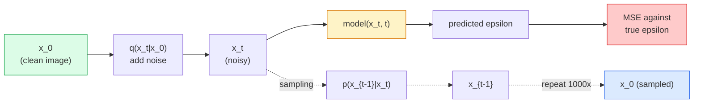

# Генерация изображений — диффузионные модели

> Диффузионная модель учится устранять шум. Обучите ее удалять крошечную долю шума из зашумленного изображения, повторите это в обратном направлении тысячу раз, и у вас получится генератор изображений.

**Тип:** Сборка
**Языки:** Python
**Предварительные требования:** Phase 4 Lesson 07 (U-Net), Phase 1 Lesson 06 (Probability), Phase 3 Lesson 06 (Optimizers)
**Время:** ~75 минут

## Цели обучения

- Вывести прямой процесс зашумления `x_0 -> x_1 -> ... -> x_T` и объяснить, почему замкнутая форма `q(x_t | x_0)` верна для любого t
- Реализовать обучающую цель в стиле DDPM, которая регрессирует шум, добавленный на каждом шаге, и семплер, который идет назад от чистого шума к изображению
- Построить U-Net с временным условием, достаточно маленькую для обучения на CPU, которая предсказывает шум для любого временного шага
- Объяснить различие между семплированием DDPM и DDIM и когда уместно каждое из них (Lesson 23 подробно рассматривает flow matching и rectified flow)

## Проблема

GAN генерируют за один проход: шум на входе, изображение на выходе, один прямой проход. Они быстрые, но их трудно обучать. Диффузионные модели генерируют итеративно: начинают с чистого шума, устраняют шум небольшими шагами, и появляется изображение. Они медленные, но их легко обучать. В последние пять лет именно последнее свойство доминировало: любая небольшая команда может обучить диффузионную модель и получить приемлемые сэмплы; обучение GAN — это ремесло, которому учатся годами неудачных запусков.

Помимо стабильности обучения, итеративная структура диффузии раскрывает все, что умеет современная генерация изображений: текстовое условие, inpainting (дорисовка), редактирование изображений, super-resolution (сверхразрешение), управляемый стиль. Каждый шаг цикла семплирования — это место, куда можно внедрить новое ограничение. Благодаря этому зацепу Stable Diffusion, Imagen, DALL-E 3, Midjourney и каждая управляемая модель изображений, которую вы будете использовать, основаны на диффузии.

В этом уроке строится минимальная DDPM: прямое зашумление, обратное шумоподавление, цикл обучения. Следующий урок (Stable Diffusion) соединяет ее с производственной системой с VAE, текстовым энкодером и classifier-free guidance.

## Концепция

### Прямой процесс

Возьмите изображение `x_0`. Добавьте небольшое количество гауссова шума, чтобы получить `x_1`. Добавьте еще немного, чтобы получить `x_2`. Продолжайте T шагов, пока `x_T` не станет почти неотличимым от чистого гауссова шума.

```
q(x_t | x_{t-1}) = N(x_t; sqrt(1 - beta_t) * x_{t-1},  beta_t * I)
```

`beta_t` — это малое расписание дисперсии, обычно линейное от 0.0001 до 0.02 на T=1000 шагах. Каждый шаг слегка ослабляет сигнал и вводит новый шум.

### Переход в замкнутой форме

Добавление шума по одному шагу — это марковская цепь, но математика сворачивается: можно сэмплировать `x_t` напрямую из `x_0` за один шаг.

```
Define alpha_t = 1 - beta_t
Define alpha_bar_t = prod_{s=1..t} alpha_s

Then:
  q(x_t | x_0) = N(x_t; sqrt(alpha_bar_t) * x_0,  (1 - alpha_bar_t) * I)

Equivalently:
  x_t = sqrt(alpha_bar_t) * x_0 + sqrt(1 - alpha_bar_t) * epsilon
  where epsilon ~ N(0, I)
```

Это единственное уравнение — главная причина, по которой диффузия практична. Во время обучения вы выбираете случайный `t`, сэмплируете `x_t` напрямую из `x_0` и обучаете за один шаг — симуляция полной марковской цепи не нужна.

### Обратный процесс

Прямой процесс фиксирован. Обратный процесс `p(x_{t-1} | x_t)` — это то, что изучает нейронная сеть. Диффузионные модели не предсказывают `x_{t-1}` напрямую; они предсказывают шум `epsilon`, добавленный на шаге t, а математика выводит из него `x_{t-1}`.



### Функция потерь при обучении

На каждом шаге обучения:

1. Сэмплируйте реальное изображение `x_0`.
2. Сэмплируйте временной шаг `t` равномерно из [1, T].
3. Сэмплируйте шум `epsilon ~ N(0, I)`.
4. Вычислите `x_t = sqrt(alpha_bar_t) * x_0 + sqrt(1 - alpha_bar_t) * epsilon`.
5. Предскажите `epsilon_theta(x_t, t)` с помощью сети.
6. Минимизируйте `|| epsilon - epsilon_theta(x_t, t) ||^2`.

Вот и все. Нейронная сеть учится предсказывать шум на любом временном шаге. Функция потерь — MSE. Нет состязательной игры, нет коллапса, нет осцилляций.

### Семплер (DDPM)

Чтобы сгенерировать: начните с `x_T ~ N(0, I)` и идите назад по одному шагу.

```
for t = T, T-1, ..., 1:
    eps = model(x_t, t)
    x_{t-1} = (1 / sqrt(alpha_t)) * (x_t - (beta_t / sqrt(1 - alpha_bar_t)) * eps) + sqrt(beta_t) * z
    where z ~ N(0, I) if t > 1, else 0
return x_0
```

Ключевой момент: хотя обратное условное распределение в общем случае неизвестно в замкнутой форме, для этого конкретного гауссова прямого процесса оно известно. Неуклюжие коэффициенты — это то, что дает правило Байеса.

### Почему 1000 шагов

Расписание шума в прямом процессе выбирают так, чтобы каждый шаг добавлял ровно столько шума, что обратный шаг был почти гауссовым. Слишком мало шагов — и обратный шаг далек от гауссова, сеть не может хорошо его моделировать. Слишком много шагов — и семплирование становится дорогим при убывающей отдаче. T=1000 с линейным расписанием — стандарт DDPM.

### DDIM: семплирование в 20 раз быстрее

Обучение то же самое. Меняется семплирование. DDIM (Song et al., 2020) задает детерминированный обратный процесс, который пропускает временные шаги без переобучения. Семплирование за 50 шагов с DDIM дает качество, близкое к DDPM на 1000 шагах. Каждая производственная система использует DDIM или еще более быстрый вариант (DPM-Solver, Euler ancestral).

### Временное условие

Сеть `epsilon_theta(x_t, t)` должна знать, какой временной шаг она очищает от шума. Современные диффузионные модели вводят `t` через синусоидальные временные эмбеддинги (та же идея, что и позиционное кодирование в трансформерах), которые добавляются к картам признаков на каждом уровне U-Net.

```
t_embedding = sinusoidal(t)
feature_map += MLP(t_embedding)
```

Без временного условия сеть вынуждена угадывать уровень шума по самому изображению; это работает, но требует гораздо больше сэмплов.

## Соберите это

### Шаг 1: Расписание шума

```python
import torch

def linear_beta_schedule(T=1000, beta_start=1e-4, beta_end=2e-2):
    return torch.linspace(beta_start, beta_end, T)


def precompute_schedule(betas):
    alphas = 1.0 - betas
    alphas_cumprod = torch.cumprod(alphas, dim=0)
    return {
        "betas": betas,
        "alphas": alphas,
        "alphas_cumprod": alphas_cumprod,
        "sqrt_alphas_cumprod": torch.sqrt(alphas_cumprod),
        "sqrt_one_minus_alphas_cumprod": torch.sqrt(1.0 - alphas_cumprod),
        "sqrt_recip_alphas": torch.sqrt(1.0 / alphas),
    }

schedule = precompute_schedule(linear_beta_schedule(T=1000))
```

Предвычислите один раз, выбирайте по индексу во время обучения и семплирования.

### Шаг 2: Прямая диффузия (q_sample)

```python
def q_sample(x0, t, noise, schedule):
    sqrt_a = schedule["sqrt_alphas_cumprod"][t].view(-1, 1, 1, 1)
    sqrt_one_minus_a = schedule["sqrt_one_minus_alphas_cumprod"][t].view(-1, 1, 1, 1)
    return sqrt_a * x0 + sqrt_one_minus_a * noise
```

Однострочная замкнутая форма. `t` — это батч временных шагов, по одному на каждое изображение в батче.

### Шаг 3: Крошечная U-Net с временным условием

```python
import torch.nn as nn
import torch.nn.functional as F
import math

def timestep_embedding(t, dim=64):
    half = dim // 2
    freqs = torch.exp(-math.log(10000) * torch.arange(half, device=t.device) / half)
    args = t[:, None].float() * freqs[None]
    emb = torch.cat([args.sin(), args.cos()], dim=-1)
    return emb


class TinyUNet(nn.Module):
    def __init__(self, img_channels=3, base=32, t_dim=64):
        super().__init__()
        self.t_mlp = nn.Sequential(
            nn.Linear(t_dim, base * 4),
            nn.SiLU(),
            nn.Linear(base * 4, base * 4),
        )
        self.t_dim = t_dim
        self.enc1 = nn.Conv2d(img_channels, base, 3, padding=1)
        self.enc2 = nn.Conv2d(base, base * 2, 4, stride=2, padding=1)
        self.mid = nn.Conv2d(base * 2, base * 2, 3, padding=1)
        self.dec1 = nn.ConvTranspose2d(base * 2, base, 4, stride=2, padding=1)
        self.dec2 = nn.Conv2d(base * 2, img_channels, 3, padding=1)
        self.time_proj = nn.Linear(base * 4, base * 2)

    def forward(self, x, t):
        t_emb = timestep_embedding(t, self.t_dim)
        t_emb = self.t_mlp(t_emb)
        t_proj = self.time_proj(t_emb)[:, :, None, None]

        h1 = F.silu(self.enc1(x))
        h2 = F.silu(self.enc2(h1)) + t_proj
        h3 = F.silu(self.mid(h2))
        d1 = F.silu(self.dec1(h3))
        d2 = torch.cat([d1, h1], dim=1)
        return self.dec2(d2)
```

Двухуровневая U-Net с временным условием, введенным в bottleneck (узкое место). Для реальных изображений увеличьте глубину и ширину.

### Шаг 4: Цикл обучения

```python
def train_step(model, x0, schedule, optimizer, device, T=1000):
    model.train()
    x0 = x0.to(device)
    bs = x0.size(0)
    t = torch.randint(0, T, (bs,), device=device)
    noise = torch.randn_like(x0)
    x_t = q_sample(x0, t, noise, schedule)
    pred = model(x_t, t)
    loss = F.mse_loss(pred, noise)
    optimizer.zero_grad()
    loss.backward()
    optimizer.step()
    return loss.item()
```

Это весь цикл обучения. Никакой игры GAN, никакой специализированной функции потерь, один вызов MSE.

### Шаг 5: Семплер (DDPM)

```python
@torch.no_grad()
def sample(model, schedule, shape, T=1000, device="cpu"):
    model.eval()
    x = torch.randn(shape, device=device)
    betas = schedule["betas"].to(device)
    sqrt_one_minus_a = schedule["sqrt_one_minus_alphas_cumprod"].to(device)
    sqrt_recip_alphas = schedule["sqrt_recip_alphas"].to(device)

    for t in reversed(range(T)):
        t_batch = torch.full((shape[0],), t, dtype=torch.long, device=device)
        eps = model(x, t_batch)
        coef = betas[t] / sqrt_one_minus_a[t]
        mean = sqrt_recip_alphas[t] * (x - coef * eps)
        if t > 0:
            x = mean + torch.sqrt(betas[t]) * torch.randn_like(x)
        else:
            x = mean
    return x
```

1000 прямых проходов, чтобы получить один батч сэмплов. В реальном коде вы заменили бы это на DDIM-семплер на 50 шагов.

### Шаг 6: DDIM-семплер (детерминированный, ~20x быстрее)

```python
@torch.no_grad()
def sample_ddim(model, schedule, shape, steps=50, T=1000, device="cpu", eta=0.0):
    model.eval()
    x = torch.randn(shape, device=device)
    alphas_cumprod = schedule["alphas_cumprod"].to(device)

    ts = torch.linspace(T - 1, 0, steps + 1).long()
    for i in range(steps):
        t = ts[i]
        t_prev = ts[i + 1]
        t_batch = torch.full((shape[0],), t, dtype=torch.long, device=device)
        eps = model(x, t_batch)
        a_t = alphas_cumprod[t]
        a_prev = alphas_cumprod[t_prev] if t_prev >= 0 else torch.tensor(1.0, device=device)
        x0_pred = (x - torch.sqrt(1 - a_t) * eps) / torch.sqrt(a_t)
        sigma = eta * torch.sqrt((1 - a_prev) / (1 - a_t) * (1 - a_t / a_prev))
        dir_xt = torch.sqrt(1 - a_prev - sigma ** 2) * eps
        noise = sigma * torch.randn_like(x) if eta > 0 else 0
        x = torch.sqrt(a_prev) * x0_pred + dir_xt + noise
    return x
```

`eta=0` полностью детерминирован (один и тот же шумовой вход всегда дает один и тот же выход). `eta=1` восстанавливает DDPM.

## Используйте это

Для производственной работы используйте `diffusers`:

```python
from diffusers import DDPMScheduler, UNet2DModel

unet = UNet2DModel(sample_size=32, in_channels=3, out_channels=3, layers_per_block=2)
scheduler = DDPMScheduler(num_train_timesteps=1000)
```

Библиотека поставляет готовые планировщики (DDPM, DDIM, DPM-Solver, Euler, Heun), настраиваемые U-Net, пайплайны для text-to-image и image-to-image, а также вспомогательные средства для LoRA fine-tuning.

Для исследований `k-diffusion` (Katherine Crowson) содержит самые точные эталонные реализации и лучшие варианты семплирования.

## Отправьте это

Этот урок создает:

- `outputs/prompt-diffusion-sampler-picker.md` — промпт, который выбирает DDPM / DDIM / DPM-Solver / Euler на основе целевого качества, бюджета задержки и типа условия.
- `outputs/skill-noise-schedule-designer.md` — навык, который создает линейное, косинусное или сигмоидальное beta-расписание по заданным T и целевому уровню искажения, а также диагностические графики отношения сигнал/шум во времени.

## Упражнения

1. **(Легко)** Визуализируйте прямой процесс: возьмите одно изображение и постройте `x_t` при `t in [0, 100, 250, 500, 750, 1000]`. Убедитесь, что `x_1000` выглядит как чистый гауссов шум.
2. **(Средне)** Обучите TinyUNet на датасете synthetic-circles в течение 20 эпох и сэмплируйте 16 кругов. Сравните семплирование DDPM (1000 шагов) и DDIM (50 шагов) — производят ли они похожие изображения из одного и того же зерна шума?
3. **(Сложно)** Реализуйте косинусное расписание шума (Nichol & Dhariwal, 2021): `alpha_bar_t = cos^2((t/T + s) / (1 + s) * pi / 2)`. Обучите ту же модель с линейным и косинусным расписаниями и покажите, что косинусное дает лучшие сэмплы при малом числе шагов.

## Ключевые термины

| Термин | Как говорят | Что это на самом деле означает |
|------|----------------|----------------------|
| Прямой процесс (Forward process) | "Добавлять шум со временем" | Фиксированная марковская цепь, которая за T шагов искажает изображение до гауссова шума |
| Обратный процесс (Reverse process) | "Пошагово устранять шум" | Выученное распределение, которое идет назад от шума к изображению |
| Предсказание epsilon (Epsilon prediction) | "Предсказать шум" | Цель обучения: `epsilon_theta(x_t, t)` предсказывает шум, добавленный на шаге t |
| Beta-расписание (Beta schedule) | "Величины шума" | Последовательность из T малых дисперсий, которые задают, сколько шума входит на каждом шаге |
| alpha_bar_t | "Кумулятивный коэффициент сохранения" | Произведение (1 - beta_s) до времени t; большее t означает, что осталось меньше сигнала |
| DDPM-семплер (DDPM sampler) | "Анцестральный, стохастический" | Сэмплирует каждое x_{t-1} из его условного гауссова распределения; 1000 шагов |
| DDIM-семплер (DDIM sampler) | "Детерминированный, быстрый" | Переписывает семплирование как детерминированное ODE; 20-100 шагов с похожим качеством |
| Временное условие (Time conditioning) | "Сообщить модели, какой t" | Синусоидальный эмбеддинг t, введенный в U-Net, чтобы она знала уровень шума |

## Дополнительное чтение

- [Denoising Diffusion Probabilistic Models (Ho et al., 2020)](https://arxiv.org/abs/2006.11239) — статья, которая сделала диффузию практичной и превзошла GAN по FID
- [Improved DDPM (Nichol & Dhariwal, 2021)](https://arxiv.org/abs/2102.09672) — косинусное расписание и v-параметризация
- [DDIM (Song, Meng, Ermon, 2020)](https://arxiv.org/abs/2010.02502) — детерминированный семплер, который сделал возможным вывод в реальном времени
- [Elucidating the Design Space of Diffusion (Karras et al., 2022)](https://arxiv.org/abs/2206.00364) — единый взгляд на каждый проектный выбор в диффузии; лучшая актуальная ссылка
