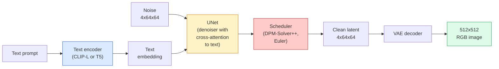

# Stable Diffusion — архитектура и дообучение

> Stable Diffusion — это DDPM, который работает в латентном пространстве предобученного VAE, обусловливается текстом через cross-attention, сэмплируется быстрым детерминированным ODE-решателем и направляется classifier-free guidance.

**Тип:** изучить + использовать
**Языки:** Python
**Предварительные требования:** фаза 4, урок 10 (Diffusion), фаза 7, урок 02 (Self-Attention)
**Время:** ~75 минут

## Цели обучения

- Проследить пять частей пайплайна Stable Diffusion: VAE, текстовый энкодер, U-Net, scheduler, safety checker — и понять, что каждая из них на самом деле делает
- Объяснить latent diffusion и почему обучение в латентном пространстве 4x64x64 (вместо изображения 3x512x512) снижает вычисления в 48x без потери качества
- Использовать `diffusers` для генерации изображений, запуска image-to-image, inpainting и генерации под управлением ControlNet
- Дообучить Stable Diffusion с LoRA на небольшом пользовательском датасете и загрузить LoRA-адаптер при инференсе

## Проблема

Обучать DDPM напрямую на RGB-изображениях 512x512 дорого. На каждом шаге обучения backprop проходит через U-Net, которая видит 3x512x512 = 786,432 входных значения, а сэмплирование требует 50+ прямых проходов через ту же U-Net. На уровне качества Stable Diffusion 1.5 (выпущенной в 2022 году) диффузия в пиксельном пространстве потребовала бы примерно 256 GPU-месяцев обучения и 10-30 секунд на изображение на потребительском GPU.

Прием, который сделал text-to-image с открытыми весами практичным, — это **latent diffusion** (Rombach et al., CVPR 2022). Обучите VAE, который отображает изображение 3x512x512 в латентный тензор 4x64x64 и обратно, затем выполняйте диффузию в этом латентном пространстве. Вычисления падают в `(3*512*512)/(4*64*64) = 48x`. Сэмплирование сокращается с десятков секунд до менее чем двух секунд на том же GPU.

Почти каждая современная модель генерации изображений — SDXL, SD3, FLUX, HunyuanDiT, Wan-Video — является моделью латентной диффузии с вариациями в автоэнкодере, денойзере (U-Net или DiT) и текстовом обусловливании. Изучив Stable Diffusion, вы освоите шаблон.

## Концепция

### Пайплайн



- **VAE** — замороженный автоэнкодер. Энкодер превращает изображение в латенты (используется для img2img и обучения). Декодер превращает латенты обратно в изображение.
- **Текстовый энкодер** — текстовый энкодер CLIP (SD 1.x/2.x), CLIP-L + CLIP-G (SDXL) или T5-XXL (SD3/FLUX). Производит последовательность эмбеддингов токенов.
- **U-Net** — денойзер. Имеет слои cross-attention, которые на каждом уровне разрешения направляют внимание от латентов к текстовому эмбеддингу.
- **Scheduler** — алгоритм сэмплирования (DDIM, Euler, DPM-Solver++). Выбирает sigmas, смешивает предсказанный шум обратно в латент.
- **Safety checker** — необязательный фильтр NSFW / незаконного контента на выходном изображении.

### Classifier-free guidance (CFG, наведение без классификатора)

Обычное текстовое обусловливание учит `epsilon_theta(x_t, t, c)` для каждого промпта `c`. CFG обучает ту же сеть с `c`, отброшенным в 10% случаев (замененным пустым эмбеддингом), что дает одну модель, которая предсказывает и условный, и безусловный шум. При инференсе:

```
eps = eps_uncond + w * (eps_cond - eps_uncond)
```

`w` — это guidance scale. `w=0` означает безусловную генерацию, `w=1` — обычную условную, `w>1` подталкивает выход к тому, чтобы он был "сильнее обусловлен промптом", ценой разнообразия. Значение SD по умолчанию — `w=7.5`.

CFG — причина, по которой text-to-image работает с производственным качеством. Без него промпты слабо смещают выход; с ним промпты доминируют.

### Геометрия латентного пространства

4-канальный латент VAE — это не просто сжатое изображение. Это многообразие, где арифметика примерно соответствует семантическим правкам (prompt engineering + интерполяция оба живут здесь), и где диффузионная U-Net была обучена расходовать весь свой бюджет моделирования. Декодирование случайного латента 4x64x64 не создает случайно выглядящее изображение — оно создает мусор, потому что только конкретное подмногообразие латентов декодируется в валидные изображения.

Два следствия:

1. **Img2img** = закодировать изображение в латент, добавить частичный шум, запустить денойзер, декодировать. Структура изображения сохраняется, потому что кодирование почти обратимо; содержимое меняется на основе промпта.
2. **Inpainting** = то же, что img2img, но денойзер обновляет только маскированные области; немаскированные области сохраняются в закодированном латенте.

### Архитектура U-Net

SD U-Net — это большая версия TinyUNet из урока 10 с тремя добавлениями:

- **Transformer blocks** на каждом пространственном разрешении, содержащие self-attention + cross-attention к текстовому эмбеддингу.
- **Time embedding** через MLP поверх синусоидального кодирования.
- **Skip connections** между энкодером и декодером на совпадающих разрешениях.

Общее число параметров в SD 1.5: ~860M. SDXL: ~2.6B. FLUX: ~12B. Рост числа параметров в основном находится в слоях внимания.

### Дообучение LoRA

Полное дообучение Stable Diffusion требует 20+ GB VRAM и обновляет 860M параметров. LoRA (Low-Rank Adaptation) держит базовую модель замороженной и внедряет небольшие матрицы рангового разложения в слои внимания. LoRA-адаптер для SD обычно занимает 10-50 MB, обучается за 10-60 минут на одном потребительском GPU и загружается при инференсе как drop-in modification.

```
Original: W_q : (d_in, d_out)   frozen
LoRA:     W_q + alpha * (A @ B)   where A : (d_in, r), B : (r, d_out)

r is typically 4-32.
```

LoRA — это способ распространения почти каждого community fine-tune. CivitAI и Hugging Face размещают миллионы таких адаптеров.

### Scheduler, которые вы встретите

- **DDIM** — детерминированный, ~50 шагов, простой.
- **Euler ancestral** — стохастический, 30-50 шагов, чуть более творческие сэмплы.
- **DPM-Solver++ 2M Karras** — детерминированный, 20-30 шагов, производственное значение по умолчанию.
- **LCM / TCD / Turbo** — consistency models и дистиллированные варианты; 1-4 шага ценой некоторого качества.

Замена scheduler — это изменение в одну строку в `diffusers`, и иногда она исправляет проблемы с сэмплами без какого-либо переобучения.

## Соберите это

Этот урок использует `diffusers` end-to-end, а не пересобирает Stable Diffusion с нуля. Компоненты, которые вам пришлось бы пересоздать (VAE, текстовый энкодер, U-Net, scheduler), сами являются темами отдельных уроков; здесь цель — свободное владение производственным API.

### Шаг 1: Text-to-image

```python
import torch
from diffusers import StableDiffusionPipeline

pipe = StableDiffusionPipeline.from_pretrained(
    "runwayml/stable-diffusion-v1-5",
    torch_dtype=torch.float16,
).to("cuda")

image = pipe(
    prompt="a dog riding a skateboard in tokyo, studio ghibli style",
    guidance_scale=7.5,
    num_inference_steps=25,
    generator=torch.Generator("cuda").manual_seed(42),
).images[0]
image.save("dog.png")
```

`float16` вдвое снижает VRAM без видимой потери качества. `num_inference_steps=25` со стандартным DPM-Solver++ соответствует `num_inference_steps=50` с DDIM.

### Шаг 2: Замените scheduler

```python
from diffusers import DPMSolverMultistepScheduler, EulerAncestralDiscreteScheduler

pipe.scheduler = DPMSolverMultistepScheduler.from_config(pipe.scheduler.config)
pipe.scheduler = EulerAncestralDiscreteScheduler.from_config(pipe.scheduler.config)
```

Состояние scheduler отделено от весов U-Net. Вы можете обучаться на DDPM и сэмплировать с любым scheduler.

### Шаг 3: Image-to-image

```python
from diffusers import StableDiffusionImg2ImgPipeline
from PIL import Image

img2img = StableDiffusionImg2ImgPipeline.from_pretrained(
    "runwayml/stable-diffusion-v1-5",
    torch_dtype=torch.float16,
).to("cuda")

init_image = Image.open("dog.png").convert("RGB").resize((512, 512))
out = img2img(
    prompt="a dog riding a skateboard, oil painting",
    image=init_image,
    strength=0.6,
    guidance_scale=7.5,
).images[0]
```

`strength` — это то, сколько шума нужно добавить перед денойзингом (0.0 = без изменений, 1.0 = полная регенерация). 0.5-0.7 — стандартный диапазон для переноса стиля.

### Шаг 4: Inpainting

```python
from diffusers import StableDiffusionInpaintPipeline

inpaint = StableDiffusionInpaintPipeline.from_pretrained(
    "runwayml/stable-diffusion-inpainting",
    torch_dtype=torch.float16,
).to("cuda")

image = Image.open("dog.png").convert("RGB").resize((512, 512))
mask = Image.open("dog_mask.png").convert("L").resize((512, 512))

out = inpaint(
    prompt="a cat",
    image=image,
    mask_image=mask,
    guidance_scale=7.5,
).images[0]
```

Белые пиксели в маске — это область для регенерации. Черные пиксели сохраняются.

### Шаг 5: Загрузка LoRA

```python
pipe.load_lora_weights("sayakpaul/sd-lora-ghibli")
pipe.fuse_lora(lora_scale=0.8)

image = pipe(prompt="a village square in ghibli style").images[0]
```

`lora_scale` управляет силой; 0.0 = нет эффекта, 1.0 = полный эффект. `fuse_lora` встраивает адаптер в веса на месте ради скорости, но мешает переключению. Вызовите `pipe.unfuse_lora()` перед загрузкой другого адаптера.

### Шаг 6: Обучение LoRA (набросок)

Настоящее обучение LoRA живет в `peft` или `diffusers.training`. План:

```python
# Pseudocode
for step, batch in enumerate(dataloader):
    images, prompts = batch
    latents = vae.encode(images).latent_dist.sample() * 0.18215

    t = torch.randint(0, num_train_timesteps, (batch_size,))
    noise = torch.randn_like(latents)
    noisy_latents = scheduler.add_noise(latents, noise, t)

    text_emb = text_encoder(tokenizer(prompts))

    pred_noise = unet(noisy_latents, t, text_emb)  # LoRA weights injected here

    loss = F.mse_loss(pred_noise, noise)
    loss.backward()
    optimizer.step()
```

Градиент получают только матрицы LoRA; базовые U-Net, VAE и текстовый энкодер заморожены. При batch size 1 и gradient checkpointing это помещается в 8 GB VRAM.

## Используйте это

В продакшене решения, которые вы действительно принимаете:

- **Семейство моделей**: SD 1.5 для open-source community fine-tunes, SDXL для более высокой точности, SD3 / FLUX для state of the art и строгих лицензионных требований.
- **Scheduler**: DPM-Solver++ 2M Karras для 20-30 шагов, LCM-LoRA, когда задержка меньше 1s.
- **Precision**: `float16` на 4080/4090, `bfloat16` на A100 и новее, `int8` (через `bitsandbytes` или `compel`), когда VRAM ограничена.
- **Conditioning**: обычный текст работает; для более сильного контроля добавьте ControlNet (canny, depth, pose) поверх базового пайплайна.

Для пакетной генерации `AUTO1111` / `ComfyUI` — инструменты сообщества; для производственных API — `diffusers` + `accelerate` или `optimum-nvidia` с компиляцией TensorRT.

## Доставьте это

Этот урок создает:

- `outputs/prompt-sd-pipeline-planner.md` — промпт, который выбирает SD 1.5 / SDXL / SD3 / FLUX плюс scheduler и precision с учетом бюджета задержки, целевой точности и лицензионного ограничения.
- `outputs/skill-lora-training-setup.md` — skill, который пишет полный конфиг обучения LoRA для пользовательского датасета, включая captions, rank, batch size и learning rate.

## Упражнения

1. **(Легко)** Сгенерируйте один и тот же промпт с `guidance_scale` в `[1, 3, 5, 7.5, 10, 15]`. Опишите, как меняется изображение. При каком значении guidance появляются артефакты?
2. **(Средне)** Возьмите любую реальную фотографию, пропустите ее через `StableDiffusionImg2ImgPipeline` при `strength` в `[0.2, 0.4, 0.6, 0.8, 1.0]`. Какая сила сохраняет композицию, меняя стиль? Почему 1.0 полностью игнорирует вход?
3. **(Сложно)** Обучите LoRA на 10-20 изображениях одного субъекта (питомца, логотипа, персонажа) и сгенерируйте новые сцены с этим субъектом. Сообщите rank LoRA и шаги обучения, которые дали лучшее сохранение идентичности без переобучения на входные изображения.

## Ключевые термины

| Термин | Что говорят люди | Что это на самом деле означает |
|------|----------------|----------------------|
| Latent diffusion | "Диффузия в латентах" | Запуск всей DDPM в латентном пространстве VAE (4x64x64) вместо пиксельного пространства (3x512x512); экономия вычислений 48x |
| VAE scale factor | "0.18215" | Константа, которая перемасштабирует сырой латент VAE примерно к единичной дисперсии; жестко прописана в каждом SD-пайплайне |
| Classifier-free guidance | "CFG" | Смешивание условных и безусловных предсказаний шума; самая влиятельная ручка инференса |
| Scheduler | "Sampler" | Алгоритм, который превращает шум + предсказания модели в денойзинговую латентную траекторию |
| LoRA | "Low-rank adapter" | Небольшие матрицы рангового разложения, которые дообучают слои внимания, не трогая базовые веса |
| Cross-attention | "Text-image attention" | Внимание от латентных токенов к текстовым токенам; внедряет информацию промпта на каждом уровне U-Net |
| ControlNet | "Structure conditioning" | Отдельно обученный адаптер, который направляет SD с помощью дополнительного входа (canny, depth, pose, segmentation) |
| DPM-Solver++ | "The default scheduler" | Детерминированный ODE-решатель второго порядка; лучшее качество при малом числе шагов (20-30) в 2026 году |

## Дополнительное чтение

- [High-Resolution Image Synthesis with Latent Diffusion (Rombach et al., 2022)](https://arxiv.org/abs/2112.10752) — статья Stable Diffusion; включает каждую абляцию, которая обосновывает дизайн
- [Classifier-Free Diffusion Guidance (Ho & Salimans, 2022)](https://arxiv.org/abs/2207.12598) — статья о CFG
- [LoRA: Low-Rank Adaptation of Large Language Models (Hu et al., 2021)](https://arxiv.org/abs/2106.09685) — LoRA сначала была для NLP; она перенеслась в SD почти без изменений
- [diffusers documentation](https://huggingface.co/docs/diffusers) — справочник для каждого пайплайна SD / SDXL / SD3 / FLUX
