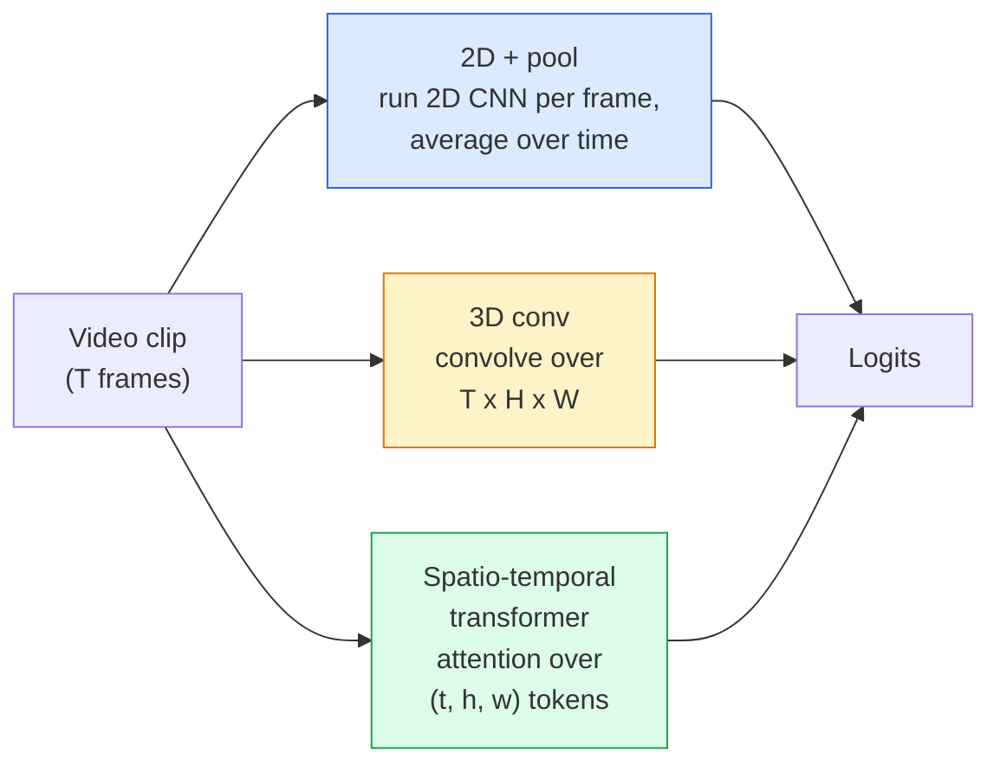

# Понимание видео — временное моделирование

> Видео — это последовательность изображений плюс физика, которая их связывает. Любая видеомодель либо рассматривает время как дополнительную ось (3D conv), либо как последовательность для механизма внимания (transformer), либо как признак, который нужно один раз извлечь и агрегировать (2D+pool).

**Тип:** Изучение + сборка
**Языки:** Python
**Предварительные требования:** Phase 4 Lesson 03 (CNNs), Phase 4 Lesson 04 (Image Classification)
**Время:** ~45 минут

## Цели обучения

- Различать три основных подхода к моделированию видео (2D+pool, 3D conv, spatio-temporal transformer) и предсказывать компромиссы между их стоимостью и точностью
- Реализовать выборку кадров, временной pooling и базовый классификатор 2D+pool в PyTorch
- Объяснить, почему "раздутые" 3D-ядра I3D хорошо переносятся из весов ImageNet и чем факторизованная (2+1)D-свертка отличается от них
- Читать стандартные наборы данных и метрики для распознавания действий: Kinetics-400/600, UCF101, Something-Something V2; точность top-1 на уровне клипа и видео

## Проблема

30-секундное видео при 30 fps — это 900 изображений. Наивно видеоклассификация — это классификация изображений, запущенная 900 раз, за которой следует некоторая агрегация. Это работает, когда действие видно почти в каждом кадре (спорт, готовка, видео с упражнениями), и плохо проваливается, когда действие определяется самим движением: "толкать что-то слева направо" выглядит как два неподвижных объекта в каждом отдельном кадре.

Главный вопрос для любой видеоархитектуры: когда моделируется временная структура и как именно? Ответ определяет все остальное — вычислительную стоимость, стратегию предобучения, возможность переиспользовать веса ImageNet, наборы данных, на которых обучается модель.

Этот урок намеренно короче уроков про статические изображения. Основные механизмы работы с изображениями уже есть, а понимание видео в основном сводится к временной части: выборке, моделированию и агрегации.

## Концепция

### Три семейства архитектур



### 2D + pool

Возьмите 2D CNN (ResNet, EfficientNet, ViT). Запустите ее независимо на каждом выбранном кадре. Усредните (или примените max-pool, или attention-pool) эмбеддинги отдельных кадров. Передайте агрегированный вектор в классификатор.

Плюсы:
- Предобучение на ImageNet переносится напрямую.
- Самый простой вариант для реализации.
- Дешево: T кадров * стоимость инференса одного изображения.

Минусы:
- Не может моделировать движение. Действие = агрегат внешнего вида.
- Временной pooling инвариантен к порядку; "open door" и "close door" выглядят одинаково.

Когда использовать: задачи, сильно зависящие от внешнего вида, transfer learning на небольших видеонаборах данных, начальные baseline-модели.

### 3D-свертки

Замените 2D-ядра (H, W) на 3D-ядра (T, H, W). Сеть выполняет свертку и по пространству, и по времени. Раннее семейство: C3D, I3D, SlowFast.

Трюк I3D: взять предобученную 2D-модель ImageNet и "раздуть" каждое 2D-ядро, скопировав его вдоль новой временной оси. 2D-свертка 3x3 становится 3D-сверткой 3x3x3. Это дает 3D-модели сильные предобученные веса вместо обучения с нуля.

Плюсы:
- Напрямую моделирует движение.
- Раздутие I3D дает transfer learning почти бесплатно.

Минусы:
- В T/8 раз больше FLOPs, чем у 2D-аналога (для временного ядра размера 3, уложенного 3 раза).
- Временные ядра малы; дальнее движение требует пирамиды или двухпоточного подхода.

Когда использовать: распознавание действий, где движение является сигналом (Something-Something V2, Kinetics с классами, сильно зависящими от движения).

### Пространственно-временные трансформеры

Токенизируйте видео в сетку пространственно-временных патчей и применяйте attention по всем ним. TimeSformer, ViViT, Video Swin, VideoMAE.

Важные схемы attention:
- **Joint** — один большой attention по (t, h, w). Квадратичен по `T*H*W`; дорогой.
- **Divided** — два attention на блок: один по времени, один по пространству. Масштабирование примерно линейное.
- **Factorised** — временной attention чередуется с пространственным attention между блоками.

Плюсы:
- SOTA-точность на каждом крупном бенчмарке.
- Переносится из трансформеров для изображений (ViT) через раздувание патчей.
- Поддерживает длинноконтекстное видео через разреженный attention.

Минусы:
- Требует много вычислений.
- Нужен аккуратный выбор схемы attention, иначе время выполнения резко растет.

Когда использовать: большие наборы данных, высокоточное понимание видео, мультимодальные задачи видео+текст.

### Выборка кадров

10-секундный клип при 30 fps — это 300 кадров; подавать все 300 в любую модель расточительно. Стандартные стратегии:

- **Uniform sampling** — выбрать T кадров равномерно по клипу. Вариант по умолчанию для 2D+pool.
- **Dense sampling** — случайное непрерывное окно из T кадров. Часто используется для 3D-сверток, потому что движение требует соседних кадров.
- **Multi-clip** — выбрать несколько окон из T кадров из одного видео, классифицировать каждое, усреднить предсказания во время тестирования.

T обычно равно 8, 16, 32 или 64. Большее T = больше временного сигнала при большей вычислительной стоимости.

### Оценка

Два уровня:
- **Clip-level accuracy** — модель видит один клип из T кадров и сообщает top-k.
- **Video-level accuracy** — усреднение предсказаний на уровне клипа по нескольким клипам одного видео; выше и стабильнее.

Всегда сообщайте оба значения. Модель с результатом 78% clip / 82% video сильно полагается на усреднение во время тестирования; модель с 80% / 81% более робастна на уровне отдельных клипов.

### Наборы данных, которые вы встретите

- **Kinetics-400 / 600 / 700** — универсальный набор данных действий. 400k клипов; URL YouTube (многие уже недоступны).
- **Something-Something V2** — действия, определяемые движением ("moving X from left to right"). Не решается с помощью 2D+pool.
- **UCF-101**, **HMDB-51** — более старые и меньшие, но все еще часто приводятся в отчетах.
- **AVA** — *локализация* действий в пространстве и времени; сложнее классификации.

## Соберите это

### Шаг 1: Сэмплер кадров

Uniform- и dense-сэмплеры, которые работают со списком кадров (или видеотензором).

```python
import numpy as np

def sample_uniform(num_frames_total, T):
    if num_frames_total <= T:
        return list(range(num_frames_total)) + [num_frames_total - 1] * (T - num_frames_total)
    step = num_frames_total / T
    return [int(i * step) for i in range(T)]


def sample_dense(num_frames_total, T, rng=None):
    rng = rng or np.random.default_rng()
    if num_frames_total <= T:
        return list(range(num_frames_total)) + [num_frames_total - 1] * (T - num_frames_total)
    start = int(rng.integers(0, num_frames_total - T + 1))
    return list(range(start, start + T))
```

Оба возвращают `T` индексов, которые вы используете для среза видеотензора.

### Шаг 2: Baseline 2D+pool

Запустите 2D ResNet-18 по каждому кадру, усредните признаки через average-pool и классифицируйте.

```python
import torch
import torch.nn as nn
from torchvision.models import resnet18, ResNet18_Weights

class FramePool(nn.Module):
    def __init__(self, num_classes=400, pretrained=True):
        super().__init__()
        weights = ResNet18_Weights.IMAGENET1K_V1 if pretrained else None
        backbone = resnet18(weights=weights)
        self.features = nn.Sequential(*(list(backbone.children())[:-1]))  # global avg pool kept
        self.head = nn.Linear(512, num_classes)

    def forward(self, x):
        # x: (N, T, 3, H, W)
        N, T = x.shape[:2]
        x = x.view(N * T, *x.shape[2:])
        feats = self.features(x).view(N, T, -1)
        pooled = feats.mean(dim=1)
        return self.head(pooled)

model = FramePool(num_classes=10)
x = torch.randn(2, 8, 3, 224, 224)
print(f"output: {model(x).shape}")
print(f"params: {sum(p.numel() for p in model.parameters()):,}")
```

Одиннадцать миллионов параметров, предобучение на ImageNet, запуск по кадрам, усреднение, классификация. Этот baseline часто находится в пределах 5-10 пунктов от полноценных 3D-моделей на задачах, сильно зависящих от внешнего вида, а иногда оказывается лучше, потому что переиспользует более сильный ImageNet backbone.

### Шаг 3: Раздутая 3D-свертка в стиле I3D

Превратите одну 2D-свертку в 3D-свертку, повторив веса вдоль новой временной оси.

```python
def inflate_2d_to_3d(conv2d, time_kernel=3):
    out_c, in_c, kh, kw = conv2d.weight.shape
    weight_3d = conv2d.weight.data.unsqueeze(2)  # (out, in, 1, kh, kw)
    weight_3d = weight_3d.repeat(1, 1, time_kernel, 1, 1) / time_kernel
    conv3d = nn.Conv3d(in_c, out_c, kernel_size=(time_kernel, kh, kw),
                        padding=(time_kernel // 2, conv2d.padding[0], conv2d.padding[1]),
                        stride=(1, conv2d.stride[0], conv2d.stride[1]),
                        bias=False)
    conv3d.weight.data = weight_3d
    return conv3d

conv2d = nn.Conv2d(3, 64, kernel_size=3, padding=1, bias=False)
conv3d = inflate_2d_to_3d(conv2d, time_kernel=3)
print(f"2D weight shape:  {tuple(conv2d.weight.shape)}")
print(f"3D weight shape:  {tuple(conv3d.weight.shape)}")
x = torch.randn(1, 3, 8, 56, 56)
print(f"3D output shape:  {tuple(conv3d(x).shape)}")
```

Деление на `time_kernel` сохраняет масштабы активаций примерно постоянными — это важно, чтобы не сломать статистики batch-norm на первом проходе.

### Шаг 4: Факторизованная (2+1)D-свертка

Разбейте 3D-свертку на 2D (пространственную) и 1D (временную) свертки. То же рецептивное поле, меньше параметров, лучшая точность на некоторых бенчмарках.

```python
class Conv2Plus1D(nn.Module):
    def __init__(self, in_c, out_c, kernel_size=3):
        super().__init__()
        mid_c = (in_c * out_c * kernel_size * kernel_size * kernel_size) \
                // (in_c * kernel_size * kernel_size + out_c * kernel_size)
        self.spatial = nn.Conv3d(in_c, mid_c, kernel_size=(1, kernel_size, kernel_size),
                                 padding=(0, kernel_size // 2, kernel_size // 2), bias=False)
        self.bn = nn.BatchNorm3d(mid_c)
        self.act = nn.ReLU(inplace=True)
        self.temporal = nn.Conv3d(mid_c, out_c, kernel_size=(kernel_size, 1, 1),
                                  padding=(kernel_size // 2, 0, 0), bias=False)

    def forward(self, x):
        return self.temporal(self.act(self.bn(self.spatial(x))))

c = Conv2Plus1D(3, 64)
x = torch.randn(1, 3, 8, 56, 56)
print(f"(2+1)D output: {tuple(c(x).shape)}")
```

Полная сеть R(2+1)D — это то же, что ResNet-18, где каждая 3x3-свертка заменена на `Conv2Plus1D`.

## Используйте это

Две библиотеки покрывают промышленную работу с видео:

- `torchvision.models.video` — R(2+1)D, MViT, Swin3D с предобученными весами Kinetics. Тот же API, что у моделей изображений.
- `pytorchvideo` (Meta) — model zoo, загрузчики данных для Kinetics / SSv2 / AVA, стандартные преобразования.

Для Vision-Language видеомоделей (video captioning, video QA) используйте `transformers` (`VideoMAE`, `VideoLLaMA`, `InternVideo`).

## Доведите до результата

Этот урок создает:

- `outputs/prompt-video-architecture-picker.md` — промпт, который выбирает 2D+pool / I3D / (2+1)D / transformer на основе соотношения appearance-vs-motion, размера набора данных и вычислительного бюджета.
- `outputs/skill-frame-sampler-auditor.md` — навык, который проверяет сэмплер в видеопайплайне и отмечает типичные ошибки: индекс off-by-one, неравномерная выборка при `num_frames < T`, отсутствие crop с сохранением пропорций и т. д.

## Упражнения

1. **(Легко)** Посчитайте FLOPs (приблизительно) для FramePool с T=8 и для 3D ResNet в стиле I3D с T=8. Обоснуйте, почему 2D+pool дешевле в 3-5 раз.
2. **(Средне)** Сгенерируйте синтетический видеонабор данных: случайные шары, движущиеся в случайных направлениях, с метками по направлению движения ("left-to-right", "right-to-left", "diagonal-up"). Обучите на нем FramePool. Покажите, что он достигает точности около случайного угадывания, доказывая, что одного внешнего вида недостаточно для задач движения.
3. **(Сложно)** Постройте R(2+1)D-18, заменив каждую Conv2d в ResNet-18 на `Conv2Plus1D`. Раздуйте веса первой свертки из ResNet-18, предобученной на ImageNet. Обучите на наборе данных движения из упражнения 2 и превзойдите FramePool.

## Ключевые термины

| Term | What people say | What it actually means |
|------|----------------|----------------------|
| 2D + pool | "Per-frame classifier" | Запустить 2D CNN на каждом выбранном кадре, усреднить признаки по времени через average-pool, классифицировать |
| 3D convolution | "Spatio-temporal kernel" | Ядро, которое выполняет свертку по (T, H, W); может естественно моделировать движение |
| Inflation | "Lift 2D weights to 3D" | Инициализировать веса 3D-свертки, повторяя веса 2D-свертки вдоль новой временной оси, затем разделить на kernel_T, чтобы сохранить масштаб активаций |
| (2+1)D | "Factorised conv" | Разбить 3D на 2D spatial + 1D temporal; меньше параметров, дополнительная нелинейность между ними |
| Divided attention | "Time then space" | Блок transformer с двумя attention на слой: один по токенам в одном и том же кадре, один по токенам в одной и той же позиции |
| Clip | "T-frame window" | Выбранная подпоследовательность из T кадров; единица, которую потребляет видеомодель |
| Clip vs video accuracy | "Two eval settings" | Clip = один сэмпл на видео, video = среднее по нескольким выбранным клипам |
| Kinetics | "The ImageNet of video" | 400-700 классов действий, 300k+ клипов YouTube, стандартный корпус для видеопредобучения |

## Дополнительное чтение

- [I3D: Quo Vadis, Action Recognition (Carreira & Zisserman, 2017)](https://arxiv.org/abs/1705.07750) — вводит inflation и набор данных Kinetics
- [R(2+1)D: A Closer Look at Spatiotemporal Convolutions (Tran et al., 2018)](https://arxiv.org/abs/1711.11248) — factorised conv, все еще сильный baseline
- [TimeSformer: Is Space-Time Attention All You Need? (Bertasius et al., 2021)](https://arxiv.org/abs/2102.05095) — первый сильный video transformer
- [VideoMAE (Tong et al., 2022)](https://arxiv.org/abs/2203.12602) — предобучение masked autoencoder для видео; текущий доминирующий рецепт предобучения
