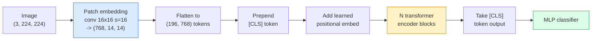

# Vision Transformers (ViT)

> Разрежьте изображение на патчи, рассматривайте каждый патч как слово, запустите стандартный трансформер. Не оглядывайтесь назад.

**Тип:** Build
**Языки:** Python
**Предварительные требования:** Фаза 7 Урок 02 (Self-Attention), Фаза 4 Урок 04 (Image Classification)
**Время:** ~45 минут

## Цели обучения

- Реализовать patch embedding, обучаемое positional embedding, class token и блоки transformer encoder с нуля, чтобы собрать минимальный ViT
- Объяснить, почему считалось, что ViT требует огромных данных для предварительного обучения, пока DeiT и MAE не доказали обратное
- Сравнить ViT, Swin и ConvNeXt по их архитектурным априорным предположениям (их отсутствие, внимание в локальных окнах, сверточный backbone)
- Дообучить предварительно обученный ViT на небольшом наборе данных с помощью `timm` и стандартного рецепта linear-probe / fine-tune

## Проблема

На протяжении десятилетия свертка была синонимом компьютерного зрения. У CNN были сильные индуктивные смещения — локальность, трансляционная эквивариантность, — и никто не думал, что их можно заменить. Затем Dosovitskiy et al. (2020) показали, что обычный трансформер, примененный к развернутым патчам изображения, вообще без сверточного механизма, может сравняться с лучшими CNN в масштабе или превзойти их.

Оговорка была в словах "в масштабе". ViT на ImageNet-1k проигрывал ResNet. ViT, предварительно обученный на ImageNet-21k или JFT-300M, а затем дообученный на ImageNet-1k, превосходил его. Вывод был таким: трансформерам не хватает полезных априорных предположений, но они могут выучить их при достаточном объеме данных. Последующие работы (DeiT, MAE, DINO) показали, что с правильными рецептами обучения — сильной аугментацией, самоконтролируемым предварительным обучением, дистилляцией — ViT хорошо обучаются и на малых данных.

К 2026 году чистые CNN все еще конкурентоспособны на edge-устройствах (ConvNeXt — сильнейший вариант), но трансформеры доминируют во всем остальном: сегментации (Mask2Former, SegFormer), детекции (DETR, RT-DETR), мультимодальности (CLIP, SigLIP), видео (VideoMAE, VJEPA). Структуру блока ViT нужно знать.

## Концепция

### Конвейер



Семь шагов. Патчи -> токены -> attention -> классификатор. Каждый вариант (DeiT, Swin, ConvNeXt, предварительное обучение MAE) меняет один-два из семи шагов, а остальное оставляет без изменений.

### Patch embedding

Первая свертка — это секрет. Размер ядра 16, stride 16, поэтому изображение 224x224 превращается в сетку 14x14 патчей 16x16, каждый из которых проецируется в embedding размерности 768. Эта единственная свертка одновременно разбивает изображение на патчи и выполняет линейную проекцию.

```
Input:  (3, 224, 224)
Conv (3 -> 768, k=16, s=16, no padding):
Output: (768, 14, 14)
Flatten spatial: (196, 768)
```

196 патчей = 196 токенов. Размерность признаков каждого токена равна 768 (ViT-B), 1024 (ViT-L) или 1280 (ViT-H).

### Class token

Один обучаемый вектор, добавляемый в начало последовательности:

```
tokens = [CLS; patch_1; patch_2; ...; patch_196]   shape (197, 768)
```

После N блоков трансформера выход `[CLS]` является глобальным представлением изображения. Classification head считывает только этот один вектор.

### Positional embedding

У трансформеров нет встроенного понятия пространственного положения. Добавьте обучаемый вектор к каждому токену:

```
tokens = tokens + learned_pos_embedding   (also shape (197, 768))
```

Embedding является параметром модели; обучение на основе градиентов адаптирует его к двумерной структуре изображения. Существуют синусоидальные 2D-альтернативы, но на практике они используются редко.

### Блок transformer encoder

Стандартный. Multi-head self-attention, MLP, residual connections, pre-LayerNorm.

```
x = x + MSA(LN(x))
x = x + MLP(LN(x))

MLP is two-layer with GELU: Linear(d -> 4d) -> GELU -> Linear(4d -> d)
```

ViT-B/16 складывает 12 таких блоков, каждый с 12 головами attention, всего 86M параметров.

### Почему pre-LN

Ранние трансформеры использовали post-LN (`x = LN(x + sublayer(x))`) и с трудом обучались глубже 6-8 слоев без warmup. Pre-LN (`x = x + sublayer(LN(x))`) стабильно обучает более глубокие сети без warmup. Каждый ViT и каждая современная LLM используют pre-LN.

### Компромисс размера патча

- Патчи 16x16 -> 196 токенов, стандартный вариант.
- Патчи 32x32 -> 49 токенов, быстрее, но ниже разрешение.
- Патчи 8x8 -> 784 токена, детальнее, но стоимость attention O(n^2) плохо масштабируется.

Более крупные патчи = меньше токенов = быстрее, но меньше пространственных деталей. SwinV2 использует патчи 4x4 в иерархических окнах.

### Рецепт DeiT для обучения ViT на ImageNet-1k

Исходному ViT требовался JFT-300M, чтобы превзойти CNN. DeiT (Touvron et al., 2020) обучил ViT-B до 81.8% top-1 на одном только ImageNet-1k с четырьмя изменениями:

1. Сильная аугментация: RandAugment, Mixup, CutMix, Random Erasing.
2. Stochastic depth (случайное отбрасывание целых блоков во время обучения).
3. Repeated augmentation (одно и то же изображение сэмплируется 3 раза на batch).
4. Дистилляция от CNN-учителя (необязательно, дополнительно повышает точность).

Каждый современный рецепт обучения ViT происходит от DeiT.

### Swin vs ConvNeXt

- **Swin** (Liu et al., 2021) — attention на основе окон. Каждый блок выполняет attention внутри локального окна; чередующиеся блоки сдвигают окно, чтобы смешивать информацию между окнами. Это возвращает CNN-подобное априорное предположение о локальности, сохраняя оператор attention.
- **ConvNeXt** (Liu et al., 2022) — переработанная CNN, которая соответствует архитектурным решениям Swin (depthwise-свертки, LayerNorm, GELU, inverted bottleneck). Показала, что разрыв заключается не в "attention vs convolution", а в "современном рецепте обучения + архитектуре".

В 2026 году ConvNeXt-V2 и Swin-V2 оба пригодны для продакшена; правильный выбор зависит от вашего inference stack (ConvNeXt лучше компилируется для edge) и корпуса предварительного обучения.

### Предварительное обучение MAE

Masked Autoencoder (He et al., 2022): замаскировать 75% патчей случайным образом, обучить encoder обрабатывать только видимые 25%, обучить небольшой decoder восстанавливать замаскированные патчи из выхода encoder. После предварительного обучения decoder отбрасывают и дообучают encoder.

MAE делает ViT обучаемым на одном только ImageNet-1k, достигает SOTA и является текущим стандартным самоконтролируемым рецептом.

## Build It

### Шаг 1: Patch embedding

```python
import torch
import torch.nn as nn

class PatchEmbedding(nn.Module):
    def __init__(self, in_channels=3, patch_size=16, dim=192, image_size=64):
        super().__init__()
        assert image_size % patch_size == 0
        self.proj = nn.Conv2d(in_channels, dim, kernel_size=patch_size, stride=patch_size)
        num_patches = (image_size // patch_size) ** 2
        self.num_patches = num_patches

    def forward(self, x):
        x = self.proj(x)
        return x.flatten(2).transpose(1, 2)
```

Одна свертка, один flatten, один transpose. Это весь шаг преобразования изображения в токены.

### Шаг 2: Transformer block

Pre-LN, multi-head self-attention, MLP с GELU, residual connections.

```python
class Block(nn.Module):
    def __init__(self, dim, num_heads, mlp_ratio=4, dropout=0.0):
        super().__init__()
        self.ln1 = nn.LayerNorm(dim)
        self.attn = nn.MultiheadAttention(dim, num_heads, dropout=dropout, batch_first=True)
        self.ln2 = nn.LayerNorm(dim)
        self.mlp = nn.Sequential(
            nn.Linear(dim, dim * mlp_ratio),
            nn.GELU(),
            nn.Dropout(dropout),
            nn.Linear(dim * mlp_ratio, dim),
            nn.Dropout(dropout),
        )

    def forward(self, x):
        a, _ = self.attn(self.ln1(x), self.ln1(x), self.ln1(x), need_weights=False)
        x = x + a
        x = x + self.mlp(self.ln2(x))
        return x
```

`nn.MultiheadAttention` обрабатывает разделение на головы, scaled dot-product и output projection. `batch_first=True`, поэтому формы имеют вид `(N, seq, dim)`.

### Шаг 3: The ViT

```python
class ViT(nn.Module):
    def __init__(self, image_size=64, patch_size=16, in_channels=3,
                 num_classes=10, dim=192, depth=6, num_heads=3, mlp_ratio=4):
        super().__init__()
        self.patch = PatchEmbedding(in_channels, patch_size, dim, image_size)
        num_patches = self.patch.num_patches
        self.cls_token = nn.Parameter(torch.zeros(1, 1, dim))
        self.pos_embed = nn.Parameter(torch.zeros(1, num_patches + 1, dim))
        self.blocks = nn.ModuleList([
            Block(dim, num_heads, mlp_ratio) for _ in range(depth)
        ])
        self.ln = nn.LayerNorm(dim)
        self.head = nn.Linear(dim, num_classes)
        nn.init.trunc_normal_(self.pos_embed, std=0.02)
        nn.init.trunc_normal_(self.cls_token, std=0.02)

    def forward(self, x):
        x = self.patch(x)
        cls = self.cls_token.expand(x.size(0), -1, -1)
        x = torch.cat([cls, x], dim=1)
        x = x + self.pos_embed
        for blk in self.blocks:
            x = blk(x)
        x = self.ln(x[:, 0])
        return self.head(x)

vit = ViT(image_size=64, patch_size=16, num_classes=10, dim=192, depth=6, num_heads=3)
x = torch.randn(2, 3, 64, 64)
print(f"output: {vit(x).shape}")
print(f"params: {sum(p.numel() for p in vit.parameters()):,}")
```

Около 2.8M параметров — крошечный ViT, пригодный для CPU. Настоящий ViT-B имеет 86M; та же структура класса с `dim=768, depth=12, num_heads=12`.

### Шаг 4: Sanity check — инференс одного изображения

```python
logits = vit(torch.randn(1, 3, 64, 64))
print(f"logits: {logits}")
print(f"probs:  {logits.softmax(-1)}")
```

Должно выполниться без ошибки. Вероятности суммируются к 1.

## Use It

`timm` поставляет каждый вариант ViT с предварительно обученными весами ImageNet. Одна строка:

```python
import timm

model = timm.create_model("vit_base_patch16_224", pretrained=True, num_classes=10)
```

`timm` — продакшен-стандарт для vision transformers в 2026 году. Поддерживает ViT, DeiT, Swin, Swin-V2, ConvNeXt, ConvNeXt-V2, MaxViT, MViT, EfficientFormer и десятки других моделей под одним API.

Для мультимодальной работы (изображение + текст) `transformers` поставляет CLIP, SigLIP, BLIP-2, LLaVA. Image encoder во всех них является вариантом ViT.

## Ship It

Этот урок создает:

- `outputs/prompt-vit-vs-cnn-picker.md` — prompt, который выбирает между ViT, ConvNeXt или Swin на основе размера набора данных, вычислительных ресурсов и inference stack.
- `outputs/skill-vit-patch-and-pos-embed-inspector.md` — skill, который проверяет, что формы patch embedding и positional embedding ViT соответствуют ожидаемой длине последовательности модели, ловя самые распространенные ошибки портирования.

## Упражнения

1. **(Easy)** Выведите формы каждого промежуточного тензора для forward pass через крошечный ViT выше. Подтвердите: input `(N, 3, 64, 64)` -> patches `(N, 16, 192)` -> with CLS `(N, 17, 192)` -> classifier input `(N, 192)` -> output `(N, num_classes)`.
2. **(Medium)** Дообучите предварительно обученный `timm` ViT-S/16 на наборе данных synthetic-CIFAR из Урока 4. Сравните с дообучением ResNet-18 на тех же данных. Сообщите время обучения и итоговую точность.
3. **(Hard)** Реализуйте предварительное обучение MAE для крошечного ViT: замаскируйте 75% патчей, обучите encoder + небольшой decoder восстанавливать замаскированные патчи. Оцените linear-probe accuracy на синтетических данных до и после предварительного обучения.

## Ключевые термины

| Термин | Как говорят | Что это на самом деле означает |
|------|----------------|----------------------|
| Patch embedding | "Первая свертка" | Свертка с kernel size = stride = patch size; превращает изображение в сетку token embeddings |
| Class token | "[CLS]" | Обучаемый вектор, добавляемый в начало последовательности токенов; его финальный выход является глобальным представлением изображения |
| Positional embedding | "Learned pos" | Обучаемый вектор, добавляемый к каждому токену, чтобы трансформер знал, откуда пришел каждый патч |
| Pre-LN | "LayerNorm before sublayer" | Стабильный вариант трансформера: `x + sublayer(LN(x))` вместо `LN(x + sublayer(x))` |
| Multi-head attention | "Parallel attention" | Стандартное attention трансформера, разделенное на num_heads независимых подпространств, которые затем конкатенируются |
| ViT-B/16 | "Base, patch 16" | Канонический размер: dim=768, depth=12, heads=12, patch_size=16, image=224; ~86M params |
| DeiT | "Data-efficient ViT" | ViT, обученный только на ImageNet-1k с сильной аугментацией; доказал, что большие наборы данных для предварительного обучения не являются строго обязательными |
| MAE | "Masked autoencoder" | Самоконтролируемое предварительное обучение: замаскировать 75% патчей, восстановить; доминирующий рецепт предварительного обучения ViT |

## Дополнительное чтение

- [An Image is Worth 16x16 Words (Dosovitskiy et al., 2020)](https://arxiv.org/abs/2010.11929) — статья ViT
- [DeiT: Data-efficient Image Transformers (Touvron et al., 2020)](https://arxiv.org/abs/2012.12877) — как обучить ViT только на ImageNet-1k
- [Masked Autoencoders are Scalable Vision Learners (He et al., 2022)](https://arxiv.org/abs/2111.06377) — предварительное обучение MAE
- [timm documentation](https://huggingface.co/docs/timm) — справочник по каждому vision transformer, который вы будете использовать в продакшене
