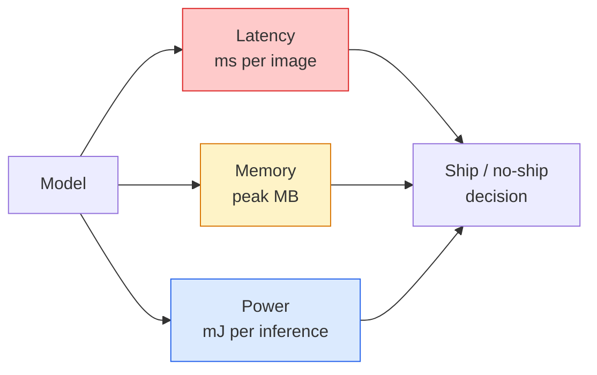

# Real-Time Vision — Edge Deployment

> Edge inference (инференс на периферийных устройствах) — это дисциплина, в которой модель с точностью 90 должна работать со скоростью 30 fps на устройстве с 2 GB RAM. Каждый процентный пункт точности обменивается на миллисекунды задержки.

**Тип:** Изучение + сборка
**Языки:** Python
**Предварительные требования:** Phase 4 Lesson 04 (Image Classification), Phase 10 Lesson 11 (Quantization)
**Время:** ~75 минут

## Цели обучения

- Измерять задержку инференса, пиковое потребление памяти и пропускную способность для любой PyTorch-модели, а также читать компромисс FLOPs / params / latency
- Квантовать модель компьютерного зрения в INT8 с помощью post-training quantisation в PyTorch и проверять, что потеря точности < 1%
- Экспортировать в ONNX и компилировать с ONNX Runtime или TensorRT; называть три самых частых сбоя экспорта и их исправления
- Объяснять, когда выбирать MobileNetV3, EfficientNet-Lite, ConvNeXt-Tiny или MobileViT под edge-ограничение

## Проблема

Модель компьютерного зрения на этапе обучения — это монстр с плавающей точкой. 100M параметров, 10 GFLOPs на один forward pass, 2 GB VRAM. Ничто из этого не помещается на телефон, инфотейнмент-блок автомобиля, промышленную камеру или дрон. Доставка системы зрения в продукт означает размещение тех же предсказаний в бюджете, который в 100x меньше.

Большую часть работы выполняют три регулятора: выбор модели (меньшая архитектура с тем же рецептом), квантизация (INT8 вместо FP32) и runtime инференса (ONNX Runtime, TensorRT, Core ML, TFLite). Правильно настроить их — это разница между демо, которое запускается на рабочей станции, и продуктом, который поставляется на модуле камеры за $30.

Этот урок сначала задает дисциплину измерений (нельзя оптимизировать то, что нельзя измерить), а затем проходит по трем регуляторам. Цель не в том, чтобы изучить каждый edge runtime, а в том, чтобы знать, какие рычаги существуют и как проверить, что каждый из них делает именно то, что вы ожидаете.

## Концепция

### Три бюджета



- **Задержка (latency)**: p50, p95, p99. Усреднение только p50 скрывает поведение хвоста распределения, важное для real-time систем.
- **Пиковая память (peak memory)**: максимум, который устройство когда-либо видит, а не среднее в устойчивом состоянии. Это важно, потому что OOM фатальны на embedded-целях.
- **Мощность / энергия (power / energy)**: миллиджоули на один инференс на устройстве с питанием от батареи. Часто аппроксимируется как CPU/GPU utilisation * time.

Таблица (model, latency, memory, accuracy) — это основа edge-решения. Каждая ячейка измеряется на целевом устройстве, а не на рабочей станции.

### Дисциплина измерений

Три правила, которым должен следовать каждый edge-профиль:

1. **Разогрейте** модель 5-10 фиктивными forward pass перед измерением. Холодные кеши и JIT-компиляция дают нерепрезентативные первые числа.
2. **Синхронизируйте** GPU-нагрузки с `torch.cuda.synchronize()` до и после измеряемого блока. Без этого вы измеряете отправку kernel, а не выполнение kernel.
3. **Зафиксируйте размеры входа** на production-разрешении. Задержка на 224x224 — это не задержка на 512x512.

### FLOPs как прокси

FLOPs (floating-point operations per inference) — дешевый, не зависящий от устройства прокси для задержки. Полезен для сравнения архитектур, но вводит в заблуждение как абсолютное wall-clock время. Модель с FLOPs на 10% больше может на практике быть в 2x быстрее, потому что использует операции, удобные для железа (depthwise convs хорошо компилируются, большие 7x7 convs — нет).

Правило: используйте FLOPs для поиска архитектуры, используйте задержку на устройстве для решений о deployment.

### Квантизация в одном абзаце

Замените FP32-веса и активации на INT8. Размер модели падает в 4x, пропускная способность памяти падает в 4x, вычисления ускоряются в 2-4x на железе с INT8 kernels (каждый современный mobile SoC, каждая NVIDIA GPU с Tensor Cores). Потеря точности в задачах компьютерного зрения обычно составляет 0.1-1 процентный пункт при post-training static quantisation.

Типы:

- **Dynamic** — квантизовать веса в INT8, активации вычисляются в FP. Просто, небольшое ускорение.
- **Static (post-training)** — квантизовать веса + откалибровать диапазоны активаций на небольшом calibration set. Намного быстрее, чем dynamic.
- **Quantisation-aware training (QAT)** — симулировать квантизацию во время обучения, чтобы модель научилась обходить ее эффекты. Лучшая точность, нужны размеченные данные.

Для computer vision post-training static quantisation дает 95% пользы за 5% усилий. Используйте QAT только тогда, когда потеря точности от PTQ неприемлема.

### Pruning и distillation

- **Pruning (прореживание)** — удалить неважные веса (по величине) или каналы (structured). Хорошо работает на переизбыточно параметризованных моделях; менее полезно на уже компактных архитектурах.
- **Distillation (дистилляция)** — обучить маленького student имитировать logits большого teacher. Часто восстанавливает большую часть точности, потерянной при уменьшении модели. Стандарт для production edge-моделей.

### Runtime инференса

- **PyTorch eager** — медленный, не для deployment. Используйте только для разработки.
- **TorchScript** — legacy. Вытеснен `torch.compile` и ONNX export.
- **ONNX Runtime** — нейтральный runtime. CPU, CUDA, CoreML, TensorRT, OpenVINO имеют ONNX providers. Начинайте здесь.
- **TensorRT** — компилятор NVIDIA. Лучшая задержка на NVIDIA GPUs (рабочая станция и Jetson). Интегрируется с ONNX Runtime или работает standalone.
- **Core ML** — runtime Apple для iOS/macOS. Нужен `.mlmodel` или `.mlpackage`.
- **TFLite** — runtime Google для Android/ARM. Нужен `.tflite`.
- **OpenVINO** — runtime Intel для CPU/VPU. Нужны `.xml` + `.bin`.

На практике: экспортируйте PyTorch -> ONNX -> выберите runtime под цель. ONNX — lingua franca.

### Подбор edge-архитектуры

| Бюджет | Модель | Почему |
|--------|-------|-----|
| < 3M params | MobileNetV3-Small | Компилируется везде, хороший baseline |
| 3-10M | EfficientNet-Lite-B0 | Лучшая точность на параметр в TFLite |
| 10-20M | ConvNeXt-Tiny | Лучшая accuracy-per-param, удобна для CPU |
| 20-30M | MobileViT-S or EfficientViT | Transformer с ImageNet-точностью |
| 30-80M | Swin-V2-Tiny | Если stack поддерживает window attention |

Квантуйте все это в INT8, если у вас нет конкретной причины этого не делать.

## Соберите это

### Шаг 1: Правильно измерьте задержку

```python
import time
import torch

def measure_latency(model, input_shape, device="cpu", warmup=10, iters=50):
    model = model.to(device).eval()
    x = torch.randn(input_shape, device=device)
    with torch.no_grad():
        for _ in range(warmup):
            model(x)
        if device == "cuda":
            torch.cuda.synchronize()
        times = []
        for _ in range(iters):
            if device == "cuda":
                torch.cuda.synchronize()
            t0 = time.perf_counter()
            model(x)
            if device == "cuda":
                torch.cuda.synchronize()
            times.append((time.perf_counter() - t0) * 1000)
    times.sort()
    return {
        "p50_ms": times[len(times) // 2],
        "p95_ms": times[int(len(times) * 0.95)],
        "p99_ms": times[int(len(times) * 0.99)],
        "mean_ms": sum(times) / len(times),
    }
```

Разогрейте, синхронизируйте, используйте `time.perf_counter()`. Сообщайте процентили, а не только среднее.

### Шаг 2: Количество параметров и FLOP

```python
def parameter_count(model):
    return sum(p.numel() for p in model.parameters())

def flops_estimate(model, input_shape):
    """
    Rough FLOP count for a conv/linear-only model. For production use `fvcore` or `ptflops`.
    """
    total = 0
    def conv_hook(m, inp, out):
        nonlocal total
        c_out, c_in, kh, kw = m.weight.shape
        h, w = out.shape[-2:]
        total += 2 * c_in * c_out * kh * kw * h * w
    def linear_hook(m, inp, out):
        nonlocal total
        total += 2 * m.in_features * m.out_features
    hooks = []
    for m in model.modules():
        if isinstance(m, torch.nn.Conv2d):
            hooks.append(m.register_forward_hook(conv_hook))
        elif isinstance(m, torch.nn.Linear):
            hooks.append(m.register_forward_hook(linear_hook))
    model.eval()
    with torch.no_grad():
        model(torch.randn(input_shape))
    for h in hooks:
        h.remove()
    return total
```

Для реальных проектов используйте `fvcore.nn.FlopCountAnalysis` или `ptflops`; они корректно обрабатывают каждый тип модуля.

### Шаг 3: Post-training static quantisation

```python
def quantise_ptq(model, calibration_loader, backend="x86"):
    import torch.ao.quantization as tq
    model = model.eval().cpu()
    model.qconfig = tq.get_default_qconfig(backend)
    tq.prepare(model, inplace=True)
    with torch.no_grad():
        for x, _ in calibration_loader:
            model(x)
    tq.convert(model, inplace=True)
    return model
```

Три шага: configure, prepare (вставить observers), calibrate с реальными данными, convert (fuse + quantise). Требует, чтобы модель была fused (`Conv -> BN -> ReLU` -> `ConvBnReLU`), с чем справляется `torch.ao.quantization.fuse_modules`.

### Шаг 4: Экспорт в ONNX

```python
def export_onnx(model, sample_input, path="model.onnx"):
    model = model.eval()
    torch.onnx.export(
        model,
        sample_input,
        path,
        input_names=["input"],
        output_names=["output"],
        dynamic_axes={"input": {0: "batch"}, "output": {0: "batch"}},
        opset_version=17,
    )
    return path
```

`opset_version=17` — безопасное значение по умолчанию в 2026. `dynamic_axes` позволяет запускать ONNX-модель с произвольным размером batch.

### Шаг 5: Проверьте производительность и сравните режимы

```python
import torch.nn as nn
from torchvision.models import mobilenet_v3_small

def compare_regimes():
    model = mobilenet_v3_small(weights=None, num_classes=10)
    params = parameter_count(model)
    flops = flops_estimate(model, (1, 3, 224, 224))
    lat_fp32 = measure_latency(model, (1, 3, 224, 224), device="cpu")
    print(f"FP32 MobileNetV3-Small: {params:,} params  {flops/1e9:.2f} GFLOPs  "
          f"p50={lat_fp32['p50_ms']:.2f}ms  p95={lat_fp32['p95_ms']:.2f}ms")
```

Запустите ту же функцию для `resnet50`, `efficientnet_v2_s` и `convnext_tiny`, и у вас будет сравнительная таблица, необходимая для решения о deployment.

## Используйте это

Production-стеки сходятся к одному из трех путей:

- **Web / serverless**: PyTorch -> ONNX -> ONNX Runtime (CPU or CUDA provider). Самый простой путь, достаточно хорош для большинства случаев.
- **NVIDIA edge (Jetson, GPU server)**: PyTorch -> ONNX -> TensorRT. Лучшая задержка, самые большие инженерные затраты.
- **Mobile**: PyTorch -> ONNX -> Core ML (iOS) or TFLite (Android). Квантуйте перед экспортом.

Для измерений `torch-tb-profiler`, `nvprof` / `nsys` и Instruments на macOS дают послойные разборы. `benchmark_app` (OpenVINO) и `trtexec` (TensorRT) дают standalone CLI-числа.

## Ship It

Этот урок создает:

- `outputs/prompt-edge-deployment-planner.md` — prompt, который выбирает backbone, стратегию квантизации и runtime по целевому устройству и latency SLA.
- `outputs/skill-latency-profiler.md` — skill, который пишет полный скрипт latency-benchmarking с warmup, synchronisation, percentiles и memory tracking.

## Упражнения

1. **(Easy)** Измерьте p50 latency для `resnet18`, `mobilenet_v3_small`, `efficientnet_v2_s` и `convnext_tiny` при 224x224 на CPU. Сообщите таблицу и определите, у какой архитектуры лучшая accuracy-per-ms.
2. **(Medium)** Примените post-training static quantisation к `mobilenet_v3_small`. Сообщите FP32 vs INT8 latency и потерю точности на held-out subset CIFAR-10 или похожего набора.
3. **(Hard)** Экспортируйте `convnext_tiny` в ONNX, запустите его через `onnxruntime` с `CPUExecutionProvider` и сравните задержку с baseline PyTorch eager. Определите первый слой, где ONNX Runtime быстрее, и объясните почему.

## Ключевые термины

| Термин | Как говорят | Что это на самом деле означает |
|------|----------------|----------------------|
| Latency | "Насколько быстро" | Время от входа до выхода; p50/p95/p99 процентили, не среднее |
| FLOPs | "Размер модели" | Операции с плавающей точкой на один forward pass; грубый proxy вычислительной стоимости |
| INT8 quantisation | "8-bit" | Заменить FP32-веса/активации 8-битными целыми; ~4x меньше, 2-4x быстрее |
| PTQ | "Post-training quantisation" | Квантизовать обученную модель без переобучения; просто, обычно достаточно |
| QAT | "Quantisation-aware training" | Симулировать квантизацию во время обучения; лучшая точность, требуются размеченные данные |
| ONNX | "Нейтральный формат" | Формат обмена моделями, поддерживаемый каждым массовым runtime инференса |
| TensorRT | "NVIDIA compiler" | Компилирует ONNX в оптимизированный engine для NVIDIA GPUs |
| Distillation | "Teacher -> student" | Обучить маленькую модель имитировать logits большой модели; восстанавливает большую часть потерянной точности |

## Дополнительное чтение

- [EfficientNet (Tan & Le, 2019)](https://arxiv.org/abs/1905.11946) — compound scaling для эффективных архитектур
- [MobileNetV3 (Howard et al., 2019)](https://arxiv.org/abs/1905.02244) — mobile-first архитектура с h-swish и squeeze-excite
- [A Practical Guide to TensorRT Optimization (NVIDIA)](https://developer.nvidia.com/blog/accelerating-model-inference-with-tensorrt-tips-and-best-practices-for-pytorch-users/) — как на практике получить throughput-числа из статьи
- [ONNX Runtime docs](https://onnxruntime.ai/docs/) — квантизация, оптимизация графа, выбор provider
