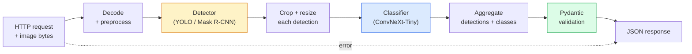

# Постройте полный пайплайн компьютерного зрения — капстоун

> Производственная система компьютерного зрения — это цепочка моделей и правил, соединенных контрактами данных. Все части уже есть в этой фазе; капстоун связывает их вместе end-to-end.

**Тип:** Сборка
**Языки:** Python
**Предварительные требования:** Фаза 4, уроки 01-15
**Время:** ~120 минут

## Цели обучения

- Спроектировать производственный пайплайн компьютерного зрения, который обнаруживает объекты, классифицирует их и выдает структурированный JSON — с обработкой каждого пути отказа
- Подключить детектор (Mask R-CNN или YOLO), классификатор (ConvNeXt-Tiny) и контракт данных (Pydantic) в один сервис
- Измерить производительность end-to-end пайплайна и определить первое узкое место (обычно предобработка, затем детектор)
- Выпустить минимальный сервис FastAPI, который принимает загрузку изображения, запускает пайплайн и возвращает обнаружения с классификациями

## Проблема

Отдельные модели компьютерного зрения полезны; продукты компьютерного зрения являются цепочками таких моделей. Аудит полки в ритейле — это детектор плюс классификатор продуктов плюс пайплайн price-OCR. Автономное вождение — это 2D-детектор плюс 3D-детектор плюс сегментатор плюс трекер плюс планировщик. Медицинский предварительный скрининг — это сегментатор плюс классификатор областей плюс интерфейс врача.

Связывание этих цепочек — та часть, которая отделяет ML-прототип от продукта. Каждый интерфейс между моделями — новое место для ошибок. Каждое преобразование координат, каждая нормализация, каждое изменение размера маски — кандидат на тихий отказ. Пайплайн настолько силен, насколько силен его самый слабый интерфейс.

Этот капстоун настраивает минимально жизнеспособный пайплайн: обнаружение + классификация + структурированный вывод + слой обслуживания. Все остальное из Фазы 4 встраивается в этот каркас: замените Mask R-CNN на YOLOv8, добавьте OCR-голову, добавьте ветку сегментации, добавьте трекер. Архитектура стабильна; компоненты подключаемые.

## Концепция

### Пайплайн



Семь этапов. Два модельных этапа дорогие; пять остальных этапов — там, где живут ошибки.

### Контракты данных с Pydantic

Каждая граница модели становится типизированным объектом. Это превращает тихие отказы в громкие.

```
Detection(
    box: tuple[float, float, float, float],   # (x1, y1, x2, y2), absolute pixels
    score: float,                              # [0, 1]
    class_id: int,                             # from detector's label map
    mask: Optional[list[list[int]]],           # RLE-encoded if present
)

PipelineResult(
    image_id: str,
    detections: list[Detection],
    classifications: list[Classification],
    inference_ms: float,
)
```

Когда детектор возвращает рамки в `(cx, cy, w, h)` вместо `(x1, y1, x2, y2)`, валидация Pydantic падает на границе, и вы узнаете об этом сразу, вместо того чтобы отлаживать последующее кадрирование, которое молча возвращает пустые области.

### Куда уходит задержка

Три истины выполняются почти в каждом пайплайне компьютерного зрения:

1. **Предобработка часто является самым большим отдельным блоком.** Декодирование JPEG, преобразование цветовых пространств, изменение размера — все это CPU-bound и об этом легко забыть.
2. **Детектор доминирует по времени GPU.** 70-90% времени GPU приходится на прямой проход детектора.
3. **Постобработка (NMS, RLE encode/decode) дешева на GPU, дорога на CPU.** Всегда профилируйте на фактической целевой среде.

Понимание распределения — это то, что превращает оптимизацию в приоритизированный список.

### Режимы отказа

- **Пустые обнаружения** — вернуть пустой список, не падать. Логировать.
- **Рамки за пределами изображения** — ограничить размером изображения перед кадрированием.
- **Крошечные кропы** — пропускать классификацию для рамок меньше минимального входа классификатора.
- **Поврежденная загрузка** — ответ 400 с конкретным кодом ошибки, не 500.
- **Сбой загрузки модели** — падать при старте сервиса, не на первом запросе.

Производственный пайплайн обрабатывает каждый из этих случаев без написания общего `try/except`, который скрывает отказ. Каждый отказ получает именованный код и ответ.

### Батчинг

Производственный сервис обслуживает нескольких клиентов. Батчинг обнаружений и классификаций между запросами многократно увеличивает пропускную способность. Компромисс: дополнительная задержка из-за ожидания заполнения батча. Типичная настройка: собирать запросы до 20ms, объединять в батч, обрабатывать, распределять ответы. `torchserve` и `triton` делают это нативно; небольшие сервисы с предсказуемой нагрузкой пишут собственный микро-батчер.

## Соберите это

### Шаг 1: Контракты данных

```python
from pydantic import BaseModel, Field
from typing import List, Optional, Tuple

class Detection(BaseModel):
    box: Tuple[float, float, float, float]
    score: float = Field(ge=0, le=1)
    class_id: int = Field(ge=0)
    mask_rle: Optional[str] = None


class Classification(BaseModel):
    detection_index: int
    class_id: int
    class_name: str
    score: float = Field(ge=0, le=1)


class PipelineResult(BaseModel):
    image_id: str
    detections: List[Detection]
    classifications: List[Classification]
    inference_ms: float
```

Пять секунд кода экономят час отладки на любом серьезном пайплайне.

### Шаг 2: Минимальный класс Pipeline

```python
import time
import numpy as np
import torch
from PIL import Image

class VisionPipeline:
    def __init__(self, detector, classifier, class_names,
                 device="cpu", min_crop=32):
        self.detector = detector.to(device).eval()
        self.classifier = classifier.to(device).eval()
        self.class_names = class_names
        self.device = device
        self.min_crop = min_crop

    def preprocess(self, image):
        """
        image: PIL.Image or np.ndarray (H, W, 3) uint8
        returns: CHW float tensor on device
        """
        if isinstance(image, Image.Image):
            image = np.asarray(image.convert("RGB"))
        tensor = torch.from_numpy(image).permute(2, 0, 1).float() / 255.0
        return tensor.to(self.device)

    @torch.no_grad()
    def detect(self, image_tensor):
        return self.detector([image_tensor])[0]

    @torch.no_grad()
    def classify(self, crops):
        if len(crops) == 0:
            return []
        batch = torch.stack(crops).to(self.device)
        logits = self.classifier(batch)
        probs = logits.softmax(-1)
        scores, cls = probs.max(-1)
        return list(zip(cls.tolist(), scores.tolist()))

    def run(self, image, image_id="anonymous"):
        t0 = time.perf_counter()
        tensor = self.preprocess(image)
        det = self.detect(tensor)

        crops = []
        detections = []
        valid_indices = []
        for i, (box, score, cls) in enumerate(zip(det["boxes"], det["scores"], det["labels"])):
            x1, y1, x2, y2 = [max(0, int(b)) for b in box.tolist()]
            x2 = min(x2, tensor.shape[-1])
            y2 = min(y2, tensor.shape[-2])
            detections.append(Detection(
                box=(x1, y1, x2, y2),
                score=float(score),
                class_id=int(cls),
            ))
            if (x2 - x1) < self.min_crop or (y2 - y1) < self.min_crop:
                continue
            crop = tensor[:, y1:y2, x1:x2]
            crop = torch.nn.functional.interpolate(
                crop.unsqueeze(0),
                size=(224, 224),
                mode="bilinear",
                align_corners=False,
            )[0]
            crops.append(crop)
            valid_indices.append(i)

        class_preds = self.classify(crops)

        classifications = []
        for valid_idx, (cls_id, cls_score) in zip(valid_indices, class_preds):
            classifications.append(Classification(
                detection_index=valid_idx,
                class_id=int(cls_id),
                class_name=self.class_names[cls_id],
                score=float(cls_score),
            ))

        return PipelineResult(
            image_id=image_id,
            detections=detections,
            classifications=classifications,
            inference_ms=(time.perf_counter() - t0) * 1000,
        )
```

Каждый интерфейс типизирован. Для каждого пути отказа есть конкретное решение по обработке.

### Шаг 3: Подключите детектор и классификатор

```python
from torchvision.models.detection import maskrcnn_resnet50_fpn_v2
from torchvision.models import convnext_tiny

# Use ImageNet-pretrained weights for a realistic pipeline without training
detector = maskrcnn_resnet50_fpn_v2(weights="DEFAULT")
classifier = convnext_tiny(weights="DEFAULT")
class_names = [f"imagenet_class_{i}" for i in range(1000)]

pipe = VisionPipeline(detector, classifier, class_names)

# Smoke test with a synthetic image
test_image = (np.random.rand(400, 600, 3) * 255).astype(np.uint8)
result = pipe.run(test_image, image_id="demo")
print(result.model_dump_json(indent=2)[:500])
```

### Шаг 4: Сервис FastAPI

```python
from fastapi import FastAPI, UploadFile, HTTPException
from io import BytesIO

app = FastAPI()
pipe = None  # initialised on startup

@app.on_event("startup")
def load():
    global pipe
    detector = maskrcnn_resnet50_fpn_v2(weights="DEFAULT").eval()
    classifier = convnext_tiny(weights="DEFAULT").eval()
    pipe = VisionPipeline(detector, classifier, class_names=[f"c{i}" for i in range(1000)])

@app.post("/detect")
async def detect_endpoint(file: UploadFile):
    if file.content_type not in {"image/jpeg", "image/png", "image/webp"}:
        raise HTTPException(status_code=400, detail="unsupported image type")
    data = await file.read()
    try:
        img = Image.open(BytesIO(data)).convert("RGB")
    except Exception:
        raise HTTPException(status_code=400, detail="cannot decode image")
    result = pipe.run(img, image_id=file.filename or "upload")
    return result.model_dump()
```

Запустите с `uvicorn main:app --host 0.0.0.0 --port 8000`. Протестируйте с `curl -F 'file=@dog.jpg' http://localhost:8000/detect`.

### Шаг 5: Измерьте производительность пайплайна

```python
import time

def benchmark(pipe, num_runs=20, image_size=(400, 600)):
    img = (np.random.rand(*image_size, 3) * 255).astype(np.uint8)
    pipe.run(img)  # warm up

    stages = {"preprocess": [], "detect": [], "classify": [], "total": []}
    for _ in range(num_runs):
        t0 = time.perf_counter()
        tensor = pipe.preprocess(img)
        t1 = time.perf_counter()
        det = pipe.detect(tensor)
        t2 = time.perf_counter()
        crops = []
        for box in det["boxes"]:
            x1, y1, x2, y2 = [max(0, int(b)) for b in box.tolist()]
            x2 = min(x2, tensor.shape[-1])
            y2 = min(y2, tensor.shape[-2])
            if (x2 - x1) >= pipe.min_crop and (y2 - y1) >= pipe.min_crop:
                crop = tensor[:, y1:y2, x1:x2]
                crop = torch.nn.functional.interpolate(
                    crop.unsqueeze(0), size=(224, 224), mode="bilinear", align_corners=False
                )[0]
                crops.append(crop)
        pipe.classify(crops)
        t3 = time.perf_counter()
        stages["preprocess"].append((t1 - t0) * 1000)
        stages["detect"].append((t2 - t1) * 1000)
        stages["classify"].append((t3 - t2) * 1000)
        stages["total"].append((t3 - t0) * 1000)

    for stage, times in stages.items():
        times.sort()
        print(f"{stage:12s}  p50={times[len(times)//2]:7.1f} ms  p95={times[int(len(times)*0.95)]:7.1f} ms")
```

Типичный вывод на CPU: preprocess ~3 ms, detect 300-500 ms, classify 20-40 ms, total 350-550 ms. На GPU detect занимает 20-40 ms, и preprocess + classify начинают иметь большее значение в относительном выражении.

## Используйте это

Производственные шаблоны сходятся к одной и той же структуре, плюс:

- **Версионирование моделей** — всегда логируйте имя модели и хеш весов в ответе.
- **Trace ID на запрос** — логируйте время каждого этапа для каждого запроса, чтобы можно было соотносить медленные ответы с этапами.
- **Резервный путь** — если классификатор превышает тайм-аут, возвращайте обнаружения без классификаций, а не проваливайте весь запрос.
- **Фильтры безопасности** — NSFW / PII-фильтры запускаются после классификации, до того как ответ покинет сервис.
- **Batch endpoint** — `/detect_batch`, принимающий список URL изображений для массовой обработки.

Для производственного обслуживания `torchserve`, `Triton Inference Server` и `BentoML` из коробки обрабатывают батчинг, версионирование, метрики и health checks. Запускать `FastAPI` напрямую нормально для прототипов и продуктов малого масштаба.

## Доведите до поставки

Этот урок создает:

- `outputs/prompt-vision-service-shape-reviewer.md` — промпт, который проверяет код сервиса компьютерного зрения на нарушения формы контракта/ответа и называет первую ломающую ошибку.
- `outputs/skill-pipeline-budget-planner.md` — навык, который по заданным целевым задержке и пропускной способности назначает бюджет времени каждому этапу пайплайна и отмечает, какой этап первым выйдет за свой бюджет.

## Упражнения

1. **(Легко)** Запустите пайплайн на 10 изображениях из любого открытого датасета. Сообщите среднее время по этапам и распределение количества обнаружений на изображение.
2. **(Средне)** Добавьте поле вывода маски в `Detection` и закодируйте его как RLE. Проверьте, что JSON остается меньше 1MB даже для изображения с 10 объектами.
3. **(Сложно)** Добавьте микро-батчер перед классификатором: собирайте кропы до 10 ms, классифицируйте их все одним GPU-вызовом, возвращайте результаты по запросам. Измерьте прирост пропускной способности при 5 конкурентных запросах в секунду и добавленную задержку.

## Ключевые термины

| Термин | Как говорят люди | Что это на самом деле означает |
|------|----------------|----------------------|
| Pipeline | "Система" | Упорядоченная цепочка этапов предобработки, инференса и постобработки с типизированным интерфейсом между каждой парой |
| Data contract | "Схема" | Определения Pydantic / dataclass, которым соответствуют вход и выход каждого этапа; ловит интеграционные ошибки на границе |
| Preprocessing | "До модели" | Декодирование, преобразование цвета, изменение размера, нормализация; обычно крупнейший поглотитель CPU-времени |
| Postprocessing | "После модели" | NMS, изменение размера маски, порог, RLE encode; дешево на GPU, дорого на CPU |
| Microbatcher | "Собрать, затем forward" | Агрегатор, который ждет фиксированное окно для нескольких запросов и запускает один батчевый прямой проход |
| Trace ID | "Request id" | Идентификатор на запрос, логируемый на каждом этапе, чтобы медленные запросы можно было проследить end-to-end |
| Failure code | "Именованная ошибка" | Конкретный код ошибки для каждого класса отказов вместо общего 500; включает логику повторных попыток на клиенте |
| Health check | "Readiness probe" | Дешевый endpoint, который сообщает, может ли сервис отвечать; loadbalancers полагаются на это |

## Дополнительное чтение

- [Full Stack Deep Learning — Deploying Models](https://fullstackdeeplearning.com/course/2022/lecture-5-deployment/) — канонический обзор производственного развертывания ML
- [BentoML docs](https://docs.bentoml.com) — фреймворк обслуживания с батчингом, версионированием и метриками
- [torchserve docs](https://pytorch.org/serve/) — официальная библиотека обслуживания PyTorch
- [NVIDIA Triton Inference Server](https://developer.nvidia.com/triton-inference-server) — высокопроизводительное обслуживание с батчингом и поддержкой нескольких моделей
