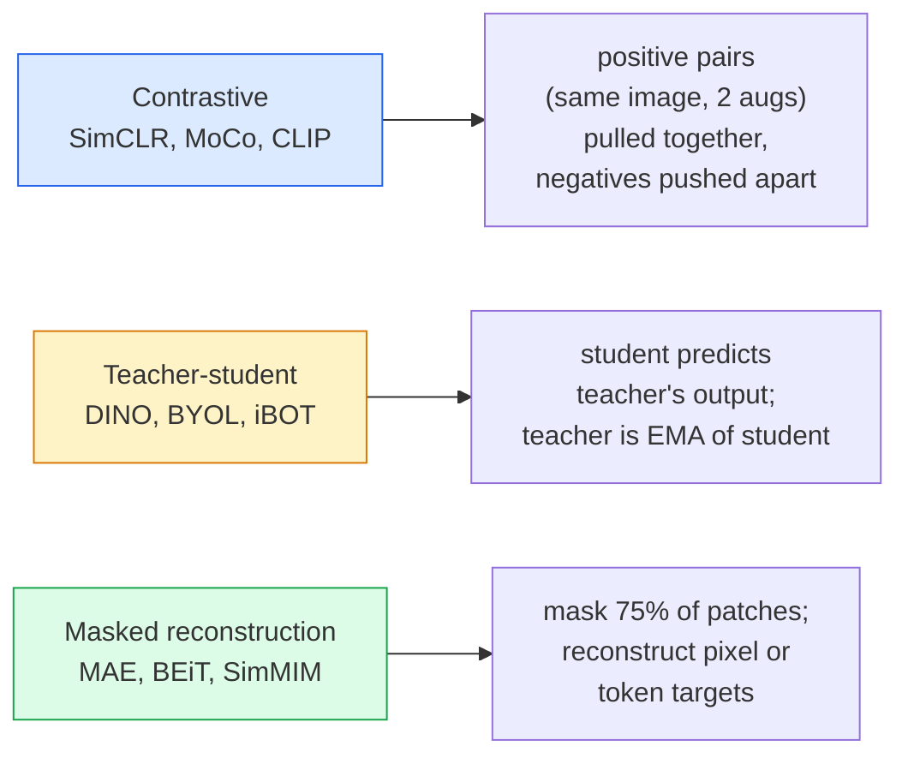

# Самообучаемое зрение — SimCLR, DINO, MAE

> Разметка — узкое место supervised vision. Самообучаемое предобучение (self-supervised pretraining) убирает его: модель учится визуальным признакам на 100M неразмеченных изображений, а затем дообучается на 10k размеченных.

**Тип:** Изучить + собрать
**Языки:** Python
**Предварительные требования:** Phase 4 Lesson 04 (Image Classification), Phase 4 Lesson 14 (ViT)
**Время:** ~75 минут

## Цели обучения

- Проследить три основные семьи самообучаемых методов — контрастивные (SimCLR), teacher-student (DINO), masked reconstruction (MAE) — и сформулировать, что оптимизирует каждая из них
- Реализовать loss InfoNCE с нуля и объяснить, почему batch из 512 работает, а batch из 32 ломается
- Объяснить, почему 75% mask ratio в MAE не произволен и чем он отличается от 15% у BERT для текста
- Использовать checkpoint'ы DINOv2 или MAE ImageNet для linear probing и zero-shot retrieval

## Проблема

Supervised ImageNet содержит 1.3M размеченных изображений; их разметка, по оценкам, стоила $10M. Медицинские и промышленные датасеты меньше, но размечать их еще дороже. Каждая команда computer vision задает один и тот же вопрос: можно ли предобучаться на дешевых неразмеченных данных — кадрах YouTube, веб-краулах, видео с веб-камер, спутниковых съемках — а затем дообучаться на небольшом размеченном наборе?

Ответ — self-supervised learning. Современный self-supervised ViT, обученный на LAION или JFT, при fine-tuning достигает точности supervised ImageNet или превосходит ее. Он также лучше переносится на downstream tasks (detection, segmentation, depth), чем supervised pretraining. DINOv2 (Meta, 2023) и MAE (Meta, 2022) — текущие production defaults для переносимых визуальных признаков.

Концептуальный сдвиг в том, что pretext task — задача, на которой обучают модель, — не обязана совпадать с downstream task. Важно, чтобы она заставляла модель учить полезные признаки. Предсказывать цвет grayscale-изображений, поворачивать изображения и просить модель классифицировать поворот, маскировать патчи и восстанавливать их — все это работало. Три подхода, которые масштабируются, — contrastive learning, teacher-student distillation и masked reconstruction.

## Концепция

### Три семьи



### Контрастивное обучение (SimCLR)

Берем одно изображение, применяем две случайные аугментации и получаем два представления (views). Оба пропускаем через один и тот же encoder плюс projection head. Минимизируем loss, который говорит: "эти два embedding должны быть близко" и "этот embedding должен быть далеко от embedding'ов всех остальных изображений в batch".

```
Loss for positive pair (z_i, z_j) among 2N views per batch:

   L_ij = -log( exp(sim(z_i, z_j) / tau) / sum_k in batch \ {i} exp(sim(z_i, z_k) / tau) )

sim = cosine similarity
tau = temperature (0.1 standard)
```

Это loss InfoNCE. Ему нужно много negative samples на каждый positive sample, поэтому размер batch важен — SimCLR требует 512-8192. MoCo ввел momentum queue прошлых batch'ей, чтобы отвязать число negatives от размера batch.

### Учитель-студент (DINO)

Две сети с одной архитектурой: student и teacher. Teacher — экспоненциальное скользящее среднее (EMA) весов student. Обе видят аугментированные представления изображения. Выход student обучается совпадать с выходом teacher — без явных negatives.

```
loss = CE( student_output(view_1),  teacher_output(view_2) )
     + CE( student_output(view_2),  teacher_output(view_1) )

teacher_weights = m * teacher_weights + (1 - m) * student_weights   (m ≈ 0.996)
```

Почему это не схлопывается в "предсказывать константу": выход teacher центрируется (вычитается среднее по каждой размерности) и заостряется (делится на малую temperature). Centering не дает одной размерности доминировать; sharpening не дает выходу схлопнуться к равномерному распределению.

DINO — это подход, который DINOv2 масштабирует на 142M curated images. Полученные признаки — текущий SOTA для zero-shot visual retrieval и dense prediction.

### Маскированная реконструкция (MAE)

Маскируем 75% патчей входа ViT. Через encoder пропускаем только видимые 25%. Небольшой decoder получает выход encoder плюс mask tokens в замаскированных позициях и обучается восстанавливать пиксели замаскированных патчей.

```
Encoder:  visible 25% of patches -> features
Decoder:  features + mask tokens at masked positions -> reconstructed pixels
Loss:     MSE between reconstructed and original pixels on masked patches only
```

Ключевые проектные решения, благодаря которым MAE работает:

- **75% mask ratio** — высокий. Заставляет encoder учить семантические признаки; восстановление 25% было бы почти тривиальным (соседние пиксели настолько коррелированы, что CNN легко справилась бы).
- **Asymmetric encoder/decoder** — большой ViT encoder видит только видимые патчи; небольшой decoder (8-layer, 512-dim) занимается восстановлением. Предобучение в 3x быстрее, чем наивный BEiT.
- **Pixel-space reconstruction target** — проще, чем tokenised target в BEiT, и лучше работает на ViT.

После предобучения decoder отбрасывают. Encoder становится извлекателем признаков.

### Почему 75%, а не 15%

BERT маскирует 15% токенов. MAE маскирует 75%. Разница — в плотности информации.

- У естественного языка высокая энтропия на токен. Предсказывать 15% токенов все еще сложно, потому что у каждой замаскированной позиции много правдоподобных продолжений.
- У патчей изображения низкая энтропия — незамаскированная окрестность часто почти точно определяет пиксели замаскированного патча. Чтобы предсказание требовало семантического понимания, маскировать нужно агрессивно.

75% достаточно много, чтобы простая пространственная экстраполяция не решала задачу; encoder должен представлять содержимое изображения.

### Оценка linear probe

После self-supervised pretraining стандартная оценка — **linear probe**: заморозить encoder и обучить поверх него один линейный classifier на labels ImageNet. В отчетах указывают top-1 accuracy.

- SimCLR ResNet-50: ~71% (2020)
- DINO ViT-S/16: ~77% (2021)
- MAE ViT-L/16: ~76% (2022)
- DINOv2 ViT-g/14: ~86% (2023)

Linear probe — чистая мера качества признаков; fine-tuning обычно добавляет 2-5 points, но также смешивает результат с эффектом переобучения head.

## Соберите это

### Шаг 1: Пайплайн аугментации с двумя видами

```python
import torch
import torchvision.transforms as T

two_view_train = lambda: T.Compose([
    T.RandomResizedCrop(96, scale=(0.2, 1.0)),
    T.RandomHorizontalFlip(),
    T.ColorJitter(0.4, 0.4, 0.4, 0.1),
    T.RandomGrayscale(p=0.2),
    T.ToTensor(),
])


class TwoViewDataset(torch.utils.data.Dataset):
    def __init__(self, base):
        self.base = base
        self.aug = two_view_train()

    def __len__(self):
        return len(self.base)

    def __getitem__(self, i):
        img, _ = self.base[i]
        v1 = self.aug(img)
        v2 = self.aug(img)
        return v1, v2
```

Каждый __getitem__ возвращает два аугментированных представления одного и того же изображения; labels не нужны.

### Шаг 2: Функция потерь InfoNCE

```python
import torch.nn.functional as F

def info_nce(z1, z2, tau=0.1):
    """
    z1, z2: (N, D) L2-normalised embeddings of paired views
    """
    N, D = z1.shape
    z = torch.cat([z1, z2], dim=0)  # (2N, D)
    sim = z @ z.T / tau              # (2N, 2N)

    mask = torch.eye(2 * N, dtype=torch.bool, device=z.device)
    sim = sim.masked_fill(mask, float("-inf"))

    targets = torch.cat([torch.arange(N, 2 * N), torch.arange(0, N)]).to(z.device)
    return F.cross_entropy(sim, targets)
```

L2-нормализуйте embeddings перед вызовом. `tau=0.1` — значение по умолчанию в SimCLR; меньшее значение делает loss острее и требует больше negatives.

### Шаг 3: Sanity check для InfoNCE

```python
z1 = F.normalize(torch.randn(16, 32), dim=-1)
z2 = z1.clone()
loss_same = info_nce(z1, z2, tau=0.1).item()
z2_random = F.normalize(torch.randn(16, 32), dim=-1)
loss_random = info_nce(z1, z2_random, tau=0.1).item()
print(f"InfoNCE with identical pairs:  {loss_same:.3f}")
print(f"InfoNCE with random pairs:     {loss_random:.3f}")
```

Идентичные пары должны давать низкий loss (близкий к 0 для большого batch и низкой temperature). Случайные пары должны давать log(2N-1) = ~log(31) = ~3.4 при batch из 16 пар.

### Шаг 4: Маскирование в стиле MAE

```python
def random_mask_indices(num_patches, mask_ratio=0.75, seed=0):
    g = torch.Generator().manual_seed(seed)
    n_keep = int(num_patches * (1 - mask_ratio))
    perm = torch.randperm(num_patches, generator=g)
    visible = perm[:n_keep]
    masked = perm[n_keep:]
    return visible.sort().values, masked.sort().values


num_patches = 196
visible, masked = random_mask_indices(num_patches, mask_ratio=0.75)
print(f"visible: {len(visible)} / {num_patches}")
print(f"masked:  {len(masked)} / {num_patches}")
```

Просто, быстро и детерминированно для заданного seed. Реальные реализации MAE делают это по batch и хранят masks для каждого sample.

## Используйте это

DINOv2 — production standard в 2026 году:

```python
import torch
from transformers import AutoImageProcessor, AutoModel

processor = AutoImageProcessor.from_pretrained("facebook/dinov2-base")
model = AutoModel.from_pretrained("facebook/dinov2-base")
model.eval()

# Per-image embeddings for zero-shot retrieval
with torch.no_grad():
    inputs = processor(images=[pil_image], return_tensors="pt")
    outputs = model(**inputs)
    embedding = outputs.last_hidden_state[:, 0]  # CLS token
```

Полученный 768-dim embedding — основа современных pipeline'ов image retrieval, dense correspondence и zero-shot transfer. Fine-tuning на downstream task редко требует больше, чем linear head.

Для image-text embeddings аналогом служит SigLIP или OpenCLIP; для fine-tuning в стиле MAE repo `timm` поставляет каждый checkpoint MAE.

## Отправьте это

Этот урок создает:

- `outputs/prompt-ssl-pretraining-picker.md` — prompt, который выбирает SimCLR / MAE / DINOv2 по размеру датасета, compute и downstream task.
- `outputs/skill-linear-probe-runner.md` — skill, который пишет оценку linear-probe для любого frozen encoder + labelled dataset.

## Упражнения

1. **(Easy)** Проверьте, что InfoNCE loss падает при уменьшении temperature для хорошо выровненных embeddings и растет при уменьшении temperature для случайных embeddings. Постройте график `tau in [0.05, 0.1, 0.2, 0.5]` vs loss.
2. **(Medium)** Реализуйте centre buffer в стиле DINO. Покажите, что без centring student схлопывается к константному вектору за несколько epochs.
3. **(Hard)** Обучите MAE на CIFAR-100, используя TinyUNet из Lesson 10 как backbone. Сообщите linear-probe accuracy на 10, 50 и 200 epochs. Покажите, что MAE-pretrained linear probe превосходит supervised linear probe, обученный from scratch, на том же subset из 1,000 изображений.

## Ключевые термины

| Термин | Как говорят | Что это на самом деле значит |
|------|----------------|----------------------|
| Self-supervised | "Label-free" | Pretext task, которая получает полезные представления из неразмеченных данных |
| Pretext task | "The fake task" | Objective, используемая во время SSL (восстановить патчи, сопоставить views); отбрасывается после pretraining |
| Linear probe | "Frozen encoder + linear head" | Стандартная оценка SSL: обучать только linear classifier поверх frozen features |
| InfoNCE | "Contrastive loss" | softmax по cosine similarities; positive pair — target class, все остальные — negatives |
| EMA teacher | "Moving-average teacher" | Teacher, веса которого являются экспоненциальным скользящим средним весов student; используется BYOL, MoCo, DINO |
| Mask ratio | "% of patches hidden" | Доля патчей, маскируемых во время MAE; 75% для vision, 15% для text |
| Representation collapse | "Constant output" | Сбой SSL, при котором encoder выдает константный vector для всех inputs; предотвращается centring, sharpening или negatives |
| DINOv2 | "Production SSL backbone" | Self-supervised ViT от Meta 2023 года; strongest general-purpose image features in 2026 |

## Дополнительное чтение

- [SimCLR (Chen et al., 2020)](https://arxiv.org/abs/2002.05709) — reference по contrastive learning
- [DINO (Caron et al., 2021)](https://arxiv.org/abs/2104.14294) — teacher-student с momentum, centring, sharpening
- [MAE (He et al., 2022)](https://arxiv.org/abs/2111.06377) — masked autoencoder pretraining для ViT
- [DINOv2 (Oquab et al., 2023)](https://arxiv.org/abs/2304.07193) — масштабирование самообучаемого ViT до production-признаков
