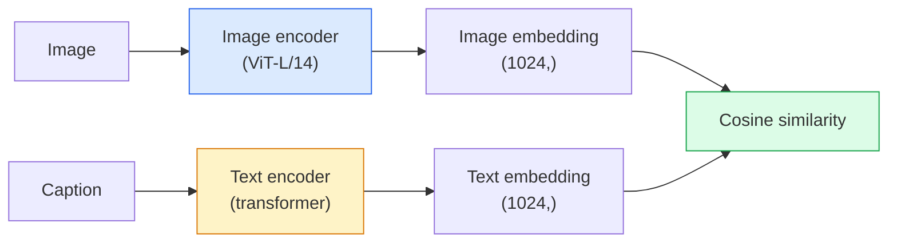

# Зрение с открытым словарем — CLIP

> Обучите энкодер изображений и энкодер текста вместе так, чтобы соответствующие пары (изображение, подпись) попадали в одну и ту же точку общего пространства. В этом весь прием.

**Тип:** Сборка + использование
**Языки:** Python
**Предварительные требования:** Фаза 4 Урок 14 (ViT), Фаза 4 Урок 17 (самообучение)
**Время:** ~45 минут

## Цели обучения

- Объяснить двухбашенную архитектуру CLIP и контрастивную целевую функцию обучения
- Использовать предобученный CLIP (или SigLIP) для zero-shot классификации без какого-либо обучения под конкретную задачу
- Реализовать zero-shot классификацию с нуля: закодировать промпты классов, вычислить косинусное сходство, взять argmax
- Различать модели CLIP, SigLIP, OpenCLIP и LLaVA/LLaMA-vision — для чего каждая нужна в 2026 году

## Проблема

Традиционные классификаторы имеют закрытый словарь: модель ImageNet на 1000 классов может предсказывать только 1000 меток. Для каждой новой категории нужны размеченные данные и заново обученная голова.

CLIP (Radford et al., OpenAI 2021) показал, что обучение на 400M пар (изображение, подпись), собранных из веба, дает модель, которая во время инференса может классифицировать в любой набор категорий, описанных исключительно естественным языком. Вы задаете новый класс, написав предложение.

Именно эта возможность — zero-shot перенос — причина, по которой каждая современная система компьютерного зрения начинается с чекпоинта семейства CLIP. Детекция (Grounding DINO, OWL-ViT), сегментация (CLIPSeg, SAM), поиск, модерация контента, VLM и генерация текста в изображение — все это строится на совместных эмбеддингах в стиле CLIP.

## Концепция

### Две башни



Оба энкодера завершаются линейной проекцией в одну и ту же размерность эмбеддинга (512 для CLIP-B/32, 1024 для CLIP-L/14). Выполните L2-нормализацию и вычислите косинусное сходство.

### Целевая функция

Для батча из N пар (изображение, подпись) постройте матрицу сходства NxN. Обучайте оба энкодера так, чтобы диагональ (соответствующие пары) имела высокое сходство, а внедиагональные элементы (несоответствующие пары) имели низкое сходство.

```
sim_matrix = image_embeddings @ text_embeddings.T / tau

loss_i2t = cross_entropy(sim_matrix,       targets=arange(N))
loss_t2i = cross_entropy(sim_matrix.T,     targets=arange(N))
loss = (loss_i2t + loss_t2i) / 2
```

Симметричная, потому что должны работать и поиск изображения по тексту, и поиск текста по изображению. `tau` (температура) обычно обучается как скалярный параметр, инициализированный значением 0.07.

### SigLIP: более удачная функция потерь

SigLIP (Zhai et al., 2023) заменил softmax на sigmoid для каждой пары:

```
loss = mean over pairs of log(1 + exp(-y_ij * sim_ij))
y_ij = +1 if matching, -1 otherwise
```

Попарная функция потерь убирает нормализацию на уровне батча, которая требуется CLIP. SigLIP лучше обучается при небольших размерах батча и при одинаковом объеме данных соответствует CLIP или превосходит его.

### Zero-shot классификация

Имея обученный CLIP:

1. Для каждого класса составьте промпт: "a photo of a {class}".
2. Закодируйте все промпты классов текстовым энкодером -> `T` формы (C, d).
3. Закодируйте тестовое изображение -> `I` формы (1, d).
4. Сходство = `I @ T.T` формы (1, C).
5. Argmax -> предсказанный класс.

Проектирование промптов важно. OpenAI опубликовала 80 шаблонов промптов для ImageNet ("a photo of a {}", "a blurry photo of a {}", "a sketch of a {}", ...). Усреднение эмбеддингов всех шаблонов для каждого класса дает дополнительные 1-3% top-1 accuracy.

### Где модели в стиле CLIP используются в 2026 году

- **Zero-shot классификация** — прямое использование.
- **Поиск изображений** — закодировать все изображения один раз, встроить запрос во время инференса.
- **Детекция, обусловленная текстом** — Grounding DINO, OWL-ViT оборачивают текстовую башню CLIP вокруг детектора.
- **Сегментация, обусловленная текстом** — CLIPSeg; SAM использует текстовые входные промпты через CLIP.
- **VLM** — LLaVA, Qwen-VL, InternVL подключают визуальный энкодер семейства CLIP к LLM.
- **Генерация текста в изображение** — Stable Diffusion, DALL-E 3 используют CLIP text embeddings как условие.

Когда у вас есть общее пространство эмбеддингов, каждая задача зрение+язык становится вычислением расстояния.

## Соберите это

### Шаг 1: Крошечная двухбашенная модель

Настоящий CLIP — это ViT + transformer. В этом уроке башни — небольшие MLP поверх заранее извлеченных признаков, чтобы обучающий сигнал был виден на CPU.

```python
import torch
import torch.nn as nn
import torch.nn.functional as F


class TwoTower(nn.Module):
    def __init__(self, img_in=128, txt_in=64, emb=64):
        super().__init__()
        self.image_proj = nn.Sequential(nn.Linear(img_in, 128), nn.ReLU(), nn.Linear(128, emb))
        self.text_proj = nn.Sequential(nn.Linear(txt_in, 128), nn.ReLU(), nn.Linear(128, emb))
        self.logit_scale = nn.Parameter(torch.ones([]) * 2.6592)  # ln(1/0.07)

    def forward(self, img_feats, txt_feats):
        i = F.normalize(self.image_proj(img_feats), dim=-1)
        t = F.normalize(self.text_proj(txt_feats), dim=-1)
        return i, t, self.logit_scale.exp()
```

Две проекции, выход общей размерности, обучаемая температура. Та же форма, что и в настоящем API CLIP.

### Шаг 2: Контрастивная функция потерь

```python
def clip_loss(image_emb, text_emb, logit_scale):
    N = image_emb.size(0)
    sim = logit_scale * image_emb @ text_emb.T
    targets = torch.arange(N, device=sim.device)
    l_i = F.cross_entropy(sim, targets)
    l_t = F.cross_entropy(sim.T, targets)
    return (l_i + l_t) / 2
```

Симметричная. Более высокий logit_scale = более резкий softmax = больше уверенности, но выше риск нестабильности.

### Шаг 3: Zero-shot классификатор

```python
@torch.no_grad()
def zero_shot_classify(model, image_feats, class_text_feats, class_names):
    """
    image_feats:      (N, img_in)
    class_text_feats: (C, txt_in)   one averaged embedding per class
    """
    i = F.normalize(model.image_proj(image_feats), dim=-1)
    t = F.normalize(model.text_proj(class_text_feats), dim=-1)
    sim = i @ t.T
    pred = sim.argmax(dim=-1)
    return [class_names[p] for p in pred.tolist()]
```

Одна строка на каждый шаг. Это точная zero-shot процедура, используемая с production-чекпоинтом CLIP.

### Шаг 4: Sanity check

```python
torch.manual_seed(0)
model = TwoTower()

img = torch.randn(8, 128)
txt = torch.randn(8, 64)
i, t, scale = model(img, txt)
loss = clip_loss(i, t, scale)
print(f"batch size: {i.size(0)}   loss: {loss.item():.3f}")
```

Функция потерь должна быть близка к `log(N) = log(8) = 2.08` для случайно инициализированной модели — симметричной cross-entropy цели, когда структура еще не выучена.

## Используйте это

OpenCLIP — стандарт сообщества в 2026 году:

```python
import open_clip
import torch
from PIL import Image

model, _, preprocess = open_clip.create_model_and_transforms("ViT-B-32", pretrained="laion2b_s34b_b79k")
tokenizer = open_clip.get_tokenizer("ViT-B-32")

image = preprocess(Image.open("dog.jpg")).unsqueeze(0)
text = tokenizer(["a photo of a dog", "a photo of a cat", "a photo of a car"])

with torch.no_grad():
    image_features = model.encode_image(image)
    text_features = model.encode_text(text)
    image_features = image_features / image_features.norm(dim=-1, keepdim=True)
    text_features = text_features / text_features.norm(dim=-1, keepdim=True)
    probs = (100.0 * image_features @ text_features.T).softmax(dim=-1)

print(probs)
```

SigLIP новее, лучше обучается на малых масштабах и предпочтителен для новой работы: `google/siglip-base-patch16-224`. Hugging Face поставляет оба.

## Отправьте в работу

Этот урок создает:

- `outputs/prompt-zero-shot-class-picker.md` — промпт, который проектирует шаблоны классов для zero-shot CLIP по заданному списку классов и домену.
- `outputs/skill-image-text-retriever.md` — навык, который строит индекс эмбеддингов изображений с любым чекпоинтом CLIP, поддерживает query-by-text и query-by-image.

## Упражнения

1. **(Легко)** Используйте предобученный OpenCLIP ViT-B/32 и выполните zero-shot классификацию на CIFAR-10 с набором из 80 шаблонов промптов. Сообщите top-1 accuracy; она должна быть около 85-90%.
2. **(Средне)** Сравните один шаблон ("a photo of a {}") с усредненными эмбеддингами по 80 шаблонам на той же задаче CIFAR-10. Количественно оцените разрыв и объясните, почему шаблоны помогают.
3. **(Сложно)** Постройте zero-shot индекс поиска изображений: встроите 1,000 изображений с CLIP, постройте индекс FAISS, выполните запрос описанием на естественном языке. Сообщите retrieval recall@5 для 20 отложенных запросов, которые вы напишете вручную.

## Ключевые термины

| Термин | Как говорят | Что это на самом деле значит |
|------|----------------|----------------------|
| Two-tower | "Dual encoder" | Отдельные энкодеры изображения и текста, заканчивающиеся проекционной головой общей размерности |
| Zero-shot | "No task-specific training" | Классификация в классы, описанные только текстом во время инференса; метки не используются |
| Temperature / logit_scale | "tau" | Обучаемый скаляр, который масштабирует матрицу сходства перед softmax |
| Prompt template | "A photo of a {}" | Естественно-языковая обертка вокруг имен классов; усреднение многих шаблонов повышает zero-shot точность |
| CLIP | "Image+text model" | Модель OpenAI 2021 года; словарь предметной области в 2026 году |
| SigLIP | "Sigmoid CLIP" | Заменяет softmax на попарный sigmoid; лучше обучается на небольших батчах |
| OpenCLIP | "Open reproduction" | Варианты CLIP, обученные сообществом на LAION; production-стандарт для open-source пайплайнов |
| VLM | "Vision-language model" | Энкодер семейства CLIP плюс LLM, обученные отвечать на вопросы об изображениях |

## Дополнительное чтение

- [CLIP: Learning Transferable Visual Models from Natural Language Supervision (Radford et al., 2021)](https://arxiv.org/abs/2103.00020)
- [SigLIP: Sigmoid Loss for Language-Image Pre-Training (Zhai et al., 2023)](https://arxiv.org/abs/2303.15343)
- [OpenCLIP](https://github.com/mlfoundations/open_clip) — кодовая база сообщества
- [DINOv2 vs CLIP vs MAE: a features comparison](https://huggingface.co/blog/dinov2) — руководство HF с вариантами использования side-by-side
