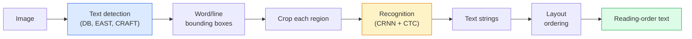

# OCR и понимание документов

> OCR — это трехэтапный конвейер: обнаружить текстовые блоки, распознать символы, затем разложить их по структуре. Каждая современная OCR-система переупорядочивает эти этапы или объединяет их.

**Тип:** Изучение + использование
**Языки:** Python
**Предварительные требования:** Фаза 4 Урок 06 (детекция), Фаза 7 Урок 02 (Self-Attention)
**Время:** ~45 минут

## Цели обучения

- Проследить классический OCR-конвейер (detect -> recognise -> layout) и современные end-to-end альтернативы (Donut, Qwen-VL-OCR)
- Реализовать функцию потерь CTC (Connectionist Temporal Classification) для обучения OCR по схеме sequence-to-sequence
- Использовать PaddleOCR или EasyOCR для промышленного парсинга документов без обучения
- Различать OCR, разбор макета (layout parsing) и понимание документов (document understanding) — и выбирать правильный инструмент под задачу

## Проблема

Изображения, заполненные текстом, встречаются повсюду: чеки, счета, удостоверения, отсканированные книги, формы, доски, вывески, скриншоты. Извлечение из них структурированных данных — не просто символов, а, например, факта "это итоговая сумма" — одна из самых ценных прикладных задач компьютерного зрения.

Область делится на три уровня навыков:

1. **OCR proper**: превратить пиксели в текст.
2. **Layout parsing**: сгруппировать OCR-вывод в области (заголовок, основной текст, таблица, верхний колонтитул).
3. **Document understanding**: извлечь структурированные поля ("invoice_total = $42.50") из макета.

У каждого уровня есть классические и современные подходы, а разрыв между "мне нужен текст с изображения" и "мне нужна итоговая сумма из этого чека" больше, чем думает большинство команд.

## Концепция

### Классический конвейер



- **Text detection** выдает четырехугольники для каждой строки или каждого слова.
- **Recognition** вырезает каждую область до фиксированной высоты, прогоняет CNN + BiLSTM + CTC и получает последовательность символов.
- **Layout** восстанавливает порядок чтения (сверху вниз, слева направо для латиницы; иначе для арабского, японского).

### CTC в одном абзаце

OCR-распознавание получает последовательность переменной длины из карты признаков фиксированной длины. CTC (Graves et al., 2006) позволяет обучать это без посимвольного выравнивания. Модель на каждом временном шаге выдает распределение по (vocab + blank); функция потерь CTC маргинализирует по всем выравниваниям, которые после слияния повторов и удаления blank сводятся к целевому тексту.

```
raw output: "h h h _ _ e e l l _ l l o _ _"
after merge repeats and remove blanks: "hello"
```

CTC — причина, по которой CRNN работала в 2015 году и по-прежнему обучает большинство промышленных OCR-моделей в 2026 году.

### Современные end-to-end модели

- **Donut** (Kim et al., 2022) — ViT-энкодер + текстовый декодер; читает изображение и напрямую выдает JSON. Без детектора текста, без модуля макета.
- **TrOCR** — ViT + transformer decoder для OCR на уровне строки.
- **Qwen-VL-OCR / InternVL** — полноразмерные vision-language models, дообученные для OCR-задач; лучшая точность в 2026 году на сложных документах.
- **PaddleOCR** — классический конвейер DB + CRNN в зрелом промышленном пакете; по-прежнему рабочая лошадка open-source.

End-to-end модели требуют больше данных и вычислений, но избегают накопления ошибок в многоэтапных конвейерах.

### Layout parsing

Для структурированных документов запустите детектор макета (LayoutLMv3, DocLayNet), который размечает каждую область: Title, Paragraph, Figure, Table, Footnote. Тогда порядок чтения становится правилом "пройти по областям в порядке макета и конкатенировать".

Для форм используйте модели **Key-Value extraction** (Donut для визуально насыщенных документов, LayoutLMv3 для обычных сканов). Они принимают изображение + обнаруженный текст + позиции и предсказывают структурированные пары ключ-значение.

### Метрики оценки

- **Character Error Rate (CER)** — расстояние Левенштейна / длина эталона. Чем ниже, тем лучше. Производственная цель: < 2% на чистых сканах.
- **Word Error Rate (WER)** — то же самое на уровне слов.
- **F1 on structured fields** — для задач key-value; измеряет, правильно ли появляется `{invoice_total: 42.50}`.
- **Edit distance on JSON** — для end-to-end парсинга документов; статья Donut ввела normalized tree edit distance.

## Соберите это

### Шаг 1: CTC loss + greedy decoder

```python
import torch
import torch.nn as nn
import torch.nn.functional as F


def ctc_loss(log_probs, targets, input_lengths, target_lengths, blank=0):
    """
    log_probs:      (T, N, C) log-softmax over vocab including blank at index 0
    targets:        (N, S) int targets (no blanks)
    input_lengths:  (N,) per-sample time steps used
    target_lengths: (N,) per-sample target length
    """
    return F.ctc_loss(log_probs, targets, input_lengths, target_lengths,
                      blank=blank, reduction="mean", zero_infinity=True)


def greedy_ctc_decode(log_probs, blank=0):
    """
    log_probs: (T, N, C) log-softmax
    returns: list of index sequences (blanks removed, repeats merged)
    """
    preds = log_probs.argmax(dim=-1).transpose(0, 1).cpu().tolist()
    out = []
    for seq in preds:
        decoded = []
        prev = None
        for idx in seq:
            if idx != prev and idx != blank:
                decoded.append(idx)
            prev = idx
        out.append(decoded)
    return out
```

`F.ctc_loss` использует эффективную реализацию CuDNN, когда она доступна. Жадный декодер проще beam search и обычно находится в пределах 1% CER от него.

### Шаг 2: Tiny CRNN recogniser

Минимальная CNN + BiLSTM для OCR строк.

```python
class TinyCRNN(nn.Module):
    def __init__(self, vocab_size=40, hidden=128, feat=32):
        super().__init__()
        self.cnn = nn.Sequential(
            nn.Conv2d(1, feat, 3, 1, 1), nn.BatchNorm2d(feat), nn.ReLU(inplace=True),
            nn.MaxPool2d(2),
            nn.Conv2d(feat, feat * 2, 3, 1, 1), nn.BatchNorm2d(feat * 2), nn.ReLU(inplace=True),
            nn.MaxPool2d(2),
            nn.Conv2d(feat * 2, feat * 4, 3, 1, 1), nn.BatchNorm2d(feat * 4), nn.ReLU(inplace=True),
            nn.MaxPool2d((2, 1)),
            nn.Conv2d(feat * 4, feat * 4, 3, 1, 1), nn.BatchNorm2d(feat * 4), nn.ReLU(inplace=True),
            nn.MaxPool2d((2, 1)),
        )
        self.rnn = nn.LSTM(feat * 4, hidden, bidirectional=True, batch_first=True)
        self.head = nn.Linear(hidden * 2, vocab_size)

    def forward(self, x):
        # x: (N, 1, H, W)
        f = self.cnn(x)                # (N, C, H', W')
        f = f.mean(dim=2).transpose(1, 2)  # (N, W', C)
        h, _ = self.rnn(f)
        return F.log_softmax(self.head(h).transpose(0, 1), dim=-1)  # (W', N, vocab)
```

Вход фиксированной высоты (CNN через max-pooling сводит высоту к 1). Ширина — временное измерение для CTC.

### Шаг 3: Synthetic OCR

Сгенерируйте черные на белом строки цифр для end-to-end smoke test.

```python
import numpy as np

def synthetic_line(text, height=32, char_width=16):
    W = char_width * len(text)
    img = np.ones((height, W), dtype=np.float32)
    for i, c in enumerate(text):
        x = i * char_width
        shade = 0.0 if c.isalnum() else 0.5
        img[6:height - 6, x + 2:x + char_width - 2] = shade
    return img


def build_batch(strings, vocab):
    H = 32
    W = 16 * max(len(s) for s in strings)
    imgs = np.ones((len(strings), 1, H, W), dtype=np.float32)
    target_lengths = []
    targets = []
    for i, s in enumerate(strings):
        imgs[i, 0, :, :16 * len(s)] = synthetic_line(s)
        ids = [vocab.index(c) for c in s]
        targets.extend(ids)
        target_lengths.append(len(ids))
    return torch.from_numpy(imgs), torch.tensor(targets), torch.tensor(target_lengths)


vocab = ["_"] + list("0123456789abcdefghijklmnopqrstuvwxyz")
imgs, targets, lengths = build_batch(["hello", "world"], vocab)
print(f"images: {imgs.shape}   targets: {targets.shape}   lengths: {lengths.tolist()}")
```

Реальный OCR-датасет добавляет шрифты, шум, поворот, размытие и цвет. Конвейер выше идентичен.

### Шаг 4: Training sketch

```python
model = TinyCRNN(vocab_size=len(vocab))
opt = torch.optim.Adam(model.parameters(), lr=1e-3)

for step in range(200):
    strings = ["abc" + str(step % 10)] * 4 + ["xyz" + str((step + 1) % 10)] * 4
    imgs, targets, target_lens = build_batch(strings, vocab)
    log_probs = model(imgs)  # (W', 8, vocab)
    input_lens = torch.full((8,), log_probs.size(0), dtype=torch.long)
    loss = ctc_loss(log_probs, targets, input_lens, target_lens, blank=0)
    opt.zero_grad(); loss.backward(); opt.step()
```

На этих тривиальных синтетических данных loss должен снизиться примерно с ~3 до ~0.2 за 200 шагов.

## Используйте это

Три производственных пути:

- **PaddleOCR** — зрелый, быстрый, многоязычный. Использование в одну строку: `paddleocr.PaddleOCR(lang="en").ocr(image_path)`.
- **EasyOCR** — Python-native, многоязычный, с PyTorch backbone.
- **Tesseract** — классический; все еще полезен для старых отсканированных документов, когда модели испытывают трудности.

Для end-to-end парсинга документов используйте Donut или VLM:

```python
from transformers import DonutProcessor, VisionEncoderDecoderModel

processor = DonutProcessor.from_pretrained("naver-clova-ix/donut-base-finetuned-cord-v2")
model = VisionEncoderDecoderModel.from_pretrained("naver-clova-ix/donut-base-finetuned-cord-v2")
```

Для чеков, счетов и форм с повторяемой структурой дообучите Donut. Для произвольных документов или OCR с рассуждением текущий вариант по умолчанию — VLM вроде Qwen-VL-OCR.

## Доведите до результата

Этот урок создает:

- `outputs/prompt-ocr-stack-picker.md` — промпт, который выбирает Tesseract / PaddleOCR / Donut / VLM-OCR с учетом типа документа, языка и структуры.
- `outputs/skill-ctc-decoder.md` — навык, который пишет жадные и beam-search CTC-декодеры с нуля, включая нормализацию по длине.

## Упражнения

1. **(Easy)** Обучите TinyCRNN на случайных числовых строках из 5 цифр в течение 500 шагов. Сообщите CER на отложенной выборке.
2. **(Medium)** Замените жадное декодирование на beam search (beam_width=5). Сообщите изменение CER. На каких входах beam search выигрывает?
3. **(Hard)** Используйте PaddleOCR на наборе из 20 чеков, извлеките позиции чека и вычислите F1 относительно вручную размеченной ground truth для пар {item_name, price}.

## Ключевые термины

| Термин | Как говорят | Что это на самом деле означает |
|------|----------------|----------------------|
| OCR | "Текст из пикселей" | Преобразование областей изображения в последовательности символов |
| CTC | "Функция потерь без выравнивания" | Функция потерь, которая обучает последовательностную модель без меток на каждом временном шаге; маргинализирует по выравниваниям |
| CRNN | "Классическая OCR-модель" | Сверточный извлекатель признаков + BiLSTM + CTC; baseline 2015 года, который все еще используется в продакшене |
| Donut | "End-to-end OCR" | ViT-энкодер + текстовый декодер; выдает JSON напрямую из изображения |
| Layout parsing | "Найти области" | Обнаружение и разметка областей Title/Table/Figure/Paragraph в документе |
| Reading order | "Текстовая последовательность" | Упорядочивание распознанных областей в предложение; тривиально для латиницы, нетривиально для смешанных макетов |
| CER / WER | "Частоты ошибок" | Расстояние Левенштейна / длина эталона на уровне символов или слов |
| VLM-OCR | "LLM, которая читает" | Vision-language model, обученная или промптированная для OCR-задач; текущий SOTA на сложных документах |

## Дополнительные материалы

- [CRNN (Shi et al., 2015)](https://arxiv.org/abs/1507.05717) — исходная архитектура CNN+RNN+CTC
- [CTC (Graves et al., 2006)](https://www.cs.toronto.edu/~graves/icml_2006.pdf) — исходная статья о CTC; плотно насыщена алгоритмическими идеями
- [Donut (Kim et al., 2022)](https://arxiv.org/abs/2111.15664) — transformer для понимания документов без OCR
- [PaddleOCR](https://github.com/PaddlePaddle/PaddleOCR) — open-source промышленный OCR-стек
