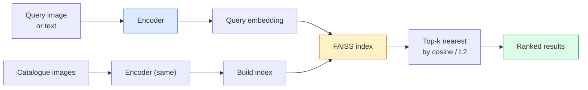

# Поиск изображений и метрическое обучение

> Система поиска ранжирует кандидатов по расстоянию в пространстве эмбеддингов. Метрическое обучение (metric learning) — это дисциплина формирования такого пространства, чтобы расстояния означали именно то, что вам нужно.

**Type:** Build
**Languages:** Python
**Prerequisites:** Phase 4 Lesson 14 (ViT), Phase 4 Lesson 18 (CLIP)
**Time:** ~45 minutes

## Цели обучения

- Объяснить функции потерь метрического обучения на основе триплетов, контрастивного подхода и прокси и выбрать подходящую для заданного датасета
- Корректно реализовать L2-нормализацию и косинусное сходство и проанализировать разницу между поиском "того же объекта" и "того же класса"
- Построить индекс FAISS, выполнять запросы к нему по тексту и по изображению и сообщать recall@K для отложенного набора запросов
- Использовать DINOv2, CLIP и SigLIP как готовые основы для эмбеддингов и понимать, когда каждая из них выигрывает

## Проблема

Поиск встречается в промышленном компьютерном зрении повсюду: обнаружение дубликатов, обратный поиск по изображению, визуальный поиск ("найти похожие товары"), повторная идентификация лиц, person re-ID для видеонаблюдения, сопоставление на уровне экземпляров для электронной коммерции. Продуктовый вопрос всегда один и тот же: "по данному изображению-запросу ранжируй мой каталог."

Два проектных решения формируют всю систему. Эмбеддинг — какая модель производит векторы. Индекс — как искать ближайших соседей в масштабе. В 2026 году оба компонента стали типовыми (DINOv2 для эмбеддинга, FAISS для индекса), что повышает планку: сложная часть — определить, *что считается похожим* в вашем приложении, а затем сформировать пространство эмбеддингов так, чтобы расстояния этому соответствовали.

Такое формирование и есть метрическое обучение. Это небольшая, но очень эффективная дисциплина.

## Концепция

### Поиск вкратце



### Четыре семейства функций потерь

| Функция потерь | Требует | Плюсы | Минусы |
|------|----------|------|------|
| **Contrastive** | (anchor, positive) + negatives | Простая, работает с любой парной меткой | Медленно сходится без большого числа негативов |
| **Triplet** | (anchor, positive, negative) | Интуитивная; прямое управление margin | Майнинг сложных триплетов дорог |
| **NT-Xent / InfoNCE** | пары + batch-mined negatives | Масштабируется на большие батчи | Нужен большой батч или очередь momentum |
| **Proxy-based (ProxyNCA)** | только метки классов | Быстрая, стабильная, без майнинга | Может переобучаться на прокси на малых датасетах |

Для большинства промышленных сценариев начните с предобученной основы и добавляйте дообучение с метрическим обучением только если готовые эмбеддинги дают слабый результат на вашем тестовом наборе.

### Формально о triplet loss

```
L = max(0, ||f(a) - f(p)||^2 - ||f(a) - f(n)||^2 + margin)
```

Притягивайте anchor `a` к positive `p`, отталкивайте его от negative `n`, с `margin`, который обеспечивает зазор. Структура из трех изображений обобщается на любое упорядочивание по сходству.

Майнинг важен: легкие триплеты (`n` уже далеко от `a`) дают нулевую потерю; сеть обучают только сложные триплеты. Semi-hard mining (`n` дальше, чем `p`, но внутри margin) — рецепт FaceNet 2016 года, который по-прежнему доминирует.

### Косинусное сходство против L2

Две метрики, две конвенции:

- **Cosine**: угол между векторами. Требует L2-нормализованных эмбеддингов.
- **L2**: евклидово расстояние. Работает на сырых или нормализованных эмбеддингах, но обычно используется в паре с L2-normalised + squared L2.

Для большинства современных сетей они эквивалентны: `||a - b||^2 = 2 - 2 cos(a, b)` при `||a|| = ||b|| = 1`. Выберите конвенцию, которая соответствует обучению вашего эмбеддинга; их смешивание незаметно меняет смысл "ближайшего".

### Recall@K

Стандартная метрика поиска:

```
recall@K = fraction of queries where at least one correct match is in the top K results
```

Сообщайте recall@1, @5, @10 рядом. recall@10 выше 0.95 при recall@1 ниже 0.5 означает, что пространство эмбеддингов имеет правильную структуру, но ранжирование шумное — попробуйте более длительное дообучение или шаг повторного ранжирования.

Для обнаружения дубликатов precision@K важнее, потому что каждое ложное срабатывание — заметная пользователю ошибка. Для визуального поиска recall@K — продуктовый сигнал.

### FAISS в одном абзаце

Facebook AI Similarity Search. Фактический стандарт библиотеки для поиска ближайших соседей. Три варианта индекса:

- `IndexFlatIP` / `IndexFlatL2` — полный перебор, точный, без обучения. Используйте примерно до ~1M векторов.
- `IndexIVFFlat` — разбивает на K ячеек, ищет только в нескольких ближайших ячейках. Приближенный, быстрый, требует обучающих данных.
- `IndexHNSW` — графовый, самый быстрый для большого числа запросов, с большим размером индекса.

Для 100k векторов вам, вероятно, нужен `IndexFlatIP` с косинусным сходством. Для 10M нужен `IndexIVFFlat`. Для 100M+ — в сочетании с product quantisation (`IndexIVFPQ`).

### Поиск на уровне экземпляра против поиска на уровне категории

Две очень разные задачи с одним названием:

- **Category-level** — "найти кошек в моем каталоге." Класс-условное сходство; готовые эмбеддинги CLIP / DINOv2 работают хорошо.
- **Instance-level** — "найти *именно этот товар* в моем каталоге." Требует тонкого различения визуально похожих объектов одного класса; готовые эмбеддинги работают хуже; важно дообучение с метрическим обучением.

Всегда спрашивайте, какую из них вы решаете, прежде чем выбирать модель.

## Соберите это

### Шаг 1: Triplet loss

```python
import torch
import torch.nn.functional as F

def triplet_loss(anchor, positive, negative, margin=0.2):
    d_ap = F.pairwise_distance(anchor, positive, p=2)
    d_an = F.pairwise_distance(anchor, negative, p=2)
    return F.relu(d_ap - d_an + margin).mean()
```

Одна строка. Работает на L2-нормализованных или сырых эмбеддингах.

### Шаг 2: Semi-hard mining

Для заданного батча эмбеддингов и меток найдите самый сложный semi-hard negative для каждого anchor.

```python
def semi_hard_negatives(emb, labels, margin=0.2):
    dist = torch.cdist(emb, emb)
    same_class = labels[:, None] == labels[None, :]
    diff_class = ~same_class
    N = emb.size(0)

    positives = dist.clone()
    positives[~same_class] = float("-inf")
    positives.fill_diagonal_(float("-inf"))
    pos_idx = positives.argmax(dim=1)

    semi_hard = dist.clone()
    semi_hard[same_class] = float("inf")
    d_ap = dist[torch.arange(N), pos_idx].unsqueeze(1)
    semi_hard[dist <= d_ap] = float("inf")
    neg_idx = semi_hard.argmin(dim=1)

    fallback_mask = semi_hard[torch.arange(N), neg_idx] == float("inf")
    if fallback_mask.any():
        hardest = dist.clone()
        hardest[same_class] = float("inf")
        neg_idx = torch.where(fallback_mask, hardest.argmin(dim=1), neg_idx)
    return pos_idx, neg_idx
```

Каждый anchor получает самый сложный positive внутри класса и semi-hard negative, который дальше positive, но внутри margin.

### Шаг 3: Recall@K

```python
def recall_at_k(query_emb, gallery_emb, query_labels, gallery_labels, k=1):
    sim = query_emb @ gallery_emb.T
    _, top_k = sim.topk(k, dim=-1)
    matches = (gallery_labels[top_k] == query_labels[:, None]).any(dim=-1)
    return matches.float().mean().item()
```

Top-k по внутреннему произведению на L2-нормализованных эмбеддингах равен top-k по косинусу. Сообщайте среднюю долю запросов, у которых есть хотя бы один правильный сосед.

### Шаг 4: Собираем вместе

```python
import torch
import torch.nn as nn
from torch.optim import Adam

class Encoder(nn.Module):
    def __init__(self, in_dim=128, emb_dim=64):
        super().__init__()
        self.net = nn.Sequential(
            nn.Linear(in_dim, 128), nn.ReLU(),
            nn.Linear(128, emb_dim),
        )

    def forward(self, x):
        return F.normalize(self.net(x), dim=-1)

torch.manual_seed(0)
num_classes = 6
protos = F.normalize(torch.randn(num_classes, 128), dim=-1)

def sample_batch(bs=32):
    labels = torch.randint(0, num_classes, (bs,))
    x = protos[labels] + 0.15 * torch.randn(bs, 128)
    return x, labels

enc = Encoder()
opt = Adam(enc.parameters(), lr=3e-3)

for step in range(200):
    x, y = sample_batch(32)
    emb = enc(x)
    pos_idx, neg_idx = semi_hard_negatives(emb, y)
    loss = triplet_loss(emb, emb[pos_idx], emb[neg_idx])
    opt.zero_grad(); loss.backward(); opt.step()
```

Через несколько сотен шагов кластеры эмбеддингов формируют по одному кластеру на класс.

## Используйте это

Промышленные стеки в 2026 году:

- **DINOv2 + FAISS** — визуальный поиск общего назначения. Работает из коробки.
- **CLIP + FAISS** — когда запросы являются текстом.
- **Fine-tuned DINOv2 + FAISS** — поиск на уровне экземпляра, face re-ID, мода, электронная коммерция.
- **Milvus / Weaviate / Qdrant** — управляемые обертки векторных БД вокруг FAISS или HNSW.

Для SOTA-поиска экземпляров рецепт такой: основа DINOv2, добавить embedding head, дообучить с triplet или InfoNCE loss на парах с метками экземпляров, индексировать в FAISS.

## Отправьте это

Этот урок создает:

- `outputs/prompt-retrieval-loss-picker.md` — промпт, который выбирает triplet / InfoNCE / ProxyNCA для заданной задачи поиска.
- `outputs/skill-recall-at-k-runner.md` — навык, который пишет чистый оценочный каркас для recall@K с train/val/gallery-разбиениями и корректным контрактом данных.

## Упражнения

1. **(Easy)** Запустите игрушечный пример выше. Визуализируйте эмбеддинги с помощью PCA до и после обучения, чтобы увидеть формирование шести кластеров.
2. **(Medium)** Добавьте реализацию ProxyNCA loss: один обучаемый "proxy" на класс, стандартная cross-entropy по косинусному сходству. Сравните скорость сходимости с triplet loss на игрушечных данных.
3. **(Hard)** Возьмите 1,000 валидационных изображений ImageNet, получите эмбеддинги с DINOv2 через HuggingFace, постройте плоский индекс FAISS и сообщите recall@{1, 5, 10} против тех же изображений как запросов (должно быть 1.0) и против отложенного разбиения с метками ImageNet как ground truth.

## Ключевые термины

| Термин | Как обычно говорят | Что это на самом деле означает |
|------|----------------|----------------------|
| Metric learning | "Сформировать пространство" | Обучение кодировщика так, чтобы расстояния в его выходном пространстве отражали целевое сходство |
| Triplet loss | "Притягивать и отталкивать" | L = max(0, d(a, p) - d(a, n) + margin); каноническая функция потерь метрического обучения |
| Semi-hard mining | "Полезные негативы" | Негативы дальше от anchor, чем positive, но внутри margin; эмпирически наиболее информативные |
| Proxy-based loss | "Прототипы классов" | Один обучаемый proxy на класс; cross-entropy по сходству с proxy; без майнинга пар |
| Recall@K | "Доля попаданий Top-K" | Доля запросов хотя бы с одним правильным результатом в top K |
| Instance retrieval | "Найти именно эту вещь" | Тонкое сопоставление; готовые признаки обычно работают хуже |
| FAISS | "Библиотека NN" | Библиотека Facebook для ближайших соседей; поддерживает точные и приближенные индексы |
| HNSW | "Графовый индекс" | Hierarchical navigable small world; быстрый приближенный NN с небольшими накладными расходами памяти |

## Дополнительное чтение

- [FaceNet: A Unified Embedding for Face Recognition (Schroff et al., 2015)](https://arxiv.org/abs/1503.03832) — статья о triplet loss / semi-hard mining
- [In Defense of the Triplet Loss for Person Re-Identification (Hermans et al., 2017)](https://arxiv.org/abs/1703.07737) — практическое руководство по дообучению triplet loss
- [FAISS documentation](https://github.com/facebookresearch/faiss/wiki) — каждый индекс, каждый компромисс
- [SMoT: Metric Learning Taxonomy (Kim et al., 2021)](https://arxiv.org/abs/2010.06927) — обзор современных функций потерь и связей между ними
