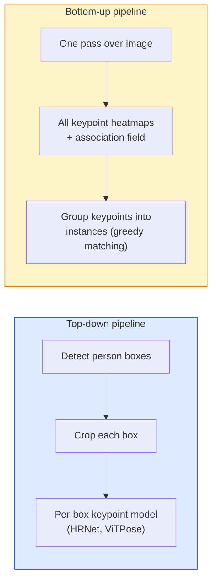

# Детекция ключевых точек и оценка позы

> Поза - это набор упорядоченных ключевых точек. Детектор ключевых точек - это регрессор тепловых карт (heatmap). Все остальное - учет и сопоставление.

**Тип:** Сборка
**Языки:** Python
**Предварительные требования:** Фаза 4, урок 06 (детекция), фаза 4, урок 07 (U-Net)
**Время:** ~45 минут

## Цели обучения

- Различать top-down и bottom-up оценку позы и объяснять, когда используется каждый подход
- Регрессировать тепловые карты для K ключевых точек с целевой разметкой в виде одной гауссианы на ключевую точку и извлекать координаты ключевых точек при инференсе
- Объяснять Part Affinity Fields (PAFs) и то, как bottom-up конвейеры связывают ключевые точки в экземпляры
- Использовать MediaPipe Pose или MMPose для production-оценки ключевых точек и понимать формат их выходных данных

## Задача

Задачи с ключевыми точками скрываются под множеством названий: поза человека (17 суставов тела), лицевые ориентиры (68 или 478 точек), кисть (21 точка), поза животного, поза робототехнического объекта, анатомические ориентиры в медицине. У всех них одна и та же структура: обнаружить K дискретных точек на объекте и выдать их координаты (x, y).

Оценка позы лежит в основе захвата движения, фитнес-приложений, спортивной аналитики, управления жестами, анимации, AR-примерки и роботизированного захвата. Случай 2D уже зрелый; 3D-поза (оценка положений суставов в мировых координатах по одной камере) остается текущим фронтиром исследований.

Инженерный вопрос - масштаб. Поза одного человека на одном изображении - задача на 20ms. Многоперсонная поза в толпе при 30 fps - другая задача с другими архитектурами.

## Концепция

### Top-down vs bottom-up (сверху вниз vs снизу вверх)



- **Top-down** - сначала обнаружить людей, затем запустить модель ключевых точек для каждого человека на каждом crop. Самая высокая точность; масштабируется линейно по числу людей.
- **Bottom-up** - один прямой проход предсказывает все ключевые точки плюс поле ассоциаций; затем они группируются. Постоянное время независимо от размера толпы.

Top-down (HRNet, ViTPose) лидирует по точности; bottom-up (OpenPose, HigherHRNet) лидирует по пропускной способности для сцен с толпой.

### Регрессия тепловых карт

Вместо прямой регрессии `(x, y)` предсказывайте тепловую карту `H x W` для каждой ключевой точки с гауссовым пятном, центрированным в истинном положении.

```
target[k, y, x] = exp(-((x - cx_k)^2 + (y - cy_k)^2) / (2 sigma^2))
```

При инференсе argmax каждой тепловой карты является предсказанным положением ключевой точки.

Почему тепловые карты работают лучше прямой регрессии: пространственная структура сети (сверточная карта признаков) естественно согласуется с пространственным выходом. Гауссовы цели также регуляризуют - небольшая ошибка локализации дает небольшую потерю, а не ноль.

### Субпиксельная локализация

Argmax дает целочисленные координаты. Для субпиксельной точности уточните результат, подгоняя параболу к argmax и его соседям, или используйте известное направление смещения `(dx, dy) = 0.25 * (heatmap[y, x+1] - heatmap[y, x-1], ...)`.

### Part Affinity Fields (PAFs, поля сродства частей)

Прием OpenPose для bottom-up ассоциации. Для каждой пары соединенных ключевых точек (например, от левого плеча до левого локтя) предсказывается 2-канальное поле, кодирующее единичный вектор, направленный от одной точки к другой. Чтобы связать плечо с локтем, PAF интегрируют вдоль линии, соединяющей пары кандидатов; сопоставляется пара с наибольшим интегралом.

```
For each connection (limb):
  PAF channels: 2 (unit vector x, y)
  Line integral: sum over sample points of (PAF . line_direction)
  Higher integral = stronger match
```

Элегантно и масштабируется на произвольные размеры толпы без crop для каждого человека.

### Ключевые точки COCO

Стандартный датасет для позы тела: 17 ключевых точек на человека, метрики PCK (Percentage of Correct Keypoints) и OKS (Object Keypoint Similarity). OKS - аналог IoU для ключевых точек, и именно его сообщает COCO mAP@OKS.

### 2D vs 3D

- **2D-поза** - координаты изображения; решена на production-уровне качества (MediaPipe, HRNet, ViTPose).
- **3D-поза** - мировые координаты / координаты камеры; все еще активная область исследований. Распространенные подходы:
  - Поднять 2D-предсказания в 3D с помощью небольшой MLP (VideoPose3D).
  - Прямая 3D-регрессия по изображению (PyMAF, MHFormer).
  - Многовидовые установки (CMU Panoptic) для ground truth.

## Соберите это

### Шаг 1: Целевая гауссова тепловая карта

```python
import numpy as np
import torch

def gaussian_heatmap(size, cx, cy, sigma=2.0):
    yy, xx = np.meshgrid(np.arange(size), np.arange(size), indexing="ij")
    return np.exp(-((xx - cx) ** 2 + (yy - cy) ** 2) / (2 * sigma ** 2)).astype(np.float32)

hm = gaussian_heatmap(64, 32, 32, sigma=2.0)
print(f"peak: {hm.max():.3f} at ({hm.argmax() % 64}, {hm.argmax() // 64})")
```

Тепловые карты для отдельных ключевых точек, сложенные вдоль оси каналов, дают полный целевой тензор.

### Шаг 2: Маленькая головка ключевых точек

Модель в стиле U-Net, которая выводит K каналов тепловых карт.

```python
import torch.nn as nn
import torch.nn.functional as F

class TinyKeypointNet(nn.Module):
    def __init__(self, num_keypoints=4, base=16):
        super().__init__()
        self.down1 = nn.Sequential(nn.Conv2d(3, base, 3, 2, 1), nn.ReLU(inplace=True))
        self.down2 = nn.Sequential(nn.Conv2d(base, base * 2, 3, 2, 1), nn.ReLU(inplace=True))
        self.mid = nn.Sequential(nn.Conv2d(base * 2, base * 2, 3, 1, 1), nn.ReLU(inplace=True))
        self.up1 = nn.ConvTranspose2d(base * 2, base, 2, 2)
        self.up2 = nn.ConvTranspose2d(base, num_keypoints, 2, 2)

    def forward(self, x):
        h1 = self.down1(x)
        h2 = self.down2(h1)
        h3 = self.mid(h2)
        u1 = self.up1(h3)
        return self.up2(u1)
```

Вход `(N, 3, H, W)`, выход `(N, K, H, W)`. Функция потерь - попиксельная MSE относительно гауссовых целей.

### Шаг 3: Инференс - извлечение координат ключевых точек

```python
def heatmap_to_coords(heatmaps):
    """
    heatmaps: (N, K, H, W)
    returns:  (N, K, 2) float coordinates in image pixels
    """
    N, K, H, W = heatmaps.shape
    hm = heatmaps.reshape(N, K, -1)
    idx = hm.argmax(dim=-1)
    ys = (idx // W).float()
    xs = (idx % W).float()
    return torch.stack([xs, ys], dim=-1)

coords = heatmap_to_coords(torch.randn(2, 4, 32, 32))
print(f"coords: {coords.shape}")  # (2, 4, 2)
```

Одна строка при инференсе. Для субпиксельного уточнения интерполируйте вокруг argmax.

### Шаг 4: Синтетический датасет ключевых точек

Просто: нарисуйте четыре точки на белом холсте и научитесь их предсказывать.

```python
def make_synthetic_sample(size=64):
    img = np.ones((3, size, size), dtype=np.float32)
    rng = np.random.default_rng()
    kps = rng.integers(8, size - 8, size=(4, 2))
    for cx, cy in kps:
        img[:, cy - 2:cy + 2, cx - 2:cx + 2] = 0.0
    hms = np.stack([gaussian_heatmap(size, cx, cy) for cx, cy in kps])
    return img, hms, kps
```

Достаточно просто, чтобы маленькая модель выучила это за минуту.

### Шаг 5: Обучение

```python
model = TinyKeypointNet(num_keypoints=4)
opt = torch.optim.Adam(model.parameters(), lr=3e-3)

for step in range(200):
    batch = [make_synthetic_sample() for _ in range(16)]
    imgs = torch.from_numpy(np.stack([b[0] for b in batch]))
    hms = torch.from_numpy(np.stack([b[1] for b in batch]))
    pred = model(imgs)
    # Upsample pred to full resolution
    pred = F.interpolate(pred, size=hms.shape[-2:], mode="bilinear", align_corners=False)
    loss = F.mse_loss(pred, hms)
    opt.zero_grad(); loss.backward(); opt.step()
```

## Используйте это

- **MediaPipe Pose** - production-оценщик позы от Google; поставляет WebGL + мобильные runtime с задержкой меньше 10ms.
- **MMPose** (OpenMMLab) - полноценная исследовательская кодовая база; все SOTA-архитектуры с предобученными весами.
- **YOLOv8-pose** - самая быстрая real-time многоперсонная поза с одним прямым проходом.
- **transformers HumanDPT / PoseAnything** - более новые vision-language подходы для open-vocabulary позы (любой объект, любой набор ключевых точек).

## Доведите до поставки

Этот урок создает:

- `outputs/prompt-pose-stack-picker.md` - prompt, который выбирает MediaPipe / YOLOv8-pose / HRNet / ViTPose с учетом задержки, размера толпы и потребности в 2D vs 3D.
- `outputs/skill-heatmap-to-coords.md` - skill, который пишет процедуру субпиксельного преобразования тепловой карты в координаты, используемую каждой production-моделью позы.

## Упражнения

1. **(Легко)** Обучите маленькую модель ключевых точек на синтетическом датасете с 4 точками. Сообщите среднюю L2-ошибку между предсказанными и истинными ключевыми точками после 200 шагов.
2. **(Средне)** Добавьте субпиксельное уточнение: по позиции argmax подгоните 1D-параболу вдоль x и y по соседним пикселям. Сообщите прирост точности по сравнению с целочисленным argmax.
3. **(Сложно)** Постройте синтетический датасет с 2 людьми, где каждое изображение показывает два экземпляра паттерна из 4 ключевых точек. Обучите bottom-up конвейер с PAF, которые предсказывают, какая ключевая точка принадлежит какому экземпляру, и оцените OKS.

## Ключевые термины

| Термин | Как говорят | Что это на самом деле значит |
|------|----------------|----------------------|
| Keypoint | "Ориентир" | Конкретная упорядоченная точка на объекте (сустав, угол, признак) |
| Pose | "Скелет" | Упорядоченный набор ключевых точек, принадлежащих одному экземпляру |
| Top-down | "Сначала детекция, потом поза" | Двухэтапный конвейер: детектор людей + модель ключевых точек для каждого crop; самая высокая точность |
| Bottom-up | "Сначала поза, группировка потом" | Однопроходное предсказание всех ключевых точек + группировка; постоянное время по размеру толпы |
| Heatmap | "Гауссова цель" | Тензор H x W для каждой ключевой точки с пиком в истинном положении; предпочтительная цель регрессии |
| PAF | "Part Affinity Field" | 2-канальное поле единичных векторов, кодирующее направления конечностей; используется для группировки ключевых точек в экземпляры |
| OKS | "Keypoint IoU" | Object Keypoint Similarity; метрика COCO для позы |
| HRNet | "High-Resolution Net" | Доминирующая top-down архитектура ключевых точек; сохраняет признаки высокого разрешения на всем протяжении |

## Дополнительное чтение

- [OpenPose (Cao et al., 2017)](https://arxiv.org/abs/1812.08008) - bottom-up с PAF; все еще лучшее описание этого подхода
- [HRNet (Sun et al., 2019)](https://arxiv.org/abs/1902.09212) - эталонная top-down архитектура
- [ViTPose (Xu et al., 2022)](https://arxiv.org/abs/2204.12484) - обычный ViT как backbone для позы; текущий SOTA на многих бенчмарках
- [MediaPipe Pose](https://developers.google.com/mediapipe/solutions/vision/pose_landmarker) - production real-time поза; самый быстрый развернутый стек в 2026 году
