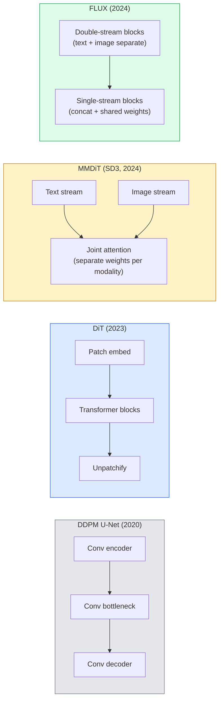

# Диффузионные трансформеры (Diffusion Transformers) и Rectified Flow

> U-Net не является секретом диффузии. Замените его трансформером, поменяйте расписание шума на прямолинейный поток, и внезапно у вас есть SD3, FLUX и каждая text-to-image модель 2026 года.

**Тип:** Изучение + сборка
**Языки:** Python
**Предварительные требования:** Phase 4 Lesson 10 (Diffusion DDPM), Phase 4 Lesson 14 (ViT), Phase 7 Lesson 02 (Self-Attention)
**Время:** ~75 минут

## Цели обучения

- Проследить эволюцию от U-Net DDPM (Lesson 10) к Diffusion Transformer (DiT), MMDiT (SD3) и single+double-stream DiT (FLUX)
- Объяснить rectified flow: почему прямолинейная траектория между шумом и данными позволяет моделям сэмплировать за 20 шагов вместо 1000
- Реализовать маленький DiT-блок и цикл обучения rectified-flow, оба меньше чем в 100 строк
- Различать варианты моделей (SD3, FLUX.1-dev, FLUX.1-schnell, Z-Image, Qwen-Image) по архитектуре, числу параметров и лицензированию

## Проблема

В Lesson 10 был построен DDPM с U-Net-денойзером. Этот рецепт доминировал в 2020-2023 годах: U-Net + beta schedule + noise-prediction loss. Он дал Stable Diffusion 1.5 и 2.1, а также DALL-E 2.

Каждая современная text-to-image модель 2026 года уже ушла дальше. Stable Diffusion 3, FLUX, SD4, Z-Image, Qwen-Image, Hunyuan-Image — ни одна не использует U-Net. Они используют Diffusion Transformers (DiT). SD3 и FLUX также заменяют расписание шума DDPM на rectified flow, который выпрямляет путь от шума к данным и делает возможным инференс за 1-4 шага с consistency-вариантами или дистиллированными вариантами.

Этот сдвиг важен, потому что именно он сделал генерацию изображений на основе диффузии управляемой, точной к промпту (SD3/SD4 решили отрисовку текста) и достаточно быстрой для продакшена. Понимание DiT + rectified flow означает понимание стека генеративных изображений 2026 года.

## Концепция

### От U-Net к трансформеру



- **DiT** (Peebles & Xie, 2023) — замена U-Net на ViT-подобный трансформер поверх латентных патчей. Условная информация подается через adaptive layer norm (AdaLN).
- **MMDiT** (SD3, Esser et al., 2024) — два потока с отдельными весами для текстовых и изображенческих токенов, которые используют общий joint attention.
- **FLUX** (Black Forest Labs, 2024) — первые N блоков double-stream, как в SD3; более поздние блоки конкатенируют токены и используют общие веса (single-stream) для эффективности на большей глубине.
- **Z-Image** (2025) — эффективный single-stream DiT на 6B параметров, который бросает вызов подходу "scale at all costs".

### Rectified flow в одном абзаце

DDPM задает прямой процесс как шумное SDE, где `x_t` все сильнее зашумляется. Выученный обратный процесс — второе SDE, решаемое 1000 малыми шагами.

Rectified flow задает **прямолинейную** интерполяцию между чистыми данными и чистым шумом:

```
x_t = (1 - t) * x_0 + t * epsilon,     t in [0, 1]
```

Обучите сеть предсказывать скорость `v_theta(x_t, t) = epsilon - x_0` — прямое направление вдоль прямолинейного пути от чистых данных к шуму (`dx_t/dt`). Во время сэмплирования вы интегрируете эту скорость назад, чтобы идти от шума к данным. Получившееся ODE гораздо ближе к прямой линии, поэтому для сэмплирования нужно намного меньше шагов интегрирования.

SD3 называет это **Rectified Flow Matching**. FLUX, Z-Image и большинство моделей 2026 года используют ту же целевую функцию. Типичный инференс: 20-30 шагов Euler (детерминированно) против 50+ шагов DDIM в старом режиме DDPM. Distilled / turbo / schnell / LCM-варианты снижают это до 1-4 шагов.

### Обусловливание AdaLN

DiT подают условную информацию по timestep и class/text через **adaptive layer norm**: предсказывают `scale` и `shift` из вектора условий и применяют их после LayerNorm. Это намного чище, чем FiLM-style модуляция в U-Net, и является стандартом по умолчанию в каждом современном DiT.

```
cond -> MLP -> (scale, shift, gate)
norm(x) * (1 + scale) + shift, then residual add * gate
```

### Текстовые энкодеры в SD3 и FLUX

- **SD3** использует три текстовых энкодера: две модели CLIP + T5-XXL. Эмбеддинги конкатенируются и подаются в поток изображения как текстовое условие.
- **FLUX** использует один CLIP-L + T5-XXL.
- **Qwen-Image / Z-Image** варианты используют собственные внутренние текстовые энкодеры, выровненные с их базовыми LLM.

Текстовый энкодер — большая часть причины, по которой SD3/FLUX рассуждают о промптах намного лучше, чем SD1.5. Один только T5-XXL имеет 4.7B параметров.

### Classifier-free guidance по-прежнему работает

Rectified flow меняет сэмплер, а не условную информацию. Classifier-free guidance (сбрасывать текст с вероятностью 10% во время обучения, смешивать условные и безусловные предсказания на инференсе) работает с rectified flow точно так же. Большинство моделей 2026 года используют guidance scale 3.5-5 — ниже, чем 7.5 у SD1.5, потому что rectified-flow модели по умолчанию точнее следуют промптам.

### Consistency, Turbo, Schnell, LCM

Четыре названия одной идеи: дистиллировать медленную многошаговую модель в быструю малошаговую модель.

- **LCM (Latent Consistency Model)** — обучить студента, который предсказывает финальный `x_0` из любого промежуточного `x_t` за один шаг.
- **SDXL Turbo / FLUX schnell** — модели на 1-4 шага, обученные с adversarial diffusion distillation.
- **SD Turbo** — OpenAI-style Consistency Models, адаптированные к latent diffusion.

Продакшен-сервинг любой новой модели поставляет и "full quality" checkpoint, и "turbo / schnell" вариант. Schnell ("быстро" по-немецки, соглашение Black Forest Labs) работает за 1-4 шага и подходит для real-time пайплайнов.

### Ландшафт моделей в 2026 году

| Модель | Размер | Архитектура | Лицензия |
|-------|------|--------------|---------|
| Stable Diffusion 3 Medium | 2B | MMDiT | SAI Community |
| Stable Diffusion 3.5 Large | 8B | MMDiT | SAI Community |
| FLUX.1-dev | 12B | Double + Single Stream DiT | non-commercial |
| FLUX.1-schnell | 12B | то же, дистиллированная | Apache 2.0 |
| FLUX.2 | — | итерация FLUX.1 | mixed |
| Z-Image | 6B | S3-DiT (Scalable Single-Stream) | permissive |
| Qwen-Image | ~20B | DiT + текстовая башня Qwen | Apache 2.0 |
| Hunyuan-Image-3.0 | ~80B | DiT | research |
| SD4 Turbo | 3B | DiT + distillation | SAI Commercial |

FLUX.1-schnell — open-source стандарт 2026 года по умолчанию. Z-Image — лидер по эффективности. FLUX.2 и SD4 — текущие вершины качества.

### Почему этот фазовый сдвиг важен

DDPM + U-Net работали. DiT + rectified flow работают **лучше, быстрее и масштабируются чище**. Переход похож на переход от RNN к трансформерам в NLP: обе архитектуры решали одну и ту же задачу, но трансформеры масштабировались и теперь доминируют. Каждая статья 2026 года по генерации изображений, видео или 3D использует DiT-образный денойзер и обычно целевую функцию rectified flow. U-Net DDPM теперь в основном педагогический материал (Lesson 10).

## Соберите это

### Шаг 1: DiT-блок с AdaLN

```python
import torch
import torch.nn as nn


class AdaLNZero(nn.Module):
    """
    Adaptive LayerNorm with a gate. Predicts (scale, shift, gate) from the conditioning.
    Init such that the whole block starts as identity ("zero init").
    """

    def __init__(self, dim, cond_dim):
        super().__init__()
        self.norm = nn.LayerNorm(dim, elementwise_affine=False)
        self.mlp = nn.Linear(cond_dim, dim * 3)
        nn.init.zeros_(self.mlp.weight)
        nn.init.zeros_(self.mlp.bias)

    def forward(self, x, cond):
        scale, shift, gate = self.mlp(cond).chunk(3, dim=-1)
        h = self.norm(x) * (1 + scale.unsqueeze(1)) + shift.unsqueeze(1)
        return h, gate.unsqueeze(1)


class DiTBlock(nn.Module):
    def __init__(self, dim=192, heads=3, mlp_ratio=4, cond_dim=192):
        super().__init__()
        self.adaln1 = AdaLNZero(dim, cond_dim)
        self.attn = nn.MultiheadAttention(dim, heads, batch_first=True)
        self.adaln2 = AdaLNZero(dim, cond_dim)
        self.mlp = nn.Sequential(
            nn.Linear(dim, dim * mlp_ratio),
            nn.GELU(),
            nn.Linear(dim * mlp_ratio, dim),
        )

    def forward(self, x, cond):
        h, gate1 = self.adaln1(x, cond)
        a, _ = self.attn(h, h, h, need_weights=False)
        x = x + gate1 * a
        h, gate2 = self.adaln2(x, cond)
        x = x + gate2 * self.mlp(h)
        return x
```

`AdaLNZero` стартует как тождественное отображение, потому что веса его MLP инициализированы нулями. Обучение сдвигает блок от тождества; это резко стабилизирует глубокие трансформерные диффузионные модели.

### Шаг 2: Маленький DiT

```python
def timestep_embedding(t, dim):
    import math
    half = dim // 2
    freqs = torch.exp(-math.log(10000) * torch.arange(half, device=t.device) / half)
    args = t[:, None].float() * freqs[None]
    return torch.cat([args.sin(), args.cos()], dim=-1)


class TinyDiT(nn.Module):
    def __init__(self, image_size=16, patch_size=2, in_channels=3, dim=96, depth=4, heads=3):
        super().__init__()
        self.patch_size = patch_size
        self.num_patches = (image_size // patch_size) ** 2
        self.patch = nn.Conv2d(in_channels, dim, kernel_size=patch_size, stride=patch_size)
        self.pos = nn.Parameter(torch.zeros(1, self.num_patches, dim))
        self.time_mlp = nn.Sequential(
            nn.Linear(dim, dim * 2),
            nn.SiLU(),
            nn.Linear(dim * 2, dim),
        )
        self.blocks = nn.ModuleList([DiTBlock(dim, heads, cond_dim=dim) for _ in range(depth)])
        self.norm_out = nn.LayerNorm(dim, elementwise_affine=False)
        self.head = nn.Linear(dim, patch_size * patch_size * in_channels)

    def forward(self, x, t):
        n = x.size(0)
        x = self.patch(x)
        x = x.flatten(2).transpose(1, 2) + self.pos
        t_emb = self.time_mlp(timestep_embedding(t, self.pos.size(-1)))
        for blk in self.blocks:
            x = blk(x, t_emb)
        x = self.norm_out(x)
        x = self.head(x)
        return self._unpatchify(x, n)

    def _unpatchify(self, x, n):
        p = self.patch_size
        h = w = int(self.num_patches ** 0.5)
        x = x.view(n, h, w, p, p, -1).permute(0, 5, 1, 3, 2, 4).reshape(n, -1, h * p, w * p)
        return x
```

### Шаг 3: Обучение rectified flow

```python
import torch.nn.functional as F

def rectified_flow_train_step(model, x0, optimizer, device):
    model.train()
    x0 = x0.to(device)
    n = x0.size(0)
    t = torch.rand(n, device=device)
    epsilon = torch.randn_like(x0)
    x_t = (1 - t[:, None, None, None]) * x0 + t[:, None, None, None] * epsilon

    target_velocity = epsilon - x0
    pred_velocity = model(x_t, t)

    loss = F.mse_loss(pred_velocity, target_velocity)
    optimizer.zero_grad()
    loss.backward()
    optimizer.step()
    return loss.item()
```

Сравните с DDPM noise-prediction loss (Lesson 10): та же структура, другая цель. Вместо предсказания шума `epsilon` мы предсказываем **скорость** `epsilon - x_0`, которая указывает от данных к шуму вдоль прямолинейной интерполяции.

### Шаг 4: Euler sampler

Rectified flow — это ODE. Метод Euler — самый простой и, для хорошо обученной rectified-flow модели, почти такой же точный, как решатели более высокого порядка при 20+ шагах.

```python
@torch.no_grad()
def rectified_flow_sample(model, shape, steps=20, device="cpu"):
    model.eval()
    x = torch.randn(shape, device=device)
    dt = 1.0 / steps
    t = torch.ones(shape[0], device=device)
    for _ in range(steps):
        v = model(x, t)
        x = x - dt * v
        t = t - dt
    return x
```

20 шагов. На обученной модели это дает сэмплы, сопоставимые с 1000-step DDPM.

### Шаг 5: Сквозной smoke test

```python
import numpy as np

def synthetic_blobs(num=200, size=16, seed=0):
    rng = np.random.default_rng(seed)
    out = np.zeros((num, 3, size, size), dtype=np.float32)
    yy, xx = np.meshgrid(np.arange(size), np.arange(size), indexing="ij")
    for i in range(num):
        cx, cy = rng.uniform(4, size - 4, size=2)
        r = rng.uniform(2, 4)
        mask = (xx - cx) ** 2 + (yy - cy) ** 2 < r ** 2
        colour = rng.uniform(-1, 1, size=3)
        for c in range(3):
            out[i, c][mask] = colour[c]
    return torch.from_numpy(out)
```

Обучите `TinyDiT` на этом с rectified flow. После 500 шагов сгенерированные выходы должны выглядеть как слабые цветные пятна.

## Используйте это

Для реальной генерации изображений с FLUX / SD3 / Z-Image, `diffusers` поставляет каждую из них с унифицированным API:

```python
from diffusers import FluxPipeline, StableDiffusion3Pipeline
import torch

pipe = FluxPipeline.from_pretrained(
    "black-forest-labs/FLUX.1-schnell",
    torch_dtype=torch.bfloat16,
).to("cuda")

out = pipe(
    prompt="a golden retriever surfing a tsunami, hyperrealistic, studio lighting",
    guidance_scale=0.0,           # schnell was trained without CFG
    num_inference_steps=4,
    max_sequence_length=256,
).images[0]
out.save("surf.png")
```

Три строки. `FLUX.1-schnell` за четыре шага. Замените model id на `black-forest-labs/FLUX.1-dev` для более высокого качества за 20-30 шагов с CFG.

Для SD3:

```python
pipe = StableDiffusion3Pipeline.from_pretrained(
    "stabilityai/stable-diffusion-3.5-large",
    torch_dtype=torch.bfloat16,
).to("cuda")
out = pipe(prompt, guidance_scale=3.5, num_inference_steps=28).images[0]
```

## Доведите до результата

Этот урок создает:

- `outputs/prompt-dit-model-picker.md` — выбирает между SD3, FLUX.1-dev, FLUX.1-schnell, Z-Image, SD4 Turbo с учетом ограничений качества, задержки и лицензии.
- `outputs/skill-rectified-flow-trainer.md` — пишет полный цикл обучения для rectified flow с AdaLN DiT и Euler sampling.

## Упражнения

1. **(Легко)** Обучите приведенный выше TinyDiT на синтетическом датасете пятен в течение 500 шагов. Сравните сэмплы, полученные с 10, 20 и 50 шагами Euler.
2. **(Средне)** Добавьте текстовое условие, конкатенировав обучаемый class embedding с time embedding (10 "классов" пятен по цвету). Сэмплируйте с классами 0, 5 и 9 и проверьте, что цвета совпадают.
3. **(Сложно)** Вычислите расстояние Fréchet (FID proxy) между сгенерированными сэмплами из rectified-flow и DDPM версий сети одинакового размера, обученных на одних и тех же данных одинаковое число шагов. Сообщите, какая сходится быстрее.

## Ключевые термины

| Термин | Как обычно говорят | Что это на самом деле означает |
|------|----------------|----------------------|
| DiT | "Diffusion transformer" | Трансформер, который заменяет U-Net как диффузионный денойзер; работает с patchified латентами |
| AdaLN | "Adaptive layer norm" | Условная информация по timestep/text через обучаемые scale, shift, gate, применяемые после LayerNorm; стандарт в каждом современном DiT |
| MMDiT | "Multi-modal DiT (SD3)" | Отдельные потоки весов для текстовых и изображенческих токенов, которые используют общий joint self-attention |
| Single-stream / double-stream | "FLUX trick" | Первые N блоков double-stream (отдельные веса на модальность), более поздние блоки single-stream (concat + shared weights) для эффективности |
| Rectified flow | "Straight-line noise-to-data" | Линейная интерполяция между данными и шумом; сеть предсказывает скорость; на инференсе нужно меньше шагов ODE |
| Velocity target | "epsilon - x_0" | Цель регрессии в rectified flow; указывает от чистых данных к шуму |
| CFG guidance | "classifier-free guidance" | Смешивание условных и безусловных предсказаний; все еще используется в rectified-flow моделях |
| Schnell / turbo / LCM | "1-4 step distillation" | Малошаговые варианты, дистиллированные из full-quality моделей; real-time для продакшена |

## Дополнительное чтение

- [Scalable Diffusion Models with Transformers (Peebles & Xie, 2023)](https://arxiv.org/abs/2212.09748) — статья о DiT
- [Scaling Rectified Flow Transformers (Esser et al., SD3 paper)](https://arxiv.org/abs/2403.03206) — MMDiT и rectified-flow в масштабе
- [FLUX.1 model card and technical report (Black Forest Labs)](https://huggingface.co/black-forest-labs/FLUX.1-dev) — детали double + single-stream
- [Z-Image: Efficient Image Generation Foundation Model (2025)](https://arxiv.org/html/2511.22699v1) — single-stream DiT на 6B
- [Elucidating the Design Space of Diffusion (Karras et al., 2022)](https://arxiv.org/abs/2206.00364) — референс по каждому design trade-off в диффузии
- [Latent Consistency Models (Luo et al., 2023)](https://arxiv.org/abs/2310.04378) — как LCM-LoRA дает инференс за 4 шага
