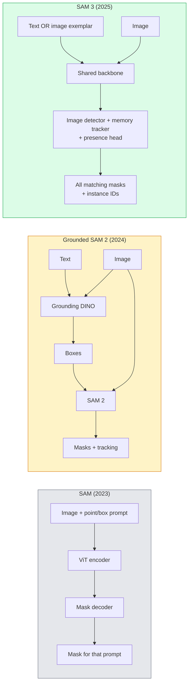

# SAM 3 & сегментация с открытым словарем (Open-Vocabulary Segmentation)

> Дайте модели текстовый промпт и изображение - и получите маски для каждого подходящего объекта. SAM 3 свел это к одному прямому проходу.

**Тип:** Использование + сборка
**Языки:** Python
**Предварительные требования:** Фаза 4 Урок 07 (U-Net), Фаза 4 Урок 08 (Mask R-CNN), Фаза 4 Урок 18 (CLIP)
**Время:** ~60 минут

## Цели обучения

- Различать SAM (только визуальные промпты), Grounded SAM / SAM 2 (детектор + SAM) и SAM 3 (нативные текстовые промпты через Promptable Concept Segmentation)
- Объяснять архитектуру SAM 3: общий backbone + детектор изображений + видеотрекер на основе памяти + presence head + разделенная схема detector-tracker
- Использовать интеграцию SAM 3 в Hugging Face `transformers` для детекции, сегментации и видеотрекинга по текстовому промпту
- Выбирать между SAM 3, Grounded SAM 2, YOLO-World и SAM-MI на основе задержки, сложности концепта и целевой среды развертывания

## Проблема

SAM 2023 года был моделью только для визуальных промптов: вы кликаете точку или рисуете рамку, а он возвращает маску. Для запроса "покажи мне все апельсины на этой фотографии" был нужен детектор (Grounding DINO), который выдавал рамки, а затем SAM сегментировал каждую из них. Grounded SAM превратил это в пайплайн, но это был каскад из двух замороженных моделей с неизбежным накоплением ошибок.

SAM 3 (Meta, ноябрь 2025, ICLR 2026) схлопнул этот каскад. Он принимает в качестве промпта короткую именную фразу или визуальный пример и возвращает все подходящие маски и ID экземпляров за один прямой проход. Это и есть **Promptable Concept Segmentation (PCS)**. В сочетании с обновлением Object Multiplex от марта 2026 года (SAM 3.1) он эффективно отслеживает несколько экземпляров одного и того же концепта в видео.

Этот урок о структурном сдвиге, который это представляет. 2D-сегментация, детекция и привязка текста к изображению объединились в одну модель. Производственный вопрос теперь не "какой пайплайн мне сцепить", а "какая promptable-модель обрабатывает мой сценарий от начала до конца".

## Концепция

### Три поколения



### Promptable Concept Segmentation

"Концептный промпт" (concept prompt) - это короткая именная фраза (`"yellow school bus"`, `"striped red umbrella"`, `"hand holding a mug"`) или визуальный пример. Модель возвращает сегментационные маски для каждого экземпляра на изображении, который соответствует концепту, плюс уникальный ID экземпляра для каждого совпадения.

Это отличается от классического SAM с визуальными промптами тремя способами:

1. Не требуется промпт для каждого экземпляра - один текстовый промпт возвращает все совпадения.
2. Открытый словарь (open-vocabulary) - концептом может быть все, что описывается естественным языком.
3. Возвращает несколько экземпляров сразу, а не одну маску на промпт.

### Ключевые архитектурные компоненты

- **Общий backbone** - один ViT обрабатывает изображение. И голова детектора, и трекер на основе памяти читают из него признаки.
- **Presence head** - предсказывает, присутствует ли концепт на изображении вообще. Отделяет "это здесь есть?" от "где это находится?". Снижает число ложноположительных срабатываний для отсутствующих концептов.
- **Разделенный detector-tracker** - детекция на уровне изображения и трекинг на уровне видео имеют отдельные головы, поэтому они не мешают друг другу.
- **Банк памяти (memory bank)** - хранит признаки для каждого экземпляра между кадрами для видеотрекинга (тот же механизм, который использовал SAM 2).

### Обучение в масштабе

SAM 3 был обучен на **4 миллионах уникальных концептов**, сгенерированных движком данных, который итеративно аннотирует и исправляет данные с помощью ИИ + проверки человеком. Новый **бенчмарк SA-CO** содержит 270K уникальных концептов, что в 50 раз больше предыдущих бенчмарков. SAM 3 достигает 75-80% человеческого качества на SA-CO и вдвое превосходит существующие системы на PCS для изображений + видео.

### SAM 3.1 Object Multiplex

Обновление от марта 2026 года: **Object Multiplex** вводит механизм общей памяти для совместного трекинга большого числа экземпляров одного и того же концепта одновременно. Раньше трекинг N экземпляров означал N отдельных банков памяти. Multiplex сводит это к одной общей памяти с запросами для отдельных экземпляров. Результат: существенно более быстрый multi-object tracking без потери точности.

### Где Grounded SAM все еще важен в 2026 году

- Когда вам нужно подставить конкретный open-vocabulary-детектор (DINO-X, Florence-2).
- Когда лицензия SAM 3 (закрытая за gated-доступом на HF) является блокером.
- Когда вам нужен больший контроль над порогом детектора, чем предоставляет SAM 3.
- Для исследований / абляций компонента детектора.

Модульные пайплайны все еще имеют свое место. Для большинства production-задач SAM 3 - более простой ответ.

### YOLO-World vs SAM 3

- **YOLO-World** - только open-vocabulary-детектор (без масок). Работает в реальном времени. Лучший вариант, когда нужны рамки при высокой частоте кадров.
- **SAM 3** - полная сегментация + трекинг. Медленнее, но выдает более богатый результат.

Production-разделение: YOLO-World для быстрых пайплайнов только с детекцией (робототехническая навигация, быстрые дашборды), SAM 3 для всего, где нужны маски или трекинг.

### Эффективность SAM-MI

SAM-MI (2025-2026) решает проблему узкого места в декодере SAM. Ключевые идеи:

- **Разреженные точечные промпты (sparse point prompting)** - использует несколько хорошо выбранных точек вместо плотных промптов; сокращает число вызовов декодера на 96%.
- **Неглубокая агрегация масок (shallow mask aggregation)** - объединяет грубые предсказания масок в одну более четкую маску.
- **Разделенная инъекция маски (decoupled mask injection)** - декодер получает заранее вычисленные признаки маски вместо повторного запуска.

Результат: ускорение примерно в 1.6x по сравнению с Grounded-SAM на open-vocabulary-бенчмарках.

### Формат выхода для трех моделей

Все возвращают одну и ту же общую структуру (рамки + метки + оценки + маски + ID), что удобно: вашему downstream-пайплайну не нужно ветвиться в зависимости от того, какая модель была запущена.

## Соберите это

### Шаг 1: Конструирование промпта

Создайте вспомогательную функцию, которая превращает пользовательское предложение в список концептных промптов SAM 3. Это граница, где "то, что ввел пользователь", встречается с "тем, что потребляет модель".

```python
def split_concepts(sentence):
    """
    Heuristic splitter for multi-concept prompts.
    Returns list of short noun phrases.
    """
    for sep in [",", ";", "and", "or", "&"]:
        if sep in sentence:
            parts = [p.strip() for p in sentence.replace("and ", ",").split(",")]
            return [p for p in parts if p]
    return [sentence.strip()]

print(split_concepts("cats, dogs and balloons"))
```

SAM 3 принимает один концепт за один прямой проход; для multi-concept-запросов используйте цикл или батчинг.

### Шаг 2: Вспомогательные функции постобработки

Преобразуйте сырые выходы SAM 3 в чистый список детекций, соответствующий контракту пайплайна из Фазы 4 Урока 16.

```python
from dataclasses import dataclass
from typing import List

@dataclass
class ConceptDetection:
    concept: str
    instance_id: int
    box: tuple          # (x1, y1, x2, y2)
    score: float
    mask_rle: str       # run-length encoded


def rle_encode(binary_mask):
    flat = binary_mask.flatten().astype("uint8")
    runs = []
    prev, count = flat[0], 0
    for v in flat:
        if v == prev:
            count += 1
        else:
            runs.append((int(prev), count))
            prev, count = v, 1
    runs.append((int(prev), count))
    return ";".join(f"{v}x{c}" for v, c in runs)
```

RLE сохраняет payload-ы ответов маленькими даже при большом количестве масок высокого разрешения. Тот же формат работает для SAM 2, SAM 3 и Grounded SAM 2.

### Шаг 3: Единый интерфейс open-vocab-сегментации

Оберните любой имеющийся backend (SAM 3, Grounded SAM 2, YOLO-World + SAM 2) за одним методом. Ваш downstream-код не меняется при смене backend.

```python
from abc import ABC, abstractmethod
import numpy as np

class OpenVocabSeg(ABC):
    @abstractmethod
    def detect(self, image: np.ndarray, concept: str) -> List[ConceptDetection]:
        ...


class StubOpenVocabSeg(OpenVocabSeg):
    """
    Deterministic stub used for pipeline testing when real models are not loaded.
    """
    def detect(self, image, concept):
        h, w = image.shape[:2]
        return [
            ConceptDetection(
                concept=concept,
                instance_id=0,
                box=(w * 0.2, h * 0.3, w * 0.5, h * 0.8),
                score=0.89,
                mask_rle="0x100;1x50;0x200",
            ),
            ConceptDetection(
                concept=concept,
                instance_id=1,
                box=(w * 0.55, h * 0.25, w * 0.85, h * 0.75),
                score=0.74,
                mask_rle="0x80;1x40;0x220",
            ),
        ]
```

Настоящий подкласс `SAM3OpenVocabSeg` оборачивал бы `transformers.Sam3Model` и `Sam3Processor`.

### Шаг 4: Использование Hugging Face SAM 3 (справочно)

Для фактической модели интеграция `transformers` выглядит так:

```python
from transformers import Sam3Processor, Sam3Model
import torch

processor = Sam3Processor.from_pretrained("facebook/sam3")
model = Sam3Model.from_pretrained("facebook/sam3").eval()

inputs = processor(images=pil_image, return_tensors="pt")
inputs = processor.set_text_prompt(inputs, "yellow school bus")

with torch.no_grad():
    outputs = model(**inputs)

masks = processor.post_process_masks(
    outputs.masks, inputs.original_sizes, inputs.reshaped_input_sizes
)
boxes = outputs.boxes
scores = outputs.scores
```

Один промпт - все совпадения возвращаются одним вызовом.

### Шаг 5: Измерьте, что Grounded SAM 2 давал вам бесплатно

Честный бенчмарк: что происходит, когда вы заменяете Grounded SAM 2 на SAM 3 в реальном пайплайне?

- Задержка: SAM 3 экономит один прямой проход (нет отдельного детектора), но сама модель тяжелее; обычно итог нейтрален или дает небольшое ускорение.
- Точность: SAM 3 существенно лучше на редких или композиционных концептах ("striped red umbrella"). Похожее качество на распространенных однословных концептах.
- Гибкость: Grounded SAM 2 позволяет заменять детекторы (DINO-X, Florence-2, Grounding DINO 1.5); SAM 3 монолитен.

Вывод: SAM 3 - стандартный выбор для open-vocab-сегментации в 2026 году. Grounded SAM 2 все еще правильный ответ, когда нужна гибкость детектора или другие лицензионные условия.

## Используйте это

Production-паттерны развертывания:

- **Разметка в реальном времени** - SAM 3 + функция CVAT label-as-text-prompt. Разметчики выбирают имя метки; SAM 3 предварительно размечает каждый подходящий экземпляр. Затем идет проверка и исправление.
- **Видеоаналитика** - SAM 3.1 Object Multiplex для multi-object tracking; подавайте кадры в трекер на основе памяти.
- **Робототехника** - SAM 3 для open-vocab-манипуляции ("подними красную чашку"); запускается как примитив планирования.
- **Медицинская визуализация** - SAM 3, дообученный на медицинских концептах; требует запроса доступа на HF.

Ultralytics оборачивает SAM 3 в своем Python-пакете:

```python
from ultralytics import SAM

model = SAM("sam3.pt")
results = model(image_path, prompts="yellow school bus")
```

Тот же интерфейс, что у YOLO и SAM 2.

## Отгрузите это

Этот урок создает:

- `outputs/prompt-open-vocab-stack-picker.md` - промпт, который выбирает SAM 3 / Grounded SAM 2 / YOLO-World / SAM-MI на основе задержки, сложности концепта и лицензирования.
- `outputs/skill-concept-prompt-designer.md` - навык, который превращает высказывания пользователя в корректно сформированные концептные промпты SAM 3 (разбиение, устранение неоднозначности, fallback-варианты).

## Упражнения

1. **(Легко)** Запустите SAM 3 на 10 изображениях с выбранными вами концептными промптами. Сравните с SAM 2 + Grounding DINO 1.5 на тех же изображениях. Сообщите, какие концепты пропустила каждая модель.
2. **(Средне)** Постройте UI "click-to-include / click-to-exclude" поверх SAM 3: текстовый промпт возвращает кандидатные экземпляры; пользователь кликами выбирает, какие из них считать положительными. Выведите итоговый набор концептов в JSON.
3. **(Сложно)** Дообучите SAM 3 на пользовательском наборе концептов (например, 5 типов электронных компонентов) с 20 размеченными изображениями для каждого. Сравните с zero-shot SAM 3 на том же тестовом наборе; измерьте улучшение mask IoU.

## Ключевые термины

| Термин | Как говорят | Что это на самом деле значит |
|------|----------------|----------------------|
| Open-vocabulary segmentation | "Сегментировать по тексту" | Строить маски для объектов, описанных естественным языком, а не фиксированным набором меток |
| PCS | "Promptable Concept Segmentation" | Основная задача SAM 3 - по именной фразе или визуальному примеру сегментировать все подходящие экземпляры |
| Concept prompt | "Текстовый вход" | Короткая именная фраза или визуальный пример; не полное предложение |
| Presence head | "Это здесь есть?" | Модуль SAM 3, который решает, существует ли концепт на изображении, до локализации |
| SA-CO | "Бенчмарк SAM 3" | Бенчмарк open-vocabulary-сегментации на 270K концептов; в 50 раз больше предыдущих open-vocab-бенчмарков |
| Object Multiplex | "Обновление SAM 3.1" | Multi-object tracking с общей памятью; быстрый совместный трекинг большого числа экземпляров |
| Grounded SAM 2 | "Модульный пайплайн" | Каскад детектор + SAM 2; все еще актуален, когда важна замена детектора |
| SAM-MI | "Эффективный вариант SAM" | Mask Injection для ускорения в 1.6x относительно Grounded-SAM |

## Дополнительные материалы

- [SAM 3: Segment Anything with Concepts (arXiv 2511.16719)](https://arxiv.org/abs/2511.16719)
- [SAM 3.1 Object Multiplex (Meta AI, March 2026)](https://ai.meta.com/blog/segment-anything-model-3/)
- [SAM 3 model page on Hugging Face](https://huggingface.co/facebook/sam3)
- [Grounded SAM 2 tutorial (PyImageSearch)](https://pyimagesearch.com/2026/01/19/grounded-sam-2-from-open-set-detection-to-segmentation-and-tracking/)
- [Ultralytics SAM 3 docs](https://docs.ultralytics.com/models/sam-3/)
- [SAM3-I: Instruction-aware SAM (arXiv 2512.04585)](https://arxiv.org/abs/2512.04585)
