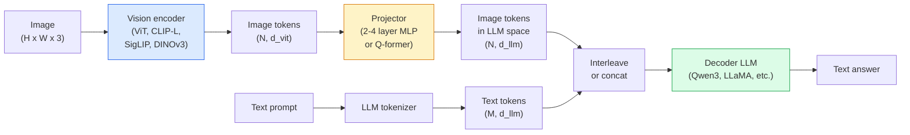

# Визуально-языковые модели — паттерн ViT-MLP-LLM

> Визуальный энкодер преобразует изображение в токены. MLP-проектор отображает эти токены в пространство эмбеддингов LLM. Языковая модель делает все остальное. Этот паттерн — ViT-MLP-LLM — лежит в основе каждой продакшен-VLM в 2026 году.

**Тип:** Изучить + применить
**Языки:** Python
**Предварительные требования:** Фаза 4, урок 14 (ViT), фаза 4, урок 18 (CLIP), фаза 7, урок 02 (Self-Attention)
**Время:** ~75 минут

## Цели обучения

- Сформулировать архитектуру ViT-MLP-LLM и объяснить вклад каждого из трех компонентов
- Сравнить Qwen3-VL, InternVL3.5, LLaVA-Next и GLM-4.6V по числу параметров, длине контекста и качеству на бенчмарках
- Объяснить DeepStack: почему многоуровневые признаки ViT усиливают выравнивание изображения и языка лучше, чем один признак последнего слоя
- Измерять галлюцинации VLM в продакшене с помощью Cross-Modal Error Rate (CMER) и действовать по этому сигналу

## Проблема

CLIP (фаза 4, урок 18) дает общее пространство эмбеддингов для изображений и текста, которого достаточно для zero-shot классификации и поиска. Но он не может ответить на вопрос «сколько красных машин на этом изображении?», потому что CLIP не генерирует текст — он только оценивает сходство.

Визуально-языковые модели (Vision-Language Models, VLMs) — Qwen3-VL, InternVL3.5, LLaVA-Next, GLM-4.6V — подключают энкодер изображений семейства CLIP к полноценной языковой модели. Модель видит изображение вместе с вопросом и генерирует ответ. В 2026 году open-source VLM соперничают с GPT-5 и Gemini-2.5-Pro или превосходят их на мультимодальных бенчмарках (MMMU, MMBench, DocVQA, ChartQA, MathVista, OSWorld).

Тройка компонентов (ViT, projector, LLM) стала стандартом. Различия между моделями состоят в том, какой ViT, какой projector, какая LLM, какие обучающие данные и какой рецепт выравнивания используются. Когда вы понимаете этот паттерн, замена любого компонента становится механической.

## Концепция

### Архитектура ViT-MLP-LLM



1. **Визуальный энкодер** — предварительно обученный ViT (CLIP-L/14, SigLIP, DINOv3 или дообученный вариант). Производит patch-токены.
2. **Проектор** — небольшой модуль (MLP из 2-4 слоев или Q-former), который отображает визуальные токены в размерность эмбеддингов LLM. Именно здесь происходит большая часть дообучения.
3. **LLM** — decoder-only языковая модель (Qwen3, Llama, Mistral, GLM, InternLM). Читает визуальные и текстовые токены как последовательность и генерирует текст.

В принципе все три компонента обучаемы. На практике визуальный энкодер и LLM в основном остаются замороженными, а обучается проектор — дешево использовать сигнал от нескольких миллиардов параметров.

### DeepStack

Обычная проекция использует только последний слой ViT. DeepStack (Qwen3-VL) берет признаки с нескольких глубин ViT и складывает их в стек. Более глубокие слои несут высокоуровневую семантику; более мелкие слои несут детальную пространственную и текстурную информацию. Передача обоих типов признаков в LLM сокращает разрыв между «что содержит изображение» (семантика) и «где именно» (пространственное grounding).

### Три этапа обучения

Современные VLM обучаются поэтапно:

1. **Выравнивание** — заморозить ViT и LLM. Обучать только проектор на парах изображение-подпись. Это учит проектор отображать визуальное пространство в языковое пространство.
2. **Предобучение** — разморозить все. Обучать на крупномасштабных перемежающихся данных изображение-текст (500M+ пар). Это строит визуальные знания модели.
3. **Instruction tuning** — дообучать на курируемых тройках (изображение, вопрос, ответ). Это учит диалоговому поведению и форматам задач. Именно это превращает «vision-aware LM» в пригодного к использованию ассистента.

Большинство LoRA-дообучений нацелены на этап 3 с небольшим размеченным датасетом.

### Сравнение семейств моделей (начало 2026 года)

| Модель | Параметры | Визуальный энкодер | LLM | Контекст | Сильные стороны |
|-------|--------|----------------|-----|---------|-----------|
| Qwen3-VL-235B-A22B (MoE) | 235B (22B active) | custom ViT + DeepStack | Qwen3 | 256K | Общий SOTA, GUI-агент |
| Qwen3-VL-30B-A3B (MoE) | 30B (3B active) | custom ViT + DeepStack | Qwen3 | 256K | Меньшая MoE-альтернатива |
| Qwen3-VL-8B (dense) | 8B | custom ViT | Qwen3 | 128K | Продакшен-вариант по умолчанию среди dense-моделей |
| InternVL3.5-38B | 38B | InternViT-6B | Qwen3 + GPT-OSS | 128K | Сильная на MMBench / MMVet |
| InternVL3.5-241B-A28B | 241B (28B active) | InternViT-6B | Qwen3 | 128K | Конкурирует с GPT-4o |
| LLaVA-Next 72B | 72B | SigLIP | Llama-3 | 32K | Открытая, легко дообучать |
| GLM-4.6V | ~70B | custom | GLM | 64K | Open-source, сильная OCR |
| MiniCPM-V-2.6 | 8B | SigLIP | MiniCPM | 32K | Удобна для edge-сценариев |

### Визуальные агенты

Qwen3-VL-235B достигает лучшего глобального качества на OSWorld — бенчмарке для **визуальных агентов**, которые работают с GUI (desktop, mobile, web). Модель видит скриншот, понимает UI и выдает действия (click, type, scroll). В сочетании с инструментами это замыкает цикл на типовых задачах рабочего стола. Именно это лежит под капотом большинства демонстраций «AI PC» в 2026 году.

### Агентные способности + варианты RoPE

VLM должны знать, **когда** кадр появляется в видео. Qwen3-VL эволюционировала от T-RoPE (temporal rotary position embeddings) к **text-based time alignment** — явным текстовым токенам timestamp, перемежающимся с видеокадрами. Модель видит "`<timestamp 00:32>` frame, prompt" и может рассуждать о временных отношениях.

### Проблема выравнивания

12% пар изображение-текст в собранном с веба датасете содержат описания, которые не полностью привязаны к изображению. VLM, обученная на таких данных, незаметно учится галлюцинировать — выдумывать объекты, неверно читать числа, изобретать отношения. В продакшене это доминирующий режим отказа.

Skywork.ai предложила **Cross-Modal Error Rate (CMER)** для его отслеживания:

```
CMER = fraction of outputs where the text confidence is high but the image-text similarity (via a CLIP-family checker) is low
```

Высокий CMER означает, что модель уверенно утверждает вещи, которые не основаны на изображении. Мониторинг CMER и работа с ним как с продакшен-KPI снизили частоту галлюцинаций примерно на ~35% в их развертывании. Прием состоит не в том, чтобы «исправить модель», а в том, чтобы направлять outputs с высоким CMER на проверку человеком.

### Дообучение с LoRA / QLoRA

Полное дообучение VLM на 70B параметров недоступно большинству команд. LoRA (rank 16-64) на слоях attention и projector или QLoRA с 4-bit базовыми весами помещается на одну A100 / H100. Стоимость: 5,000-50,000 примеров, $100-$5,000 вычислений, 2-10 часов обучения.

### Пространственное рассуждение все еще слабо

Текущие VLM набирают 50-60% на бенчмарках пространственного рассуждения (above-below, left-right, counting, distance). Если ваш use case зависит от того, «какой объект находится поверх какого», проверяйте особенно тщательно — качество универсальных VLM ниже человеческого. Альтернативы лучше VLM для чисто пространственных задач: специализированный keypoint / pose estimator, depth model или detection model с постобработкой геометрии bounding boxes.

## Соберите это

### Шаг 1: Проектор

Часть, которую вы будете обучать чаще всего. MLP из 2-4 слоев с GELU.

```python
import torch
import torch.nn as nn


class Projector(nn.Module):
    def __init__(self, vit_dim=768, llm_dim=4096, hidden=4096):
        super().__init__()
        self.net = nn.Sequential(
            nn.Linear(vit_dim, hidden),
            nn.GELU(),
            nn.Linear(hidden, llm_dim),
        )

    def forward(self, x):
        return self.net(x)
```

Вход — тензор токенов `(N_patches, d_vit)`. Выход — `(N_patches, d_llm)`. LLM воспринимает каждую выходную строку как еще один токен.

### Шаг 2: Собрать ViT-MLP-LLM end-to-end

Скелет прямого прохода для минимальной VLM. Реальный код использует `transformers`; здесь показана концептуальная структура.

```python
class MinimalVLM(nn.Module):
    def __init__(self, vit, projector, llm, image_token_id):
        super().__init__()
        self.vit = vit
        self.projector = projector
        self.llm = llm
        self.image_token_id = image_token_id  # placeholder token in text prompt

    def forward(self, image, input_ids, attention_mask):
        # 1. vision features
        vision_tokens = self.vit(image)                     # (B, N_patches, d_vit)
        vision_embeds = self.projector(vision_tokens)       # (B, N_patches, d_llm)

        # 2. text embeddings
        text_embeds = self.llm.get_input_embeddings()(input_ids)  # (B, M, d_llm)

        # 3. replace image placeholder tokens with vision embeds
        merged = self._merge(text_embeds, vision_embeds, input_ids)

        # 4. run LLM
        return self.llm(inputs_embeds=merged, attention_mask=attention_mask)

    def _merge(self, text_embeds, vision_embeds, input_ids):
        out = text_embeds.clone()
        expected = vision_embeds.size(1)
        for b in range(input_ids.size(0)):
            positions = (input_ids[b] == self.image_token_id).nonzero(as_tuple=True)[0]
            if len(positions) != expected:
                raise ValueError(
                    f"batch item {b} has {len(positions)} image tokens but vision_embeds has {expected} patches."
                    " Every sample in the batch must be pre-padded to the same number of image placeholder tokens.")
            out[b, positions] = vision_embeds[b]
        return out
```

Placeholder-токен `<image>` в тексте заменяется реальными эмбеддингами изображения — тот же паттерн используют LLaVA, Qwen-VL и InternVL.

### Шаг 3: Вычисление CMER

Легкая runtime-проверка.

```python
import torch.nn.functional as F


def cross_modal_error_rate(image_emb, text_emb, text_confidence, sim_threshold=0.25, conf_threshold=0.8):
    """
    image_emb, text_emb: embeddings of image and generated text (normalised internally)
    text_confidence:     mean per-token probability in [0, 1]
    Returns:             fraction of high-confidence outputs with low image-text alignment
    """
    image_emb = F.normalize(image_emb, dim=-1)
    text_emb = F.normalize(text_emb, dim=-1)
    sim = (image_emb * text_emb).sum(dim=-1)        # cosine similarity
    high_conf_low_sim = (text_confidence > conf_threshold) & (sim < sim_threshold)
    return high_conf_low_sim.float().mean().item()
```

Относитесь к CMER как к продакшен-KPI. Мониторьте его по endpoint, типу prompt и customer. Растущий CMER указывает, что модель начинает галлюцинировать на некотором распределении входов.

### Шаг 4: Игрушечный VLM-классификатор (запускаемый)

Покажем, что проектор обучается. Фиктивные «ViT features» подаются на вход; крошечный LLM-style токен предсказывает класс.

```python
class ToyVLM(nn.Module):
    def __init__(self, vit_dim=32, llm_dim=64, num_classes=5):
        super().__init__()
        self.projector = Projector(vit_dim, llm_dim, hidden=64)
        self.head = nn.Linear(llm_dim, num_classes)

    def forward(self, vision_tokens):
        projected = self.projector(vision_tokens)
        pooled = projected.mean(dim=1)
        return self.head(pooled)
```

Такую модель можно подогнать на синтетических парах (feature, class) менее чем за 200 шагов — этого достаточно, чтобы показать, что паттерн projector работает.

## Используйте это

Три способа, которыми продакшен-команды используют VLM в 2026 году:

- **Hosted API** — OpenAI Vision, Anthropic Claude Vision, Google Gemini Vision. Нулевая инфраструктура, риск поставщика.
- **Open-source self-host** — Qwen3-VL или InternVL3.5 через `transformers` и `vllm`. Полный контроль, больше начальных усилий.
- **Дообучение под домен** — загрузить Qwen2.5-VL-7B или LLaVA-1.6-7B, применить LoRA на 5k-50k пользовательских примерах, обслуживать через `vllm` или `TGI`.

```python
from transformers import AutoProcessor, AutoModelForVision2Seq
import torch
from PIL import Image

model_id = "Qwen/Qwen3-VL-8B-Instruct"
processor = AutoProcessor.from_pretrained(model_id)
model = AutoModelForVision2Seq.from_pretrained(model_id, torch_dtype=torch.bfloat16, device_map="auto")

messages = [{
    "role": "user",
    "content": [
        {"type": "image", "image": Image.open("plot.png")},
        {"type": "text", "text": "What does this chart show?"},
    ],
}]
inputs = processor.apply_chat_template(messages, add_generation_prompt=True, tokenize=True, return_dict=True, return_tensors="pt").to("cuda")
generated = model.generate(**inputs, max_new_tokens=256)
answer = processor.decode(generated[0][inputs["input_ids"].shape[1]:], skip_special_tokens=True)
```

`apply_chat_template` скрывает токенизацию placeholder `<image>`; модель выполняет merge внутри.

## Доведите до продакшена

Этот урок создает:

- `outputs/prompt-vlm-selector.md` — выбирает Qwen3-VL / InternVL3.5 / LLaVA-Next / API с учетом accuracy, latency, context length и budget.
- `outputs/skill-cmer-monitor.md` — выдает код для инструментирования продакшен-endpoint VLM с cross-modal error rate, dashboards по endpoint и alerting thresholds.

## Упражнения

1. **(Easy)** Прогоните три prompt ("what is this?", "count the objects", "describe the scene") через любую открытую VLM на пяти изображениях. Оцените каждый ответ вручную как correct / partially correct / hallucinated. Посчитайте первичную CMER-like rate.
2. **(Medium)** Дообучите Qwen2.5-VL-3B или LLaVA-1.6-7B с LoRA (rank 16) на 500 изображениях целевого домена с captions. Сравните zero-shot и fine-tuned MMBench-style accuracy.
3. **(Hard)** Замените image encoder VLM на DINOv3 вместо SigLIP/CLIP по умолчанию. Переобучите только projector (frozen LLM + frozen DINOv3). Измерьте, улучшаются ли dense-prediction tasks (counting, spatial reasoning).

## Ключевые термины

| Термин | Как говорят | Что это на самом деле означает |
|------|----------------|----------------------|
| ViT-MLP-LLM | "The VLM pattern" | Визуальный энкодер + проектор + языковая модель; каждая VLM 2026 года |
| Projector | "The bridge" | MLP из 2-4 слоев (или Q-former), который отображает визуальные токены в пространство эмбеддингов LLM |
| DeepStack | "Qwen3-VL feature trick" | Многоуровневые признаки ViT складываются в стек вместо использования только последнего слоя |
| Image token | "<image> placeholder" | Специальный токен в текстовом потоке, заменяемый спроецированными визуальными эмбеддингами |
| CMER | "Hallucination KPI" | Cross-Modal Error Rate; высок, когда уверенность текста высокая, а сходство изображения и текста низкое |
| Visual agent | "VLM that clicks" | VLM, работающая с GUI (OSWorld, mobile, web) через tool calls |
| Q-former | "Fixed-count token bridge" | Проектор в стиле BLIP-2, производящий фиксированное число visual query tokens |
| Alignment / pre-training / instruction tuning | "Three stages" | Стандартный конвейер обучения VLM |

## Дополнительное чтение

- [Qwen3-VL Technical Report (arXiv 2511.21631)](https://arxiv.org/abs/2511.21631)
- [InternVL3.5 Advancing Open-Source Multimodal Models (arXiv 2508.18265)](https://arxiv.org/html/2508.18265v1)
- [LLaVA-Next series](https://llava-vl.github.io/blog/2024-05-10-llava-next-stronger-llms/)
- [BentoML: Best Open-Source VLMs 2026](https://www.bentoml.com/blog/multimodal-ai-a-guide-to-open-source-vision-language-models)
- [MMMU: Multi-discipline Multimodal Understanding benchmark](https://mmmu-benchmark.github.io/)
- [VLMs in manufacturing (Robotics Tomorrow, March 2026)](https://www.roboticstomorrow.com/story/2026/03/when-machines-learn-to-see-like-experts-the-rise-of-vision-language-models-in-manufacturing/26335/)
