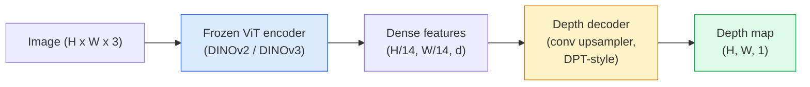

# Оценка монокулярной глубины и геометрии

> Карта глубины - это одноканальное изображение, где каждый пиксель является расстоянием от камеры. Предсказывать ее по одному RGB-кадру раньше было невозможно без стерео или LiDAR. В 2026 году замороженный ViT-энкодер плюс легкая голова дают результат в пределах нескольких процентов от истинной разметки.

**Тип:** Build + Use
**Языки:** Python
**Предварительные требования:** Phase 4 Lesson 14 (ViT), Phase 4 Lesson 17 (Self-Supervised Vision), Phase 4 Lesson 07 (U-Net)
**Время:** ~60 минут

## Цели обучения

- Различать относительную и метрическую глубину и указывать, какую из них решает каждая production-модель (MiDaS, Marigold, Depth Anything V3, ZoeDepth)
- Использовать Depth Anything V3 (DINOv2 backbone), чтобы предсказывать глубину для произвольных одиночных изображений без калибровки
- Объяснять, почему монокулярная глубина вообще работает по одному изображению (перспективные признаки, градиенты текстуры, выученные априорные знания) и что она не может восстановить (абсолютный масштаб, окклюдированную геометрию)
- Поднимать 2D-детекции в 3D-точки с помощью карты глубины и внутренней калибровки камеры-обскуры

## Проблема

Глубина - это недостающая ось в 2D компьютерном зрении. Имея RGB, вы знаете, где объекты появляются в плоскости изображения; вы не знаете, насколько далеко они находятся. Датчики глубины (стереосистемы, LiDAR, time-of-flight) решают это напрямую, но они дороги, хрупки и ограничены по дальности.

Оценка монокулярной глубины - предсказание глубины по одному RGB-кадру - раньше давала размытый и ненадежный результат. К 2026 году большие предварительно обученные энкодеры изменили ситуацию: Depth Anything V3 использует замороженный DINOv2 backbone и производит карты глубины, которые обобщаются на помещения, улицу, медицинские и спутниковые домены. Marigold переформулирует глубину как задачу условной диффузии. ZoeDepth регрессирует истинные метрические расстояния.

Глубина также является мостом между 2D-детекцией и 3D-пониманием: умножьте пиксели обнаруженного bounding box на глубину, и вы поднимете 2D-объект в 3D-облако точек. Это ядро каждой системы AR-окклюзии, каждого пайплайна обхода препятствий и каждого робота, который должен "pick up the cup".

## Концепция

### Относительная и метрическая глубина

- **Относительная глубина** - упорядоченные значения `z` без единицы реального мира. "Пиксель A ближе, чем пиксель B, но отношение расстояний не привязано к метрам."
- **Метрическая глубина** - абсолютное расстояние в метрах от камеры. Требует, чтобы модель выучила статистическую связь между признаками изображения и реальным расстоянием.

MiDaS и Depth Anything V3 производят относительную глубину. Marigold производит относительную глубину. ZoeDepth, UniDepth и Metric3D производят метрическую глубину. Метрические модели чувствительны к внутренним параметрам камеры; относительные модели - нет.

### Паттерн энкодер-декодер



Depth Anything V3 замораживает энкодер и обучает только DPT-style декодер. Энкодер предоставляет богатые признаки; декодер интерполирует их обратно к разрешению изображения и регрессирует глубину.

### Почему одно изображение вообще дает глубину

2D-изображение содержит много монокулярных признаков, которые коррелируют с глубиной:

- **Перспектива** - параллельные линии в 3D сходятся в 2D.
- **Градиент текстуры** - удаленные поверхности имеют более мелкую и плотную текстуру.
- **Порядок окклюзий** - более близкие объекты перекрывают более дальние.
- **Постоянство размера** - известные объекты (машины, люди) дают приблизительный масштаб.
- **Воздушная перспектива** - далекие объекты выглядят более дымчатыми и синеватыми в уличных сценах.

ViT, обученный на миллиардах изображений, интернализует эти признаки. При достаточном объеме данных и сильном backbone монокулярная глубина достигает разумной точности без какого-либо явного 3D-supervision.

### Что монокулярная глубина не может сделать

- **Абсолютный метрический масштаб** без внутренних параметров камеры или известного объекта в сцене. Сеть может предсказать, что "чашка вдвое дальше ложки", не зная, находится чашка на расстоянии 1 m или 10 m.
- **Окклюдированная геометрия** - спинка стула не видна и не может быть надежно выведена.
- **По-настоящему нетекстурированные / отражающие поверхности** - зеркала, стекло, однородные стены. Сеть сообщает правдоподобную, но неверную глубину.

### Depth Anything V3 в 2026 году

- Vanilla DINOv2 ViT-L/14 как энкодер (замороженный).
- DPT-декодер.
- Обучается на позированных парах изображений из разнообразных источников (явная разметка глубины не нужна сверх фотометрической согласованности).
- Предсказывает пространственно согласованную геометрию по **произвольному числу визуальных входов, с известными позами камеры или без них**.
- SOTA для монокулярной глубины, геометрии любого ракурса, визуального рендеринга, оценки позы камеры.

Это drop-in модель, которую стоит вызывать, когда вам нужна глубина в 2026 году.

### Marigold - диффузия для глубины

Marigold (Ke et al., CVPR 2024) переформулирует оценку глубины как условную диффузию image-to-image. Условие: RGB. Цель: карта глубины. Использует предварительно обученную Stable Diffusion 2 U-Net как backbone. Выходные карты глубины исключительно резкие на границах объектов. Компромисс: более медленный инференс, чем у feed-forward моделей (10-50 шагов denoising).

### Внутренние параметры и камера-обскура

Чтобы поднять пиксель `(u, v)` с глубиной `d` в 3D-точку `(X, Y, Z)` в координатах камеры:

```
fx, fy, cx, cy = camera intrinsics
X = (u - cx) * d / fx
Y = (v - cy) * d / fy
Z = d
```

Внутренние параметры берутся из EXIF metadata, калибровочного шаблона или монокулярного оценщика внутренних параметров (intrinsics estimator: Perspective Fields, UniDepth). Без внутренних параметров вы все еще можете отрендерить облако точек, предположив 60-70° FOV и главные точки умеренного разрешения (principal points) - пригодно для визуализации, но не для измерений.

### Оценивание

Две стандартные метрики:

- **AbsRel** (absolute relative error): `mean(|d_pred - d_gt| / d_gt)`. Чем ниже, тем лучше. 0.05-0.1 для production-моделей.
- **delta < 1.25** (threshold accuracy): доля пикселей, где `max(d_pred/d_gt, d_gt/d_pred) < 1.25`. Чем выше, тем лучше. 0.9+ для SOTA.

Для относительной глубины (Depth Anything V3, MiDaS) оценивание использует scale-and-shift invariant версии обеих метрик.

## Соберите это

### Шаг 1: Метрики глубины

```python
import torch

def abs_rel_error(pred, target, mask=None):
    if mask is not None:
        pred = pred[mask]
        target = target[mask]
    return (torch.abs(pred - target) / target.clamp(min=1e-6)).mean().item()


def delta_accuracy(pred, target, threshold=1.25, mask=None):
    if mask is not None:
        pred = pred[mask]
        target = target[mask]
    ratio = torch.maximum(pred / target.clamp(min=1e-6), target / pred.clamp(min=1e-6))
    return (ratio < threshold).float().mean().item()
```

Всегда маскируйте невалидные пиксели глубины (ноль, NaN, насыщенные) перед оцениванием.

### Шаг 2: Выравнивание масштаба и сдвига

Для моделей относительной глубины выровняйте предсказание с истинной разметкой перед вычислением метрик. Аппроксимация методом наименьших квадратов для `a * pred + b = target`:

```python
def align_scale_shift(pred, target, mask=None):
    if mask is not None:
        p = pred[mask]
        t = target[mask]
    else:
        p = pred.flatten()
        t = target.flatten()
    A = torch.stack([p, torch.ones_like(p)], dim=1)
    coeffs, *_ = torch.linalg.lstsq(A, t.unsqueeze(-1))
    a, b = coeffs[:2, 0]
    return a * pred + b
```

Запускайте `align_scale_shift` перед `abs_rel_error` при оценивании MiDaS / Depth Anything.

### Шаг 3: Поднимите глубину в облако точек

```python
import numpy as np

def depth_to_point_cloud(depth, intrinsics):
    H, W = depth.shape
    fx, fy, cx, cy = intrinsics
    v, u = np.meshgrid(np.arange(H), np.arange(W), indexing="ij")
    z = depth
    x = (u - cx) * z / fx
    y = (v - cy) * z / fy
    return np.stack([x, y, z], axis=-1)


depth = np.random.uniform(0.5, 4.0, (240, 320))
intr = (320.0, 320.0, 160.0, 120.0)
pc = depth_to_point_cloud(depth, intr)
print(f"point cloud shape: {pc.shape}  (H, W, 3)")
```

Одна функция - любое приложение с подъемом в 3D. Экспортируйте облако точек в `.ply` и откройте в MeshLab или CloudCompare.

### Шаг 4: Smoke test с синтетической сценой глубины

```python
def synthetic_depth(size=96):
    yy, xx = np.meshgrid(np.arange(size), np.arange(size), indexing="ij")
    # Floor: linear gradient from near (top) to far (bottom)
    depth = 1.0 + (yy / size) * 4.0
    # Box in the middle: closer
    mask = (np.abs(xx - size / 2) < size / 6) & (np.abs(yy - size * 0.6) < size / 6)
    depth[mask] = 2.0
    return depth.astype(np.float32)


gt = torch.from_numpy(synthetic_depth(96))
pred = gt + 0.3 * torch.randn_like(gt)  # simulated prediction
aligned = align_scale_shift(pred, gt)
print(f"before align  absRel = {abs_rel_error(pred, gt):.3f}")
print(f"after align   absRel = {abs_rel_error(aligned, gt):.3f}")
```

### Шаг 5: Использование Depth Anything V3 (reference)

```python
import torch
from transformers import pipeline
from PIL import Image

pipe = pipeline(task="depth-estimation", model="LiheYoung/depth-anything-v2-large")

image = Image.open("street.jpg").convert("RGB")
out = pipe(image)
depth_np = np.array(out["depth"])
```

Три строки. `out["depth"]` - это PIL grayscale; преобразуйте в numpy для математики. Конкретно для Depth Anything V3 замените model id после релиза; API не меняется.

## Используйте это

- **Depth Anything V3** (Meta AI / ByteDance, 2024-2026) - вариант по умолчанию для относительной глубины. Самая быстрая модель с ViT-large-backbone в production.
- **Marigold** (ETH, 2024) - наивысшее визуальное качество, медленный инференс.
- **UniDepth** (ETH, 2024) - метрическая глубина с оценкой внутренних параметров камеры.
- **ZoeDepth** (Intel, 2023) - метрическая глубина; более старая, все еще надежная.
- **MiDaS v3.1** - legacy, но стабильная; хороший baseline для сравнения.

Типичный паттерн интеграции:

1. Приходит RGB-кадр.
2. Модель глубины производит карту глубины.
3. Детектор производит bounding boxes.
4. Поднимите центроиды bounding boxes через глубину в 3D; объедините с облаком точек, если оно доступно.
5. Downstream: AR-окклюзия, планирование пути, оценка размера объектов, замена стерео.

Для использования в реальном времени Depth Anything V2 Small (INT8 quantised) достигает ~30 fps на потребительском GPU при 518x518.

## Доведите до поставки

Этот урок производит:

- `outputs/prompt-depth-model-picker.md` - выбирает между Depth Anything V3, Marigold, UniDepth, MiDaS с учетом задержки, потребности в метрической или относительной глубине и типа сцены.
- `outputs/skill-depth-to-pointcloud.md` - skill, который строит облака точек из карт глубины с корректной обработкой внутренних параметров и экспортом в `.ply`.

## Упражнения

1. **(Easy)** Запустите Depth Anything V2 на любых 10 изображениях вашего стола. Сохраните глубину как grayscale PNGs и изучите. Найдите один объект, чья предсказанная глубина выглядит неверной, и объясните, почему монокулярные признаки не сработали.
2. **(Medium)** Имея RGB + depth от Depth Anything V2, поднимите их в облако точек и отрендерьте с `open3d`. Сравните две сцены (indoor / outdoor) и отметьте, какая выглядит более правдоподобной.
3. **(Hard)** Возьмите пять пар изображений, которые отличаются только положением известного объекта (например, бутылка передвинута на 30 cm ближе). Используйте UniDepth, чтобы предсказать метрическую глубину на обоих. Сообщите предсказанную дельту расстояния относительно истинных 30 cm.

## Ключевые термины

| Термин | Как обычно говорят | Что это на самом деле значит |
|------|----------------|----------------------|
| Monocular depth | "Глубина по одному изображению (Single-image depth)" | Оценка глубины по одному RGB-кадру, без стерео или LiDAR |
| Relative depth | "Упорядоченная глубина (Ordered depth)" | Упорядоченные z-значения без единиц реального мира |
| Metric depth | "Абсолютное расстояние (Absolute distance)" | Глубина в метрах; требует калибровки или модели, обученной с метрическим supervision |
| AbsRel | "Absolute relative error" | Среднее |d_pred - d_gt| / d_gt; стандартная метрика глубины |
| Delta accuracy | "delta < 1.25" | Доля пикселей, у которых предсказание находится в пределах 25% от истинной разметки |
| Pinhole camera | "fx, fy, cx, cy" | Модель камеры, используемая для подъема (u, v, d) в (X, Y, Z) |
| DPT | "Dense Prediction Transformer" | Conv-based декодер, используемый поверх замороженных ViT-энкодеров для глубины |
| DINOv2 backbone | "The reason it works" | Self-supervised признаки, которые обобщаются между доменами без depth labels |

## Дополнительное чтение

- [Depth Anything V3 paper page](https://depth-anything.github.io/) - SOTA монокулярная глубина с DINOv2 encoder
- [Marigold (Ke et al., CVPR 2024)](https://marigoldmonodepth.github.io/) - diffusion-based оценка глубины
- [UniDepth (Piccinelli et al., 2024)](https://arxiv.org/abs/2403.18913) - метрическая глубина с intrinsics
- [MiDaS v3.1 (Intel ISL)](https://github.com/isl-org/MiDaS) - канонический baseline относительной глубины
- [DINOv3 blog post (Meta)](https://ai.meta.com/blog/dinov3-self-supervised-vision-model/) - семейство энкодеров, которое повышает точность глубины
