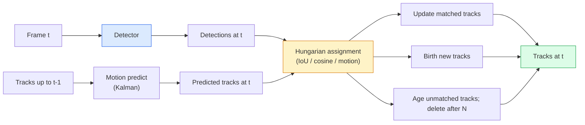

# Многообъектный трекинг и видеопамять

> Трекинг — это детекция плюс сопоставление. Детектируйте каждый кадр. Сопоставляйте детекции текущего кадра с треками прошлого кадра по ID.

**Тип:** Сборка
**Языки:** Python
**Предварительные требования:** Phase 4 Lesson 06 (YOLO Detection), Phase 4 Lesson 08 (Mask R-CNN), Phase 4 Lesson 24 (SAM 3)
**Время:** ~60 минут

## Цели обучения

- Отличать tracking-by-detection от трекинга на основе запросов (query-based tracking) и называть семейства алгоритмов (SORT, DeepSORT, ByteTrack, BoT-SORT, SAM 2 memory tracker, SAM 3.1 Object Multiplex)
- Реализовать IoU + венгерское назначение (Hungarian assignment) с нуля для классического tracking-by-detection
- Объяснять банк памяти SAM 2 и почему он лучше справляется с окклюзиями, чем сопоставление на основе IoU
- Читать три метрики трекинга (MOTA, IDF1, HOTA) и выбирать, какая важна для заданного сценария

## Проблема

Детектор сообщает, где находятся объекты в одном кадре. Трекер сообщает, какая детекция в кадре `t` является тем же объектом, что и детекция в кадре `t-1`. Без этого нельзя считать объекты, пересекающие линию, сопровождать мяч через окклюзию или знать, что "car #4 has been in the lane for 8 seconds."

Трекинг необходим каждому продукту, работающему с видео: спортивная аналитика, наблюдение, автономное вождение, анализ медицинского видео, мониторинг дикой природы, подсчет логотипов. Базовые строительные блоки общие: покадровый детектор, модель движения (фильтр Калмана или что-то богаче), шаг сопоставления (венгерский алгоритм по IoU / косинусной мере / обученным признакам) и жизненный цикл трека (рождение, обновление, удаление).

В 2026 году появились два новых паттерна: **SAM 2 memory-based tracking** (память признаков вместо сопоставления через модель движения) и **SAM 3.1 Object Multiplex** (общая память для множества экземпляров одного и того же понятия). Этот урок сначала проходит классический стек, затем подход на основе памяти.

## Концепция

### Tracking-by-detection (трекинг через детекцию)



Каждый трекер, который вы встретите в 2026 году, является вариацией этого цикла. Отличия:

- **SORT** (2016): фильтр Калмана + венгерское сопоставление по IoU. Простой, быстрый, без модели внешнего вида.
- **DeepSORT** (2017): SORT + CNN-признак внешнего вида для каждого трека (ReID embedding). Лучше обрабатывает пересечения.
- **ByteTrack** (2021): сопоставляет детекции с низкой уверенностью как второй этап; признаки внешнего вида не нужны, но это один из лидеров на MOT17.
- **BoT-SORT** (2022): Byte + компенсация движения камеры + ReID.
- **StrongSORT / OC-SORT** — потомки ByteTrack с улучшенными движением и внешним видом.

### Фильтр Калмана в одном абзаце

Фильтр Калмана поддерживает состояние для каждого трека `(x, y, w, h, dx, dy, dw, dh)` с ковариацией. На каждом кадре он сначала **предсказывает** состояние с помощью модели постоянной скорости, затем **обновляет** его по сопоставленной детекции. Обновление больше доверяет детекции, когда неопределенность предсказания высока. Это дает гладкие траектории и возможность продолжать трек через короткую окклюзию (1-5 кадров).

Каждый классический трекер использует фильтр Калмана на шаге предсказания движения.

### Венгерский алгоритм

Дана матрица стоимости `M x N` (треки x детекции); нужно найти взаимно-однозначное назначение, минимизирующее суммарную стоимость. Стоимость обычно равна `1 - IoU(track_bbox, detection_bbox)` или отрицательному косинусному сходству признаков внешнего вида. Время работы — O((M+N)^3); для M, N до ~1000 это достаточно быстро в Python через `scipy.optimize.linear_sum_assignment`.

### Ключевая идея ByteTrack

Стандартные трекеры отбрасывают детекции с низкой уверенностью (< 0.5). ByteTrack оставляет их как **кандидатов второго этапа**: после сопоставления треков с детекциями высокой уверенности несопоставленные треки пытаются сопоставиться с детекциями низкой уверенности при немного более мягком пороге IoU. Это восстанавливает короткие окклюзии и переключения ID рядом с толпами.

### Memory-based tracking в SAM 2

SAM 2 обрабатывает видео, сохраняя **банк памяти** пространственно-временных признаков для каждого экземпляра. Получив промпт (клик, рамку, текст) на одном кадре, он кодирует экземпляр в память. На последующих кадрах память сопоставляется с признаками нового кадра через cross-attention, а декодер выдает маску того же экземпляра в новом кадре.

Нет фильтра Калмана, нет венгерского назначения. Сопоставление неявно задается операцией attention к памяти.

Плюсы:
- Устойчив к большим окклюзиям (память переносит идентичность экземпляра через много кадров).
- Open-vocabulary при сочетании с текстовыми промптами SAM 3.
- Работает без отдельной модели движения.

Минусы:
- Медленнее ByteTrack для трекинга большого числа объектов.
- Банк памяти растет; это ограничивает контекстное окно.

### SAM 3.1 Object Multiplex

Предыдущий трекинг SAM 2 / SAM 3 держит отдельный банк памяти для каждого экземпляра. Для 50 объектов — 50 банков памяти. Object Multiplex (март 2026) сворачивает их в одну общую память с **токенами запросов для каждого экземпляра**. Стоимость растет суб-линейно по числу экземпляров.

Multiplex — новый вариант по умолчанию для трекинга толп в 2026 году: концертные толпы, складские работники, транспортные перекрестки.

### Три метрики, которые нужно знать

- **MOTA (Multi-Object Tracking Accuracy)** — 1 - (FN + FP + ID switches) / GT. Взвешивается по типу ошибки; единая метрика, которая смешивает ошибки детекции и сопоставления.
- **IDF1 (ID F1)** — гармоническое среднее ID precision и ID recall. Фокусируется именно на том, насколько хорошо каждый ground-truth трек сохраняет свой ID во времени. Лучше MOTA для задач, чувствительных к переключениям ID.
- **HOTA (Higher Order Tracking Accuracy)** — раскладывается на точность детекции (DetA) и точность сопоставления (AssA). Стандарт сообщества с 2020 года; самая комплексная метрика.

Для наблюдения (кто есть кто): отчетная метрика — IDF1. Для спортивной аналитики (подсчет передач): HOTA. Для общего академического сравнения: HOTA.

## Соберите это

### Шаг 1: Матрица стоимости на основе IoU

```python
import numpy as np


def bbox_iou(a, b):
    """
    a, b: (N, 4) arrays of [x1, y1, x2, y2].
    Returns (N_a, N_b) IoU matrix.
    """
    ax1, ay1, ax2, ay2 = a[:, 0], a[:, 1], a[:, 2], a[:, 3]
    bx1, by1, bx2, by2 = b[:, 0], b[:, 1], b[:, 2], b[:, 3]
    inter_x1 = np.maximum(ax1[:, None], bx1[None, :])
    inter_y1 = np.maximum(ay1[:, None], by1[None, :])
    inter_x2 = np.minimum(ax2[:, None], bx2[None, :])
    inter_y2 = np.minimum(ay2[:, None], by2[None, :])
    inter = np.clip(inter_x2 - inter_x1, 0, None) * np.clip(inter_y2 - inter_y1, 0, None)
    area_a = (ax2 - ax1) * (ay2 - ay1)
    area_b = (bx2 - bx1) * (by2 - by1)
    union = area_a[:, None] + area_b[None, :] - inter
    return inter / np.clip(union, 1e-8, None)
```

### Шаг 2: Минимальный трекер в стиле SORT

Фиксированный фильтр Калмана с постоянной скоростью опущен для краткости — здесь мы используем простое сопоставление по IoU; в продакшене предсказание Калмана необходимо. Python-пакет `sort` предоставляет полную версию.

```python
from scipy.optimize import linear_sum_assignment


class Track:
    def __init__(self, tid, bbox, frame):
        self.id = tid
        self.bbox = bbox
        self.last_frame = frame
        self.hits = 1

    def update(self, bbox, frame):
        self.bbox = bbox
        self.last_frame = frame
        self.hits += 1


class SimpleTracker:
    def __init__(self, iou_threshold=0.3, max_age=5):
        self.tracks = []
        self.next_id = 1
        self.iou_threshold = iou_threshold
        self.max_age = max_age

    def step(self, detections, frame):
        if not self.tracks:
            for d in detections:
                self.tracks.append(Track(self.next_id, d, frame))
                self.next_id += 1
            return [(t.id, t.bbox) for t in self.tracks]

        track_boxes = np.array([t.bbox for t in self.tracks])
        det_boxes = np.array(detections) if len(detections) else np.empty((0, 4))

        iou = bbox_iou(track_boxes, det_boxes) if len(det_boxes) else np.zeros((len(track_boxes), 0))
        cost = 1 - iou
        cost[iou < self.iou_threshold] = 1e6

        matched_track = set()
        matched_det = set()
        if cost.size > 0:
            row, col = linear_sum_assignment(cost)
            for r, c in zip(row, col):
                if cost[r, c] < 1.0:
                    self.tracks[r].update(det_boxes[c], frame)
                    matched_track.add(r); matched_det.add(c)

        for i, d in enumerate(det_boxes):
            if i not in matched_det:
                self.tracks.append(Track(self.next_id, d, frame))
                self.next_id += 1

        self.tracks = [t for t in self.tracks if frame - t.last_frame <= self.max_age]
        return [(t.id, t.bbox) for t in self.tracks]
```

60 строк. Принимает покадровые детекции, возвращает ID треков для каждого кадра. Реальные системы добавляют предсказание Калмана, второй этап повторного сопоставления ByteTrack и признаки внешнего вида.

### Шаг 3: Тест на синтетических траекториях

```python
def synthetic_frames(num_frames=20, num_objects=3, H=240, W=320, seed=0):
    rng = np.random.default_rng(seed)
    starts = rng.uniform(20, 200, size=(num_objects, 2))
    velocities = rng.uniform(-5, 5, size=(num_objects, 2))
    frames = []
    for f in range(num_frames):
        dets = []
        for i in range(num_objects):
            cx, cy = starts[i] + f * velocities[i]
            dets.append([cx - 10, cy - 10, cx + 10, cy + 10])
        frames.append(dets)
    return frames


tracker = SimpleTracker()
for f, dets in enumerate(synthetic_frames()):
    tracks = tracker.step(dets, f)
```

Три объекта, движущиеся по прямым линиям, должны сохранять свои ID на всех 20 кадрах.

### Шаг 4: Метрика переключений ID

```python
def count_id_switches(tracks_per_frame, gt_per_frame):
    """
    tracks_per_frame:  list of list of (track_id, bbox)
    gt_per_frame:      list of list of (gt_id, bbox)
    Returns number of ID switches.
    """
    prev_assignment = {}
    switches = 0
    for tracks, gts in zip(tracks_per_frame, gt_per_frame):
        if not tracks or not gts:
            continue
        t_boxes = np.array([b for _, b in tracks])
        g_boxes = np.array([b for _, b in gts])
        iou = bbox_iou(g_boxes, t_boxes)
        for g_idx, (gt_id, _) in enumerate(gts):
            j = iou[g_idx].argmax()
            if iou[g_idx, j] > 0.5:
                t_id = tracks[j][0]
                if gt_id in prev_assignment and prev_assignment[gt_id] != t_id:
                    switches += 1
                prev_assignment[gt_id] = t_id
    return switches
```

Это упрощенная метрика, близкая к IDF1: она считает, сколько раз ground-truth объект меняет назначенный ему предсказанный track ID. Реальные инструменты для MOTA / IDF1 / HOTA находятся в `py-motmetrics` и `TrackEval`.

## Используйте это

Продакшен-трекеры в 2026 году:

- `ultralytics` — YOLOv8 + встроенные ByteTrack / BoT-SORT. `results = model.track(source, tracker="bytetrack.yaml")`. Вариант по умолчанию.
- `supervision` (Roboflow) — обертки ByteTrack плюс утилиты аннотирования.
- SAM 2 / SAM 3.1 — трекинг на основе памяти через `processor.track()`.
- Пользовательский стек: детектор (YOLOv8 / RT-DETR) + `sort-tracker` / `OC-SORT` / `StrongSORT`.

Выбор:

- Пешеходы / автомобили / коробки при 30+ fps: **ByteTrack with ultralytics**.
- Много экземпляров одного класса в толпе: **SAM 3.1 Object Multiplex**.
- Сильные окклюзии с распознаваемым внешним видом: **DeepSORT / StrongSORT** (ReID-признаки).
- Спорт / сложные взаимодействия: **BoT-SORT** или обученные трекеры (MOTRv3).

## Доведите до результата

Этот урок создает:

- `outputs/prompt-tracker-picker.md` — выбирает SORT / ByteTrack / BoT-SORT / SAM 2 / SAM 3.1 по типу сцены, паттернам окклюзии и бюджету задержки.
- `outputs/skill-mot-evaluator.md` — пишет полный evaluation harness для MOTA / IDF1 / HOTA по ground-truth трекам.

## Упражнения

1. **(Легко)** Запустите синтетический трекер выше с 3, 10 и 30 объектами. Сообщите число переключений ID в каждом случае. Определите, где простое сопоставление только по IoU начинает ломаться.
2. **(Средне)** Добавьте шаг предсказания фильтром Калмана с постоянной скоростью перед сопоставлением. Покажите, что короткие окклюзии (2-3 кадра) больше не вызывают переключений ID.
3. **(Сложно)** Интегрируйте memory-based tracker SAM 2 (через `transformers`) как альтернативный backend трекера. Запустите SimpleTracker и SAM 2 на 30-секундном клипе толпы и сравните число переключений ID, вручную разметив ground-truth ID для 5 заметных людей.

## Ключевые термины

| Термин | Как говорят | Что это на самом деле означает |
|------|----------------|----------------------|
| Tracking-by-detection | "Detect then associate" | Покадровый детектор + венгерское назначение по IoU / внешнему виду |
| Kalman filter | "Motion predict" | Линейная динамика + ковариация для гладких предсказаний треков и обработки окклюзий |
| Hungarian algorithm | "Optimal assignment" | Решает задачу двудольного сопоставления минимальной стоимости; `scipy.optimize.linear_sum_assignment` |
| ByteTrack | "Low-confidence second pass" | Повторно сопоставляет несопоставленные треки с детекциями низкой уверенности, чтобы восстановить короткие окклюзии |
| DeepSORT | "SORT + appearance" | Добавляет ReID-признак для сопоставления между кадрами; лучше сохраняет ID |
| Memory bank | "SAM 2 trick" | Пространственно-временные признаки для каждого экземпляра, сохраненные между кадрами; cross-attention заменяет явное сопоставление |
| Object Multiplex | "SAM 3.1 shared memory" | Единая общая память с запросами для каждого экземпляра для быстрого трекинга множества объектов |
| HOTA | "Modern tracking metric" | Раскладывается на точность детекции и точность сопоставления; стандарт сообщества |

## Дополнительное чтение

- [SORT (Bewley et al., 2016)](https://arxiv.org/abs/1602.00763) — минимальная статья о tracking-by-detection
- [DeepSORT (Wojke et al., 2017)](https://arxiv.org/abs/1703.07402) — добавляет признак внешнего вида
- [ByteTrack (Zhang et al., 2022)](https://arxiv.org/abs/2110.06864) — второй проход по детекциям низкой уверенности
- [BoT-SORT (Aharon et al., 2022)](https://arxiv.org/abs/2206.14651) — компенсация движения камеры
- [HOTA (Luiten et al., 2020)](https://arxiv.org/abs/2009.07736) — декомпозированная метрика трекинга
- [SAM 2 video segmentation (Meta, 2024)](https://ai.meta.com/sam2/) — трекер на основе памяти
- [SAM 3.1 Object Multiplex (Meta, March 2026)](https://ai.meta.com/blog/segment-anything-model-3/)
