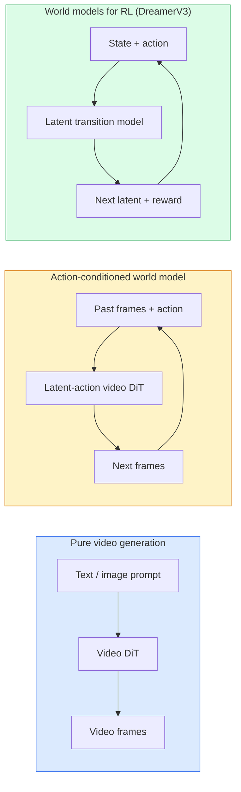

# Модели мира и видеодиффузия

> Видеомодель, предсказывающая следующие секунды сцены, является симулятором мира. Добавьте к этому предсказанию обусловливание действиями, и вы получите обученный игровой движок.

**Тип:** Изучение + построение
**Языки:** Python
**Предварительные требования:** Фаза 4, урок 10 (диффузия), фаза 4, урок 12 (понимание видео), фаза 4, урок 23 (DiT + Rectified Flow)
**Время:** ~75 минут

## Цели обучения

- Объяснить различие между чистой моделью генерации видео (Sora 2) и моделью мира, обусловленной действиями (Genie 3, DreamerV3)
- Описать видео DiT: пространственно-временные патчи, 3D-позиционное кодирование, совместное внимание по токенам (T, H, W)
- Проследить, как модель мира встраивается в робототехнику: VLM планирует → видеомодель симулирует → обратная динамика выдает действия
- Выбрать между Sora 2, Genie 3, Runway GWM-1 Worlds, Wan-Video и HunyuanVideo для заданного сценария (креативное видео, интерактивная симуляция, синтез для автономного вождения)

## Проблема

Генерация видео и моделирование мира сошлись в 2026 году. Модель, способная сгенерировать связную минуту видео, в некотором смысле выучила, как движется мир: постоянство объектов, гравитацию, причинность, стиль. Если обусловить это предсказание действиями (идти влево, открыть дверь), видеомодель становится обучаемым симулятором, который может заменить игровой движок, симулятор вождения или робототехническую среду.

Ставки вполне конкретны. Genie 3 генерирует игровые окружения по одному изображению. Runway GWM-1 Worlds синтезирует бесконечные исследуемые сцены. Sora 2 создает минутные видео с синхронизированным звуком и смоделированной физикой. NVIDIA Cosmos-Drive, Wayve Gaia-2 и Tesla DrivingWorld генерируют реалистичное видео вождения для обучающих данных автономных транспортных средств. Парадигма моделей мира незаметно захватывает перенос из симуляции в реальность (sim-to-real) в робототехнике.

Этот урок дает "общую картину" для фазы 4. Он связывает генерацию изображений, понимание видео и агентное рассуждение в архитектурный паттерн, к которому движутся ведущие исследования.

## Концепция

### Три семейства моделирования мира



- **Sora 2** — это чистая генерация видео, обусловленная промптами. Интерфейса действий нет. Вы не можете "рулить" ею в середине развертывания (rollout).
- **Genie 3**, **GWM-1 Worlds**, **Mirage / Magica** — это модели мира, обусловленные действиями. Они выводят латентные действия из наблюдаемого видео, а затем обусловливают предсказания будущих кадров действиями. Они интерактивны: вы нажимаете клавиши или двигаете камеру, и сцена отвечает.
- **DreamerV3** и классическое семейство моделей мира для RL предсказывают в латентном пространстве с явным обусловливанием действиями и обучаются по сигналу награды. Они менее визуальны, но полезнее для RL с высокой выборочной эффективностью.

### Архитектура видео DiT

```
Video latent:          (C, T, H, W)
Patchify (spatial):    grid of P_h x P_w patches per frame
Patchify (temporal):   group P_t frames into a temporal patch
Resulting tokens:      (T / P_t) * (H / P_h) * (W / P_w) tokens
```

Позиционное кодирование является 3D: rotary- или обучаемое вложение для каждой координаты (t, h, w). Внимание может быть:

- **Полным совместным** — все токены attend to все токены. O(N^2) при N токенах. Неприемлемо дорого для длинных видео.
- **Разделенным** — чередуются временное внимание (та же пространственная позиция, по времени: `(H*W) * T^2`) и пространственное внимание (тот же шаг времени, по пространству: `T * (H*W)^2`). Используется в TimeSformer и большинстве видео DiT.
- **Оконным** — локальные окна в (t, h, w). Используется в Video Swin.

Каждая видеодиффузионная модель 2026 года использует один из этих трех паттернов плюс обусловливание AdaLN (урок 23) и rectified flow.

### Обусловливание действиями: модели латентных действий

Genie учит **латентное действие** для каждого кадра, дискриминативно предсказывая действие между парой последовательных кадров. Затем декодер модели обусловливается выведенным латентным действием, а не явными клавишами клавиатуры. При инференсе пользователь может задать латентное действие (или сэмплировать его из нового априорного распределения), и модель сгенерирует следующий кадр, согласованный с этим действием.

Sora полностью пропускает интерфейс действий. Ее декодер предсказывает следующие пространственно-временные токены по прошлым пространственно-временным токенам. Промпт задает начало; в середине генерации ничто не управляет направлением.

### Физическая правдоподобность

В релизе Sora 2 2026 года явно заявлялась **физическая правдоподобность**: вес, баланс, постоянство объектов, причинно-следственная связь. Команда измеряла ее через вручную выставленные оценки правдоподобности; модель заметно улучшилась по падающим объектам, столкновениям персонажей и намеренным неудачам (промах при прыжке) по сравнению с Sora 1.

Правдоподобность остается главным режимом отказа. Видео 2024-2025 годов с людьми, едящими спагетти или пьющими из стаканов, выявляли отсутствие у модели устойчивого представления объектов. Модели 2026 года (Sora 2, Runway Gen-5, HunyuanVideo) уменьшают эти проблемы, но не устраняют их полностью.

### Модели мира для автономного вождения

Модели мира для вождения генерируют реалистичные дорожные сцены, обусловленные траекториями, ограничивающими рамками или навигационными картами. Использование:

- **Cosmos-Drive-Dreams** (NVIDIA) — генерирует минуты видео вождения для обучения RL.
- **Gaia-2** (Wayve) — синтез сцен, обусловленный траекторией, для оценки политик.
- **DrivingWorld** (Tesla) — симулирует различные погодные условия, время суток и дорожные ситуации.
- **Vista** (ByteDance) — реактивный синтез сцен вождения.

Они заменяют дорогостоящий сбор реальных данных для редких случаев: пешеходы, переходящие дорогу ночью в неположенном месте, обледенелые перекрестки, необычные типы транспортных средств, которые иначе потребовали бы миллионов миль вождения.

### Робототехнический стек: VLM + видеомодель + обратная динамика

Новый робототехнический цикл из трех компонентов:

1. **VLM** разбирает цель ("поднять красную чашку") и планирует высокоуровневую последовательность действий.
2. **Модель генерации видео** симулирует, как выглядело бы выполнение каждого действия, то есть предсказывает наблюдения на N кадров вперед.
3. **Модель обратной динамики** извлекает конкретные моторные команды, которые произвели бы эти наблюдения.

Это заменяет формирование награды (reward shaping) и RL, требующий большого числа сэмплов. Модель мира выполняет воображение; обратная динамика замыкает контур управления исполнительными механизмами. Genie Envisioner — одна из реализаций; многие исследовательские группы сходятся к этой структуре.

### Оценивание

- **Визуальное качество** — FVD (Fréchet Video Distance), пользовательские исследования.
- **Соответствие промпту** — CLIPScore по кадрам, оценивание в стиле VQA.
- **Физическая правдоподобность** — ручная оценка на наборе бенчмарков (внутренний бенчмарк Sora 2, VBench).
- **Управляемость** (для интерактивных моделей мира) — согласованность действие → наблюдение; можно ли вернуться к предыдущему состоянию?

### Ландшафт моделей в 2026 году

| Модель | Использование | Параметры | Выход | Лицензия |
|-------|-----|------------|--------|---------|
| Sora 2 | text-to-video, audio | — | 1-минутное 1080p + audio | только API |
| Runway Gen-5 | text/image-to-video | — | клипы 10s | API |
| Runway GWM-1 Worlds | interactive world | — | бесконечный 3D rollout | API |
| Genie 3 | interactive world from image | 11B+ | playable frames | исследовательский preview |
| Wan-Video 2.1 | открытая text-to-video | 14B | high-quality clips | non-commercial |
| HunyuanVideo | открытая text-to-video | 13B | клипы 10s | permissive |
| Cosmos / Cosmos-Drive | симуляция автономного вождения | 7-14B | driving scenes | открытая NVIDIA |
| Magica / Mirage 2 | AI-native game engine | — | modifiable worlds | продукт |

## Построим это

### Шаг 1: 3D patchify для видео

```python
import torch
import torch.nn as nn


class VideoPatch3D(nn.Module):
    def __init__(self, in_channels=4, dim=64, patch_t=2, patch_h=2, patch_w=2):
        super().__init__()
        self.proj = nn.Conv3d(
            in_channels, dim,
            kernel_size=(patch_t, patch_h, patch_w),
            stride=(patch_t, patch_h, patch_w),
        )
        self.patch_t = patch_t
        self.patch_h = patch_h
        self.patch_w = patch_w

    def forward(self, x):
        # x: (N, C, T, H, W)
        x = self.proj(x)
        n, c, t, h, w = x.shape
        tokens = x.reshape(n, c, t * h * w).transpose(1, 2)
        return tokens, (t, h, w)
```

3D-свертка со stride, равным kernel, действует как пространственно-временной патчификатор. `(T, H, W) -> (T/2, H/2, W/2)` сетка токенов.

### Шаг 2: 3D rotary-позиционное кодирование

Rotary Position Embeddings (RoPE) отдельно применяются вдоль осей `t`, `h`, `w`:

```python
def rope_3d(tokens, t_dim, h_dim, w_dim, grid):
    """
    tokens: (N, T*H*W, D)
    grid: (T, H, W) sizes
    t_dim + h_dim + w_dim == D
    """
    T, H, W = grid
    n, seq, d = tokens.shape
    if t_dim + h_dim + w_dim != d:
        raise ValueError(f"t_dim+h_dim+w_dim ({t_dim}+{h_dim}+{w_dim}) must equal D={d}")
    assert seq == T * H * W
    t_idx = torch.arange(T, device=tokens.device).repeat_interleave(H * W)
    h_idx = torch.arange(H, device=tokens.device).repeat_interleave(W).repeat(T)
    w_idx = torch.arange(W, device=tokens.device).repeat(T * H)
    # Simplified: just scale channels by frequencies. Real RoPE rotates pairs.
    freqs_t = torch.exp(-torch.log(torch.tensor(10000.0)) * torch.arange(t_dim // 2, device=tokens.device) / (t_dim // 2))
    freqs_h = torch.exp(-torch.log(torch.tensor(10000.0)) * torch.arange(h_dim // 2, device=tokens.device) / (h_dim // 2))
    freqs_w = torch.exp(-torch.log(torch.tensor(10000.0)) * torch.arange(w_dim // 2, device=tokens.device) / (w_dim // 2))
    emb_t = torch.cat([torch.sin(t_idx[:, None] * freqs_t), torch.cos(t_idx[:, None] * freqs_t)], dim=-1)
    emb_h = torch.cat([torch.sin(h_idx[:, None] * freqs_h), torch.cos(h_idx[:, None] * freqs_h)], dim=-1)
    emb_w = torch.cat([torch.sin(w_idx[:, None] * freqs_w), torch.cos(w_idx[:, None] * freqs_w)], dim=-1)
    return tokens + torch.cat([emb_t, emb_h, emb_w], dim=-1)
```

Упрощенная аддитивная форма. Настоящий RoPE вращает парные каналы на частотах; позиционная информация та же.

### Шаг 3: Блок разделенного внимания

```python
class DividedAttentionBlock(nn.Module):
    def __init__(self, dim=64, heads=2):
        super().__init__()
        self.time_attn = nn.MultiheadAttention(dim, heads, batch_first=True)
        self.space_attn = nn.MultiheadAttention(dim, heads, batch_first=True)
        self.ln1 = nn.LayerNorm(dim)
        self.ln2 = nn.LayerNorm(dim)
        self.ln3 = nn.LayerNorm(dim)
        self.mlp = nn.Sequential(nn.Linear(dim, 4 * dim), nn.GELU(), nn.Linear(4 * dim, dim))

    def forward(self, x, grid):
        T, H, W = grid
        n, seq, d = x.shape
        # time attention: same (h, w), across t
        xt = x.view(n, T, H * W, d).permute(0, 2, 1, 3).reshape(n * H * W, T, d)
        a, _ = self.time_attn(self.ln1(xt), self.ln1(xt), self.ln1(xt), need_weights=False)
        xt = (xt + a).reshape(n, H * W, T, d).permute(0, 2, 1, 3).reshape(n, seq, d)
        # space attention: same t, across (h, w)
        xs = xt.view(n, T, H * W, d).reshape(n * T, H * W, d)
        a, _ = self.space_attn(self.ln2(xs), self.ln2(xs), self.ln2(xs), need_weights=False)
        xs = (xs + a).reshape(n, T, H * W, d).reshape(n, seq, d)
        xs = xs + self.mlp(self.ln3(xs))
        return xs
```

Временное внимание смотрит внутри каждой пространственной позиции по времени; пространственное внимание смотрит внутри каждого кадра по позициям. Две операции O(T^2 + (HW)^2) вместо одной O((THW)^2). Это ядро TimeSformer и каждого современного видео DiT.

### Шаг 4: Собрать крошечный видео DiT

```python
class TinyVideoDiT(nn.Module):
    def __init__(self, in_channels=4, dim=64, depth=2, heads=2):
        super().__init__()
        self.patch = VideoPatch3D(in_channels=in_channels, dim=dim, patch_t=2, patch_h=2, patch_w=2)
        self.blocks = nn.ModuleList([DividedAttentionBlock(dim, heads) for _ in range(depth)])
        self.out = nn.Linear(dim, in_channels * 2 * 2 * 2)

    def forward(self, x):
        tokens, grid = self.patch(x)
        for blk in self.blocks:
            tokens = blk(tokens, grid)
        return self.out(tokens), grid
```

Это не рабочий генератор видео, а структурная демонстрация, в которой все части имеют корректные формы.

### Шаг 5: Проверить формы

```python
vid = torch.randn(1, 4, 8, 16, 16)  # (N, C, T, H, W)
model = TinyVideoDiT()
out, grid = model(vid)
print(f"input  {tuple(vid.shape)}")
print(f"tokens grid {grid}")
print(f"output {tuple(out.shape)}")
```

Ожидайте `grid = (4, 8, 8)` и `out = (1, 256, 32)` после patching; затем head проецирует в пространственно-временные патчи на токен, готовые к обратному un-patchify в видео.

## Используем это

Паттерны доступа в продакшене на 2026 год:

- **Sora 2 API** (OpenAI) — text-to-video, синхронизированный звук. Премиальная цена.
- **Runway Gen-5 / GWM-1** (Runway) — image-to-video, интерактивные миры.
- **Wan-Video 2.1 / HunyuanVideo** — open-source для self-host.
- **Cosmos / Cosmos-Drive** (NVIDIA) — открытые веса для симуляции вождения.
- **Genie 3** — исследовательское превью, доступ по запросу.

Для построения демонстрации интерактивной модели мира: начните с Wan-Video ради качества, затем добавьте адаптер латентных действий для интерактивности. Для симуляции автономного вождения Cosmos-Drive является открытым эталоном 2026 года.

Для робототехники стек в реальных системах:

1. Языковая цель -> VLM (Qwen3-VL) -> высокоуровневый план.
2. План -> latent-action video model -> воображаемый rollout.
3. Rollout -> inverse dynamics model -> низкоуровневые действия.
4. Действия выполнены -> наблюдение подается обратно в шаг 1.

## Отгружаем

Этот урок создает:

- `outputs/prompt-video-model-picker.md` — выбирает между Sora 2 / Runway / Wan / HunyuanVideo / Cosmos с учетом задачи, лицензии и задержки.
- `outputs/skill-physical-plausibility-checks.md` — навык, который определяет автоматизированные проверки (постоянство объектов, гравитация, непрерывность), запускаемые на любом сгенерированном видео перед отгрузкой.

## Упражнения

1. **(Легко)** Вычислите число токенов для 5-секундного видео 360p при patch-t=2, patch-h=8, patch-w=8. Рассуждайте о памяти для внимания при таком размере.
2. **(Средне)** Замените приведенный выше блок разделенного внимания на блок полного совместного внимания и измерьте форму и число параметров. Объясните, почему разделенное внимание необходимо для реальных видеомоделей.
3. **(Сложно)** Постройте минимальную видеомодель с латентными действиями: возьмите датасет троек (frame_t, action_t, frame_{t+1}) (любой простой 2D-игры), обучите крошечный видео DiT, обусловленный вложениями действий, и покажите, что разные действия производят разные следующие кадры.

## Ключевые термины

| Термин | Как говорят | Что это на самом деле значит |
|------|----------------|----------------------|
| World model | "Обученный симулятор" | Модель, которая предсказывает будущие наблюдения по состоянию и действию |
| Video DiT | "Пространственно-временной трансформер" | Диффузионный трансформер с 3D-патчификацией и разделенным вниманием |
| Latent action | "Выведенное управление" | Дискретная или непрерывная латентная переменная действия, выведенная из пар кадров; используется для обусловливания генерации следующего кадра |
| Divided attention | "Сначала время, затем пространство" | Две операции внимания на блок: по времени, затем по пространству, чтобы удерживать O(N^2) управляемой |
| Object permanence | "Вещи остаются реальными" | Свойство сцены, которое видеомодели должны выучить; классический режим отказа на еде и стеклянной посуде |
| FVD | "Fréchet Video Distance" | Видеоэквивалент FID; основная метрика визуального качества |
| Inverse dynamics model | "От наблюдений к действиям" | По (состоянию, следующему состоянию) выдает действие, которое их связывает; замыкает робототехнический цикл |
| Cosmos-Drive | "Симулятор вождения NVIDIA" | Модель мира для автономного вождения с открытыми весами, предназначенная для RL и оценивания |

## Дополнительное чтение

- [Sora technical report (OpenAI)](https://openai.com/index/video-generation-models-as-world-simulators/)
- [Genie: Generative Interactive Environments (Bruce et al., 2024)](https://arxiv.org/abs/2402.15391) — модели мира с латентными действиями
- [TimeSformer (Bertasius et al., 2021)](https://arxiv.org/abs/2102.05095) — разделенное внимание для видеотрансформеров
- [DreamerV3 (Hafner et al., 2023)](https://arxiv.org/abs/2301.04104) — модели мира для RL
- [Cosmos-Drive-Dreams (NVIDIA, 2025)](https://research.nvidia.com/labs/toronto-ai/cosmos-drive-dreams/) — модель мира для вождения
- [Top 10 Video Generation Models 2026 (DataCamp)](https://www.datacamp.com/blog/top-video-generation-models)
- [From Video Generation to World Model — survey repo](https://github.com/ziqihuangg/Awesome-From-Video-Generation-to-World-Model/)
