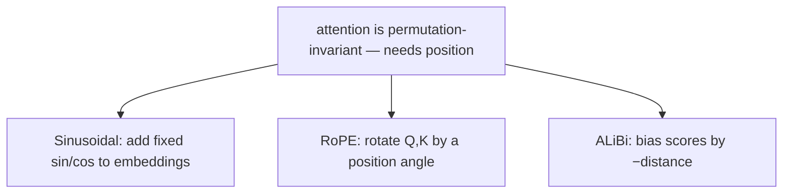

# Positional Encoding — sinusoidal, RoPE, ALiBi

> Attention инвариантен к перестановкам. "The cat sat on the mat" и "mat the on sat cat the" без позиционного сигнала дают один и тот же выход. Это исправляют три алгоритма — каждый со своей ставкой на то, что означает "позиция".

**Тип:** Сборка
**Языки:** Python
**Предварительные требования:** Фаза 7 · 02 (self-attention), Фаза 7 · 03 (multi-head attention)
**Время:** ~45 минут

## Цели обучения

- Объяснять, почему self-attention инвариантно к перестановкам и нуждается во внедрённом позиционном сигнале.
- Реализовывать синусоидальные, RoPE и ALiBi позиционные кодировки и проверять свойство относительного расстояния у RoPE.
- Выбирать позиционную схему для длинноконтекстных моделей 2026 (RoPE с NTK-aware / YaRN-масштабированием).

## Проблема

Scaled dot-product attention не видит порядок. Матрица attention `softmax(Q K^T / √d) V` вычисляется из попарных сходств. Перемешайте строки `X` — получите строки выхода, перемешанные тем же образом. Внутри attention ничто не учитывает позицию.

Для bag-of-words модели это не баг. Для языка, кода, аудио, видео — всего, где порядок несет смысл, — это критично.

Исправление состоит в том, чтобы каким-то образом внедрить позицию в embeddings. Три эпохи ответов:

1. **Absolute sinusoidal** (Vaswani 2017). Добавить `sin/cos` позиции к embedding. Просто, без обучаемых параметров, плохо экстраполируется за пределы обучающих длин.
2. **RoPE — Rotary Position Embeddings** (Su 2021). Поворачивать векторы Q и K на угол, пропорциональный позиции. Кодирует *относительную* позицию прямо в dot product. Доминирует в 2026 году.
3. **ALiBi — Attention with Linear Biases** (Press 2022). Вообще пропустить embeddings; добавить к attention scores линейный штраф на каждую head по расстоянию. Отличная extrapolation по длине.

К 2026 году практически каждая frontier open model использует RoPE: Llama 2/3/4, Qwen 2/3, Mistral, Mixtral, DeepSeek-V3, Kimi. Небольшая часть long-context моделей использует ALiBi или его современные варианты. Absolute sinusoidal — исторический вариант.

## Концепция




### Абсолютное sinusoidal-кодирование

Заранее вычислите фиксированную матрицу `PE` формы `(max_len, d_model)`:

```
PE[pos, 2i]   = sin(pos / 10000^(2i / d_model))
PE[pos, 2i+1] = cos(pos / 10000^(2i / d_model))
```

Затем перед attention используйте `X' = X + PE[:N]`. Каждая размерность — синусоида с отдельной частотой. Модель учится читать позицию по фазовому паттерну. За пределами `max_len` это ломается: модель не видела, что происходит в позиции 2048, если обучалась только на позициях 0–2047.

### RoPE

Поворачивайте векторы Q и K (не embeddings). Для пары размерностей `(2i, 2i+1)`:

```
[q'_2i    ]   [ cos(pos·θ_i)  -sin(pos·θ_i) ] [q_2i   ]
[q'_2i+1  ] = [ sin(pos·θ_i)   cos(pos·θ_i) ] [q_2i+1 ]

θ_i = base^(-2i / d_head),  base = 10000 by default
```

Примените тот же поворот к keys с позицией `pos_k`. Dot product `q'_m · k'_n` становится функцией только от `(m - n)`. То есть: **attention score зависит только от относительного расстояния**, хотя поворот задавался абсолютными позициями. Красивый трюк.

Расширение RoPE: `base` можно масштабировать (NTK-aware, YaRN, LongRoPE), чтобы экстраполировать на более длинные контексты без переобучения с нуля. Llama 3 таким способом была расширена с 8K до 128K context.

### ALiBi

Пропустите трюк с embedding. Смещайте attention scores напрямую:

```
attn_score[i, j] = (q_i · k_j) / √d  -  m_h · |i - j|
```

Где `m_h` — slope, специфичный для head (например, `1 / 2^(8·h/H)`). Близкие токены получают boost; дальние штрафуются. Стоимости во время обучения нет. Статья показывает, что extrapolation по длине превосходит sinusoidal и совпадает с RoPE на исходной обучающей длине.

### Что выбирать в 2026 году

| Вариант | Экстраполяция | Стоимость обучения | Где используется |
|---------|---------------|--------------------|------------------|
| Absolute sinusoidal | слабая | бесплатно | original transformer, early BERT |
| Learned absolute | отсутствует | крошечная | GPT-2, GPT-3 |
| RoPE | хорошая со scaling | бесплатно | Llama 2/3/4, Qwen 2/3, Mistral, DeepSeek-V3, Kimi |
| RoPE + YaRN | отличная | этап fine-tuning | Qwen2-1M, Llama 3.1 128K |
| ALiBi | отличная | бесплатно | BLOOM, MPT, Baichuan |

RoPE победил, потому что вставляется в attention без изменения архитектуры, кодирует относительную позицию, а его hyperparameter `base` дает понятный рычаг для long-context fine-tuning.

## Соберите это

### Шаг 1: sinusoidal encoding

См. `code/main.py`. Вычисление в 4 строки:

```python
def sinusoidal(N, d):
    pe = [[0.0] * d for _ in range(N)]
    for pos in range(N):
        for i in range(d // 2):
            theta = pos / (10000 ** (2 * i / d))
            pe[pos][2 * i]     = math.sin(theta)
            pe[pos][2 * i + 1] = math.cos(theta)
    return pe
```

Добавьте это к embedding matrix перед первым attention layer.

### Шаг 2: RoPE, примененный к Q и K

RoPE работает in-place на Q и K. Для каждой пары dims:

```python
def apply_rope(x, pos, base=10000):
    d = len(x)
    out = list(x)
    for i in range(d // 2):
        theta = pos / (base ** (2 * i / d))
        c, s = math.cos(theta), math.sin(theta)
        a, b = x[2 * i], x[2 * i + 1]
        out[2 * i]     = a * c - b * s
        out[2 * i + 1] = a * s + b * c
    return out
```

Критично: применяйте одну и ту же функцию к Q в позиции `m` и K в позиции `n`. Их dot product получает множитель `cos((m-n)·θ_i)` на каждой координатной паре. Attention бесплатно учит относительную позицию.

### Шаг 3: slopes и bias в ALiBi

```python
def alibi_bias(n_heads, seq_len):
    # slope_h = 2 ** (-8 * h / n_heads) for h = 1..n_heads
    slopes = [2 ** (-8 * (h + 1) / n_heads) for h in range(n_heads)]
    bias = []
    for m in slopes:
        row = [[-m * abs(i - j) for j in range(seq_len)] for i in range(seq_len)]
        bias.append(row)
    return bias  # add to attention scores before softmax
```

Добавьте `bias[h]` к матрице attention scores `(seq_len, seq_len)` для head `h`, затем примените softmax.

### Шаг 4: проверьте свойство относительного расстояния у RoPE

Возьмите два случайных вектора `a, b`. Поверните их на `(pos_a, pos_b)`. Затем на `(pos_a + k, pos_b + k)`. Оба dot products должны совпасть в пределах floating-point error. Это свойство — весь смысл RoPE: он инвариантен к абсолютному offset, важно только относительное расстояние.

## Используйте это

PyTorch 2.5+ поставляет RoPE utilities в `torch.nn.functional`. Большинство production-кода использует `flash_attn` или `xformers`, где RoPE применяется внутри attention kernel.

```python
from transformers import AutoModel
model = AutoModel.from_pretrained("meta-llama/Llama-3.2-3B")
# model.config.rope_scaling → {"type": "yarn", "factor": 32.0, "original_max_position_embeddings": 8192}
```

**Трюки long-context в 2026 году:**

- **NTK-aware interpolation.** Масштабируйте `base` до `base * (scale_factor)^(d/(d-2))` при расширении с 4K до 16K+.
- **YaRN.** Более умная interpolation, сохраняющая attention entropy на длинных контекстах. Llama 3.1 128K использует ее.
- **LongRoPE.** Метод Microsoft 2024 года, использующий evolutionary search для выбора scale factors по размерностям. Phi-3-Long использует его.
- **Position interpolation + fine-tuning.** Просто сожмите позиции на коэффициент расширения и fine-tune на 1–5B токенов. Удивительно эффективно.

## Доведите до поставки

См. `outputs/skill-positional-encoding-picker.md`. Skill выбирает стратегию encoding для новой модели с учетом target context length, нужд extrapolation и training budget.

## Упражнения

1. **Легко.** Постройте sinusoidal матрицу `PE` как heatmap для `max_len=512, d=128`. Подтвердите паттерн "stripes get wider as dimension index grows".
2. **Средне.** Реализуйте NTK-aware RoPE scaling. Обучите tiny LM на последовательностях длины 256, затем протестируйте на длине 1024 со scaling и без него. Измерьте perplexity.
3. **Сложно.** Реализуйте ALiBi и RoPE в одном attention module. Обучите 4-layer transformer на copy task с последовательностями длины 512. Экстраполируйте до 2048 во время теста. Сравните degradation.

## Ключевые термины

| Термин | Как говорят | Что это на самом деле значит |
|------|------------|-------------------------------|
| Positional encoding | "Сообщает attention о порядке" | Любой сигнал, добавленный к embeddings или attention, который кодирует позицию. |
| Sinusoidal | "Оригинальный вариант" | `sin/cos` на геометрических частотах, добавленные к embeddings; не экстраполируется. |
| RoPE | "Rotary embeddings" | Поворачивает Q, K на position-dependent angle; dot product кодирует относительное расстояние. |
| ALiBi | "Трюк с линейным bias" | Добавляет `-m·|i-j|` к attention scores; embedding не нужен, отличная extrapolation. |
| base | "Ручка настройки RoPE" | Frequency scaler в RoPE; увеличивайте для расширения context на inference. |
| NTK-aware | "Трюк scaling для RoPE" | Масштабирует `base`, чтобы high-frequency dims не сжимались при расширении context. |
| YaRN | "Сложный вариант" | Per-dimension interpolation+extrapolation, сохраняющая attention entropy. |
| Extrapolation | "Работает за пределами длины обучения" | Может ли position scheme давать корректный output за пределами `max_len`, виденного при training? |

## Дополнительное чтение

- [Vaswani et al. (2017). Attention Is All You Need §3.5](https://arxiv.org/abs/1706.03762) — original sinusoidal.
- [Su et al. (2021). RoFormer: Enhanced Transformer with Rotary Position Embedding](https://arxiv.org/abs/2104.09864) — статья RoPE.
- [Press, Smith, Lewis (2021). Train Short, Test Long: Attention with Linear Biases Enables Input Length Extrapolation](https://arxiv.org/abs/2108.12409) — ALiBi.
- [Peng et al. (2023). YaRN: Efficient Context Window Extension of Large Language Models](https://arxiv.org/abs/2309.00071) — state of the art RoPE scaling.
- [Chen et al. (2023). Extending Context Window of Large Language Models via Positional Interpolation](https://arxiv.org/abs/2306.15595) — статья Meta о long-context для Llama 2.
- [Ding et al. (2024). LongRoPE: Extending LLM Context Window Beyond 2 Million Tokens](https://arxiv.org/abs/2402.13753) — метод Microsoft, используемый Phi-3-Long и упомянутый в Use It.
- [HuggingFace Transformers — `modeling_rope_utils.py`](https://github.com/huggingface/transformers/blob/main/src/transformers/modeling_rope_utils.py) — production-grade реализации всех схем RoPE scaling (default, linear, dynamic, YaRN, LongRoPE, Llama-3).
