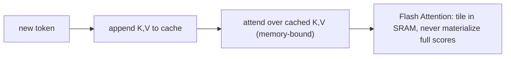

# KV Cache, Flash Attention и оптимизация inference

> Training параллелен и FLOP-bound. Inference последователен и memory-bound. Другой bottleneck, другие трюки.

**Тип:** Сборка
**Языки:** Python
**Предварительные требования:** Фаза 7 · 02 (self-attention), Фаза 7 · 05 (полный transformer), Фаза 7 · 07 (GPT)
**Время:** ~75 минут

## Цели обучения

- Считать память KV-кэша и реализовывать кэшированное авторегрессионное декодирование.
- Объяснять тайлинг Flash Attention и почему инференс упирается в память, а обучение — в FLOP.
- Размещать continuous batching и PagedAttention как выигрыши по латентности на этапе обслуживания.

## Проблема

Наивный autoregressive decoder делает `O(N²)` работы, чтобы сгенерировать `N` токенов: на каждом шаге он пересчитывает attention по всему prefix. Для ответа в 4K токенов это 16M attention operations, большинство из них избыточны. Каждое hidden state prefix token детерминировано после вычисления — нужно только прогнать query нового токена против cached keys and values всего, что было раньше.

Кроме того, сам attention перемещает много данных. Standard attention материализует N×N score matrix, N×d softmax output, N×d final output — слишком много чтений и записей в HBM. Для N≥2K attention становится memory-bound раньше, чем FLOP-bound. Классические attention kernels недоиспользуют современные GPUs в 4–10×.

Две оптимизации, обе от Dao et al., сдвинули frontier inference из "медленно" в "быстро":

1. **KV cache.** Хранить K и V vectors каждого prefix token. Attention каждого нового токена — это один query против cached keys. Inference сокращается с `O(N²)` до `O(N)` на generation step.
2. **Flash Attention.** Разбить attention computation на tiles так, чтобы полная N×N matrix никогда не попадала в HBM. Весь softmax + matmul происходит в SRAM. Ускорение wall-clock 2–4× на A100; 5–10× на H100 с FP8.

К 2026 году обе техники универсальны. Каждый production inference stack (vLLM, TensorRT-LLM, SGLang, llama.cpp) предполагает их наличие. Каждая frontier model поставляется с включенным Flash Attention.

## Концепция




### Математика KV cache

На decoder layer, на token, на head:

```
bytes_per_token_per_layer = 2 * d_head * dtype_size
                          ^
                          K and V
```

Для 7B model с 32 layers, 32 heads, d_head=128, fp16:

```
per token per layer = 2 * 128 * 2 = 512 bytes
per token (32 layers) = 16 KB
per 32K context = 512 MB
```

Для Llama 3 70B (80 layers, d_head=128, GQA with 8 KV heads):

```
per token per layer = 2 * 8 * 128 * 2 = 4096 bytes (4 KB)
per 32K context = 10.4 GB
```

Эти 10 GB — причина, по которой Llama 3 70B при 128K context требует большую часть 40 GB A100 только под KV cache при batch size 1.

**GQA — это выигрыш KV-cache.** MHA с 64 heads занял бы 32 GB. MLA сжимает еще сильнее.

### Flash Attention — трюк с tiling

Standard attention:

```
S = Q @ K^T          (HBM read, N×N, HBM write)
P = softmax(S)       (HBM read, HBM write)
O = P @ V            (HBM read, HBM write)
```

Три round trips в HBM. На H100 bandwidth HBM — 3 TB/s; SRAM — 30 TB/s. Каждый trip в HBM дает замедление примерно в 10 раз относительно удержания всего on-chip.

Flash Attention:

```
for each block of Q (tile size ~128 × 128):
    load Q_tile into SRAM
    for each block of K, V:
        load K_tile, V_tile into SRAM
        compute S_tile = Q_tile @ K_tile^T     (SRAM)
        running softmax aggregation             (SRAM)
        accumulate into O_tile                  (SRAM)
    write O_tile to HBM
```

Один HBM trip на tile. Total memory footprint падает с `O(N²)` до `O(N)`. Backward pass пересчитывает часть значений из forward pass вместо их хранения — еще один memory win.

**Численный трюк.** Running softmax поддерживает `(max, sum)` по tiles, поэтому финальная нормализация точна. Это не approximation — Flash Attention вычисляет bit-identical output к standard attention (с поправкой на fp16 non-associativity).

**Эволюция версий:**

| Версия | Год | Ключевое изменение | Ускорение на reference hardware |
|---------|------|-----------|-------------------------------|
| Flash 1 | 2022 | Tiled SRAM kernel | 2× на A100 |
| Flash 2 | 2023 | Лучше parallelism, causal-first ordering | 3× на A100 |
| Flash 3 | 2024 | Hopper asynchrony, FP8 | 1.5–2× на H100 (~740 TFLOPs FP16) |
| Flash 4 | 2026 | Blackwell 5-stage pipeline, software exp2 | Inference-first (сначала только forward) |

Flash 4 на запуске только для forward-pass. Training все еще использует Flash 3. Поддержка GQA и varlen для Flash 4 ожидается (mid-2026).

### Speculative decoding — другой выигрыш latency

Дешевая модель предлагает N токенов. Большая модель проверяет все N параллельно. Если verification принимает k токенов, вы заплатили 1 forward pass большой модели за k generations. Типично k=3–5 на code and prose.

Defaults 2026 года:
- **EAGLE 2 / Medusa.** Integrated draft heads, которые делят hidden states verifier. Ускорение 2–3× без потери качества.
- **Speculative decoding with draft model.** Ускорение 2–4× на consumer hardware.
- **Lookahead decoding.** Jacobi iteration; draft model не нужен. Нишево, но бесплатно.

### Continuous batching

Классический batched inference: ждать, пока самая медленная sequence завершится, затем запускать новый batch. GPU простаивает, когда короткие ответы заканчиваются раньше.

Continuous batching (сначала в Orca, теперь в vLLM, TensorRT-LLM, SGLang): подставлять новые requests в batch сразу, как только старые завершились. Gain throughput 5–10× для типичных chat workloads.

### PagedAttention — KV cache как virtual memory

Главная фича vLLM. KV cache выделяется blocks по 16 tokens; page table сопоставляет logical positions с physical blocks. Позволяет разделять KV между parallel samples (beam search, parallel sampling), hot-swap prefixes для prompt caching и defragment memory. Улучшение throughput в 4× относительно naive contiguous allocation.

## Соберите это

См. `code/main.py`. Мы реализуем:

1. Наивный incremental decoder `O(N²)`.
2. KV-cached decoder `O(N)`.
3. Tiled softmax, который симулирует running-max algorithm Flash Attention.

### Шаг 1: KV cache

```python
class KVCache:
    def __init__(self, n_layers, n_heads, d_head):
        self.K = [[[] for _ in range(n_heads)] for _ in range(n_layers)]
        self.V = [[[] for _ in range(n_heads)] for _ in range(n_layers)]

    def append(self, layer, head, k, v):
        self.K[layer][head].append(k)
        self.V[layer][head].append(v)

    def read(self, layer, head):
        return self.K[layer][head], self.V[layer][head]
```

Просто: накапливаем per-token K, V vectors в per-layer, per-head lists.

### Шаг 2: tiled softmax

```python
def tiled_softmax_dot(q, K, V, tile=4):
    """Flash-attention-style softmax(qK^T)V with running max/sum."""
    m = float("-inf")
    s = 0.0
    out = [0.0] * len(V[0])
    for start in range(0, len(K), tile):
        k_block = K[start:start + tile]
        v_block = V[start:start + tile]
        scores = [sum(qi * ki for qi, ki in zip(q, k)) for k in k_block]
        new_m = max(m, *scores)
        exp_old = math.exp(m - new_m) if m != float("-inf") else 0.0
        exp_new = [math.exp(sc - new_m) for sc in scores]
        s = s * exp_old + sum(exp_new)
        for j in range(len(out)):
            out[j] = out[j] * exp_old + sum(e * v[j] for e, v in zip(exp_new, v_block))
        m = new_m
    return [o / s for o in out]
```

Bit-identical output к `softmax(qK) V` за один проход, но в любой момент working set — это block `tile × d_head`, а не полный `N × d_head`.

### Шаг 3: сравните naive vs cached decoding при generation 100 токенов

Посчитайте attention operations. Naive: `O(N²)` = 5050. Cached: `O(N)` = 100. Код печатает оба значения.

## Используйте это

```python
# HuggingFace transformers auto-enables KV cache on decoder-only generate().
from transformers import AutoModelForCausalLM
model = AutoModelForCausalLM.from_pretrained(
    "meta-llama/Llama-3.2-3B",
    attn_implementation="flash_attention_2",  # use FA3 if Hopper
    torch_dtype="bfloat16",
)
# generate() uses KV cache automatically
```

Production в vLLM:

```bash
pip install vllm
vllm serve meta-llama/Llama-3.1-70B-Instruct \
    --tensor-parallel-size 4 \
    --max-model-len 32768 \
    --enable-prefix-caching \
    --kv-cache-dtype fp8
```

Prefix caching across requests — большой выигрыш 2026 года: тот же system prompt, few-shot examples или long context document повторно использует KV across calls. Для agent workloads с повторяющимися tool prompts prefix caching регулярно дает gain throughput 5×.

## Доведите до поставки

См. `outputs/skill-inference-optimizer.md`. Skill выбирает attention implementation, KV cache strategy, quantization и speculative decoding для нового inference deployment.

## Упражнения

1. **Легко.** Запустите `code/main.py`. Подтвердите, что naive и cached decoders производят одинаковый output; отметьте разницу op-count.
2. **Средне.** Реализуйте prefix caching: по prompt P и нескольким completions выполните один forward pass по P, чтобы заполнить KV cache, затем branch per-completion. Измерьте speedup относительно re-encoding P для каждого.
3. **Сложно.** Реализуйте toy PagedAttention: KV cache в fixed 16-token blocks с free-list. Когда sequence завершается, возвращайте ее blocks в pool. Симулируйте 1 000 chat completions разной длины. Сравните memory fragmentation с contiguous allocation.

## Ключевые термины

| Термин | Как говорят | Что это на самом деле значит |
|------|------------|-------------------------------|
| KV cache | "Трюк, ускоряющий decoding" | Сохраненные K и V от каждого prefix token; новые queries attend к ним вместо пересчета. |
| HBM | "Основная память GPU" | High Bandwidth Memory; 80 GB на H100, 192 GB на B200. ~3 TB/s bandwidth. |
| SRAM | "Память на чипе" | Быстрая per-SM memory, ~256 KB per SM на H100. ~30 TB/s bandwidth. |
| Flash Attention | "Tiled attention kernel" | Вычисляет attention без материализации N×N в HBM. |
| Continuous batching | "Batching без ожидания" | Swap finished sequences out, new ones in, без draining batch. |
| PagedAttention | "Главная идея vLLM" | KV cache в fixed blocks с page table; устраняет fragmentation. |
| Prefix caching | "Переиспользовать длинные prompts" | Cache KV для shared prefix across requests; major cost cut для agents. |
| Speculative decoding | "Черновик + проверка" | Cheap draft model предлагает tokens; big model проверяет k за один pass. |

## Дополнительное чтение

- [Dao et al. (2022). FlashAttention: Fast and Memory-Efficient Exact Attention with IO-Awareness](https://arxiv.org/abs/2205.14135) — Flash 1.
- [Dao (2023). FlashAttention-2: Faster Attention with Better Parallelism and Work Partitioning](https://arxiv.org/abs/2307.08691) — Flash 2.
- [Shah et al. (2024). FlashAttention-3: Fast and Accurate Attention with Asynchrony and Low-precision](https://arxiv.org/abs/2407.08608) — Flash 3.
- [FlashAttention-4 release notes (Dao-AILab, 2026)](https://github.com/Dao-AILab/flash-attention) — Blackwell 5-stage pipeline и software-exp2 trick; прочитайте README repo о forward-only launch caveats, которые упоминает урок.
- [Kwon et al. (2023). Efficient Memory Management for Large Language Model Serving with PagedAttention](https://arxiv.org/abs/2309.06180) — статья vLLM.
- [Leviathan et al. (2023). Fast Inference from Transformers via Speculative Decoding](https://arxiv.org/abs/2211.17192) — spec decoding.
- [Li et al. (2024). EAGLE: Speculative Sampling Requires Rethinking Feature Uncertainty](https://arxiv.org/abs/2401.15077) — статья EAGLE-1/2 об integrated-draft approach, который цитирует урок.
- [Cai et al. (2024). Medusa: Simple LLM Inference Acceleration Framework with Multiple Decoding Heads](https://arxiv.org/abs/2401.10774) — подход Medusa, упомянутый вместе с EAGLE.
- [vLLM docs — PagedAttention](https://docs.vllm.ai/en/latest/design/kernel/paged_attention.html) — canonical deep dive по 16-token block и page-table design.
