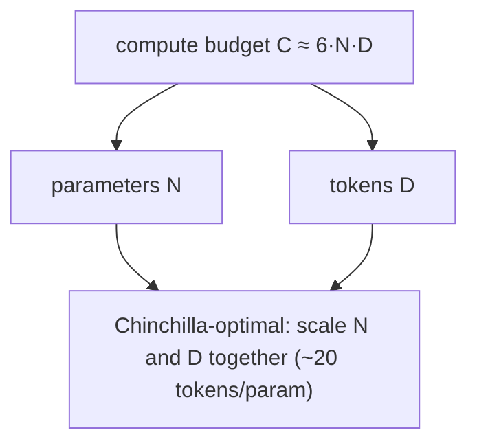

# Законы масштабирования

> Статья Kaplan 2020 сказала: больше model, ниже loss. Статья Hoffmann 2022 сказала: вы недообучали. Compute уходит в две корзины — parameters and tokens — и split не очевиден.

**Тип:** Изучение
**Языки:** Python
**Предварительные требования:** Фаза 7 · 05 (полный transformer), Фаза 7 · 07 (GPT)
**Время:** ~45 минут

## Цели обучения

- Формулировать закон Chinchilla (Hoffmann) и вычислять compute-оптимальное разделение параметров и токенов.
- Объяснять, почему лаборатории всё равно переобучают сверх compute-оптимума.
- Различать эмерджентность и плавное масштабирование и читать член неустранимой потери.

## Проблема

Когда у вас есть C FLOPs training compute и вы хотите лучшую модель, у вас два регулятора:

1. **Сколько parameters (N)?** Bigger model, higher capacity.
2. **Сколько training tokens (D)?** More data, better use of capacity.

FLOPs масштабируются примерно как `6 × N × D`. Можно увеличить N и уменьшить D, или увеличить D и уменьшить N. Что лучше?

До 2022 года ответ был "сильно увеличивать N." GPT-3 (2020) имела 175B parameters и обучалась на ~300B tokens. Ratio около 1.7 tokens per parameter. Scaling laws Kaplan это подтверждали.

Hoffmann et al. (2022), обучая небольшое семейство моделей Chinchilla, нашли другое: optimal ratio ближе к **20 tokens per parameter**. GPT-3 была недообучена в 10×. Chinchilla (70B params, 1.4T tokens) обошла GPT-3 (175B, 300B tokens) на каждом benchmark при inference cost в 2.5× меньше.

2026 — это мир Chinchilla с одним важным поворотом. Llama 3 8B обучалась на 15 trillion tokens, ratio 1 875 tokens per parameter. В девяносто четыре раза дальше Chinchilla-optimal. Inference cost важнее training cost для моделей, которые будут использоваться в масштабе, поэтому over-training (past Chinchilla) ради меньшего deployable footprint — default 2026 года.

## Концепция




### Закон Hoffmann

Из статьи Chinchilla, loss следует:

```
L(N, D) = A / N^α + B / D^β + E
```

- `N` = parameters (non-embedding).
- `D` = training tokens.
- `α ≈ 0.34`, `β ≈ 0.28` (примерно симметричны).
- `E ≈ 1.69`, irreducible loss ceiling.
- `A ≈ 406`, `B ≈ 411`.

Два terms обмениваются друг с другом при масштабировании. Возьмите derivative w.r.t. `N` при fixed compute (C = 6ND) и решите:

```
N_opt ≈ 0.6 × (C/6)^0.5
D_opt ≈ 0.6 × (C/6)^0.5
D_opt / N_opt ≈ 20
```

Compute-optimal: 20 tokens per parameter.

### Почему все равно over-training

Chinchilla-optimal минимизирует training loss per training FLOP. Но training cost вы платите один раз; inference cost — всегда.

Для chatbot, который обслуживает trillion tokens per month, inference dominates total cost. Подход Llama: train smaller, longer. 8B на 15T tokens глубоко inference-optimized:

- Помещается на consumer GPUs.
- Latency — fraction of 70B Chinchilla-optimal.
- Quality достаточно близко для большинства tasks.

Статья DeepMind 2024 года ("Over-training is the new optimal") формализовала это. Для inference-dominated workloads правильный ratio ближе к 100–500 tokens per parameter в зависимости от serving volume.

### Emergence vs smoothness

Утверждение: некоторые abilities (arithmetic, multi-step reasoning, chain-of-thought following) "emerge" внезапно на некотором scale.

Schaeffer et al. (2023) возразили, что это measurement artifact: emergent metrics используют discontinuous scoring (exact match, accuracy at threshold), который скрывает smooth improvement в underlying logits. Continuous metrics (cross-entropy) показывают smooth curves.

В 2026 году consensus: predictions via continuous loss надежны. Benchmark jumps часто являются scorer artifacts. Планируйте budgets по continuous metrics.

### Картина 2026

Scaling laws все еще работают, но:

| Фактор | Как изменилось |
|--------|---------------|
| Data quality | Отбор "хороших" tokens (в стиле Phi) сдвигает curves более чем на 2× effective compute |
| MoE | Total params отделяются от active FLOPs; scaling laws считаются per-active-FLOP |
| Post-training | Некоторые capabilities (instruction following, code) сдвигаются через SFT+RLHF сильнее, чем через pretraining |
| Multimodality | Image + text tokens масштабируются вместе; отдельные curves для каждой modality |
| Synthetic data | Модели генерируют обучающие данные; effective compute может накапливаться |

Optimizer Muon (Kimi Moonlight, 2024) показал ~2× effective-compute gain over AdamW при matched data. Некоторые training runs 2026 года используют Muon по умолчанию. Это меняет absolute constant в scaling law, не ее shape.

## Соберите это

См. `code/main.py`. Мы реализуем уравнение Chinchilla loss и решаем compute-optimal `(N, D)` для нескольких compute budgets.

### Шаг 1: Chinchilla loss

```python
def chinchilla_loss(N, D, A=406.4, B=410.7, alpha=0.34, beta=0.28, E=1.69):
    return A / N ** alpha + B / D ** beta + E
```

Постройте `L` как contour over `(N, D)` при fixed `C = 6ND`. Найдите минимум.

### Шаг 2: compute-optimal frontier

Для compute budgets от `1e17` до `1e25` FLOPs найдите `(N, D)`, которые minimize loss при условии `6ND = C`. Проверьте ratio `D/N ≈ 20`.

### Шаг 3: стоимость over-training

Вычислите extra loss, который вы платите, обучая модель в 10× меньше (1/10 optimal N, 10× optimal D). Выведите inference FLOP savings (proportional to N) взамен.

### Шаг 4: сравнить с реальными моделями

Подставьте известные пары `(N, D)` для GPT-3, Chinchilla, Llama 3 8B, DeepSeek-V3 (active params) и сравните predicted vs reported loss.

## Используйте это

Маловероятно, что вы сами будете обучать frontier model. Но scaling laws говорят:

1. **Достаточно ли данных у вашего fine-tune.** Если task-specific data ниже 20 tokens per param base model, ожидайте saturation на некотором loss floor.
2. **Выбирать ли bigger base model.** Если весь budget уходит на inference, предпочитайте smaller, longer-trained model.
3. **Где returns diminish.** За пределами 1000× Chinchilla-optimal изменения log-loss превращаются в шум.

**Research trajectory в 2026 году:**

- **Data-constrained regime.** У web конечное число high-quality tokens (~5–10 trillion English after filtering). Frontier pretraining приближается к этому потолку. Synthetic data, multilingual, multimodal и RLHF-scaled fine-tuning — следующие levers.
- **Compute-multiplier tricks.** Muon optimizer, MoE, better data curation — каждый сдвигает absolute constants, а не asymptote.
- **Scaling laws for RL.** Open question. Ранние данные предполагают power-law in RL samples, но с очень другими exponents, чем pretraining.

## Доведите до поставки

См. `outputs/skill-training-budget-estimator.md`. Skill выбирает `(N, D, hours, GPU)` для нового training run по compute budget, deployment constraints и target loss.

## Упражнения

1. **Легко.** Запустите `code/main.py`. Напечатайте Chinchilla-optimal `(N, D)` для compute budgets `1e20`, `1e22`, `1e24`. Сравните с таблицей реальных моделей.
2. **Средне.** Реализуйте Hoffmann loss-as-function-of-compute curve. Постройте loss vs `log10(C)` для compute-optimal frontier. Определите, когда закон предсказывает, что нам понадобится `>10^28` FLOPs для следующего снижения cross-entropy на 0.1.
3. **Сложно.** Fit your own scaling law на 5 tiny models (100K to 10M params), обученных на одном dataset. Оцените `α` и `E`. Насколько хорошо ваши exponents совпадают с published?

## Ключевые термины

| Термин | Как говорят | Что это на самом деле значит |
|------|------------|-------------------------------|
| Parameters (N) | "Размер модели" | Число non-embedding weights; определяет capacity. |
| Tokens (D) | "Обучающие данные" | Число training tokens seen; определяет, насколько хорошо используются parameters. |
| Compute (C) | "Потраченные FLOPs" | Примерно `6 × N × D` для standard transformer. |
| Chinchilla-optimal | "D/N ≈ 20" | Ratio, который минимизирует loss per FLOP of pretraining. |
| Over-training | "За пределами Chinchilla" | Потратить extra training FLOPs, чтобы сэкономить inference FLOPs; D/N >> 20. |
| Irreducible loss | "Нижняя граница" | Term `E` в scaling law; entropy of the data itself. |
| Emergent capability | "Внезапные скачки при масштабировании" | Часто scorer artifact; continuous loss smooth. |
| Effective compute | "Множитель эффективности обучения" | Better data / optimizer / architecture умножает, насколько далеко идет FLOP. |

## Дополнительное чтение

- [Kaplan et al. (2020). Scaling Laws for Neural Language Models](https://arxiv.org/abs/2001.08361) — первая статья о scaling law; undertrained.
- [Hoffmann et al. (2022). Training Compute-Optimal Large Language Models](https://arxiv.org/abs/2203.15556) — Chinchilla.
- [Schaeffer et al. (2023). Are Emergent Abilities of Large Language Models a Mirage?](https://arxiv.org/abs/2304.15004) — emergence как measurement artifact.
- [Sardana, Frankle (2024). Beyond Chinchilla-Optimal: Accounting for Inference in Language Model Scaling Laws](https://arxiv.org/abs/2401.00448) — почему over-training Llama правильный для ее workload.
- [Jordan et al. (2024). Muon: An optimizer for hidden layers in neural networks](https://kellerjordan.github.io/posts/muon/) — compute multiplier 2×.
