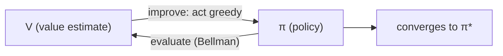

# Dynamic Programming — Policy Iteration & Value Iteration

> Dynamic programming — это RL с "читом". Вы уже знаете transition и reward functions; остается итерировать Bellman equation, пока `V` или `π` не перестанут меняться. Это benchmark, к которому стремится каждый sampling-based метод.

**Type:** Build
**Languages:** Python
**Prerequisites:** Phase 9 · 01 (MDPs)
**Time:** ~75 minutes

## Цели обучения

- Реализовывать оценку политики, улучшение политики и итерацию по ценности на GridWorld-MDP прямо из уравнения Беллмана.
- Объяснять, почему динамическому программированию нужна модель переходов и наград и почему оно — эталон для всех сэмплирующих методов.
- Распознавать оператор Беллмана как сжатие и объяснять, почему его итерация сходится.

## Проблема

У вас есть MDP с известной моделью: можно запросить `P(s' | s, a)` и `R(s, a, s')` для любой пары state-action. Inventory manager знает распределение спроса. Board game имеет детерминированные переходы. Gridworld — это четыре строки Python. У вас есть *model*.

Model-free RL (Q-learning, PPO, REINFORCE) был придуман для случая, где модели нет — вы можете только семплировать среду. Но когда модель есть, существуют более быстрые и точные методы: dynamic programming. Bellman разработал их в 1957 году. Они до сих пор задают критерий корректности: когда говорят "optimal policy for this MDP", имеют в виду policy, которую вернул бы DP.

В 2026 году они нужны по трем причинам. Во-первых, каждая tabular environment в RL research (GridWorld, FrozenLake, CliffWalking) решается DP, чтобы получить gold-standard policy. Во-вторых, точные values позволяют *debug* sampling methods: если оценка Q-learning для `V*(s_0)` расходится с DP-ответом на 30%, ошибка в Q-learning. В-третьих, современные offline RL и planning methods (MCTS, AlphaZero search, model-based RL в Phase 9 · 10) итерируют Bellman backup по learned или given model.

## Концепция




**Два алгоритма, оба — fixed-point iteration по Bellman.**

**Policy iteration.** Чередует два шага, пока policy не перестанет меняться.

1. *Evaluation:* для данной policy `π` вычислить `V^π`, многократно применяя `V(s) ← Σ_a π(a|s) Σ_{s',r} P(s',r|s,a) [r + γ V(s')]` до сходимости.
2. *Improvement:* по `V^π` сделать `π` greedy относительно `V^π`: `π(s) ← argmax_a Σ_{s',r} P(s',r|s,a) [r + γ V(s')]`.

Сходимость гарантирована, потому что (a) каждый improvement step либо оставляет `π` прежней, либо строго увеличивает `V^π` хотя бы для одного состояния, (b) пространство deterministic policies конечно. Обычно сходится за ~5–20 outer iterations даже для больших state spaces.

**Value iteration.** Сворачивает evaluation и improvement в один sweep. Применяйте Bellman *optimality* equation:

`V(s) ← max_a Σ_{s',r} P(s',r|s,a) [r + γ V(s')]`

Повторяйте, пока `max_s |V_{new}(s) - V(s)| < ε`. Policy извлекается в конце greedy action. Итерация дешевле — нет внутреннего evaluation loop — но обычно требуется больше итераций до сходимости.

**Generalized policy iteration (GPI).** Объединяющая рамка. Value function и policy находятся в двустороннем improvement loop; любой метод, который ведет обе к взаимной согласованности (async value iteration, modified policy iteration, Q-learning, actor-critic, PPO), является экземпляром GPI.

**Why `γ < 1` matters.** Bellman operator — это `γ`-contraction в sup-norm: `||T V - T V'||_∞ ≤ γ ||V - V'||_∞`. Contraction дает unique fixed point и geometric convergence. Уберите `γ < 1`, и гарантия исчезнет — нужен finite horizon или absorbing terminal state.

## Практика

### Step 1: build the GridWorld MDP model

Используйте тот же 4×4 GridWorld из Lesson 01. Добавим stochastic variant: с вероятностью `0.1` агент соскальзывает в случайное perpendicular direction.

```python
SLIP = 0.1

def transitions(state, action):
    if state == TERMINAL:
        return [(state, 0.0, 1.0)]
    outcomes = []
    for direction, prob in action_probs(action):
        outcomes.append((apply_move(state, direction), -1.0, prob))
    return outcomes
```

`transitions(s, a)` возвращает список `(s', r, p)`. Это вся модель.

### Step 2: policy evaluation

Для policy `π(s) = {action: prob}` итерируйте Bellman equation, пока `V` не перестанет меняться:

```python
def policy_evaluation(policy, gamma=0.99, tol=1e-6):
    V = {s: 0.0 for s in states()}
    while True:
        delta = 0.0
        for s in states():
            v = sum(pi_a * sum(p * (r + gamma * V[s_prime])
                              for s_prime, r, p in transitions(s, a))
                   for a, pi_a in policy(s).items())
            delta = max(delta, abs(v - V[s]))
            V[s] = v
        if delta < tol:
            return V
```

### Step 3: policy improvement

Замените `π` на greedy policy относительно `V`. Если `π` не изменилась, возвращайте результат — мы в optimum.

```python
def policy_improvement(V, gamma=0.99):
    new_policy = {}
    for s in states():
        best_a = max(
            ACTIONS,
            key=lambda a: sum(p * (r + gamma * V[s_prime])
                              for s_prime, r, p in transitions(s, a)),
        )
        new_policy[s] = best_a
    return new_policy
```

### Step 4: stitch them together

```python
def policy_iteration(gamma=0.99):
    policy = {s: "up" for s in states()}   # arbitrary start
    for _ in range(100):
        V = policy_evaluation(lambda s: {policy[s]: 1.0}, gamma)
        new_policy = policy_improvement(V, gamma)
        if new_policy == policy:
            return V, policy
        policy = new_policy
```

Типичная сходимость на 4×4: 4–6 outer iterations. Выводит `V*(0,0) ≈ -6` и policy, которая строго уменьшает число шагов.

### Step 5: value iteration (the one-loop version)

```python
def value_iteration(gamma=0.99, tol=1e-6):
    V = {s: 0.0 for s in states()}
    while True:
        delta = 0.0
        for s in states():
            v = max(sum(p * (r + gamma * V[s_prime])
                       for s_prime, r, p in transitions(s, a))
                   for a in ACTIONS)
            delta = max(delta, abs(v - V[s]))
            V[s] = v
        if delta < tol:
            break
    policy = policy_improvement(V, gamma)
    return V, policy
```

Та же fixed point, меньше строк кода.

## Pitfalls

- **Forgetting to handle terminals.** Если применять Bellman к absorbing state, он все равно выберет "best action", которое ничего не меняет. Защититесь `if s == terminal: V[s] = 0`.
- **Sup-norm vs L2 convergence.** Используйте `max |V_new - V|`, а не среднее. Теоретическая гарантия дана для sup-norm.
- **In-place vs synchronous updates.** Обновление `V[s]` in-place (Gauss-Seidel) сходится быстрее, чем отдельный `V_new` dict (Jacobi). Production code использует in-place.
- **Policy ties.** Если два действия имеют равный Q-value, `argmax` может по-разному разрешать tie на каждой итерации, и проверка "policy stable" начнет осциллировать. Используйте stable tie-break (первое действие в фиксированном порядке).
- **State-space explosion.** DP стоит `O(|S| · |A|)` на sweep. Работает примерно до ~10⁷ states. Дальше нужна function approximation (Phase 9 · 05 onwards).

## Использование

В 2026 году DP — correctness baseline и inner loop planners:

| Use case | Method |
|----------|--------|
| Solve a small tabular MDP exactly | Value iteration (simpler) or policy iteration (fewer outer steps) |
| Verify a Q-learning / PPO implementation | Compare to DP-optimal V* on a toy environment |
| Model-based RL (Phase 9 · 10) | Bellman backup on a learned transition model |
| Planning in AlphaZero / MuZero | Monte Carlo Tree Search = async Bellman backup |
| Offline RL (CQL, IQL) | Conservative Q-iteration — DP with a penalty on OOD actions |

Каждый раз, когда кто-то говорит "the optimal value function", имеется в виду "the DP fixed point". Когда видите `V*` или `Q*` в paper, представляйте этот loop.

## Результат

Сохраните как `outputs/skill-dp-solver.md`:

```markdown
---
name: dp-solver
description: Solve a small tabular MDP exactly via policy iteration or value iteration. Report convergence behavior.
version: 1.0.0
phase: 9
lesson: 2
tags: [rl, dynamic-programming, bellman]
---

Given an MDP with a known model, output:

1. Choice. Policy iteration vs value iteration. Reason tied to |S|, |A|, γ.
2. Initialization. V_0, starting policy. Convergence sensitivity.
3. Stopping. Sup-norm tolerance ε. Expected number of sweeps.
4. Verification. V*(s_0) computed exactly. Greedy policy extracted.
5. Use. How this baseline will be used to debug/evaluate sampling-based methods.

Refuse to run DP on state spaces > 10⁷. Refuse to claim convergence without a sup-norm check. Flag any γ ≥ 1 on an infinite-horizon task as a guarantee violation.
```

## Упражнения

1. **Легко.** Запустите value iteration на 4×4 GridWorld с `γ ∈ {0.9, 0.99}`. Сколько sweeps нужно до `max |ΔV| < 1e-6`? Выведите `V*` как сетку 4×4.
2. **Средне.** Сравните policy iteration и value iteration на *stochastic* GridWorld (slip probability `0.1`). Посчитайте sweeps, wall-clock time, final `V*(0,0)`. Что сходится быстрее по итерациям? По wall-clock?
3. **Сложно.** Постройте modified policy iteration: в evaluation step запускайте только `k` sweeps вместо сходимости. Постройте график ошибки `V*(0,0)` vs `k` для `k ∈ {1, 2, 5, 10, 50}`. Что кривая говорит о tradeoff между evaluation и improvement?

## Ключевые термины

| Термин | Как говорят | Что это на самом деле означает |
|------|----------------|----------------------|
| Policy iteration | "DP algorithm" | Чередование evaluation (`V^π`) и improvement (greedy `π` относительно `V^π`) до стабилизации policy. |
| Value iteration | "Faster DP" | Bellman optimality backup в один sweep; геометрически сходится к `V*`. |
| Bellman operator | "The recursion" | `(T V)(s) = max_a Σ P (r + γ V(s'))`; `γ`-contraction in sup-norm. |
| Contraction | "Why DP converges" | Любой operator `T` с `||T x - T y|| ≤ γ ||x - y||` имеет unique fixed point. |
| GPI | "Everything is DP" | Generalized Policy Iteration: любой метод, который ведет `V` и `π` к mutual consistency. |
| Synchronous update | "Jacobi-style" | Использовать старую `V` весь sweep; проще анализировать, но медленнее. |
| In-place update | "Gauss-Seidel-style" | Использовать `V` по мере обновления; быстрее сходится на практике. |

## Дополнительное чтение

- [Sutton & Barto (2018). Ch. 4 — Dynamic Programming](http://incompleteideas.net/book/RLbook2020.pdf) — каноническое изложение policy iteration and value iteration.
- [Bertsekas (2019). Reinforcement Learning and Optimal Control](http://www.athenasc.com/rlbook.html) — строгий разбор contraction-mapping arguments.
- [Puterman (2005). Markov Decision Processes](https://onlinelibrary.wiley.com/doi/book/10.1002/9780470316887) — modified policy iteration и анализ сходимости.
- [Howard (1960). Dynamic Programming and Markov Processes](https://mitpress.mit.edu/9780262582300/dynamic-programming-and-markov-processes/) — оригинальная paper по policy iteration.
- [Bertsekas & Tsitsiklis (1996). Neuro-Dynamic Programming](http://www.athenasc.com/ndpbook.html) — мост от DP к approximate-DP / deep RL, используемый во всех следующих уроках.
