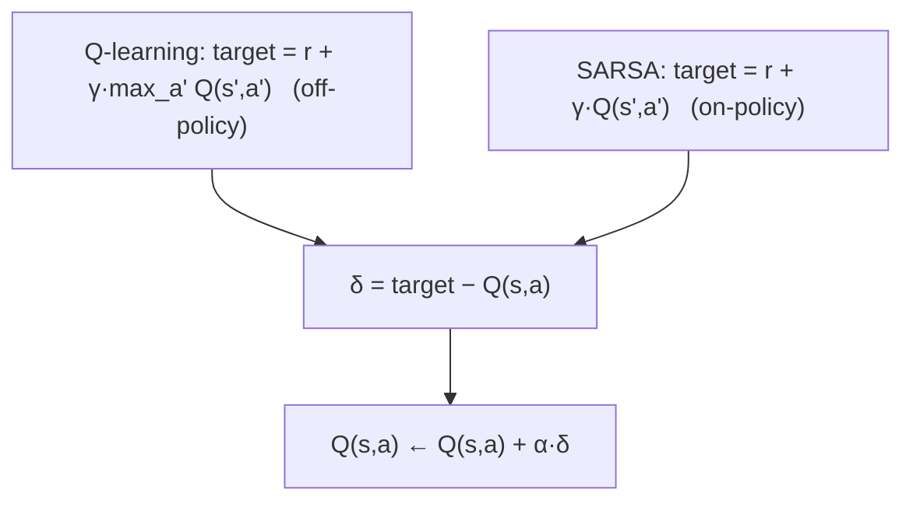

# Temporal Difference — Q-Learning & SARSA

> Monte Carlo ждет конца episode. TD обновляется после каждого шага, bootstrapping следующую value estimate. Q-learning — off-policy и optimistic; SARSA — on-policy и осторожнее. Оба алгоритма — одна строка кода. Оба лежат под каждым deep-RL методом в этой фазе.

**Type:** Build
**Languages:** Python
**Prerequisites:** Phase 9 · 01 (MDPs), Phase 9 · 02 (Dynamic Programming), Phase 9 · 03 (Monte Carlo)
**Time:** ~75 minutes

## Цели обучения

- Реализовывать Q-learning (off-policy) и SARSA (on-policy) как однострочные TD-обновления.
- Объяснять TD-ошибку и бутстрэппинг и почему Q-learning оптимистичен, а SARSA осторожен.
- Диагностировать смещение максимизации и называть лекарство (Double Q-learning).

## Проблема

Monte Carlo работает, но требует двух дорогих вещей. Episodes должны завершаться, и обновление возможно только после получения final return. Если episode длится 1,000 steps, MC ждет 1,000 steps, прежде чем что-либо обновить. Это high-variance, low-bias и на практике медленно.

Dynamic programming имеет противоположный профиль — zero-variance bootstrapped backups — но требует известную model.

Temporal difference (TD) learning занимает середину. Из одного transition `(s, a, r, s')` формируется one-step target `r + γ V(s')`, и `V(s)` сдвигается к нему. Нет model. Нет complete episodes. Есть bias из-за approximate `V` в RHS, но variance намного ниже, чем у MC, а online updates начинаются с первого шага.

На этом повороте стоит весь modern RL — DQN, A2C, PPO, SAC. Остальная Phase 9 — это слои function approximation и tricks поверх one-step TD update, который вы напишете здесь.

## Концепция




**The TD(0) update for V:**

`V(s) ← V(s) + α [r + γ V(s') - V(s)]`

Величина в скобках — TD error `δ = r + γ V(s') - V(s)`. Это online analogue of `G_t - V(s_t)` в MC. Для сходимости нужно, чтобы `α` удовлетворял Robbins-Monro (`Σ α = ∞`, `Σ α² < ∞`) и все states посещались бесконечно часто.

**Q-learning.** Off-policy TD method for control:

`Q(s, a) ← Q(s, a) + α [r + γ max_{a'} Q(s', a') - Q(s, a)]`

`max` предполагает, что от `s'` далее будет следовать *greedy* policy, независимо от того, какое действие агент реально выберет. Это разделение позволяет Q-learning учить `Q*`, пока агент explores через ε-greedy. Mnih et al. (2015) превратили это в deep Q-learning на Atari (Lesson 05).

**SARSA.** On-policy TD method:

`Q(s, a) ← Q(s, a) + α [r + γ Q(s', a') - Q(s, a)]`

Название — tuple `(s, a, r, s', a')`. SARSA использует действие `a'`, которое агент *реально* выбирает следующим, а не greedy `argmax`. Сходится к `Q^π` для текущей ε-greedy `π`, которая в пределе `ε → 0` становится `Q*`.

**The cliff-walking difference.** В classic cliff-walking task (fall-off-cliff = reward -100) Q-learning учит optimal path вдоль края cliff, но иногда получает penalty во время exploration. SARSA учит более safe path на один шаг дальше от cliff, потому что учитывает exploration noise в Q-value. При training оба достигают optimum при `ε → 0`. На практике это важно: если exploration реально происходит на deployment, поведение SARSA консервативнее.

**Expected SARSA.** Замените `Q(s', a')` на expected value under `π`:

`Q(s, a) ← Q(s, a) + α [r + γ Σ_{a'} π(a'|s') Q(s', a') - Q(s, a)]`

Variance ниже, чем у SARSA (нет sample of `a'`), target тот же on-policy. Часто это default в современных учебниках.

**n-step TD and TD(λ).** Интерполируют между TD(0) и MC, ожидая `n` steps перед bootstrapping. `n=1` — TD, `n=∞` — MC. TD(λ) усредняет все `n` с geometric weights `(1-λ)λ^{n-1}`. Большинство deep-RL использует `n` между 3 и 20.

## Практика

### Step 1: SARSA on ε-greedy policy

```python
def sarsa(env, episodes, alpha=0.1, gamma=0.99, epsilon=0.1):
    Q = defaultdict(lambda: {a: 0.0 for a in ACTIONS})

    def choose(s):
        if random() < epsilon:
            return choice(ACTIONS)
        return max(Q[s], key=Q[s].get)

    for _ in range(episodes):
        s = env.reset()
        a = choose(s)
        while True:
            s_next, r, done = env.step(s, a)
            a_next = choose(s_next) if not done else None
            target = r + (gamma * Q[s_next][a_next] if not done else 0.0)
            Q[s][a] += alpha * (target - Q[s][a])
            if done:
                break
            s, a = s_next, a_next
    return Q
```

Восемь строк. *Единственное* отличие от Q-learning — строка target.

### Step 2: Q-learning

```python
def q_learning(env, episodes, alpha=0.1, gamma=0.99, epsilon=0.1):
    Q = defaultdict(lambda: {a: 0.0 for a in ACTIONS})
    for _ in range(episodes):
        s = env.reset()
        while True:
            a = choose(s, Q, epsilon)
            s_next, r, done = env.step(s, a)
            target = r + (gamma * max(Q[s_next].values()) if not done else 0.0)
            Q[s][a] += alpha * (target - Q[s][a])
            if done:
                break
            s = s_next
    return Q
```

`max` отделяет target от behavior. Этот один символ — разница между on-policy и off-policy.

### Step 3: learning curves

Отслеживайте mean return per 100 episodes. Q-learning быстрее сходится на простом deterministic GridWorld; SARSA более консервативна на cliff-walking. На 4×4 GridWorld в `code/main.py` оба почти optimal после ~2,000 episodes при `α=0.1, ε=0.1`.

### Step 4: compare to DP truth

Запустите value iteration (Lesson 02), чтобы получить `Q*`. Проверьте `max_{s,a} |Q_learned(s,a) - Q*(s,a)|`. Здоровый tabular TD agent попадает в пределах `~0.5` на 4×4 GridWorld после 10,000 episodes.

## Pitfalls

- **Initial Q values matter.** Optimistic init (`Q = 0` для negative-reward task) encourages exploration. Pessimistic init может навсегда запереть greedy policy.
- **α schedule.** Constant `α` подходит для non-stationary problems. Decaying `α_n = 1/n` дает theoretical convergence, но на практике слишком медленен — держите `α` в `[0.05, 0.3]` и смотрите learning curve.
- **ε schedule.** Начинайте высоко (`ε=1.0`), снижайте до `ε=0.05`. "GLIE" (greedy in the limit with infinite exploration) — условие сходимости.
- **Max bias in Q-learning.** Operator `max` имеет upward bias, когда `Q` noisy. Это ведет к overestimation — Hasselt's Double Q-learning (used by DDQN in Lesson 05) чинит это двумя Q tables.
- **Non-terminating episodes.** TD может учиться без terminals, но нужно либо cap steps, либо корректно bootstrap at cap. Standard: treat cap as non-terminal, keep bootstrapping.
- **State hashing.** Если states — tuples/tensors, используйте hashable key (tuple, not list; tuple of floats rounded, not raw).

## Использование

TD landscape в 2026:

| Task | Method | Reason |
|------|--------|--------|
| Small tabular environments | Q-learning | Learns optimal policy directly. |
| On-policy safety-critical | SARSA / Expected SARSA | Conservative during exploration. |
| High-dimensional state | DQN (Phase 9 · 05) | Neural-net Q-function with replay and target net. |
| Continuous actions | SAC / TD3 (Phase 9 · 07) | TD update on a Q-network; policy net emits actions. |
| LLM RL (reward-model-based) | PPO / GRPO (Phase 9 · 08, 12) | Actor-critic with TD-style advantage via GAE. |
| Offline RL | CQL / IQL (Phase 9 · 08) | Q-learning with conservative regularization. |

Девяносто процентов "RL", о котором вы читаете в papers 2026 года, — это какая-то надстройка над Q-learning или SARSA. Поймите tabular update руками, прежде чем идти глубже.

## Результат

Сохраните как `outputs/skill-td-agent.md`:

```markdown
---
name: td-agent
description: Pick between Q-learning, SARSA, Expected SARSA for a tabular or small-feature RL task.
version: 1.0.0
phase: 9
lesson: 4
tags: [rl, td-learning, q-learning, sarsa]
---

Given a tabular or small-feature environment, output:

1. Algorithm. Q-learning / SARSA / Expected SARSA / n-step variant. One-sentence reason tied to on-policy vs off-policy and variance.
2. Hyperparameters. α, γ, ε, decay schedule.
3. Initialization. Q_0 value (optimistic vs zero) and justification.
4. Convergence diagnostic. Target learning curve, `|Q - Q*|` check if DP is possible.
5. Deployment caveat. How will exploration behave at inference? Is SARSA's conservatism needed?

Refuse to apply tabular TD to state spaces > 10⁶. Refuse to ship a Q-learning agent without a max-bias caveat. Flag any agent trained with ε held at 1.0 throughout (no exploitation phase).
```

## Упражнения

1. **Легко.** Реализуйте Q-learning и SARSA на 4×4 GridWorld. Постройте learning curves (mean return per 100 episodes) для 2,000 episodes. Кто сходится быстрее?
2. **Средне.** Постройте cliff-walking environment (4×12, last row is the cliff with reward -100 and reset to start). Сравните final policies Q-learning и SARSA. Сделайте screenshot путей. Кто идет ближе к cliff?
3. **Сложно.** Реализуйте Double Q-learning. На noisy-reward GridWorld (Gaussian noise σ=5 added to per-step reward) покажите, что Q-learning заметно overestimates `V*(0,0)`, а Double Q-learning — нет.

## Ключевые термины

| Термин | Как говорят | Что это на самом деле означает |
|------|----------------|----------------------|
| TD error | "The update signal" | `δ = r + γ V(s') - V(s)`, bootstrapped residual. |
| TD(0) | "One-step TD" | Обновление после каждого transition, используя только estimate следующего state. |
| Q-learning | "Off-policy RL 101" | TD update с `max` over next-state actions; учит `Q*` независимо от behavior policy. |
| SARSA | "On-policy Q-learning" | TD update с actual next action; учит `Q^π` для текущей ε-greedy π. |
| Expected SARSA | "The low-variance SARSA" | Заменяет sampled `a'` на expectation under π. |
| GLIE | "Correct exploration schedule" | Greedy in the Limit with Infinite Exploration; нужно для convergence Q-learning. |
| Bootstrapping | "Using current estimate in the target" | То, что отличает TD от MC. Источник bias, но огромного variance reduction. |
| Maximization bias | "Q-learning overestimates" | `max` over noisy estimates biased upward; чинится Double Q-learning. |

## Дополнительное чтение

- [Watkins & Dayan (1992). Q-learning](https://link.springer.com/article/10.1007/BF00992698) — original paper and convergence proof.
- [Sutton & Barto (2018). Ch. 6 — Temporal-Difference Learning](http://incompleteideas.net/book/RLbook2020.pdf) — TD(0), SARSA, Q-learning, Expected SARSA.
- [Hasselt (2010). Double Q-learning](https://papers.nips.cc/paper_files/paper/2010/hash/091d584fced301b442654dd8c23b3fc9-Abstract.html) — fix for maximization bias.
- [Seijen, Hasselt, Whiteson, Wiering (2009). A Theoretical and Empirical Analysis of Expected SARSA](https://ieeexplore.ieee.org/document/4927542) — expected SARSA motivation.
- [Rummery & Niranjan (1994). On-line Q-learning using connectionist systems](https://www.researchgate.net/publication/2500611_On-Line_Q-Learning_Using_Connectionist_Systems) — paper, где был введен SARSA (тогда "modified connectionist Q-learning").
- [Sutton & Barto (2018). Ch. 7 — n-step Bootstrapping](http://incompleteideas.net/book/RLbook2020.pdf) — обобщает TD(0) до TD(n), путь от Q-learning к eligibility traces и позже к GAE in PPO.
