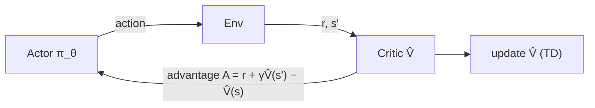

# Actor-Critic — A2C and A3C

> REINFORCE шумный. Добавьте critic, который учит `V̂(s)`, вычтите его из return, и получите advantage с тем же expectation, но намного меньшей variance. Это actor-critic. A2C выполняет его synchronously; A3C — across threads. Оба являются mental model для каждого современного deep-RL метода.

**Type:** Build
**Languages:** Python
**Prerequisites:** Phase 9 · 04 (TD Learning), Phase 9 · 06 (REINFORCE)
**Time:** ~75 minutes

## Цели обучения

- Добавлять обучаемого критика, чтобы превращать возвраты в низкодисперсные advantage, и реализовывать n-шаговое A2C-обновление.
- Объяснять, как advantage сохраняет матожидание policy gradient, снижая его дисперсию.
- Противопоставлять A2C (синхронный) и A3C (потоковый) способы параллелизации.

## Проблема

Vanilla REINFORCE работает, но variance ужасна. Monte Carlo returns `G_t` могут отличаться между episodes более чем в 10 раз. Умножение этого шума на `∇ log π` и усреднение дает gradient estimator, которому нужны тысячи episodes, чтобы сдвинуть policy настолько же, насколько ее можно сдвинуть намного меньшим числом DQN updates.

Variance возникает из raw returns. Если вычесть baseline `b(s_t)` — любую функцию state, включая learned value — expectation не изменится, а variance снизится. Лучший tractable baseline — `V̂(s_t)`. Теперь величина, умножаемая на `∇ log π`, называется *advantage*:

`A(s, a) = G - V̂(s)`

Action хорош, если дал return выше среднего, и плох, если ниже. REINFORCE с learned critic — это *actor-critic*. Critic дает actor low-variance teacher. Это каждый deep-policy method после 2015 (A2C, A3C, PPO, SAC, IMPALA).

## Концепция




**Две сети, один shared loss:**

- **Actor** `π_θ(a | s)`: policy. Sampled to act. Trained with policy gradient.
- **Critic** `V_φ(s)`: оценивает expected return from state. Trained to minimize `(V_φ(s) - target)²`.

**The advantage.** Две стандартные формы:

- *MC advantage:* `A_t = G_t - V_φ(s_t)`. Unbiased, higher variance.
- *TD advantage:* `A_t = r_{t+1} + γ V_φ(s_{t+1}) - V_φ(s_t)`. Biased (uses `V_φ`), far lower variance. Также называется *TD residual* `δ_t`.

**n-step advantage.** Интерполяция между ними:

`A_t^{(n)} = r_{t+1} + γ r_{t+2} + … + γ^{n-1} r_{t+n} + γ^n V_φ(s_{t+n}) - V_φ(s_t)`

`n = 1` — pure TD. `n = ∞` — MC. Большинство implementations использует `n = 5` для Atari, `n = 2048` для PPO on MuJoCo.

**Generalized Advantage Estimation (GAE).** Schulman et al. (2016) предложили exponentially weighted average по всем n-step advantages:

`A_t^{GAE} = Σ_{l=0}^{∞} (γλ)^l δ_{t+l}`

с `λ ∈ [0, 1]`. `λ = 0` — TD (low variance, high bias). `λ = 1` — MC (high variance, unbiased). `λ = 0.95` — default 2026 года; подбирайте, пока bias/variance dial не окажется в нужном месте.

**A2C: synchronous advantage actor-critic.** Соберите `T` steps across `N` parallel environments. Посчитайте advantages для каждого step. Обновите actor и critic на combined batch. Повторите. Более простой и scalable sibling of A3C.

**A3C: asynchronous advantage actor-critic.** Mnih et al. (2016). Запустите `N` worker threads, у каждого своя env. Каждый worker локально считает gradients на своем rollout, затем asynchronously применяет их к shared parameter server. Replay buffer не нужен — workers decorrelate за счет разных trajectories. A3C показал, что можно train on CPUs at scale. В 2026 GPU-based A2C (batched parallel envs) dominates, потому что GPUs требуют large batches.

**The combined loss.**

`L(θ, φ) = -E[ A_t · log π_θ(a_t | s_t) ]  +  c_v · E[(V_φ(s_t) - G_t)²]  -  c_e · E[H(π_θ(·|s_t))]`

Три terms: policy-gradient loss, value regression, entropy bonus. `c_v ~ 0.5`, `c_e ~ 0.01` — canonical starting points.

## Практика

### Step 1: a critic

Linear critic `V_φ(s) = w · features(s)` updated with MSE:

```python
def critic_update(w, x, target, lr):
    v_hat = dot(w, x)
    err = target - v_hat
    for j in range(len(w)):
        w[j] += lr * err * x[j]
    return v_hat
```

На tabular env critic сходится за несколько сотен episodes. На Atari замените linear critic на shared CNN trunk + value head.

### Step 2: n-step advantage

Для rollout length `T` и bootstrapped final `V(s_T)`:

```python
def compute_advantages(rewards, values, gamma=0.99, lam=0.95, last_value=0.0):
    advantages = [0.0] * len(rewards)
    gae = 0.0
    for t in reversed(range(len(rewards))):
        next_v = values[t + 1] if t + 1 < len(values) else last_value
        delta = rewards[t] + gamma * next_v - values[t]
        gae = delta + gamma * lam * gae
        advantages[t] = gae
    returns = [a + v for a, v in zip(advantages, values)]
    return advantages, returns
```

`returns` — target для critic. `advantages` — то, что умножает `∇ log π`.

### Step 3: combined update

```python
for step_i, (x, a, _r, probs) in enumerate(traj):
    adv = advantages[step_i]
    target_v = returns[step_i]

    # critic
    critic_update(w, x, target_v, lr_v)

    # actor
    for i in range(N_ACTIONS):
        grad_logpi = (1.0 if i == a else 0.0) - probs[i]
        for j in range(N_FEAT):
            theta[i][j] += lr_a * adv * grad_logpi * x[j]
```

On-policy, one rollout per update, separate learning rates for actor and critic.

### Step 4: parallelization (A3C vs A2C)

- **A3C:** запустите `N` threads. Каждый выполняет свою env и forward pass. Periodically push gradient updates to a shared master. Locks на master не нужны — races are ok, они просто добавляют noise.
- **A2C:** запустите `N` env instances в одном process, stack observations в `[N, obs_dim]` batch, batched forward pass, batched backward pass. Higher GPU utilization, deterministic, проще reasoning. Default в 2026.

Toy code single-threaded для ясности; переписать в batched A2C — три строки numpy.

## Pitfalls

- **Critic bias before actor gradient.** Если critic random, baseline неинформативен, и вы train on pure noise. Warm up critic несколько сотен steps перед policy gradient или используйте slow actor learning rate.
- **Advantage normalization.** Normalize advantages до zero-mean/unit-std per batch. Сильно стабилизирует training почти бесплатно.
- **Shared trunk.** Для image inputs используйте shared feature extractor for actor and critic. Separate heads. Shared features получают benefit от обоих losses.
- **On-policy contract.** A2C uses data ровно for one update. Больше — gradient biased (importance-sampling correction — то, что добавляет PPO).
- **Entropy collapse.** Без `c_e > 0` policy становится near-deterministic за несколько сотен updates и перестает exploring.
- **Reward scale.** Advantage magnitudes зависят от reward scale. Normalize rewards (например, running-std dividing) для consistent gradient magnitudes across tasks.

## Использование

A2C/A3C редко финальный выбор в 2026, но это architecture, которую уточняют все следующие методы:

| Method | Relation to A2C |
|--------|----------------|
| PPO | A2C + clipped importance ratio for multi-epoch updates |
| IMPALA | A3C + V-trace off-policy correction |
| SAC (Phase 9 · 07) | Off-policy A2C with a soft-value critic (next lesson) |
| GRPO (Phase 9 · 12) | A2C without the critic — group-relative advantage |
| DPO | A2C collapsed into a preference-ranking loss, no sampling |
| AlphaStar / OpenAI Five | A2C with league training + imitation pre-training |

Если видите "advantage" в paper 2026 года, думайте actor-critic.

## Результат

Сохраните как `outputs/skill-actor-critic-trainer.md`:

```markdown
---
name: actor-critic-trainer
description: Produce an A2C / A3C / GAE configuration for a given environment, with advantage estimation and loss weights specified.
version: 1.0.0
phase: 9
lesson: 7
tags: [rl, actor-critic, gae]
---

Given an environment and compute budget, output:

1. Parallelism. A2C (GPU batched) vs A3C (CPU async) and the number of workers.
2. Rollout length T. Steps per env per update.
3. Advantage estimator. n-step or GAE(λ); specify λ.
4. Loss weights. `c_v` (value), `c_e` (entropy), gradient clip.
5. Learning rates. Actor and critic (separate if using).

Refuse single-worker A2C on environments with horizon > 1000 (too on-policy, too slow). Refuse to ship without advantage normalization. Flag any run with `c_e = 0` and observed entropy < 0.1 as entropy-collapsed.
```

## Упражнения

1. **Легко.** Train actor-critic with MC advantage (`G_t - V(s_t)`) on 4×4 GridWorld. Compare sample efficiency to REINFORCE-with-running-mean-baseline from Lesson 06.
2. **Средне.** Switch to TD-residual advantage (`r + γ V(s') - V(s)`). Measure variance of the advantage batches. By how much does it drop?
3. **Сложно.** Implement GAE(λ). Sweep `λ ∈ {0, 0.5, 0.9, 0.95, 1.0}`. Plot final return vs sample efficiency. Where is the bias/variance sweet spot for this task?

## Ключевые термины

| Термин | Как говорят | Что это на самом деле означает |
|------|----------------|----------------------|
| Actor | "The policy net" | `π_θ(a|s)`, updated by policy gradient. |
| Critic | "The value net" | `V_φ(s)`, updated by MSE regression to returns / TD targets. |
| Advantage | "How much better than average" | `A(s, a) = Q(s, a) - V(s)` or its estimators. Multiplier for `∇ log π`. |
| TD residual | "δ" | `δ_t = r + γ V(s') - V(s)`; one-step advantage estimate. |
| GAE | "The interpolation knob" | Exponentially weighted sum of n-step advantages, parameterized by `λ`. |
| A2C | "Synchronous actor-critic" | Batched across envs; one gradient step per rollout. |
| A3C | "Async actor-critic" | Worker threads push gradients to a shared param server. Original paper; less common in 2026. |
| Bootstrap | "Use V at the horizon" | Truncate the rollout, add `γ^n V(s_{t+n})` to close the sum. |

## Дополнительное чтение

- [Mnih et al. (2016). Asynchronous Methods for Deep Reinforcement Learning](https://arxiv.org/abs/1602.01783) — A3C, original async actor-critic paper.
- [Schulman et al. (2016). High-Dimensional Continuous Control Using Generalized Advantage Estimation](https://arxiv.org/abs/1506.02438) — GAE.
- [Sutton & Barto (2018). Ch. 13 — Actor-Critic Methods](http://incompleteideas.net/book/RLbook2020.pdf) — foundations; combine with Ch. 9 on function approximation when critic is a neural net.
- [Espeholt et al. (2018). IMPALA](https://arxiv.org/abs/1802.01561) — scalable distributed actor-critic with V-trace off-policy correction.
- [OpenAI Baselines / Stable-Baselines3](https://stable-baselines3.readthedocs.io/) — production A2C/PPO implementations worth reading.
- [Konda & Tsitsiklis (2000). Actor-Critic Algorithms](https://papers.nips.cc/paper/1786-actor-critic-algorithms) — foundational convergence result for two-timescale actor-critic decomposition.
