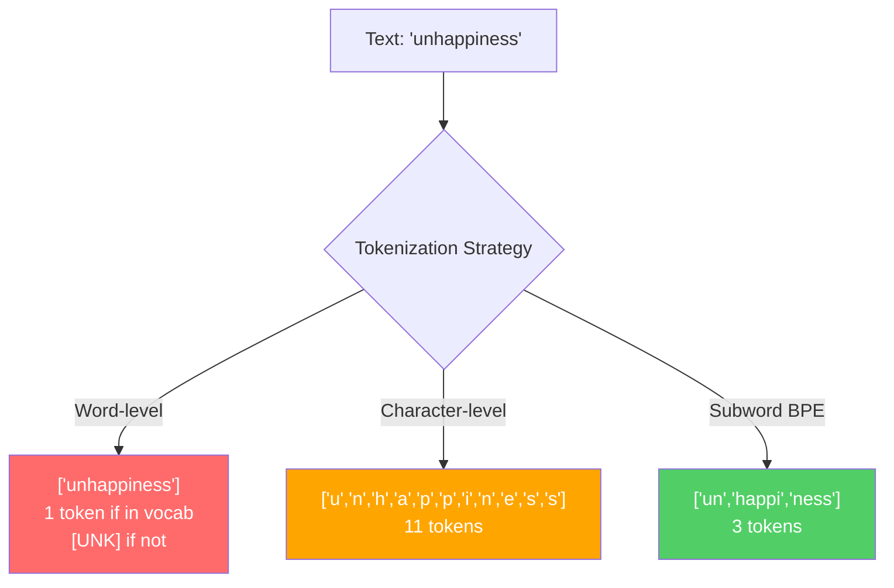
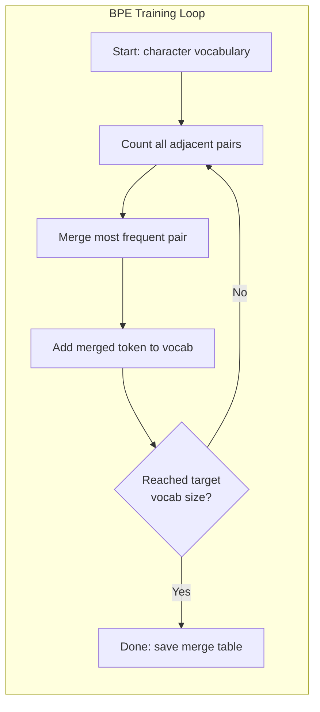
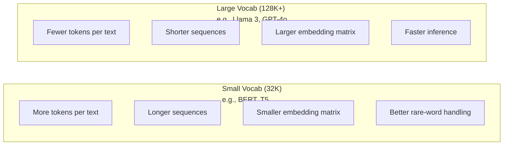

# Токенизаторы: BPE, WordPiece, SentencePiece

> Ваша LLM не читает английский. Она читает целые числа. Токенизатор решает, несут ли эти числа смысл или расходуют его впустую.

**Тип:** Сборка
**Языки:** Python
**Предварительные требования:** Phase 05 (NLP Foundations)
**Время:** ~90 минут

## Цели обучения

- Реализовать алгоритмы токенизации BPE, WordPiece и Unigram с нуля и сравнить их стратегии слияния
- Объяснить, как размер словаря влияет на эффективность модели: слишком маленький создает длинные последовательности, слишком большой тратит параметры слоя эмбеддингов
- Анализировать артефакты токенизации в разных языках и коде, находя места, где конкретные токенизаторы ломаются
- Использовать библиотеки tiktoken и sentencepiece для токенизации текста и проверки получившихся идентификаторов токенов

## Проблема

Ваша LLM не читает английский. Она не читает вообще никакой язык. Она читает числа.

Разрыв между "Hello, world!" и [15496, 11, 995, 0] заполняет токенизатор. Каждое слово, каждый пробел, каждый знак пунктуации нужно превратить в целое число, прежде чем модель сможет с ним работать. Это преобразование не нейтрально. Оно встраивает в модель предположения, которые потом уже нельзя отменить.

Если сделать это плохо, модель будет тратить емкость, кодируя частые слова несколькими токенами. "unfortunately" станет четырьмя токенами вместо одного. Ваше контекстное окно 128K фактически сожмется на 75% для текста с большим количеством многосложных слов. Если сделать правильно, то то же контекстное окно вместит вдвое больше смысла. Разница между "эта модель хорошо работает с кодом" и "эта модель захлебывается на Python" часто сводится к тому, как был обучен токенизатор.

Каждый API-вызов к GPT-4 или Claude тарифицируется по токенам. Каждый токен, который генерирует модель, стоит вычислений. Чем меньше токенов нужно для представления ответа, тем быстрее сквозной inference. Токенизация -- не предварительная обработка. Это архитектура.

## Концепция

### Три подхода, которые не сработали, и один, который победил

Есть три очевидных способа превратить текст в числа. Два из них не работают в масштабе.

**Word-level tokenization** делит текст по пробелам и пунктуации. "The cat sat" превращается в ["The", "cat", "sat"]. Просто. Но что делать с "tokenization"? Или "GPT-4o"? Или с немецким составным словом вроде "Geschwindigkeitsbegrenzung"? Word-level подход требует огромного словаря, чтобы покрыть каждое слово в каждом языке. Пропустили слово, и получаете страшный токен `[UNK]` -- способ модели сказать: "Я не знаю, что это такое". Только в английском больше миллиона словоформ. Добавьте код, URLs, научную нотацию и еще 100 языков, и вам понадобится бесконечный словарь.

**Character-level tokenization** идет в другую сторону. "hello" становится ["h", "e", "l", "l", "o"]. Словарь крошечный: несколько сотен символов. Неизвестных токенов нет никогда. Но последовательности становятся очень длинными. Предложение, которое было бы 10 word-level токенами, становится 50 character-level токенами. Модель должна выучить, что "t", "h", "e" вместе означают "the", расходуя attention capacity на то, что человек усваивает в три года.

**Subword tokenization** находит баланс. Частые слова остаются целыми: "the" это один токен. Редкие слова раскладываются на осмысленные части: "unhappiness" становится ["un", "happi", "ness"]. Словарь остается управляемым: от 30K до 128K токенов. Последовательности остаются короткими. Неизвестные токены практически исчезают, потому что любое слово можно собрать из subword-частей.

Каждая современная LLM использует subword tokenization. GPT-2, GPT-4, BERT, Llama 3, Claude -- все они. Вопрос только в алгоритме.



### BPE: Byte Pair Encoding

BPE -- жадный алгоритм сжатия, переиспользованный для токенизации. Идея достаточно проста, чтобы поместиться на карточке.

Начните с отдельных символов. Посчитайте каждую соседнюю пару в обучающем корпусе. Слейте самую частую пару в новый токен. Повторяйте, пока не достигнете целевого размера словаря.

Вот как BPE работает на крошечном корпусе со словами "lower", "lowest" и "newest":

```
Corpus (with word frequencies):
  "lower"  x5
  "lowest" x2
  "newest" x6

Step 0 -- Start with characters:
  l o w e r       (x5)
  l o w e s t     (x2)
  n e w e s t     (x6)

Step 1 -- Count adjacent pairs:
  (e,s): 8    (s,t): 8    (l,o): 7    (o,w): 7
  (w,e): 13   (e,r): 5    (n,e): 6    ...

Step 2 -- Merge most frequent pair (w,e) -> "we":
  l o we r        (x5)
  l o we s t      (x2)
  n e we s t      (x6)

Step 3 -- Recount and merge (e,s) -> "es":
  l o we r        (x5)
  l o we s t      (x2)    <- 'es' only forms from 'e'+'s', not 'we'+'s'
  n e we s t      (x6)    <- wait, the 'e' before 'we' and 's' after 'we'

Actually tracking this precisely:
  After "we" merge, remaining pairs:
  (l,o): 7   (o,we): 7   (we,r): 5   (we,s): 8
  (s,t): 8   (n,e): 6    (e,we): 6

Step 3 -- Merge (we,s) -> "wes" or (s,t) -> "st" (tied at 8, pick first):
  Merge (we,s) -> "wes":
  l o we r        (x5)
  l o wes t       (x2)
  n e wes t       (x6)

Step 4 -- Merge (wes,t) -> "west":
  l o we r        (x5)
  l o west        (x2)
  n e west        (x6)

...continue until target vocab size reached.
```

Таблица слияний и есть токенизатор. Чтобы закодировать новый текст, применяйте слияния в том порядке, в котором они были выучены. Обучающий корпус определяет, какие слияния существуют, и этот выбор навсегда формирует то, что видит модель.



### Byte-Level BPE (GPT-2, GPT-3, GPT-4)

Обычный BPE работает с Unicode-символами. Byte-level BPE работает с сырыми байтами (0-255). Это дает базовый словарь ровно из 256 элементов, позволяет обрабатывать любой язык или кодировку и никогда не создает неизвестный токен.

GPT-2 ввел этот подход. Базовый словарь покрывает каждый возможный байт. BPE-слияния строятся поверх него. Библиотека OpenAI tiktoken реализует byte-level BPE с такими размерами словаря:

- GPT-2: 50,257 tokens
- GPT-3.5/GPT-4: ~100,256 tokens (cl100k_base encoding)
- GPT-4o: 200,019 tokens (o200k_base encoding)

### WordPiece (BERT)

WordPiece похож на BPE, но выбирает слияния иначе. Вместо сырой частоты он максимизирует likelihood обучающих данных:

```
BPE merge criterion:      count(A, B)
WordPiece merge criterion: count(AB) / (count(A) * count(B))
```

BPE спрашивает: "Какая пара встречается чаще всего?" WordPiece спрашивает: "Какая пара встречается вместе чаще, чем можно было бы ожидать случайно?" Это тонкое отличие дает разные словари. WordPiece предпочитает слияния, где совместная встречаемость неожиданна, а не просто частотна.

WordPiece также использует префикс "##" для продолжающих subword-частей:

```
"unhappiness" -> ["un", "##happi", "##ness"]
"embedding"   -> ["em", "##bed", "##ding"]
```

Префикс "##" говорит, что эта часть продолжает предыдущий токен. BERT использует WordPiece со словарем 30,522 токена. Каждый вариант BERT -- DistilBERT; токенизатор RoBERTa на самом деле BPE, но сам BERT использует WordPiece.

### SentencePiece (Llama, T5)

SentencePiece рассматривает вход как сырой поток Unicode-символов, включая пробелы. Нет шага pre-tokenization. Нет языково-специфичных правил о границах слов. Поэтому он действительно language-agnostic: работает с китайским, японским, тайским и другими языками, где пробелы не отделяют слова.

SentencePiece поддерживает два алгоритма:
- **BPE mode**: та же логика слияний, что и в стандартном BPE, примененная к сырым последовательностям символов
- **Unigram mode**: начинается с большого словаря и итеративно удаляет токены, которые меньше всего влияют на общую likelihood. Обратный BPE: pruning вместо merge.

Llama 2 использует SentencePiece BPE со словарем 32,000 токенов. T5 использует SentencePiece Unigram с 32,000 токенов. Примечание: Llama 3 перешла на tiktoken-based byte-level BPE tokenizer с 128,256 токенами.

### Компромиссы размера словаря

Это реальное инженерное решение с измеримыми последствиями.



Конкретные числа. Для словаря 128K с embedding-размерностью 4,096 одна только embedding matrix содержит 128,000 x 4,096 = 524 миллиона параметров. Для словаря 32K это 131 миллион параметров. Разница в 400M параметров возникает только из-за выбора токенизатора.

Но большие словари агрессивнее сжимают текст. Один и тот же английский абзац, который занимает 100 токенов со словарем 32K, может занять 70 токенов со словарем 128K. Это значит на 30% меньше forward passes во время генерации. Для модели, обслуживающей миллионы запросов, это прямое снижение compute cost.

Тренд очевиден: размеры словарей растут. GPT-2 использовал 50,257. GPT-4 использует ~100K. Llama 3 использует 128K. GPT-4o использует 200K.

| Model | Vocab Size | Tokenizer Type | Avg Tokens per English Word |
|-------|-----------|----------------|---------------------------|
| BERT | 30,522 | WordPiece | ~1.4 |
| GPT-2 | 50,257 | Byte-level BPE | ~1.3 |
| Llama 2 | 32,000 | SentencePiece BPE | ~1.4 |
| GPT-4 | ~100,256 | Byte-level BPE | ~1.2 |
| Llama 3 | 128,256 | Byte-level BPE (tiktoken) | ~1.1 |
| GPT-4o | 200,019 | Byte-level BPE | ~1.0 |

### Multilingual Tax

Токенизаторы, обученные в основном на английском, жестоки к другим языкам. Корейский текст в токенизаторе GPT-2 в среднем дает 2-3 токена на слово. Китайский может быть еще хуже. Это значит, что корейский пользователь фактически получает контекстное окно вдвое меньше, чем английский пользователь, хотя платит ту же цену за меньшую информационную плотность.

Именно поэтому Llama 3 увеличила словарь с 32K до 128K. Больше токенов, выделенных под неанглийские письменности, означает более справедливое сжатие между языками.

## Постройте это

### Шаг 1: Character-Level Tokenizer

Начните с основания. Character-level tokenizer сопоставляет каждый символ с его Unicode code point. Обучение не нужно. Неизвестных токенов нет. Только прямое отображение.

```python
class CharTokenizer:
    def encode(self, text):
        return [ord(c) for c in text]

    def decode(self, tokens):
        return "".join(chr(t) for t in tokens)
```

"hello" становится [104, 101, 108, 108, 111]. Каждый символ -- собственный токен. Это baseline, который мы улучшаем.

### Шаг 2: BPE Tokenizer from Scratch

Настоящая реализация. Мы обучаемся на сырых байтах (как GPT-2), считаем пары, сливаем самую частую и записываем каждое слияние по порядку. Таблица слияний и есть токенизатор.

```python
from collections import Counter

class BPETokenizer:
    def __init__(self):
        self.merges = {}
        self.vocab = {}

    def _get_pairs(self, tokens):
        pairs = Counter()
        for i in range(len(tokens) - 1):
            pairs[(tokens[i], tokens[i + 1])] += 1
        return pairs

    def _merge_pair(self, tokens, pair, new_token):
        merged = []
        i = 0
        while i < len(tokens):
            if i < len(tokens) - 1 and tokens[i] == pair[0] and tokens[i + 1] == pair[1]:
                merged.append(new_token)
                i += 2
            else:
                merged.append(tokens[i])
                i += 1
        return merged

    def train(self, text, num_merges):
        tokens = list(text.encode("utf-8"))
        self.vocab = {i: bytes([i]) for i in range(256)}

        for i in range(num_merges):
            pairs = self._get_pairs(tokens)
            if not pairs:
                break
            best_pair = max(pairs, key=pairs.get)
            new_token = 256 + i
            tokens = self._merge_pair(tokens, best_pair, new_token)
            self.merges[best_pair] = new_token
            self.vocab[new_token] = self.vocab[best_pair[0]] + self.vocab[best_pair[1]]

        return self

    def encode(self, text):
        tokens = list(text.encode("utf-8"))
        for pair, new_token in self.merges.items():
            tokens = self._merge_pair(tokens, pair, new_token)
        return tokens

    def decode(self, tokens):
        byte_sequence = b"".join(self.vocab[t] for t in tokens)
        return byte_sequence.decode("utf-8", errors="replace")
```

Цикл обучения -- ядро BPE: посчитать пары, слить победителя, повторить. Каждое слияние уменьшает общее число токенов. После `num_merges` раундов словарь растет с 256 (базовые байты) до 256 + num_merges.

Encoding применяет слияния ровно в том порядке, в котором они были выучены. Это важно. Если merge 1 создал "th", а merge 5 создал "the", encoding должен сначала применить merge 1, чтобы "the" мог сформироваться из "th" + "e" в merge 5.

Decoding -- обратная операция: найти каждый token ID в словаре, склеить байты, декодировать в UTF-8.

### Шаг 3: Encode and Decode Roundtrip

```python
corpus = (
    "The cat sat on the mat. The cat ate the rat. "
    "The dog sat on the log. The dog ate the frog. "
    "Natural language processing is the study of how computers "
    "understand and generate human language. "
    "Tokenization is the first step in any NLP pipeline."
)

tokenizer = BPETokenizer()
tokenizer.train(corpus, num_merges=40)

test_sentences = [
    "The cat sat on the mat.",
    "Natural language processing",
    "tokenization pipeline",
    "unhappiness",
]

for sentence in test_sentences:
    encoded = tokenizer.encode(sentence)
    decoded = tokenizer.decode(encoded)
    raw_bytes = len(sentence.encode("utf-8"))
    ratio = len(encoded) / raw_bytes
    print(f"'{sentence}'")
    print(f"  Tokens: {len(encoded)} (from {raw_bytes} bytes) -- ratio: {ratio:.2f}")
    print(f"  Roundtrip: {'PASS' if decoded == sentence else 'FAIL'}")
```

Compression ratio показывает, насколько эффективен токенизатор. Ratio 0.50 означает, что токенизатор сжал текст до половины числа токенов по сравнению с сырыми байтами. Чем ниже, тем лучше. На обучающем корпусе ratio будет хорошим. На out-of-distribution тексте вроде "unhappiness" (который не встречается в корпусе) ratio будет хуже: токенизатор откатится к character-level encoding для невиданных паттернов.

### Шаг 4: Compare with tiktoken

```python
import tiktoken

enc = tiktoken.get_encoding("cl100k_base")

texts = [
    "The cat sat on the mat.",
    "unhappiness",
    "Hello, world!",
    "def fibonacci(n): return n if n < 2 else fibonacci(n-1) + fibonacci(n-2)",
    "Geschwindigkeitsbegrenzung",
]

for text in texts:
    our_tokens = tokenizer.encode(text)
    tiktoken_tokens = enc.encode(text)
    tiktoken_pieces = [enc.decode([t]) for t in tiktoken_tokens]
    print(f"'{text}'")
    print(f"  Our BPE:   {len(our_tokens)} tokens")
    print(f"  tiktoken:  {len(tiktoken_tokens)} tokens -> {tiktoken_pieces}")
```

tiktoken использует точно тот же алгоритм, но обучен на сотнях гигабайт текста с 100,000 слияний. Алгоритм идентичен. Разница в обучающих данных и числе слияний. Ваш токенизатор, обученный на одном абзаце с 40 слияниями, не может конкурировать со 100K слияний tiktoken на огромном корпусе. Но механизм тот же.

### Шаг 5: Vocabulary Analysis

```python
def analyze_vocabulary(tokenizer, test_texts):
    total_tokens = 0
    total_chars = 0
    token_usage = Counter()

    for text in test_texts:
        encoded = tokenizer.encode(text)
        total_tokens += len(encoded)
        total_chars += len(text)
        for t in encoded:
            token_usage[t] += 1

    print(f"Vocabulary size: {len(tokenizer.vocab)}")
    print(f"Total tokens across all texts: {total_tokens}")
    print(f"Total characters: {total_chars}")
    print(f"Avg tokens per character: {total_tokens / total_chars:.2f}")

    print(f"\nMost used tokens:")
    for token_id, count in token_usage.most_common(10):
        token_bytes = tokenizer.vocab[token_id]
        display = token_bytes.decode("utf-8", errors="replace")
        print(f"  Token {token_id:4d}: '{display}' (used {count} times)")

    unused = [t for t in tokenizer.vocab if t not in token_usage]
    print(f"\nUnused tokens: {len(unused)} out of {len(tokenizer.vocab)}")
```

Это показывает Zipf distribution в вашем словаре. Несколько токенов доминируют: пробелы, "the", "e". Большинство токенов используются редко. Production tokenizers оптимизируются под это распределение: частые паттерны получают короткие token IDs, редкие паттерны получают более длинные представления.

## Используйте это

Ваш scratch BPE работает. Теперь посмотрите, как выглядят production tools.

### tiktoken (OpenAI)

```python
import tiktoken

enc = tiktoken.get_encoding("cl100k_base")

text = "Tokenizers convert text to integers"
tokens = enc.encode(text)
print(f"Tokens: {tokens}")
print(f"Pieces: {[enc.decode([t]) for t in tokens]}")
print(f"Roundtrip: {enc.decode(tokens)}")
```

tiktoken написан на Rust с Python bindings. Он кодирует миллионы токенов в секунду. Тот же BPE-алгоритм, industrial-strength реализация.

### Hugging Face tokenizers

```python
from tokenizers import Tokenizer
from tokenizers.models import BPE
from tokenizers.trainers import BpeTrainer
from tokenizers.pre_tokenizers import ByteLevel

tokenizer = Tokenizer(BPE())
tokenizer.pre_tokenizer = ByteLevel()

trainer = BpeTrainer(vocab_size=1000, special_tokens=["<pad>", "<eos>", "<unk>"])
tokenizer.train(["corpus.txt"], trainer)

output = tokenizer.encode("The cat sat on the mat.")
print(f"Tokens: {output.tokens}")
print(f"IDs: {output.ids}")
```

Библиотека Hugging Face tokenizers тоже использует Rust под капотом. Она обучает BPE на гигабайтных корпусах за секунды. Именно ее используют, когда обучают собственную модель.

### Loading Llama's Tokenizer

```python
from transformers import AutoTokenizer

tokenizer = AutoTokenizer.from_pretrained("meta-llama/Llama-3.1-8B")

text = "Tokenizers are the unsung heroes of LLMs"
tokens = tokenizer.encode(text)
print(f"Token IDs: {tokens}")
print(f"Tokens: {tokenizer.convert_ids_to_tokens(tokens)}")
print(f"Vocab size: {tokenizer.vocab_size}")

multilingual = ["Hello world", "Hola mundo", "Bonjour le monde"]
for text in multilingual:
    ids = tokenizer.encode(text)
    print(f"'{text}' -> {len(ids)} tokens")
```

Словарь Llama 3 на 128K заметно лучше сжимает неанглийский текст, чем словарь GPT-2 на 50K. Вы можете проверить это сами: закодируйте одно и то же предложение на нескольких языках и посчитайте токены.

## Результат

Этот урок создает `outputs/prompt-tokenizer-analyzer.md` -- переиспользуемый prompt, который анализирует эффективность токенизации для любого сочетания текста и модели. Передайте ему текстовый sample, и он скажет, токенизатор какой модели справляется лучше всего.

## Упражнения

1. Измените BPE tokenizer так, чтобы он печатал словарь на каждом шаге слияния. Посмотрите, как "t" + "h" становится "th", а затем "th" + "e" становится "the". Проследите, как частые английские слова собираются часть за частью.

2. Добавьте специальные токены (`<pad>`, `<eos>`, `<unk>`) в BPE tokenizer. Назначьте им IDs 0, 1, 2 и сдвиньте все остальные токены соответственно. Реализуйте шаг pre-tokenization, который делит по whitespace перед запуском BPE.

3. Реализуйте критерий слияния WordPiece (likelihood ratio вместо frequency). Обучите BPE и WordPiece на одном и том же корпусе с одинаковым числом слияний. Сравните получившиеся словари: какой дает более лингвистически осмысленные subwords?

4. Постройте benchmark эффективности multilingual tokenizer. Возьмите 10 предложений на английском, испанском, китайском, корейском и арабском. Токенизируйте каждое с помощью tiktoken (cl100k_base) и измерьте среднее число токенов на символ. Количественно оцените "multilingual tax" для каждого языка.

5. Обучите ваш BPE tokenizer на более крупном корпусе (скачайте статью из Wikipedia). Подберите число слияний так, чтобы добиться compression ratio в пределах 10% от tiktoken на том же тексте. Это заставит вас понять связь между размером корпуса, числом слияний и качеством сжатия.

## Ключевые термины

| Термин | Как обычно говорят | Что это на самом деле означает |
|------|----------------|----------------------|
| Token | "Слово" | Единица в словаре модели: может быть символом, subword, словом или фрагментом из нескольких слов |
| BPE | "Какая-то штука для сжатия" | Byte Pair Encoding: итеративно сливать самую частую соседнюю пару токенов, пока не достигнут целевой размер словаря |
| WordPiece | "Токенизатор BERT" | Как BPE, но слияния максимизируют likelihood ratio count(AB)/(count(A)*count(B)) вместо сырой частоты |
| SentencePiece | "Библиотека токенизации" | Language-agnostic токенизатор, который работает с сырым Unicode без pre-tokenization и поддерживает BPE и Unigram algorithms |
| Vocabulary size | "Сколько слов он знает" | Общее число уникальных токенов: у GPT-2 50,257, у BERT 30,522, у Llama 3 128,256 |
| Fertility | "Не термин токенизатора" | Среднее число токенов на слово: мера эффективности токенизатора между языками (1.0 идеально, 3.0 значит, что модель работает втрое тяжелее) |
| Byte-level BPE | "Токенизатор GPT" | BPE, работающий с сырыми байтами (0-255), а не Unicode-символами, что гарантирует отсутствие неизвестных токенов для любого входа |
| Merge table | "Файл токенизатора" | Упорядоченный список pair merges, выученных при обучении: это и есть токенизатор, и порядок важен |
| Pre-tokenization | "Разбиение по пробелам" | Правила перед subword tokenization: whitespace splitting, digit separation, punctuation handling |
| Compression ratio | "Насколько эффективен токенизатор" | Число созданных токенов, деленное на входные байты: чем ниже, тем лучше сжатие и быстрее inference |

## Дополнительное чтение

- [Sennrich et al., 2016 -- "Neural Machine Translation of Rare Words with Subword Units"](https://arxiv.org/abs/1508.07909) -- статья, которая ввела BPE в NLP, превратив алгоритм сжатия 1994 года в основу современной токенизации
- [Kudo & Richardson, 2018 -- "SentencePiece: A simple and language independent subword tokenizer"](https://arxiv.org/abs/1808.06226) -- language-agnostic токенизация, сделавшая multilingual models практичными
- [OpenAI tiktoken repository](https://github.com/openai/tiktoken) -- production BPE implementation на Rust с Python bindings, используется GPT-3.5/4/4o
- [Hugging Face Tokenizers documentation](https://huggingface.co/docs/tokenizers) -- production-grade обучение токенизаторов с производительностью Rust
