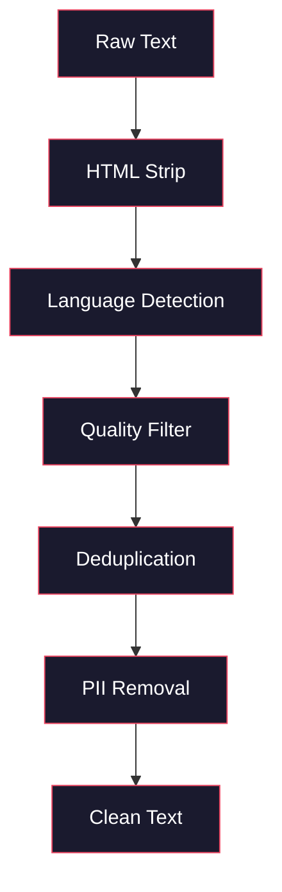
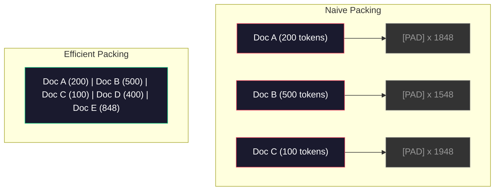

# Data Pipelines для pre-training

> Модель -- это зеркало. Она отражает любые данные, которыми вы ее кормите. Кормите мусором, и она будет отражать мусор с идеальной беглостью.

**Тип:** Сборка
**Языки:** Python
**Предварительные требования:** Phase 10, Lessons 01-02 (Tokenizers, Building a Tokenizer)
**Время:** ~90 минут

## Цели обучения

- Построить streaming data pipeline, который токенизирует, нарезает, перемешивает и батчит терабайты текста, не загружая все в память
- Реализовать фильтры качества данных (deduplication, language detection, content filtering), используемые в реальных pre-training pipelines
- Создавать обучающие последовательности фиксированной длины с корректными attention masks и учетом границ документов
- Профилировать pipeline throughput, чтобы dataloader успевал за скоростью GPU training

## Проблема

У вас есть токенизатор. Теперь нужны данные.

Не набор данных. Не CSV-файл. Терабайты текста: очищенного, дедуплицированного, отфильтрованного по качеству, токенизированного в последовательности фиксированной длины и подаваемого случайными batch достаточно быстро, чтобы ваш 8-GPU cluster никогда не ждал следующий batch.

Большинство думает, что обучение LLM -- это про архитектуру модели. Это не так. Llama 3 использовала 15.6 триллиона токенов. GPT-3 использовала 300 миллиардов. DeepSeek-V2 использовала 8.1 триллиона. Архитектура у всех трех примерно одна: stacked transformer blocks с attention и feedforward layers. Разница в качестве output возникает главным образом из данных.

Статья Chinchilla от DeepMind сделала это точным. Для заданного вычислительного бюджета существует оптимальное отношение параметров модели к обучающим токенам. Chinchilla показала, что большинство моделей в 2022 году были сильно недообучены: у них было слишком много параметров для объема данных, который они видели. Модель с 70B параметров, обученная на 1.4 trillion tokens (Chinchilla-optimal), превзошла модель 280B, обученную на 300 billion tokens (Gopher).

Ваш конвейер данных определяет, выучит ли модель язык или шум.

## Концепция

### Откуда берутся данные

Каждая large language model обучается на смеси источников. Точный состав большинство лабораторий держит в строгом секрете, но мы знаем достаточно, чтобы понимать категории.

| Источник | Размер | Качество | Используется в |
|--------|------|---------|---------|
| Common Crawl | ~250 TB raw | Low (needs heavy filtering) | GPT-3, Llama, most open models |
| Wikipedia | ~20 GB | High | Every major LLM |
| GitHub code | ~1 TB+ | Medium (lots of duplicates, dead code) | StarCoder, CodeLlama, DeepSeek-Coder |
| Books (BookCorpus, Pile) | ~100 GB | High | GPT-2, GPT-3, early models |
| Academic papers (arXiv, S2ORC) | ~100 GB | High for STEM | Llama, Galactica |
| StackOverflow, Reddit | ~100 GB | Medium | Llama, Falcon |
| Curated web (C4, RefinedWeb) | ~5 TB | Medium-High (pre-filtered) | T5, Falcon |

Llama 3 раскрыла свой data mix: примерно 50% web data, 25% code, 13% books and academic papers, 8% math data и 4% multilingual web data. Всего это было 15.6 trillion tokens из источников объемом больше 5 TB raw text.

Соотношение важно не меньше, чем общий размер. Слишком много web data, и модель начинает повторять стиль Reddit. Слишком мало code, и она не умеет программировать. Слишком мало math, и она проваливается на reasoning. Правильно подобрать эту смесь -- одна из самых сложных частей обучения LLM, и формулы нет: нужны эксперименты и evaluation.

### Очистка данных

Raw web data грязные. Типичный dump Common Crawl содержит:

- HTML tags and JavaScript
- Boilerplate headers, footers, navigation menus
- Duplicate pages (exact and near-duplicate)
- Machine-generated spam
- Personally identifiable information (PII)
- Low-quality text (lists of keywords, SEO spam)
- Non-text content encoded as text

Очистка не является необязательной. Это разница между моделью, которая генерирует связные абзацы, и моделью, которая выводит HTML tags вперемешку с product listings.



Каждый шаг устраняет отдельную категорию шума:

**HTML stripping:** удалить всю разметку. Оставить только видимый текстовый контент. Библиотеки вроде `trafilatura` или `readability` извлекают article content, отбрасывая navigation, ads и boilerplate.

**Language detection:** использовать модель language identification от fastText (lid.176.bin), чтобы классифицировать каждый документ. Фильтровать по целевым языкам. Документ, классифицированный как English с confidence меньше 0.8, вероятно не является чистым английским.

**Quality filtering:** здесь становится интересно. RefinedWeb (dataset за Falcon) использует perplexity-based filter: обучить маленькую language model на Wikipedia, затем оценить каждый документ. High perplexity означает, что документ не похож на Wikipedia: вероятно spam, keyword lists или machine-generated content. Документы с perplexity выше threshold удаляются.

**Deduplication:** самый влиятельный шаг очистки. Common Crawl содержит огромное число дублированных страниц: legal disclaimers, cookie notices, terms of service. Обучение на дублях тратит compute и может заставить модель запоминать и дословно воспроизводить конкретные passages.

**PII removal:** имена, email addresses, phone numbers, social security numbers. Regex-based detection для structured PII, NER models для имен в контексте.

### Deduplication with MinHash

Exact deduplication проста: хэшировать каждый документ, удалить дубликаты. Но настоящая проблема -- near-duplicates. Две копии одной новостной статьи с чуть разной рекламой вокруг нее являются near-duplicates. Контент на 95% одинаковый, но byte-for-byte они отличаются.

MinHash + Locality-Sensitive Hashing (LSH) решает это эффективно.


Идея:

1. **Shingling:** преобразовать каждый документ в набор n-grams (например, 5-grams слов или символов). "the quick brown fox" с 3-word shingles становится {"the quick brown", "quick brown fox"}.

2. **MinHash:** для shingle set каждого документа вычислить k hash values. Каждое hash value -- минимальный hash по всем shingles под другой hash function. Это создает fixed-size "signature", которая приближает Jaccard similarity между любыми двумя документами.

3. **LSH:** сгруппировать документы в buckets на основе bands их MinHash signature. Документы в одном bucket -- candidate near-duplicates. Это позволяет не сравнивать каждую пару: сравниваются только candidates.

4. **Verify:** для каждой candidate pair вычислить точную Jaccard similarity. Удалить одну копию, если similarity превышает threshold (обычно 0.8).

Команда Llama сообщила, что удаляла примерно 38% своих web data через deduplication. Это не маленькое число. Больше трети Common Crawl -- duplicate или near-duplicate content.

### Sequence Packing

Модель ожидает fixed-length input sequences. Документы имеют переменную длину. Некоторые -- 50 токенов. Некоторые -- 50,000 токенов.

Наивный подход: pad каждый документ до maximum sequence length. Это тратит огромный compute на padding tokens, которые ничего не дают обучению.

Лучший подход: упаковывать несколько документов в одну sequence, разделяя их end-of-sequence tokens. Sequence длиной 2048 токенов может содержать три коротких документа, склеенных с [EOS] tokens между ними.



Attention mask должен быть задан корректно. Tokens из Document A не должны attend to tokens из Document B внутри той же packed sequence. Для этого нужна block-diagonal attention mask.

Long documents обрезаются или делятся на chunks по sequence boundaries. Точка разбиения имеет значение: разбиение посреди предложения заставляет модель видеть незавершенные мысли. Некоторые pipelines по возможности выравнивают splits по paragraph или sentence boundaries.

### Chinchilla Scaling Law

Для fixed compute budget C (измеренного в FLOPs), оптимальный model size N и dataset size D следуют:

```
N_opt ~ C^0.5
D_opt ~ C^0.5
```

На практике это означает, что model size и dataset size нужно масштабировать примерно одинаково. Модели с 10x большим числом параметров нужно примерно 10x больше training tokens, чтобы достичь той же loss.

| Model | Parameters | Training Tokens | Chinchilla-Optimal? |
|-------|-----------|----------------|-------------------|
| GPT-3 | 175B | 300B | No (undertrained 3-4x) |
| Chinchilla | 70B | 1.4T | Yes (by design) |
| Llama 2 | 70B | 2T | Overtrained (intentionally) |
| Llama 3 | 70B | 15T | Heavily overtrained |

Llama 3 намеренно нарушает Chinchilla law. Meta обнаружила, что overtraining на большем объеме данных, далеко за пределами compute-optimal ratio, дает лучшие модели для inference. Дополнительная стоимость обучения платится один раз, зато меньшая модель дешевле обслуживается всегда. Это иногда называют "inference-optimal" scaling approach, и с 2024 года он стал industry standard.

## Постройте это

### Шаг 1: Text Cleaning

Удалите HTML, нормализуйте whitespace, удалите non-text content. Мы будем использовать public domain text (Project Gutenberg) как небольшой corpus.

```python
import re

def clean_text(text):
    text = re.sub(r"<[^>]+>", "", text)
    text = re.sub(r"http\S+", "", text)
    text = re.sub(r"[^\x20-\x7E\n]", "", text)
    text = re.sub(r"\n{3,}", "\n\n", text)
    text = re.sub(r" {2,}", " ", text)
    return text.strip()

def quality_filter(text, min_words=50, max_ratio_caps=0.3, max_ratio_special=0.1):
    words = text.split()
    if len(words) < min_words:
        return False
    caps_ratio = sum(1 for w in words if w.isupper()) / len(words)
    if caps_ratio > max_ratio_caps:
        return False
    special_chars = sum(1 for c in text if not c.isalnum() and not c.isspace())
    if special_chars / max(len(text), 1) > max_ratio_special:
        return False
    return True
```

Quality filter ловит SEO spam (ALL CAPS), machine-generated noise (высокая доля special characters) и stub pages (слишком короткие). Уже эти три проверки удаляют удивительно много мусора из web crawls.

### Шаг 2: MinHash Deduplication

Реализуйте MinHash с нуля. External libraries не нужны: только `hashlib`.

```python
import hashlib
from collections import defaultdict

def get_shingles(text, k=5):
    words = text.lower().split()
    if len(words) < k:
        return set()
    return {" ".join(words[i:i+k]) for i in range(len(words) - k + 1)}

def minhash_signature(shingles, num_hashes=128):
    signature = []
    for i in range(num_hashes):
        min_hash = float("inf")
        for shingle in shingles:
            h = int(hashlib.sha256(f"{i}:{shingle}".encode()).hexdigest(), 16)
            min_hash = min(min_hash, h)
        signature.append(min_hash)
    return signature

def lsh_buckets(signature, bands=16):
    rows_per_band = len(signature) // bands
    buckets = []
    for b in range(bands):
        start = b * rows_per_band
        band_data = tuple(signature[start:start + rows_per_band])
        bucket_hash = hashlib.md5(str(band_data).encode()).hexdigest()
        buckets.append((b, bucket_hash))
    return buckets

def deduplicate(documents, threshold=0.8, num_hashes=128, bands=16):
    signatures = []
    shingle_sets = []
    for doc in documents:
        shingles = get_shingles(doc)
        shingle_sets.append(shingles)
        signatures.append(minhash_signature(shingles, num_hashes))

    bucket_map = defaultdict(list)
    for doc_idx, sig in enumerate(signatures):
        for band_id, bucket_hash in lsh_buckets(sig, bands):
            bucket_map[(band_id, bucket_hash)].append(doc_idx)

    duplicate_pairs = set()
    for bucket_docs in bucket_map.values():
        if len(bucket_docs) < 2:
            continue
        for i in range(len(bucket_docs)):
            for j in range(i + 1, len(bucket_docs)):
                duplicate_pairs.add((bucket_docs[i], bucket_docs[j]))

    removed = set()
    for i, j in duplicate_pairs:
        if i in removed or j in removed:
            continue
        s1, s2 = shingle_sets[i], shingle_sets[j]
        if not s1 or not s2:
            continue
        jaccard = len(s1 & s2) / len(s1 | s2)
        if jaccard >= threshold:
            removed.add(j)

    return [doc for idx, doc in enumerate(documents) if idx not in removed], len(removed)
```

Параметры `num_hashes=128` и `bands=16` управляют tradeoff между precision и recall. Больше hashes дают более точные оценки similarity. Больше bands повышают recall (ловят больше duplicates) ценой большего числа false positives. Эти значения хорошо работают для типичного web text.

### Шаг 3: Tokenize and Pack Sequences

Возьмите clean, deduplicated text, токенизируйте его и упакуйте в fixed-length sequences для обучения.

```python
def tokenize_corpus(documents, tokenizer):
    all_tokens = []
    for doc in documents:
        tokens = tokenizer.encode(doc)
        all_tokens.extend(tokens)
        all_tokens.append(tokenizer.eos_id)
    return all_tokens

def pack_sequences(token_ids, seq_length, pad_id=0):
    sequences = []
    attention_masks = []
    for i in range(0, len(token_ids), seq_length):
        seq = token_ids[i:i + seq_length]
        mask = [1] * len(seq)
        if len(seq) < seq_length:
            pad_count = seq_length - len(seq)
            seq = seq + [pad_id] * pad_count
            mask = mask + [0] * pad_count
        sequences.append(seq)
        attention_masks.append(mask)
    return sequences, attention_masks
```

### Шаг 4: DataLoader for Training

Yield randomized batches of packed sequences. Именно это потребляет training loop.

```python
import random

class PreTrainingDataLoader:
    def __init__(self, sequences, attention_masks, batch_size, shuffle=True):
        self.sequences = sequences
        self.attention_masks = attention_masks
        self.batch_size = batch_size
        self.shuffle = shuffle

    def __len__(self):
        return (len(self.sequences) + self.batch_size - 1) // self.batch_size

    def __iter__(self):
        indices = list(range(len(self.sequences)))
        if self.shuffle:
            random.shuffle(indices)
        for start in range(0, len(indices), self.batch_size):
            batch_idx = indices[start:start + self.batch_size]
            batch_seqs = [self.sequences[i] for i in batch_idx]
            batch_masks = [self.attention_masks[i] for i in batch_idx]
            yield batch_seqs, batch_masks
```

### Шаг 5: Dataset Statistics

Вычислите важные числа: total tokens, unique tokens, compression ratio, document length distribution.

```python
from collections import Counter

def compute_statistics(documents, token_ids, sequences, tokenizer_vocab_size):
    total_chars = sum(len(d) for d in documents)
    total_tokens = len(token_ids)
    unique_tokens = len(set(token_ids))
    compression_ratio = total_chars / total_tokens

    doc_lengths = [len(d.split()) for d in documents]
    avg_doc_length = sum(doc_lengths) / max(len(doc_lengths), 1)
    max_doc_length = max(doc_lengths) if doc_lengths else 0
    min_doc_length = min(doc_lengths) if doc_lengths else 0

    token_counts = Counter(token_ids)
    top_tokens = token_counts.most_common(10)

    non_pad_tokens = sum(sum(1 for t in seq if t != 0) for seq in sequences)
    total_positions = sum(len(seq) for seq in sequences)
    utilization = non_pad_tokens / max(total_positions, 1)

    stats = {
        "total_documents": len(documents),
        "total_characters": total_chars,
        "total_tokens": total_tokens,
        "unique_tokens": unique_tokens,
        "vocab_utilization": unique_tokens / tokenizer_vocab_size,
        "compression_ratio": compression_ratio,
        "avg_doc_length_words": avg_doc_length,
        "max_doc_length_words": max_doc_length,
        "min_doc_length_words": min_doc_length,
        "num_sequences": len(sequences),
        "sequence_utilization": utilization,
        "top_10_tokens": top_tokens,
    }
    return stats
```

Compression ratio показывает, насколько эффективен токенизатор на этом корпусе. Английский текст обычно сжимается примерно до 3-4 characters per token. Если вы видите 1.5 characters per token, токенизатор делит слишком агрессивно. Если видите 8+, он выучил очень domain-specific merges.

Sequence utilization показывает, какая часть packed sequences является реальными данными, а какая -- padding. Ниже 90% означает, что packing неэффективен: вы тратите compute на padding tokens.

## Используйте это

### Compare With HuggingFace Datasets

Загрузите тот же corpus через библиотеку HuggingFace datasets и сравните скорость pipeline.

```python
from datasets import load_dataset
from transformers import AutoTokenizer

ds = load_dataset("wikitext", "wikitext-2-raw-v1", split="train")
tokenizer = AutoTokenizer.from_pretrained("meta-llama/Meta-Llama-3-8B")

import time

start = time.time()
tokenized = ds.map(
    lambda x: tokenizer(x["text"], truncation=True, max_length=2048),
    batched=True,
    num_proc=4,
)
hf_time = time.time() - start
total_tokens = sum(len(t) for t in tokenized["input_ids"])
print(f"HuggingFace: {total_tokens:,} tokens in {hf_time:.2f}s ({total_tokens/hf_time:,.0f} tokens/sec)")
```

HuggingFace pipeline использует Rust tokenizers под капотом и parallel processing на 4 cores. Ваш pure Python pipeline будет в 10-50x медленнее. Именно поэтому production teams используют compiled tokenizers. Алгоритм тот же. Разница в языке реализации.

## Результат

Этот урок создает prompt для validation и debugging качества данных в LLM training pipelines. См. `outputs/prompt-data-quality-checker.md`.

## Упражнения

1. **Easy:** Добавьте language detection в cleaning pipeline с помощью простой heuristic (character set analysis). Фильтруйте только English documents и измерьте, сколько документов удаляется.
2. **Medium:** Реализуйте exact deduplication с помощью SHA-256 hashes вместе с MinHash near-deduplication. Сравните число duplicates, пойманных каждым методом на web-scraped corpus.
3. **Hard:** Постройте perplexity-based quality filter. Обучите маленькую bigram language model на Wikipedia text, оцените каждый документ по perplexity и удалите нижние 20%. Сравните качество model output при обучении на filtered vs unfiltered data.

## Ключевые термины

| Термин | Как обычно говорят | Что это на самом деле означает |
|------|----------------|----------------------|
| Common Crawl | "Интернет" | Non-profit, который ежемесячно сканирует web: ~250TB raw, starting point для большинства LLM training data |
| MinHash | "Какой-то hashing trick" | Техника оценки Jaccard similarity между множествами с помощью fixed-size signatures: делает near-duplicate detection возможным в масштабе |
| LSH | "Locality-Sensitive Hashing" | Метод группировать похожие элементы в один bucket: снижает pairwise comparisons с O(n^2) до near-linear |
| Sequence packing | "Склеивание документов" | Укладка нескольких документов в fixed-length sequences с корректными attention masks: устраняет padding waste |
| Chinchilla scaling | "Обучать на большем числе данных" | Для fixed compute budget оптимальная производительность требует масштабировать model size и training tokens примерно одинаково |
| Fertility | "Tokens per word" | Среднее число токенов на слово: 1.3 для английского в GPT-4, выше для non-Latin scripts |
| Data mixing | "Выбор обучающих данных" | Соотношение code vs text vs math vs multilingual data: формулы нет, нужны эксперименты |
| Perplexity filter | "Quality scoring" | Использовать маленькую language model для оценки документов: high perplexity значит, что текст не похож на clean reference data |
| Deduplication | "Удаление копий" | Устранение exact и near-duplicate documents: обычно удаляет 30-40% raw web data |
| Attention mask | "На какие токены смотреть" | Binary mask, который предотвращает attention через document boundaries в packed sequences |

## Дополнительное чтение

- [Hoffmann et al., 2022 -- Training Compute-Optimal Large Language Models (Chinchilla)](https://arxiv.org/abs/2203.15556) -- статья, которая изменила представление о data scale
- [Penedo et al., 2023 -- The RefinedWeb Dataset for Falcon LLM](https://arxiv.org/abs/2306.01116) -- как фильтровать Common Crawl до высокого качества
- [Touvron et al., 2023 -- Llama 2: Open Foundation and Fine-Tuned Chat Models](https://arxiv.org/abs/2307.09288) -- детали data pipeline для Llama 2
- [Lee et al., 2022 -- Deduplicating Training Data Makes Language Models Better](https://arxiv.org/abs/2107.06499) -- почему deduplication важнее, чем кажется
- [Broder, 1997 -- On the Resemblance and Containment of Documents](https://ieeexplore.ieee.org/document/666900) -- original MinHash paper
- [Meta, 2024 -- Llama 3 Technical Report](https://arxiv.org/abs/2407.21783) -- 15.6T tokens, data mixing ratios, filtering pipeline
