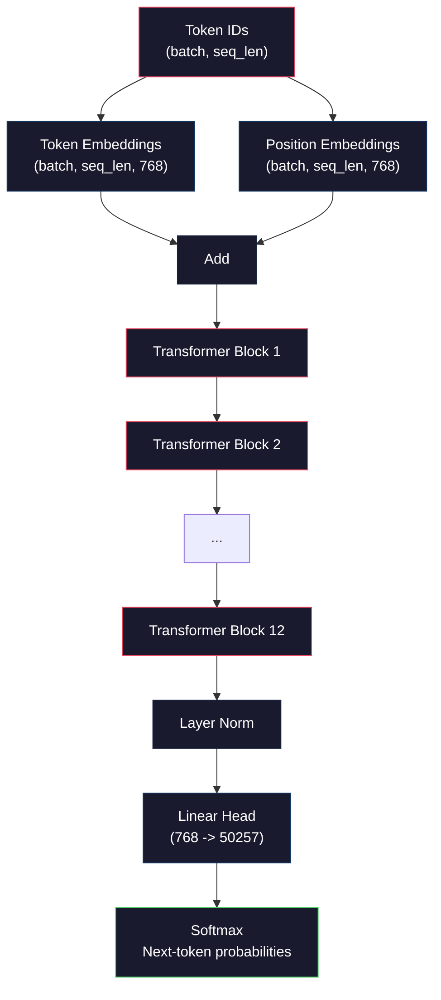
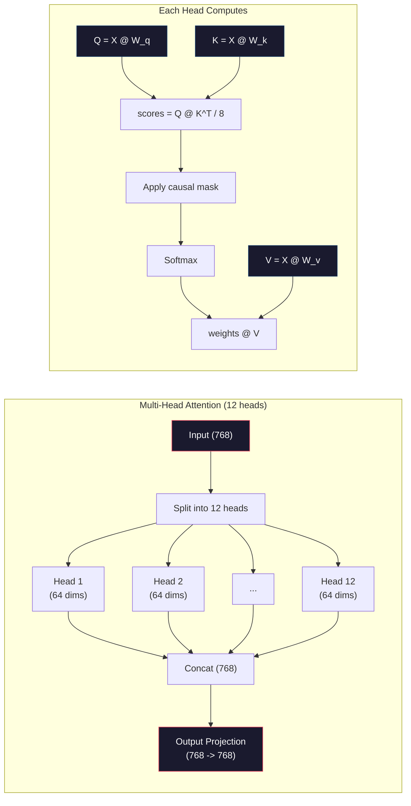
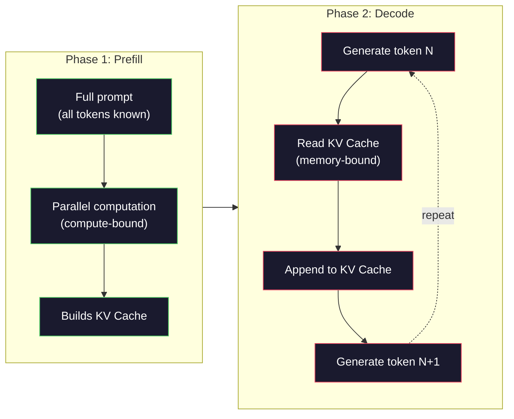

# Предобучение Mini GPT (124M параметров)

> У GPT-2 Small 124 миллиона параметров. Это 12 слоев transformer, 12 голов attention и эмбеддинги размерности 768. Такую модель можно обучить с нуля на одном GPU за несколько часов. Большинство людей никогда этого не делает. Они используют предобученные checkpoint'ы. Но если вы не обучили такую модель сами, вы по-настоящему не понимаете, что происходит внутри модели, на которой строите продукты.

**Тип:** Build
**Языки:** Python (with numpy)
**Предварительные требования:** Phase 10, Lessons 01-03 (Tokenizers, Building a Tokenizer, Data Pipelines)
**Время:** ~120 минут

## Цели обучения

- Реализовать полную архитектуру GPT-2 (124M параметров) с нуля: token embeddings, positional embeddings, transformer blocks и language model head
- Обучить GPT-модель на текстовом корпусе через предсказание следующего токена с cross-entropy loss
- Реализовать авторегрессионную генерацию текста с temperature sampling и top-k/top-p filtering
- Отслеживать кривые training loss и проверять, что модель учит связные языковые паттерны

## Проблема

Вы знаете, что такое transformer. Вы видели схемы. Вы можете процитировать "attention is all you need" и нарисовать на доске блоки с подписью "Multi-Head Attention".

Но это не означает, что вы понимаете, что происходит, когда модель генерирует текст.

В GPT-2 Small 124,438,272 параметра (с weight tying). Каждый из них был настроен запуском training loop: forward pass, вычисление loss, backward pass, обновление весов. Двенадцать transformer-блоков. Двенадцать attention heads в каждом блоке. Пространство эмбеддингов размерности 768. Словарь из 50,257 токенов. Каждый раз, когда модель генерирует токен, все 124 миллиона параметров участвуют в одной цепочке матричных умножений, которая берет последовательность token IDs и выдает распределение вероятностей для следующего токена.

Если вы никогда не строили это сами, вы работаете с черным ящиком. Вы можете использовать API. Можете делать fine-tuning. Но когда что-то идет не так -- когда модель галлюцинирует, повторяется или отказывается следовать инструкциям, -- у вас нет ментальной модели, объясняющей *почему*.

В этом уроке мы строим GPT-2 Small с нуля. Не на PyTorch. На numpy. Каждое матричное умножение видно. Каждый градиент вычисляется вашим кодом. Вы увидите, как именно 124 миллиона чисел совместно предсказывают следующее слово.

## Концепция

### Архитектура GPT

GPT -- это авторегрессионная языковая модель. "Авторегрессионная" означает, что она генерирует по одному токену за раз, и каждый токен обусловлен всеми предыдущими токенами. Архитектура представляет собой стек transformer decoder blocks.

Полный граф вычислений от token IDs до вероятностей следующего токена выглядит так:

1. На вход приходят Token IDs. Shape: (batch_size, seq_len).
2. Выполняется lookup token embeddings. Каждый ID отображается в 768-мерный вектор. Shape: (batch_size, seq_len, 768).
3. Выполняется lookup position embeddings. Каждая позиция (0, 1, 2, ...) отображается в 768-мерный вектор. Shape тот же.
4. Складываются token embeddings + position embeddings.
5. Результат проходит через 12 transformer blocks.
6. Выполняется final layer normalization.
7. Линейная проекция к размеру словаря. Shape: (batch_size, seq_len, vocab_size).
8. Softmax дает вероятности.

Это вся модель. Нет convolutions. Нет recurrence. Только embeddings, attention, feedforward networks и layer norms, сложенные в стек 12 раз.



### Transformer Block

Каждый из 12 блоков следует одному и тому же шаблону. Это pre-norm архитектура (GPT-2 использует pre-norm, а не post-norm, как оригинальный transformer):

1. LayerNorm
2. Multi-Head Self-Attention
3. Residual connection (добавить вход обратно)
4. LayerNorm
5. Feed-Forward Network (MLP)
6. Residual connection (добавить вход обратно)

Residual connections критичны. Без них градиенты исчезают к тому моменту, когда при backpropagation доходят до блока 1. С ними градиенты могут идти напрямую от loss к любому слою через "skip" path. Поэтому можно складывать 12, 32 или даже 96 блоков (по слухам, GPT-4 использует 120).

### Attention: основной механизм

Self-attention позволяет каждому токену смотреть на каждый предыдущий токен и решать, сколько внимания уделить каждому из них. Математика такая.

Для каждой позиции токена из входа вычисляются три вектора:
- **Query (Q)**: "Что я ищу?"
- **Key (K)**: "Что во мне содержится?"
- **Value (V)**: "Какую информацию я несу?"

```
Q = input @ W_q    (768 -> 768)
K = input @ W_k    (768 -> 768)
V = input @ W_v    (768 -> 768)

attention_scores = Q @ K^T / sqrt(d_k)
attention_scores = mask(attention_scores)   # causal mask: -inf for future positions
attention_weights = softmax(attention_scores)
output = attention_weights @ V
```

Causal mask делает GPT авторегрессионной. Позиция 5 может attend to positions 0-5, но не 6, 7, 8 и так далее. Это не дает модели "жульничать", заглядывая в будущие токены во время обучения.

**Multi-head attention** делит 768-мерное пространство на 12 heads по 64 измерения каждая. Каждая head учит свой attention pattern. Одна head может отслеживать синтаксические связи (согласование subject-verb). Другая -- семантическую близость (синонимы). Еще одна -- позиционную близость (соседние слова). Выходы всех 12 heads конкатенируются и проецируются обратно в 768 измерений.



Деление на sqrt(d_k) -- sqrt(64) = 8 -- это scaling. Без него dot products становятся большими для высокоразмерных векторов и загоняют softmax в области, где градиенты почти нулевые. Это было одним из ключевых инсайтов в оригинальной статье "Attention Is All You Need".

### KV Cache: почему inference быстрый

Во время обучения вы обрабатываете всю последовательность сразу. Во время inference вы генерируете по одному токену. Без оптимизации генерация токена N требует заново вычислять attention для всех N-1 предыдущих токенов. Это O(N^2) на один сгенерированный токен, или O(N^3) суммарно для последовательности длины N.

KV Cache решает эту проблему. После вычисления K и V для каждого токена мы сохраняем их. Когда генерируем токен N+1, нужно вычислить только Q для нового токена и взять cached K и V для всех предыдущих токенов. Это снижает per-token cost с O(N) до O(1) для вычисления K и V. Расчет attention scores все еще O(N), потому что мы attend to all previous positions, но лишние матричные умножения над входом исчезают.

Для GPT-2 с 12 layers и 12 heads KV cache хранит 2 (K + V) x 12 layers x 12 heads x 64 dims = 18,432 значения на токен. Для последовательности из 1024 токенов это около 75MB в FP32. Для Llama 3 405B со 128 layers KV cache для одной последовательности может превышать 10GB. Поэтому long-context inference ограничен памятью.

### Prefill vs Decode: две фазы inference

Когда вы отправляете prompt в LLM, inference проходит в две разные фазы.

**Prefill** обрабатывает весь prompt параллельно. Все токены известны, поэтому модель может вычислить attention для всех позиций одновременно. Эта фаза compute-bound: GPU выполняет матричные умножения на полной пропускной способности. Для prompt из 1000 токенов на A100 prefill занимает примерно 20-50ms.

**Decode** генерирует токены по одному. Каждый новый токен зависит от всех предыдущих. Эта фаза memory-bound: bottleneck -- чтение весов модели и KV cache из памяти GPU, а не сама матричная математика. Compute cores GPU в основном простаивают в ожидании чтений из памяти. Для GPT-2 каждый decode step занимает примерно одно и то же время независимо от того, сколько FLOPs требуют matmuls, потому что ограничение -- bandwidth памяти.

Это различие важно для production systems. Prefill throughput масштабируется с GPU compute (больше FLOPS = быстрее prefill). Decode throughput масштабируется с memory bandwidth (быстрее память = быстрее decode). Поэтому NVIDIA H100 фокусировалась на улучшении bandwidth памяти относительно A100: это напрямую ускоряет генерацию токенов.



### Training Loop

Обучение LLM -- это предсказание следующего токена. Даны tokens [0, 1, 2, ..., N-1], нужно предсказать tokens [1, 2, 3, ..., N]. Loss function -- cross-entropy между распределением вероятностей, предсказанным моделью, и фактическим следующим токеном.

Один training step:

1. **Forward pass**: прогнать batch через все 12 blocks. Получить logits (scores до softmax) для каждой позиции.
2. **Compute loss**: cross-entropy между logits и target tokens (input, сдвинутый на одну позицию).
3. **Backward pass**: вычислить gradients для всех 124M параметров через backpropagation.
4. **Optimizer step**: обновить веса. GPT-2 использует Adam с learning rate warmup и cosine decay.

Learning rate schedule важнее, чем может показаться. GPT-2 разогревает learning rate от 0 до peak learning rate за первые 2,000 steps, затем уменьшает его по cosine curve. Старт с высоким learning rate приводит к divergence. Постоянно высокий rate вызывает oscillation на позднем этапе обучения. Шаблон warmup-then-decay используется каждой крупной LLM.

### GPT-2 Small: числа

| Компонент | Shape | Параметры |
|-----------|-------|-----------|
| Token embeddings | (50257, 768) | 38,597,376 |
| Position embeddings | (1024, 768) | 786,432 |
| Per-block attention (W_q, W_k, W_v, W_out) | 4 x (768, 768) | 2,359,296 |
| Per-block FFN (up + down) | (768, 3072) + (3072, 768) | 4,718,592 |
| Per-block LayerNorms (2x) | 2 x 768 x 2 | 3,072 |
| Final LayerNorm | 768 x 2 | 1,536 |
| **Total per block** | | **7,080,960** |
| **Total (12 blocks)** | | **85,054,464 + 39,383,808 = 124,438,272** |

Output projection (logits head) использует общие веса с token embedding matrix. Это называется weight tying: оно уменьшает число параметров на 38M и улучшает качество, потому что заставляет модель использовать одно и то же representation space для входа и выхода.

## Build It

### Step 1: Embedding Layer

Token embeddings отображают каждый из 50,257 возможных токенов в 768-мерный вектор. Position embeddings добавляют информацию о том, где токен находится в последовательности. Эти два представления складываются.

```python
import numpy as np

class Embedding:
    def __init__(self, vocab_size, embed_dim, max_seq_len):
        self.token_embed = np.random.randn(vocab_size, embed_dim) * 0.02
        self.pos_embed = np.random.randn(max_seq_len, embed_dim) * 0.02

    def forward(self, token_ids):
        seq_len = token_ids.shape[-1]
        tok_emb = self.token_embed[token_ids]
        pos_emb = self.pos_embed[:seq_len]
        return tok_emb + pos_emb
```

Standard deviation 0.02 для initialization взято из статьи GPT-2. Слишком большое значение приводит к тому, что начальные forward passes создают экстремальные значения и дестабилизируют обучение. Слишком маленькое -- к почти одинаковым начальным выходам для всех входов, из-за чего ранние gradient signals бесполезны.

### Step 2: Self-Attention with Causal Mask

Сначала single-head attention. Causal mask выставляет будущие позиции в negative infinity перед softmax, гарантируя, что каждая позиция может attend только к себе и более ранним позициям.

```python
def attention(Q, K, V, mask=None):
    d_k = Q.shape[-1]
    scores = Q @ K.transpose(0, -1, -2 if Q.ndim == 4 else 1) / np.sqrt(d_k)
    if mask is not None:
        scores = scores + mask
    weights = np.exp(scores - scores.max(axis=-1, keepdims=True))
    weights = weights / weights.sum(axis=-1, keepdims=True)
    return weights @ V
```

Реализация softmax вычитает максимум перед exponentiating. Без этого exp(large_number) переполняется до infinity. Это прием numerical stability, который не меняет результат, потому что softmax(x - c) = softmax(x) для любой константы c.

### Step 3: Multi-Head Attention

Разделите 768-мерный вход на 12 heads по 64 измерения. Каждая head независимо вычисляет attention. Результаты конкатенируются и проецируются обратно в 768 измерений.

```python
class MultiHeadAttention:
    def __init__(self, embed_dim, num_heads):
        self.num_heads = num_heads
        self.head_dim = embed_dim // num_heads
        self.W_q = np.random.randn(embed_dim, embed_dim) * 0.02
        self.W_k = np.random.randn(embed_dim, embed_dim) * 0.02
        self.W_v = np.random.randn(embed_dim, embed_dim) * 0.02
        self.W_out = np.random.randn(embed_dim, embed_dim) * 0.02

    def forward(self, x, mask=None):
        batch, seq_len, d = x.shape
        Q = (x @ self.W_q).reshape(batch, seq_len, self.num_heads, self.head_dim).transpose(0, 2, 1, 3)
        K = (x @ self.W_k).reshape(batch, seq_len, self.num_heads, self.head_dim).transpose(0, 2, 1, 3)
        V = (x @ self.W_v).reshape(batch, seq_len, self.num_heads, self.head_dim).transpose(0, 2, 1, 3)

        scores = Q @ K.transpose(0, 1, 3, 2) / np.sqrt(self.head_dim)
        if mask is not None:
            scores = scores + mask
        weights = np.exp(scores - scores.max(axis=-1, keepdims=True))
        weights = weights / weights.sum(axis=-1, keepdims=True)
        attn_out = weights @ V

        attn_out = attn_out.transpose(0, 2, 1, 3).reshape(batch, seq_len, d)
        return attn_out @ self.W_out
```

Танец reshape-transpose-reshape -- самая запутанная часть multi-head attention. Происходит следующее: tensor (batch, seq_len, 768) становится (batch, seq_len, 12, 64), затем (batch, 12, seq_len, 64). Теперь у каждой из 12 heads есть собственная матрица (seq_len, 64), на которой она запускает attention. После attention мы обращаем процесс: (batch, 12, seq_len, 64) становится (batch, seq_len, 12, 64), затем (batch, seq_len, 768).

### Step 4: Transformer Block

Один полный transformer block: LayerNorm, multi-head attention с residual, LayerNorm, feedforward с residual.

```python
class LayerNorm:
    def __init__(self, dim, eps=1e-5):
        self.gamma = np.ones(dim)
        self.beta = np.zeros(dim)
        self.eps = eps

    def forward(self, x):
        mean = x.mean(axis=-1, keepdims=True)
        var = x.var(axis=-1, keepdims=True)
        return self.gamma * (x - mean) / np.sqrt(var + self.eps) + self.beta


class FeedForward:
    def __init__(self, embed_dim, ff_dim):
        self.W1 = np.random.randn(embed_dim, ff_dim) * 0.02
        self.b1 = np.zeros(ff_dim)
        self.W2 = np.random.randn(ff_dim, embed_dim) * 0.02
        self.b2 = np.zeros(embed_dim)

    def forward(self, x):
        h = x @ self.W1 + self.b1
        h = np.maximum(0, h)  # GELU approximation: ReLU for simplicity
        return h @ self.W2 + self.b2


class TransformerBlock:
    def __init__(self, embed_dim, num_heads, ff_dim):
        self.ln1 = LayerNorm(embed_dim)
        self.attn = MultiHeadAttention(embed_dim, num_heads)
        self.ln2 = LayerNorm(embed_dim)
        self.ffn = FeedForward(embed_dim, ff_dim)

    def forward(self, x, mask=None):
        x = x + self.attn.forward(self.ln1.forward(x), mask)
        x = x + self.ffn.forward(self.ln2.forward(x))
        return x
```

Feedforward network расширяет 768-мерный вход до 3,072 измерений (4x), применяет нелинейность, затем проецирует обратно в 768. Этот pattern expansion-contraction дает модели более "широкое" внутреннее представление для работы в каждой позиции. GPT-2 использует activation GELU, но здесь для простоты мы используем ReLU: для понимания архитектуры разница невелика.

### Step 5: Full GPT Model

Сложите 12 transformer blocks. Добавьте embedding layer в начале и output projection в конце.

```python
class MiniGPT:
    def __init__(self, vocab_size=50257, embed_dim=768, num_heads=12,
                 num_layers=12, max_seq_len=1024, ff_dim=3072):
        self.embedding = Embedding(vocab_size, embed_dim, max_seq_len)
        self.blocks = [
            TransformerBlock(embed_dim, num_heads, ff_dim)
            for _ in range(num_layers)
        ]
        self.ln_f = LayerNorm(embed_dim)
        self.vocab_size = vocab_size
        self.embed_dim = embed_dim

    def forward(self, token_ids):
        seq_len = token_ids.shape[-1]
        mask = np.triu(np.full((seq_len, seq_len), -1e9), k=1)

        x = self.embedding.forward(token_ids)
        for block in self.blocks:
            x = block.forward(x, mask)
        x = self.ln_f.forward(x)

        logits = x @ self.embedding.token_embed.T
        return logits

    def count_parameters(self):
        total = 0
        total += self.embedding.token_embed.size
        total += self.embedding.pos_embed.size
        for block in self.blocks:
            total += block.attn.W_q.size + block.attn.W_k.size
            total += block.attn.W_v.size + block.attn.W_out.size
            total += block.ffn.W1.size + block.ffn.b1.size
            total += block.ffn.W2.size + block.ffn.b2.size
            total += block.ln1.gamma.size + block.ln1.beta.size
            total += block.ln2.gamma.size + block.ln2.beta.size
        total += self.ln_f.gamma.size + self.ln_f.beta.size
        return total
```

Обратите внимание на weight tying: `logits = x @ self.embedding.token_embed.T`. Output projection повторно использует token embedding matrix (транспонированную). Это не только прием для экономии параметров. Это означает, что модель использует одно и то же vector space для понимания токенов (embeddings) и их предсказания (output).

### Step 6: Training Loop

Для настоящего обучения 124M параметров вам понадобились бы GPU и PyTorch. Этот training loop демонстрирует механику на маленькой модели, которая запускается на чистом numpy. Мы используем крошечную модель (4 layers, 4 heads, 128 dims), чтобы вычисления были подъемными.

```python
def cross_entropy_loss(logits, targets):
    batch, seq_len, vocab_size = logits.shape
    logits_flat = logits.reshape(-1, vocab_size)
    targets_flat = targets.reshape(-1)

    max_logits = logits_flat.max(axis=-1, keepdims=True)
    log_softmax = logits_flat - max_logits - np.log(
        np.exp(logits_flat - max_logits).sum(axis=-1, keepdims=True)
    )

    loss = -log_softmax[np.arange(len(targets_flat)), targets_flat].mean()
    return loss


def train_mini_gpt(text, vocab_size=256, embed_dim=128, num_heads=4,
                   num_layers=4, seq_len=64, num_steps=200, lr=3e-4):
    tokens = np.array(list(text.encode("utf-8")[:2048]))
    model = MiniGPT(
        vocab_size=vocab_size, embed_dim=embed_dim, num_heads=num_heads,
        num_layers=num_layers, max_seq_len=seq_len, ff_dim=embed_dim * 4
    )

    print(f"Model parameters: {model.count_parameters():,}")
    print(f"Training tokens: {len(tokens):,}")
    print(f"Config: {num_layers} layers, {num_heads} heads, {embed_dim} dims")
    print()

    for step in range(num_steps):
        start_idx = np.random.randint(0, max(1, len(tokens) - seq_len - 1))
        batch_tokens = tokens[start_idx:start_idx + seq_len + 1]

        input_ids = batch_tokens[:-1].reshape(1, -1)
        target_ids = batch_tokens[1:].reshape(1, -1)

        logits = model.forward(input_ids)
        loss = cross_entropy_loss(logits, target_ids)

        if step % 20 == 0:
            print(f"Step {step:4d} | Loss: {loss:.4f}")

    return model
```

Loss начинается около ln(vocab_size): для byte-level vocabulary из 256 токенов это ln(256) = 5.55. Случайная модель назначает всем токенам одинаковую вероятность. По мере обучения loss падает, потому что модель учится предсказывать частые паттерны: "th" после "t", пробел после точки и так далее.

В production вы использовали бы optimizer Adam с gradient accumulation, learning rate warmup и gradient clipping. Цикл forward-pass-loss-backward-update остается тем же. Optimizer просто более сложный.

### Step 7: Text Generation

Generation использует обученную модель, чтобы предсказывать по одному токену. Каждое предсказание sample'ится из output distribution (или берется greedily как argmax).

```python
def generate(model, prompt_tokens, max_new_tokens=100, temperature=0.8):
    tokens = list(prompt_tokens)
    seq_len = model.embedding.pos_embed.shape[0]

    for _ in range(max_new_tokens):
        context = np.array(tokens[-seq_len:]).reshape(1, -1)
        logits = model.forward(context)
        next_logits = logits[0, -1, :]

        next_logits = next_logits / temperature
        probs = np.exp(next_logits - next_logits.max())
        probs = probs / probs.sum()

        next_token = np.random.choice(len(probs), p=probs)
        tokens.append(next_token)

    return tokens
```

Temperature управляет случайностью. Temperature 1.0 использует исходное распределение. Temperature 0.5 заостряет его (более deterministic: модель чаще выбирает top choices). Temperature 1.5 сглаживает его (более random: low-probability tokens получают больший шанс). Temperature 0.0 -- это greedy decoding (всегда выбирать токен с максимальной вероятностью).

Окно `tokens[-seq_len:]` необходимо, потому что у модели есть максимальная длина контекста (1024 для GPT-2). Когда вы превышаете ее, старейшие токены приходится отбрасывать. Это и есть "context window", о котором все говорят.

## Use It

### Full Training and Generation Demo

```python
corpus = """The transformer architecture has revolutionized natural language processing.
Attention mechanisms allow the model to focus on relevant parts of the input.
Self-attention computes relationships between all pairs of positions in a sequence.
Multi-head attention splits the representation into multiple subspaces.
Each attention head can learn different types of relationships.
The feedforward network provides nonlinear transformations at each position.
Residual connections enable gradient flow through deep networks.
Layer normalization stabilizes training by normalizing activations.
Position embeddings give the model information about token ordering.
The causal mask ensures autoregressive generation during training.
Pre-training on large text corpora teaches the model general language understanding.
Fine-tuning adapts the pre-trained model to specific downstream tasks."""

model = train_mini_gpt(corpus, num_steps=200)

prompt = list("The transformer".encode("utf-8"))
output_tokens = generate(model, prompt, max_new_tokens=100, temperature=0.8)
generated_text = bytes(output_tokens).decode("utf-8", errors="replace")
print(f"\nGenerated: {generated_text}")
```

На маленьком корпусе и маленькой модели сгенерированный текст в лучшем случае будет полусвязным. Модель выучит некоторые byte-level patterns из training text, но не сможет обобщать так, как GPT-2 с 40GB обучающих данных и полной архитектурой на 124M параметров. Цель не в качестве output. Цель в том, что вы можете проследить каждый шаг: embedding lookup, attention computation, feedforward transformation, logit projection, softmax и sampling. Каждая операция видна.

## Ship It

Этот урок создает `outputs/prompt-gpt-architecture-analyzer.md` -- prompt, который анализирует architectural choices в любой GPT-style model. Подайте ему model card или technical report, и он разберет parameter allocation, attention design и scaling decisions.

## Exercises

1. Измените модель так, чтобы она использовала 24 layers и 16 heads вместо 12/12. Посчитайте параметры. Как удвоение глубины соотносится с удвоением ширины (embedding dimension)?

2. Реализуйте activation function GELU (GELU(x) = x * 0.5 * (1 + erf(x / sqrt(2)))) и замените ReLU в feedforward network. Запустите обучение на 500 steps с каждой activation и сравните final loss.

3. Добавьте KV cache в generation function. Сохраняйте tensors K и V для каждого layer после первого forward pass и переиспользуйте их для следующих токенов. Измерьте speedup: сгенерируйте 200 токенов с cache и без него и сравните wall-clock time.

4. Реализуйте top-k sampling (учитывать только k токенов с наибольшей вероятностью) и top-p sampling (nucleus sampling: учитывать минимальный набор токенов, cumulative probability которого превышает p). Сравните output quality при temperature 0.8 с top-k=50 и top-p=0.95.

5. Постройте plotter для training loss curve. Обучайте модель 1000 steps и постройте loss vs step. Найдите три фазы: быстрый начальный descent (изучение частых bytes), более медленная middle phase (изучение byte patterns) и plateau (overfitting на маленьком corpus). Форма этой кривой одинакова независимо от того, обучаете ли вы 128-dim model или GPT-4.

## Key Terms

| Термин | Как обычно говорят | Что это на самом деле означает |
|------|----------------|----------------------|
| Autoregressive | "Генерирует по одному слову" | Каждый output token обусловлен всеми previous tokens -- модель предсказывает P(token_n \| token_0, ..., token_{n-1}) |
| Causal mask | "Не видит будущее" | Upper-triangular matrix из -infinity values, которая предотвращает attention к future positions во время training |
| Multi-head attention | "Несколько attention patterns" | Разбиение Q, K, V на parallel heads (например, 12 heads по 64 dims для GPT-2), чтобы каждая head могла учить разные types relationships |
| KV Cache | "Кэширование для скорости" | Хранение вычисленных Key и Value tensors из previous tokens, чтобы избежать redundant computation при autoregressive generation |
| Prefill | "Обработка prompt" | Первая фаза inference, где все prompt tokens обрабатываются параллельно -- compute-bound на GPU FLOPS |
| Decode | "Генерация токенов" | Вторая фаза inference, где tokens генерируются по одному -- memory-bound на GPU bandwidth |
| Weight tying | "Sharing embeddings" | Использование одной и той же matrix для input token embeddings и output projection head -- экономит 38M params в GPT-2 |
| Residual connection | "Skip connection" | Добавление input напрямую к output sublayer (x + sublayer(x)) -- обеспечивает gradient flow в deep networks |
| Layer normalization | "Normalizing activations" | Нормализация по feature dimension к mean 0 и variance 1, с learnable scale и bias parameters |
| Cross-entropy loss | "Насколько ошибаются predictions" | -log(probability assigned to the correct next token), усредненный по всем positions -- стандартная LLM training objective |

## Further Reading

- [Radford et al., 2019 -- "Language Models are Unsupervised Multitask Learners" (GPT-2)](https://cdn.openai.com/better-language-models/language_models_are_unsupervised_multitask_learners.pdf) -- статья GPT-2, представившая семейство от 124M до 1.5B параметров
- [Vaswani et al., 2017 -- "Attention Is All You Need"](https://arxiv.org/abs/1706.03762) -- оригинальная статья о transformer со scaled dot-product attention и multi-head attention
- [Llama 3 Technical Report](https://arxiv.org/abs/2407.21783) -- как Meta масштабировала GPT architecture до 405B параметров на 16K GPUs
- [Pope et al., 2022 -- "Efficiently Scaling Transformer Inference"](https://arxiv.org/abs/2211.05102) -- статья, формализовавшая prefill vs decode и анализ KV cache
