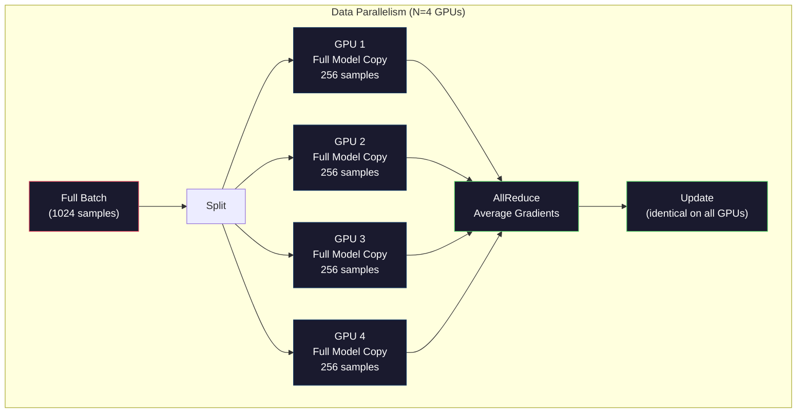
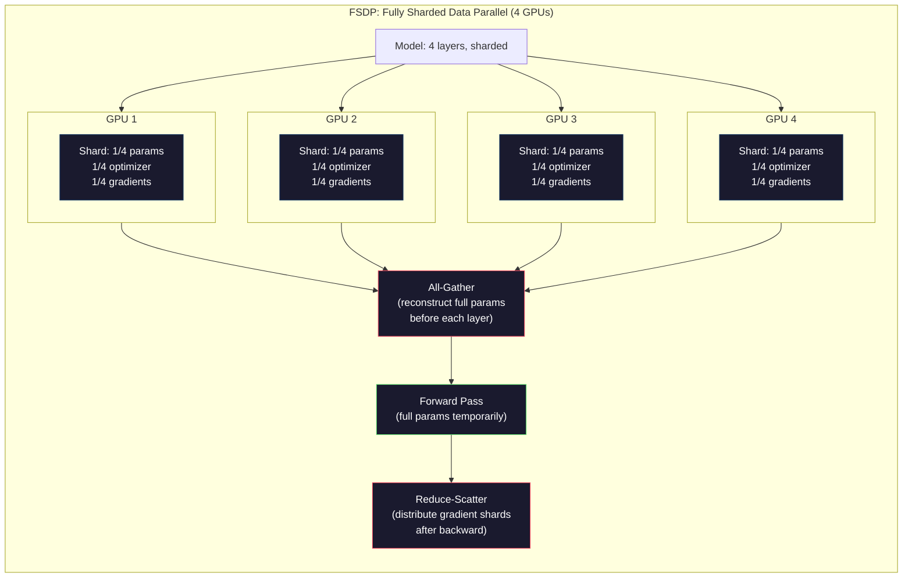
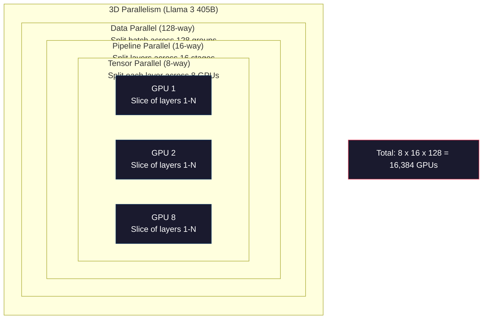

# Scaling: Distributed Training, FSDP, DeepSpeed

> Ваша модель на 124M параметров обучилась на одном GPU. Теперь попробуйте 7 миллиардов параметров. Модель не помещается в память. Данные на одной машине обучались бы неделями. Distributed training в таком масштабе не опция, а единственный путь вперед.

**Тип:** Build
**Языки:** Python
**Предварительные требования:** Phase 10, Lesson 04 (Pre-Training a Mini GPT)
**Время:** ~120 минут

## Цели обучения

- Объяснить три вида parallelism (data, tensor, pipeline) и когда каждый нужен в зависимости от размера модели и кластера
- Реализовать data-parallel training с PyTorch DDP и synchronization gradients между несколькими GPUs
- Рассчитать memory budget для заданного размера модели (weights + optimizer states + gradients + activations), чтобы определить минимальное hardware
- Настроить FSDP или DeepSpeed ZeRO stages для sharding model states между GPUs и размещения моделей, которые превышают память одного GPU

## Проблема

Модель на 7B параметров в FP16 требует 14GB только под weights. Optimizer Adam хранит две дополнительные копии каждого параметра (оценки первого и второго момента). Это еще 28GB. Gradients во время backpropagation добавляют еще 14GB. Вы уже на 56GB еще до того, как сохранена хотя бы одна activation.

У NVIDIA A100 80GB памяти.

56GB из 80GB заняты. Остается 24GB под activations -- промежуточные значения, вычисляемые во время forward pass, которые нужно держать живыми для backpropagation. Для sequence из 2048 токенов с моделью размерности 4096 activations одного слоя занимают около 64MB. С 32 layers нужно 2GB на sample. Batch size 8 требует 16GB. У вас 24GB. Batch size 12 уже ломается.

Теперь попробуйте 70B параметров. Только weights: 140GB в FP16. На один GPU не помещается. Нужно как минимум 2 A100 (2 x 80GB = 160GB), чтобы просто держать weights. Добавьте optimizer states и gradients, и потребуется намного больше: минимум 3+ GPUs, а реалистично 8-16 в зависимости от sharding strategy.

Llama 3 405B обучали на 16,384 NVIDIA H100 GPUs. Training run стоил примерно $100 million compute. DeepSeek V3 обучил сопоставимую модель примерно за $5.6 million благодаря более умной architecture (Mixture of Experts означает, что на один токен активируется только часть параметров) и эффективности обучения.

Этот урок разбирает четыре стратегии, которые делают large-scale training возможным: data parallelism, tensor parallelism, pipeline parallelism и fully sharded data parallelism. Вы смоделируете каждую на чистом Python, чтобы понять механику до работы с distributed training framework.

## Концепция

### Почему distribution обязательна

Вот memory math для реальных моделей. Каждое число рассчитано, а не оценено на глаз.

| Model | Params | Weights (FP16) | Adam States | Gradients (FP16) | Total (no activations) |
|-------|--------|----------------|-------------|------------------|----------------------|
| GPT-2 Small | 124M | 248 MB | 992 MB | 248 MB | 1.5 GB |
| Llama 3 8B | 8B | 16 GB | 64 GB | 16 GB | 96 GB |
| Llama 3 70B | 70B | 140 GB | 560 GB | 140 GB | 840 GB |
| Llama 3 405B | 405B | 810 GB | 3,240 GB | 810 GB | 4,860 GB |

Колонка "Adam States" -- главный убийца памяти. Adam хранит running mean (m) и running variance (v) для каждого параметра, оба в FP32. Для модели 70B это 70B x 4 bytes x 2 = 560GB. Один optimizer требует семь A100.

У одного H100 80GB. Llama 3 405B требует как минимум 61 H100, чтобы держать weights, optimizer и gradients. Добавьте activations, и число станет еще больше. Meta использовала 16,384 GPUs не потому, что хотела, а потому, что иначе было нельзя.

### Data Parallelism

Самая простая distributed strategy. Скопировать всю модель на N GPUs. Разделить каждый training batch на N равных частей. Каждый GPU выполняет forward и backward pass на своем shard данных. После backward pass gradients усредняются между всеми GPUs. Каждый GPU обновляет свою копию weights теми же averaged gradients, сохраняя все копии синхронизированными.

**Хорошо:** линейное масштабирование throughput. N GPUs обрабатывают в N раз больше данных за step. Communication ограничена gradient averaging, который перекрывается с computation.

**Плохо:** каждый GPU держит полную копию модели, optimizer states и gradients. Для модели 70B каждому GPU нужно 840GB. Data parallelism никак не уменьшает per-GPU memory. Он только сокращает training time.

**Математика:** Effective batch size = per_gpu_batch_size x N. Для N=64 GPUs с per-GPU batch 16 effective batch равен 1,024. Llama 3 использовала effective batch size 16 million tokens per step.



### Tensor Parallelism

Разделить отдельные layers между GPUs. Одно matrix multiplication делится между GPUs, и каждый вычисляет свою часть результата.

Рассмотрим weight matrix формы (8192, 8192) в feedforward layer. При 4-way tensor parallelism каждый GPU хранит shard (8192, 2048). Каждый GPU умножает input на свой shard и получает partial result. Partial results объединяются (через all-reduce или all-gather), чтобы получить full output.

**Хорошо:** уменьшает per-GPU memory для model weights. Модель 70B, разделенная между 8 GPUs, означает, что каждый GPU держит weights примерно на 8.75B параметров.

**Плохо:** после каждого layer требуется быстрая inter-GPU communication. All-reduce после каждого matmul добавляет latency. Это хорошо работает с NVLink (900 GB/s между GPUs в одном node), но плохо между nodes через InfiniBand (400 Gb/s, около 50 GB/s). Tensor parallelism почти всегда ограничен одним node (8 GPUs).

**Реальное использование:** Megatron-LM популяризировал tensor parallelism. Llama 3 405B использует 8-way tensor parallelism внутри каждого node.

### Pipeline Parallelism

Разделить модель по layers. GPU 1 выполняет layers 1-8. GPU 2 -- layers 9-16. GPU 3 -- layers 17-24. GPU 4 -- layers 25-32. Данные текут через pipeline: GPU 1 вычисляет свои layers и отправляет activations на GPU 2, тот вычисляет свои layers и отправляет на GPU 3, и так далее.

**Хорошо:** минимальная communication между GPUs -- только activations на границах layers, которые малы по сравнению с gradients или weights. Работает между nodes, потому что требования к bandwidth низкие.

**Плохо:** pipeline bubbles. Когда GPU 4 вычисляет forward pass на micro-batch 1, GPUs 1, 2 и 3 простаивают (они уже передали свою часть). Во время backward pass pattern разворачивается. При naive pipelining GPU utilization равен только 1/N для N pipeline stages.

**GPipe and PipeDream** решают bubble problem, разбивая batch на micro-batches. GPU 1 начинает micro-batch 2 сразу после завершения forward для micro-batch 1. Это перекрывает computation между pipeline stages. При M micro-batches и N stages bubble fraction падает до (N-1)/M. Если M=16 micro-batches и N=4 stages, bubble равен 3/16 = 18.75% idle time.

### FSDP: Fully Sharded Data Parallel

FSDP объединяет scalability data parallelism с memory efficiency sharding. Вместо того чтобы каждый GPU хранил полную копию модели, каждый GPU хранит только 1/N parameters, gradients и optimizer states.

Перед forward pass слоя FSDP выполняет **all-gather**, чтобы собрать полные parameters со всех GPUs в память каждого GPU. После forward pass каждый GPU отбрасывает non-local parameters. Во время backward all-gather запускается снова, чтобы восстановить параметры для gradient computation. После backward pass **reduce-scatter** распределяет gradient shards так, что каждый GPU хранит только 1/N gradients.

**Математика для модели 70B на 8 GPUs:**

| Компонент | Without FSDP | With FSDP |
|-----------|-------------|-----------|
| Weights (FP16) | 140 GB per GPU | 17.5 GB per GPU |
| Adam States (FP32) | 560 GB per GPU | 70 GB per GPU |
| Gradients (FP16) | 140 GB per GPU | 17.5 GB per GPU |
| **Total** | **840 GB per GPU** | **105 GB per GPU** |

Без FSDP модель 70B не помещается на один 80GB GPU. С FSDP на 8 GPUs каждый GPU использует 105GB -- стоп, это все еще не помещается. Нужно как минимум 16 GPUs, чтобы опуститься ниже 80GB per GPU, или нужно сочетать FSDP с activation checkpointing (перевычислять activations во время backward вместо хранения).

Communication cost выше, чем у обычного data parallelism, из-за all-gather перед каждым layer. Но экономия памяти делает возможными training runs, которые раньше были невозможны.



### DeepSpeed ZeRO

DeepSpeed ZeRO (Zero Redundancy Optimizer) концептуально идентичен FSDP, но был независимо разработан Microsoft. Он задает три stages, каждый из которых shards более агрессивно:

| Stage | Shards | Memory Savings | Communication |
|-------|--------|---------------|---------------|
| ZeRO-1 | Optimizer states only | ~4x reduction | Same as data parallel |
| ZeRO-2 | + Gradients | ~8x reduction | Slightly more |
| ZeRO-3 | + Parameters | ~Nx reduction (N GPUs) | All-gather per layer |

ZeRO-3 эквивалентен FSDP. Названия разные, механизм тот же. PyTorch добавил FSDP как native implementation после того, как DeepSpeed доказал идею.

DeepSpeed также представил ZeRO-Offload (выгружать optimizer states в CPU RAM, которая дешевле и больше) и ZeRO-Infinity (выгружать в NVMe SSDs). Это обмен compute speed на memory capacity: offloaded operations медленнее, но освобождают GPU memory.

### Mixed Precision Training

Современное обучение использует несколько floating-point formats одновременно:

- **Forward pass**: FP16 или BF16 (16-bit). Вдвое меньше памяти, чем FP32. Matmuls работают в 2 раза быстрее на tensor cores.
- **Master weights**: FP32 (32-bit). Поддерживаются optimizer для numerical precision во время weight updates.
- **Loss scaling**: умножить loss на большую константу перед backward pass, чтобы FP16 gradients не underflow до нуля. Разделить на ту же константу перед optimizer step.

BF16 (Brain Float 16) имеет тот же exponent range, что и FP32 (8 exponent bits), но меньшую precision (7 mantissa bits против 23 у FP32). Ему редко нужен loss scaling, потому что он представляет тот же диапазон значений. FP16 имеет 5 exponent bits и 10 mantissa bits: он может представлять более точные значения, но overflow/underflow на экстремальных величинах.

TPUs Google используют BF16 нативно. NVIDIA A100 и H100 поддерживают и FP16, и BF16. Индустрия в основном перешла на BF16, потому что он устраняет проблемы с loss scaling.

**Memory comparison for a 7B model:**

| Precision | Weights | Optimizer | Gradients | Total |
|-----------|---------|-----------|-----------|-------|
| FP32 everywhere | 28 GB | 56 GB | 28 GB | 112 GB |
| Mixed (BF16 + FP32 master) | 14 GB | 56 GB | 14 GB | 84 GB |

Mixed precision экономит 28GB на этой модели. Optimizer states остаются в FP32 независимо от формата: именно туда уходит большая часть памяти.

### Megatron-LM and 3D Parallelism

Настоящее large-scale training объединяет все три parallelisms:

- **Data parallelism** между groups of nodes (масштабировать batch size)
- **Tensor parallelism** внутри node (разделить layers между 8 GPUs)
- **Pipeline parallelism** между nodes (разделить groups of layers между machines)

Llama 3 405B на 16,384 H100s:
- 8-way tensor parallelism внутри каждого node (8 GPUs per node)
- 16-way pipeline parallelism между nodes (16 pipeline stages)
- 128-way data parallelism по оставшемуся измерению (16,384 / 8 / 16 = 128)

Эта 3D decomposition (8 x 16 x 128 = 16,384) позволяет масштабироваться до тысяч GPUs. Каждый GPU видит другой data shard (data parallel), хранит один slice каждого layer (tensor parallel) и вычисляет другой набор layers (pipeline parallel).

DeepSeek V3 выбрал другой подход. Их Mixture of Experts architecture активирует только 37B из 671B parameters на токен. Значит, каждый GPU должен вычислять (и хранить activations для) только active parameters. Они обучали на 2,048 H800 GPUs -- меньше чем 1/8 от числа GPUs у Meta -- за $5.6M против оценочных $100M у Meta.



## Build It

### Step 1: Simulate Data Parallelism

Разделите batch между simulated GPUs. Каждый GPU вычисляет forward pass на своем shard. Усредните "gradients" (мы симулируем их как loss values).

```python
import numpy as np

def simulate_data_parallelism(data, num_gpus, model_fn):
    batch_size = len(data)
    shard_size = batch_size // num_gpus
    remainder = batch_size % num_gpus

    gpu_losses = []
    gpu_gradients = []

    offset = 0
    for gpu_id in range(num_gpus):
        extra = 1 if gpu_id < remainder else 0
        shard = data[offset:offset + shard_size + extra]
        offset += shard_size + extra

        loss, grad = model_fn(shard)
        gpu_losses.append(loss)
        gpu_gradients.append(grad)

    avg_loss = np.mean(gpu_losses)
    avg_gradient = np.mean(gpu_gradients, axis=0)

    return avg_loss, avg_gradient
```

Операция all-reduce (усреднение gradients) -- единственная communication в data parallelism. На практике для NVIDIA GPUs используется библиотека NCCL, которая реализует ring all-reduce: каждый GPU отправляет 1/N своих gradients соседу, получает 1/N от другого соседа, и после N-1 steps каждый GPU имеет полный average. Total communication volume: 2 x gradient_size x (N-1)/N, что для больших N приближается к 2x gradient size.

### Step 2: Simulate Tensor Parallelism

Разделите weight matrix между GPUs. Каждый GPU вычисляет partial matrix multiplication. Объедините результаты.

```python
def simulate_tensor_parallelism(input_data, weight_matrix, num_gpus):
    d_in, d_out = weight_matrix.shape
    assert d_out % num_gpus == 0, f"d_out {d_out} not divisible by num_gpus {num_gpus}"
    shard_size = d_out // num_gpus

    partial_results = []
    for gpu_id in range(num_gpus):
        start = gpu_id * shard_size
        end = start + shard_size
        weight_shard = weight_matrix[:, start:end]

        partial = input_data @ weight_shard
        partial_results.append(partial)

    full_output = np.concatenate(partial_results, axis=-1)

    direct_output = input_data @ weight_matrix
    error = np.abs(full_output - direct_output).max()

    return full_output, error
```

Error должен быть ровно ноль (или machine epsilon). Tensor parallelism математически точен: он дает тот же результат, что и full matmul на одном GPU. Split выполняется по output dimension, поэтому каждый GPU производит другой chunk columns, а concatenation восстанавливает full result.

Для column-parallel linear layers (split output dimension) вы выполняете concatenate. Для row-parallel (split input dimension) -- sum. В transformer FFN первый linear (expand) использует column-parallel, а второй linear (contract) -- row-parallel. Это позволяет избежать all-reduce между двумя layers.

### Step 3: Simulate Pipeline Parallelism

Разделите layers модели между virtual GPUs. Покажите bubble problem, где early stages простаивают, пока later stages вычисляют.

```python
def simulate_pipeline_parallelism(num_layers, num_stages, num_microbatches):
    layers_per_stage = num_layers // num_stages

    timeline = {}
    clock = 0

    for mb in range(num_microbatches):
        for stage in range(num_stages):
            start_time = max(
                timeline.get((stage, mb - 1, "fwd"), (0, 0))[1] if mb > 0 else 0,
                timeline.get((stage - 1, mb, "fwd"), (0, 0))[1] if stage > 0 else 0,
            )
            end_time = start_time + layers_per_stage
            timeline[(stage, mb, "fwd")] = (start_time, end_time)

    last_fwd_end = max(v[1] for v in timeline.values())

    for mb in range(num_microbatches - 1, -1, -1):
        for stage in range(num_stages - 1, -1, -1):
            deps = [last_fwd_end]
            if mb < num_microbatches - 1 and (stage, mb + 1, "bwd") in timeline:
                deps.append(timeline[(stage, mb + 1, "bwd")][1])
            if stage < num_stages - 1 and (stage + 1, mb, "bwd") in timeline:
                deps.append(timeline[(stage + 1, mb, "bwd")][1])
            start_time = max(deps)
            end_time = start_time + layers_per_stage
            timeline[(stage, mb, "bwd")] = (start_time, end_time)

    total_time = max(v[1] for v in timeline.values())
    compute_time = num_microbatches * num_stages * layers_per_stage * 2
    bubble_fraction = 1.0 - compute_time / (total_time * num_stages)

    return timeline, total_time, bubble_fraction
```

При 4 stages и 1 micro-batch bubble fraction равен 75%: три из четырех GPUs простаивают в любой момент времени. С 16 micro-batches он падает примерно до 19%. Цена устранения bubbles -- память: нужно одновременно хранить activations для всех in-flight micro-batches.

### Step 4: Memory Calculator

Вычислите точные memory requirements для обучения модели любого размера.

```python
def memory_calculator(
    params_billions,
    precision_bytes=2,
    optimizer="adam",
    num_gpus=1,
    sharding="none",
    sequence_length=2048,
    batch_size_per_gpu=1,
    hidden_dim=None,
    num_layers=None,
):
    params = params_billions * 1e9

    weight_memory = params * precision_bytes

    if optimizer == "adam":
        optimizer_memory = params * 4 * 2
    elif optimizer == "sgd":
        optimizer_memory = params * 4
    else:
        optimizer_memory = 0

    gradient_memory = params * precision_bytes

    total_no_activation = weight_memory + optimizer_memory + gradient_memory

    if hidden_dim and num_layers:
        activation_per_layer = (
            sequence_length * batch_size_per_gpu * hidden_dim * precision_bytes * 4
        )
        activation_memory = activation_per_layer * num_layers
    else:
        activation_memory = params * precision_bytes * 0.5

    if sharding == "fsdp" or sharding == "zero3":
        weight_memory /= num_gpus
        optimizer_memory /= num_gpus
        gradient_memory /= num_gpus
    elif sharding == "zero2":
        optimizer_memory /= num_gpus
        gradient_memory /= num_gpus
    elif sharding == "zero1":
        optimizer_memory /= num_gpus

    per_gpu_total = weight_memory + optimizer_memory + gradient_memory + activation_memory

    return {
        "params_billions": params_billions,
        "weights_gb": weight_memory / 1e9,
        "optimizer_gb": optimizer_memory / 1e9,
        "gradients_gb": gradient_memory / 1e9,
        "activations_gb": activation_memory / 1e9,
        "per_gpu_total_gb": per_gpu_total / 1e9,
        "total_across_gpus_gb": per_gpu_total * num_gpus / 1e9,
        "fits_on_80gb": per_gpu_total / 1e9 <= 80,
        "num_gpus": num_gpus,
        "sharding": sharding,
    }
```

Этот calculator отвечает на вопрос, который задает каждый ML engineer: "How many GPUs do I need?" Передайте ему model size и проверьте, помещается ли модель. Настраивайте sharding strategy, пока per-GPU total не опустится ниже 80GB.

### Step 5: Mixed Precision Simulation

Сравните memory usage между FP32, FP16 и mixed precision training.

```python
def mixed_precision_comparison(params_billions):
    params = params_billions * 1e9

    fp32_weights = params * 4
    fp32_optimizer = params * 4 * 2
    fp32_gradients = params * 4
    fp32_total = fp32_weights + fp32_optimizer + fp32_gradients

    fp16_weights = params * 2
    fp16_master = params * 4
    fp16_optimizer = params * 4 * 2
    fp16_gradients = params * 2
    fp16_total = fp16_weights + fp16_master + fp16_optimizer + fp16_gradients

    mixed_weights = params * 2
    mixed_optimizer = params * 4 * 2
    mixed_gradients = params * 2
    mixed_total = mixed_weights + mixed_optimizer + mixed_gradients

    return {
        "fp32_total_gb": fp32_total / 1e9,
        "fp16_with_master_gb": fp16_total / 1e9,
        "mixed_bf16_gb": mixed_total / 1e9,
        "savings_vs_fp32": 1 - mixed_total / fp32_total,
    }
```

Главный сюрприз для большинства: mixed precision не уменьшает память вдвое. Optimizer states (Adam's m and v) остаются в FP32 независимо от precision. Для модели 7B FP32 training использует 112GB. Mixed precision использует 84GB. Это reduction на 25%, а не на 50%. Dominates именно optimizer.

## Use It

### Run All Simulations

```python
def run_all_demos():
    print("=" * 70)
    print("DATA PARALLELISM SIMULATION")
    print("=" * 70)

    np.random.seed(42)
    data = np.random.randn(64, 32)
    weight = np.random.randn(32, 16)

    def model_fn(batch):
        output = batch @ weight
        loss = np.mean(output ** 2)
        grad = 2 * batch.T @ (batch @ weight) / len(batch)
        return loss, grad

    for n_gpus in [1, 2, 4, 8]:
        loss, grad = simulate_data_parallelism(data, n_gpus, model_fn)
        print(f"  {n_gpus} GPUs: loss={loss:.4f}, grad_norm={np.linalg.norm(grad):.4f}")

    print()
    print("=" * 70)
    print("TENSOR PARALLELISM SIMULATION")
    print("=" * 70)

    x = np.random.randn(4, 8192)
    W = np.random.randn(8192, 8192)

    for n_gpus in [1, 2, 4, 8]:
        output, error = simulate_tensor_parallelism(x, W, n_gpus)
        print(f"  {n_gpus} GPUs: output_shape={output.shape}, max_error={error:.2e}")

    print()
    print("=" * 70)
    print("PIPELINE PARALLELISM SIMULATION")
    print("=" * 70)

    for n_mb in [1, 4, 8, 16, 32]:
        _, total_t, bubble = simulate_pipeline_parallelism(32, 4, n_mb)
        print(f"  {n_mb:2d} micro-batches: total_time={total_t:4d}, bubble={bubble:.1%}")

    print()
    print("=" * 70)
    print("MEMORY CALCULATOR")
    print("=" * 70)

    configs = [
        (7, "none", 1),
        (7, "fsdp", 8),
        (70, "none", 1),
        (70, "fsdp", 8),
        (70, "fsdp", 16),
        (405, "fsdp", 64),
        (405, "fsdp", 128),
    ]

    print(f"  {'Model':>8} {'Sharding':>8} {'GPUs':>5} {'Per-GPU':>10} {'Fits 80GB':>10}")
    print("  " + "-" * 50)
    for params, shard, gpus in configs:
        result = memory_calculator(params, num_gpus=gpus, sharding=shard)
        fits = "Yes" if result["fits_on_80gb"] else "No"
        print(f"  {params:>6}B {shard:>8} {gpus:>5} {result['per_gpu_total_gb']:>8.1f}GB {fits:>10}")

    print()
    print("=" * 70)
    print("MIXED PRECISION COMPARISON")
    print("=" * 70)

    for params_b in [7, 13, 70, 405]:
        result = mixed_precision_comparison(params_b)
        print(f"  {params_b}B: FP32={result['fp32_total_gb']:.0f}GB, "
              f"Mixed BF16={result['mixed_bf16_gb']:.0f}GB, "
              f"Savings={result['savings_vs_fp32']:.0%}")
```

## Ship It

Этот урок создает `outputs/prompt-distributed-training-planner.md` -- prompt, который принимает model size и available hardware, а затем выдает полный distributed training plan: parallelism strategy, memory budget, communication overhead и expected throughput.

## Exercises

1. Измените memory calculator, чтобы включить activation checkpointing. При checkpointing сохраняются activations только каждого K-го layer (typical K=1, то есть все перевычисляется). Покажите memory-compute tradeoff: сколько памяти экономит checkpointing и насколько он замедляет training (примерно 33% more compute для full checkpointing)?

2. Расширьте simulation pipeline parallelism, реализовав schedule 1F1B (one forward, one backward), который использует PipeDream. Сравните bubble fraction с naive schedule для 4 stages и 8 micro-batches. Schedule 1F1B должен иметь меньшую peak memory, потому что он раньше начинает backward passes.

3. Реализуйте simulator gradient accumulation. Вместо all-reduce после каждого micro-batch накапливайте gradients локально K steps, затем выполняйте all-reduce. Покажите, что это уменьшает communication в K раз, но дает identical final gradients (а значит, identical training).

4. Постройте cost estimator. По model size, target token count, GPU type (A100 at $2/hr, H100 at $3.50/hr) и parallelism strategy оцените total training cost в dollars. Проверьте на известных costs: Llama 3 405B reportedly cost ~$100M, DeepSeek V3 cost ~$5.6M.

5. Добавьте ZeRO-Offload в memory calculator. Предположите, что CPU RAM составляет 512GB per node, а NVMe -- 2TB. Покажите, как offloading optimizer states to CPU позволяет обучать модель 70B на 4 GPUs вместо 16 ценой 30-50% slower optimizer steps.

## Key Terms

| Термин | Как обычно говорят | Что это на самом деле означает |
|------|----------------|----------------------|
| Data parallelism | "Copy the model to every GPU" | Каждый GPU обрабатывает другой data shard; gradients усредняются через all-reduce после каждого step |
| Tensor parallelism | "Split a layer across GPUs" | Partition weight matrices так, чтобы каждый GPU вычислял часть matmul; требует быстрый NVLink interconnect |
| Pipeline parallelism | "Split layers across GPUs" | Каждый GPU выполняет другую group of layers; данные текут через pipeline с micro-batches, чтобы уменьшить bubbles |
| FSDP | "Shard everything" | Fully Sharded Data Parallel -- каждый GPU хранит 1/N weights, gradients и optimizer states; all-gather перед compute |
| ZeRO | "DeepSpeed's version of FSDP" | Zero Redundancy Optimizer с 3 stages: shard optimizer (Stage 1), + gradients (Stage 2), + parameters (Stage 3) |
| All-reduce | "Average across GPUs" | Collective operation, где каждый GPU в итоге имеет sum (или average) inputs всех GPUs -- обычно реализуется как ring all-reduce |
| All-gather | "Collect from all GPUs" | Collective operation, где каждый GPU в итоге имеет concatenation data всех GPUs -- используется в FSDP для reconstruction full parameters |
| Reduce-scatter | "Sum and distribute" | Collective operation, которая reduces (sums) data и scatters разные chunks на разные GPUs -- используется в FSDP для gradient sharding |
| Mixed precision | "Train in half precision" | Использовать FP16/BF16 для forward/backward и FP32 для optimizer states -- экономит ~25% memory, а не 50%, потому что dominates optimizer |
| Pipeline bubble | "Idle time in the pipeline" | Доля времени, когда GPUs простаивают, ожидая data from previous stage -- уменьшается при использовании большего числа micro-batches |

## Further Reading

- [Rajbhandari et al., 2020 -- "ZeRO: Memory Optimizations Toward Training Trillion Parameter Models"](https://arxiv.org/abs/1910.02054) -- статья DeepSpeed ZeRO, определившая три sharding stages
- [Shoeybi et al., 2020 -- "Megatron-LM: Training Multi-Billion Parameter Language Models Using Model Parallelism"](https://arxiv.org/abs/1909.08053) -- tensor parallelism NVIDIA для transformers
- [Narayanan et al., 2021 -- "Efficient Large-Scale Language Model Training on GPU Clusters Using Megatron-LM"](https://arxiv.org/abs/2104.04473) -- 3D parallelism, объединяющий data, tensor и pipeline
- [Zhao et al., 2023 -- "PyTorch FSDP: Experiences on Scaling Fully Sharded Data Parallel"](https://arxiv.org/abs/2304.11277) -- native implementation FSDP в PyTorch
- [Llama 3 Technical Report](https://arxiv.org/abs/2407.21783) -- training на 16,384 GPUs с деталями 3D parallelism
- [DeepSeek-V3 Technical Report](https://arxiv.org/abs/2412.19437) -- как MoE architecture снижает training cost на порядок
