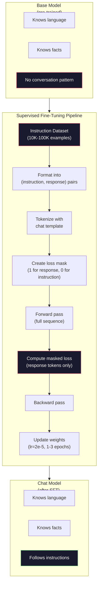

# Instruction Tuning (SFT)

> Базовая модель предсказывает следующий токен. И все. Она не следует инструкциям, не отвечает на вопросы и не отказывается от вредных запросов. SFT — мост между предсказателем токенов и полезным ассистентом. Каждая модель, с которой вы когда-либо общались, — Claude, GPT, Llama Chat — прошла через этот этап.

**Тип:** Build
**Языки:** Python (with numpy)
**Пререквизиты:** Phase 10, Lesson 04 (Pre-Training a Mini GPT)
**Время:** ~90 minutes

## Цели обучения

- Реализовать supervised fine-tuning (SFT), который превращает базовую языковую модель в ассистента, следующего инструкциям
- Форматировать обучающие данные с помощью chat templates с ролями system, user и assistant, а также маскировать loss на токенах, не относящихся к assistant
- Объяснить, почему SFT необходим: базовые модели продолжают текст, а не отвечают на вопросы
- Оценивать качество SFT, сравнивая ответы базовой и дообученной модели на отложенном наборе инструкций

## Проблема

В Lesson 04 вы обучили модель. Она умеет предсказывать следующий токен по заданной последовательности. Подайте ей "The transformer architecture", и она может продолжить: "has revolutionized natural language processing." Для предсказателя следующего токена это впечатляет.

Теперь попробуйте другое: подайте ей "What is the capital of France?" Базовая модель не ответит "Paris." Она продолжит паттерн. Она может сгенерировать "What is the capital of Germany? What is the capital of Spain?", потому что видела в документах списки вопросов. Или может выдать "is a question that many people ask", потому что это правдоподобное продолжение по следующему токену. У модели нет понятия *ответа*. Она знает только *продолжение*.

В этом и состоит разрыв между GPT-3 (базовая модель, выпущена в июне 2020 года) и ChatGPT (модель после instruction tuning, выпущена в ноябре 2022 года). Та же архитектура. То же pre-training. Разница — в 20 000-100 000 тщательно подготовленных пар (instruction, response), которые научили модель следовать разговорному паттерну.

Stanford Alpaca показала, что миллионы примеров не обязательны. В марте 2023 года авторы дообучили Llama 7B всего на 52 000 парах instruction-response, сгенерированных GPT-3.5. Общая стоимость: $600. Результатом стал чат-бот, который мог следовать инструкциям, отвечать на вопросы и поддерживать диалог. Не на уровне ChatGPT, но удивительно близко для $600 и нескольких часов обучения.

Meta's Llama 2 Chat использовала только ~27 000 высококачественных примеров на начальном этапе SFT. Главная идея: качество важнее количества. 27 000 примеров, написанных опытными аннотаторами, превосходят 1 миллион шумных примеров, собранных из интернета.

## Концепция

### Что на самом деле делает SFT

Supervised Fine-Tuning продолжает тот же обучающий цикл, что и pre-training: forward pass, вычисление loss, backward pass, обновление весов. Но данные теперь другого типа. Вместо сырого текста вы обучаете модель на структурированных диалогах:

```json
{
  "system": "You are a helpful assistant.",
  "user": "What is the capital of France?",
  "assistant": "The capital of France is Paris."
}
```

Модель уже знает, что Париж — столица Франции. Она узнала это во время pre-training на Wikipedia, учебниках и веб-страницах. SFT не учит модель новым фактам. Он учит модель новому *поведению*: когда видишь вопрос, выдай ответ. Когда видишь инструкцию, выдай выполнение. Когда видишь вредный запрос, выдай отказ.

Можно думать об этом так: pre-training дает модели знания. SFT дает модели манеры.

### Форматы данных

В индустрии доминируют три формата. Каждый кодирует одну и ту же информацию — кто что сказал — но использует разные разделители.

**Alpaca Format** (Stanford, март 2023):

```json
{
  "instruction": "Summarize the following article in 3 sentences.",
  "input": "The European Central Bank raised interest rates...",
  "output": "The ECB increased rates by 25 basis points..."
}
```

Простой и широко используемый формат. Поле `input` необязательно: многим инструкциям не нужен дополнительный контекст. Stanford выпустил 52 000 примеров в этом формате, сгенерированных GPT-3.5 за $600. Это запустило движение open-source instruction tuning.

**ShareGPT Format** (сообщество, 2023):

```json
{
  "conversations": [
    {"from": "system", "value": "You are a helpful assistant."},
    {"from": "human", "value": "What causes tides?"},
    {"from": "gpt", "value": "Tides are caused by the gravitational pull of the Moon..."},
    {"from": "human", "value": "How often do they occur?"},
    {"from": "gpt", "value": "Most coastal areas experience two high tides and two low tides per day..."}
  ]
}
```

Поддерживает многошаговые диалоги. Поле "from" по соглашению использует значения "human" и "gpt", независимо от фактической модели. Vicuna была обучена на 70 000 диалогов ShareGPT, собранных из пользовательских расшаренных транскриптов ChatGPT.

**ChatML Format** (OpenAI, используется многими open-source моделями):

```
<|im_start|>system
You are a helpful assistant.<|im_end|>
<|im_start|>user
What is the capital of France?<|im_end|>
<|im_start|>assistant
The capital of France is Paris.<|im_end|>
```

Использует специальные токены (`<|im_start|>`, `<|im_end|>`) для разделения ролей. Эти токены добавляют в словарь tokenizer во время fine-tuning. Qwen, Yi и многие другие модели используют ChatML.

Все три формата делают одно и то же: сообщают модели «это инструкция, это ответ, выучи этот паттерн».

### Почему это работает

Модель уже знает язык благодаря pre-training. Она видела миллиарды примеров вопросов с ответами, инструкций с выполнениями и разговоров между людьми. Эти паттерны уже закодированы в весах.

SFT концентрирует эту скрытую способность. Вместо того чтобы модель по контексту догадывалась, нужно ли отвечать на вопрос или продолжать документ, SFT явно обучает ее на разговорном паттерне. После нескольких тысяч примеров модель усваивает: когда видишь маркер роли assistant, нужно сгенерировать полезный ответ.

Именно поэтому 27 000 примеров достаточно. Вы не учите модель английскому. Вы не учите ее фактам о мире. Вы учите ее одному простому поведению: отвечать на инструкции. Знания уже были внутри.

### Маскированный loss

Это самая важная техническая деталь SFT, и большинство туториалов ее пропускает.

Во время pre-training вы вычисляете loss на каждом токене. Модель учится предсказывать каждый следующий токен в последовательности. Во время SFT loss вычисляется только на токенах *ответа*. Токены инструкции присутствуют как контекст, но модель не штрафуется за их неправильное «предсказание».

Почему? Потому что вы не хотите, чтобы модель училась *генерировать* инструкции. Вы хотите, чтобы она училась *отвечать на* инструкции. Если вычислять loss на токенах инструкции, вы обучаете модель предсказывать "What is the capital of France?" так, будто вопрос задает она сама. Это тратит градиентный сигнал и может запутать модель относительно ее роли.

На практике вы создаете loss mask: 1 для токенов ответа, 0 для токенов инструкции. Перед усреднением умножаете per-token loss на эту маску.

```
Tokens:    [SYS] You are helpful [USER] What is the capital? [ASST] Paris is the capital [EOS]
Loss mask:   0    0    0     0      0     0   0  0     0       1     1    1   1     1      1
```

Только токены после `[ASST]` вносят вклад в loss. Модель видит весь диалог во время forward pass (ей нужна инструкция, чтобы выдать правильный ответ), но обновляет веса только по тому, насколько хорошо предсказала ответ.

### Гиперпараметры обучения

SFT использует резко отличающиеся гиперпараметры по сравнению с pre-training. Вы не обучаете модель с нуля. Вы аккуратно настраиваете модель, которая уже работает.

| Parameter | Pre-Training (Llama 2 7B) | SFT (Llama 2 Chat) |
|-----------|---------------------------|---------------------|
| Learning rate | 3e-4 (peak) | 2e-5 |
| Epochs | 1 (single pass over data) | 2 |
| Batch size | 4M tokens | 64 examples |
| Warmup steps | 2,000 | 0-100 |
| Weight decay | 0.1 | 0.0-0.1 |
| Data size | 2T tokens | 27,000 examples |

Learning rate для SFT в 15 раз ниже. Это критично. Высокий learning rate во время fine-tuning разрушает знания, полученные на pre-training. Модель «забывает» то, чему научилась, и переобучается на маленький fine-tuning dataset. Это catastrophic forgetting.

Две эпохи означают, что модель видит каждый обучающий пример дважды. Больше 3 эпох на маленьком датасете ведут к запоминанию: модель начинает дословно воспроизводить обучающие примеры вместо обобщения.

### Catastrophic Forgetting

Fine-tuning может разрушать общие способности. Если слишком долго обучать модель на данных следования инструкциям, она теряет способность писать код, решать математические задачи или создавать креативный текст. Она становится очень хороша в конкретном формате обучающих данных и плоха во всем остальном.

Три способа смягчить проблему:

1. **Низкий learning rate.** От 1e-5 до 5e-5. Меньшие обновления меньше разрушают признаки, выученные на pre-training.

2. **Короткое обучение.** 1-3 эпохи. Остановитесь до того, как модель переобучится.

3. **Подмешивание pre-training data.** Llama 2 Chat добавляла небольшой процент (2-5%) сырых pre-training data в SFT dataset. Это «напоминает» модели о ее общих способностях, пока она учится новому поведению следования инструкциям.

### Реальные числа

Fine-tuning модели 7B на 10 000 высококачественных instruction pairs занимает примерно 1 час на одном GPU NVIDIA A100 80GB. Расчет:

- 10 000 examples x 512 tokens average = 5.12M tokens
- 2 epochs = 10.24M tokens total
- A100 throughput for 7B model fine-tuning: ~3,000 tokens/second
- 10.24M / 3,000 = ~3,400 seconds = ~57 minutes

Для нашего mini GPT (4 слоя, 128 dims) обучение почти мгновенно. Цель — понять механику, а не масштаб.



## Реализация

### Шаг 1: Instruction Dataset

Создайте синтетический instruction dataset. В production компании вроде Scale AI и Anthropic нанимают людей-аннотаторов, чтобы писать такие примеры. Мы создадим их программно, чтобы показать формат.

```python
import numpy as np

INSTRUCTION_DATA = [
    {
        "instruction": "What is the capital of France?",
        "response": "The capital of France is Paris."
    },
    {
        "instruction": "Explain gravity in one sentence.",
        "response": "Gravity is the force that attracts objects with mass toward each other."
    },
    {
        "instruction": "Write a haiku about the ocean.",
        "response": "Waves crash on the shore, salt and foam beneath the sun, endless blue expanse."
    },
    {
        "instruction": "What is 15 multiplied by 7?",
        "response": "15 multiplied by 7 is 105."
    },
    {
        "instruction": "Name three programming languages.",
        "response": "Three programming languages are Python, Rust, and TypeScript."
    },
    {
        "instruction": "Summarize photosynthesis.",
        "response": "Photosynthesis converts sunlight, water, and carbon dioxide into glucose and oxygen."
    },
    {
        "instruction": "What year did World War II end?",
        "response": "World War II ended in 1945."
    },
    {
        "instruction": "Define machine learning.",
        "response": "Machine learning is a field where algorithms learn patterns from data to make predictions."
    },
]
```

Восемь примеров — это крошечный набор. Stanford Alpaca использовала 52 000. Но механика одинакова, будь у вас 8 или 52 000 примеров: tokenize, mask, compute loss только на ответах.

### Шаг 2: Tokenize with Chat Template

Преобразуйте пары instruction-response в последовательности токенов со специальными маркерами ролей. Маркеры сообщают модели, где заканчивается инструкция и где начинается ответ.

```python
SPECIAL_TOKENS = {
    "INST_START": 253,
    "INST_END": 254,
    "RESP_START": 255,
}


def tokenize_instruction_pair(instruction, response, vocab_size=256):
    inst_tokens = list(instruction.encode("utf-8"))
    resp_tokens = list(response.encode("utf-8"))

    inst_tokens = [min(t, vocab_size - 4) for t in inst_tokens]
    resp_tokens = [min(t, vocab_size - 4) for t in resp_tokens]

    tokens = (
        [SPECIAL_TOKENS["INST_START"]]
        + inst_tokens
        + [SPECIAL_TOKENS["INST_END"]]
        + [SPECIAL_TOKENS["RESP_START"]]
        + resp_tokens
    )

    return tokens


def create_loss_mask(tokens):
    mask = np.zeros(len(tokens), dtype=np.float32)
    in_response = False

    for i, token in enumerate(tokens):
        if token == SPECIAL_TOKENS["RESP_START"]:
            in_response = True
            continue
        if in_response:
            mask[i] = 1.0

    return mask
```

Loss mask состоит из нулей для токенов инструкции и единиц для токенов ответа. Сам токен `RESP_START` получает маску 0, потому что это разделитель, а не часть содержимого ответа.

### Шаг 3: Masked Cross-Entropy Loss

Стандартная cross-entropy, но умноженная на loss mask. В градиент вносят вклад только токены ответа.

```python
def masked_cross_entropy_loss(logits, targets, loss_mask):
    batch, seq_len, vocab_size = logits.shape
    logits_flat = logits.reshape(-1, vocab_size)
    targets_flat = targets.reshape(-1)
    mask_flat = loss_mask.reshape(-1)

    max_logits = logits_flat.max(axis=-1, keepdims=True)
    log_softmax = logits_flat - max_logits - np.log(
        np.exp(logits_flat - max_logits).sum(axis=-1, keepdims=True)
    )

    per_token_loss = -log_softmax[np.arange(len(targets_flat)), targets_flat]

    masked_loss = per_token_loss * mask_flat
    num_response_tokens = mask_flat.sum()
    if num_response_tokens == 0:
        return 0.0
    loss = masked_loss.sum() / num_response_tokens

    return loss
```

Знаменатель — `num_response_tokens`, а не `seq_len`. Если делить на общую длину последовательности, длинные инструкции размывают градиентный сигнал. Деление на число токенов ответа обеспечивает одинаковый вес на каждый токен ответа независимо от длины инструкции.

### Шаг 4: Цикл обучения SFT

Переиспользуем MiniGPT из Lesson 04. Цикл обучения почти идентичен pre-training, но с форматированием инструкций и masked loss.

```python
import sys
import os
sys.path.insert(0, os.path.join(os.path.dirname(__file__), "..", "..", "04-pre-training-mini-gpt", "code"))
from main import MiniGPT, LayerNorm, FeedForward, MultiHeadAttention, TransformerBlock, Embedding


def sft_train(model, dataset, num_epochs=2, lr=2e-5, seq_len=64):
    formatted_data = []
    for example in dataset:
        tokens = tokenize_instruction_pair(example["instruction"], example["response"])
        mask = create_loss_mask(tokens)
        formatted_data.append((tokens, mask))

    print(f"SFT Training: {len(formatted_data)} examples, {num_epochs} epochs, lr={lr}")
    print(f"Total tokens: {sum(len(t) for t, _ in formatted_data):,}")
    print()

    losses = []

    for epoch in range(num_epochs):
        epoch_loss = 0.0
        num_batches = 0

        indices = np.random.permutation(len(formatted_data))

        for idx in indices:
            tokens, mask = formatted_data[idx]

            if len(tokens) < 3:
                continue
            if len(tokens) > seq_len:
                tokens = tokens[:seq_len]
                mask = mask[:seq_len]

            input_ids = np.array(tokens[:-1]).reshape(1, -1)
            target_ids = np.array(tokens[1:]).reshape(1, -1)
            loss_mask = np.array(mask[1:]).reshape(1, -1)

            logits = model.forward(input_ids)
            loss = masked_cross_entropy_loss(logits, target_ids, loss_mask)

            batch_size, s_len, v_size = logits.shape
            probs = np.exp(logits - logits.max(axis=-1, keepdims=True))
            probs = probs / probs.sum(axis=-1, keepdims=True)
            dlogits = probs.copy()
            dlogits[np.arange(batch_size)[:, None], np.arange(s_len), target_ids] -= 1.0

            mask_expanded = loss_mask[:, :, np.newaxis]
            num_resp = loss_mask.sum()
            if num_resp > 0:
                dlogits = dlogits * mask_expanded / num_resp

            for block in model.blocks:
                block.ffn.W1 -= lr * np.random.randn(*block.ffn.W1.shape) * 0.01
                block.ffn.W2 -= lr * np.random.randn(*block.ffn.W2.shape) * 0.01
                block.ffn.b1 -= lr * np.random.randn(*block.ffn.b1.shape) * 0.01
                block.ffn.b2 -= lr * np.random.randn(*block.ffn.b2.shape) * 0.01

            epoch_loss += loss
            num_batches += 1
            losses.append(loss)

        avg_loss = epoch_loss / max(num_batches, 1)
        print(f"Epoch {epoch + 1}/{num_epochs} | Avg Loss: {avg_loss:.4f}")

    return model, losses
```

Learning rate равен 2e-5, как в Llama 2 Chat. Сравните это с 3e-4 в pre-training: в 15 раз меньше. Градиент маскируется: токены инструкции дают нулевой градиент. Только токены ответа двигают веса.

### Шаг 5: Сравнение Base и SFT Model

Главная цель SFT — изменение поведения. Измерим это, проверив, как модель отвечает на входы в instruction format по сравнению с сырыми продолжениями текста.

```python
def generate_response(model, prompt_tokens, max_new_tokens=50, temperature=0.8):
    tokens = list(prompt_tokens)
    seq_len = model.embedding.pos_embed.shape[0]

    for _ in range(max_new_tokens):
        context = np.array(tokens[-seq_len:]).reshape(1, -1)
        logits = model.forward(context)
        next_logits = logits[0, -1, :]

        next_logits = next_logits / max(temperature, 1e-8)
        probs = np.exp(next_logits - next_logits.max())
        probs = probs / probs.sum()
        probs = np.clip(probs, 1e-10, 1.0)
        probs = probs / probs.sum()

        next_token = np.random.choice(len(probs), p=probs)
        tokens.append(int(next_token))

    return tokens


def evaluate_instruction_following(model, instructions):
    print("Evaluating instruction following:")
    print("-" * 50)

    for instruction in instructions:
        tokens = (
            [SPECIAL_TOKENS["INST_START"]]
            + [min(t, 252) for t in list(instruction.encode("utf-8"))]
            + [SPECIAL_TOKENS["INST_END"]]
            + [SPECIAL_TOKENS["RESP_START"]]
        )

        output = generate_response(model, tokens, max_new_tokens=30, temperature=0.6)
        response_start = len(tokens)
        response_tokens = output[response_start:]
        response_bytes = bytes([t for t in response_tokens if t < 128])
        response_text = response_bytes.decode("utf-8", errors="replace")

        print(f"  Q: {instruction}")
        print(f"  A: {response_text[:80]}")
        print()
```

На крошечной модели с 8 примерами ответы не будут осмысленными. Это ожидаемо. Важна *структура*: модель учится выдавать output после маркера ответа, а не продолжать генерировать новые инструкции.

### Шаг 6: Измерение Catastrophic Forgetting

Сравните способность модели предсказывать следующий токен до и после SFT. Если SFT повреждает общие способности, loss на сыром тексте вырастет.

```python
def measure_forgetting(model, test_text, seq_len=64):
    tokens = np.array(list(test_text.encode("utf-8")[:512]))

    total_loss = 0.0
    num_windows = 0

    for start in range(0, len(tokens) - seq_len - 1, seq_len):
        input_ids = tokens[start:start + seq_len].reshape(1, -1)
        target_ids = tokens[start + 1:start + seq_len + 1].reshape(1, -1)

        logits = model.forward(input_ids)

        batch, s_len, vocab_size = logits.shape
        logits_flat = logits.reshape(-1, vocab_size)
        targets_flat = target_ids.reshape(-1)

        max_logits = logits_flat.max(axis=-1, keepdims=True)
        log_softmax = logits_flat - max_logits - np.log(
            np.exp(logits_flat - max_logits).sum(axis=-1, keepdims=True)
        )

        loss = -log_softmax[np.arange(len(targets_flat)), targets_flat].mean()
        total_loss += loss
        num_windows += 1

    return total_loss / max(num_windows, 1)
```

В реальном fine-tuning эту метрику отслеживают на протяжении всего обучения. Если raw text loss растет больше чем на 10-15%, ваш SFT слишком агрессивен. Снизьте learning rate или уменьшите число эпох.

## Использование

### Полная демонстрация SFT Pipeline

```python
if __name__ == "__main__":
    np.random.seed(42)

    test_text = """The transformer architecture processes sequences through self-attention.
Each layer applies multi-head attention followed by a feedforward network.
Residual connections and layer normalization stabilize deep networks.
The model learns to predict the next token given all previous tokens."""

    print("=" * 70)
    print("INSTRUCTION TUNING (SFT) DEMO")
    print("=" * 70)
    print()

    model = MiniGPT(
        vocab_size=256, embed_dim=128, num_heads=4,
        num_layers=4, max_seq_len=128, ff_dim=512
    )
    print(f"Model: {model.count_parameters():,} parameters")
    print(f"Config: 4 layers, 4 heads, 128 dims (mini GPT from Lesson 04)")
    print()

    print("PRE-SFT: Measuring base model loss on raw text")
    base_loss = measure_forgetting(model, test_text)
    print(f"  Base model loss: {base_loss:.4f}")
    print()

    print("=" * 70)
    print("SFT TRAINING")
    print("=" * 70)

    model, losses = sft_train(
        model, INSTRUCTION_DATA, num_epochs=3, lr=2e-5, seq_len=128
    )

    print()
    print("POST-SFT: Measuring fine-tuned model loss on raw text")
    sft_loss = measure_forgetting(model, test_text)
    print(f"  SFT model loss: {sft_loss:.4f}")
    print(f"  Change: {((sft_loss - base_loss) / base_loss * 100):+.1f}%")
    if abs(sft_loss - base_loss) / base_loss < 0.15:
        print("  Minimal forgetting (< 15% change)")
    else:
        print("  Significant forgetting detected")
    print()

    print("=" * 70)
    print("INSTRUCTION FOLLOWING EVALUATION")
    print("=" * 70)
    print()

    test_instructions = [
        "What is the capital of France?",
        "Name a programming language.",
        "Define gravity.",
    ]
    evaluate_instruction_following(model, test_instructions)

    print("=" * 70)
    print("DATA FORMAT EXAMPLES")
    print("=" * 70)
    print()

    for i, example in enumerate(INSTRUCTION_DATA[:3]):
        tokens = tokenize_instruction_pair(example["instruction"], example["response"])
        mask = create_loss_mask(tokens)
        resp_count = int(mask.sum())
        total_count = len(tokens)
        print(f"  Example {i + 1}: {total_count} tokens, {resp_count} response tokens ({resp_count/total_count:.0%} of sequence)")
        print(f"    Instruction: {example['instruction']}")
        print(f"    Response: {example['response']}")
        print()

    print("=" * 70)
    print("TRAINING LOSS CURVE")
    print("=" * 70)
    print()

    if losses:
        window = max(1, len(losses) // 5)
        for i in range(0, len(losses), window):
            chunk = losses[i:i + window]
            avg = sum(chunk) / len(chunk)
            print(f"  Steps {i:3d}-{i + len(chunk) - 1:3d}: avg loss = {avg:.4f}")
```

## Ship It

Этот урок создает `outputs/prompt-sft-data-curator.md` — prompt, который помогает проектировать и курировать instruction datasets для SFT. По заданной целевой способности (code generation, math, conversation) он выдает план сбора данных со спецификацией формата, критериями качества и требованиями к разнообразию.

## Упражнения

1. Добавьте поддержку system prompt. Измените `tokenize_instruction_pair`, чтобы она принимала system message и добавляла его перед инструкцией. Создайте 5 примеров с разными system prompts ("You are a poet", "You are a math tutor") и проверьте, что модель видит разные system prompts во время обучения.

2. Реализуйте data mixing. Создайте функцию, которая принимает SFT dataset и raw text corpus, а затем формирует обучающие batches, где 5% примеров — raw text (без masking), а 95% — instruction pairs (masked). Запустите 3 эпохи и сравните forgetting metrics с чистым SFT training.

3. Постройте data quality scorer. Для каждой пары instruction-response вычислите: (a) response length in tokens, (b) instruction-to-response ratio, (c) vocabulary diversity (unique tokens / total tokens). Отфильтруйте примеры с response length < 10 tokens или diversity < 0.3. Покажите, как фильтрация влияет на final loss.

4. Реализуйте multi-turn conversation training. Расширьте tokenization для 3-turn conversations (user-assistant-user-assistant-user-assistant). Loss mask должна покрывать все три хода assistant. Проверьте корректность маски, распечатав token-mask alignment для одного примера.

5. Сравните learning rates. Обучите одну и ту же модель три раза с lr=1e-4, lr=2e-5 и lr=1e-6. Постройте loss curves. Запуск с 1e-4 должен показать быстрый начальный спад, но более высокий final loss (overfitting). Запуск с 1e-6 почти не должен сдвинуться. 2e-5 должен оказаться sweet spot.

## Ключевые термины

| Term | Как обычно говорят | Что это на самом деле означает |
|------|--------------------|--------------------------------|
| SFT | "Fine-tuning on conversations" | Supervised Fine-Tuning: продолжение обучения на парах (instruction, response), где loss вычисляется только на токенах ответа |
| Instruction tuning | "Teaching the model to follow instructions" | Обучение на явных парах instruction-response, чтобы базовая модель выучила разговорный паттерн, а не новые знания |
| Loss masking | "Ignoring the prompt" | Обнуление loss для токенов инструкции, чтобы градиенты шли только от предсказаний токенов ответа |
| ChatML | "Chat Markup Language" | Формат токенов с разделителями `<\|im_start\|>` и `<\|im_end\|>` для маркировки ролей говорящих в conversation data |
| Alpaca format | "Stanford's format" | JSON-формат с полями instruction/input/output, использованный для 52K примеров, сгенерированных GPT-3.5 за $600 |
| Catastrophic forgetting | "The model gets dumber" | Fine-tuning разрушает способности, полученные на pre-training, потому что gradient updates перезаписывают общие знания task-specific паттернами |
| Weight tying | "Shared embeddings" | Использование одной и той же матрицы для input token embeddings и output prediction head, что экономит параметры и улучшает связность |
| Chat template | "How you format the prompt" | Конкретная последовательность токенов (role markers, delimiters), которая структурирует диалог для модели |

## Дополнительное чтение

- [Ouyang et al., 2022 -- "Training language models to follow instructions with human feedback" (InstructGPT)](https://arxiv.org/abs/2203.02155) -- статья, которая ввела instruction tuning + RLHF в OpenAI
- [Taori et al., 2023 -- "Stanford Alpaca: An Instruction-following LLaMA Model"](https://github.com/tatsu-lab/stanford_alpaca) -- 52K instruction examples за $600, доказавшие, что SFT работает на малых датасетах
- [Touvron et al., 2023 -- "Llama 2: Open Foundation and Fine-Tuned Chat Models"](https://arxiv.org/abs/2307.09288) -- pipeline Meta SFT + RLHF с 27K высококачественных примеров
- [Chiang et al., 2023 -- "Vicuna: An Open-Source Chatbot Impressing GPT-4"](https://lmsys.org/blog/2023-03-30-vicuna/) -- обучение на 70K диалогов ShareGPT
- [Zhou et al., 2023 -- "LIMA: Less Is More for Alignment"](https://arxiv.org/abs/2305.11206) -- доказательство, что 1 000 тщательно отобранных примеров могут сравниться с SFT на гораздо больших датасетах
