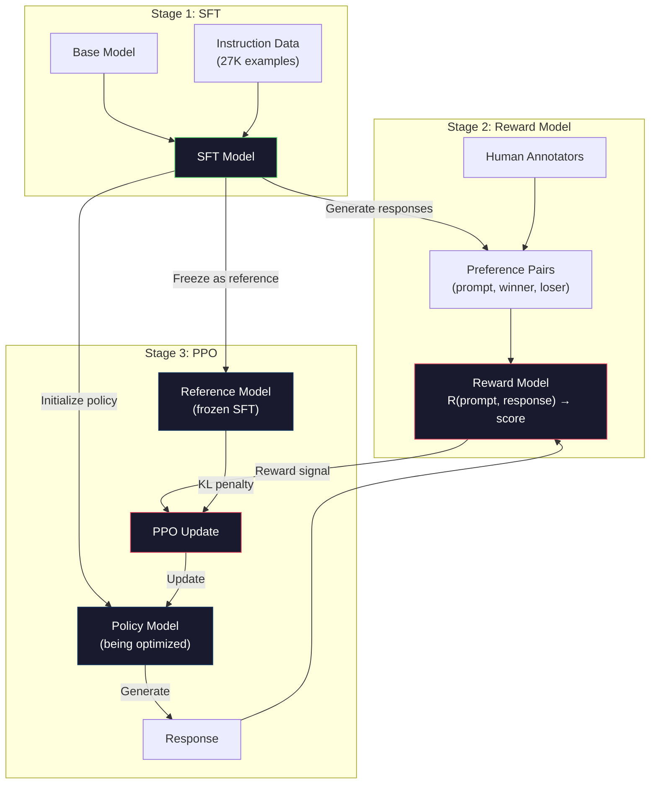
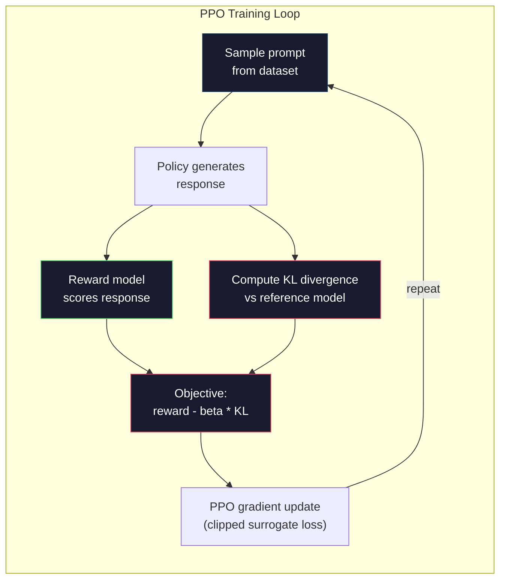

# RLHF: Reward Model + PPO

> SFT учит модель следовать инструкциям. Но он не учит модель понимать, какой ответ ЛУЧШЕ. Два грамматически корректных и фактически точных ответа могут сильно отличаться по полезности. RLHF — способ закодировать человеческое суждение в поведении модели. Именно это делает Claude полезным, а GPT вежливым.

**Тип:** Build
**Языки:** Python (with numpy)
**Пререквизиты:** Phase 10, Lesson 06 (Instruction Tuning / SFT)
**Время:** ~90 minutes

## Цели обучения

- Построить reward model, которая оценивает качество ответов по human preference pairs (chosen vs rejected)
- Реализовать цикл обучения PPO, который оптимизирует policy языковой модели относительно reward model с KL penalty
- Объяснить, почему RLHF требует три модели (SFT, reward, policy) и как KL constraint предотвращает reward hacking
- Оценить эффект RLHF, сравнив качество ответов до и после preference optimization

## Проблема

Спросите модель "Explain quantum computing", и она может выдать:

**Response A:** "Quantum computing uses qubits that can exist in superposition, meaning they can be 0, 1, or both simultaneously. This allows quantum computers to process certain calculations exponentially faster than classical computers. Key algorithms include Shor's algorithm for factoring large numbers and Grover's algorithm for searching unsorted databases."

**Response B:** "Quantum computing is a type of computing that uses quantum mechanical phenomena. It was first proposed in the 1980s. Richard Feynman suggested that quantum systems could be simulated by quantum computers. The field has grown significantly since then. Many companies are now working on quantum computers. IBM, Google, and others have made progress. Quantum supremacy was claimed by Google in 2019."

Оба ответа фактически корректны. Оба грамматически нормальны. Оба следуют инструкции. Но Response A явно лучше. Он короче, информативнее и лучше структурирован. Человек каждый раз выбрал бы A.

SFT не умеет уловить это различие. Он обучает модель на «правильных» ответах, но не имеет механизма, чтобы сказать: «этот ответ лучше того». Каждый обучающий пример для него одинаково хорош. Если бы A и B оба попали в SFT dataset, модель училась бы на обоих одинаково.

RLHF решает эту проблему. Он обучает reward model предсказывать, какой ответ предпочтет человек, а затем использует этот reward signal, чтобы сдвинуть языковую модель к более качественным outputs. InstructGPT (предшественник ChatGPT) использовал RLHF, чтобы резко улучшить полезность, правдивость и безвредность GPT-3. Внутренние оценщики OpenAI предпочитали ответы InstructGPT ответам GPT-3 в 85% случаев, хотя InstructGPT был в 135 раз меньше (1.3B vs 175B parameters).

## Концепция

### Три этапа

RLHF — это не один запуск обучения. Это pipeline из трех последовательных этапов, каждый из которых опирается на предыдущий.

**Stage 1: SFT.** Обучите базовую модель на парах instruction-response (Lesson 06). Это дает модель, которая может следовать инструкциям, но не знает, какие ответы лучше других.

**Stage 2: Reward Model.** Соберите human preference data: покажите аннотаторам два ответа на один prompt и спросите «какой лучше?» Обучите модель предсказывать эти предпочтения. Reward model принимает (prompt, response) на вход и выдает скалярный score.

**Stage 3: PPO.** Используйте reward model, чтобы сформировать обучающий сигнал для языковой модели. Языковая модель генерирует ответы, reward model оценивает их, а PPO обновляет языковую модель так, чтобы она производила ответы с более высоким score. KL divergence penalty не дает языковой модели слишком далеко уйти от SFT checkpoint.



### Reward Model

Reward model — это языковая модель, переиспользованная как оценщик. Возьмите SFT model и замените language modeling head (который выдает распределение по vocabulary) на scalar head (который выдает одно число). Архитектура идентична вплоть до финального слоя.

Вход: prompt, склеенный с response. Выход: один scalar reward score.

Обучающие данные — human preference pairs. Для каждого prompt аннотаторы видят два ответа и выбирают лучший. Это создает обучающие тройки: (prompt, preferred_response, rejected_response).

Loss function использует Bradley-Terry model парных предпочтений:

```
loss = -log(sigmoid(reward(preferred) - reward(rejected)))
```

Это ключевое уравнение. `sigmoid(reward(A) - reward(B))` дает вероятность того, что response A предпочтут response B. Loss заставляет reward model назначать более высокий score предпочтенному ответу.

Почему pairwise comparisons вместо absolute scores? Потому что людям плохо удается назначать абсолютные оценки качества («это ответ на 7.3 или на 7.5 из 10?»), но хорошо удается относительное сравнение («A лучше B?»). Bradley-Terry model преобразует относительные сравнения в согласованную абсолютную систему score.

**Числа InstructGPT:** OpenAI собрала 33 000 comparison pairs от 40 contractors. Каждое сравнение занимало около 5 минут. Это 2 750 часов человеческой работы для данных обучения reward model.

### PPO: Proximal Policy Optimization

PPO — алгоритм reinforcement learning. В RLHF «environment» — это reward model, «agent» — языковая модель, а «action» — генерация токена.

Objective:

```
maximize: E[R(prompt, response)] - beta * KL(policy || reference)
```

Первый член толкает модель генерировать high-reward responses. Второй член (KL divergence penalty) не дает модели слишком далеко отклониться от SFT checkpoint.

Зачем нужен KL penalty? Без него модель находит вырожденные решения. Reward model обучена на конечном датасете human preferences. У нее есть слепые зоны. Языковая модель будет эксплуатировать эти слепые зоны — находить outputs, которые получают высокий score от reward model, но на деле бессмысленны. Классические примеры:

- Повторение "I'm so helpful and harmless!" получает высокий score у helpfulness/harmlessness reward models
- Генерация многословных, формально звучащих, но пустых ответов, похожих на «высокое качество»
- Эксплуатация конкретных фраз, которые случайно коррелировали с высоким reward в обучающих данных

KL penalty говорит: улучшаться можно, но нельзя становиться совершенно другой моделью. Оставайтесь близко к SFT version, которая уже была разумной. Уйдете слишком далеко — KL cost начнет доминировать над reward.

**Числа InstructGPT:** PPO training использовал lr=1.5e-5, KL coefficient beta=0.02, 256K episodes (prompt-response pairs) и 4 PPO epochs per batch. Весь RLHF pipeline занял несколько дней на GPU cluster.



### PPO Objective в деталях

PPO использует "clipped surrogate objective", чтобы предотвратить слишком большие обновления. Отношение вероятностей новой и старой policy клипируется в диапазон [1 - epsilon, 1 + epsilon], где epsilon обычно равен 0.2.

```
ratio = pi_new(action | state) / pi_old(action | state)
clipped_ratio = clip(ratio, 1 - epsilon, 1 + epsilon)
loss = -min(ratio * advantage, clipped_ratio * advantage)
```

Advantage function оценивает, насколько текущий response лучше ожидаемого качества. В RLHF:

```
advantage = reward(prompt, response) - baseline
```

Baseline часто равен average reward по недавним responses. Положительный advantage означает, что response был лучше среднего; отрицательный — хуже. PPO увеличивает вероятность ответов выше среднего и уменьшает вероятность ответов ниже среднего.

Clipping предотвращает катастрофические обновления. Если один response получает необычно высокий reward, unclipped ratio может быть очень большим, резко сдвигая модель к этому response. Clipping ограничивает update и поддерживает стабильность обучения.

### Reward Hacking

Темная сторона RLHF. Языковая модель оптимизируется относительно reward model, которая является несовершенным proxy для human preferences. По мере того как языковая модель лучше максимизирует reward, она начинает эксплуатировать слабости reward model.

Типичные failure modes:

| Failure | Что происходит | Почему |
|---------|----------------|--------|
| Verbosity | Модель производит все более длинные ответы | Аннотаторы часто предпочитали более длинные и подробные ответы, поэтому reward model назначает более высокий score длине |
| Sycophancy | Модель соглашается со всем, что говорит пользователь | Аннотаторы предпочитали ответы, согласующиеся с предпосылкой вопроса |
| Hedging | Модель отказывается дать определенный ответ | Осторожные ответы ("This is a complex topic with many perspectives...") редко помечают как неправильные |
| Format gaming | Модель чрезмерно использует bullet points и headers | Форматированные ответы выглядели для аннотаторов более «отполированными» |

Стратегии смягчения: более сильный KL penalty (не дает модели уйти достаточно далеко, чтобы эксплуатировать слабости), обучение reward model на adversarial examples (исправляет известные failure modes) и использование нескольких reward models с разными архитектурами (сложнее взломать все одновременно).

### Реальные RLHF Pipelines

| Model | Comparison Pairs | Annotators | RM Size | PPO Steps | KL Coeff |
|-------|-----------------|------------|---------|-----------|----------|
| InstructGPT | 33K | 40 | 6B | 256K | 0.02 |
| Llama 2 Chat | ~1M | undisclosed | 70B | undisclosed | 0.01 |
| Claude | undisclosed | undisclosed | undisclosed | undisclosed | undisclosed |
| Anthropic RLHF paper | 22K | 20 | 52B | 50K | 0.001 |

В статье Anthropic 2022 года обучалась 52B reward model на 22 000 comparisons. Более крупные reward models дают более надежные сигналы, что делает PPO training стабильнее. Использовать маленькую reward model для обучения большой языковой модели рискованно: reward model не имеет достаточной capacity, чтобы уловить нюансы хороших и плохих ответов.

## Реализация

### Шаг 1: Synthetic Preference Data

В production preference data создают люди-аннотаторы. Мы создадим синтетические пары, где "preferred" response объективно лучше: короче, точнее и полезнее.

```python
import numpy as np

PREFERENCE_DATA = [
    {
        "prompt": "What is the capital of France?",
        "preferred": "The capital of France is Paris.",
        "rejected": "France is a country in Europe. It has many cities. The capital is Paris. Paris is known for the Eiffel Tower.",
    },
    {
        "prompt": "Explain gravity in one sentence.",
        "preferred": "Gravity is the force that attracts objects with mass toward each other.",
        "rejected": "Gravity is something that makes things fall down when you drop them.",
    },
    {
        "prompt": "What is 15 times 7?",
        "preferred": "15 times 7 is 105.",
        "rejected": "Let me think about this. 15 times 7. Well, 10 times 7 is 70, and 5 times 7 is 35, so the answer might be around 105.",
    },
    {
        "prompt": "Name three programming languages.",
        "preferred": "Python, Rust, and TypeScript.",
        "rejected": "There are many programming languages. Some popular ones include various languages like Python and others.",
    },
    {
        "prompt": "What year did World War II end?",
        "preferred": "World War II ended in 1945.",
        "rejected": "World War II was a major global conflict. It involved many countries. The war ended in the mid-1940s, specifically in 1945.",
    },
    {
        "prompt": "Define machine learning.",
        "preferred": "Machine learning is a field where algorithms learn patterns from data to make predictions without being explicitly programmed.",
        "rejected": "Machine learning is a type of AI. AI stands for artificial intelligence. Machine learning uses data to learn.",
    },
]
```

Preferred responses краткие и прямые. Rejected responses демонстрируют типичные failure modes: лишнее заполнение, hedging, избыточное объяснение и неточность. Это именно тот вид различий, который SFT не улавливает, а RLHF может.

### Шаг 2: Архитектура Reward Model

Reward model переиспользует transformer architecture из mini GPT, но заменяет output head размером с vocabulary на одну scalar projection.

```python
import sys
import os
sys.path.insert(0, os.path.join(os.path.dirname(__file__), "..", "..", "04-pre-training-mini-gpt", "code"))
from main import MiniGPT, LayerNorm, Embedding, TransformerBlock


class RewardModel:
    def __init__(self, vocab_size=256, embed_dim=128, num_heads=4,
                 num_layers=4, max_seq_len=128, ff_dim=512):
        self.embedding = Embedding(vocab_size, embed_dim, max_seq_len)
        self.blocks = [
            TransformerBlock(embed_dim, num_heads, ff_dim)
            for _ in range(num_layers)
        ]
        self.ln_f = LayerNorm(embed_dim)
        self.reward_head = np.random.randn(embed_dim) * 0.02

    def forward(self, token_ids):
        seq_len = token_ids.shape[-1]
        mask = np.triu(np.full((seq_len, seq_len), -1e9), k=1)

        x = self.embedding.forward(token_ids)
        for block in self.blocks:
            x = block.forward(x, mask)
        x = self.ln_f.forward(x)

        last_hidden = x[:, -1, :]
        reward = last_hidden @ self.reward_head

        return reward
```

Reward model берет hidden state в позиции *последнего* токена и проецирует его в scalar. Почему последний токен? Потому что causal attention mask означает, что последняя позиция attended to все предыдущие токены. У нее самое полное представление всей последовательности (prompt, response).

### Шаг 3: Bradley-Terry Loss

Обучите reward model на preference pairs с помощью pairwise loss Bradley-Terry.

```python
def tokenize_for_reward(prompt, response, vocab_size=256):
    prompt_tokens = [min(t, vocab_size - 1) for t in list(prompt.encode("utf-8"))]
    response_tokens = [min(t, vocab_size - 1) for t in list(response.encode("utf-8"))]
    return prompt_tokens + [0] + response_tokens


def sigmoid(x):
    return np.where(
        x >= 0,
        1.0 / (1.0 + np.exp(-x)),
        np.exp(x) / (1.0 + np.exp(x))
    )


def bradley_terry_loss(reward_preferred, reward_rejected):
    diff = reward_preferred - reward_rejected
    loss = -np.log(sigmoid(diff) + 1e-8)
    return loss


def train_reward_model(rm, preference_data, num_epochs=10, lr=1e-4, max_seq_len=128):
    print(f"Training Reward Model: {len(preference_data)} preference pairs, {num_epochs} epochs")
    print()

    losses = []
    accuracies = []

    for epoch in range(num_epochs):
        epoch_loss = 0.0
        epoch_correct = 0
        num_pairs = 0

        indices = np.random.permutation(len(preference_data))

        for idx in indices:
            pair = preference_data[idx]

            preferred_tokens = tokenize_for_reward(pair["prompt"], pair["preferred"])
            rejected_tokens = tokenize_for_reward(pair["prompt"], pair["rejected"])

            preferred_tokens = preferred_tokens[:max_seq_len]
            rejected_tokens = rejected_tokens[:max_seq_len]

            preferred_ids = np.array(preferred_tokens).reshape(1, -1)
            rejected_ids = np.array(rejected_tokens).reshape(1, -1)

            r_preferred = rm.forward(preferred_ids)[0]
            r_rejected = rm.forward(rejected_ids)[0]

            loss = bradley_terry_loss(r_preferred, r_rejected)

            if r_preferred > r_rejected:
                epoch_correct += 1

            diff = r_preferred - r_rejected
            grad = sigmoid(diff) - 1.0

            rm.reward_head -= lr * grad * rm.ln_f.forward(
                rm.embedding.forward(preferred_ids)
            )[:, -1, :].flatten()

            epoch_loss += loss
            num_pairs += 1

        avg_loss = epoch_loss / max(num_pairs, 1)
        accuracy = epoch_correct / max(num_pairs, 1)
        losses.append(avg_loss)
        accuracies.append(accuracy)

        if epoch % 2 == 0:
            print(f"  Epoch {epoch + 1:3d} | Loss: {avg_loss:.4f} | Accuracy: {accuracy:.1%}")

    return rm, losses, accuracies
```

Accuracy metric проста: какую долю preference pairs reward model ранжирует правильно? Случайная модель получает 50%. Хорошо обученная reward model на чистых данных должна превышать 70%. Reward model InstructGPT достигла около 72% accuracy на held-out comparisons; звучит низко, но это хороший результат — многие preference pairs неоднозначны даже для людей (inter-annotator agreement был около 73%).

### Шаг 4: Упрощенный цикл PPO

Полный PPO сложен. Эта реализация передает основной механизм: generate responses, score them, compute advantage и update policy с KL penalty.

```python
def compute_kl_divergence(policy_logits, reference_logits):
    policy_probs = np.exp(policy_logits - policy_logits.max(axis=-1, keepdims=True))
    policy_probs = policy_probs / policy_probs.sum(axis=-1, keepdims=True)
    policy_probs = np.clip(policy_probs, 1e-10, 1.0)

    ref_probs = np.exp(reference_logits - reference_logits.max(axis=-1, keepdims=True))
    ref_probs = ref_probs / ref_probs.sum(axis=-1, keepdims=True)
    ref_probs = np.clip(ref_probs, 1e-10, 1.0)

    kl = np.sum(policy_probs * np.log(policy_probs / ref_probs), axis=-1)
    return kl.mean()


def generate_response(model, prompt_tokens, max_new_tokens=30, temperature=0.8, max_seq_len=128):
    tokens = list(prompt_tokens)

    for _ in range(max_new_tokens):
        context = np.array(tokens[-max_seq_len:]).reshape(1, -1)
        logits = model.forward(context)
        next_logits = logits[0, -1, :]

        next_logits = next_logits / max(temperature, 1e-8)
        probs = np.exp(next_logits - next_logits.max())
        probs = probs / probs.sum()
        probs = np.clip(probs, 1e-10, 1.0)
        probs = probs / probs.sum()

        next_token = np.random.choice(len(probs), p=probs)
        tokens.append(int(next_token))

    return tokens


def copy_model_weights(source, target):
    target.embedding.token_embed = source.embedding.token_embed.copy()
    target.embedding.pos_embed = source.embedding.pos_embed.copy()
    target.ln_f.gamma = source.ln_f.gamma.copy()
    target.ln_f.beta = source.ln_f.beta.copy()
    for s_block, t_block in zip(source.blocks, target.blocks):
        t_block.attn.W_q = s_block.attn.W_q.copy()
        t_block.attn.W_k = s_block.attn.W_k.copy()
        t_block.attn.W_v = s_block.attn.W_v.copy()
        t_block.attn.W_out = s_block.attn.W_out.copy()
        t_block.ffn.W1 = s_block.ffn.W1.copy()
        t_block.ffn.W2 = s_block.ffn.W2.copy()
        t_block.ffn.b1 = s_block.ffn.b1.copy()
        t_block.ffn.b2 = s_block.ffn.b2.copy()
        t_block.ln1.gamma = s_block.ln1.gamma.copy()
        t_block.ln1.beta = s_block.ln1.beta.copy()
        t_block.ln2.gamma = s_block.ln2.gamma.copy()
        t_block.ln2.beta = s_block.ln2.beta.copy()


def ppo_training(policy_model, reference_model, reward_model, prompts,
                 num_episodes=20, lr=1.5e-5, kl_coeff=0.02, max_seq_len=128):
    print(f"PPO Training: {num_episodes} episodes, lr={lr}, KL coeff={kl_coeff}")
    print()

    rewards_history = []
    kl_history = []

    for episode in range(num_episodes):
        prompt_text = prompts[episode % len(prompts)]
        prompt_tokens = [min(t, 252) for t in list(prompt_text.encode("utf-8"))]

        response_tokens = generate_response(
            policy_model, prompt_tokens,
            max_new_tokens=20, temperature=0.8, max_seq_len=max_seq_len
        )

        response_ids = np.array(response_tokens[:max_seq_len]).reshape(1, -1)
        reward = reward_model.forward(response_ids)[0]

        policy_logits = policy_model.forward(response_ids)
        ref_logits = reference_model.forward(response_ids)
        kl = compute_kl_divergence(policy_logits, ref_logits)

        total_reward = reward - kl_coeff * kl

        rewards_history.append(float(reward))
        kl_history.append(float(kl))

        for block in policy_model.blocks:
            update_scale = lr * total_reward
            block.ffn.W1 += update_scale * np.random.randn(*block.ffn.W1.shape) * 0.01
            block.ffn.W2 += update_scale * np.random.randn(*block.ffn.W2.shape) * 0.01

        if episode % 5 == 0:
            avg_reward = np.mean(rewards_history[-5:]) if rewards_history else 0
            avg_kl = np.mean(kl_history[-5:]) if kl_history else 0
            print(f"  Episode {episode:3d} | Reward: {reward:.4f} | KL: {kl:.4f} | "
                  f"Avg Reward: {avg_reward:.4f}")

    return policy_model, rewards_history, kl_history
```

Основной цикл: (1) sample a prompt, (2) generate a response, (3) score it with reward model, (4) compute KL divergence against frozen reference, (5) compute adjusted reward (reward minus KL penalty), (6) update policy. KL penalty растет по мере расхождения policy с reference и автоматически предотвращает reward hacking.

### Шаг 5: Сравнение Reward Scores

После RLHF ответы policy model должны получать более высокий score у reward model, чем ответы исходной SFT model.

```python
def compare_models(sft_model, rlhf_model, reward_model, prompts, max_seq_len=128):
    print("Model Comparison (reward scores)")
    print("-" * 60)
    print(f"  {'Prompt':<35} {'SFT':>10} {'RLHF':>10}")
    print("  " + "-" * 55)

    sft_total = 0.0
    rlhf_total = 0.0

    for prompt in prompts:
        prompt_tokens = [min(t, 252) for t in list(prompt.encode("utf-8"))]

        sft_response = generate_response(
            sft_model, prompt_tokens,
            max_new_tokens=20, temperature=0.6, max_seq_len=max_seq_len
        )
        rlhf_response = generate_response(
            rlhf_model, prompt_tokens,
            max_new_tokens=20, temperature=0.6, max_seq_len=max_seq_len
        )

        sft_ids = np.array(sft_response[:max_seq_len]).reshape(1, -1)
        rlhf_ids = np.array(rlhf_response[:max_seq_len]).reshape(1, -1)

        sft_reward = reward_model.forward(sft_ids)[0]
        rlhf_reward = reward_model.forward(rlhf_ids)[0]

        sft_total += sft_reward
        rlhf_total += rlhf_reward

        truncated_prompt = prompt[:33] + ".." if len(prompt) > 35 else prompt
        print(f"  {truncated_prompt:<35} {sft_reward:>10.4f} {rlhf_reward:>10.4f}")

    n = len(prompts)
    print("  " + "-" * 55)
    print(f"  {'Average':<35} {sft_total/n:>10.4f} {rlhf_total/n:>10.4f}")

    return sft_total / n, rlhf_total / n
```

## Использование

### Полная демонстрация RLHF Pipeline

```python
if __name__ == "__main__":
    np.random.seed(42)

    print("=" * 70)
    print("RLHF PIPELINE: REWARD MODEL + PPO")
    print("=" * 70)
    print()

    print("STAGE 1: SFT Model (from Lesson 06)")
    print("-" * 40)
    sft_model = MiniGPT(
        vocab_size=256, embed_dim=128, num_heads=4,
        num_layers=4, max_seq_len=128, ff_dim=512
    )
    print(f"  Parameters: {sft_model.count_parameters():,}")
    print()

    print("STAGE 2: Train Reward Model")
    print("-" * 40)
    rm = RewardModel(
        vocab_size=256, embed_dim=128, num_heads=4,
        num_layers=4, max_seq_len=128, ff_dim=512
    )

    rm, rm_losses, rm_accuracies = train_reward_model(rm, PREFERENCE_DATA, num_epochs=10, lr=1e-4)
    print()

    print("Reward Model Evaluation:")
    print("-" * 40)
    correct = 0
    for pair in PREFERENCE_DATA:
        pref_tokens = tokenize_for_reward(pair["prompt"], pair["preferred"])[:128]
        rej_tokens = tokenize_for_reward(pair["prompt"], pair["rejected"])[:128]

        r_pref = rm.forward(np.array(pref_tokens).reshape(1, -1))[0]
        r_rej = rm.forward(np.array(rej_tokens).reshape(1, -1))[0]

        if r_pref > r_rej:
            correct += 1
        print(f"  Preferred: {r_pref:+.4f} | Rejected: {r_rej:+.4f} | {'Correct' if r_pref > r_rej else 'Wrong'}")

    print(f"\n  Accuracy: {correct}/{len(PREFERENCE_DATA)} = {correct/len(PREFERENCE_DATA):.1%}")
    print()

    print("STAGE 3: PPO Training")
    print("-" * 40)

    policy_model = MiniGPT(
        vocab_size=256, embed_dim=128, num_heads=4,
        num_layers=4, max_seq_len=128, ff_dim=512
    )
    reference_model = MiniGPT(
        vocab_size=256, embed_dim=128, num_heads=4,
        num_layers=4, max_seq_len=128, ff_dim=512
    )

    copy_model_weights(sft_model, policy_model)
    copy_model_weights(sft_model, reference_model)

    train_prompts = [pair["prompt"] for pair in PREFERENCE_DATA]

    policy_model, rewards, kls = ppo_training(
        policy_model, reference_model, rm,
        train_prompts, num_episodes=20, lr=1.5e-5, kl_coeff=0.02
    )
    print()

    print("=" * 70)
    print("COMPARISON: SFT vs RLHF")
    print("=" * 70)
    print()

    eval_prompts = [
        "What is the capital of France?",
        "Explain gravity.",
        "Name three programming languages.",
    ]

    sft_avg, rlhf_avg = compare_models(sft_model, policy_model, rm, eval_prompts)
    print()

    print("=" * 70)
    print("KL DIVERGENCE ANALYSIS")
    print("=" * 70)
    print()

    if kls:
        print(f"  Initial KL: {kls[0]:.4f}")
        print(f"  Final KL:   {kls[-1]:.4f}")
        print(f"  Max KL:     {max(kls):.4f}")
        kl_threshold = 0.1
        print(f"  KL > {kl_threshold}: {'Yes (model drifted significantly)' if max(kls) > kl_threshold else 'No (model stayed close to reference)'}")
```

## Результат

Этот урок создает `outputs/prompt-reward-model-designer.md` — prompt для проектирования reward model training pipelines. По заданному целевому поведению (helpfulness, coding ability, safety) он выдает протокол сбора данных, guidelines для аннотаторов и критерии оценки reward model.

## Упражнения

1. Измените reward model так, чтобы она использовала mean всех hidden states вместо только последней позиции. Сравните accuracy. Mean pooling дает каждому токену одинаковый вес, тогда как last-position подход полагается на causal attention для агрегации информации. Проверьте на 6 preference pairs и сообщите, какой подход дает более высокую accuracy.

2. Реализуйте calibration reward model. После обучения пропустите все preference pairs через reward model и вычислите: (a) average reward for preferred responses, (b) average reward for rejected responses, (c) margin (preferred minus rejected). У хорошо откалиброванной модели должен быть явный margin. Затем добавьте 4 новые preference pairs и проверьте, сохраняется ли margin на unseen data.

3. Смоделируйте reward hacking. Создайте reward model, которая дает высокий score длинным ответам (reward = len(response) / 100). Запустите PPO с этой дефектной reward model и наблюдайте, как policy model генерирует все более длинные повторяющиеся outputs. Затем добавьте KL penalty 0.1 и покажите, что он предотвращает вырожденное поведение.

4. Реализуйте multi-objective reward. Обучите две reward models: одну для helpfulness и одну для conciseness. Объедините их как R = 0.7 * R_helpful + 0.3 * R_concise. Покажите, что combined objective дает ответы, которые одновременно полезны и кратки, избегая verbosity trap от одного helpfulness reward.

5. Сравните разные KL coefficients. Запустите PPO с beta=0.001 (слишком низкий, reward hacking), beta=0.02 (standard) и beta=0.5 (слишком высокий, no learning). Постройте reward curve и KL curve для каждого. Запуск beta=0.02 должен показать устойчивое улучшение reward при ограниченном KL.

## Ключевые термины

| Term | Как обычно говорят | Что это на самом деле означает |
|------|--------------------|--------------------------------|
| RLHF | "Training with human feedback" | Reinforcement Learning from Human Feedback: трехэтапный pipeline (SFT, reward model, PPO), который оптимизирует outputs языковой модели с помощью human preference signals |
| Reward model | "A model that scores responses" | Transformer со scalar output head, обученный на pairwise human preferences с использованием Bradley-Terry loss |
| Bradley-Terry | "The comparison model" | Вероятностная модель, где P(A > B) = sigmoid(score(A) - score(B)); преобразует pairwise preferences в согласованную scoring function |
| PPO | "The RL algorithm" | Proximal Policy Optimization: обновляет policy для максимизации reward, клипируя величину update, чтобы предотвратить нестабильность |
| KL divergence | "How different two distributions are" | Мера различия между token distribution policy model и reference model; используется как penalty для предотвращения reward hacking |
| KL penalty | "The leash on the model" | Beta * KL(policy \|\| reference), вычитаемый из reward signal; не дает policy слишком далеко отклониться от SFT checkpoint |
| Reward hacking | "Gaming the reward" | Ситуация, когда policy находит вырожденные high-reward outputs, эксплуатируя слабости reward model вместо настоящего улучшения |
| Preference pair | "Which is better, A or B?" | Обучающий пример вида (prompt, preferred_response, rejected_response) — базовая единица RLHF training data |
| Reference model | "The frozen SFT checkpoint" | Копия SFT model, веса которой никогда не меняются; используется как якорь для вычисления KL divergence |

## Дополнительное чтение

- [Ouyang et al., 2022 -- "Training language models to follow instructions with human feedback" (InstructGPT)](https://arxiv.org/abs/2203.02155) -- статья, сделавшая RLHF практичным для large language models
- [Schulman et al., 2017 -- "Proximal Policy Optimization Algorithms"](https://arxiv.org/abs/1707.06347) -- оригинальная статья OpenAI о PPO
- [Bai et al., 2022 -- "Training a Helpful and Harmless Assistant with Reinforcement Learning from Human Feedback"](https://arxiv.org/abs/2204.05862) -- статья Anthropic о RLHF с подробным анализом reward hacking и KL penalty
- [Stiennon et al., 2020 -- "Learning to summarize with human feedback"](https://arxiv.org/abs/2009.01325) -- применение RLHF к summarization, показывающее, что reward models могут улавливать тонкие judgments качества
- [Christiano et al., 2017 -- "Deep reinforcement learning from human preferences"](https://arxiv.org/abs/1706.03741) -- фундаментальная работа о learning reward functions from human comparisons
