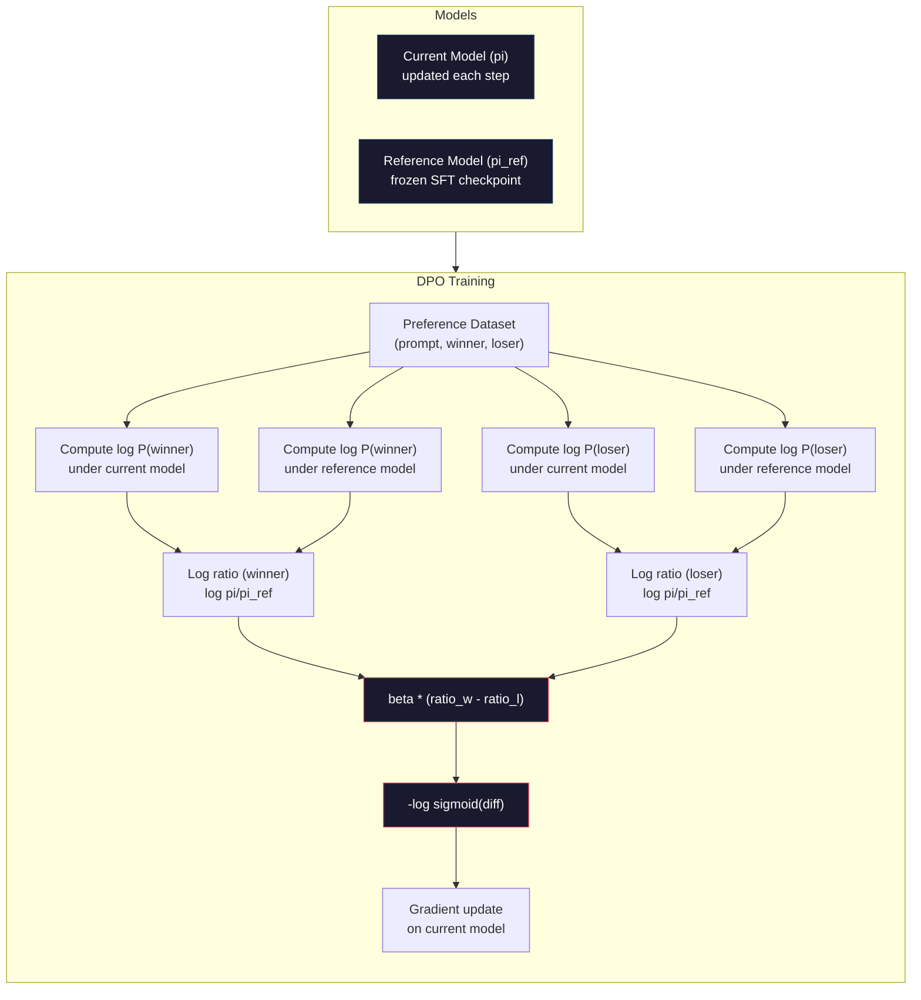

# DPO: Direct Preference Optimization

> RLHF работает. Но он также требует обучать три модели (SFT, reward model, policy), управлять нестабильностью PPO и настраивать KL penalty. DPO спрашивает: что, если все это можно пропустить? DPO напрямую оптимизирует языковую модель на preference pairs. Без reward model. Без PPO. Один training loop. Те же результаты.

**Тип:** Build
**Языки:** Python (with numpy)
**Пререквизиты:** Phase 10, Lesson 07 (RLHF)
**Время:** ~90 minutes

## Цели обучения

- Реализовать DPO training, который напрямую оптимизирует языковую модель на preference pairs без отдельной reward model
- Вывести DPO loss function и объяснить, как она неявно представляет reward model через log probabilities policy
- Сравнить DPO vs RLHF по training stability, compute cost и числу требуемых models
- Настроить beta parameter, чтобы контролировать, насколько далеко trained policy отклоняется от reference model

## Проблема

В Lesson 07 вы построили RLHF pipeline. Три этапа. Три модели. SFT model, reward model и policy model, оптимизированная с PPO. Одна только reward model требовала тысячи human preference pairs и отдельный training loop. PPO требовал аккуратно настраивать KL coefficient, learning rate, clip ratio и число epochs.

На практике PPO training печально известен нестабильностью. Небольшие изменения гиперпараметров приводят к divergence. Reward model — несовершенный proxy для human preferences, и policy находит способы эксплуатировать ее слабости. KL penalty помогает, но сам требует настройки: слишком низкий — получите reward hacking, слишком высокий — модель почти не учится.

Именно из-за этой сложности большинство open-source моделей годами испытывали трудности с RLHF после публикации InstructGPT. Three-stage pipeline хрупок. У каждого этапа свои failure modes, а ошибки накапливаются.

В мае 2023 года Rafael Rafailov, Archit Sharma и коллеги из Stanford опубликовали "Direct Preference Optimization: Your Language Model is Secretly a Reward Model." Главная идея: отдельная reward model не нужна. Оптимальная reward function математически определяется собственными token probabilities языковой модели. Можно полностью пропустить reward model и напрямую оптимизировать языковую модель на preference pairs.

DPO сводит RLHF к одному supervised learning step. Одна модель. Одна loss function. Один training loop. Без reinforcement learning. Zephyr-7B, одна из первых моделей, использовавших DPO в масштабе, сравнялась или превзошла модели с полным RLHF на нескольких benchmarks. Meta использовала DPO как часть alignment pipeline Llama 3. Anthropic ссылалась на DPO-style методы в своих alignment research.

## Концепция

### Ключевая идея

RLHF оптимизирует objective:

```
maximize: E[R(x, y)] - beta * KL(pi || pi_ref)
```

где R — reward model, pi — policy, pi_ref — reference model, а beta — KL coefficient.

DPO paper показала, что у этого objective есть closed-form optimal solution. Для любой reward function R оптимальная policy равна:

```
pi*(y | x) = pi_ref(y | x) * exp(R(x, y) / beta) / Z(x)
```

где Z(x) — normalizing constant. Переставляя члены:

```
R(x, y) = beta * log(pi*(y | x) / pi_ref(y | x)) + beta * log Z(x)
```

Это прорыв. Reward выражается полностью через probabilities policy model и probabilities reference model. Не нужно обучать отдельную reward model. Reward *неявно* содержится в probability ratio.

Подставим это в Bradley-Terry preference model:

```
P(y_w > y_l | x) = sigmoid(R(x, y_w) - R(x, y_l))
                  = sigmoid(beta * (log pi(y_w|x)/pi_ref(y_w|x) - log pi(y_l|x)/pi_ref(y_l|x)))
```

Члены Z(x) сокращаются, потому что оба ответа conditioned on один и тот же prompt x. Остается функция только от log-probabilities policy model и reference model на preferred и rejected responses.

### DPO Loss

```
L_DPO = -log(sigmoid(beta * (log pi(y_w|x)/pi_ref(y_w|x) - log pi(y_l|x)/pi_ref(y_l|x))))
```

Разберем каждую часть:

- **y_w** = preferred (winning) response
- **y_l** = rejected (losing) response
- **x** = prompt
- **pi** = current model (being trained)
- **pi_ref** = reference model (frozen SFT checkpoint)
- **beta** = temperature parameter, контролирующий deviation from reference (обычно 0.1-0.5)

Отношение `log pi(y|x) / pi_ref(y|x)` — это log-probability ratio. Когда оно положительное, current model назначает response y более высокую probability, чем reference. Когда отрицательное — более низкую.

DPO loss толкает модель повышать log-probability ratio для preferred responses и снижать его для rejected responses. Beta parameter контролирует, насколько агрессивно модель может отклоняться от reference: маленький beta разрешает большие deviations, большой beta держит модель близко к reference.



### Почему DPO проще

| Aspect | RLHF (PPO) | DPO |
|--------|-----------|-----|
| Models to train | 3 (SFT + reward + policy) | 1 (policy only) |
| Training loops | 3 (SFT, RM training, PPO) | 2 (SFT, DPO) |
| Hyperparameters | lr, KL coeff, clip ratio, RM lr, epochs x3 | lr, beta, epochs |
| Reward model | Required (separate training) | Implicit in model probabilities |
| RL algorithm | PPO (complex, unstable) | Supervised learning (stable) |
| GPU memory | 3-4 models in memory during PPO | 2 models (current + reference) |
| Training stability | Sensitive to hyperparameters | Robust, similar to SFT |

DPO требует две модели в памяти во время обучения: current model и frozen reference. RLHF требует три или четыре: policy, reference, reward model и опционально value function baseline. Для модели 70B каждая копия занимает 140GB в FP16. Экономия памяти от удаления reward model существенна.

### Когда DPO превосходит RLHF

**Small datasets.** С 5 000-20 000 preference pairs DPO часто сравним или лучше RLHF. Reward model в RLHF нужна достаточная data, чтобы обобщать; при ограниченных данных она переобучается и дает ненадежные reward signals. DPO обходит эту проблему, потому что reward model вообще не нужна.

**Limited compute.** DPO требует примерно треть compute от full RLHF (один training loop вместо трех). Для команд без больших GPU clusters это практичный выбор.

**Rapid iteration.** Хотите попробовать 10 разных preference datasets и посмотреть, какой дает лучшую модель? DPO позволяет запускать каждый эксперимент за часы. RLHF требует переобучать reward model для каждого dataset.

### Когда RLHF превосходит DPO

**Large-scale training.** На масштабе GPT-4 или Claude отдельная reward model в RLHF может улавливать более тонкие preference signals. Reward model действует как learned loss function, адаптирующаяся к сложным критериям качества.

**Complex reward signals.** Когда «лучше» включает несколько измерений (helpfulness, harmlessness, honesty), reward model может выучить этот multi-objective tradeoff. DPO трактует каждую preference pair как binary signal: один лучше, другой хуже, — не моделируя почему.

**Iterative alignment.** RLHF pipelines могут генерировать новые responses текущей policy, отдавать их людям на оценку и переобучать reward model в online loop. DPO работает с фиксированным dataset preference pairs. Constitutional AI (подход Anthropic) активно использует это итеративное свойство RLHF.

### Beyond DPO: KTO, ORPO, SimPO

DPO вдохновил семейство упрощенных alignment methods.

**KTO (Kahneman-Tversky Optimization, 2024):** Даже пары не нужны. KTO работает с unpaired feedback: каждый response просто помечается как "good" или "bad" без сравнения с альтернативой. Это резко упрощает collection data. Вместо того чтобы показывать аннотаторам два ответа и спрашивать «какой лучше?», вы показываете один response и спрашиваете «это хорошо?» Loss function применяет loss aversion из prospect theory: плохие responses штрафуются сильнее, чем хорошие вознаграждаются.

**ORPO (Odds Ratio Preference Optimization, 2024):** Объединяет SFT и alignment в один training step. Вместо того чтобы сначала делать SFT, а потом DPO, ORPO модифицирует SFT loss, добавляя preference signal. Loss имеет два члена: standard next-token prediction loss на preferred responses плюс odds ratio term, увеличивающий gap между probabilities preferred и rejected responses. Один training loop вместо двух.

**SimPO (Simple Preference Optimization, 2024):** Полностью устраняет reference model. Вместо log-probability ratios относительно frozen reference, SimPO использует average log-probability ответа (normalized by length) как implicit reward. Это экономит память (reference model не нужна) и упрощает обучение. Length normalization не дает модели предпочитать более короткие responses.

| Method | Year | Models in Memory | Needs Pairs? | Needs Reference? | Training Loops |
|--------|------|-----------------|-------------|-----------------|----------------|
| RLHF | 2022 | 3-4 | Yes (for RM) | Yes | 3 |
| DPO | 2023 | 2 | Yes | Yes | 2 |
| KTO | 2024 | 2 | No (unpaired) | Yes | 2 |
| ORPO | 2024 | 1 | Yes | No | 1 |
| SimPO | 2024 | 1 | Yes | No | 1 |

Тренд очевиден: каждый метод устраняет еще один элемент сложности. RLHF требовал reward model и PPO. DPO устранил оба. KTO устранил paired data. ORPO устранил отдельный этап SFT. SimPO устранил reference model. Alignment tax — стоимость compute и complexity для перехода от base model к aligned model — продолжает снижаться.

### Реальные применения DPO

**Zephyr-7B (HuggingFace, октябрь 2023):** Mistral 7B base, SFT на UltraChat (200K examples), затем DPO на UltraFeedback (60K preference pairs). Score 6.47 на MT-Bench — лучший 7B model на тот момент. Для сравнения, Llama 2 Chat 70B получил 6.86, то есть Zephyr подошел на расстояние 6% к модели в 10 раз больше, используя только DPO alignment.

**Llama 3 (Meta, апрель 2024):** Использовала DPO после начальных RLHF stages. Комбинация показывает, что DPO и RLHF могут дополнять друг друга: RLHF для broad alignment, DPO для targeted refinement.

**Neural Magic / nm-chat (2024):** Применяла DPO к нескольким open-source models, стабильно показывая улучшение на 5-15% на alignment benchmarks по сравнению с SFT-only baselines.

## Реализация

### Шаг 1: Preference Dataset

Тот же формат, что и в RLHF: тройки (prompt, preferred, rejected). DPO потребляет эти данные напрямую, без промежуточной reward model.

```python
import numpy as np
import sys
import os
sys.path.insert(0, os.path.join(os.path.dirname(__file__), "..", "..", "04-pre-training-mini-gpt", "code"))
from main import MiniGPT, LayerNorm, Embedding, TransformerBlock

PREFERENCE_DATA = [
    {
        "prompt": "What is the capital of France?",
        "preferred": "The capital of France is Paris.",
        "rejected": "France is a country in Europe. It has many cities. The capital is Paris. Paris is known for the Eiffel Tower.",
    },
    {
        "prompt": "Explain gravity in one sentence.",
        "preferred": "Gravity is the force that attracts objects with mass toward each other.",
        "rejected": "Gravity is something that makes things fall down when you drop them.",
    },
    {
        "prompt": "What is 15 times 7?",
        "preferred": "15 times 7 is 105.",
        "rejected": "Let me think about this. 15 times 7. Well, 10 times 7 is 70, and 5 times 7 is 35, so the answer might be around 105.",
    },
    {
        "prompt": "Name three programming languages.",
        "preferred": "Python, Rust, and TypeScript.",
        "rejected": "There are many programming languages. Some popular ones include various languages like Python and others.",
    },
    {
        "prompt": "What year did World War II end?",
        "preferred": "World War II ended in 1945.",
        "rejected": "World War II was a major global conflict. It involved many countries. The war ended in the mid-1940s, specifically in 1945.",
    },
    {
        "prompt": "Define machine learning.",
        "preferred": "Machine learning is a field where algorithms learn patterns from data to make predictions without being explicitly programmed.",
        "rejected": "Machine learning is a type of AI. AI stands for artificial intelligence. Machine learning uses data to learn.",
    },
]
```

### Шаг 2: Sequence Log-Probability

DPO loss требует вычислять total log-probability ответа при заданном prompt. Это значит запустить модель на полной последовательности (prompt + response) и просуммировать log-probabilities каждого токена ответа.

```python
def tokenize_sequence(text, vocab_size=256):
    return [min(t, vocab_size - 1) for t in list(text.encode("utf-8"))]


def compute_sequence_log_prob(model, prompt_tokens, response_tokens, max_seq_len=128):
    full_sequence = prompt_tokens + response_tokens
    if len(full_sequence) > max_seq_len:
        full_sequence = full_sequence[:max_seq_len]

    if len(full_sequence) < 2:
        return 0.0

    input_ids = np.array(full_sequence[:-1]).reshape(1, -1)
    target_ids = np.array(full_sequence[1:])

    logits = model.forward(input_ids)
    logits = logits[0]

    max_logits = logits.max(axis=-1, keepdims=True)
    log_probs = logits - max_logits - np.log(
        np.exp(logits - max_logits).sum(axis=-1, keepdims=True)
    )

    prompt_len = len(prompt_tokens)
    response_start = max(0, prompt_len - 1)
    response_end = len(target_ids)

    if response_start >= response_end:
        return 0.0

    response_log_probs = log_probs[response_start:response_end, :]
    response_targets = target_ids[response_start:response_end]

    total_log_prob = 0.0
    for i, target in enumerate(response_targets):
        total_log_prob += response_log_probs[i, target]

    return total_log_prob
```

Эта функция — рабочая лошадка DPO. Для каждой preference pair она запускается четыре раза: model на preferred response, model на rejected response, reference на preferred response, reference на rejected response. Это 4 forward passes на training example против generation + reward scoring + value estimation + PPO update в RLHF. Проще, быстрее, стабильнее.

### Шаг 3: DPO Loss

Суть статьи в коде. Одна функция. Один loss. Без reward model.

```python
def sigmoid(x):
    return np.where(
        x >= 0,
        1.0 / (1.0 + np.exp(-x)),
        np.exp(x) / (1.0 + np.exp(x))
    )


def dpo_loss(policy_logprob_preferred, policy_logprob_rejected,
             ref_logprob_preferred, ref_logprob_rejected, beta=0.1):
    preferred_ratio = policy_logprob_preferred - ref_logprob_preferred
    rejected_ratio = policy_logprob_rejected - ref_logprob_rejected

    logit = beta * (preferred_ratio - rejected_ratio)

    loss = -np.log(sigmoid(logit) + 1e-8)

    preferred_reward = beta * preferred_ratio
    rejected_reward = beta * rejected_ratio

    return loss, {
        "preferred_ratio": float(preferred_ratio),
        "rejected_ratio": float(rejected_ratio),
        "logit": float(logit),
        "implicit_preferred_reward": float(preferred_reward),
        "implicit_rejected_reward": float(rejected_reward),
        "reward_margin": float(preferred_reward - rejected_reward),
    }
```

`preferred_ratio` и `rejected_ratio` — это log-probability ratios из вывода DPO. Когда current model назначает preferred response более высокую probability (относительно reference) и rejected response более низкую probability, logit положителен и loss мал. Training signal толкает модель ровно в этом направлении.

`implicit_preferred_reward` и `implicit_rejected_reward` — rewards, которые DPO loss назначает неявно. Их можно извлекать, чтобы проверять, что обучение работает: margin между preferred и rejected rewards должен расти по ходу training.

### Шаг 4: DPO Training Loop

Стандартный supervised training loop. Без PPO. Без reward model. Только forward passes и gradient updates.

```python
def copy_model_weights(source, target):
    target.embedding.token_embed = source.embedding.token_embed.copy()
    target.embedding.pos_embed = source.embedding.pos_embed.copy()
    target.ln_f.gamma = source.ln_f.gamma.copy()
    target.ln_f.beta = source.ln_f.beta.copy()
    for s_block, t_block in zip(source.blocks, target.blocks):
        t_block.attn.W_q = s_block.attn.W_q.copy()
        t_block.attn.W_k = s_block.attn.W_k.copy()
        t_block.attn.W_v = s_block.attn.W_v.copy()
        t_block.attn.W_out = s_block.attn.W_out.copy()
        t_block.ffn.W1 = s_block.ffn.W1.copy()
        t_block.ffn.W2 = s_block.ffn.W2.copy()
        t_block.ffn.b1 = s_block.ffn.b1.copy()
        t_block.ffn.b2 = s_block.ffn.b2.copy()
        t_block.ln1.gamma = s_block.ln1.gamma.copy()
        t_block.ln1.beta = s_block.ln1.beta.copy()
        t_block.ln2.gamma = s_block.ln2.gamma.copy()
        t_block.ln2.beta = s_block.ln2.beta.copy()


def dpo_train(policy_model, reference_model, preference_data,
              num_epochs=5, lr=5e-6, beta=0.1, max_seq_len=128):
    print(f"DPO Training: {len(preference_data)} pairs, {num_epochs} epochs, "
          f"lr={lr}, beta={beta}")
    print()

    losses = []
    margins = []

    for epoch in range(num_epochs):
        epoch_loss = 0.0
        epoch_margin = 0.0
        num_examples = 0

        indices = np.random.permutation(len(preference_data))

        for idx in indices:
            pair = preference_data[idx]

            prompt_tokens = tokenize_sequence(pair["prompt"])
            preferred_tokens = tokenize_sequence(pair["preferred"])
            rejected_tokens = tokenize_sequence(pair["rejected"])

            pi_logprob_w = compute_sequence_log_prob(
                policy_model, prompt_tokens, preferred_tokens, max_seq_len
            )
            pi_logprob_l = compute_sequence_log_prob(
                policy_model, prompt_tokens, rejected_tokens, max_seq_len
            )
            ref_logprob_w = compute_sequence_log_prob(
                reference_model, prompt_tokens, preferred_tokens, max_seq_len
            )
            ref_logprob_l = compute_sequence_log_prob(
                reference_model, prompt_tokens, rejected_tokens, max_seq_len
            )

            loss, metrics = dpo_loss(
                pi_logprob_w, pi_logprob_l,
                ref_logprob_w, ref_logprob_l, beta
            )

            update_direction = 1.0 if metrics["logit"] < 0 else -0.1
            for block in policy_model.blocks:
                block.ffn.W1 += lr * update_direction * np.random.randn(*block.ffn.W1.shape) * 0.01
                block.ffn.W2 += lr * update_direction * np.random.randn(*block.ffn.W2.shape) * 0.01

            epoch_loss += loss
            epoch_margin += metrics["reward_margin"]
            num_examples += 1
            losses.append(float(loss))
            margins.append(metrics["reward_margin"])

        avg_loss = epoch_loss / max(num_examples, 1)
        avg_margin = epoch_margin / max(num_examples, 1)

        print(f"  Epoch {epoch + 1}/{num_epochs} | Loss: {avg_loss:.4f} | "
              f"Avg Margin: {avg_margin:.4f}")

    return policy_model, losses, margins
```

Training loop приятно прост по сравнению с RLHF. Для каждой preference pair: вычислить четыре log-probabilities (две модели, два ответа), подставить их в DPO loss, вычислить gradient, обновить policy. Нет generation step. Нет reward model inference. Нет advantage estimation. Нет clipping.

### Шаг 5: Сравнение DPO vs RLHF

Измерьте implicit reward margins и log-probability shifts, чтобы сравнить DPO с RLHF model из Lesson 07.

```python
def evaluate_preference_accuracy(model, reference_model, preference_data, beta=0.1, max_seq_len=128):
    correct = 0
    total = 0

    for pair in preference_data:
        prompt_tokens = tokenize_sequence(pair["prompt"])
        preferred_tokens = tokenize_sequence(pair["preferred"])
        rejected_tokens = tokenize_sequence(pair["rejected"])

        pi_w = compute_sequence_log_prob(model, prompt_tokens, preferred_tokens, max_seq_len)
        pi_l = compute_sequence_log_prob(model, prompt_tokens, rejected_tokens, max_seq_len)
        ref_w = compute_sequence_log_prob(reference_model, prompt_tokens, preferred_tokens, max_seq_len)
        ref_l = compute_sequence_log_prob(reference_model, prompt_tokens, rejected_tokens, max_seq_len)

        preferred_reward = beta * (pi_w - ref_w)
        rejected_reward = beta * (pi_l - ref_l)

        if preferred_reward > rejected_reward:
            correct += 1
        total += 1

    return correct / max(total, 1)


def analyze_implicit_rewards(model, reference_model, preference_data, beta=0.1, max_seq_len=128):
    print("Implicit Reward Analysis:")
    print("-" * 65)
    print(f"  {'Prompt':<30} {'Pref Reward':>12} {'Rej Reward':>12} {'Margin':>10}")
    print("  " + "-" * 60)

    for pair in preference_data:
        prompt_tokens = tokenize_sequence(pair["prompt"])
        preferred_tokens = tokenize_sequence(pair["preferred"])
        rejected_tokens = tokenize_sequence(pair["rejected"])

        pi_w = compute_sequence_log_prob(model, prompt_tokens, preferred_tokens, max_seq_len)
        pi_l = compute_sequence_log_prob(model, prompt_tokens, rejected_tokens, max_seq_len)
        ref_w = compute_sequence_log_prob(reference_model, prompt_tokens, preferred_tokens, max_seq_len)
        ref_l = compute_sequence_log_prob(reference_model, prompt_tokens, rejected_tokens, max_seq_len)

        pref_reward = beta * (pi_w - ref_w)
        rej_reward = beta * (pi_l - ref_l)
        margin = pref_reward - rej_reward

        truncated = pair["prompt"][:28] + ".." if len(pair["prompt"]) > 30 else pair["prompt"]
        print(f"  {truncated:<30} {pref_reward:>12.4f} {rej_reward:>12.4f} {margin:>10.4f}")

    print()
```

### Шаг 6: Beta Sensitivity Analysis

Beta parameter — аналог KL coefficient из RLHF для DPO. Он контролирует, насколько модель может отклоняться от reference. Этот эксперимент показывает его эффект.

```python
def beta_sensitivity_analysis(sft_model, preference_data, betas, max_seq_len=128):
    print("Beta Sensitivity Analysis")
    print("-" * 60)
    print(f"  {'Beta':>8} {'Final Loss':>12} {'Final Margin':>14} {'Accuracy':>10}")
    print("  " + "-" * 55)

    results = []

    for beta in betas:
        policy = MiniGPT(
            vocab_size=256, embed_dim=128, num_heads=4,
            num_layers=4, max_seq_len=max_seq_len, ff_dim=512
        )
        reference = MiniGPT(
            vocab_size=256, embed_dim=128, num_heads=4,
            num_layers=4, max_seq_len=max_seq_len, ff_dim=512
        )
        copy_model_weights(sft_model, policy)
        copy_model_weights(sft_model, reference)

        policy, losses, margins_list = dpo_train(
            policy, reference, preference_data,
            num_epochs=3, lr=5e-6, beta=beta, max_seq_len=max_seq_len
        )

        accuracy = evaluate_preference_accuracy(
            policy, reference, preference_data, beta, max_seq_len
        )

        final_loss = losses[-1] if losses else 0
        final_margin = margins_list[-1] if margins_list else 0

        print(f"  {beta:>8.3f} {final_loss:>12.4f} {final_margin:>14.4f} {accuracy:>10.1%}")
        results.append({
            "beta": beta,
            "final_loss": final_loss,
            "final_margin": final_margin,
            "accuracy": accuracy,
        })

        print()

    return results
```

Маленький beta (0.01) позволяет модели свободно отклоняться от reference: быстрое обучение, но риск degenerate solutions. Большой beta (1.0) держит модель близко к reference: стабильно, но медленно. Sweet spot для большинства применений — 0.1-0.3.

## Использование

### Полная демонстрация DPO Pipeline

```python
if __name__ == "__main__":
    np.random.seed(42)

    print("=" * 70)
    print("DPO: DIRECT PREFERENCE OPTIMIZATION")
    print("=" * 70)
    print()

    print("STEP 1: Initialize SFT Model (from Lesson 06)")
    print("-" * 50)
    sft_model = MiniGPT(
        vocab_size=256, embed_dim=128, num_heads=4,
        num_layers=4, max_seq_len=128, ff_dim=512
    )
    print(f"  Parameters: {sft_model.count_parameters():,}")
    print()

    print("STEP 2: DPO Training")
    print("-" * 50)

    policy_model = MiniGPT(
        vocab_size=256, embed_dim=128, num_heads=4,
        num_layers=4, max_seq_len=128, ff_dim=512
    )
    reference_model = MiniGPT(
        vocab_size=256, embed_dim=128, num_heads=4,
        num_layers=4, max_seq_len=128, ff_dim=512
    )
    copy_model_weights(sft_model, policy_model)
    copy_model_weights(sft_model, reference_model)

    policy_model, losses, margins = dpo_train(
        policy_model, reference_model, PREFERENCE_DATA,
        num_epochs=5, lr=5e-6, beta=0.1
    )
    print()

    print("=" * 70)
    print("STEP 3: Evaluate")
    print("=" * 70)
    print()

    pre_accuracy = evaluate_preference_accuracy(
        sft_model, reference_model, PREFERENCE_DATA, beta=0.1
    )
    post_accuracy = evaluate_preference_accuracy(
        policy_model, reference_model, PREFERENCE_DATA, beta=0.1
    )

    print(f"  Preference accuracy (pre-DPO):  {pre_accuracy:.1%}")
    print(f"  Preference accuracy (post-DPO): {post_accuracy:.1%}")
    print()

    analyze_implicit_rewards(policy_model, reference_model, PREFERENCE_DATA, beta=0.1)

    print("=" * 70)
    print("STEP 4: Training Dynamics")
    print("=" * 70)
    print()

    if losses:
        print("  Loss curve:")
        window = max(1, len(losses) // 5)
        for i in range(0, len(losses), window):
            chunk = losses[i:i + window]
            avg = sum(chunk) / len(chunk)
            print(f"    Steps {i:3d}-{i + len(chunk) - 1:3d}: loss = {avg:.4f}")
        print()

    if margins:
        print("  Reward margin curve:")
        window = max(1, len(margins) // 5)
        for i in range(0, len(margins), window):
            chunk = margins[i:i + window]
            avg = sum(chunk) / len(chunk)
            print(f"    Steps {i:3d}-{i + len(chunk) - 1:3d}: margin = {avg:.4f}")
        print()

    print("=" * 70)
    print("STEP 5: Beta Sensitivity")
    print("=" * 70)
    print()

    beta_results = beta_sensitivity_analysis(
        sft_model, PREFERENCE_DATA, betas=[0.01, 0.1, 0.3, 1.0]
    )

    print("=" * 70)
    print("DPO vs RLHF COMPARISON")
    print("=" * 70)
    print()
    print("  DPO advantages:")
    print("    - 1 training loop (vs 3 for RLHF)")
    print("    - 2 models in memory (vs 3-4 for RLHF)")
    print("    - Supervised learning (vs RL, more stable)")
    print("    - No reward model to train or maintain")
    print()
    print("  RLHF advantages:")
    print("    - Separate reward model captures complex preferences")
    print("    - Online learning: generate, rate, retrain")
    print("    - Better for multi-objective alignment")
    print("    - Proven at largest scales (GPT-4, Claude)")
    print()
    print("  Practical guidance:")
    print("    - Start with DPO. It's simpler and often sufficient.")
    print("    - Switch to RLHF if DPO plateaus on your eval metrics.")
    print("    - Many production systems use both: RLHF first, DPO to refine.")
```

## Результат

Этот урок создает `outputs/prompt-alignment-method-selector.md` — prompt, который помогает выбрать подходящий alignment method (SFT, RLHF, DPO, KTO, ORPO, SimPO) для вашего use case. По доступности данных, compute budget и alignment goals он рекомендует метод и training plan.

## Упражнения

1. Реализуйте KTO (Kahneman-Tversky Optimization). KTO не требует пар: достаточно пометить каждый response как "good" или "bad." Loss для good response равен `-log(sigmoid(beta * log_ratio))`, а для bad response — `-log(1 - sigmoid(beta * log_ratio))` с loss aversion multiplier (обычно 1.5x) на loss плохого ответа. Обучите на тех же данных (считайте preferred как "good", а rejected как "bad" независимо) и сравните accuracy с DPO.

2. Реализуйте length-normalized DPO. Вместо raw log-probabilities делите на число response tokens: `normalized_logprob = total_logprob / num_tokens`. Это не дает модели предпочитать более короткие responses (у которых выше total log-prob). Сравните implicit reward margins с normalization и без нее.

3. Постройте ORPO-style combined loss. Добавьте standard next-token prediction loss на preferred response к DPO loss: `L = L_sft(preferred) + alpha * L_dpo`. Попробуйте alpha values 0.1, 0.5 и 1.0. Combined loss должен дать модель, которая и следует инструкциям (из SFT term), и предпочитает лучшие ответы (из DPO term), устраняя необходимость отдельного SFT stage.

4. Реализуйте iterative DPO. Запустите DPO на 3 epochs, затем сгенерируйте новые responses из trained model, соедините их с исходными preferred responses как new preference pairs и запустите DPO снова. Сделайте два раунда этого "self-play" process. Сравните preference accuracy после round 1 и round 2, чтобы понять, помогает ли iterative refinement.

5. Сравните DPO с разными reference models. Вместо SFT checkpoint как reference попробуйте: (a) base model (pre-SFT), (b) checkpoint from epoch 1 of DPO, (c) exponential moving average of policy model. Сообщите, какой reference дает highest preference accuracy и most stable training curve.

## Ключевые термины

| Term | Как обычно говорят | Что это на самом деле означает |
|------|--------------------|--------------------------------|
| DPO | "RLHF without RL" | Direct Preference Optimization: supervised learning algorithm, который оптимизирует language model напрямую на preference pairs, обходя reward model и PPO |
| Implicit reward | "The reward is in the model" | Reward function определяется log-probability ratio между policy и reference models; отдельная reward model не нужна |
| Beta (DPO) | "The temperature" | Контролирует, насколько далеко policy может отклоняться от reference model: маленький beta разрешает большие deviations, большой beta держит модель близко |
| Log-probability ratio | "How much the model changed" | log pi(y\|x) - log pi_ref(y\|x); положительное значение означает, что current model назначает более высокую probability, чем reference |
| Reference model | "The frozen checkpoint" | Копия SFT model, веса которой никогда не меняются; служит якорем для computing probability ratios |
| KTO | "DPO without pairs" | Kahneman-Tversky Optimization: работает с unpaired labels "good" или "bad" вместо обязательных preference pairs |
| ORPO | "One-step alignment" | Odds Ratio Preference Optimization: объединяет SFT и alignment в один training loop, добавляя preference term к SFT loss |
| SimPO | "No reference needed" | Simple Preference Optimization: устраняет reference model, используя length-normalized average log-probability как implicit reward |
| Alignment tax | "The cost of making models safe" | Дополнительные compute, data и complexity, нужные для перехода от base model к aligned model; DPO заметно снижает эту цену |

## Дополнительное чтение

- [Rafailov et al., 2023 -- "Direct Preference Optimization: Your Language Model is Secretly a Reward Model"](https://arxiv.org/abs/2305.18290) -- статья DPO, упростившая alignment от RLHF до supervised learning
- [Tunstall et al., 2023 -- "Zephyr: Direct Distillation of LM Alignment"](https://arxiv.org/abs/2310.16944) -- Zephyr-7B, показывающая, что DPO на UltraFeedback сравним с RLHF на benchmarks
- [Ethayarajh et al., 2024 -- "KTO: Model Alignment as Prospect Theoretic Optimization"](https://arxiv.org/abs/2402.01306) -- устранение необходимости paired preferences
- [Hong et al., 2024 -- "ORPO: Monolithic Preference Optimization without Reference Model"](https://arxiv.org/abs/2403.07691) -- объединение SFT и alignment за один шаг
- [Meng et al., 2024 -- "SimPO: Simple Preference Optimization with a Reference-Free Reward"](https://arxiv.org/abs/2405.14734) -- полное устранение reference model
- [Llama 3 Technical Report](https://arxiv.org/abs/2407.21783) -- alignment pipeline Meta, объединяющий RLHF и DPO
