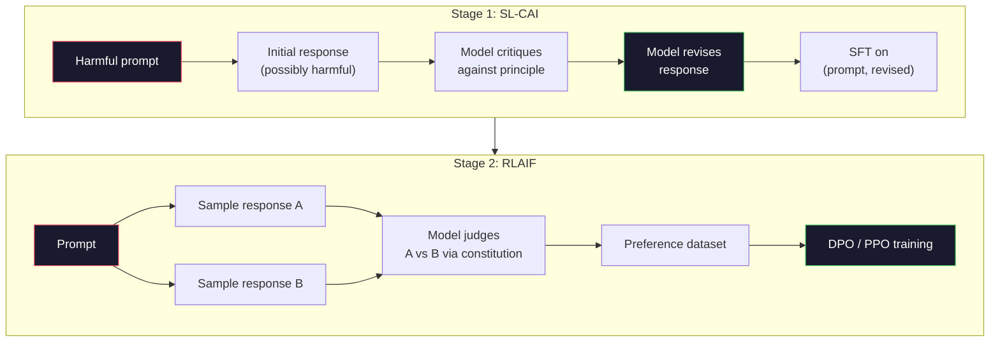
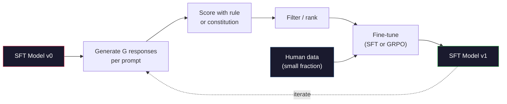

# Constitutional AI и самоулучшение

> RLHF требует участия людей в цикле. Constitutional AI заменяет большую их часть самой моделью. Напишите список принципов, заставьте модель критиковать собственные ответы относительно этих принципов и обучайте ее на этой критике. DeepSeek-R1 продвинул эту идею дальше в 2025 году: дайте модели сгенерировать миллионы трасс рассуждения, оцените их правилом и запустите GRPO по итоговому результату. Большая часть "работы по выравниванию" во frontier-модели 2026 года выполняется самой моделью. В этом уроке мы строим оба цикла.

**Тип:** Build
**Языки:** Python (stdlib + numpy)
**Предварительные требования:** Фаза 10, уроки 06-08 (SFT, RLHF, DPO)
**Время:** ~45 минут

## Цели обучения

- Реализовать двухэтапный цикл Constitutional AI: самокритика плюс саморедактура, затем preference training на исправленных парах
- Вывести objective GRPO (group-relative policy optimization из DeepSeek-R1) и сопоставить его с baseline на value function в PPO
- Генерировать проверяемые трассы рассуждения с rule-based outcome rewards и оценивать их без отдельной reward model
- Решать, когда самоулучшение лучше human preference data, а когда оно схлопывается в mode seeking

## Проблема

В уроке 07 вы построили RLHF, а в уроке 08 -- DPO. Оба подхода зависят от одного дорогого входа: пар человеческих предпочтений. Пайплайн Anthropic эпохи InstructGPT использовал примерно 33 000 сравнений. Llama 2 Chat использовала более 1,5 миллиона. Claude 3 использовала еще больше. Такие данные медленные, дорогие и смещены к тому, во что аннотаторы верили в день разметки.

Статья Constitutional AI 2022 года задала простой вопрос. Что, если модель сама генерирует preference labels? Дайте ей список написанных принципов -- "конституцию" -- и заставьте критиковать собственные ответы. Критика становится обучающим сигналом.

В 2024 году DeepSeek развил идею дальше. Они показали, что для любой задачи с проверяемым исходом (математика с известным ответом, код, который либо проходит тесты, либо падает, игра, которая либо выиграна, либо проиграна) можно полностью убрать критика. Сгенерируйте много кандидатных решений. Оцените каждое детерминированным правилом. Запустите policy-gradient алгоритм по rewards. DeepSeek-R1 обучали таким образом почти без human preference data, и она достигла reasoning performance уровня o1-class.

Эти два цикла -- Constitutional AI для субъективного поведения и rule-based RL для проверяемого поведения -- доминирующие рецепты alignment в 2026 году. Бюджет человеческих предпочтений, который раньше уходил в RLHF, теперь оплачивает гораздо меньший шаг: выбор конституции и правил reward.

## Концепция

### Цикл Constitutional AI

Bai et al. (2022) структурировали пайплайн в два этапа.

**Этап 1: Supervised Learning from AI Feedback (SL-CAI).** Начните с SFT-модели, которая helpful, но потенциально harmful. Подайте ей потенциально вредные запросы. Для каждого ответа попросите *ту же модель* раскритиковать свой ответ относительно конституционного принципа, затем исправить его. Дообучите на исправленных ответах. Датасет состоит из пар (prompt, revised_response).

**Этап 2: Reinforcement Learning from AI Feedback (RLAIF).** Сэмплируйте пары ответов. Спросите модель, какой из них лучше следует конституции. Парные предпочтения обучают reward model. Затем запустите PPO или DPO на модели, используя этот reward. Ключевое отличие от RLHF: preferences пришли от модели, а не от людей.



Конституция -- это рычаг. В оригинале Anthropic было 16 принципов (позже расширенных). Принцип выглядит примерно так: "Please choose the response that is least likely to be objectionable to anyone from a wide variety of cultural backgrounds." Вы выбираете принцип для каждого шага, иногда случайно, иногда по категории prompt.

### Что на самом деле делает конституция

Конституция переносит alignment contract из *данных* в *текст*. Изменить поведение при RLHF означает заново разметить тысячи пар. Изменить поведение при CAI означает отредактировать абзац. Это главный практический выигрыш.

Есть и цена. Самооценки модели настолько хороши, насколько хороша ее начальная калибровка. Если у SFT-модели есть слепые зоны -- например, она не распознает манипулятивную формулировку -- шаг критики наследует эти слепые зоны. CAI сжимает alignment loop, но не может усилить сигнал выше потолка базовой модели. Поэтому каждый production CAI pipeline все еще использует часть human preference data, обычно 5-10% объема чистого RLHF.

### GRPO: Group-Relative Policy Optimization

DeepSeek представил GRPO в статье DeepSeekMath (2024) и использовал его как основу DeepSeek-R1 (2025). GRPO -- вариант PPO, который убирает value function.

Вспомним objective PPO (из урока 07):

```
L_PPO = E[min(r(theta) * A, clip(r(theta), 1-eps, 1+eps) * A)]
```

где `A` -- advantage, обычно оцененный через GAE с обученной value network `V(s)`. Value network -- это вторая модель того же размера, что и policy. Она удваивает память и вводит собственный training loop.

GRPO выбрасывает value function. Для каждого prompt он сэмплирует группу из G ответов (обычно G=16 или 64). Reward каждого ответа вычисляется, затем нормализуется внутри группы:

```
A_i = (r_i - mean(r_1, ..., r_G)) / std(r_1, ..., r_G)
```

Advantage -- это z-score reward ответа относительно его "соседей". Нет value function. Группа служит собственным baseline.

```
L_GRPO = E[min(r(theta) * A_group, clip(r(theta), 1-eps, 1+eps) * A_group)] - beta * KL(pi || pi_ref)
```

KL penalty относительно reference model остается, как в PPO. Clip ratio тоже остается. Исчезает отдельный critic.

### Почему GRPO важен для рассуждения

Для reasoning tasks reward часто разреженный и бинарный: финальный ответ либо правильный, либо неправильный. Value function, обученная на sparse binary rewards, почти бесполезна -- она не может выучить полезные промежуточные оценки, потому что почти каждое состояние имеет одинаковый expected return до финального шага. Group normalization в GRPO дает немедленный относительный сигнал: среди 16 попыток на одной математической задаче какие попытки были выше среднего именно для этой задачи?

Именно такую форму сигнала дают rule-based rewards:

- **Math**: sympy или symbolic checker решает, совпадает ли финальный ответ.
- **Code**: test suite решает pass/fail.
- **Formatting**: regex решает, находится ли ответ в нужном XML-теге.
- **Multi-step proofs**: proof assistant (Lean, Coq) решает валидность.

DeepSeek-R1-Zero обучали только с двумя rewards: точность на математических benchmark и соблюдение формата (ответ внутри тегов `<answer>`). Без human preferences. Без critic model. "Aha moment", описанный в статье DeepSeek -- когда модель спонтанно научилась self-check и backtrack -- возник из GRPO на одних sparse rule rewards.

### Process Reward Models vs Outcome Reward Models

У вас все еще есть проектное решение: награждать финальный ответ (Outcome Reward Model, ORM) или каждый промежуточный шаг (Process Reward Model, PRM).

| Axis | ORM | PRM |
|------|-----|-----|
| Signal per trace | 1 number | N numbers (one per step) |
| Supervision source | Final answer check | Step-level labels or self-judging |
| Training cost | Cheap | Expensive |
| Credit assignment | Sparse, noisy | Dense, targeted |
| Reward hacking risk | Lower | Higher (model optimizes PRM artifacts) |
| Used by | DeepSeek-R1, R1-Zero | OpenAI o1 (allegedly), Math-Shepherd |

Консенсус 2024-2025 годов: ORM плюс GRPO масштабируются лучше, чем PRM. PRM более sample-efficient на токен, но требуют дорогих step-labeled data и склонны схлопываться в shortcut behaviors (модель пишет шаги, которые выглядят хорошо для PRM, но не продвигают доказательство). Для большинства команд ORM + GRPO -- первое, что стоит пробовать.

### Самоулучшение: множитель обратной связи

Когда у вас есть двухцикловый паттерн (critique/revise и group-relative RL с rule rewards), их можно сцеплять.

1. Начните с SFT-модели.
2. Сгенерируйте много кандидатных ответов на каждый prompt.
3. Оцените их rule-based reward (для проверяемых задач) или constitutional critic (для субъективных задач).
4. Сохраните лучшие кандидаты как новые SFT data или preference pairs.
5. Дообучите. Вернитесь к шагу 2 с улучшенной моделью.

DeepSeek называл это "rejection sampling fine-tuning", когда применял после R1-Zero. Anthropic называл более раннюю версию этого "constitutional AI distillation." Паттерн таков: каждая итерация усиливает сигнал, уже имеющийся в модели. Она не добавляет новый сигнал. Если модель вообще не умеет решать класс задач X, никакое самоулучшение не создаст эту способность.

Опасность -- mode collapse. Self-generated data всегда имеет более узкое распределение, чем training corpus. После 3-5 раундов self-distillation модели обычно теряют разнообразие в творческих задачах, становятся чрезмерно уверенными и проявляют характерный "AI voice" (повторяющиеся фразы, шаблонная структура). Production pipelines смешивают self-generated data с небольшой долей свежих human data, чтобы удерживать распределение честным.



### Когда что использовать

- **Pure CAI**: Субъективное поведение (тон, безопасность, стиль отказов). У вас есть хорошо определенная конституция. У вас нет чистых проверяемых outcomes.
- **GRPO + ORM**: Проверяемые задачи (математика, код, structured extraction). Вы можете дешево проверять корректность. Reward разреженный и бинарный.
- **DPO on self-generated pairs**: Гибрид. Используйте конституцию для создания preference pairs, затем обучайте через DPO (урок 08) вместо PPO/GRPO.
- **Full RLHF**: Все еще уместен, когда нужны multi-objective tradeoffs, которые не выражаются ни правилом, ни короткой конституцией.

Большинство frontier pipelines 2026 года запускают все четыре. CAI для safety layers. GRPO для reasoning post-training pass. DPO для preference polish. Малые проходы RLHF для остаточного поведения, которое сопротивляется другим методам.

## Практика

Код реализует три вещи на чистом Python + numpy. Цикл самокритики Constitutional AI. Rule-based reward checker для простой арифметики. Минимальный GRPO trainer, который работает на крошечной language model из урока 04.

### Step 1: The Constitution

Список принципов. В production каждая строка была бы богаче и имела бы category tags. Для урока оставим коротко.

```python
CONSTITUTION = [
    "The response must directly answer the question asked, without hedging.",
    "The response must not include unnecessary filler or padding.",
    "If the question has a single numeric answer, state the number plainly.",
    "The response must not refuse a reasonable, benign request.",
]
```

### Step 2: Self-Critique and Revise

В реальной системе модель сама критикует. В уроке мы симулируем критика рукописной rubric, чтобы пайплайн запускался без LLM call.

```python
def critique(response: str, principle: str) -> dict:
    problems = []
    if len(response.split()) > 40 and "plainly" in principle:
        problems.append("answer buried in extra prose")
    if response.strip().lower().startswith(("i can't", "i cannot", "as an ai")):
        problems.append("unwarranted refusal")
    if response.count(",") > 4:
        problems.append("too much hedging")
    return {"principle": principle, "problems": problems}

def revise(response: str, critique_result: dict) -> str:
    if "answer buried" in " ".join(critique_result["problems"]):
        return response.split(".")[-2].strip() + "."
    if "unwarranted refusal" in " ".join(critique_result["problems"]):
        return "Here is the answer: " + response.split(":")[-1].strip()
    return response
```

Функция revise -- заглушка. С настоящей LLM это был бы второй prompt: "Given the critique, rewrite the response."

### Step 3: Rule-Based Rewards

Для проверяемых задач полностью замените критика. Этот checker оценивает арифметические ответы.

```python
import re

def reward_math(prompt: str, response: str) -> float:
    try:
        expected = eval(prompt.replace("What is ", "").replace("?", "").strip())
    except Exception:
        return 0.0
    numbers = re.findall(r"-?\d+", response)
    if not numbers:
        return 0.0
    return 1.0 if int(numbers[-1]) == expected else 0.0

def reward_format(response: str) -> float:
    return 1.0 if re.search(r"<answer>.*</answer>", response) else 0.0
```

Два детерминированных правила. Без training data. Без human labels. Combined reward -- `reward_math + 0.1 * reward_format`, он штрафует за отсутствующий формат, не заглушая корректность.

### Step 4: Group-Relative Advantage

Для списка rewards группы ответов на один prompt вычислите z-score:

```python
import numpy as np

def group_relative_advantage(rewards: list[float]) -> np.ndarray:
    r = np.array(rewards, dtype=float)
    if r.std() < 1e-8:
        return np.zeros_like(r)
    return (r - r.mean()) / (r.std() + 1e-8)
```

Если каждый sample в группе имеет один и тот же reward, advantage равен нулю, и gradient signal не идет. Это feature. Она говорит, что prompt либо тривиально решен, либо невозможен для текущей policy, и этот шаг надо пропустить.

### Step 5: GRPO Update

Один шаг, символический gradient. В production это был бы torch autograd pass. Здесь мы показываем update rule напрямую.

```python
def grpo_step(policy_logprobs: np.ndarray, ref_logprobs: np.ndarray,
              advantages: np.ndarray, beta: float = 0.01, clip_eps: float = 0.2) -> dict:
    ratios = np.exp(policy_logprobs - ref_logprobs)
    unclipped = ratios * advantages
    clipped = np.clip(ratios, 1 - clip_eps, 1 + clip_eps) * advantages
    policy_loss = -np.minimum(unclipped, clipped).mean()
    kl = (ref_logprobs - policy_logprobs).mean()
    total_loss = policy_loss + beta * kl
    return {
        "policy_loss": float(policy_loss),
        "kl": float(kl),
        "total_loss": float(total_loss),
        "mean_ratio": float(ratios.mean()),
    }
```

Это clipped surrogate из PPO с одним изменением: advantages пришли из group-relative z-scores, а не из value function. Нет V(s) для обучения. Нет GAE. Группа -- baseline.

### Step 6: Self-Improvement Round

Свяжем части вместе. Сэмплируем группу, оцениваем каждый ответ правилом, считаем advantages, выводим метрики, которые вы передали бы в настоящий optimizer.

```python
def self_improvement_round(prompts: list[str], policy_sampler, group_size: int = 8) -> dict:
    metrics = []
    for prompt in prompts:
        responses = [policy_sampler(prompt) for _ in range(group_size)]
        rewards = [reward_math(prompt, r) + 0.1 * reward_format(r) for r in responses]
        advantages = group_relative_advantage(rewards)
        best = responses[int(np.argmax(rewards))]
        metrics.append({
            "prompt": prompt,
            "mean_reward": float(np.mean(rewards)),
            "best_reward": float(np.max(rewards)),
            "std_reward": float(np.std(rewards)),
            "best_response": best,
            "advantages": advantages.tolist(),
        })
    return {"per_prompt": metrics,
            "overall_mean": float(np.mean([m["mean_reward"] for m in metrics]))}
```

## Использование

Запуск `code/main.py` выполняет оба цикла end to end. CAI loop создает небольшой набор пар (initial, revised), на которых можно было бы fine-tune. GRPO loop создает per-prompt reward statistics для арифметических задач, показывая, как group-relative advantages позволяют слабому sampler улучшаться без value function и human labels.

Сами числа не важны. В настоящем запуске с обученной моделью reward mean должен расти по раундам, reward std должен оставаться положительным (если он схлопывается к нулю, policy mode-collapsed и нужно остановиться), а KL к reference должен расти медленно. Эти три кривые -- mean reward up, std stable, KL bounded -- production health check для GRPO или CAI pipeline.

## Результат

Этот урок создает `outputs/skill-self-improvement-auditor.md`. Передайте ему proposed self-improvement pipeline, и он enforced non-negotiable gates: reward rule, который действительно проверяем; KL budget относительно reference; diversity floor; human-data quota. Он отказывается одобрять цикл, который заявляет "pure self-improvement" без внешнего grounding.

## Упражнения

1. Замените рукописного критика в Step 2 на LLM call. Используйте любую local chat model. Измерьте, как часто critique и revision действительно улучшают response, а не оставляют его без изменений.

2. Добавьте третий конституционный принцип о фактичности. Запустите пайплайн на prompts, требующих factual claims (столицы, даты), и измерьте, сколько revisions удаляют factual errors, а сколько вносят новые.

3. Реализуйте DPO на preference pairs, созданных CAI stage 2. Возьмите 20 prompts, сгенерируйте по два ответа на каждый, дайте critic выбрать winner в каждой паре, затем запустите DPO loss из урока 08. Сравните с GRPO path на тех же данных.

4. Добавьте entropy regularization в GRPO objective. Термин `-alpha * entropy(policy)` с alpha=0.01 поощряет diverse sampling. Измерьте, задерживает ли он mode collapse на протяжении 5 rounds self-improvement.

5. Постройте process reward scorer для двухшаговой арифметической задачи. Для "What is (3+4)*5?" модель должна показать промежуточный шаг 3+4=7. Оцените промежуточный шаг отдельно от финального ответа и сравните PRM-weighted GRPO с pure ORM-weighted GRPO за 10 rounds.

## Ключевые термины

| Термин | Как говорят | Что это на самом деле означает |
|------|----------------|----------------------|
| Constitutional AI | "The model aligns itself" | Двухэтапный пайплайн (self-critique + RLAIF), который заменяет большую часть human preference labels самооценками модели относительно письменной конституции |
| RLAIF | "RLHF without humans" | Reinforcement Learning from AI Feedback -- PPO или DPO на preferences, сгенерированных самой моделью |
| GRPO | "PPO without a value function" | Group-Relative Policy Optimization -- сэмплирует G responses per prompt и использует z-scored group rewards как advantages |
| ORM | "Reward the answer" | Outcome Reward Model -- один scalar reward только на финальном ответе |
| PRM | "Reward each step" | Process Reward Model -- reward на каждом промежуточном reasoning step, часто обученный на step-labeled data |
| Rule-based reward | "Deterministic grader" | Verifier (regex, sympy, test suite), возвращающий binary или numeric score без learned model |
| Rejection sampling FT | "Keep the winners, retrain" | Сэмплировать много responses, отфильтровать highest-reward ones, добавить в SFT data, переобучить |
| Mode collapse | "The model stopped being diverse" | Post-training policy концентрируется на узкой области response space; измеряется как падение reward std внутри группы |
| KL budget | "How far you can drift" | Общая KL divergence от reference model, которую optimizer может накопить до остановки training |
| R1 moment | "The model learned to backtrack" | Поведение, о котором сообщал DeepSeek: policy, обученная только на outcome rewards, спонтанно развила self-checking и backtracking в chain-of-thought |

## Дополнительное чтение

- [Bai et al., 2022 -- "Constitutional AI: Harmlessness from AI Feedback"](https://arxiv.org/abs/2212.08073) -- оригинальная статья Anthropic по CAI с двухэтапным пайплайном SL-CAI + RLAIF
- [Shao et al., 2024 -- "DeepSeekMath: Pushing the Limits of Mathematical Reasoning in Open Language Models"](https://arxiv.org/abs/2402.03300) -- вводит GRPO
- [DeepSeek-AI, 2025 -- "DeepSeek-R1: Incentivizing Reasoning Capability in LLMs via Reinforcement Learning"](https://arxiv.org/abs/2501.12948) -- R1 и R1-Zero, GRPO + rule rewards в масштабе
- [Lightman et al., 2023 -- "Let's Verify Step by Step"](https://arxiv.org/abs/2305.20050) -- PRM800K от OpenAI и аргументы в пользу process reward models
- [Wang et al., 2024 -- "Math-Shepherd: Verify and Reinforce LLMs Step-by-step without Human Annotations"](https://arxiv.org/abs/2312.08935) -- auto-labeled PRM через Monte Carlo rollouts
- [Huang et al., 2024 -- "Large Language Models Cannot Self-Correct Reasoning Yet"](https://arxiv.org/abs/2310.01798) -- скептический контраргумент о self-improvement без external grounding
