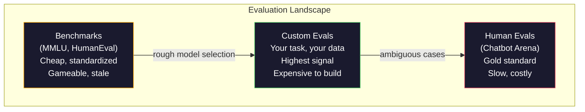
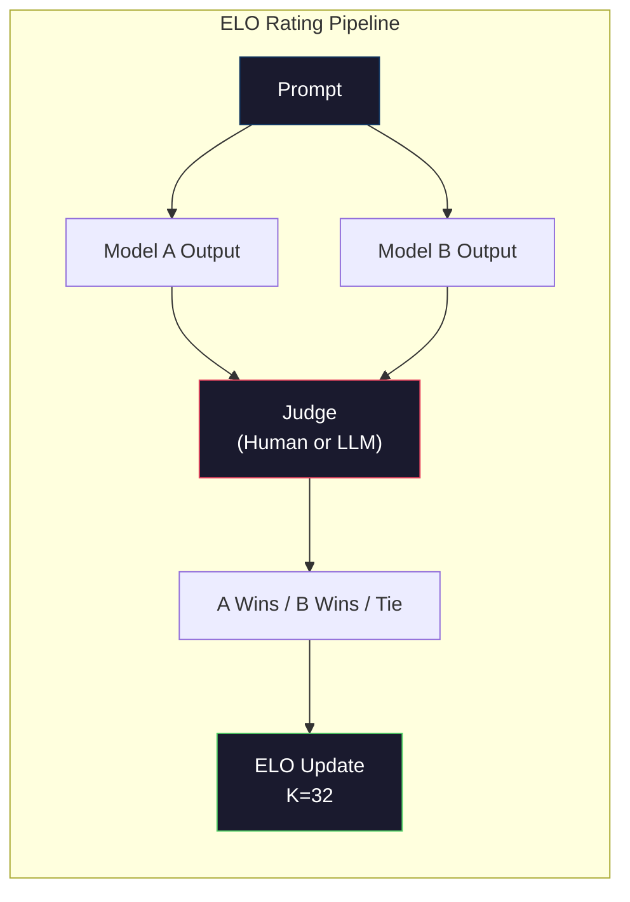

# Evaluation: Benchmarks, Evals, LM Harness

> Закон Гудхарта: когда мера становится целью, она перестает быть хорошей мерой. Каждая frontier lab играет в benchmarks. MMLU scores растут, пока модели все еще не могут надежно посчитать количество букв R в "strawberry." Единственная eval, которая имеет значение, -- ВАША eval: на ВАШЕЙ задаче, с ВАШИМИ данными.

**Тип:** Build
**Языки:** Python
**Предварительные требования:** Фаза 10, уроки 01-05 (LLMs from Scratch)
**Время:** ~90 минут

## Цели обучения

- Построить custom evaluation harness, который запускает multiple-choice и open-ended benchmarks против language model
- Объяснить, почему standard benchmarks (MMLU, HumanEval) saturate и перестают различать frontier models
- Реализовать task-specific evals с правильными metrics: exact match, F1, BLEU и LLM-as-judge scoring
- Спроектировать custom evaluation suite под ваш конкретный use case вместо опоры только на public leaderboards

## Проблема

MMLU был опубликован в 2020 году с 15 908 вопросами по 57 subjects. За три года frontier models его saturated. GPT-4 набрал 86.4%. Claude 3 Opus набрал 86.8%. Llama 3 405B набрал 88.6%. Leaderboard сжался в 3-point range, где различия -- statistical noise, а не реальные capability gaps.

Тем временем те же модели проваливают задачи, которые 10-летний ребенок решает не задумываясь. Claude 3.5 Sonnet, набравший 88.7% на MMLU, сначала не мог посчитать буквы в "strawberry" -- задачу, которая требует ноль world knowledge и ноль reasoning, только character-level iteration. HumanEval проверяет code generation на 164 problems. Модели получают 90%+ на нем, но все еще пишут код, который падает на edge cases, заметных любому junior developer.

Разрыв между benchmark performance и real-world reliability -- центральная проблема LLM evaluation. Benchmarks говорят, как модель работает на benchmark. Они почти ничего не говорят о том, как модель будет работать на вашей конкретной задаче, с вашими данными, при ваших failure modes. Если вы строите customer support bot, MMLU irrelevant. Если вы строите code assistant, HumanEval покрывает только function-level generation -- он ничего не говорит о debugging, refactoring или explaining code across files.

Вам нужны custom evals. Не потому, что benchmarks бесполезны -- они полезны для грубого model selection -- а потому, что финальная evaluation должна точно соответствовать deployment conditions.

## Концепция

### Eval Landscape

Есть три категории evaluation, каждая с разной стоимостью и signal quality.

**Benchmarks** -- стандартизированные test suites. MMLU, HumanEval, SWE-bench, MATH, ARC, HellaSwag. Вы запускаете модель против benchmark и получаете score. Преимущество: все используют один и тот же test, поэтому модели можно сравнивать. Недостаток: models и training data все чаще contaminate эти benchmarks. Labs обучаются на данных, включающих benchmark questions. Scores растут. Capability может не расти.

**Custom evals** -- test suites, которые вы строите для своего use case. Вы задаете inputs, expected outputs и scoring function. Legal document summarizer оценивается на legal documents. SQL generator оценивается на вашей database schema. Их дорого создавать, но это единственная evaluation, которая predicts production performance.

**Human evals** используют paid annotators для оценки model outputs по критериям helpfulness, correctness, fluency и safety. Это gold standard для open-ended tasks, где automated scoring fails. Chatbot Arena собрала более 2 million human preference votes across 100+ models. Минус: cost ($0.10-$2.00 per judgment) и speed (hours to days).



### Почему benchmarks ломаются

Три механизма заставляют benchmark scores перестать отражать real capability.

**Data contamination.** Training corpora scrape the internet. Benchmark questions живут в интернете. Models видят answers during training. Это не cheating в традиционном смысле -- labs не включают benchmark data намеренно. Но web-scale scraping делает исключение почти невозможным.

**Teaching to the test.** Labs оптимизируют training mixtures под benchmark performance. Если 5% training mix -- MMLU-style multiple choice, модель учит format и answer distribution. MMLU -- 4-way multiple choice. Models учат, что answer distribution примерно uniform across A/B/C/D, что помогает даже когда модель не знает ответ.

**Saturation.** Когда каждая frontier model набирает 85-90% на benchmark, benchmark перестает discriminating. Оставшиеся 10-15% questions могут быть ambiguous, mislabeled или требовать obscure domain knowledge. Улучшение с 87% до 89% на MMLU может означать, что модель memorized еще два obscure questions, а не стала умнее.

### Perplexity: быстрый health check

Perplexity измеряет, насколько модель удивлена последовательностью tokens. Формально это exponentiated average negative log-likelihood:

```
PPL = exp(-1/N * sum(log P(token_i | context)))
```

Perplexity 10 означает, что модель в среднем столь же uncertain, как при равномерном выборе из 10 options на каждой token position. Ниже -- лучше. GPT-2 получает perplexity ~30 на WikiText-103. GPT-3 получает ~20. Llama 3 8B получает ~7.

Perplexity полезна для сравнения моделей на одном test set, но у нее есть blind spots. Модель может иметь low perplexity, хорошо предсказывая common patterns, но быть ужасной на rare but important patterns. Она также ничего не говорит об instruction following, reasoning или factual accuracy. Используйте ее как sanity check, а не final verdict.

### LLM-as-Judge

Используйте сильную модель для evaluation output слабой модели. Идея проста: попросите GPT-4o или Claude Sonnet оценить response по шкале 1-5 за correctness, helpfulness и safety. Это стоит около $0.01 per judgment с GPT-4o-mini и surprisingly well correlates with human judgments -- около 80% agreement on most tasks.

Scoring prompt важнее модели. Расплывчатый prompt ("Rate this response") дает noisy scores. Structured prompt with rubric ("Score 5 if the answer is factually correct and cites a source, 4 if correct but unsourced, 3 if partially correct...") дает consistent, reproducible scores.

Failure modes: judge models проявляют position bias (предпочитают первый response в pairwise comparisons), verbosity bias (предпочитают longer responses) и self-preference (GPT-4 оценивает GPT-4 outputs выше, чем equivalent Claude outputs). Mitigations: randomize order, normalize for length, use a different judge than the model being evaluated.

### ELO Ratings from Pairwise Comparisons

Подход Chatbot Arena. Покажите два responses на один prompt от разных models. Human (или LLM judge) выбирает лучший. Из тысяч сравнений вычислите ELO rating для каждой модели -- ту же систему используют в chess.

Преимущества ELO: relative ranking надежнее absolute scoring, gracefully handles ties и converges с меньшим числом comparisons, чем независимая scoring каждого output. По состоянию на начало 2026 года rankings Chatbot Arena показывают GPT-4o, Claude 3.5 Sonnet и Gemini 1.5 Pro within 20 ELO points of each other at the top.



### Eval Frameworks

**lm-evaluation-harness** (EleutherAI): стандартный open-source eval framework. Поддерживает 200+ benchmarks. Запускает любую Hugging Face model против MMLU, HellaSwag, ARC и т.д. одной командой. Используется Open LLM Leaderboard.

**RAGAS**: evaluation framework специально для RAG pipelines. Измеряет faithfulness (соответствует ли ответ retrieved context?), relevance (релевантен ли retrieved context вопросу?) и answer correctness.

**promptfoo**: config-driven eval для prompt engineering. Define test cases in YAML, run against multiple models, get a pass/fail report. Полезен для regression testing prompts -- убедиться, что prompt change не ломает existing test cases.

### Building Custom Evals

Единственная eval, которая важна для production. Процесс:

1. **Define the task.** Что именно должна делать модель? Будьте точны. "Answer questions" слишком vague. "Given a customer complaint email, extract the product name, issue category, and sentiment" -- задача, которую можно evaluate.

2. **Create test cases.** Минимум 50 для prototype eval, 200+ для production. Каждый test case -- пара (input, expected_output). Включите edge cases: empty inputs, adversarial inputs, ambiguous inputs, inputs in other languages.

3. **Define scoring.** Exact match для structured outputs. BLEU/ROUGE для text similarity. LLM-as-judge для open-ended quality. F1 для extraction tasks. Combine multiple metrics with weights.

4. **Automate.** Каждая eval запускается одной командой. Без ручных шагов. Храните results в формате, который позволяет сравнивать их во времени.

5. **Track over time.** Eval score бессмысленен в isolation. Нужен trendline. Score вырос после последнего изменения prompt? Упал после смены models? Версионируйте eval вместе с prompts.

| Eval Type | Cost per judgment | Agreement with humans | Best for |
|-----------|------------------|----------------------|----------|
| Exact match | ~$0 | 100% (when applicable) | Structured output, classification |
| BLEU/ROUGE | ~$0 | ~60% | Translation, summarization |
| LLM-as-judge | ~$0.01 | ~80% | Open-ended generation |
| Human eval | $0.10-$2.00 | N/A (is the ground truth) | Ambiguous, high-stakes tasks |

## Build It

### Step 1: A Minimal Eval Framework

Определите core abstractions. Eval case имеет input, expected output и optional metadata dict. Scorer принимает prediction и reference и возвращает score between 0 and 1.

```python
import json
from collections import Counter

class EvalCase:
    def __init__(self, input_text, expected, metadata=None):
        self.input_text = input_text
        self.expected = expected
        self.metadata = metadata or {}

class EvalSuite:
    def __init__(self, name, cases, scorers):
        self.name = name
        self.cases = cases
        self.scorers = scorers

    def run(self, model_fn):
        results = []
        for case in self.cases:
            prediction = model_fn(case.input_text)
            scores = {}
            for scorer_name, scorer_fn in self.scorers.items():
                scores[scorer_name] = scorer_fn(prediction, case.expected)
            results.append({
                "input": case.input_text,
                "expected": case.expected,
                "prediction": prediction,
                "scores": scores,
            })
        return results
```

### Step 2: Scoring Functions

Постройте exact match, token F1 и simulated LLM-as-judge scorer.

```python
def exact_match(prediction, expected):
    return 1.0 if prediction.strip().lower() == expected.strip().lower() else 0.0

def token_f1(prediction, expected):
    pred_tokens = set(prediction.lower().split())
    exp_tokens = set(expected.lower().split())
    if not pred_tokens or not exp_tokens:
        return 0.0
    common = pred_tokens & exp_tokens
    precision = len(common) / len(pred_tokens)
    recall = len(common) / len(exp_tokens)
    if precision + recall == 0:
        return 0.0
    return 2 * (precision * recall) / (precision + recall)

def llm_judge_simulated(prediction, expected):
    pred_words = set(prediction.lower().split())
    exp_words = set(expected.lower().split())
    if not exp_words:
        return 0.0
    overlap = len(pred_words & exp_words) / len(exp_words)
    length_penalty = min(1.0, len(prediction) / max(len(expected), 1))
    return round(overlap * 0.7 + length_penalty * 0.3, 3)
```

### Step 3: ELO Rating System

Реализуйте pairwise comparisons with ELO updates. Это ровно та система, которую Chatbot Arena использует для ranking models.

```python
class ELOTracker:
    def __init__(self, k=32, initial_rating=1500):
        self.ratings = {}
        self.k = k
        self.initial_rating = initial_rating
        self.history = []

    def _ensure_player(self, name):
        if name not in self.ratings:
            self.ratings[name] = self.initial_rating

    def expected_score(self, rating_a, rating_b):
        return 1 / (1 + 10 ** ((rating_b - rating_a) / 400))

    def record_match(self, player_a, player_b, outcome):
        self._ensure_player(player_a)
        self._ensure_player(player_b)

        ea = self.expected_score(self.ratings[player_a], self.ratings[player_b])
        eb = 1 - ea

        if outcome == "a":
            sa, sb = 1.0, 0.0
        elif outcome == "b":
            sa, sb = 0.0, 1.0
        else:
            sa, sb = 0.5, 0.5

        self.ratings[player_a] += self.k * (sa - ea)
        self.ratings[player_b] += self.k * (sb - eb)

        self.history.append({
            "a": player_a, "b": player_b,
            "outcome": outcome,
            "rating_a": round(self.ratings[player_a], 1),
            "rating_b": round(self.ratings[player_b], 1),
        })

    def leaderboard(self):
        return sorted(self.ratings.items(), key=lambda x: -x[1])
```

### Step 4: Perplexity Calculation

Вычислите perplexity по token probabilities. На практике вы получите их из logits модели. Здесь мы симулируем probability distribution.

```python
import numpy as np

def perplexity(log_probs):
    if not log_probs:
        return float("inf")
    avg_neg_log_prob = -np.mean(log_probs)
    return float(np.exp(avg_neg_log_prob))

def token_log_probs_simulated(text, model_quality=0.8):
    np.random.seed(hash(text) % 2**31)
    tokens = text.split()
    log_probs = []
    for i, token in enumerate(tokens):
        base_prob = model_quality
        if len(token) > 8:
            base_prob *= 0.6
        if i == 0:
            base_prob *= 0.7
        prob = np.clip(base_prob + np.random.normal(0, 0.1), 0.01, 0.99)
        log_probs.append(float(np.log(prob)))
    return log_probs
```

### Step 5: Aggregate Results

Вычислите summary statistics по eval run: mean, median, pass rate at a threshold и per-metric breakdowns.

```python
def summarize_results(results, threshold=0.8):
    all_scores = {}
    for r in results:
        for metric, score in r["scores"].items():
            all_scores.setdefault(metric, []).append(score)

    summary = {}
    for metric, scores in all_scores.items():
        arr = np.array(scores)
        summary[metric] = {
            "mean": round(float(np.mean(arr)), 3),
            "median": round(float(np.median(arr)), 3),
            "std": round(float(np.std(arr)), 3),
            "min": round(float(np.min(arr)), 3),
            "max": round(float(np.max(arr)), 3),
            "pass_rate": round(float(np.mean(arr >= threshold)), 3),
            "n": len(scores),
        }
    return summary

def print_summary(summary, suite_name="Eval"):
    print(f"\n{'=' * 60}")
    print(f"  {suite_name} Summary")
    print(f"{'=' * 60}")
    for metric, stats in summary.items():
        print(f"\n  {metric}:")
        print(f"    Mean:      {stats['mean']:.3f}")
        print(f"    Median:    {stats['median']:.3f}")
        print(f"    Std:       {stats['std']:.3f}")
        print(f"    Range:     [{stats['min']:.3f}, {stats['max']:.3f}]")
        print(f"    Pass rate: {stats['pass_rate']:.1%} (threshold >= 0.8)")
        print(f"    N:         {stats['n']}")
```

### Step 6: Run the Full Pipeline

Свяжите все вместе. Define a task, create test cases, simulate two models, run evals, compute ELO from pairwise comparisons и print the leaderboard.

```python
def demo_model_good(prompt):
    responses = {
        "What is the capital of France?": "Paris",
        "What is 2 + 2?": "4",
        "Who wrote Hamlet?": "William Shakespeare",
        "What language is PyTorch written in?": "Python and C++",
        "What is the boiling point of water?": "100 degrees Celsius",
    }
    return responses.get(prompt, "I don't know")

def demo_model_bad(prompt):
    responses = {
        "What is the capital of France?": "Paris is the capital city of France",
        "What is 2 + 2?": "The answer is four",
        "Who wrote Hamlet?": "Shakespeare",
        "What language is PyTorch written in?": "Python",
        "What is the boiling point of water?": "212 Fahrenheit",
    }
    return responses.get(prompt, "Unknown")

cases = [
    EvalCase("What is the capital of France?", "Paris"),
    EvalCase("What is 2 + 2?", "4"),
    EvalCase("Who wrote Hamlet?", "William Shakespeare"),
    EvalCase("What language is PyTorch written in?", "Python and C++"),
    EvalCase("What is the boiling point of water?", "100 degrees Celsius"),
]

suite = EvalSuite(
    name="General Knowledge",
    cases=cases,
    scorers={
        "exact_match": exact_match,
        "token_f1": token_f1,
        "llm_judge": llm_judge_simulated,
    },
)

results_good = suite.run(demo_model_good)
results_bad = suite.run(demo_model_bad)

print_summary(summarize_results(results_good), "Model A (concise)")
print_summary(summarize_results(results_bad), "Model B (verbose)")
```

"Good" model дает exact answers. "Bad" model дает verbose paraphrases. Exact match сильно наказывает verbose model. Token F1 и LLM-as-judge более forgiving. Это показывает, почему metric choice matters: одна и та же model выглядит great или terrible в зависимости от scoring.

### Step 7: ELO Tournament

Запустите pairwise comparisons между models across multiple rounds.

```python
elo = ELOTracker(k=32)

for case in cases:
    pred_a = demo_model_good(case.input_text)
    pred_b = demo_model_bad(case.input_text)

    score_a = token_f1(pred_a, case.expected)
    score_b = token_f1(pred_b, case.expected)

    if score_a > score_b:
        outcome = "a"
    elif score_b > score_a:
        outcome = "b"
    else:
        outcome = "tie"

    elo.record_match("model_a_concise", "model_b_verbose", outcome)

print("\nELO Leaderboard:")
for name, rating in elo.leaderboard():
    print(f"  {name}: {rating:.0f}")
```

### Step 8: Perplexity Comparison

Сравните perplexity across "models" of different quality levels.

```python
test_text = "The quick brown fox jumps over the lazy dog in the garden"

for quality, label in [(0.9, "Strong model"), (0.7, "Medium model"), (0.4, "Weak model")]:
    log_probs = token_log_probs_simulated(test_text, model_quality=quality)
    ppl = perplexity(log_probs)
    print(f"  {label} (quality={quality}): perplexity = {ppl:.2f}")
```

## Use It

### lm-evaluation-harness (EleutherAI)

Стандартный tool для запуска benchmarks на любой model.

```python
# pip install lm-eval
# Command line:
# lm_eval --model hf --model_args pretrained=meta-llama/Llama-3.1-8B --tasks mmlu --batch_size 8

# Python API:
# import lm_eval
# results = lm_eval.simple_evaluate(
#     model="hf",
#     model_args="pretrained=meta-llama/Llama-3.1-8B",
#     tasks=["mmlu", "hellaswag", "arc_easy"],
#     batch_size=8,
# )
# print(results["results"])
```

### promptfoo

Config-driven eval для prompt engineering. Define tests in YAML and run against multiple providers.

```yaml
# promptfoo.yaml
providers:
  - openai:gpt-4o-mini
  - anthropic:claude-3-haiku

prompts:
  - "Answer in one word: {{question}}"

tests:
  - vars:
      question: "What is the capital of France?"
    assert:
      - type: contains
        value: "Paris"
  - vars:
      question: "What is 2 + 2?"
    assert:
      - type: equals
        value: "4"
```

### RAGAS for RAG evaluation

```python
# pip install ragas
# from ragas import evaluate
# from ragas.metrics import faithfulness, answer_relevancy, context_precision
#
# result = evaluate(
#     dataset,
#     metrics=[faithfulness, answer_relevancy, context_precision],
# )
# print(result)
```

RAGAS измеряет то, что generic evals пропускают: grounded ли ответ модели в retrieved context, а не просто "correct" ли answer in the abstract.

## Ship It

Этот урок создает `outputs/prompt-eval-designer.md` -- reusable prompt, который проектирует custom eval suites для любой задачи. Дайте ему task description, и он сгенерирует test cases, scoring functions и recommendation для pass/fail threshold.

Он также создает `outputs/skill-evaluation.md` -- decision framework для выбора правильной evaluation strategy с учетом task type, budget и latency requirements.

## Exercises

1. Добавьте "consistency" scorer, который прогоняет один и тот же input через model 5 раз и измеряет, как часто outputs совпадают. Inconsistent answers on deterministic inputs выявляют fragile prompts или high temperature settings.

2. Расширьте ELO tracker для поддержки multiple judge functions (exact match, F1, LLM-as-judge) и weight them. Сравните, как меняется leaderboard, когда exact match weighted heavily versus F1 heavily.

3. Постройте eval suite для конкретной задачи: email classification into 5 categories. Создайте 100 test cases с diverse examples including edge cases (emails that could belong to multiple categories, empty emails, emails in other languages). Измерьте, как разные "models" (rule-based, keyword matching, simulated LLM) perform.

4. Реализуйте contamination detection: given a set of eval questions and a training corpus, check what percentage of eval questions (or close paraphrases) appear in the training data. Так researchers audit benchmark validity.

5. Постройте "model diff" tool. Имея eval results from two model versions, highlight which specific test cases improved, which regressed, and which stayed the same. Это eval equivalent of a code diff -- essential for understanding whether a change helped or hurt.

## Key Terms

| Term | What people say | What it actually means |
|------|----------------|----------------------|
| MMLU | "The benchmark" | Massive Multitask Language Understanding -- 15,908 multiple choice questions across 57 subjects, saturated above 88% by 2025 |
| HumanEval | "Code eval" | 164 Python function-completion problems from OpenAI, tests only isolated function generation |
| SWE-bench | "Real coding eval" | 2,294 GitHub issues from 12 Python repos, measures end-to-end bug fixing including test generation |
| Perplexity | "How confused the model is" | exp(-avg(log P(token_i given context))) -- lower means the model assigns higher probability to the actual tokens |
| ELO rating | "Chess ranking for models" | Relative skill rating, computed from pairwise win/loss records, used by Chatbot Arena to rank 100+ models |
| LLM-as-judge | "Using AI to grade AI" | Strong model scores weaker model outputs against a rubric, ~80% agreement with human judges at ~$0.01/judgment |
| Data contamination | "The model saw the test" | Training data includes benchmark questions, inflating scores without improving real capability |
| Eval suite | "A bunch of tests" | Versioned collection of (input, expected_output, scorer) triples that measure a specific capability |
| Pass rate | "What percentage it gets right" | Fraction of eval cases scoring above a threshold -- more actionable than mean score because it measures reliability |
| Chatbot Arena | "Model ranking website" | LMSYS platform with 2M+ human preference votes, producing the most trusted LLM leaderboard via ELO ratings |

## Further Reading

- [Hendrycks et al., 2021 -- "Measuring Massive Multitask Language Understanding"](https://arxiv.org/abs/2009.03300) -- статья MMLU, все еще самый цитируемый LLM benchmark несмотря на saturation
- [Chen et al., 2021 -- "Evaluating Large Language Models Trained on Code"](https://arxiv.org/abs/2107.03374) -- статья HumanEval от OpenAI, established code generation evaluation methodology
- [Zheng et al., 2023 -- "Judging LLM-as-a-Judge"](https://arxiv.org/abs/2306.05685) -- systematic analysis использования LLMs для evaluation LLMs, включая findings по position bias и verbosity bias
- [LMSYS Chatbot Arena](https://chat.lmsys.org/) -- crowdsourced model comparison platform with 2M+ votes, самый trusted real-world LLM ranking
