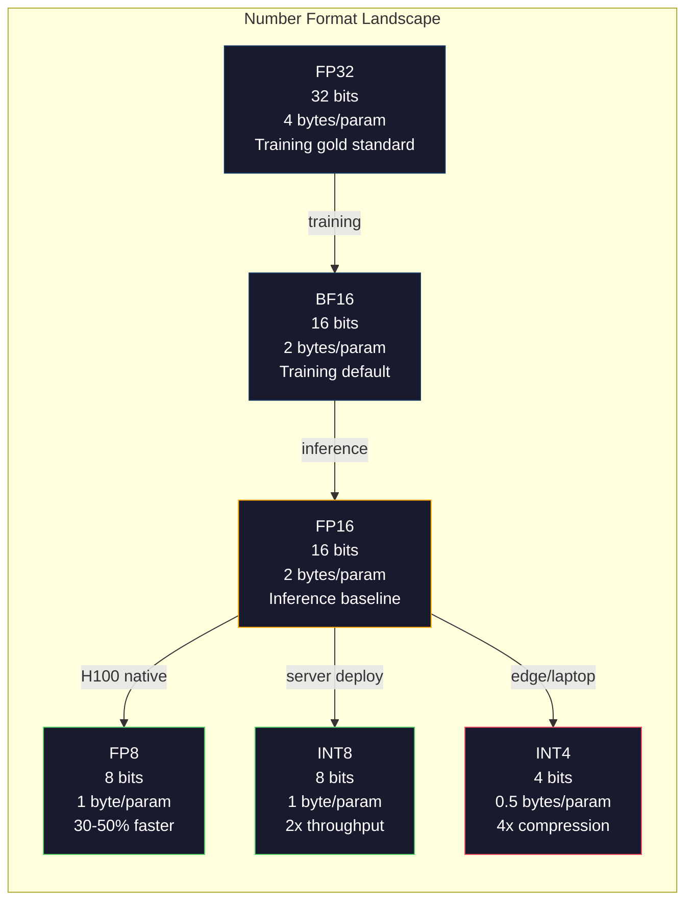
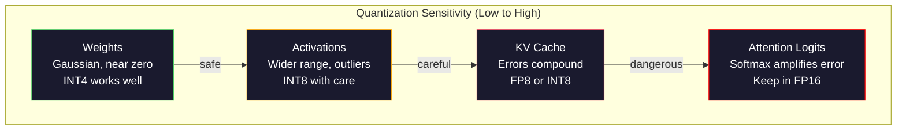
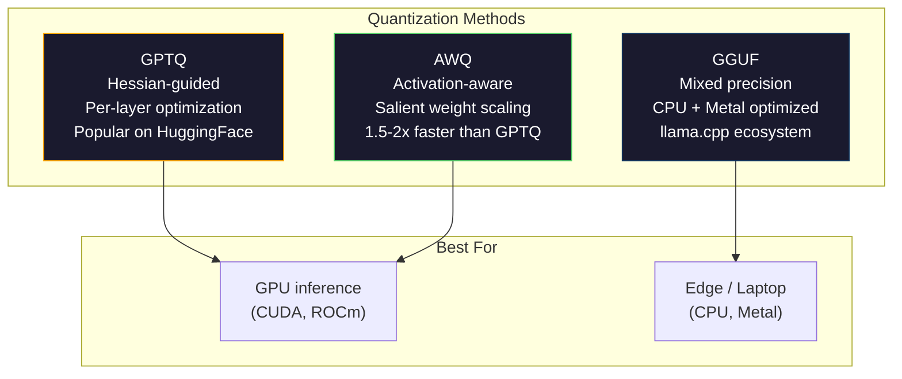

# Квантизация: как уместить модель в память

> Модель на 70B параметров в FP16 требует 140GB. Две A100 только под веса. Квантуем до FP8: одна GPU с 80GB. INT4: MacBook.

**Тип:** Build
**Языки:** Python (with numpy)
**Предварительные требования:** Phase 10, Lessons 01-10 (LLMs from Scratch)
**Время:** ~120 minutes

## Цели обучения

- Реализовать симметричную и асимметричную квантизацию из FP16 в INT8 и INT4, включая per-tensor и per-channel scaling
- Посчитать экономию памяти от квантизации и определить, какая точность помещается в VRAM заданной GPU
- Объяснить разницу между post-training quantization (PTQ) и quantization-aware training (QAT)
- Применить GPTQ или AWQ для квантизации реальной модели и измерить компромисс между точностью (accuracy) и памятью на бенчмарке

## Проблема

Llama 3 70B содержит 70 миллиардов параметров. Каждый параметр — 16-битное число с плавающей точкой. Это 140 миллиардов байт. 140GB. У одной A100 есть 80GB VRAM. На одну GPU вы не сможете даже загрузить веса, не говоря уже об inference. Нужны две A100 по $2/hour каждая просто для обслуживания одной модели.

Но 16 бит на параметр — это расточительно. Большинство весов в нейросети сгруппированы около нуля. Полный динамический диапазон FP16 (от 0.000000059 до 65,504) почти не используется. Если измерить фактическое распределение весов в Llama 3 70B, 95% из них попадут в диапазон от -0.1 до +0.1. Вы тратите 16 бит на представление значений, которые могли бы поместиться в 4.

Квантизация заменяет числа высокой точности числами более низкой точности. Переход с FP16 на FP8 уменьшает память вдвое. Переход с FP16 на INT4 уменьшает ее до четверти. Модель на 140GB превращается в модель на 35GB. Она помещается на одну потребительскую GPU. Если дойти до 2-bit quantization (агрессивной, с потерями, но пригодной для некоторых задач), та же модель запускается на ноутбуке с 16GB.

Цена — точность (accuracy). Каждый удаленный бит уничтожает часть информации. Вопрос в том, сколько точности вы теряете и где именно. Хорошо квантизованная INT4-модель сохраняет 95-99% качества оригинала на большинстве бенчмарков. Наивная квантизация в INT4 может полностью сломать модель. Разница в методе.

Квантизованные сообществом версии Llama 3 в INT4 с GPTQ показывают потерю примерно 1-2 пунктов perplexity на WikiText. Mistral выпустила FP8 checkpoints для Mixtral 8x22B без измеримой потери качества на MMLU. Формат GGUF лежит в основе llama.cpp и позволяет запускать 70B-модели на MacBook с чипами M-series. Квантизация — не трюк. Это стандартный путь deployment для любой модели крупнее 7B.

## Концепция

### Number Formats: что делает каждый бит

У каждого floating-point числа есть три части: знак, экспонента и мантисса (также significand). Знак занимает один бит. Экспонента задает диапазон (насколько большим или малым может быть число). Мантисса задает точность (сколько десятичных знаков вы получаете).

```
FP32:  [1 sign] [8 exponent] [23 mantissa]  = 32 bits
FP16:  [1 sign] [5 exponent] [10 mantissa]  = 16 bits
BF16:  [1 sign] [8 exponent] [7  mantissa]  = 16 bits
FP8:   [1 sign] [4 exponent] [3  mantissa]  = 8  bits (E4M3)
FP8:   [1 sign] [5 exponent] [2  mantissa]  = 8  bits (E5M2)
INT8:  [1 sign] [7 value]                   = 8  bits (uniform steps)
INT4:  [1 sign] [3 value]                   = 4  bits (16 levels total)
```

**FP32** — полная точность. 23 бита мантиссы дают около 7 десятичных цифр точности. Диапазон: примерно от 1.2 x 10^-38 до 3.4 x 10^38. Раньше обучение выполняли почти исключительно в FP32. FP32 по-прежнему используют для accumulation (накопительных сумм при matrix multiplication).

**FP16** уменьшает число битов вдвое. 10 битов мантиссы дают около 3.3 десятичных цифр. Экспонента сокращается до 5 битов, из-за чего диапазон резко уменьшается (максимальное значение ~65,504). Для весов это нормально (они сгруппированы около нуля), но для activations и gradients, которые могут резко возрастать во время training, это опасно. FP16 training требует loss scaling, чтобы предотвратить underflow.

**BF16** (Brain Float 16) сохраняет 8-битную экспоненту из FP32, но сокращает мантиссу до 7 битов. Диапазон такой же, как у FP32, точность ниже, чем у FP16. Google спроектировала этот формат специально для deep learning. Интуиция такая: для нейросетей диапазон важнее точности. Градиент 10^-20, который в FP16 превращается в ноль из-за underflow, в BF16 выживает. Вес 0.07342, округленный в BF16 до 0.0734, достаточно близок. Каждый современный training run использует BF16 или смесь BF16/FP32.

**FP8** бывает в двух вариантах. E4M3 (4 бита экспоненты, 3 бита мантиссы) используется для weights и activations во время inference. E5M2 (5 битов экспоненты, 2 бита мантиссы) используется для gradients во время training, где диапазон важнее точности. FP8 inference на H100 GPU дает ускорение на 30-50% относительно FP16 при пренебрежимо малой потере качества.

**INT8** — целочисленный формат. Нет экспоненты, нет мантиссы. Только 256 равномерно расположенных значений от -128 до 127. Нужен scale factor, чтобы отобразить floating-point веса в этот диапазон. Преимущество: integer arithmetic быстрее и энергоэффективнее floating-point. INT8 matrix multiplication на A100 работает на 624 TOPS против 312 TFLOPS для FP16.

**INT4** идет дальше. Всего 16 возможных значений. Основную работу выполняет scale factor. Качество полностью зависит от того, как выбран scale и какие веса квантизируются. Современные INT4-методы (GPTQ, AWQ) сохраняют 95%+ качества исходной модели.



### Как работает квантизация

Базовая операция проста. Берем тензор floating-point значений, находим scale factor, умножаем, округляем до ближайшего целого и сохраняем целые числа вместе со scale factor.

**Quantize:**

```
scale = max(abs(tensor)) / max_int_value
quantized = round(tensor / scale)
```

**Dequantize:**

```
reconstructed = quantized * scale
```

Для INT8 с симметричным диапазоном (-127 to 127):

```
scale = max(abs(tensor)) / 127
quantized = clamp(round(tensor / scale), -128, 127)
```

Ошибка — это ошибка округления. Каждое значение может отклониться максимум на `scale / 2`. Суммарная ошибка по слою зависит от числа весов и от того, насколько модель чувствительна к возмущениям в этих весах.

**Per-tensor vs per-channel quantization.** Per-tensor использует один scale factor для всей матрицы весов. Это просто, но приводит к потерям: если в одном столбце значения большие, а в другом маленькие, маленькие значения теряют большую часть точности. Per-channel использует один scale factor на каждый output channel (на строку или столбец матрицы весов). Overhead выше (вы храните N scale factors вместо 1), но качество значительно лучше. Любой production-метод квантизации использует per-channel или еще более мелкую гранулярность.

**Asymmetric quantization** добавляет смещение zero-point: `quantized = round(tensor / scale) + zero_point`. Это помогает для распределений, которые не центрированы в нуле. ReLU activations, например, всегда неотрицательны. Symmetric quantization тратит половину integer range на отрицательные значения, которые никогда не появляются. Asymmetric quantization отображает фактический диапазон [min, max] на полный integer range.

### Иерархия чувствительности

Не все части модели одинаково хорошо переносят квантизацию. Есть четкая иерархия.

**Weights (самые устойчивые).** Веса модели медленно меняются во время training и имеют примерно Gaussian distribution с центром около нуля. Они хорошо квантизируются. INT8 weights с per-channel scales дают почти lossless результат. INT4 требует более сложных методов, но работает.

**Activations (средняя чувствительность).** Activations — это промежуточные значения, проходящие через сеть во время inference. У них шире dynamic range, чем у весов, и они содержат outliers. Одна attention head может выдавать activation values в 100 раз больше среднего. Эти outliers критически важны для качества модели. Наивная квантизация уничтожает информацию. Решения: хранить outlier channels в более высокой точности (LLM.int8()), использовать per-token или per-channel activation scales.

**KV cache (высокая чувствительность).** Key-value cache хранит attention states для всех предыдущих токенов. При длинном context length именно KV cache начинает доминировать по памяти. Для 70B-модели при 32K context один только KV cache занимает 40GB в FP16. Квантизация KV cache до FP8 или INT8 экономит огромный объем памяти, но любая ошибка накапливается во всех будущих attention computations. Влияние на качество растет с длиной последовательности.

**Attention logits (самые чувствительные).** Softmax в attention очень чувствителен к малым изменениям входов. Quantization error 0.01 в pre-softmax logit может заметно сдвинуть attention distribution. Большинство схем квантизации оставляют attention computation в более высокой точности (FP16 или BF16), даже когда все остальное квантизировано.



### PTQ vs QAT

**Post-Training Quantization (PTQ)** квантизирует уже обученную модель. Без дообучения. Вы берете FP16 weights, вычисляете scale factors, округляете и deploy. Это быстро (от минут до часов) и дешево. Хорошо работает для INT8 и FP8. Для INT4 наивный PTQ часто сильно проваливается, потому что ошибки округления накапливаются. Продвинутые PTQ-методы (GPTQ, AWQ) используют calibration data, чтобы минимизировать quantization error.

**Quantization-Aware Training (QAT)** вставляет fake quantization operations в forward pass во время training. Модель учится располагать веса так, чтобы rounding errors были малы. Градиенты проходят через fake quantization с помощью straight-through estimator (STE): считаем, что операция округления имеет gradient 1. QAT дает лучшие INT4 и INT2 модели, чем PTQ, но требует полного training run. Google использовала QAT для эффективного serving Gemini. Meta использовала QAT для некоторых deployment targets Llama.

| Aspect | PTQ | QAT |
|--------|-----|-----|
| Стоимость | Минуты или часы | Полный training run |
| Качество на INT8 | Отличное (< 0.1% потерь) | Отличное |
| Качество на INT4 | Хорошее с GPTQ/AWQ (1-3% потерь) | Лучше (< 1% потерь) |
| Качество на INT2 | Плохое | Пригодно для некоторых задач |
| Calibration data | 128-1024 примеров | Полный training dataset |
| Когда использовать | Deployment, iteration | Максимальное качество при малой bit-width |

### GPTQ, AWQ, GGUF

**GPTQ (GPT Quantization)** — one-shot PTQ метод. Он квантизирует веса по одному слою, используя небольшой calibration dataset (типично 128 примеров), чтобы оценить Hessian (second-order information о том, насколько output чувствителен к каждому весу). Веса, которые Hessian считает важными, квантизируются аккуратнее. GPTQ стал первым методом, который сделал INT4 quantization практичной для LLMs. TheBloke на Hugging Face популяризировал GPTQ, выпустив квантизованные версии сотен моделей.

**AWQ (Activation-Aware Weight Quantization)** опирается на наблюдение, что небольшая доля весов (около 1%) непропорционально важна, потому что умножается на большие activation values. AWQ находит эти salient weights с помощью calibration data и масштабирует их вверх перед квантизацией (а соответствующие activations масштабирует вниз). Так важные веса остаются в диапазоне, где INT4 quantization точна. Обычно AWQ соответствует GPTQ по качеству или немного превосходит его, при этом применяется в 1.5-2 раза быстрее.

**GGUF (GPT-Generated Unified Format)** — формат файлов, используемый llama.cpp и его экосистемой. Он поддерживает mixed quantization: разные слои получают разную bit width. Первый и последний слои (embedding и output head) обычно оставляют в более высокой точности. Средние слои получают INT4 или INT3. GGUF files самодостаточны: weights, tokenizer и metadata находятся в одном файле. Формат спроектирован для CPU inference и Apple Silicon, где стандартный путь — загрузить всю модель в память и выполнять matrix multiplications на CPU или Metal GPU. Q4_K_M — самый популярный вариант GGUF quantization, балансирующий качество и размер.



### Измерение качества

Как понять, что квантизованная модель все еще хороша?

**Perplexity.** Самая распространенная метрика. Чем ниже, тем лучше. Посчитайте perplexity на held-out dataset (WikiText-2 — стандарт) для исходной и квантизованной модели. Delta показывает, сколько информации уничтожила квантизация. Практические ориентиры: delta < 0.5 — отлично, 0.5-1.0 — хорошо, 1.0-2.0 — приемлемо для большинства задач, > 2.0 означает, что что-то пошло не так.

**Task-specific benchmarks.** Запустите квантизованную модель на MMLU, HumanEval, GSM8K или вашем custom eval suite. Сравните с оригиналом. Квантизация влияет на разные способности неравномерно. Math и code tasks чувствительнее к потере точности, чем general knowledge.

**Output comparison.** Сгенерируйте ответы обеих моделей на одни и те же prompts и сравните. LLM-as-judge (Lesson 10) хорошо подходит для этого. Посчитайте win rate: на какой доле prompts квантизованная модель совпадает с оригиналом или превосходит его?

**Latency and throughput.** Квантизация нужна, чтобы сделать модели быстрее и дешевле. Измеряйте tokens per second, time to first token и memory usage. Квантизованная модель, которая медленнее оригинала, не имеет практического смысла.

| Model | Format | Size | Perplexity (WikiText-2) | MMLU | Tokens/sec (A100) |
|-------|--------|------|------------------------|------|-------------------|
| Llama 3 70B | FP16 | 140GB | 3.12 | 79.5% | 38 |
| Llama 3 70B | FP8 | 70GB | 3.14 | 79.3% | 55 |
| Llama 3 70B | GPTQ INT4 | 35GB | 4.32 | 77.8% | 72 |
| Llama 3 70B | AWQ INT4 | 35GB | 4.18 | 78.1% | 75 |
| Llama 3 70B | GGUF Q4_K_M | 40GB | 4.25 | 77.9% | 28 (CPU) |

Закономерность такая: FP8 почти бесплатен. INT4 стоит 1-2 пункта MMLU, но удваивает throughput и уменьшает memory в четыре раза. Этот компромисс оправдан почти для любого deployment.

### Реальные числа

FP16 to FP8 on H100: ускорение inference на 30-50%, потеря качества < 0.1%. Это очевидно выгодная квантизация. Любой H100 deployment должен ее использовать.

FP16 to INT8 (LLM.int8()): уменьшение memory в 2 раза, потеря качества < 0.5%. Mixed-precision подход сохраняет outlier features в FP16, а все остальное квантизирует до INT8.

FP16 to INT4 (GPTQ/AWQ): уменьшение memory в 4 раза, потеря качества 1-3% в зависимости от модели и метода. Позволяет запускать 70B-модели на одной GPU с 48GB.

FP16 to INT4 (GGUF Q4_K_M): уменьшение memory в 3.5 раза, потеря качества 1-2%. Оптимизировано для CPU inference. 70B-модель в Q4_K_M занимает около 40GB и работает на скорости 10-15 tokens/second на M3 Max с 64GB.

FP16 to INT2: уменьшение memory в 8 раз, потеря качества 5-15%. Жизнеспособно только для узких специфических задач, где допустима деградация. Это research frontier, а не production-ready решение общего назначения.

## Build It

### Step 1: Number Format Representations

Постройте bit-level representation каждого формата, чтобы увидеть, что именно делают sign, exponent и mantissa.

```python
import numpy as np


def float_to_fp32_bits(value):
    bits = np.float32(value).view(np.uint32)
    sign = (bits >> 31) & 1
    exponent = (bits >> 23) & 0xFF
    mantissa = bits & 0x7FFFFF
    return {"sign": int(sign), "exponent": int(exponent), "mantissa": int(mantissa),
            "exponent_bits": format(int(exponent), '08b'),
            "mantissa_bits": format(int(mantissa), '023b'),
            "value": float(value),
            "actual_exponent": int(exponent) - 127}


def float_to_fp16_bits(value):
    fp16 = np.float16(value)
    bits = fp16.view(np.uint16)
    sign = (bits >> 15) & 1
    exponent = (bits >> 10) & 0x1F
    mantissa = bits & 0x3FF
    return {"sign": int(sign), "exponent": int(exponent), "mantissa": int(mantissa),
            "exponent_bits": format(int(exponent), '05b'),
            "mantissa_bits": format(int(mantissa), '010b'),
            "value": float(fp16),
            "actual_exponent": int(exponent) - 15}


def float_to_bf16_bits(value):
    fp32_bits = np.float32(value).view(np.uint32)
    bf16_bits = (fp32_bits >> 16).astype(np.uint16)
    sign = (bf16_bits >> 15) & 1
    exponent = (bf16_bits >> 7) & 0xFF
    mantissa = bf16_bits & 0x7F
    reconstructed = np.uint32(bf16_bits.astype(np.uint32) << 16).view(np.float32)
    return {"sign": int(sign), "exponent": int(exponent), "mantissa": int(mantissa),
            "exponent_bits": format(int(exponent), '08b'),
            "mantissa_bits": format(int(mantissa), '07b'),
            "value": float(reconstructed),
            "actual_exponent": int(exponent) - 127}


def simulate_fp8_e4m3(value):
    sign = 1 if value < 0 else 0
    abs_val = abs(value)
    max_val = 448.0
    abs_val = min(abs_val, max_val)
    if abs_val == 0:
        return {"sign": sign, "exponent": 0, "mantissa": 0, "value": 0.0,
                "exponent_bits": "0000", "mantissa_bits": "000"}
    exp = int(np.floor(np.log2(abs_val)))
    exp = max(-6, min(8, exp))
    mantissa_val = abs_val / (2.0 ** exp) - 1.0
    mantissa_quant = round(mantissa_val * 8) / 8
    mantissa_quant = max(0, min(0.875, mantissa_quant))
    reconstructed = (1.0 + mantissa_quant) * (2.0 ** exp)
    if sign:
        reconstructed = -reconstructed
    mantissa_int = int(round(mantissa_quant * 8))
    return {"sign": sign, "exponent": exp + 7, "mantissa": mantissa_int,
            "exponent_bits": format(exp + 7, '04b'),
            "mantissa_bits": format(mantissa_int, '03b'),
            "value": float(reconstructed),
            "actual_exponent": exp}


def display_format_comparison(value):
    fp32 = float_to_fp32_bits(value)
    fp16 = float_to_fp16_bits(value)
    bf16 = float_to_bf16_bits(value)
    fp8 = simulate_fp8_e4m3(value)

    print(f"\n  Value: {value}")
    print(f"  {'Format':<8} {'Stored Value':>14} {'Error':>12} {'Sign':>5} {'Exp Bits':>10} {'Man Bits':>25}")
    print(f"  {'-'*76}")
    print(f"  {'FP32':<8} {fp32['value']:>14.6f} {abs(fp32['value'] - value):>12.8f} {fp32['sign']:>5} {fp32['exponent_bits']:>10} {fp32['mantissa_bits']:>25}")
    print(f"  {'FP16':<8} {fp16['value']:>14.6f} {abs(fp16['value'] - value):>12.8f} {fp16['sign']:>5} {fp16['exponent_bits']:>10} {fp16['mantissa_bits']:>25}")
    print(f"  {'BF16':<8} {bf16['value']:>14.6f} {abs(bf16['value'] - value):>12.8f} {bf16['sign']:>5} {bf16['exponent_bits']:>10} {bf16['mantissa_bits']:>25}")
    print(f"  {'FP8e4m3':<8} {fp8['value']:>14.6f} {abs(fp8['value'] - value):>12.8f} {fp8['sign']:>5} {fp8['exponent_bits']:>10} {fp8['mantissa_bits']:>25}")
```

### Step 2: Symmetric Quantization (Per-Tensor and Per-Channel)

Базовые операции квантизации. Per-tensor использует один scale для всей матрицы. Per-channel использует один scale на строку или столбец.

```python
def quantize_symmetric(tensor, num_bits=8):
    qmin = -(2 ** (num_bits - 1))
    qmax = 2 ** (num_bits - 1) - 1
    abs_max = np.max(np.abs(tensor))
    if abs_max == 0:
        return np.zeros_like(tensor, dtype=np.int32), 1.0
    scale = abs_max / qmax
    quantized = np.clip(np.round(tensor / scale), qmin, qmax).astype(np.int32)
    return quantized, float(scale)


def dequantize_symmetric(quantized, scale):
    return quantized.astype(np.float64) * scale


def quantize_per_channel(tensor, num_bits=8, axis=0):
    qmin = -(2 ** (num_bits - 1))
    qmax = 2 ** (num_bits - 1) - 1

    if axis == 0:
        abs_max = np.max(np.abs(tensor), axis=1, keepdims=True)
    else:
        abs_max = np.max(np.abs(tensor), axis=0, keepdims=True)

    abs_max = np.where(abs_max == 0, 1.0, abs_max)
    scales = abs_max / qmax
    quantized = np.clip(np.round(tensor / scales), qmin, qmax).astype(np.int32)
    return quantized, scales.squeeze()


def dequantize_per_channel(quantized, scales, axis=0):
    if axis == 0:
        return quantized.astype(np.float64) * scales.reshape(-1, 1)
    else:
        return quantized.astype(np.float64) * scales.reshape(1, -1)


def quantize_asymmetric(tensor, num_bits=8):
    qmin = 0
    qmax = 2 ** num_bits - 1
    t_min = np.min(tensor)
    t_max = np.max(tensor)
    if t_max == t_min:
        return np.zeros_like(tensor, dtype=np.int32), 1.0, 0
    scale = (t_max - t_min) / (qmax - qmin)
    zero_point = int(np.round(qmin - t_min / scale))
    zero_point = max(qmin, min(qmax, zero_point))
    quantized = np.clip(np.round(tensor / scale + zero_point), qmin, qmax).astype(np.int32)
    return quantized, float(scale), int(zero_point)


def dequantize_asymmetric(quantized, scale, zero_point):
    return (quantized.astype(np.float64) - zero_point) * scale
```

### Step 3: Quality Measurement

Измерьте, сколько информации уничтожает квантизация: mean squared error, signal-to-noise ratio и cosine similarity между исходными и reconstructed tensors.

```python
def quantization_error(original, reconstructed):
    diff = original - reconstructed
    mse = float(np.mean(diff ** 2))
    rmse = float(np.sqrt(mse))
    max_error = float(np.max(np.abs(diff)))
    signal_power = float(np.mean(original ** 2))
    snr_db = 10 * np.log10(signal_power / max(mse, 1e-20))

    orig_flat = original.flatten()
    recon_flat = reconstructed.flatten()
    norm_orig = np.linalg.norm(orig_flat)
    norm_recon = np.linalg.norm(recon_flat)
    if norm_orig == 0 or norm_recon == 0:
        cosine_sim = 0.0
    else:
        cosine_sim = float(np.dot(orig_flat, recon_flat) / (norm_orig * norm_recon))

    return {"mse": mse, "rmse": rmse, "max_error": max_error,
            "snr_db": float(snr_db), "cosine_similarity": cosine_sim}


def compare_quantization_methods(tensor, num_bits=8):
    q_pt, s_pt = quantize_symmetric(tensor, num_bits)
    recon_pt = dequantize_symmetric(q_pt, s_pt)
    err_pt = quantization_error(tensor, recon_pt)

    q_pc, s_pc = quantize_per_channel(tensor, num_bits, axis=0)
    recon_pc = dequantize_per_channel(q_pc, s_pc, axis=0)
    err_pc = quantization_error(tensor, recon_pc)

    q_asym, s_asym, zp = quantize_asymmetric(tensor, num_bits)
    recon_asym = dequantize_asymmetric(q_asym, s_asym, zp)
    err_asym = quantization_error(tensor, recon_asym)

    print(f"\n  Quantization Comparison ({num_bits}-bit, tensor shape {tensor.shape}):")
    print(f"  {'Method':<20} {'MSE':>12} {'SNR (dB)':>10} {'Cosine Sim':>12} {'Max Error':>12}")
    print(f"  {'-'*68}")
    print(f"  {'Per-tensor sym':<20} {err_pt['mse']:>12.8f} {err_pt['snr_db']:>10.2f} {err_pt['cosine_similarity']:>12.8f} {err_pt['max_error']:>12.8f}")
    print(f"  {'Per-channel sym':<20} {err_pc['mse']:>12.8f} {err_pc['snr_db']:>10.2f} {err_pc['cosine_similarity']:>12.8f} {err_pc['max_error']:>12.8f}")
    print(f"  {'Asymmetric':<20} {err_asym['mse']:>12.8f} {err_asym['snr_db']:>10.2f} {err_asym['cosine_similarity']:>12.8f} {err_asym['max_error']:>12.8f}")

    return {"per_tensor": err_pt, "per_channel": err_pc, "asymmetric": err_asym}
```

### Step 4: Bit-Width Sweep

Квантуйте один и тот же тензор с разной bit width (2, 3, 4, 8, 16) и измерьте качество на каждом уровне. Это показывает, где именно находится quality cliff.

```python
def bit_width_sweep(tensor):
    print(f"\n  Bit-Width Sweep (tensor shape {tensor.shape}):")
    print(f"  {'Bits':>6} {'Levels':>8} {'MSE':>14} {'SNR (dB)':>10} {'Cosine Sim':>12} {'Compression':>12}")
    print(f"  {'-'*64}")

    results = []
    for bits in [2, 3, 4, 8, 16]:
        q, s = quantize_per_channel(tensor, bits, axis=0)
        recon = dequantize_per_channel(q, s, axis=0)
        err = quantization_error(tensor, recon)
        levels = 2 ** bits
        compression = 32.0 / bits

        print(f"  {bits:>6} {levels:>8} {err['mse']:>14.8f} {err['snr_db']:>10.2f} {err['cosine_similarity']:>12.8f} {compression:>11.1f}x")
        results.append({"bits": bits, "levels": levels, "error": err, "compression": compression})

    return results
```

### Step 5: Sensitivity Experiment

Сымитируйте квантизацию разных частей transformer и измерьте, какие компоненты наиболее чувствительны. Это демонстрирует иерархию чувствительности: weights < activations < KV cache < attention.

```python
def simulate_transformer_layer(input_data, weights, kv_scale=1.0):
    hidden = input_data @ weights["qkv"]
    seq_len = hidden.shape[1]
    d_model = weights["qkv"].shape[1] // 3
    q, k, v = hidden[:, :, :d_model], hidden[:, :, d_model:2*d_model], hidden[:, :, 2*d_model:]

    attn_scores = (q @ k.transpose(0, 2, 1)) / np.sqrt(d_model) * kv_scale
    attn_max = np.max(attn_scores, axis=-1, keepdims=True)
    attn_exp = np.exp(attn_scores - attn_max)
    attn_weights = attn_exp / np.sum(attn_exp, axis=-1, keepdims=True)

    attn_output = attn_weights @ v
    output = attn_output @ weights["out"]
    return output, {"q": q, "k": k, "v": v, "attn_scores": attn_scores,
                    "attn_weights": attn_weights, "attn_output": attn_output}


def sensitivity_experiment(batch_size=2, seq_len=16, d_model=64, num_bits=8):
    np.random.seed(42)
    input_data = np.random.randn(batch_size, seq_len, d_model) * 0.1

    weights = {
        "qkv": np.random.randn(d_model, 3 * d_model) * (2.0 / d_model) ** 0.5,
        "out": np.random.randn(d_model, d_model) * (2.0 / d_model) ** 0.5,
    }

    baseline_output, baseline_internals = simulate_transformer_layer(input_data, weights)

    experiments = {}

    q_qkv, s_qkv = quantize_per_channel(weights["qkv"], num_bits, axis=0)
    q_out, s_out = quantize_per_channel(weights["out"], num_bits, axis=0)
    quantized_weights = {
        "qkv": dequantize_per_channel(q_qkv, s_qkv, axis=0),
        "out": dequantize_per_channel(q_out, s_out, axis=0),
    }
    weight_quant_output, _ = simulate_transformer_layer(input_data, quantized_weights)
    experiments["Weights only"] = quantization_error(baseline_output, weight_quant_output)

    _, fresh_internals = simulate_transformer_layer(input_data, weights)
    q_act, s_act = quantize_per_channel(
        fresh_internals["attn_output"].reshape(-1, d_model), num_bits, axis=0
    )
    quant_attn_out = dequantize_per_channel(q_act, s_act, axis=0).reshape(batch_size, seq_len, d_model)
    act_quant_output = quant_attn_out @ weights["out"]
    experiments["Activations only"] = quantization_error(baseline_output, act_quant_output)

    q_k, s_k = quantize_per_channel(fresh_internals["k"].reshape(-1, d_model), num_bits, axis=0)
    q_v, s_v = quantize_per_channel(fresh_internals["v"].reshape(-1, d_model), num_bits, axis=0)
    quant_k = dequantize_per_channel(q_k, s_k, axis=0).reshape(batch_size, seq_len, d_model)
    quant_v = dequantize_per_channel(q_v, s_v, axis=0).reshape(batch_size, seq_len, d_model)
    attn_scores_kv = (fresh_internals["q"] @ quant_k.transpose(0, 2, 1)) / np.sqrt(d_model)
    attn_max_kv = np.max(attn_scores_kv, axis=-1, keepdims=True)
    attn_exp_kv = np.exp(attn_scores_kv - attn_max_kv)
    attn_weights_kv = attn_exp_kv / np.sum(attn_exp_kv, axis=-1, keepdims=True)
    kv_quant_output = (attn_weights_kv @ quant_v) @ weights["out"]
    experiments["KV cache only"] = quantization_error(baseline_output, kv_quant_output)

    noise_scale = np.std(fresh_internals["attn_scores"]) * 0.05
    noisy_scores = fresh_internals["attn_scores"] + np.random.randn(*fresh_internals["attn_scores"].shape) * noise_scale
    noisy_max = np.max(noisy_scores, axis=-1, keepdims=True)
    noisy_exp = np.exp(noisy_scores - noisy_max)
    noisy_weights = noisy_exp / np.sum(noisy_exp, axis=-1, keepdims=True)
    attn_quant_output = (noisy_weights @ fresh_internals["v"]) @ weights["out"]
    experiments["Attention logits (5% noise)"] = quantization_error(baseline_output, attn_quant_output)

    print(f"\n  Sensitivity Experiment ({num_bits}-bit quantization):")
    print(f"  {'Component':<30} {'MSE':>14} {'SNR (dB)':>10} {'Cosine Sim':>12}")
    print(f"  {'-'*68}")
    for name, err in sorted(experiments.items(), key=lambda x: x[1]["mse"]):
        print(f"  {name:<30} {err['mse']:>14.8f} {err['snr_db']:>10.2f} {err['cosine_similarity']:>12.8f}")

    return experiments
```

### Step 6: Simulated GPTQ

GPTQ квантизирует по одному столбцу за раз, используя Hessian, чтобы решить, как распределить rounding error. Это упрощенная версия, которая передает основную идею: используйте calibration data, чтобы измерить важность весов, а затем квантизируйте наименее важные веса агрессивнее.

```python
def simulated_gptq(weight_matrix, calibration_inputs, num_bits=4):
    n_in, n_out = weight_matrix.shape
    qmin = -(2 ** (num_bits - 1))
    qmax = 2 ** (num_bits - 1) - 1

    H = np.zeros((n_in, n_in))
    for x in calibration_inputs:
        x = x.reshape(-1, 1) if x.ndim == 1 else x
        for row in range(x.shape[0]):
            xi = x[row].reshape(-1, 1)
            H += xi @ xi.T
    H /= len(calibration_inputs)
    H += np.eye(n_in) * 1e-4

    weight_importance = np.diag(H)

    quantized = np.zeros_like(weight_matrix, dtype=np.int32)
    scales = np.zeros(n_out)
    errors = np.zeros(n_out)

    W = weight_matrix.copy()

    for col in range(n_out):
        w_col = W[:, col]
        abs_max = np.max(np.abs(w_col))
        if abs_max == 0:
            scales[col] = 1.0
            continue
        scale = abs_max / qmax
        scales[col] = scale

        q_col = np.clip(np.round(w_col / scale), qmin, qmax).astype(np.int32)
        quantized[:, col] = q_col

        quant_error = w_col - q_col * scale
        errors[col] = np.sqrt(np.mean(quant_error ** 2))

        if col < n_out - 1:
            importance_weights = weight_importance / (np.max(weight_importance) + 1e-10)
            for next_col in range(col + 1, min(col + 4, n_out)):
                compensation = quant_error * importance_weights * 0.1
                W[:, next_col] += compensation

    return quantized, scales, {"column_errors": errors,
                               "mean_error": float(np.mean(errors)),
                               "max_error": float(np.max(errors))}


def dequantize_gptq(quantized, scales):
    result = np.zeros_like(quantized, dtype=np.float64)
    for col in range(quantized.shape[1]):
        result[:, col] = quantized[:, col] * scales[col]
    return result
```

### Step 7: AWQ Simulation

AWQ находит salient weights (те, которые умножаются на большие activations) и защищает их с помощью scaling перед квантизацией.

```python
def simulated_awq(weight_matrix, calibration_inputs, num_bits=4, salient_fraction=0.01):
    n_in, n_out = weight_matrix.shape
    qmin = -(2 ** (num_bits - 1))
    qmax = 2 ** (num_bits - 1) - 1

    activation_magnitudes = np.zeros(n_in)
    for x in calibration_inputs:
        if x.ndim == 1:
            activation_magnitudes += np.abs(x)
        else:
            activation_magnitudes += np.mean(np.abs(x), axis=0)
    activation_magnitudes /= len(calibration_inputs)

    n_salient = max(1, int(n_in * salient_fraction))
    salient_indices = np.argsort(activation_magnitudes)[-n_salient:]

    scale_factors = np.ones(n_in)
    for idx in salient_indices:
        col_max = np.max(np.abs(weight_matrix[idx, :]))
        if col_max > 0:
            scale_factors[idx] = min(4.0, 1.0 / (col_max + 1e-8) * np.mean(np.abs(weight_matrix)))

    scaled_weights = weight_matrix * scale_factors.reshape(-1, 1)

    quantized, scales = quantize_per_channel(scaled_weights, num_bits, axis=0)
    dequantized = dequantize_per_channel(quantized, scales, axis=0)

    result = dequantized / scale_factors.reshape(-1, 1)

    err = quantization_error(weight_matrix, result)

    return result, {"salient_indices": salient_indices,
                    "scale_factors": scale_factors[salient_indices],
                    "error": err,
                    "n_salient": n_salient}
```

### Step 8: Full Pipeline

Соедините все вместе. Сравните naive quantization, per-channel, GPTQ и AWQ на одной и той же матрице весов.

```python
def full_quantization_comparison(d_in=256, d_out=512, num_bits=4, n_calibration=32):
    np.random.seed(42)

    weight = np.random.randn(d_in, d_out) * 0.02
    outlier_rows = np.random.choice(d_in, size=5, replace=False)
    weight[outlier_rows] *= 10

    calibration = [np.random.randn(8, d_in) * 0.1 for _ in range(n_calibration)]

    q_naive, s_naive = quantize_symmetric(weight, num_bits)
    recon_naive = dequantize_symmetric(q_naive, s_naive)
    err_naive = quantization_error(weight, recon_naive)

    q_pc, s_pc = quantize_per_channel(weight, num_bits, axis=0)
    recon_pc = dequantize_per_channel(q_pc, s_pc, axis=0)
    err_pc = quantization_error(weight, recon_pc)

    q_gptq, s_gptq, gptq_info = simulated_gptq(weight, calibration, num_bits)
    recon_gptq = dequantize_gptq(q_gptq, s_gptq)
    err_gptq = quantization_error(weight, recon_gptq)

    recon_awq, awq_info = simulated_awq(weight, calibration, num_bits)
    err_awq = awq_info["error"]

    print(f"\n  Full Quantization Comparison ({num_bits}-bit, {d_in}x{d_out} matrix)")
    print(f"  Matrix has {len(outlier_rows)} outlier rows (10x scale)")
    print()
    print(f"  {'Method':<20} {'MSE':>14} {'SNR (dB)':>10} {'Cosine Sim':>12}")
    print(f"  {'-'*58}")
    print(f"  {'Naive per-tensor':<20} {err_naive['mse']:>14.8f} {err_naive['snr_db']:>10.2f} {err_naive['cosine_similarity']:>12.8f}")
    print(f"  {'Per-channel':<20} {err_pc['mse']:>14.8f} {err_pc['snr_db']:>10.2f} {err_pc['cosine_similarity']:>12.8f}")
    print(f"  {'Simulated GPTQ':<20} {err_gptq['mse']:>14.8f} {err_gptq['snr_db']:>10.2f} {err_gptq['cosine_similarity']:>12.8f}")
    print(f"  {'Simulated AWQ':<20} {err_awq['mse']:>14.8f} {err_awq['snr_db']:>10.2f} {err_awq['cosine_similarity']:>12.8f}")

    test_input = np.random.randn(4, d_in) * 0.1
    baseline = test_input @ weight
    output_naive = test_input @ recon_naive
    output_pc = test_input @ recon_pc
    output_gptq = test_input @ recon_gptq
    output_awq = test_input @ recon_awq

    print(f"\n  End-to-End Output Error (matmul with test input):")
    print(f"  {'Method':<20} {'Output MSE':>14} {'Output Cosine':>14}")
    print(f"  {'-'*50}")
    for name, output in [("Naive", output_naive), ("Per-channel", output_pc),
                          ("GPTQ", output_gptq), ("AWQ", output_awq)]:
        out_err = quantization_error(baseline, output)
        print(f"  {name:<20} {out_err['mse']:>14.8f} {out_err['cosine_similarity']:>14.8f}")

    return {"naive": err_naive, "per_channel": err_pc, "gptq": err_gptq, "awq": err_awq}


def memory_calculator(num_params_billions, bits_per_param):
    bytes_per_param = bits_per_param / 8
    total_bytes = num_params_billions * 1e9 * bytes_per_param
    total_gb = total_bytes / (1024 ** 3)
    return total_gb


def print_memory_table():
    print("\n  Memory Requirements by Model and Precision:")
    print(f"  {'Model':<15} {'FP32':>8} {'FP16':>8} {'FP8':>8} {'INT8':>8} {'INT4':>8} {'INT2':>8}")
    print(f"  {'-'*64}")
    for name, params in [("7B", 7), ("13B", 13), ("34B", 34), ("70B", 70), ("405B", 405)]:
        fp32 = memory_calculator(params, 32)
        fp16 = memory_calculator(params, 16)
        fp8 = memory_calculator(params, 8)
        int8 = memory_calculator(params, 8)
        int4 = memory_calculator(params, 4)
        int2 = memory_calculator(params, 2)
        print(f"  {name:<15} {fp32:>7.1f}G {fp16:>7.1f}G {fp8:>7.1f}G {int8:>7.1f}G {int4:>7.1f}G {int2:>7.1f}G")


if __name__ == "__main__":
    np.random.seed(42)

    print("=" * 70)
    print("QUANTIZATION: MAKING MODELS FIT")
    print("=" * 70)

    print("\nSTEP 1: Number Format Comparison")
    print("-" * 50)
    for val in [0.1, 3.14159, -0.00073, 42.5, 0.0000012]:
        display_format_comparison(val)

    print("\n\nSTEP 2: Memory Requirements")
    print("-" * 50)
    print_memory_table()

    print("\n\nSTEP 3: Quantization Methods Comparison")
    print("-" * 50)
    weight_matrix = np.random.randn(128, 256) * 0.02
    weight_matrix[0] *= 15
    weight_matrix[42] *= 8
    compare_quantization_methods(weight_matrix, num_bits=8)
    compare_quantization_methods(weight_matrix, num_bits=4)

    print("\n\nSTEP 4: Bit-Width Sweep")
    print("-" * 50)
    sweep_tensor = np.random.randn(64, 128) * 0.05
    bit_width_sweep(sweep_tensor)

    print("\n\nSTEP 5: Sensitivity Experiment")
    print("-" * 50)
    print("\n  INT8:")
    sensitivity_experiment(num_bits=8)
    print("\n  INT4:")
    sensitivity_experiment(num_bits=4)

    print("\n\nSTEP 6: GPTQ vs AWQ vs Naive (INT4)")
    print("-" * 50)
    full_quantization_comparison(d_in=256, d_out=512, num_bits=4)

    print("\n\nSTEP 7: Distribution Analysis")
    print("-" * 50)
    np.random.seed(0)
    simulated_weights = np.random.randn(1000) * 0.02
    abs_vals = np.abs(simulated_weights)
    pct_in_range = np.mean(abs_vals < 0.1) * 100
    print(f"\n  Simulated weight distribution (1000 params, std=0.02):")
    print(f"  Weights in [-0.1, 0.1]: {pct_in_range:.1f}%")
    print(f"  Weights in [-0.05, 0.05]: {np.mean(abs_vals < 0.05) * 100:.1f}%")
    print(f"  Weights in [-0.01, 0.01]: {np.mean(abs_vals < 0.01) * 100:.1f}%")
    print(f"  Max absolute value: {np.max(abs_vals):.6f}")
    print(f"  Mean absolute value: {np.mean(abs_vals):.6f}")

    histogram = np.histogram(simulated_weights, bins=20)
    print(f"\n  Weight histogram:")
    max_count = max(histogram[0])
    for i in range(len(histogram[0])):
        bar_len = int(histogram[0][i] / max_count * 40)
        lo = histogram[1][i]
        hi = histogram[1][i + 1]
        print(f"  [{lo:>7.4f}, {hi:>7.4f}] {'#' * bar_len} ({histogram[0][i]})")

    print("\n\n" + "=" * 70)
    print("DONE")
    print("=" * 70)
```

## Use It

### Quantizing with AutoGPTQ

```python
# pip install auto-gptq transformers
# from auto_gptq import AutoGPTQForCausalLM, BaseQuantizeConfig
# from transformers import AutoTokenizer
#
# model_id = "meta-llama/Llama-3.1-8B"
# quantize_config = BaseQuantizeConfig(
#     bits=4,
#     group_size=128,
#     desc_act=False,
# )
#
# tokenizer = AutoTokenizer.from_pretrained(model_id)
# model = AutoGPTQForCausalLM.from_pretrained(model_id, quantize_config)
#
# calibration = [tokenizer(t, return_tensors="pt") for t in calibration_texts[:128]]
# model.quantize(calibration)
# model.save_quantized("llama-8b-gptq-int4")
```

### Quantizing with AutoAWQ

```python
# pip install autoawq
# from awq import AutoAWQForCausalLM
# from transformers import AutoTokenizer
#
# model_id = "meta-llama/Llama-3.1-8B"
# model = AutoAWQForCausalLM.from_pretrained(model_id)
# tokenizer = AutoTokenizer.from_pretrained(model_id)
#
# model.quantize(tokenizer, quant_config={"zero_point": True, "q_group_size": 128, "w_bit": 4})
# model.save_quantized("llama-8b-awq-int4")
```

### Converting to GGUF

```bash
# pip install llama-cpp-python
# python convert_hf_to_gguf.py meta-llama/Llama-3.1-8B --outtype q4_k_m --outfile llama-8b-q4km.gguf
# llama-server -m llama-8b-q4km.gguf -c 4096 -ngl 99
```

### Serving with vLLM

```python
# pip install vllm
# vllm serve model-awq --quantization awq --dtype half --max-model-len 8192
```

vLLM нативно поддерживает AWQ и GPTQ models. Он выполняет dequantization во время matrix multiplication и использует paged attention для KV cache. Для FP8 на H100 добавьте `--dtype float8_e4m3fn`.

## Ship It

Этот урок создает `outputs/skill-quantization.md` — decision framework для выбора правильной quantization strategy. По размеру модели, target hardware и требованиям к quality он подсказывает, какой format, method и validation steps использовать. В него входят memory budget calculations, рекомендации по precision для отдельных компонентов и deployment recipes для vLLM, llama.cpp и TensorRT-LLM.

## Упражнения

1. Реализуйте group quantization. Вместо одного scale на channel используйте один scale на группу из 128 весов внутри channel. Именно это фактически используют GPTQ и AWQ. Сравните group sizes 32, 64, 128 и 256 на одной и той же матрице весов. Меньшие группы дают лучшее качество, но увеличивают storage overhead для scale factors.

2. Постройте mixed-precision quantizer. Квантуйте первый и последний слои multi-layer network в INT8, а средние слои — в INT4. Сравните end-to-end output quality с uniform INT4 и uniform INT8. Измерьте экономию памяти относительно all-INT8.

3. Реализуйте straight-through estimator (STE) для quantization-aware training. Вставьте fake quantize/dequantize operations в forward pass простой двухслойной сети, обучаемой на regression task. Сравните final loss между моделью, обученной обычным образом (а затем PTQ to INT4), и моделью, обученной с QAT с самого начала.

4. Постройте outlier-aware quantizer, вдохновленный LLM.int8(). Найдите channels, где activation magnitude превышает среднее в 6 раз. Оставьте эти channels в FP16, а все остальное квантуйте до INT8. Измерьте end-to-end quality на transformer layer из Step 5 при разных outlier thresholds (3x, 6x, 10x).

5. Реализуйте quantization quality dashboard. Для заданной матрицы весов вычислите и покажите: weight distribution histogram, quantization error distribution, per-channel scale factors, worst-quantized channels (с наибольшей reconstruction error) и cosine similarity между original и quantized outputs на 100 random inputs. Определите, какие channels стоит оставить в более высокой точности.

## Ключевые термины

| Term | What people say | What it actually means |
|------|----------------|----------------------|
| FP16 | "Half precision" | 16-битный float с 5 битами exponent и 10 битами mantissa, максимальное значение 65,504, стандартный inference format |
| BF16 | "Brain float" | 16-битный float с 8 битами exponent (тот же диапазон, что FP32) и 7 битами mantissa, разработан Google для training |
| FP8 | "Eight-bit float" | Два варианта: E4M3 (inference, больше precision) и E5M2 (training, больше range), нативен на H100 |
| INT8 | "Eight-bit integer" | 256 равномерно расположенных значений от -128 до 127, нужен scale factor для отображения из floats |
| INT4 | "Four-bit integer" | Всего 16 levels, нужны продвинутые методы (GPTQ, AWQ), чтобы сохранить quality |
| Per-channel quantization | "One scale per row" | Использует отдельный scale factor для каждого output channel вместо одного на весь tensor, резко уменьшает error |
| GPTQ | "The Hessian method" | Post-training quantization, использующая second-order information для минимизации output error, по одному layer за раз |
| AWQ | "Activation-aware" | Масштабирует salient weights (те, что умножаются на большие activations) перед quantization, чтобы защитить их |
| GGUF | "The llama.cpp format" | Самодостаточный model file со mixed-precision layers, оптимизированный для CPU и Apple Silicon inference |
| PTQ | "Quantize after training" | Преобразует weights обученной модели в более низкую precision без retraining; быстро, но ограниченно при extreme compression |
| QAT | "Quantize during training" | Вставляет fake quantization в forward pass, чтобы модель училась переносить rounding; лучше на INT4/INT2 |
| Calibration data | "The 128 examples" | Небольшой dataset, прогоняемый через модель для вычисления activation statistics и настройки scale factors |
| Scale factor | "The multiplier" | Преобразует между floating-point range и integer range: `float_val = int_val * scale` |
| Perplexity delta | "How much worse" | Разница perplexity между исходной и quantized model; < 0.5 — отлично, > 2.0 — проблема |

## Дополнительное чтение

- [Frantar et al., 2022 -- "GPTQ: Accurate Post-Training Quantization for Generative Pre-trained Transformers"](https://arxiv.org/abs/2210.17323) -- статья, которая сделала INT4 quantization практичной для LLMs с помощью Hessian-guided weight rounding
- [Lin et al., 2023 -- "AWQ: Activation-aware Weight Quantization for LLM Compression and Acceleration"](https://arxiv.org/abs/2306.00978) -- защита salient weights через scaling перед quantization; качество на уровне GPTQ или выше
- [Dettmers et al., 2022 -- "LLM.int8(): 8-bit Matrix Multiplication for Transformers at Scale"](https://arxiv.org/abs/2208.07339) -- mixed-precision INT8, который оставляет outlier features в FP16 и позволяет INT8 inference без потери качества
- [Xiao et al., 2023 -- "SmoothQuant: Accurate and Efficient Post-Training Quantization for Large Language Models"](https://arxiv.org/abs/2211.10438) -- перенос сложности quantization с activations на weights для W8A8 deployment
- [Micikevicius et al., 2022 -- "FP8 Formats for Deep Learning"](https://arxiv.org/abs/2209.05433) -- статья NVIDIA/ARM/Intel, определяющая форматы E4M3 и E5M2, которые теперь нативны на H100
