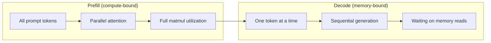
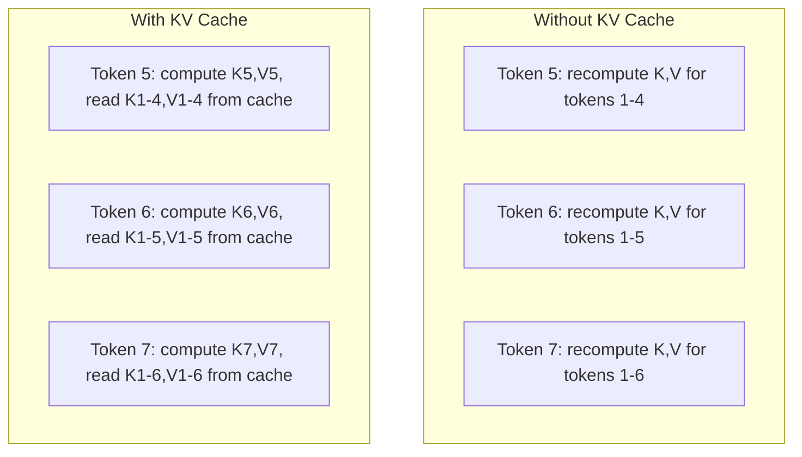
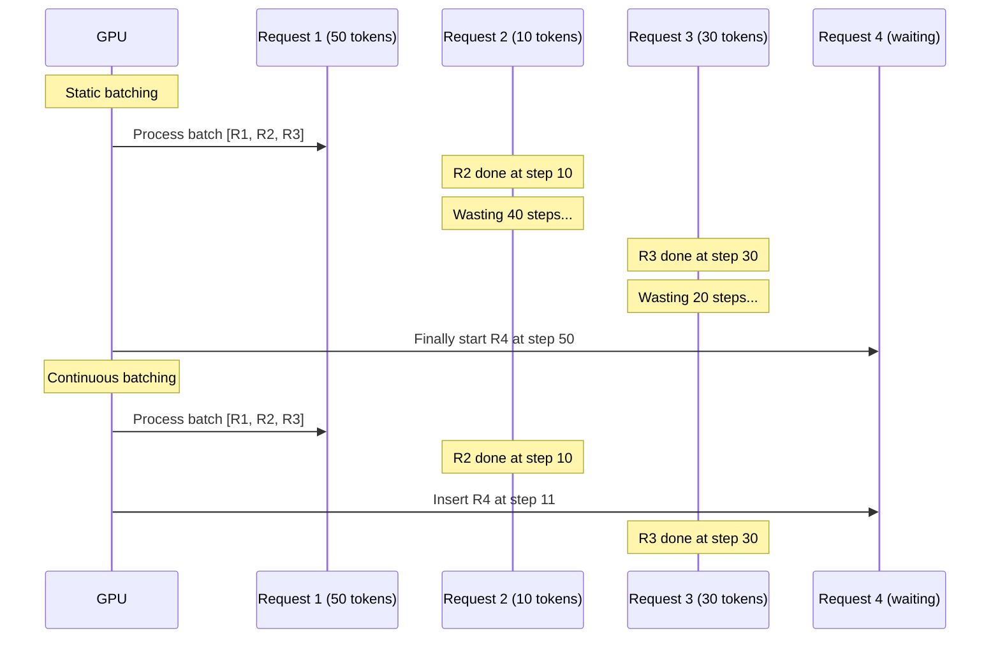
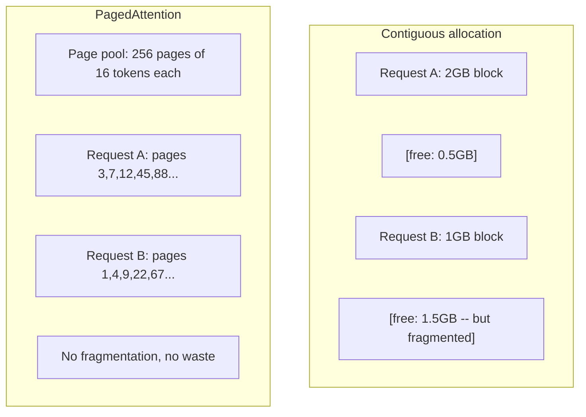
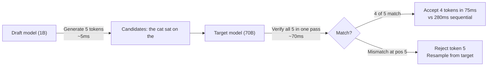

# Оптимизация инференса

> Инференс LLM состоит из двух фаз. Prefill обрабатывает ваш промпт параллельно и упирается в вычисления. Decode генерирует токены по одному и упирается в память. Каждая оптимизация нацелена на одну из этих фаз или на обе сразу.

**Тип:** Build
**Языки:** Python
**Предварительные требования:** Фаза 10, уроки 01-08 (архитектура Transformer, attention)
**Время:** ~120 минут

## Цели обучения

- Реализовать KV cache, чтобы устранить избыточные вычисления при авторегрессионной генерации токенов
- Объяснить фазы prefill и decode в инференсе LLM и почему у них разные узкие места (compute-bound против memory-bound)
- Реализовать идеи continuous batching и PagedAttention для максимальной загрузки GPU при параллельных запросах
- Сравнить техники оптимизации инференса (KV cache, speculative decoding, flash attention) и их компромиссы по throughput/latency

## Проблема

Вы разворачиваете Llama 3 70B на 4xA100 GPU. Один пользователь получает ~50 токенов в секунду. Это кажется быстрым. Затем 100 пользователей одновременно обращаются к endpoint. Пропускная способность падает до 3 токенов/секунду/пользователь. Ваш счет за GPU на $25,000 в месяц обслуживает ответы медленнее, чем человек печатает.

Сама модель не меняется между 1 пользователем и 100 пользователями. Те же веса, та же архитектура, та же математика. Меняется то, как вы планируете работу. Наивный инференс впустую тратит 90%+ доступных вычислений GPU. Пользователь, ожидающий токен 47, удерживает целый слот батча, пока шина памяти GPU простаивает между матричными умножениями. Тем временем промпт нового пользователя на 2,000 токенов мог бы заполнить это мертвое время полезными вычислениями.

Это не проблема масштабирования. Это проблема планирования. Техники в этом уроке -- KV caching, continuous batching, PagedAttention, speculative decoding, prefix caching -- отделяют счет за инференс в $25k/месяц от счета в $5k/месяц при том же трафике.

vLLM при обслуживании Llama 3 70B на 4xA100-80GB достигает ~50 токенов/секунду/пользователь при низкой параллельности и удерживает 15-25 TPS/user при 100 одновременных запросах за счет continuous batching и PagedAttention. Без этих оптимизаций то же железо обслуживает 5 TPS/user при такой параллельности. Те же GPU, та же модель, в 4 раза выше throughput.

## Концепция

### Prefill vs Decode

У каждого запроса инференса LLM есть две отдельные фазы.

**Prefill** обрабатывает весь входной prompt. Все токены известны заранее, поэтому attention можно вычислять параллельно по всей последовательности. Это большое матричное умножение -- ядра GPU остаются занятыми. Узкое место здесь вычислительное: сколько FLOPS ваше железо может выдавать в секунду. A100 выполняет 312 TFLOPS (BF16). Prefill для prompt на 4,096 токенов в модели 70B занимает ~400ms на одной A100.

**Decode** генерирует выходные токены по одному. Каждый новый токен attends to все предыдущие токены, но за один forward pass производится только один токен. Матрицы весов имеют тот же размер, что и во время prefill, но вы умножаете их на один вектор вместо матрицы. Ядра GPU заканчивают за микросекунды, а затем ждут, пока из памяти придет следующий batch весов. Узкое место -- пропускная способность памяти: насколько быстро вы можете передавать веса модели из HBM к вычислительным блокам. У A100 bandwidth 2 TB/s. Модель 70B в FP16 занимает 140 GB. Одно чтение всей модели занимает 70ms -- это нижняя граница для одного decode step.



**Ops:byte ratio** (его также называют arithmetic intensity) выражает этот компромисс. Он измеряет, сколько операций вы выполняете на каждый байт, загруженный из памяти.

```
ops:byte ratio = FLOPs per token / bytes read from memory
```

Во время prefill с batch из 4,096 токенов вы выполняете ~4,096 операций multiply-accumulate на каждый загруженный вес. Ratio высокий -- вы compute-bound. Во время decode с batch size 1 вы выполняете ~1 операцию на каждый загруженный вес. Ratio низкий -- вы memory-bound.

Фундаментальное наблюдение: *decode является memory-bound, потому что вы читаете всю модель, чтобы получить один токен*. Каждая оптимизация ниже либо уменьшает объем чтения, либо увеличивает batch токенов, обрабатываемых за одно чтение, либо полностью избегает чтений.

### KV Cache

Во время attention query каждого токена attends to key и value vectors всех предыдущих токенов. Без кеширования генерация токена N требует заново вычислять key и value projections для всех N-1 предшествующих токенов. Токен 1 проецируется при генерации токена 2, затем снова для токена 3, затем снова для токена 4. К токену 1,000 вы спроецировали токен 1 в общей сложности 999 раз.

KV cache хранит key и value projections всех предыдущих токенов. При генерации токена N вы вычисляете key и value только для токена N, а затем конкатенируете их с cached K/V от токенов 1 до N-1.



**Формула памяти для KV cache:**

```
KV cache size = 2 * num_layers * num_kv_heads * head_dim * seq_len * bytes_per_param
```

Для Llama 3 70B (80 слоев, 8 KV heads с GQA, head_dim=128, BF16):

```
per token: 2 * 80 * 8 * 128 * 2 bytes = 327,680 bytes = 320 KB
at 4,096 tokens: 320 KB * 4,096 = 1.28 GB
at 128K tokens: 320 KB * 131,072 = 40 GB
```

Один разговор с контекстом 128K для Llama 3 70B потребляет 40 GB KV cache -- половину памяти A100. При 100 одновременных пользователях с 4K токенов у каждого один только KV cache требует 128 GB. Поэтому управление KV cache -- центральная задача оптимизации инференса.

### Continuous Batching

Static batching ждет, пока наберется batch из N запросов, обрабатывает их вместе и ждет, пока *все* завершатся, прежде чем принимать новые запросы. Если одному запросу нужно 500 токенов, а другому 10, короткий запрос простаивает 490 decode steps после завершения.

Continuous batching (также называется iteration-level batching) вставляет новые запросы в batch сразу после завершения любого запроса. Batch пересобирается на каждом decode step. Запрос, который завершился после 10 токенов, немедленно заменяется ожидающим запросом.



Улучшение throughput зависит от того, насколько различаются длины выходов. При одинаковых длинах continuous batching совпадает со static batching. При переменных длинах (обычный случай) continuous batching может дать throughput в 2-5 раз выше, потому что слоты GPU никогда не пустуют.

### PagedAttention

KV cache каждого запроса -- это непрерывный блок памяти. По мере прихода и ухода запросов память фрагментируется -- ровно как фрагментация RAM в операционных системах. Запрос на 4K токенов требует 1.28 GB непрерывной памяти. Даже если суммарно свободно 2 GB, у вас может не быть 1.28 GB *непрерывно*. В итоге вы либо теряете память впустую, либо отклоняете запрос.

PagedAttention (из vLLM) применяет к KV cache виртуальную память в стиле ОС. Вместо выделения одного непрерывного блока на запрос он выделяет "pages" фиксированного размера (обычно по 16 токенов). Pages могут находиться где угодно в физической памяти GPU. Page table сопоставляет логические позиции последовательности каждого запроса с физическими расположениями pages.



PagedAttention также дает **copy-on-write** для общих префиксов. Если 50 запросов используют один и тот же system prompt, pages KV cache для этого system prompt хранятся один раз и referenced всеми 50 запросами. Только когда запрос расходится (другие сообщения пользователя), он получает собственные pages. Это резко снижает расход памяти в приложениях с общими system prompts.

vLLM сообщает о почти нулевых потерях памяти (~4% против ~60-80% при наивном выделении) благодаря PagedAttention.

### Speculative Decoding

Decode медленный, потому что он последовательный: вы генерируете один токен, подаете его обратно, генерируете следующий. Но что если можно дешево угадать следующие 5 токенов, а затем проверить их все сразу?

Speculative decoding использует небольшую быструю **draft model**, чтобы сгенерировать K candidate tokens. Затем большая **target model** обрабатывает все K candidates за один forward pass (это похоже на prefill -- параллельно, compute-bound, эффективно). Если target model согласна с predictions draft model, вы принимаете все K токенов за время одного target forward pass. Если она не согласна в позиции j, вы принимаете токены с 1 по j-1 и отбрасываете остальные.



Speedup зависит от **acceptance rate** -- от того, как часто predictions draft model совпадают с target. Для Llama 3 8B в роли draft для Llama 3 70B типичны acceptance rates 70-85% на естественном языке. Это дает ускорение decode в 2-3 раза.

Три подхода к speculative decoding:

| Method | Draft source | Acceptance rate | Overhead |
|--------|-------------|-----------------|----------|
| Draft-target (Leviathan et al.) | Separate small model | 70-85% | Draft model memory |
| EAGLE (Li et al.) | Lightweight head on target | 75-90% | ~1% extra parameters |
| N-gram lookup | Token n-gram table | 40-60% | Negligible |

**EAGLE** обучает небольшую autoregressive head поверх hidden states target model. Она предсказывает embedding следующего токена, используя признаки предпоследнего слоя target model. Поскольку она работает на собственных representations target model (а не отдельной модели), она достигает более высоких acceptance rates при минимальной дополнительной памяти. EAGLE-2 добавляет dynamic draft tree, которое настраивает число candidates в зависимости от контекста.

**N-gram speculative decoding** поддерживает таблицу n-gram continuations из текущего контекста или заранее построенного корпуса. Если draft совпадает с тем, что уже встречалось раньше в этом же разговоре (повторяющиеся паттерны, код, структурированный output), он срабатывает без затрат на нейросеть. Средние acceptance rates ниже, но стоимость одной speculation практически нулевая.

Speculative decoding *математически точен*: output distribution идентично распределению target model. Это не аппроксимация. Шаг verification гарантирует, что каждый принятый токен имеет ровно ту вероятность, которую назначила бы target model.

### Prefix Caching

Многие запросы имеют одинаковый prefix. System prompt чатбота. Контекстный блок RAG. Набор few-shot examples. Без prefix caching каждый запрос заново вычисляет KV cache для этих общих токенов.

Prefix caching хранит KV cache для распространенных prefixes и переиспользует его между запросами. Когда приходит новый запрос с известным prefix, система копирует (или references) cached KV entries и вычисляет KV только для уникального suffix.

Для system prompt на 2,000 токенов, общего для всех запросов, prefix caching устраняет ~400ms prefill на каждый запрос. При 100 requests/second это экономит 40 секунд GPU compute в секунду -- больше, чем работа одной GPU.

SGLang RadixAttention реализует prefix caching через radix tree (trie), которое индексирует prefixes по их token content. Любой запрос, совпавший с сохраненным prefix, получает свой KV cache бесплатно. Дерево поддерживает partial prefix matches: если у вас совпадает 1,500 из 2,000 prefix tokens с cached entry, вы переиспользуете эти 1,500 и пересчитываете только 500.

### Inference Engines

В production serving LLM доминируют три движка:

| Engine | Key innovation | Best for |
|--------|---------------|----------|
| vLLM | PagedAttention, continuous batching | General-purpose serving, highest compatibility |
| SGLang | RadixAttention (prefix caching), structured generation | Multi-turn chatbots, constrained decoding |
| TensorRT-LLM | NVIDIA kernel fusion, FP8 quantization | Maximum single-GPU throughput on NVIDIA hardware |

**vLLM** -- базовая точка старта по умолчанию. Он поддерживает самый широкий набор моделей, работает на GPU любого вендора (NVIDIA, AMD, Intel) и достигает сильного throughput за счет PagedAttention + continuous batching. OpenAI-compatible API означает, что его можно подставить как замену для любого OpenAI API call.

**SGLang** строится на тех же основах, что и vLLM, но добавляет RadixAttention для prefix caching и domain-specific language для структурированных LLM programs. Если ваша нагрузка включает многошаговые диалоги, tool use или constrained decoding (JSON output, regex-guided generation), SGLang часто превосходит vLLM в 2-5 раз благодаря prefix reuse.

**TensorRT-LLM** компилирует модели в оптимизированные NVIDIA GPU kernels. Он объединяет операции (attention + linear + activation в одном kernel), использует FP8 на H100 GPUs и интегрируется с NVIDIA Triton Inference Server для production deployment. Он достигает максимального single-GPU throughput на NVIDIA hardware, но требует более сложной настройки и работает только на NVIDIA GPUs.

Реальные числа для Llama 3 70B (4xA100-80GB, BF16):

| Metric | vLLM | SGLang | TensorRT-LLM |
|--------|------|--------|---------------|
| Throughput (1 user) | ~50 TPS | ~55 TPS | ~65 TPS |
| Throughput (100 users) | ~2,500 total TPS | ~3,200 total TPS | ~3,000 total TPS |
| Time to first token | ~400ms | ~300ms (prefix hit) | ~350ms |
| Max context | 128K | 128K | 128K |

### The Ops:Byte Framework

Нельзя оптимизировать то, что вы не измеряете. Ops:byte ratio показывает, ограничены ли вы вычислениями или памятью, и тем самым определяет, какие оптимизации важны.

```
Compute roof: peak FLOPS of the GPU
Memory roof:  peak bandwidth * ops:byte ratio
```

Когда ops:byte низкий (decode, small batches), вы упираетесь в roof пропускной способности памяти. Добавление вычислений (более высокая частота, больше ядер) не помогает. Нужно уменьшать чтения из памяти (quantization, KV cache compression) или увеличивать batch size, чтобы амортизировать чтения на больший объем полезной работы.

Когда ops:byte высокий (prefill, large batches), вы упираетесь в compute roof. Оптимизация bandwidth памяти не помогает. Нужны более быстрые GPU, kernel fusion или пониженная precision, чтобы выжать больше FLOPS.

| Scenario | ops:byte | Bound | Optimize with |
|----------|----------|-------|---------------|
| Prefill, batch=1 | ~4,096 | Compute | Kernel fusion, FP8 |
| Decode, batch=1 | ~1 | Memory | Quantization, KV compression |
| Decode, batch=32 | ~32 | Memory | Larger batch, continuous batching |
| Decode, batch=256 | ~256 | Transitioning | Both matter |
| Decode, batch=1024 | ~1,024 | Compute | Kernel fusion, tensor parallelism |

Точка перехода на A100 находится около ops:byte = 156 (312 TFLOPS / 2 TB/s). Ниже 156 вы memory-bound. Выше 156 вы compute-bound. Continuous batching сдвигает decode к этой точке перехода, упаковывая больше токенов в одну iteration.

## Практика

### Step 1: KV Cache from Scratch

Мы построим multi-head KV cache, который хранит key и value projections по слоям и heads и демонстрирует паттерн роста памяти.

```python
import numpy as np

class KVCache:
    def __init__(self, num_layers, num_heads, head_dim, max_seq_len, dtype=np.float16):
        self.num_layers = num_layers
        self.num_heads = num_heads
        self.head_dim = head_dim
        self.max_seq_len = max_seq_len
        self.dtype = dtype

        self.k_cache = np.zeros(
            (num_layers, num_heads, max_seq_len, head_dim), dtype=dtype
        )
        self.v_cache = np.zeros(
            (num_layers, num_heads, max_seq_len, head_dim), dtype=dtype
        )
        self.seq_len = 0

    def update(self, layer_idx, new_keys, new_values):
        num_new = new_keys.shape[1]
        end = self.seq_len + num_new
        self.k_cache[layer_idx, :, self.seq_len:end, :] = new_keys
        self.v_cache[layer_idx, :, self.seq_len:end, :] = new_values
        return (
            self.k_cache[layer_idx, :, :end, :],
            self.v_cache[layer_idx, :, :end, :]
        )

    def advance(self, num_tokens):
        self.seq_len += num_tokens

    def memory_bytes(self):
        return self.k_cache.nbytes + self.v_cache.nbytes

    def used_bytes(self):
        per_token = 2 * self.num_layers * self.num_heads * self.head_dim * np.dtype(self.dtype).itemsize
        return per_token * self.seq_len
```

### Step 2: Attention with KV Cache

Упрощенный multi-head attention, который использует KV cache для decode steps.

```python
def scaled_dot_product_attention(query, keys, values):
    head_dim = query.shape[-1]
    scores = np.matmul(query, keys.transpose(0, 1, 3, 2)) / np.sqrt(head_dim)
    seq_len_q = scores.shape[-2]
    seq_len_k = scores.shape[-1]
    if seq_len_q > 1:
        mask = np.triu(np.ones((seq_len_q, seq_len_k), dtype=np.float32), k=seq_len_k - seq_len_q + 1)
        scores = scores + mask * (-1e9)
    max_scores = np.max(scores, axis=-1, keepdims=True)
    exp_scores = np.exp(scores - max_scores)
    attn_weights = exp_scores / np.sum(exp_scores, axis=-1, keepdims=True)
    return np.matmul(attn_weights, values)


class MultiHeadAttention:
    def __init__(self, d_model, num_heads):
        self.num_heads = num_heads
        self.head_dim = d_model // num_heads
        scale = np.sqrt(2.0 / d_model)
        self.W_q = np.random.randn(d_model, d_model).astype(np.float32) * scale
        self.W_k = np.random.randn(d_model, d_model).astype(np.float32) * scale
        self.W_v = np.random.randn(d_model, d_model).astype(np.float32) * scale
        self.W_o = np.random.randn(d_model, d_model).astype(np.float32) * scale

    def forward(self, x, kv_cache=None, layer_idx=0):
        batch, seq_len, d_model = x.shape
        Q = np.matmul(x, self.W_q).reshape(batch, seq_len, self.num_heads, self.head_dim).transpose(0, 2, 1, 3)
        K = np.matmul(x, self.W_k).reshape(batch, seq_len, self.num_heads, self.head_dim).transpose(0, 2, 1, 3)
        V = np.matmul(x, self.W_v).reshape(batch, seq_len, self.num_heads, self.head_dim).transpose(0, 2, 1, 3)

        if kv_cache is not None:
            K_full, V_full = kv_cache.update(layer_idx, K[0], V[0])
            K = K_full[np.newaxis, :, :, :]
            V = V_full[np.newaxis, :, :, :]
            if seq_len == 1:
                kv_cache.advance(1)

        attn_out = scaled_dot_product_attention(Q, K, V)
        attn_out = attn_out.transpose(0, 2, 1, 3).reshape(batch, -1, d_model)
        return np.matmul(attn_out, self.W_o)
```

### Step 3: Continuous Batching Simulator

Здесь моделируется разница в планировании между static и continuous batching.

```python
import heapq

class Request:
    def __init__(self, request_id, prompt_tokens, output_tokens, arrival_step):
        self.request_id = request_id
        self.prompt_tokens = prompt_tokens
        self.output_tokens = output_tokens
        self.arrival_step = arrival_step
        self.tokens_generated = 0
        self.start_step = None
        self.end_step = None

    def is_done(self):
        return self.tokens_generated >= self.output_tokens


def simulate_static_batching(requests, batch_size):
    step = 0
    completed = []
    queue = list(requests)
    queue.sort(key=lambda r: r.arrival_step)

    while queue:
        batch = []
        while queue and len(batch) < batch_size:
            r = queue.pop(0)
            r.start_step = max(step, r.arrival_step)
            batch.append(r)

        if batch:
            step = max(step, max(r.start_step for r in batch))
            max_output = max(r.output_tokens for r in batch)
            for r in batch:
                r.tokens_generated = r.output_tokens
                r.end_step = step + max_output
            step += max_output
            completed.extend(batch)

    return completed


def simulate_continuous_batching(requests, batch_size):
    step = 0
    completed = []
    queue = sorted(requests, key=lambda r: r.arrival_step)
    queue_idx = 0
    active = []
    waiting = []

    while queue_idx < len(queue) or active or waiting:
        while queue_idx < len(queue) and queue[queue_idx].arrival_step <= step:
            waiting.append(queue[queue_idx])
            queue_idx += 1

        while waiting and len(active) < batch_size:
            r = waiting.pop(0)
            r.start_step = step
            active.append(r)

        if not active:
            if waiting:
                step += 1
                continue
            elif queue_idx < len(queue):
                step = queue[queue_idx].arrival_step
                continue
            else:
                break

        for r in active:
            r.tokens_generated += 1

        done = [r for r in active if r.is_done()]
        for r in done:
            r.end_step = step + 1
            completed.append(r)
        active = [r for r in active if not r.is_done()]

        step += 1

    return completed


def batching_stats(completed):
    latencies = [r.end_step - r.arrival_step for r in completed]
    total_time = max(r.end_step for r in completed) - min(r.arrival_step for r in completed)
    total_tokens = sum(r.output_tokens for r in completed)
    return {
        "avg_latency": np.mean(latencies),
        "p50_latency": np.median(latencies),
        "p99_latency": np.percentile(latencies, 99),
        "total_time": total_time,
        "throughput": total_tokens / total_time if total_time > 0 else 0,
    }
```

### Step 4: Prefix Cache

Prefix cache на основе trie, который хранит KV entries для общих prefixes.

```python
class TrieNode:
    def __init__(self):
        self.children = {}
        self.kv_data = None
        self.hit_count = 0


class PrefixCache:
    def __init__(self, max_entries=1000):
        self.root = TrieNode()
        self.max_entries = max_entries
        self.total_entries = 0
        self.hits = 0
        self.misses = 0

    def _walk(self, token_ids):
        node = self.root
        depth = 0
        for tid in token_ids:
            if tid not in node.children:
                break
            node = node.children[tid]
            depth += 1
        return node, depth

    def lookup(self, token_ids):
        node, depth = self._walk(token_ids)
        if depth > 0:
            self.hits += 1
            current = self.root
            for tid in token_ids[:depth]:
                current = current.children[tid]
                current.hit_count += 1
            kv_entries = []
            current = self.root
            for tid in token_ids[:depth]:
                current = current.children[tid]
                if current.kv_data is not None:
                    kv_entries.append(current.kv_data)
            return depth, kv_entries
        self.misses += 1
        return 0, []

    def insert(self, token_ids, kv_per_token):
        node = self.root
        for i, tid in enumerate(token_ids):
            if tid not in node.children:
                if self.total_entries >= self.max_entries:
                    return i
                node.children[tid] = TrieNode()
                self.total_entries += 1
            node = node.children[tid]
            if i < len(kv_per_token):
                node.kv_data = kv_per_token[i]
        return len(token_ids)

    def hit_rate(self):
        total = self.hits + self.misses
        return self.hits / total if total > 0 else 0.0
```

### Step 5: Speculative Decoding Simulator

Мы моделируем draft-target speculative decoding с настраиваемыми acceptance rates.

```python
class DraftModel:
    def __init__(self, vocab_size, acceptance_rate=0.8):
        self.vocab_size = vocab_size
        self.acceptance_rate = acceptance_rate

    def generate(self, context, num_tokens):
        tokens = np.random.randint(0, self.vocab_size, size=num_tokens)
        return tokens

    def get_probs(self, context, token):
        probs = np.random.dirichlet(np.ones(self.vocab_size))
        return probs


class TargetModel:
    def __init__(self, vocab_size):
        self.vocab_size = vocab_size

    def get_probs(self, context, tokens=None):
        if tokens is not None:
            return [np.random.dirichlet(np.ones(self.vocab_size)) for _ in tokens]
        return np.random.dirichlet(np.ones(self.vocab_size))


def speculative_decode(draft_model, target_model, context, num_speculative=5,
                       draft_cost=1.0, target_cost=10.0, verify_cost=12.0):
    total_tokens = 0
    total_cost = 0.0
    accepted_counts = []
    context = list(context)

    max_tokens = 100

    while total_tokens < max_tokens:
        draft_tokens = draft_model.generate(context, num_speculative)
        total_cost += draft_cost * num_speculative

        target_probs = target_model.get_probs(context, draft_tokens)
        total_cost += verify_cost

        accepted = 0
        for i, token in enumerate(draft_tokens):
            draft_p = draft_model.get_probs(context + list(draft_tokens[:i]), token)
            target_p = target_probs[i]

            r = np.random.random()
            acceptance_prob = min(1.0, target_p[token] / (draft_p[token] + 1e-10))

            if r < draft_model.acceptance_rate:
                accepted += 1
                context.append(token)
                total_tokens += 1
            else:
                new_token = np.random.choice(draft_model.vocab_size, p=target_p)
                context.append(new_token)
                total_tokens += 1
                break

        accepted_counts.append(accepted)

        if accepted == num_speculative:
            bonus_probs = target_model.get_probs(context)
            bonus_token = np.random.choice(draft_model.vocab_size, p=bonus_probs)
            context.append(bonus_token)
            total_tokens += 1

    sequential_cost = total_tokens * target_cost
    return {
        "total_tokens": total_tokens,
        "speculative_cost": total_cost,
        "sequential_cost": sequential_cost,
        "speedup": sequential_cost / total_cost if total_cost > 0 else 1.0,
        "avg_accepted": np.mean(accepted_counts),
        "acceptance_rate": np.mean(accepted_counts) / num_speculative,
    }


def compare_speculation_strategies(vocab_size=1000, num_trials=20):
    results = {}

    for name, acceptance_rate, spec_tokens in [
        ("Draft-target (8B->70B)", 0.78, 5),
        ("EAGLE", 0.85, 6),
        ("N-gram", 0.50, 4),
        ("No speculation", 0.0, 0),
    ]:
        if spec_tokens == 0:
            results[name] = {
                "speedup": 1.0,
                "acceptance_rate": 0.0,
                "avg_accepted": 0.0,
            }
            continue

        trial_results = []
        for _ in range(num_trials):
            draft = DraftModel(vocab_size, acceptance_rate=acceptance_rate)
            target = TargetModel(vocab_size)
            context = list(np.random.randint(0, vocab_size, size=10))
            result = speculative_decode(draft, target, context, num_speculative=spec_tokens)
            trial_results.append(result)

        results[name] = {
            "speedup": np.mean([r["speedup"] for r in trial_results]),
            "acceptance_rate": np.mean([r["acceptance_rate"] for r in trial_results]),
            "avg_accepted": np.mean([r["avg_accepted"] for r in trial_results]),
        }

    return results
```

### Step 6: KV Cache Memory Profiler

Вычислим требования к памяти KV cache для реальных конфигураций моделей.

```python
MODEL_CONFIGS = {
    "Llama-3-8B": {
        "num_layers": 32, "num_kv_heads": 8, "head_dim": 128,
        "model_params_b": 8, "gqa": True,
    },
    "Llama-3-70B": {
        "num_layers": 80, "num_kv_heads": 8, "head_dim": 128,
        "model_params_b": 70, "gqa": True,
    },
    "Llama-3-405B": {
        "num_layers": 126, "num_kv_heads": 8, "head_dim": 128,
        "model_params_b": 405, "gqa": True,
    },
    "Mistral-7B": {
        "num_layers": 32, "num_kv_heads": 8, "head_dim": 128,
        "model_params_b": 7, "gqa": True,
    },
    "GPT-4-est": {
        "num_layers": 120, "num_kv_heads": 96, "head_dim": 128,
        "model_params_b": 1800, "gqa": False,
    },
}


def kv_cache_memory(config, seq_len, dtype_bytes=2):
    per_token = 2 * config["num_layers"] * config["num_kv_heads"] * config["head_dim"] * dtype_bytes
    total = per_token * seq_len
    return {
        "per_token_bytes": per_token,
        "per_token_kb": per_token / 1024,
        "total_bytes": total,
        "total_mb": total / (1024 ** 2),
        "total_gb": total / (1024 ** 3),
    }


def memory_budget(config, gpu_memory_gb, model_dtype_bytes=2, kv_dtype_bytes=2):
    model_memory_gb = config["model_params_b"] * 1e9 * model_dtype_bytes / (1024 ** 3)
    overhead_gb = gpu_memory_gb * 0.1
    available_for_kv = gpu_memory_gb - model_memory_gb - overhead_gb

    if available_for_kv <= 0:
        return {"error": "Model does not fit in GPU memory", "model_memory_gb": model_memory_gb}

    per_token = 2 * config["num_layers"] * config["num_kv_heads"] * config["head_dim"] * kv_dtype_bytes
    max_tokens = int(available_for_kv * (1024 ** 3) / per_token)

    return {
        "gpu_memory_gb": gpu_memory_gb,
        "model_memory_gb": round(model_memory_gb, 1),
        "overhead_gb": round(overhead_gb, 1),
        "available_for_kv_gb": round(available_for_kv, 1),
        "max_total_tokens": max_tokens,
        "max_users_at_2k": max_tokens // 2048,
        "max_users_at_4k": max_tokens // 4096,
        "max_users_at_32k": max_tokens // 32768,
    }
```

## Использование

С vLLM:

```python
from vllm import LLM, SamplingParams

llm = LLM(
    model="meta-llama/Llama-3-70B-Instruct",
    tensor_parallel_size=4,
    enable_prefix_caching=True,
    max_model_len=8192,
    gpu_memory_utilization=0.9,
)

params = SamplingParams(temperature=0.7, max_tokens=256)
outputs = llm.generate(["Explain inference optimization in one paragraph."], params)
```

С SGLang для prefix caching + structured output:

```python
import sglang as sgl

@sgl.function
def classify(s, text):
    s += sgl.system("You are a classifier. Output JSON only.")
    s += sgl.user(f"Classify this text: {text}")
    s += sgl.assistant(sgl.gen("result", regex=r'\{"label": "(positive|negative|neutral)"\}'))

runtime = sgl.Runtime(model_path="meta-llama/Llama-3-70B-Instruct", tp_size=4)
sgl.set_default_backend(runtime)

results = classify.run_batch([
    {"text": "This product is amazing!"},
    {"text": "Terrible experience."},
    {"text": "It was okay I guess."},
])
```

С TensorRT-LLM:

```python
import tensorrt_llm
from tensorrt_llm.runtime import ModelRunner

runner = ModelRunner.from_dir("./llama-70b-trt-engine/", rank=0)

outputs = runner.generate(
    batch_input_ids=[tokenizer.encode("Explain KV caching.")],
    max_new_tokens=256,
    temperature=0.7,
)
```

## Результат

Этот урок создает:
- `outputs/skill-inference-optimization.md` -- skill для диагностики и оптимизации LLM inference serving

## Упражнения

1. Измените profiler KV cache, чтобы сравнить FP16, FP8 и INT4 quantization для KV cache. Для Llama 3 70B при контексте 4K вычислите максимальное число одновременных пользователей на 4xA100-80GB. KV quantization до INT4 должна примерно в 4 раза увеличить user capacity.

2. Расширьте continuous batching simulator так, чтобы он отслеживал GPU utilization (долю заполненных batch slots на каждом step). Постройте график utilization во времени для static и continuous batching с 50 запросами, длины output которых следуют распределению Pareto (shape=1.5, scale=20). Continuous batching должен поддерживать utilization >80%.

3. Реализуйте версию KV cache для grouped-query attention (GQA), где `num_kv_heads < num_query_heads`. Llama 3 70B использует 64 query heads, но только 8 KV heads. Вычислите экономию памяти по сравнению с full multi-head attention (8-кратное уменьшение размера KV cache).

4. Постройте prefix cache с LRU eviction. Установите max_entries в 500 и сгенерируйте 1,000 запросов, где 60% используют один из 5 общих prefixes. Измерьте hit rate и сравните с unlimited cache. При хорошем eviction hit rate должен оставаться выше 55%.

5. Расширьте speculative decoding simulator, реализовав tree-based speculation (в стиле EAGLE-2). Вместо одной цепочки из K draft tokens сгенерируйте дерево candidates (например, 2 branches на каждом из 3 levels = 8 leaf candidates). Сравните total tokens accepted per verification round с linear speculation.

## Ключевые термины

| Термин | Как говорят | Что это на самом деле означает |
|------|----------------|----------------------|
| Prefill | "Processing the prompt" | Вычисление attention по всем input tokens параллельно -- compute-bound, потому что полное matrix multiplication держит ядра GPU занятыми |
| Decode | "Generating tokens" | Производство одного токена за forward pass с чтением всех весов модели каждый раз -- memory-bound, потому что вычисления заканчиваются раньше, чем приходят следующие веса |
| KV cache | "Caching attention states" | Хранение key и value projections для всех предыдущих токенов, чтобы не пересчитывать их на каждом decode step -- обмен памяти на вычисления |
| Continuous batching | "Dynamic batching" | Вставка новых запросов в running batch сразу после завершения любого запроса; batch пересматривается на каждой decode iteration, а не ждет завершения всего batch |
| PagedAttention | "Virtual memory for KV cache" | Выделение KV cache фиксированными pages вместо непрерывных блоков, что устраняет фрагментацию памяти и включает copy-on-write для общих prefixes |
| Speculative decoding | "Draft and verify" | Использование быстрой draft model для предложения нескольких токенов с последующей проверкой всех токенов за один forward pass target model -- математически точно, ускорение 2-3x |
| EAGLE | "Self-speculative decoding" | Вариант speculative decoding, который обучает lightweight head на собственных hidden states target model и достигает более высоких acceptance rates, чем отдельная draft model |
| Prefix caching | "Reusing system prompt KV" | Хранение вычисленных KV cache entries для common prefixes (system prompts, few-shot examples) и их переиспользование между запросами, чтобы пропускать избыточный prefill |
| Ops:byte ratio | "Arithmetic intensity" | Отношение вычислительных операций к байтам, прочитанным из памяти; определяет, является ли workload compute-bound (высокий ratio) или memory-bound (низкий ratio) |
| Time to first token | "TTFT" | Latency от получения запроса до выдачи первого output token; для длинных prompts в основном определяется временем prefill |

## Дополнительное чтение

- Kwon et al., "Efficient Memory Management for Large Language Model Serving with PagedAttention" (2023) -- статья vLLM, которая ввела paged management KV cache и стала индустриальным стандартом inference serving
- Leviathan et al., "Fast Inference from Transformers via Speculative Decoding" (2023) -- основополагающая статья, доказывающая, что draft-verify speculation дает точные распределения target model при ускорении 2-3x
- Li et al., "EAGLE: Speculative Sampling Requires Rethinking Feature Uncertainty" (2024) -- достигает более высоких acceptance rates, обучая head на собственных features target model вместо использования отдельной draft model
- Zheng et al., "SGLang: Efficient Execution of Structured Language Model Programs" (2024) -- вводит RadixAttention для prefix caching и programming model для multi-call LLM programs
- Williams et al., "Roofline: An Insightful Visual Performance Model for Multicore Architectures" (2009) -- исходная статья о roofline, формализовавшая ops:byte framework для рассуждений о bottlenecks вычислений и памяти
