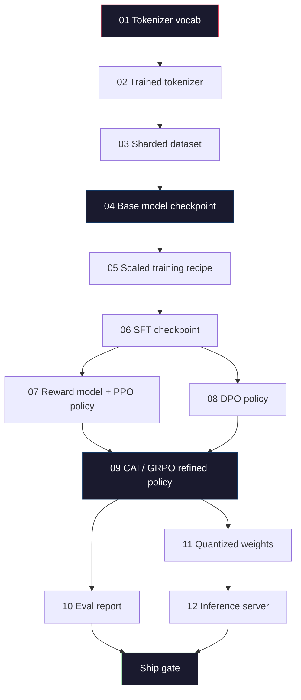
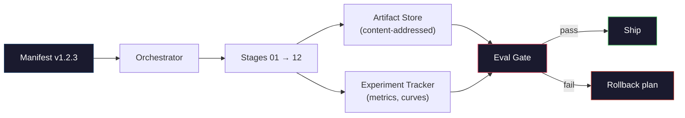

# Построение полного LLM-пайплайна

> Все из уроков 01-12 -- это стадии одного пайплайна. Этот урок дает каркас, который превращает эти стадии в единый end-to-end run: tokenize, pre-train, scale, SFT, align, evaluate, quantize, serve. Вы не будете обучать 70B-модель на ноутбуке. Вы создадите orchestration layer, manifest, eval gate и rollback plan, которыми frontier-команда 2026 года пользуется, чтобы решить, что отправлять в production. Это capstone.

**Тип:** Build
**Языки:** Python (stdlib)
**Предварительные требования:** Все уроки фазы 10, 01-12
**Время:** ~120 минут

## Цели обучения

- Сложить одиннадцать предыдущих уроков (tokenizer, data, pre-training, scaling, SFT, RLHF, DPO, CAI, eval, quantization, inference) в единую воспроизводимую спецификацию пайплайна
- Определить artifact contract между стадиями: что каждая стадия потребляет, что производит и как следующая стадия проверяет вход
- Построить orchestrator, который отслеживает experiments, хеширует artifacts и блокирует ship decisions на eval thresholds
- Спроектировать rollback plan: какие artifacts дешево перезапускать, какие дороги и сколько стоит corrupted checkpoint

## Проблема

Предыдущие уроки по отдельности работают. Tokenizer обучен. Tiny GPT предобучен. SFT dataset собран. Reward model обучена. DPO run выполнен. Evals измерены. Quantized weights экспортированы. Inference server поднят. Каждый из них -- notebook. У каждого свои соглашения, свои output paths, свой seed.

Frontier training run -- это не notebook. Llama 3 405B заняла 30 миллионов H100 hours примерно за 54 дня. DeepSeek-V3 использовала около 2,8 миллиона H800 hours. За это время один corrupted checkpoint, одно data contamination, одна eval regression могут стоить команде недели wall-clock и месяца GPU budget. Команды выживают благодаря pipeline hygiene: у каждой стадии есть deterministic input, deterministic output, manifest, hash и gate.

Это capstone. Вы не запустите пайплайн end-to-end на ноутбуке. Вы напишете orchestrator, который координирует стадии, manifest, который описывает run, verifier, который gate-ит ship decisions, и replay plan, который позволяет третьей стороне воспроизвести вашу работу из одного файла. Код маленький; дисциплина большая.

Паттерн без изменений масштабируется от 100M до 1T parameters. Те же четыре компонента -- manifest, orchestrator, eval gate, artifact store -- запускают Llama 3 и ваш hobby GPT. Отличие в размере чисел внутри config каждой стадии, а не в форме пайплайна.

## Концепция

### Двенадцать стадий

Каждый урок фазы 10 -- это стадия. Полный dependency graph:



Стадии 07 и 08 могут идти параллельно. Все остальное -- жесткая зависимость. Изменение в стадии 02 (tokenizer) инвалидирует каждый downstream artifact. Изменение в стадии 10 (eval) инвалидирует только ship decision.

### Manifest

Manifest -- один файл, который описывает run достаточно полно, чтобы его replay. Ничто, что производит пайплайн, не должно зависеть от состояния вне manifest. Поля скучные и обязательные.

```
pipeline_version: 1.2.3
seed: 42
git_commit: a1b2c3d4
stages:
  01_tokenizer:
    recipe: bpe_32k
    input_hash: sha256:...
    output_hash: sha256:...
    wall_clock_sec: 3600
    cost_usd: 12
```

Output hash стадии N -- это input hash стадии N+1. Любое отклонение, и пайплайн останавливается. Так вы рано ловите data corruption. Так же teammate на другом континенте проверяет, что его replay произвел тот же artifact, что и ваш.

На практике команды используют небольшую YAML schema плюс manifest checker, который diff-ит против предыдущего successful run. Любая delta вне ожидаемых полей (cost, wall clock) -- red flag.

### Artifact Typing

Выход каждой стадии -- typed artifact. Не directory blob, не pickle, а named type с известной schema.

| Stage | Artifact Type | Key Fields |
|-------|--------------|-----------|
| 01-02 | Tokenizer | vocab.json, merges.txt, config.json, hash |
| 03 | Dataset | shards[], row count, token count, dedup stats |
| 04-05 | Checkpoint | weights.safetensors, config.json, optimizer state, step count |
| 06 | SFT Model | checkpoint + SFT recipe + data mix |
| 07 | Reward Model | RM checkpoint + preference data hash |
| 08-09 | Policy | checkpoint + reference hash + beta + KL budget consumed |
| 10 | Eval Report | benchmark scores + regression diffs + eval data hash |
| 11 | Quantized Model | quantized weights + calibration data + accuracy delta vs FP16 |
| 12 | Server Spec | endpoint + model hash + config + observability hooks |

Typing предотвращает самый частый failure mode: использовать output стадии 08 как input стадии 06, отправив DPO-trained model через SFT path. Typed artifacts и typed stage signatures превращают такие ошибки в compile-time failures, а не day-five failures.

### Eval Gate

Shipping -- это не "training finished." Shipping -- это "training finished and the eval gate passed." Gate определяется до старта run.

```
gates:
  mmlu:      >= baseline + 0.5   # no regression
  humaneval: >= baseline + 1.0
  truthfulqa: >= baseline         # no drop
  safety_refusal_rate: <= 0.05
  kl_from_reference: <= 25.0
  cost_total_usd: <= 50000
```

Каждый gate -- числовой threshold. Никаких "looks good" gates. Никаких субъективных sign-offs. Если все gates pass, artifact помечается shippable. Если любой gate fails, run удерживается до explicit override от named reviewer, и этот override тоже логируется в manifest.

Два gates ловят большинство катастроф. *Regression* gate (новая модель должна быть как минимум не хуже предыдущей на core benchmarks) ловит training bugs. *KL budget* gate (aligned policy не должна уйти дальше X от reference) ловит alignment overcooking. В каждом production pipeline есть оба.

### Orchestrator

Небольшой кусок кода, который читает manifest, dispatches stages, tracks artifacts и останавливается при любом contract violation. Это не Airflow. Это не Kubeflow. Для pipeline hygiene нужен скучный инструмент, который вы написали сами.

Задача orchestrator узкая:

1. Resolve DAG from the manifest.
2. For each stage, check if the expected output already exists at the correct hash (skip if so).
3. Run the stage, capture stdout/stderr, measure wall clock and cost.
4. Verify the output hash against the downstream stage's expected input hash.
5. On failure, write a partial manifest with the exact failing stage and exit nonzero.

Это 200 строк Python. Он будет похож на файл `code/main.py` в этом уроке. Под капотом настоящий pipeline использует `torchrun` или `ray` для запуска отдельных стадий на clusters, но сам orchestrator работает на одной машине.

### Experiment Tracking и Artifact Storage

Две внешние системы закрепляют пайплайн.

**Experiment tracker (wandb, neptune, mlflow).** Логирует loss curves, eval metrics, system telemetry по стадиям. Tracker -- место, куда вы идете, когда через три недели нужно сравнить run A и run B. Команды почти всегда используют hosted tracker -- писать свой означает терять время, которое должно идти на training.

**Artifact store (S3, R2, GCS).** Immutable object store для checkpoints, datasets, tokenizers, eval reports. Artifacts адресуются hash, а не filename. Filename вроде `latest.pt` -- foot-gun; `ckpt-7b-step-20000-sha256:abc123.safetensors` -- contract.

Orchestrator пишет в оба. Tracker -- для людей, смотрящих на charts. Artifact store -- для следующей стадии, которая ищет inputs.

### Costing

У frontier run есть долларовая стоимость. Budget discipline происходит в двух местах.

**Pre-run estimate.** Из manifest вычислите expected FLOPs (для pre-training: 6 x params x tokens), expected GPU hours (FLOPs / peak throughput / utilization) и dollar cost по текущей rental rate. Если estimate превышает budget gate, pipeline refuses to start.

**In-run tracking.** Stage-by-stage wall clock и cost логируются в manifest. После каждой стадии проверяется remaining budget. Если стадия overruns, gate следующей стадии оценивается с новым remaining budget. Вы не узнаете, что деньги кончились, когда звонит VC.

Reported cost Llama 3 был $61M. DeepSeek-V3 сообщила $5.6M за основной pre-training run. Соотношение в основном объясняется hardware efficiency плюс mixture-of-experts -- но конкретная cost видна потому, что обе команды tracked it per stage, not per run.

### Reproducibility vs Determinism

Это не одно и то же. *Reproducible* значит, что тот же manifest плюс тот же code плюс та же infrastructure производят checkpoint с equivalent downstream metrics. *Deterministic* значит bit-identical output.

Современное LLM training воспроизводимо, но не детерминировано. Reduce-order в distributed training, GPU kernel non-determinism (cuBLAS, flash-attn) и mixed precision rounding вместе дают floats, различающиеся на уровне 1e-5 между runs. Это нормально для финальных metrics, которые не двигаются. Это фатально, если вы пытаетесь debug с bit-level diffs. Лечение -- логировать input hash, output hash и headline metrics каждой стадии: если они совпадают, run "reproduced", даже если weights не bit-identical.



### Rollback Plan

До старта run запишите, что происходит при failure каждой стадии. Три категории.

- **Cheap to re-run** (часы): tokenizer, eval, quantization, inference server. Просто re-run.
- **Medium** (дни): SFT, DPO, CAI. Сохраните base model; перезапустите только alignment stages.
- **Expensive** (недели и миллионы долларов): pre-training. Rollback plan здесь не "re-run." Это "use the last good checkpoint and re-run the cheaper downstream stages with revised data."

Поскольку stage dependencies typed и hashed, orchestrator может автоматически вычислить rollback set: invalidate failed stage плюс каждого descendant. Failure на стадии 06 (SFT) инвалидирует 06, 07, 08, 09, 10, 11, 12. Failure на стадии 11 (quantization) инвалидирует только 11 и 12. Назвать это заранее лучше, чем импровизировать, когда команда вымотана в 4am.

### Production Recipes Observed in 2026

Большинство frontier-команд сошлись на одном skeleton.

- Tokenizer: 128k BPE with byte fallback. Обучен на маленьком, сбалансированном multilingual slice.
- Pre-training: 10-20T tokens, в основном web плюс code плюс synthetic. Muon или AdamW optimizer. FSDP2 или DeepSpeed ZeRO-3. Gradient checkpointing. BF16 weights, FP32 master.
- SFT: 500k-2M instruction pairs, смесь human и synthetic, со строгим dedup against the eval set.
- Alignment: DPO или CAI + GRPO. RLHF только там, где preference signal слишком multidimensional для DPO.
- Eval: MMLU-Pro, MATH, HumanEval+, GPQA, SWE-Bench Verified, LiveBench, плюс private held-out set, который public никогда не видит.
- Quantization: 4-bit GPTQ или AWQ для serving, 8-bit для safety evals, где accuracy deltas важны.
- Serving: vLLM, TensorRT-LLM или in-house. Continuous batching. Speculative decoding. KV cache eviction.

Числа меняются каждые шесть месяцев. Skeleton -- нет.

## Build It

Код урока -- это orchestrator и manifest checker, а не двенадцать training scripts. Каждая стадия симулируется placeholder, который создает output artifact правильной формы и hash. Запуск orchestrator end-to-end доказывает, что plumbing пайплайна работает, прежде чем вы потратите GPU money на настоящие стадии.

См. `code/main.py` для полной реализации. Ключевые части:

- `Manifest` dataclass: pipeline version, seed, git commit, stages, gates.
- `Stage` dataclass: name, type, inputs (hashes), output (hash), wall clock, cost.
- `Orchestrator.run()`: resolves DAG, dispatches stages, verifies hashes, updates manifest.
- `EvalGate.check()`: reads thresholds, compares against latest eval report, returns pass/fail.
- `ArtifactStore` (in-memory stub): put/get by hash, simulates S3.
- `CostTracker`: per-stage and cumulative, halts when cap exceeded.

Pipeline в `main.py` запускает двенадцать placeholder stages, создает manifest и упражняет failing eval gate, чтобы показать, как выглядит held run. Замените каждый placeholder на настоящий training script из соответствующего урока, и у вас будет skeleton, который использует реальный frontier pipeline.

## Use It

Canonical workflow состоит из трех команд.

```
python code/main.py plan    # validate manifest, compute cost estimate, print DAG
python code/main.py run     # execute stages, writing to manifest.out.yaml
python code/main.py gate    # read manifest.out.yaml, apply eval gates, ship-or-hold
```

Запускайте `plan` первым каждый раз. Большинство pipeline bugs обнаруживается на plan time -- missing gate thresholds, stale hashes, budget overruns. Запуск `plan` бесплатен. Запуск `run` дорогой. Экономьте деньги, ловя bugs on the cheap side.

Output `gate` -- либо `SHIP`, либо `HOLD: <reason>`. Held run -- не failure; это decision point. Named reviewer либо overrides (и override логируется), либо approves rollback.

## Ship It

Этот урок создает `outputs/skill-llm-pipeline-reviewer.md`. Передайте ему proposed pipeline manifest, и он проверит все contracts: stage typing, hash chain, gates, rollback plan, cost estimate. Он отказывается approve manifest с missing eval gate, unbounded KL budget или run, который смешивает eval и training data.

## Exercises

1. Расширьте orchestrator для поддержки parallel execution стадий 07 и 08. Используйте stdlib module `concurrent.futures`. Подтвердите, что final manifest записывает outputs обеих стадий и что input hash стадии 09 -- deterministic combination обоих.

2. Добавьте gate "contamination check". Имея eval dataset hash и training dataset shards, вычислите overlap (exact string match или 13-gram match). Gate fails, если overlap превышает 0.1%. Подайте contaminated training set и подтвердите, что gate holds the run.

3. Реализуйте cost estimator from first principles. Для стадии 04 (pre-training) оцените FLOPs как 6 x params x tokens, предположите 40% MFU (model FLOPs utilization) на H100 at 989 TFLOPs BF16, по $2.50/GPU-hour. Сообщите estimate для 7B model, trained on 2T tokens. Сравните с published Llama 2 numbers.

4. Постройте partial rollback. Симулируйте failure на стадии 09 (CAI), затем re-run stages 09 through 12, оставив 01-08 cached. Orchestrator должен обнаружить cached artifacts by hash и skip them. Измерьте wall-clock saved versus full re-run.

5. Добавьте observability. Emit OpenTelemetry spans для каждой стадии, с attributes для params, tokens seen, loss и cost. Pipe spans to a local collector. Смысл не в dashboards; смысл в том, что health каждой стадии traceable из одного trace ID.

## Key Terms

| Term | What people say | What it actually means |
|------|----------------|----------------------|
| Manifest | "The recipe file" | YAML или JSON, описывающий pipeline version, seed, per-stage config и gate thresholds — достаточный для replay run |
| Content-addressed | "By hash not name" | Artifacts хранятся по SHA-256 своего contents, поэтому нельзя спутать version A с version B |
| Eval gate | "The ship criteria" | Numeric thresholds по benchmark metrics и safety scores, которые должны pass до того, как artifact marked shippable |
| KL budget | "How far alignment drifted" | Cap на cumulative KL(policy || reference) across alignment stages, enforced as a gate |
| MFU | "How much of the GPU you used" | Model FLOPs Utilization — achieved FLOPs divided by theoretical peak. 40% typical at 70B scale, 55% at 7B |
| Rollback plan | "What we do when it breaks" | Pre-written set of actions per stage on failure: re-run, fall back, retrain with revised inputs |
| Orchestrator | "The conductor" | Процесс, который читает manifest, запускает stages, проверяет hashes и останавливается при любом нарушении contract |
| Artifact store | "Versioned S3 for weights" | Immutable content-addressed object store — single source of truth для checkpoints, datasets и eval reports |
| Reproducible | "Same metrics on replay" | Bit-level weights могут отличаться, но downstream metrics эквивалентны — реалистичная цель для distributed LLM training |
| Cost gate | "You cannot exceed X" | Pre-run cost estimate плюс in-run tracker — pipeline не стартует, если estimate превышает budget |

## Further Reading

- [Dubey et al., 2024 -- "The Llama 3 Herd of Models"](https://arxiv.org/abs/2407.21783) -- самое подробное public description frontier pipeline, включая data, training, alignment, eval
- [DeepSeek-AI, 2024 -- "DeepSeek-V3 Technical Report"](https://arxiv.org/abs/2412.19437) -- efficiency-first pipeline примерно за 1/10 стоимости training класса Llama 3
- [Kaplan et al., 2020 -- "Scaling Laws for Neural Language Models"](https://arxiv.org/abs/2001.08361) -- исходная compute-data-params scaling relationship
- [Hoffmann et al., 2022 -- "Training Compute-Optimal Large Language Models (Chinchilla)"](https://arxiv.org/abs/2203.15556) -- correction to Kaplan, которая recalibrated modern data budgets
- [PyTorch FSDP2 documentation](https://pytorch.org/docs/stable/fsdp.html) -- distributed training primitive, заменяющий FSDP1 в PyTorch 2.4+
- [Weights & Biases LLM Reports](https://wandb.ai/site/llms) -- реальные manifests и experiment tracker output для open-source LLM runs, useful as plagiarizable templates
