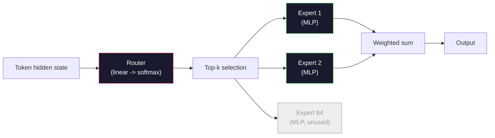

# Open Models: разбор архитектур

> В уроке 04 вы построили GPT-2 Small с нуля. Frontier open models в 2026 году -- та же семья с пятью-шестью конкретными изменениями. RMSNorm вместо LayerNorm. SwiGLU вместо GELU. RoPE вместо learned positions. GQA или MLA вместо full MHA. Mixture-of-Experts в масштабе. Математика, которую вы уже знаете, покрывает 95% этих моделей. В этом уроке мы читаем Llama 3, DeepSeek-V3, Mixtral, Qwen и Gemma рядом и называем точную строку, где каждая архитектура расходится.

**Тип:** Learn
**Языки:** Python (stdlib)
**Предварительные требования:** Фаза 10, уроки 04, 05, 12 (Pre-training, Scaling, Inference)
**Время:** ~45 минут

## Цели обучения

- Читать config.json Llama 3, Mistral, Mixtral, Gemma 2, Qwen 2.5 и DeepSeek-V3 и объяснять каждое поле
- Называть конкретное архитектурное изменение каждой модели относительно GPT-2 Small и обосновывать его from first principles
- Вычислять parameter count, KV cache size и activation memory для любой open model только по ее config
- Выбирать правильную open model для deployment target с учетом latency, memory и capability constraints

## Проблема

В уроке 04 вы написали 350 строк numpy и получили модель формы GPT-2. У Llama 3 405B есть 200-страничный technical report. Инстинкт подсказывает, что это разные звери. Это не так. Эти 200 страниц описывают тот же объект с пятью-шестью хорошо мотивированными модификациями плюс тысячей implementation details о scaling. Skeleton -- embedding, transformer blocks, attention, MLP, norm, head -- не изменился.

Этот урок -- diff. Для каждой крупной open model family мы перечисляем, что именно изменилось относительно GPT-2, почему и сколько это стоило. Когда вы закончите, вы сможете читать свежую model card и мысленно переводить ее обратно к GPT-2 baseline.

Практическая польза: когда Meta выпустит Llama 5 или DeepSeek выпустит V4, вам не понадобится новая mental model. Вы посмотрите на config, увидите, какие known knobs сдвинулись, и поймете downstream implications. Архитектуры 2026 года -- конечный toolbox. Каждая новая модель выбирает другой subset.

## Концепция

### Инвариантное ядро

Все autoregressive open models имеют:

- Token embedding matrix (vocab_size x hidden_dim).
- Stack of N decoder blocks: norm, self-attention, residual, norm, MLP, residual.
- Final norm and linear head projecting to vocab_size (often weight-tied with embeddings).
- Causal mask, next-token cross-entropy loss.

Это shape. Остальное -- knobs.

### Шесть knobs, которые действительно двигаются

Во всех frontier open models 2024-2026 одни и те же шесть design choices выбираются снова и снова:

1. **Normalization.** LayerNorm -> RMSNorm.
2. **Positional encoding.** Learned absolute -> RoPE (plus variants: YaRN, NTK).
3. **Activation.** GELU -> SwiGLU (or GeGLU).
4. **Attention head sharing.** MHA -> GQA -> MQA -> MLA.
5. **Dense vs sparse MLP.** Dense -> Mixture-of-Experts.
6. **Pre-norm placement.** Pre-norm stays. Post-norm is gone.

Все остальное (learning rate schedule, data mix, batch size, context length) живет в training config, а не в architecture. Шесть knobs.

### Knob 1: RMSNorm

LayerNorm вычитает mean, делит на std, scale-ит и shift-ит. RMSNorm оставляет только scale:

```
RMSNorm(x) = x / sqrt(mean(x^2) + eps) * gamma
```

Нет mean subtraction. Нет bias. На один matmul меньше на token. Zhang and Sennrich (2019) утверждали, что это matched LayerNorm на machine translation, будучи на 10% быстрее. Каждая современная open model использует его.

Cost: none. Benefit: небольшой throughput win, более простой code.

### Knob 2: RoPE

Learned position embeddings в GPT-2 были lookup table на 1024 slots. Context 1025 выходит за конец table. Модели не могут extrapolate beyond their training length.

Rotary Position Embedding (RoPE, Su et al. 2021) вводит position, вращая каждый Q и K vector попарно перед attention dot product. Угол вращения -- deterministic function of position, так что нечему учиться и нечему "заканчиваться". С scaling tricks (NTK-aware interpolation, YaRN) модель, trained on 8k context, может stretch to 128k at inference with modest accuracy loss.

```
q_rotated = rotate(q, angle(pos))
k_rotated = rotate(k, angle(pos))
score = q_rotated . k_rotated
```

Каждая Llama, Mistral, Qwen, DeepSeek и Gemma использует RoPE. Gemma 2 использует hybrid (RoPE on most layers, local sliding-window attention on others).

### Knob 3: SwiGLU

MLP в GPT-2 -- `x -> gelu(xW1 + b1) -> (...)W2 + b2`. SwiGLU (Shazeer 2020) заменяет activation gated product:

```
SwiGLU(x) = (xW1) * sigmoid(xW1) * xV
```

Две projections параллельно вместо одной, gated by Swish activation. Эмпирически лучше по perplexity per parameter. Llama 2 приняла это, остальные последовали. Hidden size MLP обычно выбирают так, чтобы total parameter count совпадал с исходным dense MLP: если GPT-2 использовал `ff_dim = 4 * hidden`, SwiGLU использует `ff_dim = (2/3) * 4 * hidden = 8/3 * hidden`.

### Knob 4: Attention Head Sharing

GPT-2 использовал **Multi-Head Attention (MHA)**: у каждой head свои Q, K, V projection.

**Multi-Query Attention (MQA, Shazeer 2019)** делит один K и один V между всеми heads. KV cache уменьшается в num_heads раз, что дает 12x-32x reduction на типичной модели. Accuracy немного падает на hard benchmarks.

**Grouped-Query Attention (GQA, Ainslie et al. 2023)** -- компромисс: G groups of Q heads share one K and one V. Llama 3 8B использует GQA с 32 Q heads и 8 KV heads (G=8), поэтому KV cache shrink 4x versus full MHA.

**Multi-Head Latent Attention (MLA, DeepSeek 2024)** сжимает K и V в shared low-rank latent, проецируя их обратно per head. Это еще сильнее уменьшает KV cache, сохраняя per-head expressiveness. DeepSeek-V2 и V3 опираются на это для long-context performance.

| Scheme | KV Heads | KV Cache | Accuracy |
|--------|----------|----------|----------|
| MHA    | num_heads | full | best |
| GQA    | num_groups (G < num_heads) | num_heads / G reduction | near-MHA |
| MQA    | 1 | num_heads reduction | small hit |
| MLA    | latent, per-head decompression | smaller than MQA | near-MHA |

Для любой модели выше ~13B parameters GQA или MLA фактически mandatory. Full MHA at scale -- это KV cache disaster.

### Knob 5: Mixture of Experts

Dense MLP активирует все свои parameters для каждого token. MoE MLP имеет K experts per block и router, который выбирает top-k experts per token (обычно top-2). Только weights этих experts проходят forward pass для этого token.

```
router_logits = xW_r
indices, weights = top_k(router_logits, k=2)
output = sum_i weights[i] * expert[indices[i]](x)
```

Привлекательность: можно иметь 64 experts размера 7B каждый (огромный total param count), но запускать только 2 из них per token (поэтому per-token compute соответствует dense 7B model). Mixtral 8x7B имеет 47B total parameters, но активирует только 13B per token. DeepSeek-V3 имеет 671B total parameters, но активирует только 37B per token.



Pros: same compute, more parameters, better capacity. Cons: expert memory все равно должна где-то жить (serving требует больше VRAM, чем dense equivalent), load-balancing router сложен, а fine-tuning router during alignment -- отдельная research area.

### Knob 6: Pre-norm stays

Оригинальный transformer применял layer norm после каждого sublayer. Каждая open model после GPT-2 ставит его *до* каждого sublayer. Pre-norm строго легче обучать на depth. Спорить не о чем.

### Model-by-Model Diff

Вот table, который делает все это конкретным.

| Model | Year | Total Params | Active Params | Norm | Activation | Position | Attention | MoE | Context |
|-------|------|-------------|---------------|------|-----------|----------|-----------|-----|---------|
| GPT-2 Small | 2019 | 124M | 124M | LayerNorm | GELU | Learned | MHA (12 heads) | no | 1k |
| Llama 3 8B | 2024 | 8B | 8B | RMSNorm | SwiGLU | RoPE | GQA (32/8) | no | 128k |
| Llama 3 70B | 2024 | 70B | 70B | RMSNorm | SwiGLU | RoPE | GQA (64/8) | no | 128k |
| Llama 3 405B | 2024 | 405B | 405B | RMSNorm | SwiGLU | RoPE | GQA (128/16) | no | 128k |
| Mistral 7B | 2023 | 7.2B | 7.2B | RMSNorm | SwiGLU | RoPE | GQA | no | 32k |
| Mixtral 8x7B | 2023 | 47B | 13B | RMSNorm | SwiGLU | RoPE | GQA | yes (8 experts, top-2) | 32k |
| Gemma 2 9B | 2024 | 9B | 9B | RMSNorm (pre+post) | GeGLU | RoPE + sliding | GQA | no | 8k |
| Qwen 2.5 72B | 2024 | 72B | 72B | RMSNorm | SwiGLU | RoPE (YaRN) | GQA (64/8) | no | 128k |
| DeepSeek V2 236B | 2024 | 236B | 21B | RMSNorm | SwiGLU | RoPE | MLA | yes (160 experts, top-6) | 128k |
| DeepSeek V3 | 2024 | 671B | 37B | RMSNorm | SwiGLU | RoPE | MLA | yes (256 experts, top-8) | 128k |

Просмотрите columns. RMSNorm универсален. SwiGLU или его cousin GeGLU универсальны. RoPE универсален. GQA универсален выше 7B, кроме случаев, где заменен MLA. MoE -- differentiator на top end.

### Reading a config.json

Llama 3 8B config:

```
{
  "hidden_size": 4096,
  "intermediate_size": 14336,
  "num_hidden_layers": 32,
  "num_attention_heads": 32,
  "num_key_value_heads": 8,
  "max_position_embeddings": 131072,
  "rope_theta": 500000.0,
  "rms_norm_eps": 1e-5,
  "vocab_size": 128256
}
```

Каждое поле соответствует чему-то, что вы уже реализовали.

- `hidden_size`: embedding dimension.
- `intermediate_size`: MLP hidden size (3.5x hidden -- SwiGLU math).
- `num_hidden_layers`: stack depth.
- `num_attention_heads`: Q heads.
- `num_key_value_heads`: KV heads (GQA).
- `max_position_embeddings`: training context length.
- `rope_theta`: RoPE base frequency. Meta scaled it from the default 10k to 500k for long-context extrapolation.
- `rms_norm_eps`: numerical stability.
- `vocab_size`: tokens.

Только по ним вы вычисляете total parameters, KV cache и peak activation memory. См. `code/main.py` для exact formulas.

### Activation memory budget

Activations доминируют training memory выше нескольких billion parameters. Rule of thumb для pre-training (with gradient checkpointing):

```
activation_mem ~ batch_size * seq_len * hidden_size * num_layers * bytes_per_element
```

Для Llama 3 8B при batch 1, seq 8192, BF16, 32 layers, hidden 4096: примерно 8 GB только на activations with checkpointing, 40 GB without. Поэтому flash-attention и ring-attention важны -- они переписывают attention computation так, чтобы activations fit.

### KV Cache budget

Для inference at max context:

```
kv_cache = 2 * num_layers * num_kv_heads * head_dim * max_seq_len * bytes_per_element
```

Llama 3 8B при 128k context, BF16, head_dim = hidden / num_heads = 128:
`2 * 32 * 8 * 128 * 131072 * 2 = 17.2 GB` per sequence.

Weights 8B -- это 16 GB in BF16. KV cache для одной 128k sequence больше, чем weights. Это memory pressure, который движет GQA, MLA и KV cache quantization research.

### Когда какая модель выигрывает

- **Single 80GB GPU, no MoE**: Llama 3 8B, Mistral 7B, Gemma 2 9B. Easy to serve, wide tooling.
- **Single node (8x80GB), big capacity**: Llama 3 70B, Qwen 2.5 72B. Highest dense open capability.
- **Biggest open capability, accept MoE complexity**: DeepSeek V3, Mixtral 8x22B. Best capability per active FLOP.
- **Long-context needs**: Llama 3 (128k with RoPE scaling), DeepSeek (MLA advantage).
- **Low-latency serving**: Gemma 2 9B (sliding window cuts long-context compute).

## Build It

Код урока -- calculator. Имея любой config.json, он печатает parameter count by component, KV cache at max context, SwiGLU MLP ratio и короткий verdict по architecture (dense / GQA / MLA / MoE).

```python
config = {
    "hidden_size": 4096, "intermediate_size": 14336,
    "num_hidden_layers": 32, "num_attention_heads": 32,
    "num_key_value_heads": 8, "vocab_size": 128256,
    "max_position_embeddings": 131072,
}
```

Script проходит architecture field by field, считает param counts для embedding, attention (with GQA reduction), MLP (with SwiGLU expansion), layernorms и head. Затем он считает KV cache при заявленной context length и печатает summary.

См. `code/main.py` для implementation.

## Use It

Запустите calculator на Llama 3 8B, Mistral 7B, Mixtral 8x7B и DeepSeek V3 configs, bundled in the script. Сравните parameter breakdowns. Обратите внимание, что MoE models имеют total param count, который dwarfs dense models, но active param count часто меньше. Заметьте, что KV cache DeepSeek V3 меньше, чем у Llama 3 405B, несмотря на большее total parameters -- это MLA in action.

Затем подключите config любой локальной model, прочитайте summary и решите, fit-ится ли она в ваш GPU.

## Ship It

Этот урок создает `outputs/skill-open-model-picker.md`. Имея deployment target (GPU type, VRAM, context length, latency budget) и task profile (chat, code, reasoning, long-context), он рекомендует open model, quantization scheme из урока 11 и inference stack из урока 12, с explicit reasoning about the six architectural knobs.

## Exercises

1. Прочитайте Qwen 2.5 72B config from HuggingFace. Вычислите total parameters from scratch. Сравните с HF-reported value и определите, откуда берется delta (head dim rounding, KV sharing factor, etc.).

2. DeepSeek V3 использует 256 experts with top-8 routing. Вычислите ratio activated experts to total experts и сравните с Mixtral 8x7B's top-2 of 8. Что shift from sparse (25%) to denser sparse (3%) implies about capacity per FLOP?

3. Вычислите KV cache для Llama 3 405B при 128k context в FP8 и BF16. В FP8 это половина BF16. Сколько parallel sequences можно serve на single 8xH100 node (80GB each = 640GB total, minus weight memory)?

4. Gemma 2 чередует full-attention и sliding-window-attention layers. Запишите math для KV cache, когда половина layers использует 4096-token sliding window вместо full context. Сколько memory это saves at 8k total context?

5. Найдите recent frontier open model, released after this lesson was written. Определите, какие из six knobs она выбрала и ввела ли seventh knob. Curriculum будет казаться устаревшим в момент выхода новой architecture -- цель в том, чтобы обновить таблицу без перестройки всей mental model.

## Key Terms

| Term | What people say | What it actually means |
|------|----------------|----------------------|
| RMSNorm | "LayerNorm without the mean" | Нормализация только root mean square с learned scale — дешевле и сопоставима с LayerNorm |
| RoPE | "Rotary positions" | Вращает каждый Q and K vector in 2D pairs by an angle that depends on position — extrapolates beyond training length with scaling tricks |
| SwiGLU | "The new MLP activation" | Gated linear unit with Swish: `(xW1) * sigmoid(xW1) * xV` — standard in every 2024+ open model |
| GQA | "Middle ground attention" | Grouped-Query Attention: G groups of Q heads share one K and one V head — shrinks KV cache without MQA's accuracy hit |
| MLA | "DeepSeek's attention" | Multi-Head Latent Attention: compress K/V into a shared low-rank latent, decompress per head — smallest KV cache for large models |
| MoE | "Sparse experts" | Mixture of Experts: N MLPs per block, router picks top-k per token — huge total params, small active params |
| Top-k routing | "Pick k experts per token" | Router computes a score per expert and activates the k highest — typical k is 2 (Mixtral) to 8 (DeepSeek) |
| YaRN | "Stretch RoPE" | Yet another RoPE extension — interpolates rotary angles to extend context from 8k to 128k+ at inference time |
| Sliding-window attention | "Don't attend to everything" | Каждый token attends only to the last W tokens — caps attention cost at O(W) per token, used in Gemma 2 and early Mistral |
| Active params | "What runs per token" | Для MoE models, parameter count that sees a forward pass per token (much smaller than total params) — governs per-token FLOPs |

## Further Reading

- [Dubey et al., 2024 -- "The Llama 3 Herd of Models"](https://arxiv.org/abs/2407.21783) -- architectural and training reference for dense Llama 3 family
- [DeepSeek-AI, 2024 -- "DeepSeek-V3 Technical Report"](https://arxiv.org/abs/2412.19437) -- MLA plus auxiliary-loss-free load balancing plus 671B MoE
- [Jiang et al., 2024 -- "Mixtral of Experts"](https://arxiv.org/abs/2401.04088) -- canonical MoE open model paper
- [Su et al., 2021 -- "RoFormer: Enhanced Transformer with Rotary Position Embedding"](https://arxiv.org/abs/2104.09864) -- RoPE paper
- [Shazeer, 2020 -- "GLU Variants Improve Transformer"](https://arxiv.org/abs/2002.05202) -- SwiGLU, GeGLU и related variants
- [Ainslie et al., 2023 -- "GQA: Training Generalized Multi-Query Transformer Models"](https://arxiv.org/abs/2305.13245) -- GQA paper
- [Gemma 2 Team, 2024 -- "Gemma 2: Improving Open Language Models at a Practical Size"](https://arxiv.org/abs/2408.00118) -- hybrid full+sliding attention, pre+post-norm
- [Qwen Team, 2024 -- "Qwen 2.5 Technical Report"](https://arxiv.org/abs/2412.15115) -- YaRN context extension and long-context training recipes
