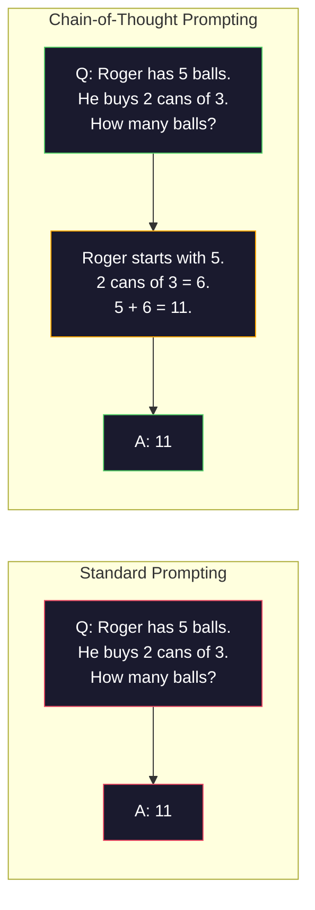
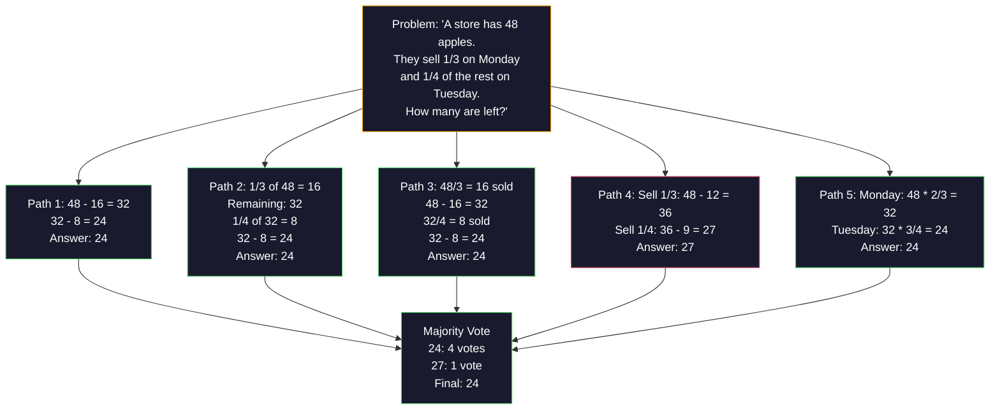
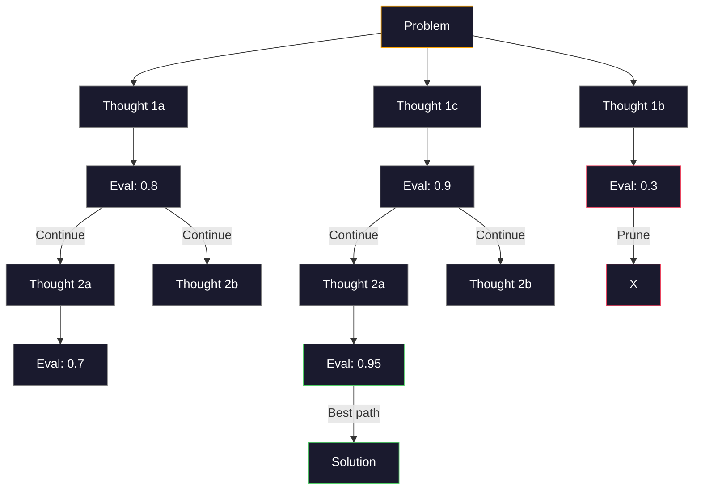

# Few-Shot, Chain-of-Thought, Tree-of-Thought

> Сказать модели, что делать, - это prompting. Показать ей, как думать, - это инженерия. Разница между 78% и 91% точности на той же модели, той же задаче и тех же данных - это не более сильная модель. Это лучшая стратегия рассуждения.

**Тип:** Build
**Языки:** Python
**Требования:** Урок 11.01 (Prompt Engineering)
**Время:** ~45 минут
**Требуется:** платный API (Anthropic/OpenAI)

## Цели обучения

- Реализовать few-shot prompting через выбор и форматирование демонстрационных примеров, максимизирующих точность задачи
- Применить рассуждение chain-of-thought (CoT), чтобы повысить точность на многошаговых задачах, например текстовых математических задачах
- Построить prompt tree-of-thought, который исследует несколько траекторий рассуждения и выбирает лучшую
- Измерить прирост точности от zero-shot, few-shot и CoT на стандартном бенчмарке

## Проблема

Вы строите приложение для обучения математике. Ваш prompt говорит: "Solve this word problem." GPT-5 решает задачу правильно в 94% случаев на GSM8K, стандартном бенчмарке школьных математических задач. Вы думаете, что уже достигли потолка. Нет - chain-of-thought все еще добавляет 3-4 пункта.

Добавьте пять слов -- "Let's think step by step" -- и точность подскакивает до 91%. Добавьте несколько решенных примеров, и она достигает 95%. Та же модель. Та же temperature. Та же стоимость API. Единственное отличие в том, что вы дали модели черновик.

Это не хак. Так работает рассуждение. Люди не решают многошаговые задачи одним мысленным скачком. Трансформеры тоже. Когда вы заставляете модель генерировать промежуточные токены, эти токены становятся частью контекста для следующего токена. Каждый шаг рассуждения питает следующий. Модель буквально вычисляет путь к ответу.

Но "think step by step" - это начало, а не конец. Что если сэмплировать пять траекторий рассуждения и взять majority vote? Что если позволить модели исследовать дерево возможностей, оценивая и отсекая ветви? Что если чередовать рассуждение с использованием инструментов? Это не гипотезы. Это опубликованные техники с измеренными улучшениями, и в этом уроке вы построите их все.

## Концепция

### Zero-Shot vs Few-Shot: когда примеры лучше инструкций

Zero-shot prompting дает модели задачу и больше ничего. Few-shot prompting сначала дает ей примеры.

Wei et al. (2022) измерили это на 8 бенчмарках. Для простых задач вроде классификации тональности zero-shot и few-shot отличались в пределах 2%. Для сложных задач вроде многошаговой арифметики и символьного рассуждения few-shot повышал точность на 10-25%.

Интуиция: примеры - это сжатые инструкции. Вместо того чтобы описывать формат вывода, вы показываете его. Вместо того чтобы объяснять процесс рассуждения, вы демонстрируете его. Модель сопоставляет паттерн по примерам надежнее, чем интерпретирует абстрактные инструкции.


**Когда few-shot выигрывает:** задачи, чувствительные к формату, классификация, структурированное извлечение, доменно-специфический жаргон, любая задача, где модели нужно совпасть с конкретным паттерном.

**Когда zero-shot выигрывает:** простые фактологические вопросы, творческие задачи, где примеры ограничивают креативность, задачи, где найти хорошие примеры сложнее, чем написать хорошие инструкции.

### Выбор примеров: похожие лучше случайных

Не все примеры равны. Выбор примеров, похожих на целевой вход, превосходит случайный выбор на 5-15% в задачах классификации (Liu et al., 2022). Три принципа:

1. **Семантическое сходство**: выбирайте примеры, ближайшие к входу в embedding space
2. **Разнообразие меток**: покрывайте все категории вывода в ваших примерах
3. **Соответствие сложности**: сопоставляйте уровень сложности целевой задачи

Оптимальное число примеров для большинства задач - 3-5. Меньше 3 - у модели недостаточно сигнала, чтобы извлечь паттерн. Больше 5 - вы упираетесь в убывающую отдачу и тратите токены context window. Для классификации с большим числом меток используйте по одному примеру на метку.

### Chain-of-Thought: даем моделям черновик

Chain-of-Thought (CoT) prompting был представлен Wei et al. (2022) в Google Brain. Идея проста: вместо того чтобы просить у модели только ответ, попросите ее сначала показать шаги рассуждения.



Почему это работает механически? Каждый токен, который генерирует трансформер, становится контекстом для следующего токена. Без CoT модель должна сжать все рассуждение в hidden state одного forward pass. С CoT модель выносит промежуточные вычисления наружу как токены. Каждый токен рассуждения увеличивает эффективную глубину вычисления.

**Бенчмарки GSM8K (школьная математика, 8.5K задач):**

| Модель | Zero-Shot | Zero-Shot CoT | Few-Shot CoT |
|-------|-----------|---------------|--------------|
| GPT-4o | 78% | 91% | 95% |
| GPT-5 | 94% | 97% | 98% |
| o4-mini (reasoning) | 97% | — | — |
| Claude Opus 4.7 | 93% | 97% | 98% |
| Gemini 3 Pro | 92% | 96% | 98% |
| Llama 4 70B | 80% | 89% | 94% |
| DeepSeek-V3.1 | 89% | 94% | 96% |

**Примечание о reasoning models.** Модели вроде OpenAI o-series (o3, o4-mini) и DeepSeek-R1 запускают chain-of-thought внутренне до выдачи ответа. Добавлять "Let's think step by step" к reasoning model избыточно, а иногда контрпродуктивно - они уже сделали это.

Два варианта CoT:

**Zero-shot CoT**: добавить "Let's think step by step" к prompt. Примеры не нужны. Kojima et al. (2022) показали, что это одно предложение повышает точность на задачах арифметического, commonsense и символьного рассуждения.

**Few-shot CoT**: предоставить примеры, включающие шаги рассуждения. Эффективнее, чем zero-shot CoT, потому что модель видит точный формат рассуждения, который вы ожидаете.

**Когда CoT вредит**: простое фактологическое вспоминание ("What is the capital of France?"), одношаговая классификация, задачи, где скорость важнее точности. CoT добавляет 50-200 токенов накладных расходов на рассуждение на каждый запрос. Для высоконагруженных задач низкой сложности это лишняя стоимость.

### Self-Consistency: сэмплируйте много, голосуйте один раз

Wang et al. (2023) представили self-consistency. Инсайт: один путь CoT может содержать ошибки рассуждения. Но если сэмплировать N независимых путей рассуждения (используя temperature > 0) и взять majority vote по финальному ответу, ошибки взаимно сокращаются.



Self-consistency улучшила точность GSM8K с 56.5% (один CoT) до 74.4% при N=40 в исходных экспериментах PaLM 540B. На GPT-5 улучшение мало (с 97% до 98%), потому что базовая точность уже насыщена. Техника лучше всего проявляет себя на моделях с 60-85% базовой CoT-точности - это sweet spot, где ошибки одного пути часты, но не систематичны. Для reasoning models (o-series, R1) self-consistency поглощается встроенным внутренним сэмплированием.

Компромисс: N сэмплов означает Nx стоимость API и задержку. На практике N=5 дает большую часть пользы. N=3 - минимум для осмысленного голосования. N > 10 дает убывающую отдачу для большинства задач.

### Tree-of-Thought: ветвящееся исследование

Yao et al. (2023) представили Tree-of-Thought (ToT). Там, где CoT следует одному линейному пути рассуждения, ToT исследует несколько ветвей и оценивает, какие из них наиболее перспективны, прежде чем продолжать.



ToT состоит из трех компонентов:

1. **Генерация мыслей**: создать несколько кандидатов следующего шага
2. **Оценка состояния**: поставить оценку каждому кандидату (можно использовать сам LLM как evaluator)
3. **Алгоритм поиска**: BFS или DFS по дереву с отсечением низкооцененных ветвей

На задаче Game of 24 (объединить 4 числа арифметическими операциями, чтобы получить 24) GPT-4 со стандартным prompting решает 7.3% задач. С CoT - 4.0% (CoT здесь фактически вредит, потому что пространство поиска широко). С ToT - 74%.

ToT дорог. Каждый узел дерева требует LLM-вызова. Дерево с branching factor 3 и depth 3 требует до 39 LLM-вызовов. Используйте его только для задач, где пространство поиска велико, но оцениваемо: планирование, решение головоломок, творческое решение задач с ограничениями.

### ReAct: мышление + действие

Yao et al. (2022) объединили трассы рассуждения с действиями. Модель чередует мышление (генерацию рассуждения) и действие (вызов инструментов, поиск, вычисления).

```mermaid
graph LR
    Q["Question:\nWhat is the\npopulation of the\ncountry where\nthe Eiffel Tower\nis located?"]
    T1["Thought: I need to\nfind which country\nhas the Eiffel Tower"]
    A1["Action: search\n'Eiffel Tower location'"]
    O1["Observation:\nParis, France"]
    T2["Thought: Now I need\nFrance's population"]
    A2["Action: search\n'France population 2024'"]
    O2["Observation:\n68.4 million"]
    T3["Thought: I have\nthe answer"]
    F["Answer:\n68.4 million"]

    Q --> T1 --> A1 --> O1 --> T2 --> A2 --> O2 --> T3 --> F

    style Q fill:#1a1a2e,stroke:#ffa500,color:#fff
    style T1 fill:#1a1a2e,stroke:#51cf66,color:#fff
    style A1 fill:#1a1a2e,stroke:#e94560,color:#fff
    style O1 fill:#1a1a2e,stroke:#808080,color:#fff
    style T2 fill:#1a1a2e,stroke:#51cf66,color:#fff
    style A2 fill:#1a1a2e,stroke:#e94560,color:#fff
    style O2 fill:#1a1a2e,stroke:#808080,color:#fff
    style T3 fill:#1a1a2e,stroke:#51cf66,color:#fff
    style F fill:#1a1a2e,stroke:#51cf66,color:#fff
```



ReAct превосходит чистый CoT на knowledge-intensive задачах, потому что может заземлять рассуждение в реальных данных. На HotpotQA (multi-hop question answering) ReAct с GPT-4 достигает 35.1% exact match против 29.4% у одного CoT. Реальная сила в том, что ошибки рассуждения исправляются наблюдениями - модель может обновлять план в ходе выполнения.

ReAct - основа современных AI agents. Каждый агентный фреймворк (LangChain, CrewAI, AutoGen) реализует какой-то вариант цикла Thought-Action-Observation. Полных агентов вы будете строить в Phase 14. Этот урок покрывает prompting pattern.

### Структурированный prompting: XML Tags, Delimiters, Headers

По мере усложнения prompts структура не дает модели путать разделы. Три подхода:

**XML tags** (лучше всего работает с Claude, надежно почти везде):
```
<context>
You are reviewing a pull request.
The codebase uses TypeScript and React.
</context>

<task>
Review the following diff for bugs, security issues, and style violations.
</task>

<diff>
{diff_content}
</diff>

<output_format>
List each issue with: file, line, severity (critical/warning/info), description.
</output_format>
```

**Markdown headers** (универсально):
```
## Role
Senior security engineer at a fintech company.

## Task
Analyze this API endpoint for vulnerabilities.

## Input
{api_code}

## Rules
- Focus on OWASP Top 10
- Rate each finding: critical, high, medium, low
- Include remediation steps
```

**Delimiters** (минимально, но эффективно):
```
---INPUT---
{user_text}
---END INPUT---

---INSTRUCTIONS---
Summarize the above in 3 bullet points.
---END INSTRUCTIONS---
```

### Prompt Chaining: последовательная декомпозиция

Некоторые задачи слишком сложны для одного prompt. Prompt chaining разбивает их на шаги, где вывод одного prompt становится входом следующего.


Chaining лучше одного prompt по трем причинам:

1. **Каждый шаг проще**: модель выполняет одну сфокусированную задачу, а не удерживает все сразу
2. **Промежуточные выводы можно проверять**: вы можете валидировать и исправлять между шагами
3. **Разные шаги могут использовать разные модели**: используйте дешевую модель для извлечения, дорогую - для рассуждения

### Сравнение производительности

| Техника | Лучше всего для | Точность GSM8K (GPT-5) | API-вызовы | Накладные токены | Сложность |
|-----------|----------|------------------------|-----------|----------------|------------|
| Zero-Shot | Простые задачи | 94% | 1 | Нет | Тривиальная |
| Few-Shot | Совпадение формата | 96% | 1 | 200-500 токенов | Низкая |
| Zero-Shot CoT | Быстрый прирост рассуждения | 97% | 1 | 50-200 токенов | Тривиальная |
| Few-Shot CoT | Максимальная точность за один вызов | 98% | 1 | 300-600 токенов | Низкая |
| Self-Consistency (N=5) | Рассуждение с высокими ставками | 98.5% | 5 | 5x стоимость токенов | Средняя |
| Reasoning model (o4-mini) | Drop-in замена CoT | 97% | 1 | скрытые (2-10x внутренние) | Тривиальная |
| Tree-of-Thought | Задачи поиска/планирования | N/A (74% на Game of 24) | 10-40+ | 10-40x стоимость токенов | Высокая |
| ReAct | Knowledge-grounded рассуждение | N/A (35.1% на HotpotQA) | 3-10+ | Переменные | Высокая |
| Prompt Chaining | Сложные многошаговые задачи | 96% (pipeline) | 2-5 | 2-5x стоимость токенов | Средняя |

Правильная техника зависит от трех факторов: требования к точности, бюджет задержки и терпимость к стоимости. Для большинства production systems few-shot CoT с fallback self-consistency на 3 сэмпла покрывает 90% use cases.

## Построим

Мы построим решатель математических задач, который объединяет few-shot prompting, chain-of-thought reasoning и self-consistency voting в единый pipeline. Затем добавим tree-of-thought для сложных задач.

Полная реализация находится в `code/advanced_prompting.py`. Вот ключевые компоненты.

### Шаг 1: хранилище few-shot примеров

Первый компонент управляет few-shot примерами и выбирает наиболее релевантные для заданной задачи.

```python
GSM8K_EXAMPLES = [
    {
        "question": "Janet's ducks lay 16 eggs per day. She eats three for breakfast every morning and bakes muffins for her friends every day with four. She sells every egg at the farmers' market for $2. How much does she make every day at the farmers' market?",
        "reasoning": "Janet's ducks lay 16 eggs per day. She eats 3 and bakes 4, using 3 + 4 = 7 eggs. So she has 16 - 7 = 9 eggs left. She sells each for $2, so she makes 9 * 2 = $18 per day.",
        "answer": "18"
    },
    ...
]
```

У каждого примера три части: вопрос, цепочка рассуждения и финальный ответ. Цепочка рассуждения превращает обычный few-shot пример в CoT few-shot пример.

### Шаг 2: builder для Chain-of-Thought prompt

Prompt builder собирает system message, few-shot примеры с цепочками рассуждения и целевой вопрос в один prompt.

```python
def build_cot_prompt(question, examples, num_examples=3):
    system = (
        "You are a math problem solver. "
        "For each problem, show your step-by-step reasoning, "
        "then give the final numerical answer on the last line "
        "in the format: 'The answer is [number]'."
    )

    example_text = ""
    for ex in examples[:num_examples]:
        example_text += f"Q: {ex['question']}\n"
        example_text += f"A: {ex['reasoning']} The answer is {ex['answer']}.\n\n"

    user = f"{example_text}Q: {question}\nA:"
    return system, user
```

Ограничение формата ("The answer is [number]") критично. Без него self-consistency не сможет извлекать и сравнивать ответы между сэмплами.

### Шаг 3: голосование Self-Consistency

Сэмплируйте N траекторий рассуждения и берите majority answer.

```python
def self_consistency_solve(question, examples, client, model, n_samples=5):
    system, user = build_cot_prompt(question, examples)

    answers = []
    reasonings = []
    for _ in range(n_samples):
        response = client.chat.completions.create(
            model=model,
            messages=[
                {"role": "system", "content": system},
                {"role": "user", "content": user}
            ],
            temperature=0.7
        )
        text = response.choices[0].message.content
        reasonings.append(text)
        answer = extract_answer(text)
        if answer is not None:
            answers.append(answer)

    vote_counts = Counter(answers)
    best_answer = vote_counts.most_common(1)[0][0] if vote_counts else None
    confidence = vote_counts[best_answer] / len(answers) if best_answer else 0

    return best_answer, confidence, reasonings, vote_counts
```

Temperature 0.7 важна. При temperature 0.0 все N сэмплов были бы идентичны, что уничтожает смысл метода. Вам нужно достаточно случайности для разнообразных траекторий рассуждения, но не настолько много, чтобы модель производила бессмыслицу.

### Шаг 4: решатель Tree-of-Thought

Для задач, где линейное рассуждение не справляется, ToT исследует несколько подходов и оценивает, какое направление наиболее перспективно.

```python
def tree_of_thought_solve(question, client, model, breadth=3, depth=3):
    thoughts = generate_initial_thoughts(question, client, model, breadth)
    scored = [(t, evaluate_thought(t, question, client, model)) for t in thoughts]
    scored.sort(key=lambda x: x[1], reverse=True)

    for current_depth in range(1, depth):
        next_thoughts = []
        for thought, score in scored[:2]:
            extensions = extend_thought(thought, question, client, model, breadth)
            for ext in extensions:
                ext_score = evaluate_thought(ext, question, client, model)
                next_thoughts.append((ext, ext_score))
        scored = sorted(next_thoughts, key=lambda x: x[1], reverse=True)

    best_thought = scored[0][0] if scored else ""
    return extract_answer(best_thought), best_thought
```

Evaluator сам является LLM-вызовом. Вы спрашиваете модель: "On a scale of 0.0 to 1.0, how promising is this reasoning path for solving the problem?" Это ключевой инсайт ToT - модель оценивает собственные частичные решения.

### Шаг 5: полный pipeline

Pipeline объединяет все техники со стратегией escalation.

```python
def solve_with_escalation(question, examples, client, model):
    system, user = build_cot_prompt(question, examples)
    single_response = call_llm(client, model, system, user, temperature=0.0)
    single_answer = extract_answer(single_response)

    sc_answer, confidence, _, _ = self_consistency_solve(
        question, examples, client, model, n_samples=5
    )

    if confidence >= 0.8:
        return sc_answer, "self_consistency", confidence

    tot_answer, _ = tree_of_thought_solve(question, client, model)
    return tot_answer, "tree_of_thought", None
```

Логика escalation: сначала пробуйте дешево (single CoT). Если confidence self-consistency ниже 0.8 (согласны меньше 4 из 5 сэмплов), повышайте до ToT. Это балансирует стоимость и точность - большинство задач решаются дешево, сложные получают больше compute.

## Использование

### С LangChain

LangChain предоставляет встроенную поддержку prompt templates и output parsing, которые упрощают few-shot и CoT patterns:

```python
from langchain_core.prompts import FewShotPromptTemplate, PromptTemplate
from langchain_openai import ChatOpenAI

example_prompt = PromptTemplate(
    input_variables=["question", "reasoning", "answer"],
    template="Q: {question}\nA: {reasoning} The answer is {answer}."
)

few_shot_prompt = FewShotPromptTemplate(
    examples=examples,
    example_prompt=example_prompt,
    suffix="Q: {input}\nA: Let's think step by step.",
    input_variables=["input"]
)

llm = ChatOpenAI(model="gpt-4o", temperature=0.7)
chain = few_shot_prompt | llm
result = chain.invoke({"input": "If a train travels 120 km in 2 hours..."})
```

В LangChain также есть классы `ExampleSelector` для выбора по семантическому сходству:

```python
from langchain_core.example_selectors import SemanticSimilarityExampleSelector
from langchain_openai import OpenAIEmbeddings

selector = SemanticSimilarityExampleSelector.from_examples(
    examples,
    OpenAIEmbeddings(),
    k=3
)
```

### С DSPy

DSPy рассматривает prompting strategies как оптимизируемые модули. Вместо ручного создания CoT prompts вы задаете signature и позволяете DSPy оптимизировать prompt:

```python
import dspy

dspy.configure(lm=dspy.LM("openai/gpt-4o", temperature=0.7))

class MathSolver(dspy.Module):
    def __init__(self):
        self.solve = dspy.ChainOfThought("question -> answer")

    def forward(self, question):
        return self.solve(question=question)

solver = MathSolver()
result = solver(question="Janet's ducks lay 16 eggs per day...")
```

`ChainOfThought` в DSPy автоматически добавляет трассы рассуждения. `dspy.majority` реализует self-consistency:

```python
result = dspy.majority(
    [solver(question=q) for _ in range(5)],
    field="answer"
)
```

### Сравнение: From-Scratch vs Frameworks

| Функция | From-Scratch (этот урок) | LangChain | DSPy |
|---------|--------------------------|-----------|------|
| Контроль над форматом prompt | Полный | На основе templates | Автоматический |
| Self-consistency | Ручное голосование | Ручное | Встроено (`dspy.majority`) |
| Выбор примеров | Пользовательская логика | `ExampleSelector` | `dspy.BootstrapFewShot` |
| Tree-of-Thought | Пользовательский tree search | Community chains | Не встроено |
| Оптимизация prompt | Ручная итерация | Ручная | Автоматическая компиляция |
| Лучше всего для | Обучение, custom pipelines | Стандартные workflows | Исследования, оптимизация |

## Отгрузите это

Этот урок создает два артефакта.

**1. Reasoning Chain Prompt** (`outputs/prompt-reasoning-chain.md`): production-ready prompt template для few-shot CoT с self-consistency. Подставьте свои примеры и предметную область.

**2. CoT Pattern Selection Skill** (`outputs/skill-cot-patterns.md`): decision framework для выбора правильной техники рассуждения на основе типа задачи, требований к точности и ограничений стоимости.

## Упражнения

1. **Измерьте разрыв**: возьмите 10 задач GSM8K. Решите каждую с zero-shot, few-shot, zero-shot CoT и few-shot CoT. Запишите точность каждого метода. Какая техника дает самый большой прирост на вашей модели?

2. **Эксперимент с выбором примеров**: для тех же 10 задач сравните случайный выбор примеров и вручную подобранные похожие примеры. Измерьте разницу точности. В какой момент качество примеров становится важнее их количества?

3. **Кривая стоимости self-consistency**: запустите self-consistency с N=1, 3, 5, 7, 10 на 20 задачах GSM8K. Постройте график accuracy vs cost (total tokens). Где находится изгиб кривой для вашей модели?

4. **Постройте ReAct loop**: расширьте pipeline инструментом калькулятора. Когда модель генерирует математическое выражение, выполняйте его с Python `eval()` (в sandbox) и подавайте результат обратно. Измерьте, превосходит ли tool-grounded reasoning чистый CoT.

5. **ToT для творческих задач**: адаптируйте Tree-of-Thought solver для задачи creative writing: "Write a 6-word story that is both funny and sad." Используйте LLM как evaluator. Дает ли branching exploration лучшие творческие результаты, чем single-shot generation?

## Ключевые термины

| Термин | Как говорят люди | Что это на самом деле значит |
|------|----------------|----------------------|
| Few-shot prompting | "Дайте ей несколько примеров" | Включение демонстраций input-output в prompt, чтобы закрепить формат вывода и поведение модели |
| Chain-of-Thought | "Заставьте ее думать шаг за шагом" | Вызов промежуточных токенов рассуждения, которые расширяют эффективное вычисление модели до финального ответа |
| Self-Consistency | "Запустите несколько раз" | Сэмплирование N разнообразных траекторий рассуждения при temperature > 0 и выбор самого частого финального ответа majority vote |
| Tree-of-Thought | "Пусть исследует варианты" | Структурированный поиск по ветвям рассуждения, где каждое частичное решение оценивается и расширяются только перспективные пути |
| ReAct | "Мышление + использование инструментов" | Чередование трасс рассуждения с внешними действиями (поиск, вычисление, API calls) в цикле Thought-Action-Observation |
| Prompt chaining | "Разбейте на шаги" | Декомпозиция сложной задачи в последовательные prompts, где каждый вывод подается в следующий вход |
| Zero-shot CoT | "Просто добавьте 'think step by step'" | Добавление trigger phrase для рассуждения к prompt без примеров, опираясь на latent reasoning capability модели |

## Дополнительное чтение

- [Chain-of-Thought Prompting Elicits Reasoning in Large Language Models](https://arxiv.org/abs/2201.11903) -- Wei et al. 2022. Оригинальная статья о CoT от Google Brain. Прочитайте разделы 2-3 для основных результатов.
- [Self-Consistency Improves Chain of Thought Reasoning in Language Models](https://arxiv.org/abs/2203.11171) -- Wang et al. 2023. Статья о self-consistency. В Table 1 есть все нужные числа.
- [Tree of Thoughts: Deliberate Problem Solving with Large Language Models](https://arxiv.org/abs/2305.10601) -- Yao et al. 2023. Статья о ToT. Результаты Game of 24 в section 4 - главное.
- [ReAct: Synergizing Reasoning and Acting in Language Models](https://arxiv.org/abs/2210.03629) -- Yao et al. 2022. Основа современных AI agents. Section 3 объясняет цикл Thought-Action-Observation.
- [Large Language Models are Zero-Shot Reasoners](https://arxiv.org/abs/2205.11916) -- Kojima et al. 2022. Статья про "Let's think step by step". Удивительно эффективно для такой простой идеи.
- [DSPy: Compiling Declarative Language Model Calls into Self-Improving Pipelines](https://arxiv.org/abs/2310.03714) -- Khattab et al. 2023. Рассматривает prompting как задачу компиляции. Читайте, если хотите выйти за пределы ручного prompt engineering.
- [OpenAI — Reasoning models guide](https://platform.openai.com/docs/guides/reasoning) -- vendor guidance о том, когда chain-of-thought становится внутренним режимом "reasoning" с оплатой по токенам, а не prompt-level trick.
- [Lightman et al., "Let's Verify Step by Step" (2023)](https://arxiv.org/abs/2305.20050) -- process reward models (PRM), которые оценивают каждый шаг цепочки; сигнал supervision для рассуждения, который превосходит награды только за outcome.
- [Snell et al., "Scaling LLM Test-Time Compute Optimally" (2024)](https://arxiv.org/abs/2408.03314) -- систематическое исследование длины CoT, self-consistency sampling и MCTS; куда движется "think step by step", когда точность важнее задержки.
