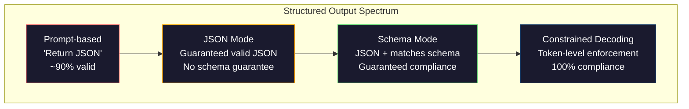
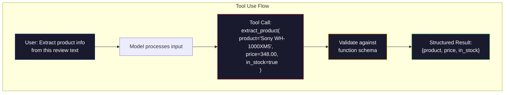

# Структурированные выходные данные: JSON, валидация схем, constrained decoding

> Ваша LLM возвращает строку. Вашему приложению нужен JSON. Из-за этого разрыва падало больше production-систем, чем из-за любых галлюцинаций модели. Структурированный вывод - это мост между естественным языком и типизированными данными. Сделаете правильно - и ваша LLM станет надежным API. Сделаете неправильно - и будете парсить свободный текст регулярными выражениями в 3 часа ночи.

**Тип:** Build
**Языки:** Python
**Предварительные требования:** Phase 10, Lessons 01-05 (LLMs from Scratch)
**Время:** ~90 минут
**Связано:** Phase 5 · 20 (Structured Outputs & Constrained Decoding) рассматривает теорию на уровне декодера (FSM/CFG logit processors, Outlines, XGrammar). Этот урок фокусируется на production-поверхности SDK (OpenAI `response_format`, Anthropic tool use, Instructor) - сначала прочитайте Phase 5 · 20, если хотите понять, что происходит ниже API.

## Цели обучения

- Реализовать JSON-mode и выводы, ограниченные схемой, с использованием параметров OpenAI и Anthropic API
- Построить слой валидации на Pydantic, который отклоняет некорректно сформированные выводы LLM и повторяет попытку с обратной связью об ошибках
- Объяснить, как constrained decoding принуждает к валидному JSON на уровне токенов без постобработки
- Спроектировать надежные промпты для извлечения, которые стабильно преобразуют неструктурированный текст в типизированные структуры данных

## Проблема

Вы спрашиваете LLM: "Extract the product name, price, and availability from this text." Она отвечает:

```
The product is the Sony WH-1000XM5 headphones, which cost $348.00 and are currently in stock.
```

Это совершенно правильный ответ. И он также полностью бесполезен для вашего приложения. Вашей системе управления запасами нужен `{"product": "Sony WH-1000XM5", "price": 348.00, "in_stock": true}`. Вам нужен JSON-объект с конкретными ключами, конкретными типами и конкретными ограничениями значений. Вам не нужно предложение.

Наивное решение: добавить "Respond in JSON" в промпт. Это работает в 90% случаев. В оставшихся 10% модель оборачивает JSON в markdown code fences, добавляет вступление вроде "Here's the JSON:" или создает синтаксически невалидный JSON, потому что слишком рано закрыла скобку. Ваш JSON-парсер падает. Ваш pipeline ломается. Вы добавляете try/except и цикл повторных попыток. Повторная попытка иногда выдает другие данные. Теперь поверх проблемы парсинга у вас появляется проблема согласованности.

Это не проблема prompt engineering. Это проблема декодирования. Модель генерирует токены слева направо. В каждой позиции она выбирает наиболее вероятный следующий токен из словаря в 100K+ вариантов. Большинство этих вариантов в любой данной позиции привели бы к невалидному JSON. Если модель только что выдала `{"price":`, следующий токен должен быть цифрой, кавычкой (для строки), `null`, `true`, `false` или знаком минуса. Все остальное создает невалидный JSON. Без ограничений модель может выбрать вполне разумное английское слово, которое синтаксически катастрофически неверно.

## Концепция

### Спектр структурированного вывода

Есть четыре уровня контроля структурированного вывода, и каждый следующий надежнее предыдущего.



**Prompt-based** ("Respond in valid JSON"): нет принудительного ограничения. Модель обычно подчиняется, но иногда нет. Надежность: ~90%. Режимы отказа: markdown fences, вступительный текст, усеченный вывод, неправильная структура.

**JSON mode**: API гарантирует, что вывод является валидным JSON. В OpenAI это включает `response_format: { type: "json_object" }`. Вывод распарсится без ошибок. Но он может не соответствовать ожидаемой схеме: лишние ключи, неправильные типы, отсутствующие поля.

**Schema mode**: API принимает JSON Schema и гарантирует, что вывод ей соответствует. В 2026 году каждый крупный провайдер поддерживает это нативно: OpenAI `response_format: { type: "json_schema", json_schema: {...} }` (также через `tool_choice="required"`), Anthropic tool use с `input_schema` и Gemini `response_schema` + `response_mime_type: "application/json"`. Вывод содержит ровно те ключи, типы и ограничения, которые вы указали.

**Constrained decoding**: в каждой позиции токена во время генерации декодер маскирует все токены, которые привели бы к невалидному выводу. Если схема требует число, а модель собирается выдать букву, вероятность этого токена устанавливается в ноль. Модель может генерировать только токены, ведущие к валидному выводу. Именно это OpenAI structured output mode и библиотеки вроде Outlines и Guidance реализуют под капотом.

### JSON Schema: язык контракта

JSON Schema - это способ сообщить модели (или слою валидации), какую форму должен иметь вывод. Ее использует каждая крупная система структурированного вывода.

```json
{
  "type": "object",
  "properties": {
    "product": { "type": "string" },
    "price": { "type": "number", "minimum": 0 },
    "in_stock": { "type": "boolean" },
    "categories": {
      "type": "array",
      "items": { "type": "string" }
    }
  },
  "required": ["product", "price", "in_stock"]
}
```

Эта схема говорит: вывод должен быть объектом со строковым `product`, неотрицательным числом `price`, булевым `in_stock` и необязательным массивом строк `categories`. Любой вывод, который не соответствует, отклоняется.

Схемы покрывают сложные случаи: вложенные объекты, массивы с типизированными элементами, перечисления (ограничение строки конкретными значениями), сопоставление с шаблоном (regex для строк) и комбинаторы (oneOf, anyOf, allOf для полиморфных выводов).

### Паттерн Pydantic

В Python вы не пишете JSON Schema вручную. Вы определяете модель Pydantic, и она генерирует схему за вас.

```python
from pydantic import BaseModel

class Product(BaseModel):
    product: str
    price: float
    in_stock: bool
    categories: list[str] = []
```

Это создает ту же JSON Schema, что и выше. Библиотека Instructor (и SDK OpenAI) принимают модели Pydantic напрямую: передаете класс модели, получаете обратно валидированный экземпляр. Если вывод LLM не соответствует, Instructor автоматически повторяет попытку.

### Function Calling / Tool Use

Альтернативный интерфейс для той же проблемы. Вместо того чтобы просить модель напрямую создать JSON, вы определяете "tools" (функции) с типизированными параметрами. Модель выводит вызов функции со структурированными аргументами. OpenAI называет это "function calling". Anthropic называет это "tool use". Результат тот же: структурированные данные.



Tool use предпочтителен, когда модели нужно выбрать, какую функцию вызвать, а не просто заполнить параметры. Если у вас есть 10 разных схем извлечения и модель должна выбрать правильную на основе входа, tool use дает и выбор схемы, и структурированный вывод.

### Распространенные режимы отказа

Даже при принудительном соблюдении схемы структурированные выводы могут ломаться тонкими способами.

**Галлюцинированные значения**: вывод соответствует схеме, но содержит выдуманные данные. Модель выдает `{"price": 299.99}`, когда в тексте указано $348. Валидация схемы не может это поймать: тип корректен, значение неверно.

**Путаница enum**: вы ограничиваете поле значениями `["in_stock", "out_of_stock", "preorder"]`. Модель выводит `"available"` - семантически корректно, но значения нет в разрешенном наборе. Хороший constrained decoding предотвращает это. Подходы на основе промпта - нет.

**Глубина вложенных объектов**: глубоко вложенные схемы (4+ уровня) порождают больше ошибок. Каждый уровень вложенности - еще одно место, где модель может потерять структуру.

**Длина массива**: модель может создать слишком много или слишком мало элементов в массиве. Схемы поддерживают `minItems` и `maxItems`, но не все провайдеры принудительно соблюдают их на уровне декодирования.

**Пропуск необязательного поля**: модель пропускает поля, которые технически необязательны, но семантически важны для вашего сценария. Помечайте их как required в схеме, даже если данные иногда отсутствуют: заставьте модель явно выдать `null`.

## Соберите это

### Шаг 1: валидатор JSON Schema

Постройте валидатор с нуля, который проверяет, соответствует ли Python-объект JSON Schema. Именно он запускается на стороне вывода, чтобы проверить соответствие.

```python
import json

def validate_schema(data, schema):
    errors = []
    _validate(data, schema, "", errors)
    return errors

def _validate(data, schema, path, errors):
    schema_type = schema.get("type")

    if schema_type == "object":
        if not isinstance(data, dict):
            errors.append(f"{path}: expected object, got {type(data).__name__}")
            return
        for key in schema.get("required", []):
            if key not in data:
                errors.append(f"{path}.{key}: required field missing")
        properties = schema.get("properties", {})
        for key, value in data.items():
            if key in properties:
                _validate(value, properties[key], f"{path}.{key}", errors)

    elif schema_type == "array":
        if not isinstance(data, list):
            errors.append(f"{path}: expected array, got {type(data).__name__}")
            return
        min_items = schema.get("minItems", 0)
        max_items = schema.get("maxItems", float("inf"))
        if len(data) < min_items:
            errors.append(f"{path}: array has {len(data)} items, minimum is {min_items}")
        if len(data) > max_items:
            errors.append(f"{path}: array has {len(data)} items, maximum is {max_items}")
        items_schema = schema.get("items", {})
        for i, item in enumerate(data):
            _validate(item, items_schema, f"{path}[{i}]", errors)

    elif schema_type == "string":
        if not isinstance(data, str):
            errors.append(f"{path}: expected string, got {type(data).__name__}")
            return
        enum_values = schema.get("enum")
        if enum_values and data not in enum_values:
            errors.append(f"{path}: '{data}' not in allowed values {enum_values}")

    elif schema_type == "number":
        if not isinstance(data, (int, float)):
            errors.append(f"{path}: expected number, got {type(data).__name__}")
            return
        minimum = schema.get("minimum")
        maximum = schema.get("maximum")
        if minimum is not None and data < minimum:
            errors.append(f"{path}: {data} is less than minimum {minimum}")
        if maximum is not None and data > maximum:
            errors.append(f"{path}: {data} is greater than maximum {maximum}")

    elif schema_type == "boolean":
        if not isinstance(data, bool):
            errors.append(f"{path}: expected boolean, got {type(data).__name__}")

    elif schema_type == "integer":
        if not isinstance(data, int) or isinstance(data, bool):
            errors.append(f"{path}: expected integer, got {type(data).__name__}")
```

### Шаг 2: модель в стиле Pydantic в схему

Постройте минимальный конвертер из класса в схему. Определите Python-класс и автоматически сгенерируйте его JSON Schema.

```python
class SchemaField:
    def __init__(self, field_type, required=True, default=None, enum=None, minimum=None, maximum=None):
        self.field_type = field_type
        self.required = required
        self.default = default
        self.enum = enum
        self.minimum = minimum
        self.maximum = maximum

def python_type_to_schema(field):
    type_map = {
        str: "string",
        int: "integer",
        float: "number",
        bool: "boolean",
    }

    schema = {}

    if field.field_type in type_map:
        schema["type"] = type_map[field.field_type]
    elif field.field_type == list:
        schema["type"] = "array"
        schema["items"] = {"type": "string"}
    elif isinstance(field.field_type, dict):
        schema = field.field_type

    if field.enum:
        schema["enum"] = field.enum
    if field.minimum is not None:
        schema["minimum"] = field.minimum
    if field.maximum is not None:
        schema["maximum"] = field.maximum

    return schema

def model_to_schema(name, fields):
    properties = {}
    required = []

    for field_name, field in fields.items():
        properties[field_name] = python_type_to_schema(field)
        if field.required:
            required.append(field_name)

    return {
        "type": "object",
        "properties": properties,
        "required": required,
    }
```

### Шаг 3: фильтр constrained token

Сымитируйте constrained decoding. По частичной JSON-строке и схеме определите, какие категории токенов валидны в текущей позиции.

```python
def next_valid_tokens(partial_json, schema):
    stripped = partial_json.strip()

    if not stripped:
        return ["{"]

    try:
        json.loads(stripped)
        return ["<EOS>"]
    except json.JSONDecodeError:
        pass

    last_char = stripped[-1] if stripped else ""

    if last_char == "{":
        return ['"', "}"]
    elif last_char == '"':
        if stripped.endswith('":'):
            return ['"', "0-9", "true", "false", "null", "[", "{"]
        return ["a-z", '"']
    elif last_char == ":":
        return [" ", '"', "0-9", "true", "false", "null", "[", "{"]
    elif last_char == ",":
        return [" ", '"', "{", "["]
    elif last_char in "0123456789":
        return ["0-9", ".", ",", "}", "]"]
    elif last_char == "}":
        return [",", "}", "]", "<EOS>"]
    elif last_char == "]":
        return [",", "}", "<EOS>"]
    elif last_char == "[":
        return ['"', "0-9", "true", "false", "null", "{", "[", "]"]
    else:
        return ["any"]

def demonstrate_constrained_decoding():
    partial_states = [
        '',
        '{',
        '{"product"',
        '{"product":',
        '{"product": "Sony"',
        '{"product": "Sony",',
        '{"product": "Sony", "price":',
        '{"product": "Sony", "price": 348',
        '{"product": "Sony", "price": 348}',
    ]

    print(f"{'Partial JSON':<45} {'Valid Next Tokens'}")
    print("-" * 80)
    for state in partial_states:
        valid = next_valid_tokens(state, {})
        display = state if state else "(empty)"
        print(f"{display:<45} {valid}")
```

### Шаг 4: pipeline извлечения

Объедините все в pipeline извлечения: определите схему, сымитируйте LLM, создающую структурированный вывод, провалидируйте вывод и обработайте повторные попытки.

```python
def simulate_llm_extraction(text, schema, attempt=0):
    if "headphones" in text.lower() or "sony" in text.lower():
        if attempt == 0:
            return '{"product": "Sony WH-1000XM5", "price": 348.00, "in_stock": true, "categories": ["audio", "headphones"]}'
        return '{"product": "Sony WH-1000XM5", "price": 348.00, "in_stock": true}'

    if "laptop" in text.lower():
        return '{"product": "MacBook Pro 16", "price": 2499.00, "in_stock": false, "categories": ["computers"]}'

    return '{"product": "Unknown", "price": 0, "in_stock": false}'

def extract_with_retry(text, schema, max_retries=3):
    for attempt in range(max_retries):
        raw = simulate_llm_extraction(text, schema, attempt)

        try:
            data = json.loads(raw)
        except json.JSONDecodeError as e:
            print(f"  Attempt {attempt + 1}: JSON parse error -- {e}")
            continue

        errors = validate_schema(data, schema)
        if not errors:
            return data

        print(f"  Attempt {attempt + 1}: Schema validation errors -- {errors}")

    return None

product_schema = {
    "type": "object",
    "properties": {
        "product": {"type": "string"},
        "price": {"type": "number", "minimum": 0},
        "in_stock": {"type": "boolean"},
        "categories": {"type": "array", "items": {"type": "string"}},
    },
    "required": ["product", "price", "in_stock"],
}
```

### Шаг 5: запустите полный pipeline

```python
def run_demo():
    print("=" * 60)
    print("  Structured Output Pipeline Demo")
    print("=" * 60)

    print("\n--- Schema Definition ---")
    product_fields = {
        "product": SchemaField(str),
        "price": SchemaField(float, minimum=0),
        "in_stock": SchemaField(bool),
        "categories": SchemaField(list, required=False),
    }
    generated_schema = model_to_schema("Product", product_fields)
    print(json.dumps(generated_schema, indent=2))

    print("\n--- Schema Validation ---")
    test_cases = [
        ({"product": "Test", "price": 10.0, "in_stock": True}, "Valid object"),
        ({"product": "Test", "price": -5.0, "in_stock": True}, "Negative price"),
        ({"product": "Test", "in_stock": True}, "Missing price"),
        ({"product": "Test", "price": "ten", "in_stock": True}, "String as price"),
        ("not an object", "String instead of object"),
    ]

    for data, label in test_cases:
        errors = validate_schema(data, product_schema)
        status = "PASS" if not errors else f"FAIL: {errors}"
        print(f"  {label}: {status}")

    print("\n--- Constrained Decoding Simulation ---")
    demonstrate_constrained_decoding()

    print("\n--- Extraction Pipeline ---")
    texts = [
        "The Sony WH-1000XM5 headphones are priced at $348 and currently available.",
        "The new MacBook Pro 16-inch laptop costs $2499 but is sold out.",
        "This is a random sentence with no product info.",
    ]

    for text in texts:
        print(f"\n  Input: {text[:60]}...")
        result = extract_with_retry(text, product_schema)
        if result:
            print(f"  Output: {json.dumps(result)}")
        else:
            print(f"  Output: FAILED after retries")
```

## Используйте это

### OpenAI Structured Outputs

```python
# from openai import OpenAI
# from pydantic import BaseModel
#
# client = OpenAI()
#
# class Product(BaseModel):
#     product: str
#     price: float
#     in_stock: bool
#
# response = client.beta.chat.completions.parse(
#     model="gpt-5-mini",
#     messages=[
#         {"role": "system", "content": "Extract product information."},
#         {"role": "user", "content": "Sony WH-1000XM5, $348, in stock"},
#     ],
#     response_format=Product,
# )
#
# product = response.choices[0].message.parsed
# print(product.product, product.price, product.in_stock)
```

Режим структурированного вывода OpenAI использует constrained decoding внутри. Каждый токен, который генерирует модель, гарантированно ведет к выводу, соответствующему схеме Pydantic. Повторные попытки не нужны. Валидация не нужна. Ограничение встроено в процесс декодирования.

### Anthropic Tool Use

```python
# import anthropic
#
# client = anthropic.Anthropic()
#
# response = client.messages.create(
#     model="claude-opus-4-7",
#     max_tokens=1024,
#     tools=[{
#         "name": "extract_product",
#         "description": "Extract product information from text",
#         "input_schema": {
#             "type": "object",
#             "properties": {
#                 "product": {"type": "string"},
#                 "price": {"type": "number"},
#                 "in_stock": {"type": "boolean"},
#             },
#             "required": ["product", "price", "in_stock"],
#         },
#     }],
#     messages=[{"role": "user", "content": "Extract: Sony WH-1000XM5, $348, in stock"}],
# )
```

Anthropic достигает структурированного вывода через tool use. Модель испускает tool call со структурированными аргументами, которые соответствуют input_schema. Тот же результат, другая поверхность API.

### Библиотека Instructor

```python
# pip install instructor
# import instructor
# from openai import OpenAI
# from pydantic import BaseModel
#
# client = instructor.from_openai(OpenAI())
#
# class Product(BaseModel):
#     product: str
#     price: float
#     in_stock: bool
#
# product = client.chat.completions.create(
#     model="gpt-5-mini",
#     response_model=Product,
#     messages=[{"role": "user", "content": "Sony WH-1000XM5, $348, in stock"}],
# )
```

Instructor оборачивает любой LLM-клиент и добавляет автоматические повторные попытки с валидацией. Если первая попытка не проходит валидацию, он отправляет ошибки обратно модели как контекст и просит исправить вывод. Это работает с любым провайдером, не только с OpenAI.

## Отправьте это

Этот урок создает `outputs/prompt-structured-extractor.md` - переиспользуемый шаблон промпта, который извлекает структурированные данные из любого текста по заданному определению схемы. Передайте ему JSON Schema и неструктурированный текст, и он вернет валидированный JSON.

Он также создает `outputs/skill-structured-outputs.md` - фреймворк принятия решений для выбора правильной стратегии структурированного вывода на основе вашего провайдера, требований к надежности и сложности схемы.

## Упражнения

1. Расширьте валидатор схемы поддержкой `oneOf` (данные должны соответствовать ровно одной из нескольких схем). Это покрывает полиморфные выводы - например, поле, которое может быть либо объектом `Product`, либо объектом `Service` с другой формой.

2. Постройте инструмент "schema diff", который сравнивает две схемы и определяет breaking changes (удаленные обязательные поля, измененные типы) в сравнении с non-breaking changes (добавленные необязательные поля, ослабленные ограничения). Это необходимо для версионирования ваших схем извлечения в production.

3. Реализуйте более реалистичный симулятор constrained decoding. Получив JSON Schema и словарь из 100 токенов (буквы, цифры, пунктуация, ключевые слова), пройдите генерацию шаг за шагом, маскируя невалидные токены в каждой позиции. Измерьте, какой процент словаря валиден на каждом шаге.

4. Постройте eval suite для извлечения. Создайте 50 описаний продуктов с вручную размеченными JSON-выводами. Запустите ваш pipeline извлечения на всех 50 и измерьте exact match, field-level accuracy и type compliance. Определите, какие поля сложнее всего извлекать корректно.

5. Добавьте "confidence scores" в pipeline извлечения. Для каждого извлеченного поля оцените, насколько модель уверена (на основе вероятностей токенов или через запуск извлечения 3 раза и измерение согласованности). Помечайте поля с низкой уверенностью для проверки человеком.

## Ключевые термины

| Термин | Как говорят | Что это на самом деле означает |
|------|----------------|----------------------|
| JSON mode | "Returns JSON" | Флаг API, который гарантирует синтаксически валидный JSON-вывод, но не принуждает к какой-либо конкретной схеме |
| Structured output | "Typed JSON" | Вывод, который соответствует конкретной JSON Schema с правильными ключами, типами и ограничениями |
| Constrained decoding | "Guided generation" | В каждой позиции токена маскировать токены, которые привели бы к невалидному выводу; гарантирует 100% соответствие схеме |
| JSON Schema | "A JSON template" | Декларативный язык для описания структуры, типов и ограничений JSON-данных (используется OpenAPI, JSON Forms и т. д.) |
| Pydantic | "Python dataclasses+" | Python-библиотека, которая определяет модели данных с валидацией типов; используется FastAPI и Instructor для генерации JSON Schemas |
| Function calling | "Tool use" | LLM выводит структурированный вызов функции (имя + типизированные аргументы) вместо свободного текста; OpenAI и Anthropic оба поддерживают это |
| Instructor | "Pydantic for LLMs" | Python-библиотека, которая оборачивает LLM-клиентов, чтобы возвращать валидированные экземпляры Pydantic, с автоматическим повтором при ошибке валидации |
| Token masking | "Filtering the vocabulary" | Установка вероятностей конкретных токенов в ноль во время генерации, чтобы модель не могла их создать |
| Schema compliance | "Matches the shape" | Вывод содержит каждое обязательное поле, правильные типы, значения в пределах ограничений и не содержит лишних запрещенных полей |
| Retry loop | "Try again until it works" | Отправить ошибки валидации обратно модели и попросить исправить вывод; Instructor делает это автоматически до настраиваемого максимума |

## Дополнительное чтение

- [OpenAI Structured Outputs Guide](https://platform.openai.com/docs/guides/structured-outputs) - официальная документация по constrained decoding на основе JSON Schema в OpenAI API
- [Willard & Louf, 2023 -- "Efficient Guided Generation for Large Language Models"](https://arxiv.org/abs/2307.09702) - статья Outlines, описывающая, как компилировать JSON Schemas в конечные автоматы для ограничений на уровне токенов
- [Instructor documentation](https://python.useinstructor.com/) - стандартная библиотека для получения структурированных выводов из любой LLM с валидацией Pydantic и повторными попытками
- [Anthropic Tool Use Guide](https://docs.anthropic.com/en/docs/tool-use) - как Claude реализует структурированный вывод через tool use с JSON Schema input_schema
- [JSON Schema specification](https://json-schema.org/) - полная спецификация языка схем, используемого каждой крупной системой структурированного вывода
- [Outlines library](https://github.com/outlines-dev/outlines) - open-source constrained generation с использованием regex и JSON Schema, скомпилированных в конечные автоматы
- [Dong et al., "XGrammar: Flexible and Efficient Structured Generation Engine for Large Language Models" (MLSys 2025)](https://arxiv.org/abs/2411.15100) - современный state-of-the-art grammar engine; компиляция pushdown automaton, которая маскирует токены примерно за ~100 ns / token.
- [Beurer-Kellner et al., "Prompting Is Programming: A Query Language for Large Language Models" (LMQL)](https://arxiv.org/abs/2212.06094) - статья LMQL, представляющая constrained decoding как язык запросов с ограничениями типов и значений.
- [Microsoft Guidance (framework docs)](https://github.com/guidance-ai/guidance) - template-driven constrained generation; vendor-agnostic дополнение к Outlines и XGrammar.
