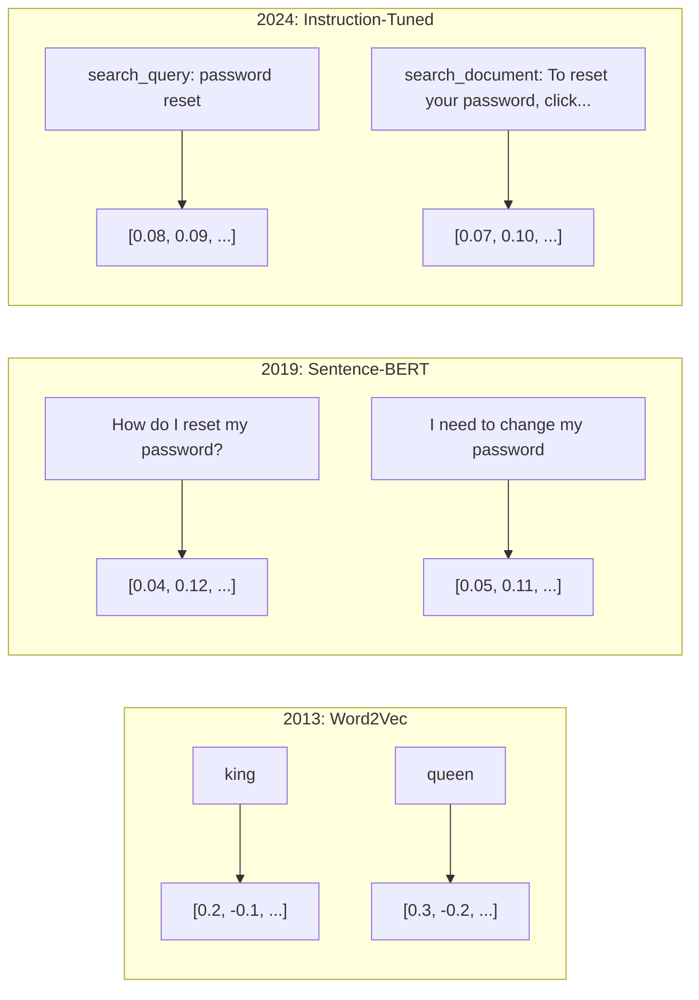
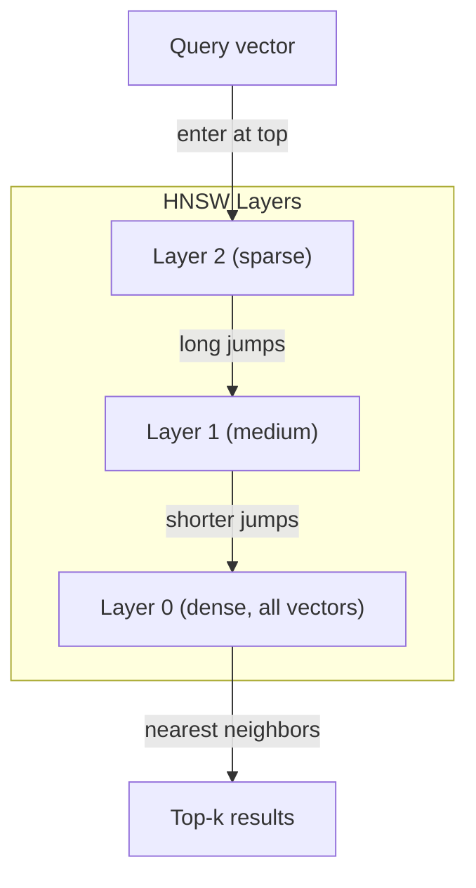

# Эмбеддинги и векторные представления

> Текст дискретен. Математика непрерывна. Каждый раз, когда вы просите LLM найти "похожие" документы, сравнить смыслы или искать шире ключевых слов, вы опираетесь на мост между этими двумя мирами. Этот мост и есть эмбеддинг. Если вы не понимаете эмбеддинги, вы не понимаете современный ИИ. Вы просто им пользуетесь.

**Тип:** Сборка
**Языки:** Python
**Предварительные требования:** Phase 11, Lesson 01 (Prompt Engineering)
**Время:** ~75 минут
**Связано:** Phase 5 · 22 (Embedding Models Deep Dive) разбирает dense vs sparse vs multi-vector, усечение Matryoshka и выбор модели по осям. Этот урок фокусируется на production-пайплайне (векторные БД, HNSW, математика сходства). Прочитайте Phase 5 · 22 перед выбором модели.

## Цели обучения

- Генерировать текстовые эмбеддинги с помощью API-провайдеров и open-source моделей, а также вычислять косинусное сходство между ними
- Объяснять, почему эмбеддинги решают проблему несовпадения словаря, с которой не справляется поиск по ключевым словам
- Построить индекс семантического поиска, который извлекает документы по смыслу, а не по точному совпадению ключевых слов
- Оценивать качество эмбеддингов с помощью retrieval-бенчмарков (precision@k, recall) и выбирать подходящую embedding-модель для своей задачи

## Проблема

У вас есть 10,000 тикетов поддержки. Клиент пишет "my payment didn't go through." Вам нужно найти похожие прошлые тикеты. Поиск по ключевым словам находит тикеты, содержащие "payment" и "didn't go through." Он пропускает "transaction failed," "charge was declined," и "billing error." Эти тикеты описывают ровно ту же проблему совершенно другими словами.

Это проблема несовпадения словаря. В человеческом языке есть десятки способов сказать одно и то же. Поиск по ключевым словам воспринимает каждое слово как независимый символ без смысла. Он не может знать, что "declined" и "didn't go through" относятся к одному и тому же понятию.

Вам нужно представление текста, где сходство определяется смыслом, а не написанием. Вам нужен способ разместить "my payment didn't go through" и "transaction was declined" близко друг к другу в некотором математическом пространстве, при этом отодвинув "my payment arrived on time" далеко, несмотря на общее слово "payment."

Такое представление называется эмбеддингом.

## Концепция

### Что такое эмбеддинг?

Эмбеддинг — это плотный вектор чисел с плавающей точкой, представляющий смысл текста. Слово "плотный" важно -- каждое измерение несет информацию, в отличие от разреженных представлений (bag-of-words, TF-IDF), где большинство измерений равны нулю.

"The cat sat on the mat" превращается во что-то вроде `[0.023, -0.041, 0.087, ..., 0.012]` -- список из 768 до 3072 чисел в зависимости от модели. Эти числа кодируют смысл. Вы никогда не рассматриваете их напрямую. Вы их сравниваете.

### Прорыв Word2Vec

В 2013 году Tomas Mikolov и коллеги из Google опубликовали Word2Vec. Ключевая идея: обучить нейросеть предсказывать слово по его соседям (или соседей по слову), и веса скрытого слоя станут осмысленными векторными представлениями.

Знаменитый результат:

```
king - man + woman = queen
```

Векторная арифметика над эмбеддингами слов улавливает семантические отношения. Направление от "man" к "woman" примерно такое же, как направление от "king" к "queen." Это был момент, когда область поняла, что геометрия может кодировать смысл.

Word2Vec создавал 300-мерные векторы. Каждое слово получало один вектор независимо от контекста. "Bank" в "river bank" и "bank account" имел один и тот же эмбеддинг. Это ограничение определило следующее десятилетие исследований.

### От слов к предложениям

Эмбеддинги слов представляют отдельные токены. Production-системам нужно встраивать целые предложения, абзацы или документы. Появились четыре подхода:

**Усреднение**: взять среднее всех векторов слов в предложении. Дешево, с потерями, неожиданно неплохо для короткого текста. Полностью теряет порядок слов -- "dog bites man" и "man bites dog" получают одинаковые эмбеддинги.

**CLS token**: transformer-модели (BERT, 2018) выдают специальный эмбеддинг [CLS] token, представляющий весь ввод. Лучше, чем усреднение, но [CLS] token обучался для предсказания следующего предложения, а не для сходства.

**Контрастивное обучение**: обучать модель явно сближать похожие пары и отдалять непохожие. Sentence-BERT (Reimers & Gurevych, 2019) использовал этот подход и стал основой современных embedding-моделей. На примере "How do I reset my password?" и "I need to change my password," модель учится тому, что у них должны быть почти одинаковые векторы.

**Instruction-tuned embeddings**: новейший подход. Модели вроде E5 и GTE принимают префикс задачи ("search_query:", "search_document:"), который сообщает модели, какой тип эмбеддинга нужно создать. Это позволяет одной модели обслуживать несколько задач.



### Современные embedding-модели

Рынок сошелся к нескольким production-ready вариантам (оценки MTEB на начало 2026 года, MTEB v2):

| Модель | Провайдер | Размерности | MTEB | Контекст | Стоимость / 1M токенов |
|-------|----------|-----------|------|---------|------------------|
| Gemini Embedding 2 | Google | 3072 (Matryoshka) | 67.7 (retrieval) | 8192 | $0.15 |
| embed-v4 | Cohere | 1024 (Matryoshka) | 65.2 | 128K | $0.12 |
| voyage-4 | Voyage AI | 1024/2048 (Matryoshka) | 66.8 | 32K | $0.12 |
| text-embedding-3-large | OpenAI | 3072 (Matryoshka) | 64.6 | 8192 | $0.13 |
| text-embedding-3-small | OpenAI | 1536 (Matryoshka) | 62.3 | 8192 | $0.02 |
| BGE-M3 | BAAI | 1024 (dense+sparse+ColBERT) | 63.0 multilingual | 8192 | Open-weight |
| Qwen3-Embedding | Alibaba | 4096 (Matryoshka) | 66.9 | 32K | Open-weight |
| Nomic-embed-v2 | Nomic | 768 (Matryoshka) | 63.1 | 8192 | Open-weight |

MTEB (Massive Text Embedding Benchmark) v2 охватывает 100+ задач по retrieval, классификации, кластеризации, reranking и суммаризации. Чем выше, тем лучше. К 2026 году open-weight модели (Qwen3-Embedding, BGE-M3) сравнялись с закрытыми hosted-моделями или превосходят их по большинству осей. Gemini Embedding 2 лидирует в чистом retrieval; Voyage/Cohere лидируют в отдельных доменах (финансы, право, код). Всегда проводите benchmark на собственных запросах перед окончательным выбором.

### Метрики сходства

Для двух embedding-векторов есть три способа измерить, насколько они похожи:

**Косинусное сходство**: косинус угла между двумя векторами. Диапазон от -1 (противоположные) до 1 (одинаковое направление). Игнорирует длину -- предложение из 10 слов и документ из 500 слов могут получить 1.0, если направлены одинаково. Это значение по умолчанию для 90% use cases.

```
cosine_sim(a, b) = dot(a, b) / (||a|| * ||b||)
```

**Скалярное произведение**: сырое внутреннее произведение двух векторов. Идентично косинусному сходству, когда векторы нормализованы (единичной длины). Вычисляется быстрее. Эмбеддинги OpenAI нормализованы, поэтому dot product и cosine дают одинаковое ранжирование.

```
dot(a, b) = sum(a_i * b_i)
```

**Евклидово (L2) расстояние**: расстояние по прямой в векторном пространстве. Меньше = более похоже. Чувствительно к различиям в длине. Используйте, когда важна абсолютная позиция в пространстве, а не только направление.

```
L2(a, b) = sqrt(sum((a_i - b_i)^2))
```

Когда что использовать:

| Метрика | Используйте, когда | Избегайте, когда |
|--------|----------|------------|
| Косинусное сходство | Сравниваете тексты разной длины; большинство retrieval-задач | Длина вектора несет информацию |
| Dot product | Эмбеддинги уже нормализованы; нужна максимальная скорость | У векторов разные длины |
| Евклидово расстояние | Кластеризация; пространственные задачи ближайших соседей | Сравниваете документы сильно разной длины |

### Векторные базы данных и HNSW

Полный перебор для similarity search сравнивает запрос с каждым сохраненным вектором. При 1 миллионе векторов с 1536 измерениями это 1.5 миллиарда операций умножения-сложения на запрос. Слишком медленно.

Векторные базы данных решают это с помощью алгоритмов Approximate Nearest Neighbor (ANN). Доминирующий алгоритм — HNSW (Hierarchical Navigable Small World):

1. Построить многослойный граф векторов
2. Верхние слои разрежены -- дальние связи между удаленными кластерами
3. Нижние слои плотные -- детальные связи между близкими векторами
4. Поиск начинается с верхнего слоя и жадно спускается для уточнения
5. Возвращает приближенные top-k результаты за O(log n) вместо O(n)

HNSW обменивает небольшую потерю точности (обычно 95-99% recall) на огромный прирост скорости. На 10 миллионах векторов полный перебор занимает секунды. HNSW занимает миллисекунды.



Production-варианты:

| База данных | Тип | Лучше всего для | Максимальный масштаб |
|----------|------|----------|-----------|
| Pinecone | Managed SaaS | Production без операционной нагрузки | Миллиарды |
| Weaviate | Open source | Self-hosted, гибридный поиск | 100M+ |
| Qdrant | Open source | Высокая производительность, фильтрация | 100M+ |
| ChromaDB | Embedded | Прототипирование, локальная разработка | 1M |
| pgvector | Postgres extension | Уже используете Postgres | 10M |
| FAISS | Library | In-process, исследования | 1B+ |

### Стратегии chunking

Документы слишком длинные, чтобы встраивать их как одиночные векторы. PDF на 50 страниц охватывает десятки тем -- его эмбеддинг становится средним от всего и не похож ни на что конкретное. Вы разбиваете документы на chunks и встраиваете каждый chunk отдельно.

**Fixed-size chunking**: разбивать каждые N токенов с перекрытием в M токенов. Просто и предсказуемо. Хорошо работает, когда у документов нет четкой структуры. Chunk из 512 токенов с перекрытием 50 токенов: chunk 1 — токены 0-511, chunk 2 — токены 462-973.

**Sentence-based chunking**: разбивать по границам предложений, группируя предложения до достижения лимита токенов. Каждый chunk содержит как минимум одно полное предложение. Лучше fixed-size, потому что вы никогда не разрезаете мысль пополам.

**Recursive chunking**: сначала пытаться разбить по самой крупной границе (заголовки разделов). Если все еще слишком крупно, пробовать границы абзацев. Затем границы предложений. Затем лимиты символов. Это LangChain `RecursiveCharacterTextSplitter`, и он хорошо работает для корпусов смешанного формата.

**Semantic chunking**: встроить каждое предложение, затем группировать соседние предложения, эмбеддинги которых похожи. Когда embedding similarity падает ниже порога, начинать новый chunk. Дорого (требует embedding каждого предложения отдельно), но дает самые связные chunks.

| Стратегия | Сложность | Качество | Лучше всего для |
|----------|-----------|---------|----------|
| Fixed-size | Низкая | Приемлемое | Неструктурированный текст, логи |
| Sentence-based | Низкая | Хорошее | Статьи, email |
| Recursive | Средняя | Хорошее | Markdown, HTML, смешанные документы |
| Semantic | Высокая | Лучшее | Критически важное качество retrieval |

Оптимальная точка для большинства систем: chunks по 256-512 токенов с перекрытием 50 токенов.

### Bi-Encoders vs Cross-Encoders

Bi-encoder встраивает запрос и документы независимо, затем сравнивает векторы. Быстро -- вы встраиваете запрос один раз и сравниваете с заранее вычисленными эмбеддингами документов. Это используется для retrieval.

Cross-encoder принимает запрос и документ как единый ввод и выдает оценку релевантности. Медленно -- он прогоняет каждую пару запрос-документ через всю модель. Но гораздо точнее, потому что может одновременно учитывать токены запроса и документа.

Production-паттерн: bi-encoder извлекает top-100 кандидатов, cross-encoder reranks их до top-10. Это пайплайн retrieve-then-rerank.


Reranking-модели: Cohere Rerank 3.5 ($2 за 1000 запросов), BGE-reranker-v2 (бесплатная, open source), Jina Reranker v2 (бесплатная, open source).

### Matryoshka Embeddings

Традиционные эмбеддинги работают по принципу "все или ничего". 1536-мерный вектор использует 1536 floats. Вы не можете усечь его до 256 измерений без переобучения.

Matryoshka Representation Learning (Kusupati et al., 2022) исправляет это. Модель обучается так, чтобы первые N измерений содержали самую важную информацию, как русская матрешка. Усечение 1536-d Matryoshka embedding до 256 измерений теряет часть точности, но остается работоспособным.

OpenAI text-embedding-3-small и text-embedding-3-large поддерживают усечение Matryoshka через параметр `dimensions`. Запрос 256 измерений вместо 1536 сокращает хранение в 6x при примерно 3-5% потере точности на MTEB benchmarks.

### Binary Quantization

1536-мерный эмбеддинг, сохраненный как float32, занимает 6,144 байта. Умножьте на 10 миллионов документов: 61 GB только на векторы.

Binary quantization преобразует каждый float в один бит: положительные значения становятся 1, отрицательные — 0. Хранение падает с 6,144 байта до 192 байт -- сокращение в 32x. Сходство вычисляется через Hamming distance (подсчет отличающихся битов), что CPU умеют делать одной инструкцией.

Потеря точности составляет около 5-10% по retrieval recall. Общий паттерн: binary quantization для первого прохода поиска по миллионам векторов, затем пересчитать top-1000 с full-precision vectors. Это дает 95%+ точности full-precision при памяти в 32x меньше.

## Собираем

Мы строим semantic search engine с нуля. Без векторной базы данных. Без внешнего embedding API. Чистый Python с numpy для математики.

### Шаг 1: Нарезка текста

```python
def chunk_text(text, chunk_size=200, overlap=50):
    words = text.split()
    chunks = []
    start = 0
    while start < len(words):
        end = start + chunk_size
        chunk = " ".join(words[start:end])
        chunks.append(chunk)
        start += chunk_size - overlap
    return chunks


def chunk_by_sentences(text, max_chunk_tokens=200):
    sentences = text.replace("\n", " ").split(".")
    sentences = [s.strip() + "." for s in sentences if s.strip()]
    chunks = []
    current_chunk = []
    current_length = 0
    for sentence in sentences:
        sentence_length = len(sentence.split())
        if current_length + sentence_length > max_chunk_tokens and current_chunk:
            chunks.append(" ".join(current_chunk))
            current_chunk = []
            current_length = 0
        current_chunk.append(sentence)
        current_length += sentence_length
    if current_chunk:
        chunks.append(" ".join(current_chunk))
    return chunks
```

### Шаг 2: Построение эмбеддингов с нуля

Мы реализуем простой плотный эмбеддинг с помощью TF-IDF и L2-нормализации. Это не нейросетевой эмбеддинг, но он следует тому же контракту: текст на входе, вектор фиксированного размера на выходе, похожие тексты дают похожие векторы.

```python
import math
import numpy as np
from collections import Counter

class SimpleEmbedder:
    def __init__(self):
        self.vocab = []
        self.idf = []
        self.word_to_idx = {}

    def fit(self, documents):
        vocab_set = set()
        for doc in documents:
            vocab_set.update(doc.lower().split())
        self.vocab = sorted(vocab_set)
        self.word_to_idx = {w: i for i, w in enumerate(self.vocab)}
        n = len(documents)
        self.idf = np.zeros(len(self.vocab))
        for i, word in enumerate(self.vocab):
            doc_count = sum(1 for doc in documents if word in doc.lower().split())
            self.idf[i] = math.log((n + 1) / (doc_count + 1)) + 1

    def embed(self, text):
        words = text.lower().split()
        count = Counter(words)
        total = len(words) if words else 1
        vec = np.zeros(len(self.vocab))
        for word, freq in count.items():
            if word in self.word_to_idx:
                tf = freq / total
                vec[self.word_to_idx[word]] = tf * self.idf[self.word_to_idx[word]]
        norm = np.linalg.norm(vec)
        if norm > 0:
            vec = vec / norm
        return vec
```

### Шаг 3: Функции сходства

```python
def cosine_similarity(a, b):
    dot = np.dot(a, b)
    norm_a = np.linalg.norm(a)
    norm_b = np.linalg.norm(b)
    if norm_a == 0 or norm_b == 0:
        return 0.0
    return float(dot / (norm_a * norm_b))


def dot_product(a, b):
    return float(np.dot(a, b))


def euclidean_distance(a, b):
    return float(np.linalg.norm(a - b))
```

### Шаг 4: Векторный индекс с brute-force search

```python
class VectorIndex:
    def __init__(self):
        self.vectors = []
        self.texts = []
        self.metadata = []

    def add(self, vector, text, meta=None):
        self.vectors.append(vector)
        self.texts.append(text)
        self.metadata.append(meta or {})

    def search(self, query_vector, top_k=5, metric="cosine"):
        scores = []
        for i, vec in enumerate(self.vectors):
            if metric == "cosine":
                score = cosine_similarity(query_vector, vec)
            elif metric == "dot":
                score = dot_product(query_vector, vec)
            elif metric == "euclidean":
                score = -euclidean_distance(query_vector, vec)
            else:
                raise ValueError(f"Unknown metric: {metric}")
            scores.append((i, score))
        scores.sort(key=lambda x: x[1], reverse=True)
        results = []
        for idx, score in scores[:top_k]:
            results.append({
                "text": self.texts[idx],
                "score": score,
                "metadata": self.metadata[idx],
                "index": idx
            })
        return results

    def size(self):
        return len(self.vectors)
```

### Шаг 5: Semantic Search Engine

```python
class SemanticSearchEngine:
    def __init__(self, chunk_size=200, overlap=50):
        self.embedder = SimpleEmbedder()
        self.index = VectorIndex()
        self.chunk_size = chunk_size
        self.overlap = overlap

    def index_documents(self, documents, source_names=None):
        all_chunks = []
        all_sources = []
        for i, doc in enumerate(documents):
            chunks = chunk_text(doc, self.chunk_size, self.overlap)
            all_chunks.extend(chunks)
            name = source_names[i] if source_names else f"doc_{i}"
            all_sources.extend([name] * len(chunks))
        self.embedder.fit(all_chunks)
        for chunk, source in zip(all_chunks, all_sources):
            vec = self.embedder.embed(chunk)
            self.index.add(vec, chunk, {"source": source})
        return len(all_chunks)

    def search(self, query, top_k=5, metric="cosine"):
        query_vec = self.embedder.embed(query)
        return self.index.search(query_vec, top_k, metric)

    def search_with_scores(self, query, top_k=5):
        results = self.search(query, top_k)
        return [
            {
                "text": r["text"][:200],
                "source": r["metadata"].get("source", "unknown"),
                "score": round(r["score"], 4)
            }
            for r in results
        ]
```

### Шаг 6: Сравнение метрик сходства

```python
def compare_metrics(engine, query, top_k=3):
    results = {}
    for metric in ["cosine", "dot", "euclidean"]:
        hits = engine.search(query, top_k=top_k, metric=metric)
        results[metric] = [
            {"score": round(h["score"], 4), "preview": h["text"][:80]}
            for h in hits
        ]
    return results
```

## Используем

С production embedding API архитектура остается идентичной. Меняется только embedder:

```python
from openai import OpenAI

client = OpenAI()

def openai_embed(texts, model="text-embedding-3-small", dimensions=None):
    kwargs = {"model": model, "input": texts}
    if dimensions:
        kwargs["dimensions"] = dimensions
    response = client.embeddings.create(**kwargs)
    return [item.embedding for item in response.data]
```

Усечение Matryoshka с OpenAI -- та же модель, меньше измерений, ниже затраты на хранение:

```python
full = openai_embed(["semantic search query"], dimensions=1536)
compact = openai_embed(["semantic search query"], dimensions=256)
```

256-d вектор использует в 6x меньше места. Для 10 миллионов документов это 10 GB против 61 GB. Потеря точности составляет примерно 3-5% на стандартных benchmarks.

Для reranking с Cohere:

```python
import cohere

co = cohere.ClientV2()

results = co.rerank(
    model="rerank-v3.5",
    query="What is the refund policy?",
    documents=["Full refund within 30 days...", "No refunds after 90 days..."],
    top_n=3
)
```

Для локальных эмбеддингов без зависимости от API:

```python
from sentence_transformers import SentenceTransformer

model = SentenceTransformer("BAAI/bge-small-en-v1.5")
embeddings = model.encode(["semantic search query", "another document"])
```

Класс VectorIndex из нашей сборки работает с любым из этих вариантов. Замените embedding function, оставьте search logic.

## Доводим до результата

Этот урок создает:
- `outputs/prompt-embedding-advisor.md` -- промпт для выбора embedding-моделей и стратегий под конкретные use cases
- `outputs/skill-embedding-patterns.md` -- skill, который обучает агентов эффективно использовать эмбеддинги в production

## Упражнения

1. **Сравнение метрик**: запустите одни и те же 5 запросов по sample documents, используя cosine similarity, dot product и euclidean distance. Запишите top-3 results для каждой. Для каких запросов метрики расходятся? Почему?

2. **Эксперимент с размером chunk**: проиндексируйте sample documents с размерами chunk 50, 100, 200 и 500 слов. Для каждого запустите 5 запросов и запишите top-1 similarity score. Постройте график зависимости между размером chunk и качеством retrieval. Найдите точку, где большие chunks начинают вредить.

3. **Симуляция Matryoshka**: создайте SimpleEmbedder, который производит 500-d vectors. Усеките до 50, 100, 200 и 500 измерений. Измерьте, как retrieval recall ухудшается при каждом усечении. Это симулирует поведение Matryoshka без настоящего training trick.

4. **Binary quantization**: возьмите эмбеддинги из search engine, преобразуйте их в binary (1 для положительных, 0 для отрицательных) и реализуйте поиск по Hamming distance. Сравните top-10 results с full-precision cosine similarity. Измерьте процент пересечения.

5. **Sentence-based chunking**: замените fixed-size chunking на `chunk_by_sentences`. Запустите те же запросы и сравните retrieval scores. Улучшает ли учет границ предложений результаты?

## Ключевые термины

| Термин | Как говорят | Что это на самом деле значит |
|------|----------------|----------------------|
| Embedding | "Текст в числа" | Плотный вектор, в котором геометрическая близость кодирует семантическое сходство |
| Word2Vec | "Первый классический embedding" | Модель 2013 года, которая учила word vectors, предсказывая контекстные слова; доказала, что векторная арифметика кодирует смысл |
| Cosine similarity | "Насколько похожи два вектора" | Косинус угла между векторами; 1 = одинаковое направление, 0 = ортогональны, -1 = противоположны |
| HNSW | "Быстрый vector search" | Hierarchical Navigable Small World graph -- многослойная структура, обеспечивающая O(log n) приближенный поиск ближайших соседей |
| Bi-encoder | "Встраивать отдельно, сравнивать быстро" | Кодирует запрос и документ независимо в векторы; позволяет pre-computation и быстрый retrieval |
| Cross-encoder | "Медленный, но точный reranker" | Обрабатывает пару запрос-документ совместно через всю модель; выше точность, нет pre-computation |
| Matryoshka embeddings | "Усекаемые векторы" | Эмбеддинги, обученные так, что первые N измерений содержат самую важную информацию, что позволяет хранение переменного размера |
| Binary quantization | "1-битные embeddings" | Преобразование float-векторов в binary (только sign bit) для сокращения хранения в 32x с поиском по Hamming distance |
| Chunking | "Разбить документы для embedding" | Разбиение документов на сегменты по 256-512 токенов, чтобы каждый можно было независимо встроить и извлечь |
| Vector database | "Поисковик для embeddings" | Хранилище данных, оптимизированное для хранения векторов и выполнения приближенного nearest neighbor search в масштабе |
| Contrastive learning | "Обучение через сравнение" | Подход к обучению, который сближает эмбеддинги похожих пар и отдаляет эмбеддинги непохожих пар |
| MTEB | "Benchmark для embeddings" | Massive Text Embedding Benchmark -- 56 датасетов по 8 задачам; стандарт для сравнения embedding-моделей |

## Дополнительное чтение

- Mikolov et al., "Efficient Estimation of Word Representations in Vector Space" (2013) -- статья Word2Vec, начавшая революцию эмбеддингов с аналогией king-queen
- Reimers & Gurevych, "Sentence-BERT: Sentence Embeddings using Siamese BERT-Networks" (2019) -- как обучать bi-encoders для сходства на уровне предложений, основа современных embedding-моделей
- Kusupati et al., "Matryoshka Representation Learning" (2022) -- техника за эмбеддингами переменной размерности, которую OpenAI приняла для text-embedding-3
- Malkov & Yashunin, "Efficient and Robust Approximate Nearest Neighbor using Hierarchical Navigable Small World Graphs" (2018) -- статья HNSW, алгоритма за большинством production vector search
- OpenAI Embeddings Guide (platform.openai.com/docs/guides/embeddings) -- практический справочник по моделям text-embedding-3, включая уменьшение размерности Matryoshka
- MTEB Leaderboard (huggingface.co/spaces/mteb/leaderboard) -- live benchmark, сравнивающий все embedding-модели по задачам и языкам
- [Muennighoff et al., "MTEB: Massive Text Embedding Benchmark" (EACL 2023)](https://arxiv.org/abs/2210.07316) -- benchmark, задающий 8 категорий задач (classification, clustering, pair classification, reranking, retrieval, STS, summarization, bitext mining), которые показывает leaderboard; прочитайте перед тем, как доверять одному MTEB score.
- [Sentence Transformers documentation](https://www.sbert.net/) -- канонический справочник по bi-encoder vs cross-encoder, pooling strategies и ingest-split-embed-store RAG pipeline, который реализует этот урок.
