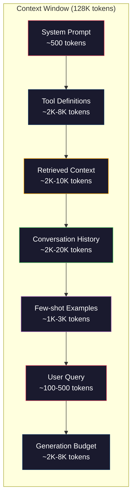
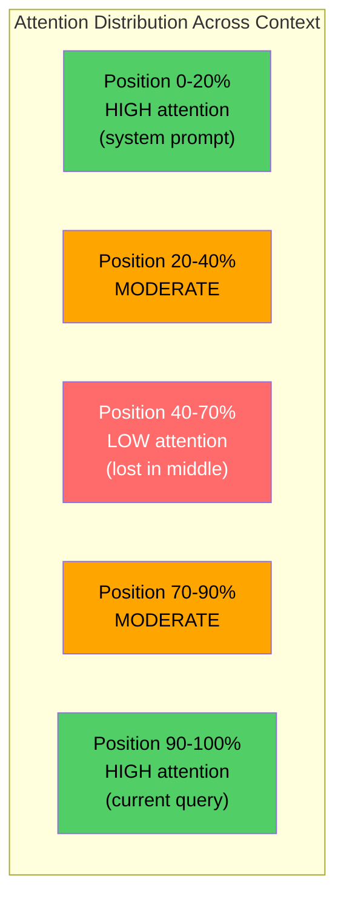
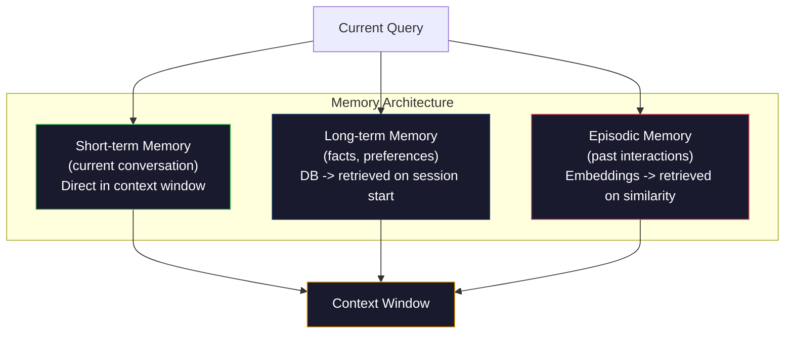

# Context Engineering: Windows, Budgets, Memory, and Retrieval

> Prompt engineering — это подмножество. Context engineering — вся игра. Prompt — строка, которую вы вводите. Context — все, что попадает в окно модели: system instructions, retrieved documents, tool definitions, conversation history, few-shot examples и сам prompt. Лучшие AI engineers в 2026 году — context engineers. Они решают, что входит, что остается снаружи и в каком порядке.

**Тип:** Сборка
**Языки:** Python
**Предварительные требования:** Phase 10 (LLMs from Scratch), Phase 11 Lesson 01-02
**Время:** ~90 минут
**Связано:** Phase 11 · 15 (Prompt Caching) — cache-friendly layout является продолжением context engineering. Phase 5 · 28 (Long-Context Evaluation) о том, как измерять lost-in-the-middle с NIAH/RULER.

## Цели обучения

- Рассчитывать token budgets по всем компонентам context window (system prompt, tools, history, retrieved docs, generation headroom)
- Реализовать стратегии управления context window: truncation, summarization и sliding window для conversation history
- Приоритизировать и упорядочивать context components, чтобы максимизировать внимание модели к самой релевантной информации
- Построить context assembler, который динамически выделяет tokens по query type и доступному window space

## Проблема

Claude Opus 4.7 имеет окно 200K tokens (1M in beta). GPT-5 — 400K. Gemini 3 Pro — 2M. Llama 4 заявляет 10M. Эти числа кажутся огромными, пока вы не начнете их заполнять.

Реальный breakdown для coding assistant: system prompt — 500 tokens. Tool definitions для 50 tools — 8,000 tokens. Retrieved documentation — 4,000 tokens. Conversation history (10 turns) — 6,000 tokens. Current user query — 200 tokens. Generation budget (max output) — 4,000 tokens. Total: 22,700 tokens. Это всего 18% окна 128K.

Но attention не масштабируется линейно с длиной context. Модель с 128K tokens платит quadratic attention cost (O(n^2) in vanilla transformers, хотя production models используют efficient attention variants). Еще важнее: retrieval accuracy деградирует. Тест "Needle in a Haystack" показывает, что модели плохо находят информацию в середине длинного context. Liu et al. (2023) показали: LLMs почти идеально извлекают информацию в начале и конце long contexts, но accuracy падает на 10-20% для информации в середине (positions 40-70% of the context). Этот эффект "lost-in-the-middle" зависит от модели, но затрагивает текущие architectures.

Практический урок: наличие 200K tokens не означает, что использовать 200K tokens эффективно. Аккуратно curated context на 10K tokens часто лучше dumped context на 100K tokens. Context engineering — дисциплина максимизации signal-to-noise ratio внутри context window.

Каждый token в окне вытесняет token, который мог бы нести более релевантную информацию. Каждое нерелевантное tool definition, устаревший conversation turn, chunk retrieved text, который не отвечает на question, немного ухудшает модель на задаче.

## Концепция

### Context Window — дефицитный ресурс

Думайте о context window как о RAM, а не disk. Он быстрый и напрямую доступный, но ограниченный. Нельзя поместить все. Нужно выбирать.



Каждый component конкурирует за space. Больше tool definitions означает меньше места для conversation history. Больше retrieved context означает меньше места для few-shot examples. Context engineering — искусство распределения этого budget для максимальной task performance.

### Lost-in-the-Middle

Самое важное эмпирическое наблюдение в context engineering: модели лучше attend к информации в начале и конце context. Информация в середине получает lower attention scores и чаще игнорируется.

Liu et al. (2023) проверили это системно. Они помещали relevant document среди 20 irrelevant documents на разные positions и измеряли answer accuracy. Когда relevant document был first или last, accuracy была 85-90%. В середине (position 10 of 20) она падала до 60-70%.

Инженерные выводы:

- Самую важную информацию ставьте first (system prompt, critical instructions)
- Current query и most relevant context ставьте last (recency bias помогает)
- Середину context считайте lowest-priority zone
- Если важную информацию нужно включить в середину, продублируйте key point в конце



### Context Components

**System prompt**: задает persona, constraints и behavioral rules. Он идет first и остается constant across turns. Claude Code использует примерно 6,000 tokens для system prompt, включая tool definitions и behavioral instructions. Держите его tight: каждое слово повторяется на каждом API call.

**Tool definitions**: каждый tool добавляет 50-200 tokens (name, description, parameter schema). 50 tools по 150 tokens — это 7,500 tokens до начала conversation. Dynamic tool selection — включение только tools, relevant to current query — может сократить это на 60-80%.

**Retrieved context**: documents from vector database, search results, file contents. Quality of retrieval directly determines quality of response. Bad retrieval хуже, чем no retrieval: он заполняет window noise и активно вводит model в заблуждение.

**Conversation history**: every previous user message and assistant response. Растет linearly with conversation length. Conversation на 50 turns по 200 tokens — 10,000 tokens history. Большая часть нерелевантна current query.

**Few-shot examples**: input/output pairs, демонстрирующие desired behavior. Два-три well-chosen examples часто улучшают output quality сильнее, чем тысячи tokens instructions. Но они стоят space.

**Generation budget**: tokens, reserved for model response. Если заполнить window полностью, модели не останется места для ответа. Reserve at least 2,000-4,000 tokens for generation.

### Context Compression Strategies

**History summarization**: вместо хранения всех previous turns verbatim периодически summarizing conversation. "We discussed X, decided Y, and the user wants Z" in 100 tokens replaces 10 turns that took 2,000 tokens. Запускайте summarization, когда history превышает threshold (например, 5,000 tokens).

**Relevance filtering**: score каждый retrieved document against current query и drop documents below threshold. Если retrieved 10 chunks, но relevant only 3, discard other 7.

**Tool pruning**: classify user query intent и include only tools relevant to that intent. Code question не требует calendar tools. Scheduling question не требует file system tools. Это может сократить tool definitions с 8,000 tokens до 1,000.

**Recursive summarization**: для очень long documents summarize in stages. Сначала each section, затем summaries of summaries. Документ на 50 страниц становится digest на 500 tokens.

### Memory Systems

**Short-term memory**: current conversation. Stored directly in context window. Растет с каждым turn. Управляется summarization и truncation.

**Long-term memory**: facts and preferences, persistent across conversations. "The user prefers TypeScript." "The project uses PostgreSQL." Stored in database, retrieved on session start. Claude Code хранит это в CLAUDE.md files. ChatGPT хранит это в memory feature.

**Episodic memory**: specific past interactions, которые могут быть relevant. "Last Tuesday, we debugged a similar issue in the auth module." Stored as embeddings, retrieved when current conversation matches a past episode.



### Dynamic Context Assembly

Ключевая мысль: разные queries требуют разного context. Static system prompt + static tools + static history расточительны. Лучшие systems dynamically assemble context per query.

1. Classify the query intent
2. Select relevant tools (not all tools)
3. Retrieve relevant documents (not a fixed set)
4. Include relevant history turns (not all history)
5. Add few-shot examples that match the task type
6. Order everything by importance: critical first, important last, optional in the middle

## Собираем

### Шаг 1: Счетчик токенов

Нельзя budget то, что нельзя measure. Постройте простой token counter (approximation using whitespace splitting, потому что exact count зависит от tokenizer).

```python
import json
import numpy as np
from collections import OrderedDict

def count_tokens(text):
    if not text:
        return 0
    return int(len(text.split()) * 1.3)

def count_tokens_json(obj):
    return count_tokens(json.dumps(obj))
```

### Шаг 2: Менеджер бюджета контекста

Core abstraction. Budget manager tracks how many tokens each component uses and enforces limits.

```python
class ContextBudget:
    def __init__(self, max_tokens=128000, generation_reserve=4000):
        self.max_tokens = max_tokens
        self.generation_reserve = generation_reserve
        self.available = max_tokens - generation_reserve
        self.allocations = OrderedDict()

    def allocate(self, component, content, max_tokens=None):
        tokens = count_tokens(content)
        if max_tokens and tokens > max_tokens:
            words = content.split()
            target_words = int(max_tokens / 1.3)
            content = " ".join(words[:target_words])
            tokens = count_tokens(content)

        used = sum(self.allocations.values())
        if used + tokens > self.available:
            allowed = self.available - used
            if allowed <= 0:
                return None, 0
            words = content.split()
            target_words = int(allowed / 1.3)
            content = " ".join(words[:target_words])
            tokens = count_tokens(content)

        self.allocations[component] = tokens
        return content, tokens

    def remaining(self):
        used = sum(self.allocations.values())
        return self.available - used

    def utilization(self):
        used = sum(self.allocations.values())
        return used / self.max_tokens

    def report(self):
        total_used = sum(self.allocations.values())
        lines = []
        lines.append(f"Context Budget Report ({self.max_tokens:,} token window)")
        lines.append("-" * 50)
        for component, tokens in self.allocations.items():
            pct = tokens / self.max_tokens * 100
            bar = "#" * int(pct / 2)
            lines.append(f"  {component:<25} {tokens:>6} tokens ({pct:>5.1f}%) {bar}")
        lines.append("-" * 50)
        lines.append(f"  {'Used':<25} {total_used:>6} tokens ({total_used/self.max_tokens*100:.1f}%)")
        lines.append(f"  {'Generation reserve':<25} {self.generation_reserve:>6} tokens")
        lines.append(f"  {'Remaining':<25} {self.remaining():>6} tokens")
        return "\n".join(lines)
```

### Шаг 3: Переупорядочивание против lost-in-the-middle

Реализуйте reordering strategy: most important items go first and last, least important go in the middle.

```python
def reorder_lost_in_middle(items, scores):
    paired = sorted(zip(scores, items), reverse=True)
    sorted_items = [item for _, item in paired]

    if len(sorted_items) <= 2:
        return sorted_items

    first_half = sorted_items[::2]
    second_half = sorted_items[1::2]
    second_half.reverse()

    return first_half + second_half

def score_relevance(query, documents):
    query_words = set(query.lower().split())
    scores = []
    for doc in documents:
        doc_words = set(doc.lower().split())
        if not query_words:
            scores.append(0.0)
            continue
        overlap = len(query_words & doc_words) / len(query_words)
        scores.append(round(overlap, 3))
    return scores
```

### Шаг 4: Компрессор истории диалога

Summarize old conversation turns to reclaim token budget.

```python
class ConversationManager:
    def __init__(self, max_history_tokens=5000):
        self.turns = []
        self.summaries = []
        self.max_history_tokens = max_history_tokens

    def add_turn(self, role, content):
        self.turns.append({"role": role, "content": content})
        self._compress_if_needed()

    def _compress_if_needed(self):
        total = sum(count_tokens(t["content"]) for t in self.turns)
        if total <= self.max_history_tokens:
            return

        while total > self.max_history_tokens and len(self.turns) > 4:
            old_turns = self.turns[:2]
            summary = self._summarize_turns(old_turns)
            self.summaries.append(summary)
            self.turns = self.turns[2:]
            total = sum(count_tokens(t["content"]) for t in self.turns)

    def _summarize_turns(self, turns):
        parts = []
        for t in turns:
            content = t["content"]
            if len(content) > 100:
                content = content[:100] + "..."
            parts.append(f"{t['role']}: {content}")
        return "Previous: " + " | ".join(parts)

    def get_context(self):
        parts = []
        if self.summaries:
            parts.append("[Conversation Summary]")
            for s in self.summaries:
                parts.append(s)
        parts.append("[Recent Conversation]")
        for t in self.turns:
            parts.append(f"{t['role']}: {t['content']}")
        return "\n".join(parts)

    def token_count(self):
        return count_tokens(self.get_context())
```

### Шаг 5: Динамический выбор инструментов

Включайте только tools, relevant to current query. Classify intent, then filter.

```python
TOOL_REGISTRY = {
    "read_file": {
        "description": "Read contents of a file",
        "tokens": 120,
        "categories": ["code", "files"],
    },
    "write_file": {
        "description": "Write content to a file",
        "tokens": 150,
        "categories": ["code", "files"],
    },
    "search_code": {
        "description": "Search for patterns in codebase",
        "tokens": 130,
        "categories": ["code"],
    },
    "run_command": {
        "description": "Execute a shell command",
        "tokens": 140,
        "categories": ["code", "system"],
    },
    "create_calendar_event": {
        "description": "Create a new calendar event",
        "tokens": 180,
        "categories": ["calendar"],
    },
    "list_emails": {
        "description": "List recent emails",
        "tokens": 160,
        "categories": ["email"],
    },
    "send_email": {
        "description": "Send an email message",
        "tokens": 200,
        "categories": ["email"],
    },
    "web_search": {
        "description": "Search the web for information",
        "tokens": 140,
        "categories": ["research"],
    },
    "query_database": {
        "description": "Run a SQL query on the database",
        "tokens": 170,
        "categories": ["code", "data"],
    },
    "generate_chart": {
        "description": "Generate a chart from data",
        "tokens": 190,
        "categories": ["data", "visualization"],
    },
}

def classify_intent(query):
    query_lower = query.lower()

    intent_keywords = {
        "code": ["code", "function", "bug", "error", "file", "implement", "refactor", "debug", "test"],
        "calendar": ["meeting", "schedule", "calendar", "appointment", "event"],
        "email": ["email", "mail", "send", "inbox", "message"],
        "research": ["search", "find", "what is", "how does", "explain", "look up"],
        "data": ["data", "query", "database", "chart", "graph", "analytics", "sql"],
    }

    scores = {}
    for intent, keywords in intent_keywords.items():
        score = sum(1 for kw in keywords if kw in query_lower)
        if score > 0:
            scores[intent] = score

    if not scores:
        return ["code"]

    max_score = max(scores.values())
    return [intent for intent, score in scores.items() if score >= max_score * 0.5]

def select_tools(query, token_budget=2000):
    intents = classify_intent(query)
    relevant = {}
    total_tokens = 0

    for name, tool in TOOL_REGISTRY.items():
        if any(cat in intents for cat in tool["categories"]):
            if total_tokens + tool["tokens"] <= token_budget:
                relevant[name] = tool
                total_tokens += tool["tokens"]

    return relevant, total_tokens
```

### Шаг 6: Полный pipeline сборки контекста

Соедините все вместе. Для query динамически assemble optimal context.

```python
class ContextEngine:
    def __init__(self, max_tokens=128000, generation_reserve=4000):
        self.budget = ContextBudget(max_tokens, generation_reserve)
        self.conversation = ConversationManager(max_history_tokens=5000)
        self.system_prompt = (
            "You are a helpful AI assistant. You have access to tools for "
            "code editing, file management, web search, and data analysis. "
            "Use the appropriate tools for each task. Be concise and accurate."
        )
        self.knowledge_base = [
            "Python 3.12 introduced type parameter syntax for generic classes using bracket notation.",
            "The project uses PostgreSQL 16 with pgvector for embedding storage.",
            "Authentication is handled by Supabase Auth with JWT tokens.",
            "The frontend is built with Next.js 15 using the App Router.",
            "API rate limits are set to 100 requests per minute per user.",
            "The deployment pipeline uses GitHub Actions with Docker multi-stage builds.",
            "Test coverage must be above 80% for all new modules.",
            "The codebase follows the repository pattern for data access.",
        ]

    def assemble(self, query):
        self.budget = ContextBudget(self.budget.max_tokens, self.budget.generation_reserve)

        system_content, _ = self.budget.allocate("system_prompt", self.system_prompt, max_tokens=1000)

        tools, tool_tokens = select_tools(query, token_budget=2000)
        tool_text = json.dumps(list(tools.keys()))
        tool_content, _ = self.budget.allocate("tools", tool_text, max_tokens=2000)

        relevance = score_relevance(query, self.knowledge_base)
        threshold = 0.1
        relevant_docs = [
            doc for doc, score in zip(self.knowledge_base, relevance)
            if score >= threshold
        ]

        if relevant_docs:
            doc_scores = [s for s in relevance if s >= threshold]
            reordered = reorder_lost_in_middle(relevant_docs, doc_scores)
            doc_text = "\n".join(reordered)
            doc_content, _ = self.budget.allocate("retrieved_context", doc_text, max_tokens=3000)

        history_text = self.conversation.get_context()
        if history_text.strip():
            history_content, _ = self.budget.allocate("conversation_history", history_text, max_tokens=5000)

        query_content, _ = self.budget.allocate("user_query", query, max_tokens=500)

        return self.budget

    def chat(self, query):
        self.conversation.add_turn("user", query)
        budget = self.assemble(query)
        response = f"[Response to: {query[:50]}...]"
        self.conversation.add_turn("assistant", response)
        return budget


def run_demo():
    print("=" * 60)
    print("  Context Engineering Pipeline Demo")
    print("=" * 60)

    engine = ContextEngine(max_tokens=128000, generation_reserve=4000)

    print("\n--- Query 1: Code task ---")
    budget = engine.chat("Fix the bug in the authentication module where JWT tokens expire too early")
    print(budget.report())

    print("\n--- Query 2: Research task ---")
    budget = engine.chat("What is the best approach for implementing vector search in PostgreSQL?")
    print(budget.report())

    print("\n--- Query 3: After conversation history builds up ---")
    for i in range(8):
        engine.conversation.add_turn("user", f"Follow-up question number {i+1} about the implementation details of the system")
        engine.conversation.add_turn("assistant", f"Here is the response to follow-up {i+1} with technical details about the architecture")

    budget = engine.chat("Now implement the changes we discussed")
    print(budget.report())

    print("\n--- Tool Selection Examples ---")
    test_queries = [
        "Fix the bug in auth.py",
        "Schedule a meeting with the team for Tuesday",
        "Show me the database query performance stats",
        "Search for best practices on error handling",
    ]

    for q in test_queries:
        tools, tokens = select_tools(q)
        intents = classify_intent(q)
        print(f"\n  Query: {q}")
        print(f"  Intents: {intents}")
        print(f"  Tools: {list(tools.keys())} ({tokens} tokens)")

    print("\n--- Lost-in-the-Middle Reordering ---")
    docs = ["Doc A (most relevant)", "Doc B (somewhat relevant)", "Doc C (least relevant)",
            "Doc D (relevant)", "Doc E (moderately relevant)"]
    scores = [0.95, 0.60, 0.20, 0.80, 0.50]
    reordered = reorder_lost_in_middle(docs, scores)
    print(f"  Original order: {docs}")
    print(f"  Scores:         {scores}")
    print(f"  Reordered:      {reordered}")
    print(f"  (Most relevant at start and end, least relevant in middle)")
```

## Используйте это

### Контекстная стратегия Claude Code

Claude Code управляет контекстом послойно. System prompt содержит поведенческие правила и определения инструментов (~6K токенов). Когда вы открываете файл, его содержимое добавляется в контекст. Когда вы выполняете поиск, добавляются результаты. Старые ходы диалога суммаризируются. CLAUDE.md дает долгосрочную память, которая сохраняется между сессиями.

Ключевое инженерное решение: Claude Code не сбрасывает весь ваш код в контекст. Он извлекает релевантные файлы по требованию. Это context engineering на практике.

### Dynamic Context Loading в Cursor

Cursor индексирует весь ваш код в embeddings. Когда вы вводите запрос, он извлекает наиболее релевантные файлы и блоки кода через vector similarity. В context window попадают только эти фрагменты. Кодовая база на 500K строк сжимается до 5-10 самых релевантных блоков кода.

Паттерн такой: embed everything, retrieve on demand, include only what matters.

### Память ChatGPT

ChatGPT хранит пользовательские предпочтения и факты как long-term memory. В начале каждого диалога релевантные memories извлекаются и включаются в system prompt. Факт "The user prefers Python" стоит 5 токенов, но экономит сотни токенов повторяющихся инструкций между диалогами.

### RAG как Context Engineering

Retrieval-Augmented Generation - это формализованный context engineering. Вместо того чтобы зашивать знания в веса модели (training) или system prompt (static context), вы извлекаете релевантные документы во время запроса и вставляете их в context window. Весь RAG pipeline - chunking, embedding, retrieval, reranking - существует ради одной задачи: поместить правильную информацию в context window.

## Отгрузите это

Этот урок создает `outputs/prompt-context-optimizer.md` - переиспользуемый промпт, который аудитит стратегию сборки контекста и рекомендует оптимизации. Передайте ему system prompt, количество инструментов, среднюю длину history и стратегию retrieval, и он найдет растрату токенов и предложит улучшения.

Он также создает `outputs/skill-context-engineering.md` - decision framework для проектирования context assembly pipelines на основе типа задачи, размера context window и latency budget.

## Упражнения

1. Добавьте "token waste detector" в класс ContextBudget. Он должен отмечать компоненты, которые используют больше 30% бюджета, и предлагать стратегии сжатия для каждого типа компонента (summarize history, prune tools, re-rank documents).

2. Реализуйте semantic deduplication для retrieved context. Если два извлеченных документа более чем на 80% похожи (по word overlap или cosine similarity их embeddings), оставляйте только документ с более высоким score. Измерьте, сколько token budget это возвращает.

3. Постройте "context replay" tool. По transcript диалога проигрывайте его через ContextEngine и визуализируйте, как распределение budget меняется от turn к turn. Постройте график token usage per component over time. Найдите turn, где context начинает сжиматься.

4. Реализуйте priority-based tool selector. Вместо бинарного include/exclude присваивайте каждому tool relevance score для текущего query. Включайте tools по убыванию релевантности, пока не исчерпан tool budget. Сравните task performance при включении 5, 10, 20 и 50 tools.

5. Постройте multi-strategy context compressor. Реализуйте три стратегии сжатия (truncation, summarization, extraction of key sentences) и benchmark их на наборе из 20 документов. Измерьте tradeoff между compression ratio и information retention (содержит ли сжатая версия ответ на query?).

## Ключевые термины

| Термин | Как говорят | Что это на самом деле означает |
|------|----------------|----------------------|
| Context window | "Сколько модель может прочитать" | Максимальное число токенов (input + output), которое модель обрабатывает за один forward pass: 400K для GPT-5, 200K (1M beta) для Claude Opus 4.7, 2M для Gemini 3 Pro |
| Context engineering | "Продвинутый prompt engineering" | Дисциплина, определяющая, что попадает в context window, в каком порядке и с каким приоритетом; включает retrieval, compression, tool selection и memory management |
| Lost-in-the-middle | "Модели забывают середину" | Эмпирический результат: LLMs лучше обращают внимание на начало и конец контекста, с падением точности на 10-20% для информации в середине |
| Token budget | "Сколько токенов осталось" | Явное распределение емкости context window между компонентами (system prompt, tools, history, retrieval, generation) с лимитами для каждого компонента |
| Dynamic context | "Загрузка на лету" | Сборка context window по-разному для каждого query на основе intent classification, выбора релевантных tools и retrieval results |
| History summarization | "Сжатие диалога" | Замена старых ходов диалога дословно на краткое summary, которое снижает стоимость в токенах и сохраняет ключевую информацию |
| Tool pruning | "Включать только релевантные tools" | Классификация intent запроса и включение только тех tool definitions, которые ему соответствуют, сокращая token cost инструментов на 60-80% |
| Long-term memory | "Память между сессиями" | Факты и предпочтения, сохраненные в базе данных и извлекаемые в начале сессии: CLAUDE.md, ChatGPT Memory и похожие системы |
| Episodic memory | "Память о конкретных прошлых событиях" | Прошлые взаимодействия, сохраненные как embeddings и извлекаемые, когда текущий query похож на прошлый диалог |
| Generation budget | "Место для ответа" | Токены, зарезервированные для output модели; если context полностью заполняет окно, модели не остается места для ответа |

## Дополнительное чтение

- [Liu et al., 2023 -- "Lost in the Middle: How Language Models Use Long Contexts"](https://arxiv.org/abs/2307.03172) -- ключевое исследование position-dependent attention, показывающее, что модели хуже работают с информацией в середине длинных контекстов
- [Anthropic's Contextual Retrieval blog post](https://www.anthropic.com/news/contextual-retrieval) -- как Anthropic подходит к context-aware chunk retrieval, снижая retrieval failure на 49%
- [Simon Willison's "Context Engineering"](https://simonwillison.net/2025/Jun/27/context-engineering/) -- пост, который дал название дисциплине и отделил ее от prompt engineering
- [LangChain documentation on RAG](https://python.langchain.com/docs/tutorials/rag/) -- практическая реализация retrieval-augmented generation как паттерна context engineering
- [Greg Kamradt's Needle in a Haystack test](https://github.com/gkamradt/LLMTest_NeedleInAHaystack) -- benchmark, который показал position-dependent retrieval failures у всех основных моделей
- [Pope et al., "Efficiently Scaling Transformer Inference" (2022)](https://arxiv.org/abs/2211.05102) -- почему context length определяет memory и latency, и как KV cache, MQA и GQA меняют расчет budget.
- [Agrawal et al., "SARATHI: Efficient LLM Inference by Piggybacking Decodes with Chunked Prefills" (2023)](https://arxiv.org/abs/2308.16369) -- две фазы inference, из-за которых длинные prompts дороги по TTFT, но дешевы по TPOT; основа tradeoffs при context-packing.
- [Ainslie et al., "GQA: Training Generalized Multi-Query Transformer Models from Multi-Head Checkpoints" (EMNLP 2023)](https://arxiv.org/abs/2305.13245) -- paper о grouped-query attention, который сократил KV memory в production decoders в 8 раз без потери качества.
