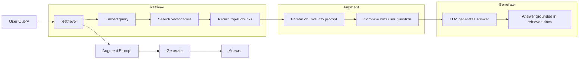
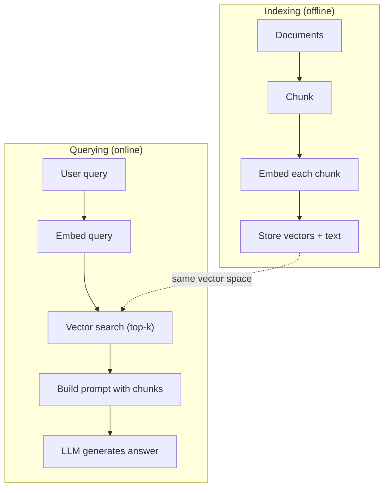

# RAG (Retrieval-Augmented Generation)

> Ваш LLM знает все до момента отсечения обучающих данных. Он ничего не знает о документации вашей компании, вашей кодовой базе или заметках со встречи на прошлой неделе. RAG решает это, извлекая релевантные документы и помещая их в prompt. Это самый широко применяемый паттерн в production AI. Если вы построите из этого курса только одну вещь, постройте RAG pipeline.

**Тип:** Сборка
**Языки:** Python
**Предварительные требования:** Phase 10 (LLMs from Scratch), Phase 11 Lessons 01-05
**Время:** ~90 минут
**Связано:** Phase 5 · 23 (Chunking Strategies for RAG) для шести алгоритмов chunking и того, когда каждый из них выигрывает. Phase 5 · 22 (Embedding Models Deep Dive) для выбора embedder. Phase 11 · 07 (Advanced RAG) для hybrid search, reranking и query transformation.

## Цели обучения

- Построить полный RAG pipeline: document loading, chunking, embedding, vector storage, retrieval и generation
- Реализовать semantic search с помощью vector database (ChromaDB, FAISS или Pinecone) с правильным indexing
- Объяснить, почему RAG предпочтительнее fine-tuning для knowledge-grounded applications (cost, freshness, attribution)
- Оценивать качество RAG с помощью retrieval metrics (precision, recall) и generation metrics (faithfulness, relevance)

## Проблема

Вы строите chatbot для своей компании. Клиент спрашивает: "What's the refund policy for enterprise plans?" LLM отвечает общим ответом о типичных SaaS refund policies. Реальная policy, спрятанная во внутренней wiki на 200 страниц, говорит, что enterprise customers получают окно в 60 дней с pro-rated refunds. LLM никогда не видел этот документ. Он не может знать то, на чем его не обучали.

Fine-tuning - одно из решений. Возьмите LLM, обучите его на своих internal docs и разверните обновленную модель. Это работает, но имеет серьезные проблемы. Fine-tuning стоит тысячи долларов compute. Модель устаревает в тот момент, когда меняется документ. У вас нет способа узнать, из какого source модель взяла ответ. И если компания в следующем месяце приобретет еще одну product line, вы снова будете делать fine-tune.

RAG - другое решение. Оставьте модель без изменений. Когда приходит вопрос, найдите в document store релевантные passages, вставьте их в prompt перед вопросом и дайте модели ответить, используя эти passages как context. Document store можно обновить за минуты. Вы можете точно увидеть, какие documents были retrieved. Сама модель никогда не меняется. Вот почему RAG является доминирующим паттерном в production: он дешевле, свежее, более auditable и работает с любым LLM.

## Концепция

### Паттерн RAG

Весь паттерн укладывается в четыре шага:



Query -> Retrieve -> Augment prompt -> Generate. Каждая RAG system следует этому паттерну. Различия между production RAG systems находятся в деталях каждого шага: как вы делаете chunking, как вы делаете embedding, как вы выполняете search и как вы строите prompt.

### Почему RAG лучше Fine-Tuning

| Concern | Fine-tuning | RAG |
|---------|------------|-----|
| Cost | $1,000-$100,000+ за training run | $0.01-$0.10 за query (embedding + LLM) |
| Freshness | Устаревает, пока не будет retrained | Обновляется за минуты через re-indexing docs |
| Auditability | Нельзя проследить answer до source | Можно показать exact retrieved passages |
| Hallucination | Все еще свободно hallucinates | Grounded в retrieved documents |
| Data privacy | Training data baked into weights | Documents остаются в вашем vector store |

Fine-tuning навсегда меняет weights модели. RAG временно меняет context модели. Для большинства applications временный context - это именно то, что вам нужно.

Единственный случай, когда fine-tuning выигрывает: когда вам нужно, чтобы модель приняла конкретный style, tone или reasoning pattern, которого нельзя достичь одним только prompting. Для factual knowledge retrieval RAG выигрывает каждый раз.

### Embedding Models

Embedding model преобразует text в dense vector. Похожие тексты создают vectors, которые находятся близко друг к другу в этом high-dimensional space. "How do I reset my password?" и "I need to change my password" создают почти идентичные vectors, несмотря на небольшое количество общих слов. "The cat sat on the mat" создает совсем другой vector.

Распространенные embedding models (линейка 2026 года — полный анализ см. в Phase 5 · 22):

| Model | Dimensions | Provider | Notes |
|-------|-----------|----------|-------|
| text-embedding-3-small | 1536 (Matryoshka) | OpenAI | Лучшее соотношение price/performance для большинства use cases |
| text-embedding-3-large | 3072 (Matryoshka) | OpenAI | Более высокая accuracy, truncatable to 256/512/1024 |
| Gemini Embedding 2 | 3072 (Matryoshka) | Google | Top MTEB retrieval; 8K context |
| voyage-4 | 1024/2048 (Matryoshka) | Voyage AI | Domain variants (code, finance, law) |
| Cohere embed-v4 | 1024 (Matryoshka) | Cohere | Сильная multilingual, 128K context |
| BGE-M3 | 1024 (dense + sparse + ColBERT) | BAAI (open-weight) | Три представления из одной модели |
| Qwen3-Embedding | 4096 (Matryoshka) | Alibaba (open-weight) | Лучший open-weight retrieval score |
| all-MiniLM-L6-v2 | 384 | Open-weight (Sentence Transformers) | Prototyping baseline |

В этом уроке мы строим собственный простой embedding с помощью TF-IDF. Не потому, что TF-IDF используют production systems, а потому, что он делает концепцию конкретной: text входит, vector выходит, похожие тексты создают похожие vectors.

### Vector Similarity

Имея два vectors, как измерить similarity? Есть три варианта:

**Cosine similarity**: cosine угла между двумя vectors. Диапазон от -1 (противоположные) до 1 (идентичные). Игнорирует magnitude, учитывает только direction. Это default для RAG.

```
cosine_sim(a, b) = dot(a, b) / (||a|| * ||b||)
```

**Dot product**: исходный inner product. Более крупные vectors получают более высокие scores. Полезно, когда magnitude несет информацию (более длинные documents могут быть более relevant).

```
dot(a, b) = sum(a_i * b_i)
```

**L2 (Euclidean) distance**: расстояние по прямой в vector space. Меньшая distance = больше similarity. Чувствителен к различиям magnitude.

```
L2(a, b) = sqrt(sum((a_i - b_i)^2))
```

Cosine similarity - это стандарт. Он аккуратно работает с documents разной длины, потому что нормализует по magnitude. Когда кто-то говорит "vector search," почти всегда имеется в виду cosine similarity.

### Chunking Strategies

Documents слишком длинные, чтобы embed их как одиночные vectors. PDF на 50 страниц может создать ужасный embedding, потому что содержит десятки topics. Вместо этого вы делите documents на chunks и embed каждый chunk отдельно.

**Fixed-size chunking**: разделять каждые N tokens. Просто и предсказуемо. Chunk на 512 tokens с overlap 50 tokens означает, что chunk 1 - это tokens 0-511, chunk 2 - это tokens 462-973 и так далее. Overlap гарантирует, что вы не разрежете sentence на неудачной границе.

**Semantic chunking**: разделять по естественным границам. Paragraphs, sections или markdown headers. Каждый chunk - это coherent unit of meaning. Реализовать сложнее, но retrieval получается лучше.

**Recursive chunking**: сначала попытаться разделить по самой крупной границе (section headers). Если section все еще слишком большая, разделить по paragraph boundaries. Если paragraph все еще слишком большой, разделить по sentence boundaries. Это подход LangChain RecursiveCharacterTextSplitter, и на практике он хорошо работает.

Chunk size важнее, чем думают люди:

- Слишком маленький (64-128 tokens): каждому chunk не хватает context. "It increased 15% last quarter" ничего не значит без знания, к чему относится "it".
- Слишком большой (2048+ tokens): каждый chunk покрывает несколько topics, размывая relevance. Когда вы ищете revenue data, вы получаете chunk, который на 10% о revenue и на 90% о headcount.
- Оптимальная зона (256-512 tokens): достаточно context, чтобы быть self-contained, и достаточно focus, чтобы быть relevant.

Большинство production RAG systems используют chunks по 256-512 tokens с overlap 50 tokens. Anthropic's RAG guidelines рекомендуют этот диапазон.

### Vector Databases

Когда у вас есть embeddings, вам нужно место, где их хранить и искать. Варианты:

| Database | Type | Best for |
|----------|------|----------|
| FAISS | Library (in-process) | Prototyping, small to medium datasets |
| Chroma | Lightweight DB | Local development, small deployments |
| Pinecone | Managed service | Production without ops overhead |
| Weaviate | Open source DB | Self-hosted production |
| pgvector | Postgres extension | Already using Postgres |
| Qdrant | Open source DB | High-performance self-hosted |

В этом уроке мы строим простой in-memory vector store. Он хранит vectors в list и выполняет brute-force cosine similarity search. Это эквивалентно FAISS с flat index. Он масштабируется примерно до 100,000 vectors, прежде чем начнет тормозить. Production systems используют approximate nearest neighbor (ANN) algorithms вроде HNSW, чтобы искать миллионы vectors за миллисекунды.

### Полный Pipeline



Фаза indexing запускается один раз на document (или когда documents обновляются). Фаза querying запускается на каждый user request. В production indexing может обрабатывать миллионы documents в течение часов. Querying должен отвечать меньше чем за секунду.

### Реальные числа

Большинство production RAG systems используют такие параметры:

- **k = 5 to 10** retrieved chunks на query
- **Chunk size = 256 to 512 tokens** с overlap 50 tokens
- **Context budget**: 2,500-5,000 tokens retrieved content на query
- **Total prompt**: ~8,000-16,000 tokens (system prompt + retrieved chunks + conversation history + user query)
- **Embedding dimension**: 384-3072 в зависимости от model
- **Indexing throughput**: 100-1,000 documents в секунду с API embeddings
- **Query latency**: 50-200ms для retrieval, 500-3000ms для generation

## Собираем

### Шаг 1: Нарезка документов

```python
def chunk_text(text, chunk_size=200, overlap=50):
    words = text.split()
    chunks = []
    start = 0
    while start < len(words):
        end = start + chunk_size
        chunk = " ".join(words[start:end])
        chunks.append(chunk)
        start += chunk_size - overlap
    return chunks
```

### Шаг 2: TF-IDF эмбеддинги

Мы строим простую embedding function. TF-IDF (Term Frequency-Inverse Document Frequency) не является neural embedding, но он преобразует text в vectors способом, который отражает word importance. Частые words в document получают более высокий TF. Редкие words во всем corpus получают более высокий IDF. Произведение дает vector, где important, distinctive words имеют высокие values.

```python
import math
from collections import Counter

def build_vocabulary(documents):
    vocab = set()
    for doc in documents:
        vocab.update(doc.lower().split())
    return sorted(vocab)

def compute_tf(text, vocab):
    words = text.lower().split()
    count = Counter(words)
    total = len(words)
    return [count.get(word, 0) / total for word in vocab]

def compute_idf(documents, vocab):
    n = len(documents)
    idf = []
    for word in vocab:
        doc_count = sum(1 for doc in documents if word in doc.lower().split())
        idf.append(math.log((n + 1) / (doc_count + 1)) + 1)
    return idf

def tfidf_embed(text, vocab, idf):
    tf = compute_tf(text, vocab)
    return [t * i for t, i in zip(tf, idf)]
```

### Шаг 3: Поиск по cosine similarity

```python
def cosine_similarity(a, b):
    dot = sum(x * y for x, y in zip(a, b))
    norm_a = math.sqrt(sum(x * x for x in a))
    norm_b = math.sqrt(sum(x * x for x in b))
    if norm_a == 0 or norm_b == 0:
        return 0.0
    return dot / (norm_a * norm_b)

def search(query_embedding, stored_embeddings, top_k=5):
    scores = []
    for i, emb in enumerate(stored_embeddings):
        sim = cosine_similarity(query_embedding, emb)
        scores.append((i, sim))
    scores.sort(key=lambda x: x[1], reverse=True)
    return scores[:top_k]
```

### Шаг 4: Построение промпта

Здесь и происходит "augmented" в RAG. Возьмите retrieved chunks, отформатируйте их в prompt и попросите LLM ответить на основе предоставленного context.

```python
def build_rag_prompt(query, retrieved_chunks):
    context = "\n\n---\n\n".join(
        f"[Source {i+1}]\n{chunk}"
        for i, chunk in enumerate(retrieved_chunks)
    )
    return f"""Answer the question based ONLY on the following context.
If the context doesn't contain enough information, say "I don't have enough information to answer that."

Context:
{context}

Question: {query}

Answer:"""
```

### Шаг 5: Полный RAG pipeline

```python
class RAGPipeline:
    def __init__(self):
        self.chunks = []
        self.embeddings = []
        self.vocab = []
        self.idf = []

    def index(self, documents):
        all_chunks = []
        for doc in documents:
            all_chunks.extend(chunk_text(doc))
        self.chunks = all_chunks
        self.vocab = build_vocabulary(all_chunks)
        self.idf = compute_idf(all_chunks, self.vocab)
        self.embeddings = [
            tfidf_embed(chunk, self.vocab, self.idf)
            for chunk in all_chunks
        ]

    def query(self, question, top_k=5):
        query_emb = tfidf_embed(question, self.vocab, self.idf)
        results = search(query_emb, self.embeddings, top_k)
        retrieved = [(self.chunks[i], score) for i, score in results]
        prompt = build_rag_prompt(
            question, [chunk for chunk, _ in retrieved]
        )
        return prompt, retrieved
```

### Шаг 6: Генерация (симуляция)

В production здесь вы вызываете LLM API. В этом уроке мы simulate generation, извлекая наиболее relevant sentence из retrieved context.

```python
def simple_generate(prompt, retrieved_chunks):
    query_words = set(prompt.lower().split("question:")[-1].split())
    best_sentence = ""
    best_score = 0
    for chunk in retrieved_chunks:
        for sentence in chunk.split("."):
            sentence = sentence.strip()
            if not sentence:
                continue
            words = set(sentence.lower().split())
            overlap = len(query_words & words)
            if overlap > best_score:
                best_score = overlap
                best_sentence = sentence
    return best_sentence if best_sentence else "I don't have enough information."
```

## Использование

С реальной embedding model и LLM код почти не меняется:

```python
from openai import OpenAI

client = OpenAI()

def embed(text):
    response = client.embeddings.create(
        model="text-embedding-3-small",
        input=text
    )
    return response.data[0].embedding

def generate(prompt):
    response = client.chat.completions.create(
        model="gpt-4o-mini",
        messages=[{"role": "user", "content": prompt}],
        temperature=0
    )
    return response.choices[0].message.content
```

Или с Anthropic:

```python
import anthropic

client = anthropic.Anthropic()

def generate(prompt):
    response = client.messages.create(
        model="claude-sonnet-4-20250514",
        max_tokens=1024,
        messages=[{"role": "user", "content": prompt}]
    )
    return response.content[0].text
```

Pipeline тот же. Замените embedding function. Замените generation function. Retrieval logic, chunking, prompt construction -- все идентично независимо от того, какие models вы используете.

Для vector storage на scale замените brute-force search на правильную vector database:

```python
import chromadb

client = chromadb.Client()
collection = client.create_collection("my_docs")

collection.add(
    documents=chunks,
    ids=[f"chunk_{i}" for i in range(len(chunks))]
)

results = collection.query(
    query_texts=["What is the refund policy?"],
    n_results=5
)
```

Chroma обрабатывает embedding internally (по default он использует all-MiniLM-L6-v2) и хранит vectors в local database. Тот же pattern, другая plumbing.

## Результат

Этот урок создает:
- `outputs/prompt-rag-architect.md` -- prompt для проектирования RAG systems под specific use cases
- `outputs/skill-rag-pipeline.md` -- skill, который учит agents строить и debug RAG pipelines

## Упражнения

1. Замените TF-IDF embeddings простым подходом bag-of-words (binary: 1 if word present, 0 if not). Сравните retrieval quality на sample documents. TF-IDF должен превзойти его, потому что он дает rare words больший weight.

2. Поэкспериментируйте с chunk sizes: попробуйте 50, 100, 200 и 500 words на одном и том же document set. Для каждого size запустите одни и те же 5 queries и посчитайте, сколько из них возвращают relevant chunk в top-3. Найдите sweet spot, где retrieval quality достигает пика.

3. Добавьте metadata к каждому chunk (source document name, chunk position). Измените prompt template, чтобы включить source attribution, так чтобы LLM цитировал свои sources.

4. Реализуйте простую evaluation: имея 10 question-answer pairs, пропустите каждый question через RAG pipeline и измерьте, какой процент retrieved chunks содержит answer. Это retrieval recall at k.

5. Постройте conversation-aware RAG pipeline: поддерживайте history последних 3 exchanges и включайте их в prompt вместе с retrieved chunks. Протестируйте с follow-up questions вроде "What about enterprise?" после вопроса о pricing.

## Ключевые термины

| Term | Как говорят | Что это на самом деле значит |
|------|------------|------------------------------|
| RAG | "AI that reads your docs" | Извлечь relevant documents, вставить их в prompt и сгенерировать answer, grounded в этих documents |
| Embedding | "Convert text to numbers" | Dense vector representation of text, где похожие meanings создают похожие vectors |
| Vector database | "Search engine for AI" | Data store, оптимизированный для хранения vectors и поиска nearest neighbors по similarity |
| Chunking | "Split docs into pieces" | Разбиение documents на более мелкие segments (обычно 256-512 tokens), чтобы каждый можно было embed и retrieve независимо |
| Cosine similarity | "How similar are two vectors" | Cosine угла между двумя vectors; 1 = identical direction, 0 = orthogonal, -1 = opposite |
| Top-k retrieval | "Get the k best matches" | Вернуть k most similar chunks к query из vector store |
| Context window | "How much text the LLM can see" | Maximum number of tokens, которое LLM может обработать в одном request; retrieved chunks должны помещаться в него |
| Augmented generation | "Answer using given context" | Генерация response с использованием retrieved documents как context вместо опоры только на trained knowledge |
| TF-IDF | "Word importance scoring" | Term Frequency times Inverse Document Frequency; взвешивает words по тому, насколько distinctive они внутри corpus |
| Indexing | "Preparing docs for search" | Offline process chunking, embedding и storing documents, чтобы их можно было искать во время query |

## Дополнительное чтение

- Lewis et al., "Retrieval-Augmented Generation for Knowledge-Intensive NLP Tasks" (2020) -- оригинальная статья о RAG от Facebook AI Research, которая формализовала паттерн retrieve-then-generate
- Anthropic's RAG documentation (docs.anthropic.com) -- практические guidelines для chunk sizes, prompt construction и evaluation
- Pinecone Learning Center, "What is RAG?" -- понятные visual explanations RAG pipeline с production considerations
- Sentence-BERT: Reimers & Gurevych (2019) -- статья, лежащая в основе embedding models all-MiniLM, показывающая, как обучать bi-encoders для semantic similarity
- [Karpukhin et al., "Dense Passage Retrieval for Open-Domain Question Answering" (EMNLP 2020)](https://arxiv.org/abs/2004.04906) -- статья DPR, которая доказала, что dense bi-encoder retrieval превосходит BM25 в open-domain QA и задала паттерн для современных RAG retrievers.
- [LlamaIndex High-Level Concepts](https://docs.llamaindex.ai/en/stable/getting_started/concepts.html) -- основные concepts, которые нужно знать при построении RAG pipelines: data loaders, node parsers, indices, retrievers, response synthesizers.
- [LangChain RAG tutorial](https://python.langchain.com/docs/tutorials/rag/) -- orchestrator противоположного вкуса; chain-of-runnables view того же паттерна retrieve-then-generate.
